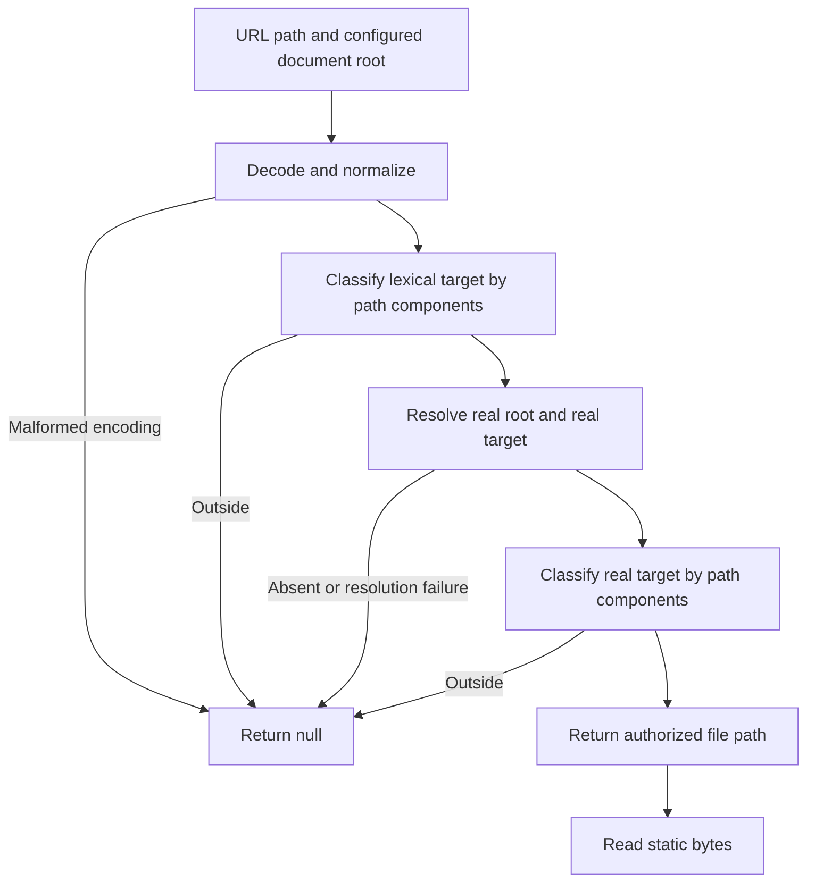
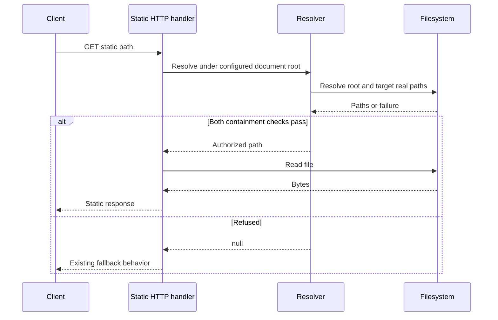
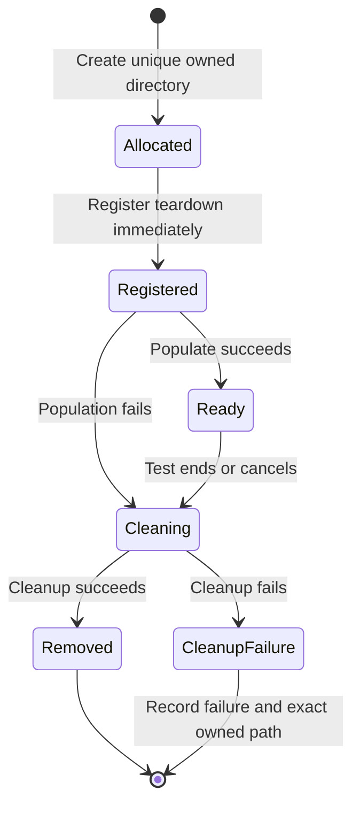

# Astra Reply — subscription transport — 2026-09-21T17:40:29.584Z

**Provider:** openai-codex
**Billing:** chatgpt-subscription
**Authentication:** chatgpt_subscription
**Transport:** codex-cli
**Requested model:** gpt-6-astra
**Served model:** NOT OBSERVABLE on codex-cli (see SERVED_MODEL_UNVERIFIABLE_NOTE)
**Reasoning effort:** high
**Tokens:** in=95291 out=16084 reasoning=7262
**Packet:** `docs/ai-workflow/blueprints/creator-brains-console-20260917/17-astra-mega-packet-r9.md`
**Wall:** 499.7s
**Mega Blueprint:** ARMED (document)

> Marginal cost $0 — this leg rides the ChatGPT subscription, not OpenRouter.

---
Mega Blueprint. I’ll review only the supplied packet, distinguish source-level findings from unverified runtime claims, and emit the corrected nine-document package.

The packet shows two material problems: static containment checks path text but follows filesystem links when reading, and the new `sk-` boundary misses keys immediately after JSON-escaped newlines. The inverted-assertion mutant staying green also indicates that the changed assertion was never reached. Several redactor fixtures arrived already redacted, so their supplied pass counts cannot be independently checked from these bytes.

The containment predicates agree algebraically whenever `path.relative(root, target)` is non-empty; the documented exception is broader than literal `target === root`. The fixture cleanup now targets the captured directory correctly, but write failures occur before cleanup registration, and each successful call retains an exit listener. I’m carrying those fixes into the package and keeping runtime verification marked NOT RUN.

## PART A — HOSTILE REVIEW

**Disposition: REVISE. Runtime verification: NOT RUN. Archive: NOT FILED.** This consult uses only the supplied packet; its scope prohibits filesystem access, execution, and archive writes.

[VERIFIED] below means established from the supplied text or directly from its expressions. It does not certify the checkout. Function and test-title anchors identify sections of supplied documents where numbered lines were not provided.

### A1 — Review of the supplied artifacts

1. **P2 — The inverted mutant exposes an unexecuted assertion, not merely redundant protection.**

   **Evidence:** `bridge.hy4.test.mjs#HY4-H3: static containment holds against a real document root`; packet §4, “2 NO-RED-AS-PREDICTED.”

   **[VERIFIED] Wrong:** The test creates `dist/inside.txt` and an external `outside.txt`. None of its hostile inputs names an existing file within `dist`. The positive control runs separately, outside the changed assertion. Consequently, the hostile loop can return `null` throughout without executing `!escapes(dist, resolved)` once.

   Production containment explains why reverting to a weaker prefix assertion can remain green. It does **not** explain why inverting a reached assertion remains green: an actual inside result makes `escapes(dist, resolved)` false and the inverted assertion fail.

   **Observe:** Count non-null results inside the hostile loop and require at least one. Alternatively, create `dist/outside.txt`: `/../outside.txt` normalizes to that contained file, reaching the assertion.

   **Fix:** Add a deliberate non-null contained case through the same assertion, bind the inverted mutant to RED, and retain prefix reversion as a separately explained negative control. A test assertion is never a runtime barrier between a leak and HTTP 200.

2. **P2 — Static containment is lexical; a filesystem link bypasses its stated boundary.**

   **Evidence:** `lib/http.mjs:279`, `lib/http.mjs#readStatic`; its header claims the formulation survives symlinks.

   **[VERIFIED] Wrong:** `resolveStatic()` checks the pathname and existence, then `readStatic()` follows filesystem links. A directory junction at `dist/linked` pointing to an external directory passes `target.startsWith(base + sep)` for `/linked/secret.txt`.

   The new validator also compares lexical paths, so changing its predicate does not expose this escape.

   **Observe:** Create a private fixture containing `dist/linked → outside`, with `outside/secret.txt` holding a unique canary. Call the supplied resolver and reader. The resolver returns the lexical inside path; the reader follows the junction.

   **[UNKNOWN] Runtime reach:** The supplied corpus does not establish a live HTTP response for this fixture or an attacker’s ability to alter `WEB_DIST`.

   **Fix:** Require both lexical and resolved-path containment before returning a static file. Add a real junction regression plus a legitimate-file control. State that check-then-read remains subject to concurrent filesystem replacement; do not claim race-resistant file access.

   This is a containment gap visible in the supplied production code. It does not establish another occurrence of the exact naked-prefix expression being swept.

3. **P1 — The new `sk-` boundary misses keys after JSON-escaped whitespace at the transport boundary.**

   **Evidence:** `scripts/lib/redact-egress.mjs:83`; `#fetchForEgress`; `scripts/lib/redact-egress.test.mjs#ROUND 9: contexts`.

   **[VERIFIED] Wrong:** Construct a synthetic key without placing a contiguous key in source:

   ```js
   const key = ['sk-', 'AbCdEfGhIjKlMnOpQrStUv'].join('');
   const body = JSON.stringify({ content: '\n' + key });
   ```

   In `body`, the character immediately before `sk-` is the literal `n` from `\n`. It satisfies `\w`, so the new lookbehind rejects the match. Serialized tab and carriage return have the same problem. This matters because `fetchForEgress()` redacts the **serialized body**.

   **Observe:** Capture `fetchImpl` and require the captured body to exclude `key`. No external request is necessary.

   The hyphen exemption also treats `prefix-` followed by an actual key as harmless by construction. The test’s assertion that a preceding hyphen makes something “a compound, not a key” is not an evidence-based distinction.

   **Fix:** Cover serialized whitespace explicitly and remove the categorical hyphen exemption. For this bounded repair, the proposed recognizer is:

   ```js
   /(?:(?<!\w)|(?<=\\[nrt]))sk-[A-Za-z0-9_-]{12,}/g
   ```

   Preserve the supplied ordinary `task-`, `risk-`, and `disk-` controls. Change the `prefix-sk-…` control to expect conservative redaction. This is a defined heuristic, not proof that every possible secret representation is covered.

   **[UNKNOWN] Checkout behavior:** The sanitized canaries discussed below prevent treating the supplied module as an executable reproduction of the reported green checkout.

4. **P2 — The supplied redactor evidence cannot reproduce its reported successful run.**

   **Evidence:** `redact-egress.mjs:88–106`, `:180–182`; `redact-egress.test.mjs#REGRESSION 1B`, `#ROUND 9: contexts`, and `#THE CONTROL`.

   **[VERIFIED] Wrong in this review artifact:**

   - Several canary samples are already `<REDACTED-KEY>` or similar replacements. `selfTest()` subsequently searches for their first twelve characters in output that still contains those markers and reports failure.
   - The boundary examples already contain replacement markers. Their assertions can pass without recognizing any key.
   - Several path controls start with `<PATH>`; they cannot establish that a path detector fired.
   - The transport header is supplied as `Bearer <REDACTED-KEY>`, while its assertion looks for `sk-realkey`.

   **[UNKNOWN] Cause:** These may be transport sanitizations rather than defects in the repository. They must not be reported as confirmed production failures.

   **Observe:** Evaluate the supplied sample/probe relationship directly. No reported “56 pass” result can certify these exact bytes.

   **Fix:** Supply a review-safe synthetic fixture source assembled from non-secret fragments, together with source hashes and its execution receipt. Test each recognizer independently: prove its synthetic input matches, its expected replacement occurs, and disabling that recognizer fails its own test. Keep the combined canary as an additional check.

   The load-bearing artifact is the **synthetic canary/test source before packet redaction**, not unrelated repository context.

5. **P2 — Fixture cleanup still has failure-path leaks and retains one exit listener per allocation.**

   **Evidence:** `bridge.containment.test.mjs:61–80`, `#T-B25e`.

   **[VERIFIED] Corrected:** The current removal target is the captured `owner`; the previous parent-of-parent deletion is absent.

   **[VERIFIED] Remaining defects:**

   - Cleanup registration occurs after directory creation and all three writes. A write failure leaves the allocated directory without this cleanup handler.
   - Each successful allocation adds an exit listener that remains until process exit. Repeated allocations in one process accumulate listeners and closures.
   - T-B25e still requests constant `outside-t-b25e` names, while the created directory now includes a UUID. Its canary fixture is disconnected from those attack strings.

   **Observe:** Inject failure on the first document write; repeat allocations within one process and compare `process.listenerCount('exit')`; compare the T-B25e request names with the returned outside directory.

   **Fix:** Allocate a uniquely owned directory, immediately register test-scoped cleanup, then populate it. Clean up synchronously on population failure. Use the actual allocated basename in attack vectors. If an exit fallback is retained, use one module-level handler and a registry whose entries are removed after cleanup.

6. **P3 — Predicate equivalence is sound, but the documented exception is too narrow.**

   **Evidence:** `test/path-containment.mjs#THE ONE INPUT WHERE THIS IS NOT SIMPLY !inside()`; `lib/containment.mjs#inside`.

   **[VERIFIED] Algebra:**

   ```text
   inside(root, target)
     = relative(root, target) !== '' && !escapes(root, target)
   ```

   The exception is **every input pair producing an empty relative path**, not only identical argument strings. For example, `root` and `root + sep + '.'` are different strings naming the same normalized path.

   **Observe:** Pass those two spellings to both functions; both return false.

   **Fix:** Document normalized-path equality and test it. No supplied input with a non-empty relative result establishes disagreement between these implementations.

   **Additional edge:** `http.mjs:279` appends a separator even when `base` is a filesystem root. For `/`, that produces `//` and refuses ordinary descendants. Fix that helper boundary using component-aware relative-path classification; do not characterize it as a demonstrated defect in the normal `WEB_DIST` configuration.

7. **P2 — The supplied contract readers retain silent omission and legal-input refusal paths.**

   **Evidence:** `contract-table.mjs#wholeObjectShape`, `#rowIndexes`; `contract-scan.mjs#interfaceFields`; `contract-parse.r8.test.mjs#R8-03` and `#R8-04`.

   **[VERIFIED] Three reproducible source-level problems:**

   | Reader | Input | Current consequence | Concrete fix |
   |---|---|---|---|
   | `wholeObjectShape` | `{a: 'it\'s'; b: number}` | Escaped quote closes the literal; the later quote opens another; the closing brace is swallowed. | Track escape state in this scanner too. |
   | `rowIndexes` | Four-backtick opener, three-backtick content, example row, four-backtick closer | Fence state records only marker character, so the shorter marker exposes the example row. | Track opening length and validate closing-fence syntax. |
   | `interfaceFields` | `export interface X { a: string` followed by a newline and `foo(): void` then `}` | The newline probe cannot read a method, does not re-arm member parsing, and the method disappears. | Refuse unsupported member declarations instead of treating them as type continuation. |

   **Observe:** Run each example against the exported helper with an explicit expected result or refusal.

   **Fix scope:** These belong to previously identified parser defect classes. They are additional surviving sites, not new product features and not evidence of another path-containment prefix predicate.

8. **P3 — Current planning documents still provide conflicting execution instructions.**

   **Evidence:** `08-slices-operations.md#slice table`; `19-held-findings.md#4` versus `#7`; `07-traceability.md#Coverage flags`; packet §3.

   **[VERIFIED] Contradictions:**

   - S3’s entry requires S2 exit, while its dependency column says S1. S4 similarly requires S3 exit but lists S1.
   - `19 §4` gates both repair and daily run; `19 §7` still describes the journal finding as a gate on S4.
   - `07` identifies S0/S1 as SOURCE BUILT; the packet calls them “shipped.”
   - The mock-only statement conflicts with explicitly described fake-fetch and browser tests.

   **Fix:** Preserve the stricter sequential dependencies; apply the journal gate to both S3 and S4; use SOURCE BUILT until the required exit evidence is supplied; replace the mock claim with a boundary-specific matrix.

   These are documentary corrections and restatements of already acknowledged limitations. They do not close R2-07, R2-08, or deferred feature work.

### Coverage of all other secret-shape rows

[VERIFIED] The supplied table contains **20 rows**, hence **19 neighbours** of `sk-`, not 18. This is a source audit, not a provider-format certification.

| Row | Packet-bounded assessment and required disposition |
|---|---|
| `sk_(live|test)_` | `task_live_identifier` contains a matching substring. Add a word-boundary control and fix the overmatch. |
| `rk_live_` | `work_live_configuration` contains a matching substring. Same repair class. |
| `whsec_` | Embedded matches are allowed. Establish synthetic standalone, embedded, and near-threshold controls; no specific ordinary-English collision established. |
| `xoxb-` | Same embedded-match policy; provider completeness unverified. |
| `AIza` | Canary is sanitized; effectiveness cannot be certified from it. |
| `rnd_` | Same evidence limitation. |
| `gh[pousr]_` | Same evidence limitation; test each declared alternative independently. |
| `github_pat_` | Same evidence limitation; test underscore-bearing tails. |
| `SG.…` | Test both segments and their minimum lengths independently. |
| `lin_api_` | Sanitized canary; no additional concrete bypass established here. |
| JWT-shaped row | An unanchored shape heuristic. Test three segments independently; do not call it JWT validation. |
| `Bearer` | Also matches prose such as `Bearer authentication-mechanism`. Explicitly accept conservative redaction for bearer-shaped strings; do not promise prose preservation here. |
| Bot-token row | A 30-character allowed tail ending in `-` can fail the final `\b`. Replace the word boundary with a boundary based on the declared token alphabet. Actual provider issuance of that shape is unverified. |
| PEM | Test multiline matching and termination. Matching BEGIN/END labels are not enforced; document whether conservative over-redaction is accepted. |
| Database URL | Broad scheme-based redaction includes URLs without credentials. Preserve that conservative policy explicitly. |
| Email | Broad heuristic; sanitized canary cannot demonstrate operation. |
| Phone | Test every separator/parenthesis form the regex claims. International-number coverage is not established. |
| Keyed numeric ID | Test threshold, negative values, and serialized JSON keys. The regex does not accommodate a closing quote between `"chat_id"` and `:`. |
| Bare numeric ID | Preserve its documented ten-digit threshold and timestamp/SHA controls; do not use it to claim seven-digit JSON IDs are protected. |

**300-line disposition:** [UNKNOWN] The packet reports 296 lines, but supplies neither a byte-identical source receipt nor the pre-change diff needed to attribute the exact headroom consumed. The boundary explanation visibly adds substantial commentary. Extracting secret recognition, samples, and their self-check into a policy module is a coherent seam; reducing diagnostics or compressing code merely to fit is not. A passing cap does not itself require an immediate refactor.

**Sweep disposition:** [UNKNOWN] Package-wide completeness cannot be independently established from the excerpts. The inventory and mutation receipts are reported evidence. The supplied production static reader nevertheless exposes a distinct containment limitation, and the changed assertion’s reported polarity result does not support the explanation attached to it.

### A2 — One review of the draft package

The draft was reviewed once and amended as follows:

1. **A lexical-only static regression would still pass a junction escape.** The emitted tests now construct a real directory link and seed readable outside content.
2. **A test demanding every traversal return `null` would reject legitimate normalization behavior.** The package permits contained results and explicitly exercises that branch.
3. **Transport tests could be mistaken for evidence about the sanitized excerpt.** All commands are marked NOT RUN; the faithful synthetic-source receipt is an entry gate.
4. **Calling the predicates exact complements would preserve the same documentation defect.** The contract now conditions equivalence on a non-empty relative path.
5. **Test counts could again substitute for coverage.** Checkpoints require named cases, mutation outcomes, fixture construction, and source identity separately.
6. **A broad “redactor fixed” claim would exceed the proposed repair.** The package names the supported representations and retains the remaining heuristic limitations explicitly.

## PART B — FORGED PACKAGE

### 00-README.md

**Title:** Creator Brains Console — Round 9 adjudication and bounded repair package  
**Status:** PLAN DRAFT — implementation and execution NOT RUN  
**Authority:** Supplied packet only  
**Disposition:** REVISE

This package amends Round 9 containment evidence, redaction boundaries, fixture ownership, supplied contract-reader defects, and contradictory planning instructions. It does not authorize S2–S7 implementation, engine changes, deployment, provider calls, or production-data access.

Requirements:

| ID | Acceptance criterion |
|---|---|
| R9-C1 | Static resolution refuses an existing link escape and still serves a legitimate fixture file. |
| R9-C2 | The changed HY4 assertion is demonstrably reached; its polarity inversion fails. |
| R9-C3 | Predicate documentation and tests cover normalized equality, descendants, parents, siblings, and different roots. |
| R9-E1 | Synthetic keys after raw and JSON-escaped whitespace are absent from captured transport bodies. |
| R9-E2 | Ordinary task/risk/disk compounds survive; hyphen-adjacent key shapes are conservatively redacted. |
| R9-E3 | Every secret row has an independently effective synthetic control; sanitized placeholders cannot serve as positive evidence. |
| R9-F1 | Fixture allocation, partial population failure, and teardown leave no owned directories or accumulating listeners. |
| R9-P1 | Supplied contract readers neither silently omit unsupported members nor misread escaped literals/fences. |
| R9-D1 | Current dependencies, gates, status language, and mock boundaries agree. |

Preservation: retain existing commits, historical review receipts, and original measurements. Append a new adjudication; do not rewrite historical runs into current evidence.

Archival status: **NOT FILED**. A downstream seat with filesystem access must archive this pass under Rule 86 before claiming that local workflow complete.

### 01-architecture.md

**Entry points**

- Static-file policy: `packages/creator-brains-console/lib/http.mjs#resolveStatic`.
- Independent path oracle: `test/path-containment.mjs#escapes`.
- Egress boundary: `scripts/lib/redact-egress.mjs#fetchForEgress`.
- External fixture ownership: `test/bridge.containment.test.mjs#outsideBrain`.
- Contract readers: `test/contract-table.mjs` and `test/contract-scan.mjs`.

Production static containment and test-oracle implementations remain independent. Sharing arithmetic through the production function would make the oracle unable to detect that function’s regression.

**Static-file decision flow — proposed contract**



This closes stable symlink/junction escapes. It does not establish atomic protection against concurrent path replacement between checking and opening.

**Static HTTP interaction — required behavior, live wiring unverified**



The package does not invent a new fallback status or a `startBridge` configuration option absent from the corpus.

**Egress interaction**

```mermaid
sequenceDiagram
    participant A as Consult caller
    participant G as fetchForEgress
    participant R as Redactor
    participant T as Injected transport
    A->>G: Final serialized body
    G->>G: Existing provider authorization gates
    G->>R: Canary check and body redaction
    alt Instrument or policy failure
        R-->>G: Throw
        G-->>A: Refusal; transport not called
    else Successful redaction
        R-->>G: Redacted body and hit report
        G->>T: Original headers plus redacted body
        T-->>G: Response
        G-->>A: Response
    end
```

**Fixture lifecycle**



User-screen flows: **N/A — scope-bounded consult, no repository surface in scope.** This repair introduces no screen.

ERD: **N/A — no database tables, column changes, or migrations are introduced.** The packet does not provide a complete engine schema from which to manufacture an ER diagram.

Diagrams are supplied as literal Mermaid. Rendering was not executed.

### 02-wireframes.md

**N/A — scope-bounded consult, no repository surface in scope.**

This round changes guards, validators, test fixtures, and documentation. It introduces no screens, responsive layout, copy strings, or palette tokens.

The previously acknowledged 375px wireframe work remains owed by its owning feature slice. This package neither supplies invented screens nor marks that work complete.

### 03-contracts.md

**Path classification**

For valid string inputs, using the platform’s `node:path` semantics:

```text
rel = relative(root, target)

equal   := rel === ''
outside := rel === '..'
           OR rel starts with '..' followed by the platform separator
           OR rel is absolute

strictlyInside := NOT equal AND NOT outside
```

Raw-string equality is not the equality contract. Case handling follows the selected path implementation.

**Static resolution**

- Preserve the existing decode/normalization policy.
- Require lexical and real-path containment.
- Preserve legitimate files whose names merely begin with dots.
- Refuse stable links outside the real document root.
- Refuse resolution failures; never convert a failed realpath check into authorization.
- Preserve the existing caller fallback for `null`.
- Do not promise atomic protection against concurrent filesystem replacement.

**Redaction policy**

- Preserve existing provider authorization and transport interception.
- Recognize `sk-` shapes after raw boundaries and serialized `\n`, `\r`, and `\t`.
- A hyphen before a key-shaped substring is not grounds for exemption.
- Preserve ordinary supplied task/risk/disk compounds.
- Apply word-boundary controls to the demonstrated `sk_` and `rk_live_` identifier collisions.
- Use token-alphabet boundaries for the bot-token row.
- Recognize quoted JSON keys for keyed numeric IDs without weakening the seven-digit threshold.
- Treat bearer-shaped strings, private-key blocks, and database URLs conservatively.
- Do not claim arbitrary escaped, encoded, split, or adversarial secrets are covered.

**Fixture ownership**

- Owner means the exact directory returned by the allocation primitive.
- Labels are trusted test labels, never arbitrary path fragments.
- Register cleanup before population.
- Cleanup after population failure must preserve the original failure and report cleanup failure separately.
- Never derive deletion targets by walking upward.
- Teardown must remove any fallback-registry entry.
- Request vectors must name the allocated fixture when fixture reachability is claimed.

**Contract-reader grammar**

- Escaped quote handling applies to every literal scanner.
- Fence state includes marker character and opening length.
- Unsupported members must fail explicitly.
- Supporting multiline type continuation must not silently absorb the next declaration.
- Retain document-order semantics where currently required.

Migrations: **N/A — no durable schema changes.**  
Environment variables: no new variables.  
Permissions: existing loopback and provider gates remain applicable.

Rollback: revert explicit repair commits without resetting shared work. A rollback restoring a known containment or egress defect must also withdraw its readiness claim and keep affected use blocked.

### 04-build-order.md

1. **Establish faithful evidence.** Obtain source hashes and review-safe synthetic canary definitions. Do not reproduce the sanitized excerpts as production replacements.
2. **Correct the HY4 test’s reachability.** Observe the polarity mutant fail before changing its evidence classification.
3. **Repair stable static-link containment.** Run the real-junction regression and legitimate-file control.
4. **Repair redaction representations and demonstrated neighbouring rows.** Capture transport locally; make no provider request.
5. **Repair fixture ownership.** Cover population failure, repeated allocations, and actual attack-target reachability.
6. **Repair the supplied contract readers.** Keep extraction, literal scanning, and comparison responsibilities separate.
7. **Reconcile current documentation.** Preserve historical receipts and the existing held-findings decisions.
8. **Execute and archive the review.** Record exact tested source, per-file counts, targeted mutations, remaining limitations, and the archive identifier.

No step advances because another subsystem’s suite is green.

### 05-slices.md

| Slice | Entry | Work | Exit |
|---|---|---|---|
| R9-A | Faithful source identified | Reachability control and predicate contract | Polarity mutant RED; equality/descendant/sibling cases pass |
| R9-B | R9-A | Lexical plus real-path static containment | Real junction refused; legitimate file served |
| R9-C | Synthetic canaries independently valid | Egress boundary and demonstrated neighbouring-row fixes | Captured bodies contain no synthetic key; prose controls pass; per-row mutants fail |
| R9-D | Owned-fixture contract established | Immediate teardown registration, failure cleanup, actual target names | No owned leftovers; listener count stable; attack fixture reached |
| R9-E | Parser counterexamples recorded | Escape, fence, and unsupported-member repairs | Named regressions pass; shipped document controls remain readable |
| R9-F | Relevant repair exits complete | Documentation, combined evidence, archive | Consistent statuses and gates; review filed; unresolved limits retained |

These are repair slices, not replacements for product S0–S7.

**Current product-plan corrections**

- S3 depends on S2 exit.
- S4 depends on S3 exit.
- Both S3 repair and S4 daily-run operations retain the two-process journal-preservation gate.
- S0/S1 remain SOURCE BUILT unless their complete exit evidence is supplied.
- Existing held findings remain held; this package does not silently adjudicate their scope.

### 06-bans.md

- No repository inspection or execution is claimed for this consult.
- No assertion of a complete package-wide sweep from excerpts.
- No sanitized placeholder used as a positive secret-recognition fixture.
- No test count presented as proof that a branch ran.
- No assertion inversion classified as harmless redundancy without reachability evidence.
- No lexical containment claim presented as resolved-filesystem containment.
- No claim of race-resistant file access from `realpath` followed by a separate read.
- No per-allocation permanent process listener.
- No cleanup target derived through parent traversal.
- No automatic retry of uncertain mutations or external provider calls.
- No engine edits, new feature routes, deployment, or main-branch push.
- No line-cap compliance achieved by deleting necessary diagnostics or compressing code.
- No historical review rewritten to appear current.
- No archive-completion claim without an actual filed identifier.

### 07-checkpoints.md

**Evidence receipt**

| Evidence | Current state |
|---|---|
| Supplied-source review | Completed within the packet |
| Checkout/source identity | UNKNOWN |
| Console 289/289 | Reported; not independently executed |
| Redactor 56/9/6/20 | Reported; sanitized source prevents reproduction from this packet |
| Engine 15/15 | Reported; not independently executed |
| Mutation receipts | Reported; polarity interpretation challenged |
| Fixture leak measurements | Reported; exception/reuse paths remain uncovered |
| 296-line measurement | Reported; not independently counted |
| Browser/launcher verification | NOT RUN |
| Hostile-review archive | NOT FILED |

**Required mock-boundary matrix**

| Test boundary | Real component | Substitute | What it does not establish |
|---|---|---|---|
| Static containment | Resolver, reader, filesystem paths | Private temp content | Live route wiring or concurrent replacement safety |
| Junction escape | Real filesystem link | Synthetic outside canary | Attacker control of deployed build files |
| Egress transport | Public redactor/transport wrapper | Capturing `fetchImpl` | Provider acceptance or network behavior |
| Contract parser | Supplied parser functions | Synthetic declarations | Complete TypeScript grammar support |
| UI adapter tests | Adapter/component code, as reported | Fake fetch/browser fixtures | Live bridge/browser integration |
| WebGL tests | UI fallback logic, as reported | WebGL stub | Hardware rendering performance |

For every run, record command, exit code, tested source hash, named failing/passing cases, and per-file totals. An import error, broken canary, or fixture-construction failure is **BLOCKED**, not the intended RED.

The first repaired candidate receives a combined review. Completion remains blocked until relevant tests run and the required archive entry exists.

### 09-tests.md

**Status: emitted test source and specifications; NOT RUN.** The following module is proposed as:

`packages/creator-brains-console/test/round9-adjudication.test.mjs`

It uses only existing exports named in the packet and makes no network request.

```js
import { test } from 'node:test';
import assert from 'node:assert/strict';
import {
  mkdirSync, mkdtempSync, rmSync, symlinkSync, writeFileSync,
} from 'node:fs';
import { tmpdir } from 'node:os';
import { join, sep } from 'node:path';

import { resolveStatic } from '../lib/http.mjs';
import { inside } from '../lib/containment.mjs';
import { escapes } from './path-containment.mjs';
import { wholeObjectShape, rowIndexes } from './contract-table.mjs';
import { interfaceFields } from './contract-scan.mjs';
import {
  fetchForEgress, redactForEgress,
} from '../../../scripts/lib/redact-egress.mjs';

function privateRoot(t) {
  const owner = mkdtempSync(join(tmpdir(), 'console-r9-'));
  t.after(() => rmSync(owner, { recursive: true, force: true }));
  return owner;
}

test('R9-C1: static resolver refuses a real junction escape', (t) => {
  const owner = privateRoot(t);
  const dist = join(owner, 'dist');
  const outside = join(owner, 'outside');
  mkdirSync(dist);
  mkdirSync(outside);
  writeFileSync(join(dist, 'inside.txt'), 'INSIDE');
  writeFileSync(join(outside, 'secret.txt'), 'OUTSIDE-CANARY');
  symlinkSync(outside, join(dist, 'linked'), 'junction');

  assert.equal(
    resolveStatic('/inside.txt', dist),
    join(dist, 'inside.txt'),
  );
  assert.equal(resolveStatic('/linked/secret.txt', dist), null);
});

test('R9-C2: normalized traversal reaches the containment assertion', (t) => {
  const owner = privateRoot(t);
  const dist = join(owner, 'dist');
  mkdirSync(dist);
  writeFileSync(join(dist, 'outside.txt'), 'CONTAINED-CONTROL');

  const resolved = resolveStatic('/../outside.txt', dist);
  assert.equal(resolved, join(dist, 'outside.txt'));
  assert.ok(!escapes(dist, resolved));
});

test('R9-C3: normalized equality is the complement exception', (t) => {
  const root = privateRoot(t);
  const alias = root + sep + '.';
  assert.notEqual(root, alias);
  assert.equal(inside(root, alias), false);
  assert.equal(escapes(root, alias), false);

  for (const target of [
    join(root, 'child'),
    join(root, '..notes'),
    root + '-sibling',
    join(root, '..'),
  ]) {
    assert.equal(inside(root, target), !escapes(root, target));
  }
});

const syntheticKey = ['sk-', 'AbCdEfGhIjKlMnOpQrStUv'].join('');

for (const [name, prefix] of [
  ['newline', '\n'],
  ['carriage return', '\r'],
  ['tab', '\t'],
  ['hyphen', 'prefix-'],
]) {
  test(`R9-E1: transport redacts key after ${name}`, async () => {
    let calls = 0;
    let sent;
    const headers = { 'content-type': 'application/json' };
    await fetchForEgress(
      'https://example.invalid/review',
      {
        method: 'POST',
        headers,
        body: JSON.stringify({ content: prefix + syntheticKey }),
      },
      {
        quiet: true,
        fetchImpl: async (_url, init) => {
          calls += 1;
          sent = init;
          return { ok: true };
        },
      },
    );
    assert.equal(calls, 1);
    assert.equal(sent.headers, headers);
    assert.ok(!sent.body.includes(syntheticKey));
    assert.ok(JSON.parse(sent.body).content.includes('<REDACTED-KEY>'));
  });
}

test('R9-E2: ordinary compounds survive redaction', () => {
  for (const text of [
    'task-runner-identifier',
    'risk-management-framework',
    'disk-usage-reporting',
    'task_live_identifier',
    'work_live_configuration',
  ]) {
    assert.equal(redactForEgress(text).text, text);
  }
});

test('R9-P1a: object extraction respects escaped quotes', () => {
  const shape = "{a: 'it\\'s'; b: number}";
  assert.equal(wholeObjectShape(shape, 'synthetic response'), shape);
});

test('R9-P1b: a shorter fence cannot expose example rows', () => {
  const lines = [
    '````md',
    '```',
    '| `POST /api/x` | `200 {a: string}` |',
    '````',
  ];
  assert.deepEqual(rowIndexes(lines, 'POST /api/x'), []);
});

test('R9-P1c: unsupported newline member is not silently dropped', () => {
  const source = [
    'export interface X {',
    '  a: string',
    '  foo(): void',
    '}',
  ].join('\n');
  assert.throws(
    () => interfaceFields(source, 'X'),
    /unsupported contract member/,
  );
});
```

**Exact targeted command, from the repository root:**

```powershell
node --test packages/creator-brains-console/test/round9-adjudication.test.mjs
```

A failure constructing the junction blocks that case; it must not be converted into an unnoticed passing skip.

**Additional required cases**

These specifications remain implementation work; their existence or passage is not claimed.

| Proposed file | Named case | What it proves |
|---|---|---|
| `test/fixture-ownership.r9.test.mjs` | `R9-F1a: population failure removes allocated owner` | A failed write cannot bypass cleanup registration. |
| Same | `R9-F1b: repeated allocations do not accumulate exit listeners` | Fifty allocations and teardowns restore listener/registry baselines. |
| Same | `R9-F1c: sibling sentinel survives cleanup` | Removal targets only the allocated owner. |
| Same | `R9-F1d: attack vectors name the allocated outside directory` | A UUID change cannot disconnect the canary fixture. |
| `scripts/lib/redact-egress.rows.r9.test.mjs` | `R9-E3: each of 20 recognizers catches its own synthetic shape` | No placeholder or unrelated row can certify another recognizer. |
| Same | `R9-E4: minimum bot-token tail ending in hyphen is redacted` | Token-alphabet boundary works at the lower limit. |
| Same | `R9-E5: seven-digit quoted JSON chat_id is redacted` | JSON key spelling does not bypass keyed-ID policy. |
| Same | `R9-E6: disabling each recognizer fails its assigned control` | Per-row evidence is falsifiable. |

**Commands after those files are implemented:**

```powershell
node --test packages/creator-brains-console/test/fixture-ownership.r9.test.mjs
node --test scripts/lib/redact-egress.rows.r9.test.mjs
node scripts/lib/redact-egress.test.mjs
node --test packages/creator-brains-console/test/*.test.mjs
```

Do not invent paths for the other reported redaction suites; their exact commands belong in the downstream execution receipt.

**Mutation obligations**

- Invert the reached HY4 containment assertion → its named case fails.
- Revert only that assertion to naked prefix comparison → classify the result separately; do not confuse it with reachability.
- Remove static real-path containment → real-junction case fails.
- Remove serialized-whitespace recognition → transport whitespace cases fail.
- Restore hyphen exemption → hyphen transport case fails.
- Remove quote escape handling → object extraction case fails.
- Forget fence length → shorter-fence case fails.
- Restore silent unsupported-member omission → interface-member case fails.

## PART C — DECISION-DENSITY SELF-TEST

| Remaining choice | Decision or bounded delegation |
|---|---|
| What is being repaired? | Round 9 evidence and the concrete supplied-source defects above; no new console feature. |
| Is the sweep complete? | Not independently established. Downstream inventory must name scope, exclusions, and classified hits. |
| Are `inside` and `escapes` inconsistent? | No counterexample for non-empty relative paths; document normalized equality correctly. |
| Does the static guard cover links? | Require lexical and real-path containment. |
| Does it cover filesystem replacement races? | No such claim; concurrent mutation protection remains outside this repair. |
| Must traversal always return `null`? | No. A normalized contained file may be returned. |
| How is HY4 assertion reachability established? | Seed a contained target and require a non-null result through that assertion. |
| What happens to hyphen-adjacent key shapes? | Conservatively redact; preceding hyphen does not prove harmlessness. |
| Which serialized representations are added? | JSON `\n`, `\r`, and `\t`; no universal encoding-coverage claim. |
| How are other redactor rows certified? | Independent synthetic controls and row-specific mutants for all 20 rows. |
| Are sanitized fixtures usable as positive controls? | No. Obtain faithful, review-safe synthetic source and hashes. |
| Which redactor overmatches are repaired now? | Demonstrated `sk_`/`rk_live_` compounds; other conservative policies are stated explicitly. |
| Who owns temporary directories? | The allocating helper; exact captured owner only. |
| How is cleanup registered? | Before population, with immediate failure cleanup and test-scoped teardown. |
| Is an exit fallback permitted? | One module-level handler with removable registry entries; no per-allocation listener. |
| How are unsupported contract declarations handled? | Explicit refusal, never omission. Implementation may use the existing parser seams. |
| Must the redactor be split immediately? | Only if the repair exceeds the cap or mixes responsibilities; secret policy/self-check is the approved extraction seam. |
| Are S0/S1 shipped? | This package uses SOURCE BUILT until full exit evidence establishes more. |
| Which operations need journal preservation? | Both repair and daily run. |
| Are UI artifacts missing from this repair? | N/A for this bounded work; existing 375px feature obligations remain pending. |
| Have proposed tests run? | No. Executable source and outstanding specifications are distinguished explicitly. |
| Is the hostile review filed? | No. Filing is delegated to the downstream filesystem-enabled seat and remains a completion gate. |
| What is the next authorized action? | Establish faithful source evidence, then implement and execute R9-A. |
