# Astra Reply — subscription transport — 2026-09-20T07:43:49.886Z

**Provider:** openai-codex
**Billing:** chatgpt-subscription
**Authentication:** chatgpt_subscription
**Transport:** codex-cli
**Requested model:** gpt-6-astra
**Served model:** NOT OBSERVABLE on codex-cli (see SERVED_MODEL_UNVERIFIABLE_NOTE)
**Reasoning effort:** high
**Tokens:** in=1196022 out=20637 reasoning=1553
**Packet:** `docs/ai-workflow/blueprints/creator-brains-console-20260917/17-astra-mega-packet.md`
**Wall:** 666.5s
**Mega Blueprint:** ARMED (operator flag)

> Marginal cost $0 — this leg rides the ChatGPT subscription, not OpenRouter.

---
Mega Blueprints. I’ll check the forge instructions and prior review archive, then return the adjudication and updated nine-document package. This session is read-only, so I can emit the artifacts here but cannot file the review in `Z:\HostileReviews`.

I’m using `fable-blueprint-forge`, `non-vibe-coding`, and the archive protocol. The packet has conflicting contracts: creator counts became nullable without updating the main contract, run completion is tied to an unspecified journal field, and the README still lists the resolved line-cap decision as open. I’m checking the relevant engine interfaces before fixing those in the package.

Two more gaps affect the remaining slices: `brainDoc()` always returns `claims: []`, and the engine publishes brains under channel IDs, despite the plan calling them slugs. Repair also returns an exit code after a pipeline run—not the promised `{requeued}` result. I’ll correct those contracts. I’ll recommend moving the console to `packages/creator-brains-console/`, while keeping that relocation pending Sean’s D7 decision.

The updated plan has a possible additive fix for the add freeze: resolve the channel in a console-owned worker, then pass the result synchronously into the engine’s existing `addCreator` hook. That avoids moving registry writes into the worker.

I’m also keeping backup blocked: the engine backup copies private transcripts, which conflicts with the packet’s absolute ban on exporting them through the console. That needs an explicit boundary decision.

## PART A — HOSTILE REVIEW

**Verdict: REVISE.** The package below corrects the planning defects; it does not certify the implementation or authorize engine changes.

[VERIFIED] Inspected checkout: `creator-brains-engine-r2-20260915`, HEAD `6065985dd5b20045360f0fa0b97ff98edd4b6cae`, dirty shared tree. The console and packet directories are untracked. The on-disk input packet SHA-256 is `798b015cf2e8d483dcd42b118367be0b2b6281b5ed91d61b5779a4206a72d160`.

[VERIFIED] Archive query returned one unrelated Aftertaste review whose scope expressly excludes the Creator Brains engine. Supplied historical console reviews were considered. No suites, browser probes, migrations, or provider calls were run in this pass. Historical test counts below remain historical evidence.

**A1 — Existing-package findings**

Evidence paths beginning `console/` resolve under `scripts/creator-brains/`. Numbered document references identify the supplied packet documents.

| ID | Severity / confidence | Finding and evidence | Concrete correction |
|---|---|---|---|
| A1-01 | High [VERIFIED] | **The permitted installation layout breaks the additive gate.** `01-requirements.md#Business rules`, item 4 permits dependencies beneath the engine; `16-s1-hostile-review.md#S1-H14` records the engine walker collecting them. | Recommend D7 relocation outside the engine tree. Require Sean’s location decision, byte preservation, import/launcher repairs, and fresh engine results. Do not claim relocation fixes the independent HR14f failure. |
| A1-02 | Medium [VERIFIED] | **Readiness and pending decisions contradict later receipts.** `README.md#Sean decisions pending` retains the 300-line decision; `16#19` closes it. `07-traceability.md` labels everything PLANNED; `14#4` records S1 implementation. `02#6` retains viewport-triggered loading despite `14#3`. | Replace present-tense status with the state ledger below; preserve historical receipts unchanged. Close the cap decision and CD3 choice. Carry the later loading contract forward. |
| A1-03 | High [VERIFIED] | **The canonical adapter contract lost implementation corrections.** `05-contracts.md#1` declares numeric creator counts, omits brain generation, and narrows canary provenance. Actual `console/web/src/adapters/types.ts#CreatorRow` permits null counts; `console/lib/health.mjs#healthReading` permits unknown provenance and null timestamps. | Publish corrected types, validate every newly consumed response, and prohibit fabricated zero counts. |
| A1-04 | High [VERIFIED] | **The drawer has no claims and its identifier is misdescribed.** `console/lib/brains.mjs:135` returns `claims: []`. `lib/render.mjs:13`, `:89`, and `:147–149` establish channel-ID namespaces. `03-wireframes.md#Brain drawer` promises claims; `05#1` calls the identifier a slug. | Use channel ID as the public brain key. Implement claims from the same pinned published generation as the markdown. Add a nonempty production-shaped fixture and mixed-generation test. |
| A1-05 | High [VERIFIED] | **Run acceptance and completion lack executable correlation.** `05#2b` promises immediate `{runId}` from spawning `run-daily.mjs`; that script does not accept a caller-provided run ID. `04-flows.md#F1` checks journal `ok`, while `lib/store.mjs:254` writes `completed` or `failed`. | Return a console request ID with `runId:null` at acceptance. Correlate the child PID to an engine journal, then use the corresponding engine run record. Never interpret process exit or lock disappearance as success. |
| A1-06 | High [VERIFIED] | **A console mutex cannot protect the shared journal from external runners.** `lib/run.mjs:107` writes the journal before attempting the engine lock at `:154`. `09#H1` calls the lock a sufficient backstop. | Gate S4 on a two-process journal-preservation test. If it fails, hand the defect to the engine owner; no console patch to engine files. |
| A1-07 | High [VERIFIED] | **Repair is not the documented operation.** `run-commands.mjs:156–163` runs reconciliation, build, and export, then returns an exit code. It does not return `{requeued}`. `05#2b` and T-B10 assume otherwise. | Invoke the same `runDaily` configuration through a console wrapper and return a projected engine result with `repaired`, `built`, and `emptied`; share the run-operation exclusion gate. |
| A1-08 | High [VERIFIED] | **Backup contradicts the strongest privacy invariant.** `01#Business rules`, item 1 bans exporting raw transcript JSON through any console surface. `backup-command.mjs:46–59` copies the durable set, including transcripts. Optional browser-supplied `dest` has no containment contract. | Keep Backup visible but blocked, with no endpoint, until Sean explicitly decides whether an engine-only private backup is an allowed exception. Never substitute a derived-only copy and call it a full backup. |
| A1-09 | High [VERIFIED source; LIKELY browser exploit] | **Host validation does not specify cross-origin write protection.** `console/server.mjs:97–130` checks Host; `console/lib/http.mjs:151–162` parses bodies without an Origin or JSON media-type gate. The packet equates loopback plus Host checking with the complete trust boundary. | Require same-origin browser writes, JSON media type, and a fixed custom request header; retain no CORS permission. Test a foreign page sending a simple `text/plain` request to the loopback URL. |
| A1-10 | Medium [VERIFIED] | **Caching reduces blocking frequency, not blocking duration.** `console/lib/health.mjs:122` still calls `probe()` synchronously. `13#3.5` declares the blocking class closed; `16#14` acknowledges cold-cache stalls. | Measure cold and expired-cache behavior separately from warm p95. Move the probe to a console-owned worker while retaining TTL, history, and provenance semantics. |
| A1-11 | High [VERIFIED omission; HYPOTHESIS until tested] | **Containment evidence does not cover poisoned pointers or filesystem links.** `console/lib/brains.mjs:106–121` joins the pointer’s generation into a path; `lib/render.mjs:58–59` reads a pointer without validating its namespace. Supplied probes mostly use nonexistent hostile names. | Validate channel ID, generation component, canonical containment, and link policy before reading. Test an existing malicious pointer and a junction/symlink escape, with a positive published-brain control. |
| A1-12 | Medium [VERIFIED] | **Re-adding is incorrectly documented as always disabled.** `lib/registry.mjs:91–94` expressly preserves existing consent; `console/lib/creators.mjs#addCreatorRow` returns zero counts regardless of existing state. | New creators start disabled; existing creators retain enabled state. Return measured or null counts. Test re-add of an enabled creator with fetched videos. |
| A1-13 | High [VERIFIED] | **“Non-2xx means nothing changed” is too broad.** `16#S1-H9` correctly prohibits a post-write application refusal, but cannot prove no mutation after a lost response or unexpected failure. | Separate confirmed pre-write refusal from uncertain outcome. Never automatically retry a mutation after timeout/disconnect; reconcile with authoritative reads. |
| A1-14 | Medium [VERIFIED] | **Tests and visual contracts leave material gaps.** `06#Commands` uses a glob that does not actually exclude `live.test.mjs`; `03` has 414px but no 375px drawing; `<5% visual energy` is not measurable; `07` claims almost no mocks despite fake fetch/WebGL/browser stubs. | Explicitly enumerate non-live tests. Supply 375px layouts, measurable motion limits, and a boundary-specific evidence matrix. |
| A1-15 | Medium [VERIFIED] | **Malformed UTF-8 coverage overclaims its guarantee.** `console/lib/http.mjs:162` decodes with replacement characters before JSON parsing. `16#17` assumes replacement necessarily makes JSON invalid; replacement inside a quoted string need not do so. | Decode with fatal UTF-8 validation. Add invalid bytes inside a JSON string, not only outside JSON syntax. |
| A1-16 | Low [VERIFIED] | **Attribution and cost claims disagree inside the packet.** `12#Attribution` corrects the alleged HY4 attribution; README still certifies HY4. `10#1` says approximately 75k tokens while `10#3` estimates 16–20k. | Preserve receipts, mark served identity unverified where appropriate, and remove predictive subscription-usage claims. This review makes no claim about remaining allowance. |

**D1–D9 adjudication**

| Decision | Verdict | Binding result |
|---|---|---|
| D1 | **ACCEPT** | Raw `three`, one lazy chunk. The asserted r3f weight comparison is not established by this review and is unnecessary to the decision. |
| D2 | **ACCEPT** | Zero-dependency `node:http` bridge. Console-owned Node workers are permitted; npm dependencies remain web-only. |
| D3 | **AMEND** | One polling coordinator: active 2 seconds, active beyond 10 minutes 5 seconds, idle 5 seconds, hidden 15 seconds; immediate refresh on visibility return. Amend `02#5`, `08#S4`, and polling contracts. |
| D4 | **AMEND** | All ten menu actions remain product scope. Restore/rollback/authorize remain excluded. Backup remains blocked by the unresolved privacy contradiction, not silently removed from scope. Amend `01#R8`, `05#2b`, `08#S3`. |
| D5 | **ACCEPT** | Closed Crystalline Swan tokens. Warning/staleness uses gold; red is reserved for errors/destructive semantics. |
| D6 | **ACCEPT** | `.cmd` → bind loopback → open browser. No Electron. |
| D7 | **AMEND — owner decision required** | Recommend **OVERTURN to `packages/creator-brains-console/`**, but do not execute the move without Sean’s decision expressly reserved in `15#3-D7`. Amend `02#2`, `05#1`, `08#S0–S6`, launcher, import roots, source walker, README pointer, and direct-entry detection. S0/S1 re-enter relocation verification. |
| D8 | **ACCEPT** | React component plus adapter prop. S7 transfers UI, not an implicitly network-exposed loopback bridge. |
| D9 | **AMEND** | Replace “<5% visual energy” with numeric motion limits below. Preserve static reduced-motion, one entry dolly, and hidden/offscreen pause. Amend `02#5–6`, motion contract, T-T2/T-E3. |

**A2 — One review of the draft package**

These draft defects were found and corrected in the emitted Part B.

| ID | Draft defect | Correction reflected below |
|---|---|---|
| A2-01 | Moving the whole `addCreator` operation to a worker would extend the registry read/write race. | Worker resolves only. Parent calls engine `addCreator` afterward with a synchronous resolved-value hook, so the engine re-reads the registry at commit time. |
| A2-02 | Reading drawer claims through a second `loadHits()` call could observe a newer pointer than the markdown. | Pin one pointer and generation; read all four allowlisted derived files from that generation. |
| A2-03 | A request ID could be mistaken for an engine run ID after bridge restart. | Separate identifiers, make launch metadata ephemeral, and show uncertainty after restart unless engine evidence establishes identity. |
| A2-04 | Proposed cancellation could imply rollback of an already dispatched write. | Cancel closes only an unsubmitted form. Submitted mutations continue; disconnect means uncertain outcome, never cancellation success. |
| A2-05 | A relocation receipt based only on Git would omit these untracked sources. | Require a per-file source manifest and verified preserved copy, including untracked owned files. |
| A2-06 | A cold health worker failure could be displayed as healthy history without saying the current probe failed. | Require provenance, age, and failure note together; cached history never establishes current health. |

[UNKNOWN] Runtime exploitability, fresh suite outcomes, real GPU performance, launcher behavior after relocation, archive filing, and production-shaped browser completion remain unproven.

**Filing limitation:** [VERIFIED] This session is read-only. The [archive skill](~/Desktop/@Everything/quick-pt/SS-PT/.claude/skills/hostile-review-archive/SKILL.md) requires: “Every hostile-review pass leaves exactly one file in `Z:\HostileReviews`.” This response is therefore **unfiled review output**, not an archive-complete review. No source document or historical review was overwritten.

## PART B — FORGED PACKAGE

### 00-README.md

**Creator Brains Console — adjudicated revision, 2026-09-20**

Owner: Sean. Architect: Astra. Status: **FORGED DRAFT; implementation advancement blocked by the gates below.**

This revision supplies the updated governing documents for the existing packet. It supersedes contradictory planning statements, not historical observations. Installation into the canonical packet requires preserved source hashes, a supersession map, and archive filing.

**Builder contract**

Follow decided behavior exactly. Build one slice at a time. Return the scoped diff and actual acceptance evidence at each checkpoint. Missing evidence is NOT RUN or BLOCKED. Do not infer authorization for engine edits, relocation, transfer, paid review, production writes, or pushing.

**Current state**

| Surface | State |
|---|---|
| S0/S1 source | [VERIFIED] Present in the inspected untracked console directory. |
| Bridge 105 tests / web 48 tests | [VERIFIED] Reported by supplied receipts; **not rerun here**. |
| Engine 181/183 | [VERIFIED] Reported by `16#S1-H14`; current result **NOT RUN**. |
| Server split | [VERIFIED] `server.mjs` and `routes.mjs` exist; cap decision closed. |
| S2–S6 | Planned; no completion claim. |
| S7 | Gated on Sean’s explicit transfer instruction. |
| CD3 | Locked. |
| D7 relocation | Recommended; owner decision pending. |
| Backup | Blocked by transcript-export policy conflict. |

**Path vocabulary**

- `E = scripts/creator-brains`
- `C = scripts/creator-brains/console` until D7 is decided.
- If relocation is approved, `C = packages/creator-brains-console`.
- `W = C/web`
- Store root is explicit `r`, otherwise `CREATOR_BRAINS_ROOT`, otherwise the engine default. Relocation must not change that resolution.
- `C`/`W` are documentation abbreviations, not new environment variables.

**Requirements and traceability**

| Requirement | Acceptance | Component / tests | Slice |
|---|---|---|---|
| R1 | Desktop launch renders in ≤15s; binds `127.0.0.1`, port 0 | launcher/server; T-E1, T-MOVE | S0R/S6 |
| R2 | All existing status instruments remain visible and authoritative | StatusBoard; T-B1/W3/W10/W11 | S1R |
| R3 | Damage names the file; unknown values never become zero | validators/refusals; T-B2/B17/B19, T-W3 | Every consumer |
| R4 | New creator disabled; re-add preserves consent; explicit toggles persist | roster/resolver; T-B3/B19, T-ADD, T-W4 | S2 |
| R5 | Cited hits, named searched terms, visible skipped rows | QueryConsole; T-B9/W5 | S3a |
| R6 | One pinned published generation; real claims; no raw transcripts | BrainDrawer; T-B8/B22, T-BRAIN | S2 |
| R7 | Validated budget; correlated launch; honest terminal result | RunConsole; T-B4/B5, T-RUN/W6 | S4 |
| R8 | Canary and repair report actual results; backup withheld until resolved | OpsRail; T-OPS | S3 |
| R9 | No dangerous command endpoint | route allowlist; T-B6/B13 | Every slice |
| R10 | Registry-driven constellation, accessible equivalent, zero prohibited loading | scene; T-T1/T-T2/W7/E3 | S5 |
| R11 | Closed tokens, all states, 44px targets, required contrast | all panels; T-W8/W9 | Every UI slice |
| R12 | UI uses adapter only; consumed payloads validated | adapters; T-W1/W2, T-CONTRACT | Every slice |
| R13 | Node-only bridge; loopback, write-origin, body and path boundaries | server/workers; T-B7/B18/B23/B24, T-SEC | S0R/S1R |
| R14 | Eleven widths, including 375px, without lost controls or clipped content | layout; T-E2 | S6 |
| R15 | Verified source snapshot before separately authorized transfer | snapshot; T-B12 | S7 |
| R16 | Complete keyboard route, focus restoration, accessible enhancement | DOM controls; T-W9/W7 | S2–S6 |

No runtime tests were executed for this revision. New named tests are implementation deliverables, not retroactive PASS claims.

**Applicability**

Requirements, architecture, wireframes, flows, sequences, state machines, contracts, privacy matrix, tests, traceability, rollback, and checkpoints apply. SQL migrations and Sequelize definitions are **N/A — no database tables are created or modified**. Diagram rendering and browser inspection are NOT RUN.

### 01-architecture.md

**Ownership**

The bridge owns HTTP validation, process lifecycle, bounded workers, launch metadata, and response projection. Engine functions own engine mutations. Web components own presentation and ephemeral state. The engine store remains authoritative.

Canonical mount evidence: `W/src/main.tsx:15–19` renders `<App/>`; `App.tsx#App` currently mounts StatusBoard. Future panels mount there. `C/server.mjs#createBridge` gates and dispatches to `C/routes.mjs#dispatch`; there is no Express or production-backend route in this product.

**User and subsystem flows**

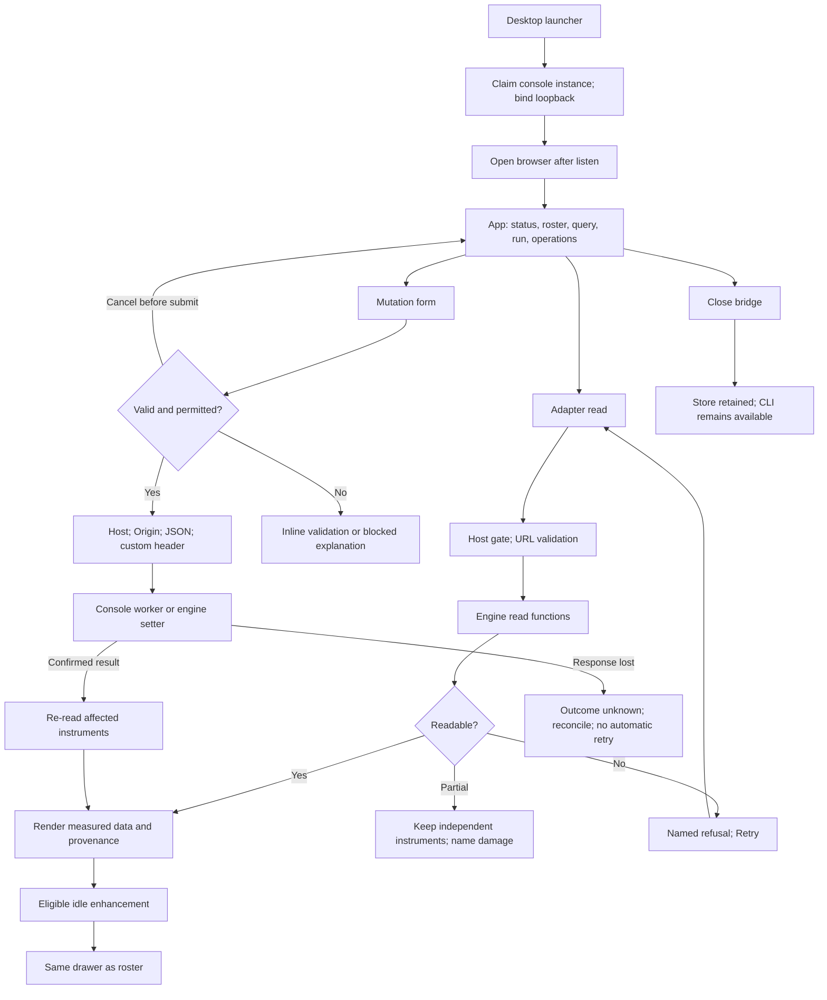

**API interactions**

Every route has its own sequence below. Common refusal branches: Host →403; malformed input →400; unavailable route →404; store damage →409 where the route is not composite; engine pre-write refusal →422. Transport failure leaves mutation outcome uncertain.

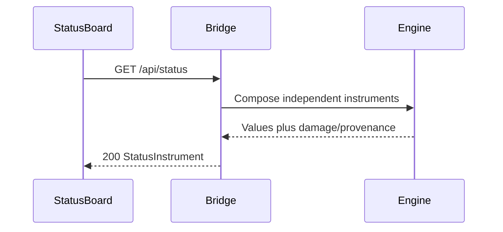

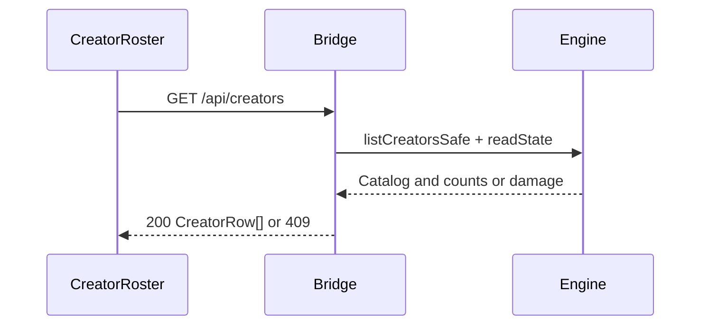

```mermaid
sequenceDiagram
  participant U as AddCreatorForm
  participant B as Bridge
  participant W as ResolverWorker
  participant E as Engine
  U->>B: POST /api/creators {ref}
  B->>W: Validate ref; defaultResolveCreator(url)
  W-->>B: Resolved channel or refusal
  B->>E: addCreator with synchronous resolved-value hook
  Note over E: Re-read registry now; preserve existing consent
  E-->>B: Persisted creator
  B-->>U: 201 CreatorRow with measured or null counts
  U->>B: GET /api/creators
```

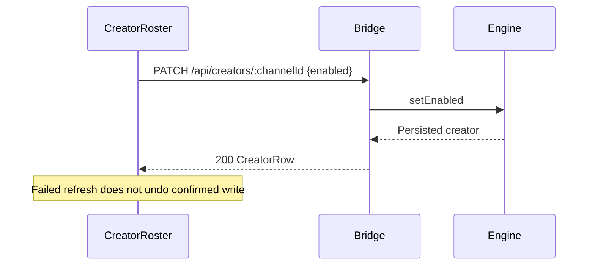

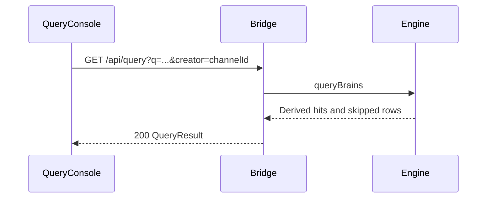

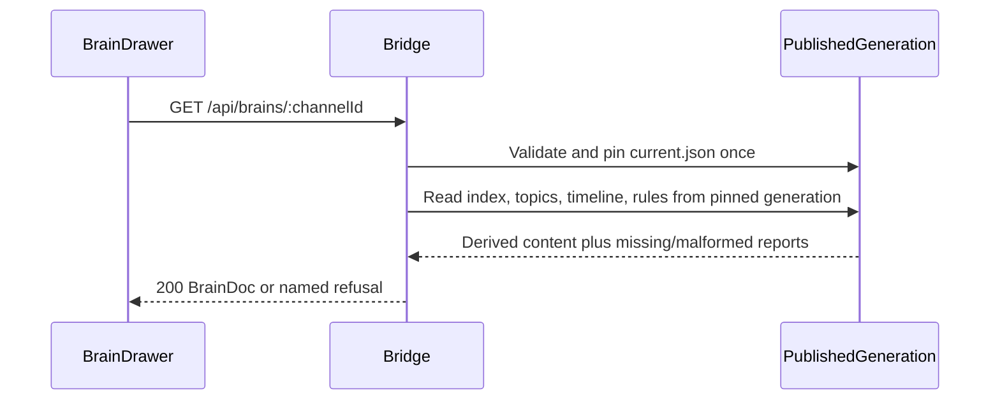

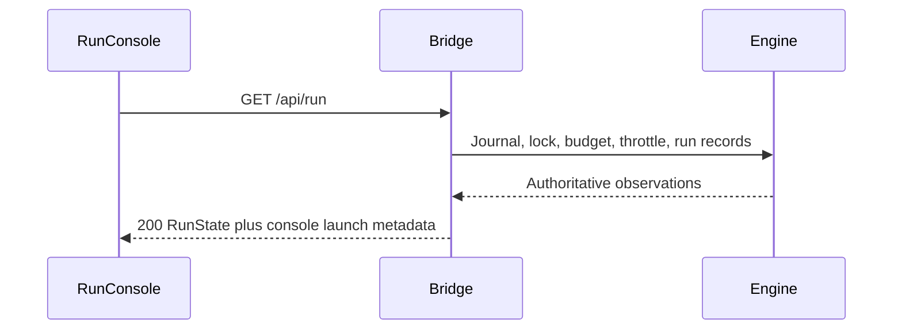

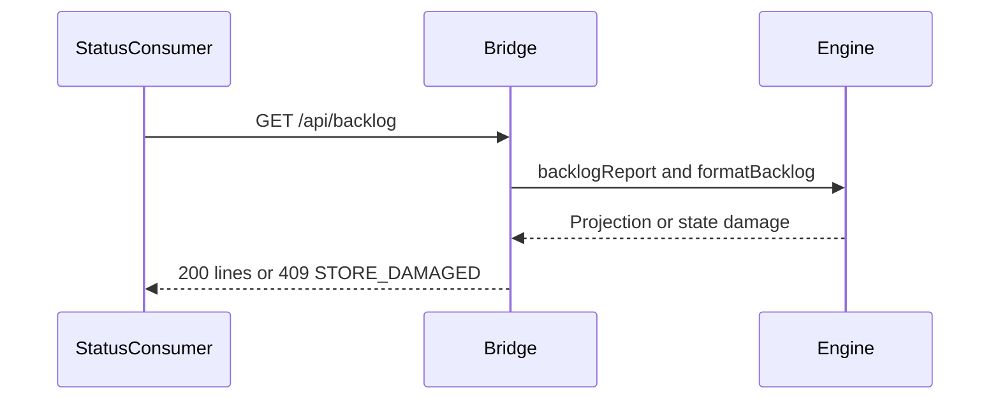

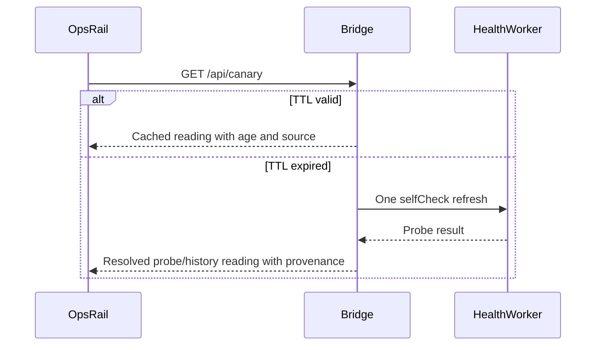

```mermaid
sequenceDiagram
  participant U as RunConsole
  participant B as Bridge
  participant C as DailyChild
  participant E as EngineStore
  U->>B: POST /api/run/daily {perHour}
  B->>B: Validate; claim operation slot; check lock
  B->>C: Spawn fixed run-daily.mjs path
  B-->>U: 202 {requestId,runId:null}
  C->>E: Engine journal, lock and run
  U->>B: GET /api/run
  B->>E: Read journal and matching run record
  B-->>U: Launch correlation and engine verdict
```

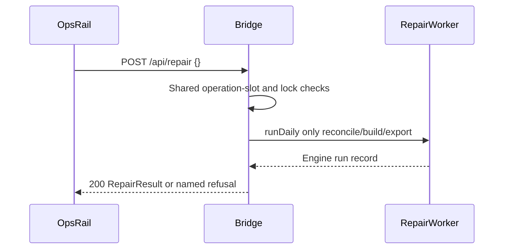

```mermaid
sequenceDiagram
  participant U as OpsRail
  participant B as Bridge
  U->>U: Backup remains disabled; explain privacy gate
  Note over U,B: No backup request is sent
  U->>B: Direct POST /api/backup before authorized slice
  B-->>U: 404 NOT_FOUND
```

**State machines**

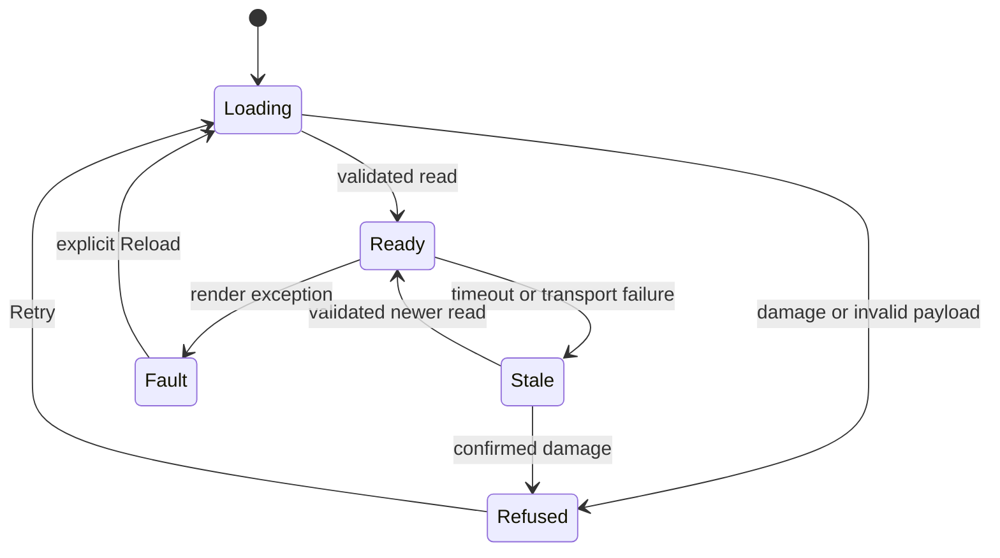

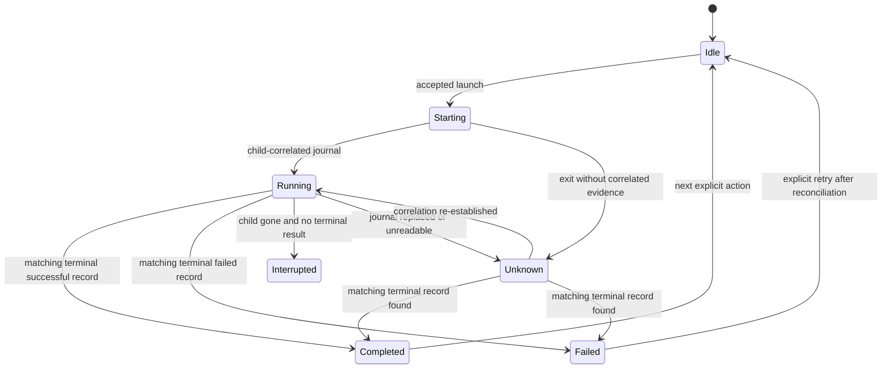

**Data model**

SQL ERD: **N/A — no relational schema or migration**. This diagram documents exact **transport fields**, not invented database columns:

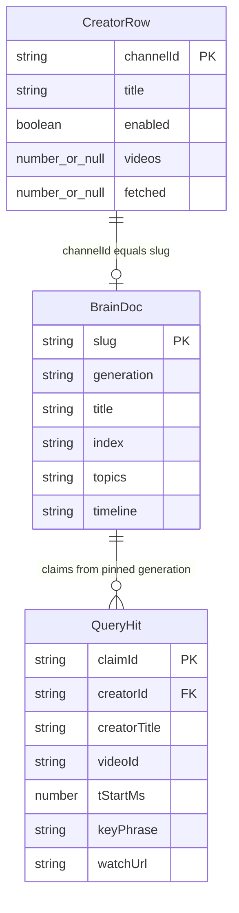

**Concurrency and recovery**

- Resolve creator references in a worker; never perform registry writes there.
- Maximum one add-resolution job; second request receives `409 OPERATION_BUSY`.
- Daily and repair share one console operation slot. Engine lock remains required.
- External CLI/scheduler concurrency is a real boundary. A preflight check is not an atomic lock.
- S4 is blocked until the journal/lock race test passes or the engine owner supplies a reviewed correction.
- Browser disconnect does not cancel committed work. No automatic mutation retry.
- Stop/restart does not restore data. Application rollback preserves the store.

### 02-wireframes.md

**Exact presentation tokens**

| Role | Required value |
|---|---|
| Page | `var(--bg-base, #030712)` |
| Panel | `var(--carbon, #141419)` |
| Drawer | `var(--graphite, #1A1A24)` |
| Elevated panel | `var(--royal-depth, #003080)` |
| Main text | `var(--frost-white, #E0ECF4)` |
| Primary button | `var(--midnight-sapphire, #002060)` |
| Focus/glow | `var(--wing-purple, #8B5CF6)` |
| Success/enabled | `var(--ice-wing, #60C0F0)` |
| Warning/stale | `var(--gilded-fern, #C6A84B)` |
| Disabled-state marker | `var(--swan-lavender, #4070C0)` |
| Error accent | `var(--danger, #E5484D)` |
| Data graphics only | `var(--arctic-cyan, #50A0F0)` |

Text remains Frost White; state color accompanies text, never replaces it. Do not use faint text for required content. Tokens do not substitute for measured contrast.

**Desktop — 1440×900**

```text
+------------------------------------------------------------------------+
| Creator Brains Console                         Last checked: {time}      |
| {global warning/refusal, only when applicable}                           |
+-----------------------------+------------------------------------------+
| BRAINS                      | STATUS                                   |
|                             | yt-dlp | Creators | Coverage | Budget     |
| {static preview or scene}   | Backlog | Throttle | Census | Lock        |
|                             | Last run | Last good | Documents          |
| [View creators]             | Published brains | Recent runs            |
|                             +------------------------------------------+
|                             | CREATORS                    [Add creator] |
|                             | {title}  Enabled  {fetched}/{videos}       |
|                             | [Open brain] [Disable]                    |
|                             +------------------------------------------+
|                             | ASK THE BRAINS                            |
|                             | Search terms [________________________]    |
|                             | Creator [All creators v]          [Ask]  |
|                             | {results / state frame}                   |
|                             +------------------------------------------+
|                             | RUN THE DAILY PASS                        |
|                             | Operations per hour [20]       [Run pass]|
|                             | {journal, budget, throttle, lock}         |
|                             +------------------------------------------+
|                             | OPERATIONS                               |
|                             | [Check canary] [Repair] [Backup disabled] |
|                             | Restore T4 / Rollback T4 / Authorize T3   |
|                             | CLI only                                  |
+-----------------------------+------------------------------------------+
```

At widths ≥1280px, constellation/deck use 40%/60%; deck minimum 640px. At 768–1279px, the enhancement sits above the deck. At ≤767px, no three.js download; show the compact static representation.

**Mobile — 375×812; same structure applies at 320px and 414px**

```text
+-----------------------------------+
| Creator Brains Console             |
| Last checked: {time}               |
| {warning/refusal}                  |
+-----------------------------------+
| BRAINS                            |
| [static preview, 96px high]        |
| [View creators]                   |
+-----------------------------------+
| STATUS                            |
| {label}                           |
| {value or named refusal}          |
| ... all instruments, stacked      |
+-----------------------------------+
| CREATORS              [Add creator]|
| {title, wraps}                    |
| Enabled | {fetched}/{videos}       |
| [Open brain]          [Disable]    |
+-----------------------------------+
| ASK THE BRAINS                    |
| Search terms                      |
| [_______________________________] |
| Creator [All creators          v] |
| [Ask]                             |
| {results / state frame}           |
+-----------------------------------+
| RUN THE DAILY PASS                |
| Operations per hour               |
| [20]                   [Run pass] |
| {run state}                       |
+-----------------------------------+
| OPERATIONS                        |
| [Check canary] [Repair]            |
| [Backup disabled]                 |
| {blocked explanation}             |
| Restore T4 — CLI only             |
| Rollback T4 — CLI only            |
| Authorize T3 — CLI only           |
+-----------------------------------+
```

No mobile-only action menu or hidden tab is introduced. All working surfaces remain reachable by scrolling.

**Add form — desktop dialog / mobile full-width sheet**

```text
Desktop 560px                          Mobile 375px
+--------------------------------+    +-------------------------------+
| Add creator              [Close]|    | Add creator            [Close]|
| Handle, channel URL, or ID      |    | Handle, channel URL, or ID    |
| [____________________________] |    | [___________________________] |
| New creators start disabled.   |    | New creators start disabled.  |
| {validation / progress}        |    | {validation / progress}       |
| [Cancel]          [Add creator]|    | [Cancel]        [Add creator]|
+--------------------------------+    +-------------------------------+
```

During submission: “Resolving creator…”. Disable another submission. Close remains available, with “This request continues if you close this form.” No cancellation claim after dispatch.

**Brain drawer — desktop 640px / mobile full-screen**

```text
+---------------------------------------------------+
| {creator title}                           [Close] |
| {channelId}                                      |
| Published generation: {generation}                |
| [Index] [Topics] [Timeline] [Claims]               |
| {state frame or derived document}                 |
|                                                   |
| Claims:                                           |
| {keyPhrase}                                       |
| {creatorTitle} · {timestamp}          [Watch video]|
| {N} items could not be read                       |
| [Show details]                                    |
+---------------------------------------------------+
```

Mobile tabs wrap into two rows; they do not horizontally clip. Markdown is displayed as escaped plain text with preserved line breaks in v1. No HTML, embedded media, remote images, or raw HTML rendering.

**Query results**

```text
+---------------------------------------------------+
| Results for “{submitted terms}”                    |
| {keyPhrase}                                       |
| {creatorTitle} · {timestamp}          [Watch video]|
| {N} items could not be searched                    |
| [Show details]                                    |
+---------------------------------------------------+
```

Use submitted terms, not the current unsubmitted input. Watch links use `rel="noopener noreferrer"` and a validated YouTube URL.

**Reusable state frames — drawn inside every panel on both widths**

```text
LOADING                 EMPTY
+-------------------+   +------------------------------------+
| {loading copy}    |   | {panel-specific empty copy}        |
| [static skeleton]|   | {permitted CTA}                    |
+-------------------+   +------------------------------------+

PARTIAL / STALE                    ERROR / DENIED
+------------------------------+  +------------------------------------+
| {last confirmed content}     |  | {file/reason or lock holder}       |
| {partial/stale copy}         |  | {Retry or appropriate next action} |
| [Show details]               |  |                                    |
+------------------------------+  +------------------------------------+

SUCCESS / VALIDATION
+----------------------------------------------------------+
| {authoritative content or inline validation below input}  |
| {enabled action controls appropriate to this state}       |
+----------------------------------------------------------+
```

**Exact state copy**

| Surface | Loading | Empty | Partial/stale/error |
|---|---|---|---|
| Status | “Reading engine status…” | “No creators yet — add your first creator.” | “Unable to read {file}.” / “Showing the last confirmed reading from {time}.” |
| Roster | “Loading creators…” | “No creators yet — add one.” | “Counts unavailable.” / “Creator change confirmed. Roster refresh failed.” |
| Drawer | “Loading published brain…” | “No published brain for this creator.” | “{N} items could not be read.” |
| Query | “Searching published brains…” | “No matching claims for “{terms}”.” | “{N} items could not be searched.” |
| Run | “Reading run state…” | “The daily pass has not run yet.” | “Run outcome unknown. Check engine records before retrying.” |
| Canary | “Checking yt-dlp…” | “No recorded canary result.” | “Live probe failed. Showing a recorded result from {time}.” |
| Repair | “Repair is running…” | “No repair has been requested.” | “Repair outcome unknown. Check engine records before retrying.” |
| Backup | N/A: no request | N/A: blocked action | “Backup is unavailable until the private-backup boundary is approved.” |
| Constellation | “Brain overview is loading…” | “No creators yet — add your first creator.” | “Interactive view unavailable. Use the creator list.” |

Run states use “Starting…”, “Running”, “Completed”, “Failed”, “Interrupted”, and “Outcome unknown”. Lock refusal: “Another run owns this store: PID {pid}, host {host}.” Missing holder fields render “unknown”, not invented identifiers.

Validation copy: “Enter a creator handle, channel URL, or channel ID.”; “Use 200 characters or fewer.”; “Enter search terms.”; “Use 300 characters or fewer.”; “Enter a positive whole number.”

Success copy: “Creator added — disabled.” or “Creator already exists — settings preserved.”; “Creator is now enabled.” / “Creator is now disabled.” Never report enabled state from an optimistic toggle.

Focus traps apply only to open dialogs. Escape closes and restores the initiating DOM control. Scene canvas is an enhancement; the roster provides the full keyboard path. All controls are ≥44×44px. Loading indicators stop under reduced motion.

### 03-contracts.md

**Compatibility**

S1 payloads remain compatible except where the documented contract was already wrong. Planned additions land with their consumers. Extra object fields are tolerated; missing/retyped required fields are refused. A failed validator reports the field path.

```ts
type Damage = { file: string; detail: string };
type Count = number | null;
type Skipped = Record<string, unknown>;

interface CanaryReading {
  ok: boolean;
  version: string | null;
  reason: string;
  checkedAt: string | null;
  ageMs: number | null;
  source: 'probe' | 'history' | 'unknown';
  stale: boolean;
  note: string | null;
}
interface LockReading {
  held: boolean;
  pid?: number;
  host?: string;
  alive?: boolean;
  ambiguous?: boolean;
}
interface BudgetReading {
  used: number; perHour: number; unit: string;
  byKind: Record<string, number>;
}
interface ThrottleReading {
  active: boolean; kind?: string; until?: string | null; text: string;
}
interface RecentRun { runId: string; ok: boolean; fetched: number }

interface StatusInstrument {
  ytdlp: CanaryReading;
  creators: { total: number; enabled: number; damaged: Damage | null };
  state: {
    damaged: Damage | null;
    videos: null | {
      total: number; fetched: number; coverage: number;
      counts: Record<string, number>;
    };
  };
  budget: BudgetReading;
  backlog: { lines: string[] };
  throttle: ThrottleReading;
  census: {
    inFlight: Array<{ channelId: string; detail: string }>;
    everSwept: number; discarded: boolean; error?: string;
  };
  lock: LockReading;
  lastRun: { status: string; runId: string | null } | null;
  lastGood: { at: string; staleDays: number } | null;
  documents: number;
  publishedBrains: number;
  recentRuns: RecentRun[];
}
interface CreatorRow {
  channelId: string; title: string; enabled: boolean;
  videos: Count; fetched: Count;
}
interface QueryHit {
  claimId: string; creatorId: string; creatorTitle: string;
  videoId: string; tStartMs: number; keyPhrase: string; watchUrl: string;
}
interface QueryResult { hits: QueryHit[]; skipped: Skipped[] }
interface BrainDoc {
  slug: string; // compatibility field; value is channelId, not a display slug
  generation: string;
  title: string;
  index: string; topics: string; timeline: string;
  claims: QueryHit[]; skipped: Skipped[];
}
interface LaunchReceipt {
  requestId: string;
  runId: string | null;
}
interface RunState {
  journal: { status: string; runId: string | null } | null;
  lock: LockReading; throttle: ThrottleReading; budget: BudgetReading;
  recentRuns: RecentRun[];
  launch: null | {
    requestId: string; pid: number | null; runId: string | null;
    phase: 'starting' | 'running' | 'completed' | 'failed'
      | 'interrupted' | 'unknown';
  };
}
interface RepairResult {
  runId: string; ok: boolean;
  repaired: number; built: number; emptied: number;
}
interface RequestOptions { signal?: AbortSignal }
```

`ytdlp` provenance normalization lands in S1R; it is not a claim that today’s status DTO already exposes every field above. `launch` lands in S4.

```ts
interface ConsoleDataAdapter {
  getStatus(o?: RequestOptions): Promise<StatusInstrument>;
  listCreators(o?: RequestOptions): Promise<CreatorRow[]>;
  addCreator(ref: string): Promise<CreatorRow>;
  setCreatorEnabled(id: string, enabled: boolean): Promise<CreatorRow>;
  query(q: string, creator?: string, o?: RequestOptions): Promise<QueryResult>;
  getBrain(channelId: string, o?: RequestOptions): Promise<BrainDoc>;
  getRunState(o?: RequestOptions): Promise<RunState>;
  startDailyRun(perHour: number): Promise<LaunchReceipt>;
  canary(o?: RequestOptions): Promise<CanaryReading>;
  repair(): Promise<RepairResult>;
  backup(dest?: string): Promise<{ dest: string; ok: boolean }>;
}
```

`backup` remains a typed refusal in both adapters until its gate is resolved. The optional `dest` signature is retained for compatibility; it is not authority to implement arbitrary filesystem destinations.

**HTTP contract and slice ownership**

| Method / path | Request | Success | Owner |
|---|---|---|---|
| GET `/api/status` | None | 200 `StatusInstrument`; damage fields retained | Existing/S1R |
| GET `/api/creators` | None | 200 `CreatorRow[]` | Existing/S2 |
| POST `/api/creators` | `{"ref":"@handle"}` | 201 `CreatorRow` | Existing/S2 |
| PATCH `/api/creators/:channelId` | `{"enabled":true}` | 200 `CreatorRow` | Existing/S2 |
| GET `/api/query` | `q`, optional `creator=channelId` | 200 `QueryResult` | Existing/S3a |
| GET `/api/brains/:channelId` | One encoded channel-ID segment | 200 `BrainDoc` | Existing/S2 |
| GET `/api/run` | None | 200 `RunState` | Existing/S4 extension |
| GET `/api/backlog` | None | 200 `{lines:string[]}`; extra fields tolerated | Existing |
| GET `/api/canary` | None | 200 `CanaryReading` | Existing/S1R |
| POST `/api/repair` | `{}` | 200 `RepairResult` | S3b only |
| POST `/api/run/daily` | `{"perHour":20}` | 202 `{"requestId":"…","runId":null}` | S4 only |
| POST `/api/backup` | None currently allowed | 404 | Blocked S3c |
| Any restore/rollback/authorize route | Any | 404 | Never v1 |

**Error envelope**

```json
{
  "error": {
    "code": "STORE_DAMAGED",
    "message": "Unable to read state.json.",
    "file": "state.json"
  }
}
```

| Status | Codes / meaning |
|---|---|
| 400 | `VALIDATION`: body, encoding, query, identifier, budget |
| 403 | `FORBIDDEN_HOST`, `FORBIDDEN_ORIGIN`: request rejected before handler |
| 404 | `NOT_FOUND`: absent route or absent published brain |
| 409 | `STORE_DAMAGED`, `RUN_LOCKED`, `OPERATION_BUSY` |
| 415 | `UNSUPPORTED_MEDIA_TYPE`: write is not JSON |
| 422 | `REFUSED`: confirmed engine refusal before the intended mutation |
| 500 | `INTERNAL`: generic message; mutation outcome may be uncertain |

`RUN_LOCKED` additionally carries `holder:{pid?,host?,alive?,ambiguous?}`. No stack traces, credentials, raw store contents, or unfiltered absolute paths. Engine messages are retained only after privacy-safe projection. `TRANSPORT` and payload-validation failures are client errors, not invented HTTP responses.

Oversized requests may reset the connection; that accepted transport limitation remains explicit.

**Validation and trust**

- Host must match a permitted loopback authority and the actual bound port.
- Browser mutation Origin must equal the serving origin.
- Every mutation requires `Content-Type: application/json` and `X-Creator-Console: 1`.
- A native client may omit Origin but still needs the media type and custom header.
- No CORS allowance; cross-origin OPTIONS does not unlock a write.
- Body ≤65,536 bytes, fatal UTF-8 decode, non-null JSON object.
- `ref`: trimmed nonempty string ≤200 characters.
- `q`: trimmed nonempty string ≤300 characters.
- `perHour`: JSON number, positive safe integer; strings/booleans rejected.
- New channel IDs satisfy the engine’s canonical validator. Existing registry keys may remain listable; malformed legacy identifiers do not become filesystem paths.
- Brain generation must be one safe filename component. Resolve real paths under the selected brain directory; refuse links escaping it. Do not follow a poisoned pointer into another directory.
- Only `index.md`, `topics.md`, `timeline.md`, `rules.jsonl` may supply drawer content.
- Raw transcript paths are never opened by console presentation handlers.
- Escape displayed text. Validate watch URLs from video IDs and finite nonnegative timestamps.
- Read responses use `Cache-Control: no-store`.

**Worker contracts**

```ts
resolveCreatorInWorker(
  ref: string,
  options: { timeoutMs: 185000 }
): Promise<{ channelId: string; title: string; url: string }>;

refreshHealthInWorker(
  options: { timeoutMs: 15000 }
): Promise<{ ok: boolean; version: string | null; reason: string }>;

readPublishedBrain(channelId: string, options: { r: string }): BrainDoc;
launchDaily(perHour: number, options: { r: string }): Promise<LaunchReceipt>;
runRepair(options: { r: string }): Promise<RepairResult>;
```

Resolver worker calls the existing exported `validateCreatorRef` and `defaultResolveCreator`. Parent then calls:

```js
await addCreator({
  ref,
  r,
  deps: { resolveCreator: () => resolved }
});
```

No worker changes registry/state files during resolution. This design is [LIKELY] feasible from inspected exports; tests must prove it before shipping.

Health refresh is single-flight. Successful cached readings expire after 60 seconds. History fallback retains its original timestamp and a current-probe-failure note. Status reads may show an explicitly unknown/pending reading while refresh runs; never fabricate fresh health.

**Run contract**

Launch metadata is console process state, not another engine journal. Correlation requires matching child PID and a newly observed engine run ID. A terminal success requires the matching engine record with `ok:true`. Unknown journal statuses, overwritten journals, missing records, or uncorrelated child exit render uncertainty.

Daily child invocation uses `process.execPath`, a fixed absolute `E/run-daily.mjs`, argument array `["--per-hour=N"]`, explicit store-root environment, and no shell. S4’s Windows process-survival test decides whether the required detached lifecycle works; no claimed detached behavior without that result.

Repair uses the engine’s existing configuration:

```js
runDaily({ r, only: ['reconcile', 'build', 'export'] })
```

Its worker projects the returned record; it does not parse CLI stdout or invent a requeued count.

**Migrations, configuration, rollback**

No engine schema migration or new database environment variable. `CREATOR_BRAINS_ROOT` remains authoritative. No provider keys are required.

Relocation changes code paths only. Preserve dependencies through the existing web lockfile; do not install dependencies under `E`. Remove the old active console location only after an approved, verified move. A residual `node_modules` tree under `E` still triggers the old problem.

Rollback disables the console launcher and restores the preserved console sources if needed. It does **not** undo creator toggles, completed jobs, backups, or other engine mutations. Store restoration remains CLI-only.

### 04-build-order.md

All paths are relative to `C` unless prefixed `E` or the packet directory. Every source/test file must remain ≤300 canonical lines. Split at responsibilities before exceeding the limit.

| Order / slice | Files | Purpose; imports/exports; budget |
|---|---|---|
| 1 / S0R | Existing packet, preservation manifest | Preserve owned tracked and untracked bytes; hash manifest; no source modification. |
| 2 / S0R | `server.mjs`, `api.mjs`, `lib/*`, `test/*`, launcher | Conditional relocation. Repair relative engine imports and direct-entry detection; preserve public exports. ≤300 each. |
| 3 / S0R | `test/bridge.relocation.test.mjs` | Spawn actual entry from unrelated cwd; verify store-root identity, static build location, instance exclusion. ≤220. |
| 4 / S1R | `lib/request-policy.mjs`, `lib/http.mjs`, `server.mjs` | Central write policy, fatal UTF-8, safe envelopes. Export `validateWriteRequest`. ≤220 new module. |
| 5 / S1R | `workers/health.mjs`, `lib/health-worker.mjs`, `lib/health.mjs` | Node worker probe, single-flight TTL/history; retain existing provenance behavior. ≤240 each. |
| 6 / S1R | `web/src/adapters/{types,LocalEngineAdapter,MockAdapter,validate}.ts` | Corrected contracts, custom header, read cancellation; preserve adapter seam. ≤280 each. |
| 7 / S1R | `web/src/hooks/useStatus.ts`, `components/StatusBoard.tsx` | Abort timed-out reads; label stale/history/unknown; retain error boundary. ≤280 each. |
| 8 / S2 | `workers/resolve-creator.mjs`, `lib/resolve-creator.mjs`, `lib/creators.mjs` | Resolve off-thread; parent commit; measured/null counts; one pending add. ≤240 each. |
| 9 / S2 | `lib/published-generation.mjs`, `lib/brains.mjs` | Pin/contain generation, read derived files, validate/project claims. ≤260 each. |
| 10 / S2 | `web/src/components/{CreatorRoster,AddCreatorForm,BrainDrawer}.tsx` | Forms, authoritative refresh, tabs, focus. ≤260 each. |
| 11 / S2 | `web/src/hooks/{useCreators,useBrain}.ts`, corresponding `.styles.ts` | Lifecycle and styles separated; adapter imports only. ≤220 each. |
| 12 / S3a | `web/src/components/{QueryConsole,QueryResults,OpsRail}.tsx` | Query, canary, visible blocked backup. ≤250 each. |
| 13 / S3b | `workers/repair.mjs`, `lib/{operation-slot,repair}.mjs`, `routes.mjs` | Shared operation slot; engine repair result; add repair route only now. ≤240 each. |
| 14 / S4 | `lib/{daily-launch,run-observation}.mjs`, `routes.mjs` | Fixed child spawn; launch metadata and correlation; add daily route only now. ≤260 each. |
| 15 / S4 | `web/src/{hooks/useRun,components/RunConsole}.tsx` | Use `.ts` for hook; poll state machine, no fake completion. ≤260 each. |
| 16 / S5 | `web/src/three/{layoutBrains,lifecycle}.ts`, `BrainConstellation.tsx` | Pure layout; lazy renderer; disposal and motion limits. ≤260 each. |
| 17 / S6 | `web/playwright.console.config.ts`, `web/e2e/*.spec.ts` | Isolated browser fixture server, viewport/accessibility/performance gates. ≤260 each. |
| 18 / S7 | library-mode config, snapshot manifest, receiving adapter spec | Explicitly gated transfer; host dependencies externalized. ≤300 each. |

**Existing patterns to preserve**

Route registration remains literal so the existing allowlist extractor sees it:

```js
if (req.method === 'GET' && p === '/api/creators') {
  return sendJson(res, 200, creatorRows(r));
}
```

Host/write gates remain outside the route table; the error envelope wraps dispatch.

UI retains its mounted inner boundary:

```tsx
<ErrorBoundary scope="The status board">
  <StatusBoard state={status} />
</ErrorBoundary>
```

Use styled-components and existing tokens. Extract style files; do not replace this stack.

Test helpers belong in non-test modules such as `test/fixtures.mjs`. Never import a module that registers tests merely to obtain fixtures.

### 05-slices.md

| Slice | Entry and deliverable | Required exit |
|---|---|---|
| **S0R — preservation/location** | Preserve original packet and console. Resolve D7; relocate only if approved. | T-MOVE; exact file manifest; fresh engine command/result; CLI import smoke; no engine code diff. C1 or HR14f failure remains a blocker, not waived. |
| **S1R — bridge/contract hardening** | Accepted location; existing nine-route surface. Correct write policy, health refresh, encoding, DTOs, read cancellation. | Existing bridge/web suites plus T-SEC/T-CONTRACT/T-HEALTH; built app fixture smoke; no new route. |
| **S2 — roster/drawer** | S1R checkpoint. Resolve off-thread; commit in parent; real same-generation claims. | T-ADD/T-BRAIN/T-W4; existing T-B3/B19/B22; desktop and 375px keyboard walkthrough. |
| **S3a — query/canary** | S2 checkpoint. Search and canary panels; backup remains visibly blocked. | T-W5/T-OPS-read; no new route. |
| **S3b — repair** | Engine journal-concurrency gate passes; shared operation slot proven. | T-OPS-repair; actual engine record mapped to result; exactly one added repair route. |
| **S3c — backup** | Sean resolves transcript-backup exception and destination policy in an amended contract. | **BLOCKED.** No route, no implementation, no fabricated acceptance test. |
| **S4 — daily run** | S3a/S3b checkpoints; journal race gate; real child lifecycle fixture. | T-B4/B5/T-RUN/W6; matching terminal record; restart/unknown and Windows detachment evidence. |
| **S5 — constellation** | S2 accessible roster; D1/D9 contracts accepted. | T-T1/T-T2/W7/E3, Sean’s visual follow-through; documented fallback if usability fails. |
| **S6 — integrated release candidate** | S1R–S5 complete; S3c either completed under approved exception or explicit scope decision. | Eleven-width evidence; accessibility; performance; full combined review; archive filing. |
| **S7 — transfer** | S6 plus Sean’s explicit go. | Tag and copied source manifest, matching hashes, receiver-side build and review. |

At every row: **do not advance to the dependent slice until its checkpoint passes**. A partial slice may be reviewed but cannot inherit PASS from another slice.

**Exact command groups**

From repository root, after setting the approved console path:

```powershell
$consolePath = 'scripts/creator-brains/console'
# Use 'packages/creator-brains-console' only after approved relocation.

$bridgeTests = @(Get-ChildItem "$consolePath/test" -Filter '*.test.mjs' |
  Sort-Object Name | ForEach-Object FullName)
node --test @bridgeTests

npm --prefix "$consolePath/web" test
npm --prefix "$consolePath/web" run typecheck
npm --prefix "$consolePath/web" run build

$engineTests = @(Get-ChildItem 'scripts/creator-brains/test' -Filter '*.test.mjs' |
  Where-Object Name -ne 'live.test.mjs' |
  Sort-Object Name | ForEach-Object FullName)
node --test @engineTests
```

No comment masquerades as a live-test exclusion.

Browser command, from `C/web` after S6’s isolated configuration exists:

```powershell
npx --no-install playwright test --config playwright.console.config.ts
```

Record actual counts and exit codes. Do not assert the historical 105/48/183 counts will remain constant.

### 06-bans.md

- No engine source edits, except an explicitly approved README pointer adjustment.
- No raw-transcript rendering, download, export endpoint, model transmission, or console-owned transcript reader.
- No backup implementation until the policy contradiction is resolved.
- No restore, rollback, authorize, throttle-clear, arbitrary command, filesystem-browser, or job-control route.
- No route before its owning slice.
- No shell-built command from user input; fixed executable/path and argument arrays only.
- No writes from the resolver worker; no cached registry passed through a slow resolver.
- No automatic mutation retries, optimistic consent changes, or success inferred from timeout/exit/lock absence.
- No “zero” substituted for damaged or unavailable measurements.
- No raw HTML rendering or unvalidated watch links.
- No claim that lexical path containment proves junction/symlink containment.
- No assumption that loopback Host validation provides cross-origin write protection.
- No relaxing the 300-line cap or hiding dependencies from an engine check without resolving D7.
- No MUI, Tailwind, new global state framework, Web Component wrapper, or Electron.
- No off-palette decorative colors. Arctic Cyan is data-only.
- No hover-only controls, targets below 44px, or canvas-only functionality.
- No animation before the enhancement gate; no WebGL chunk on mobile, reduced motion, or absent WebGL.
- No speculative “all tests pass” from old receipts, structural readiness, or source inspection.
- No broad staging, reset, clean, deletion, main push, deploy, or shared-lane takeover.
- No rewriting historical reviews into correctness. Supersede with reciprocal links.
- No private data, credentials, absolute private store paths, or user query text in request logs.

### 07-checkpoints.md

**Evidence protocol**

Each checkpoint records:

1. Exact checkout, branch, commit, dirty owned paths, and source hashes.
2. Requirement/test mapping and precise command.
3. Expected RED failure where feasible, excluding import/setup failures.
4. GREEN result after implementation; actual distinct test count.
5. Real boundary proof, separate from mocks.
6. Open findings, accepted limitations, rollback, and next allowed slice.
7. Filed review ID, reviewer identity evidence, and supersession links.

Reviewer order and spend remain governed by the existing task workflow. This requested Astra adjudication does not retroactively complete missing GLM/Flash receipts or authorize another provider call. A2 is the requested self-hardening pass, not a substitute for an independent implementation gate.

**Readiness receipt for this revision**

| Evidence | State |
|---|---|
| Input identity/hash | VERIFIED |
| Existing console source/mount inspection | VERIFIED, bounded scope |
| Original packet preservation | Original untouched; copied snapshot NOT RUN |
| D1–D9 adjudication | Emitted; D7 owner decision outstanding |
| A1/A2 | Emitted; archive filing BLOCKED |
| New test files | Specified, NOT WRITTEN in read-only session |
| Current bridge/web/engine test results | NOT RUN |
| Mermaid rendering | NOT RUN |
| Real browser, launcher, GPU | NOT RUN |
| Engine journal concurrency | BLOCKED pending executable proof |
| Backup boundary | BLOCKED pending Sean’s decision |
| Implementation readiness | **NOT ESTABLISHED** |

**Performance and operations**

- Cold bridge bind ≤1.5 seconds; Desktop-to-render ≤15 seconds.
- Warm file-backed reads p95 ≤50ms on a declared fixture size; report cold and expired-health-refresh latency separately.
- Status JSON ≤256KiB.
- Initial executable JS ≤500KiB gzip; lazy three chunk ≤900KiB gzip.
- Health refresh never blocks the HTTP thread while its subprocess waits.
- Scene DPR ≤2; target median frame time ≤16.7ms at 40 creators, measured on named hardware.
- Log method, route template, status, duration, request ID, child lifecycle, and refusal code only.
- Rotate console logs at 1MiB, retaining three files. Do not log bodies, query text, transcript text, or credentials.
- Owner: Sean. Recovery: restart console, inspect authoritative records, then explicitly retry only when outcome is known.

**Motion gates**

Enhancement import requires: first validated status read, width ≥768px, visible/intersecting panel, no reduced-motion preference, successful WebGL capability probe, and a subsequent idle callback. Fallback timer: 1 second after that status read.

Dolly: ≤2.5 seconds, once per page load, only if renderer is ready within 3 seconds of the first valid status read and the operator has not interacted. Otherwise skip.

Idle drift: ≤0.25 degrees/second, no autonomous zoom, no pulsing text, no particle field unrelated to creators. Stop scheduling rAF within one frame of hidden/offscreen state. Reduced-motion changes at runtime dispose active motion and show static content.

**Preservation and release**

Before modifying the canonical packet, preserve all owned files with SHA-256s, including untracked source. Exclude dependency/build trees from source snapshots; preserve lockfiles. Never call that an off-machine backup without evidence.

S7 creates a named tag and copied source tree with a manifest. Host library mode externalizes React, React DOM, and styled-components; receiving-repo dependency versions and network authorization remain receiver-owned gates.

Post-task hygiene: this pass created no filesystem artifacts. The future package, test receipts, screenshots, and manifests belong under the existing packet’s evidence tree, not the repository root.

### 09-tests.md

All new cases below are **planned and NOT RUN**. Named files are required implementation deliverables. Existing historical tests remain required regressions.

**Harness rules**

Every integration fixture uses a newly created temporary `CREATOR_BRAINS_ROOT`, isolated port, fake external resolver/probe where network is irrelevant, and explicit teardown. No production backend or default store. No live YouTube traffic.

Pure unit mocks prove logic only. At least one integration case per route uses the actual HTTP handler and real engine file formats. Raw HTTP/socket tests construct malformed targets and framing without client normalization.

| Suite/file | Named cases and what they prove |
|---|---|
| `test/bridge.relocation.test.mjs` — **T-MOVE** | `entry launches from unrelated cwd`; `explicit store root unchanged`; `web dist resolves beside relocated console`; `old and new entry cannot claim same store`; `engine imports resolve without engine edits`. |
| `test/bridge.write-policy.test.mjs` — **T-SEC** | `foreign Origin denied before mutation`; `text/plain JSON denied`; `missing custom header denied`; `same-origin JSON succeeds`; `native JSON request without Origin succeeds`; `OPTIONS never enables CORS`; hostile Host still wins before URL parsing. Assert registry bytes unchanged on every refusal. |
| `test/bridge.utf8.test.mjs` — **T-SEC** | `invalid byte inside quoted ref rejected`; `valid non-ASCII input reaches semantic validator`; `65536-byte body accepted by reader`; `65537-byte body refused`; chunked/no-body cases and post-attack liveness retained. |
| `test/health.worker.test.mjs` — **T-HEALTH** | `blocked probe leaves status responsive`; `one refresh per TTL`; `history retains original timestamp`; `failed refresh cannot appear live`; `worker timeout releases slot`; `two store roots do not share history`. |
| `test/creators.worker.test.mjs` — **T-ADD** | `slow resolver permits concurrent status request`; `worker never writes registry`; `parent re-reads registry after resolution`; `new creator disabled`; `re-add preserves enabled state and counts`; `failed count read yields null`; `double add receives OPERATION_BUSY`; `worker failure leaves registry byte-identical`. |
| `test/brain-generation.test.mjs` — **T-BRAIN** | `published channel ID returns three documents and nonempty claims`; `pointer switch during read never mixes generations`; `missing rules reported`; `malformed claim reported`; `poisoned generation refused`; `real junction/symlink escape refused`; `raw-only sentinel never returned`; healthy large derived markdown remains valid. |
| `test/repair.test.mjs` — **T-OPS-repair** | `real repair record projects repaired built emptied`; `failed engine record retains ok false`; `daily and repair cannot overlap`; `repair refusal leaves state untouched`; no stdout scraping. |
| `test/run-launch.test.mjs` — **T-RUN** | `202 contains requestId and null runId`; `spawn failure releases slot`; `double post starts one child`; `engine child PID correlates journal`; `unrelated journal not adopted`; `exit zero without matching record is unknown`; `failed record never completed`; `bridge restart preserves engine work and loses only declared ephemeral metadata`. |
| `test/run-concurrency.test.mjs` — **T-RUN-GATE** | `losing external runner cannot replace active journal`; `repair versus daily shares truthful identity`; use two actual child processes and isolated engine store. Failure blocks S3b/S4 and routes to engine owner. |
| `web/src/test/route-contracts.test.ts` — **T-CONTRACT** | Local and Mock adapter parity for healthy/damaged/refused payloads; every newly consumed route rejects malformed nested fields; valid controls remain accepted; nullable counts and unknown provenance accepted. |
| `web/src/components/CreatorRoster.test.tsx` — **T-W4** | validation, disabled-on-add, preserved consent on re-add, no optimistic toggle, failed refresh after confirmed write, uncertain timeout copy. |
| `web/src/components/BrainDrawer.test.tsx` — **T-BRAIN-UI** | all four tabs, generation label, claims links, missing-file notices, literal HTML displayed harmlessly, Escape and focus return. |
| `web/src/components/QueryConsole.test.tsx` — **T-W5** | submitted-term zero-hit copy, creator ID filter, skipped rows, timestamp link, stale response cannot overwrite newer query. |
| `web/src/components/OpsRail.test.tsx` — **T-OPS-read** | provenance visible, error returns to panel, repair result not called “requeued”, Backup sends no request, CLI hints remain non-executable. |
| `web/src/components/RunConsole.test.tsx` — **T-W6** | rejects 0/negative/fraction/string/NaN/unsafe integer; holder display; exact state labels; unmount aborts reads; uncertain writes never auto-retry. |
| `web/src/three/layoutBrains.test.ts` — **T-T1** | sort by channel ID; deterministic positions; real counts drive size/coverage; null counts render unknown; color plus textual equivalent. |
| `web/src/three/lifecycle.test.ts` — **T-T2** | hidden/offscreen stop within one frame; runtime reduced-motion disposes; remount leaves one renderer; geometry/material/context/listeners released. |
| `web/e2e/console-launch.spec.ts` — **T-E1** | real fixture bridge serves built app; actual `main.tsx` mount renders status and survives named payload fault; missing hashed asset cannot masquerade as working UI. |
| `web/e2e/console-responsive.spec.ts` — **T-E2/W9** | eleven widths; no lost/clipped critical controls; 44px targets; keyboard tasks; focus restoration; axe plus measured contrast. |
| `web/e2e/console-motion.spec.ts` — **T-E3/W7** | network asserts no three chunk before gate; zero fetch on reduced-motion/mobile/no WebGL; late dolly skipped; DPR cap; frame samples on declared hardware. |
| `test/snapshot.test.mjs` — **T-B12** | S7 tag exists; copied source files exactly match manifest; changed/missing/unlisted source blocks transfer; original tree unchanged. |

**Exact targeted commands**

From repository root, using the approved `$consolePath` from `05-slices.md`:

```powershell
node --test "$consolePath/test/bridge.relocation.test.mjs"
node --test "$consolePath/test/bridge.write-policy.test.mjs" "$consolePath/test/bridge.utf8.test.mjs"
node --test "$consolePath/test/health.worker.test.mjs"
node --test "$consolePath/test/creators.worker.test.mjs" "$consolePath/test/brain-generation.test.mjs"
node --test "$consolePath/test/repair.test.mjs"
node --test "$consolePath/test/run-launch.test.mjs" "$consolePath/test/run-concurrency.test.mjs"
npm --prefix "$consolePath/web" test
npm --prefix "$consolePath/web" run typecheck
npm --prefix "$consolePath/web" run build
```

Missing test modules are setup gaps, **not valid RED evidence**. The builder must first write each test so it reaches the intended boundary, observe the intended behavioral failure, then implement.

Viewport matrix: `320×812`, `375×812`, `414×896`, `768×1024`, `1024×768`, `1280×800`, `1440×900`, `1920×1080`, `2560×1440`, `3840×2160`, `3440×1440`.

**Known evidence limits**

- Fake resolver/probe tests do not establish YouTube availability.
- Mock adapters do not prove bridge serialization.
- Stubbed API browser tests do not prove engine integration.
- Software WebGL does not certify Sean’s GPU.
- A transcript detector is a supplementary alarm, not proof of path isolation.
- No backup test may open private transcript fixtures through a console-owned reader.
- S7 receiver behavior cannot be certified by this repository’s suite.

## PART C — DECISION-DENSITY SELF-TEST

| Remaining builder choice | Disposition |
|---|---|
| Where the console lives | **Owner decision:** recommend `packages/creator-brains-console`; no move until D7 resolved. |
| Whether to modify engine walker/locking | **Decided:** forbidden in console slices; failing gates return to engine owner. |
| How to avoid add blocking | **Decided:** worker resolves only; parent engine call commits against fresh registry. |
| Add timeout, queue, retries | **Decided:** 185s resolver ceiling, one pending add, no queue or automatic retry. |
| Existing creator consent/counts | **Decided:** preserve consent; measured counts or null. |
| Brain identifier | **Decided:** channel ID; compatibility property remains named `slug`. |
| Claims and generation consistency | **Decided:** four allowlisted files from one pinned generation. |
| Markdown renderer | **Decided:** escaped plain text in v1. |
| Error/transport semantics | **Decided:** confirmed refusal versus uncertain outcome; no fake rollback. |
| Cross-origin writes | **Decided:** Origin, JSON, custom header, no CORS permission. |
| Health freshness | **Decided:** worker refresh, 60s TTL, explicit history/unknown provenance. |
| Run ID before engine starts | **Decided:** request ID plus null run ID; correlate later. |
| External runner concurrency | **Gate:** real two-process test; no invented console-only guarantee. |
| Repair meaning | **Decided:** reconcile/build/export and projected engine counts. |
| Backup scope/destination | **Owner decision:** absolute transcript-export prohibition currently blocks implementation. |
| Cancel behavior | **Decided:** cancel before submit only; closing after dispatch does not cancel work. |
| Poll cadence/cancellation | **Decided:** 2s active, 5s prolonged/idle, 15s hidden; abort reads and discard late responses. |
| Scene loading/motion | **Decided:** explicit eligibility gate, late-dolly deadline, numeric drift, DPR and teardown bounds. |
| Layout/node geometry | **Bounded delegation:** deterministic channel-ID-sorted layout; no occluded required actions; size/coverage encode real counts; null remains unknown. |
| Minor spacing and component extraction | **Bounded delegation:** existing spacing tokens, drawn hierarchy, ≤300 lines/file, viewport and focus gates. |
| Three.js package version | **Bounded delegation:** pin the selected version in the web lockfile; prove bundle/browser budgets; no engine dependency installation. |
| Review transport | **Decided:** preserve current task authority and receipts; no paid fallback or retry inferred from this package. |
| Snapshot and transfer | **Decided:** include untracked owned source in hash manifest; S7 requires explicit go and receiver evidence. |
| Unknown integration behavior discovered during implementation | **Bounded:** stop the affected slice, return a concrete failing case and contract amendment; do not improvise silently. |

**Result:** material choices are decided, bounded, or explicitly blocked. The package is emitted; implementation readiness and archive completion remain unestablished because the required evidence and writes were not available in this read-only pass.
