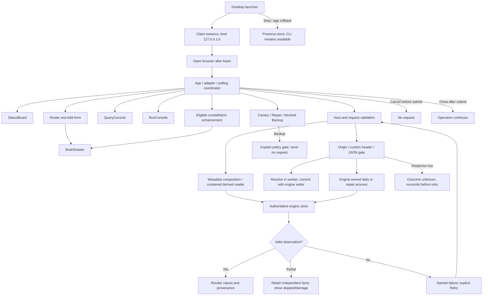
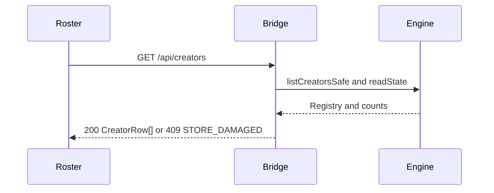
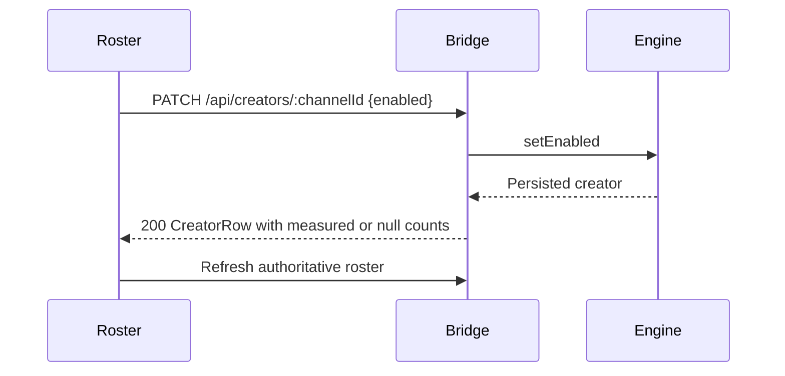
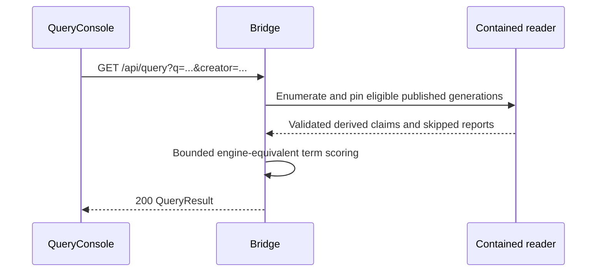
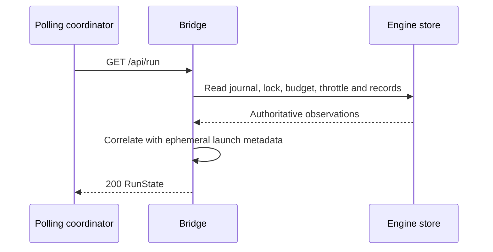
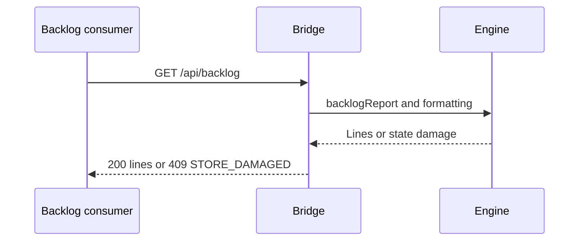
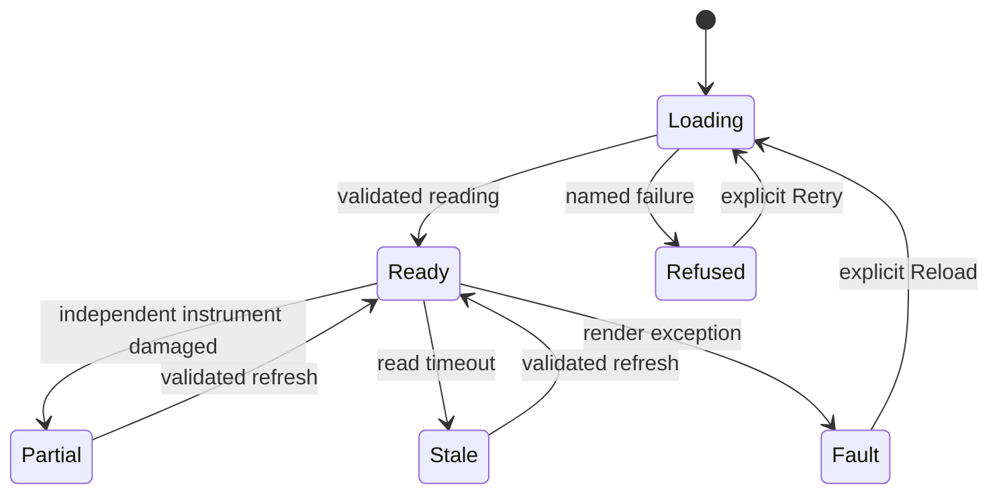
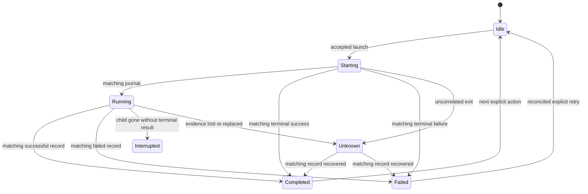
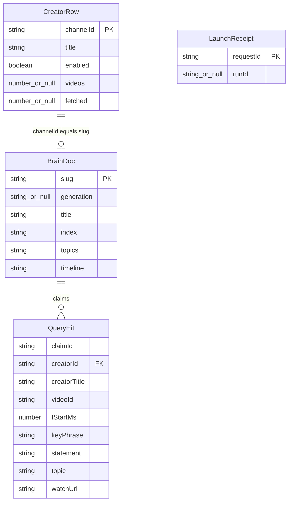

**Mounted surface and ownership**

[VERIFIED] `W/src/main.tsx:15` mounts `<App/>`; `App.tsx:85` creates the adapter/poller and `:103` mounts StatusBoard. Other product panels are planned.

[VERIFIED] `C/server.mjs:94` constructs the Node HTTP server; gates precede `dispatch` at `:130`. `C/routes.mjs:84` begins the ordered read routes, `:99` the writes, and `:113` the unknown-route refusal. No Express/production-backend mount belongs to this surface.

The bridge owns validation, worker lifecycle and safe response projection. Engine setters own registry writes. Engine runners own acquisition/repair and their private internal processing. Console presentation reads only validated derived files and metadata.



**API sequences**

Common to every sequence: rejected Host never reaches dispatch. Invalid requests receive named errors. Transport loss after mutation dispatch is uncertain.

```mermaid
sequenceDiagram
  participant U as StatusBoard
  participant B as Bridge
  participant H as Health worker
  participant E as Engine metadata
  U->>B: GET /api/status
  B->>H: Request refresh if due; do not wait
  B->>E: Read independent instruments
  E-->>B: Values and damage reports
  B-->>U: 200 StatusInstrument with provenance
```



```mermaid
sequenceDiagram
  participant U as Add form
  participant B as Bridge
  participant W as Resolver worker
  participant E as Engine
  U->>B: POST /api/creators {ref}
  B->>B: Validate; claim add slot
  B->>W: Resolve validated reference
  W-->>B: Validated channel identity
  B->>E: addCreator with synchronous resolved-value hook
  Note over E: Fresh registry read occurs after resolution
  E-->>B: Persisted creator
  B-->>U: 201 CreatorRow; release slot
```



```mermaid
sequenceDiagram
  participant U as Drawer
  participant B as Bridge
  participant R as Contained reader
  U->>B: GET /api/brains/:channelId
  B->>R: Validate namespace; pin pointer once
  R->>R: Validate paths; read four files from pinned generation
  R-->>B: Documents, validated claims, skipped reports
  B-->>U: 200 BrainDoc or named refusal
```







```mermaid
sequenceDiagram
  participant U as OpsRail
  participant B as Bridge
  participant H as Health worker
  U->>B: GET /api/canary
  B->>H: Start refresh if TTL expired
  B-->>U: 200 current reading; pending/history labelled
  H-->>B: Epoch-tagged result or failure
  U->>B: Subsequent scheduled read
  B-->>U: Updated reading
```

```mermaid
sequenceDiagram
  participant U as RunConsole
  participant B as Bridge
  participant C as Daily child
  participant E as Engine store
  U->>B: POST /api/run/daily {perHour}
  B->>B: Validate; claim operation slot; check lock
  B->>C: Spawn fixed engine entry and arguments
  B-->>U: 202 requestId and null runId
  C->>E: Engine journal and terminal record
  U->>B: GET /api/run
  B->>E: Read matching evidence
  B-->>U: Correlated phase or unknown
```

```mermaid
sequenceDiagram
  participant U as OpsRail
  participant B as Bridge
  participant W as Repair worker
  U->>B: POST /api/repair {}
  B->>B: Claim shared operation slot; check lock
  B->>W: runDaily only reconcile/build/export
  Note over W: Engine internal processing remains engine-owned
  W-->>B: Run record
  B-->>U: 200 RepairResult including ok and runId
```

Backup has no API interaction: its disabled control explains the gate. An otherwise policy-valid direct `POST /api/backup` receives 404.





No relational schema is touched. This ER diagram describes **transport fields**, not database columns; complete field definitions are in `03-contracts.md`.


