**Ownership**

The bridge owns HTTP validation, process lifecycle, bounded workers, launch metadata, and response projection. Engine functions own engine mutations. Web components own presentation and ephemeral state. The engine store remains authoritative.

Canonical mount evidence: `W/src/main.tsx:15–19` renders `<App/>`; `App.tsx#App` currently mounts StatusBoard. Future panels mount there. `C/server.mjs#createBridge` gates and dispatches to `C/routes.mjs#dispatch`; there is no Express or production-backend route in this product.

**User and subsystem flows**

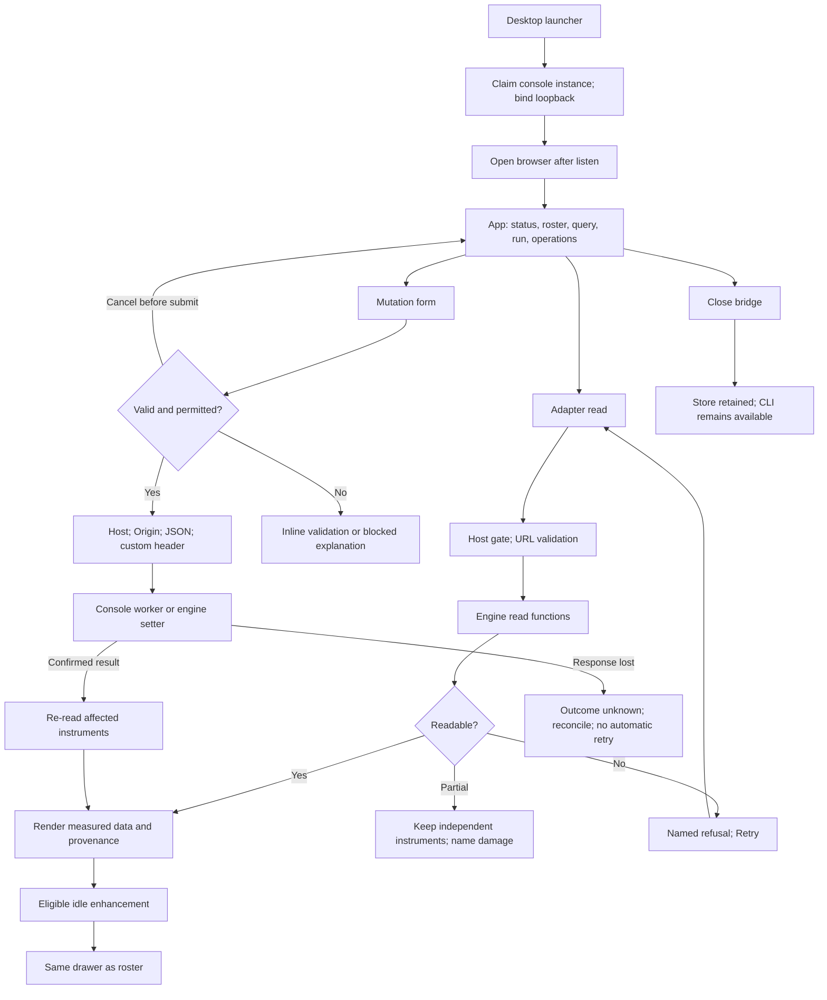

**API interactions**

Every route has its own sequence below. Common refusal branches: Host →403; malformed input →400; unavailable route →404; store damage →409 where the route is not composite; engine pre-write refusal →422. Transport failure leaves mutation outcome uncertain.

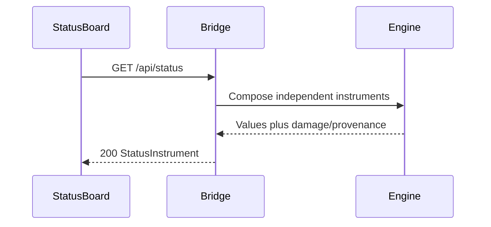

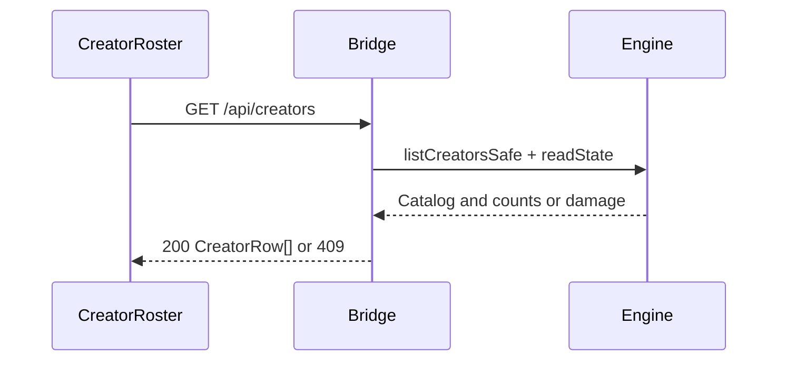

```mermaid
sequenceDiagram
  participant U as AddCreatorForm
  participant B as Bridge
  participant W as ResolverWorker
  participant E as Engine
  U->>B: POST /api/creators {ref}
  B->>W: Validate ref; defaultResolveCreator(url)
  W-->>B: Resolved channel or refusal
  B->>E: addCreator with synchronous resolved-value hook
  Note over E: Re-read registry now; preserve existing consent
  E-->>B: Persisted creator
  B-->>U: 201 CreatorRow with measured or null counts
  U->>B: GET /api/creators
```

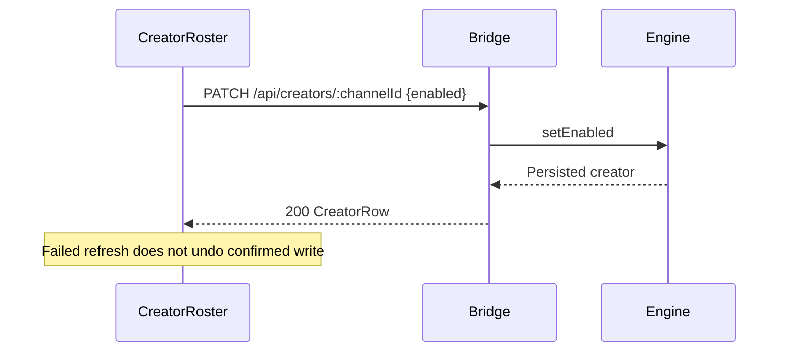

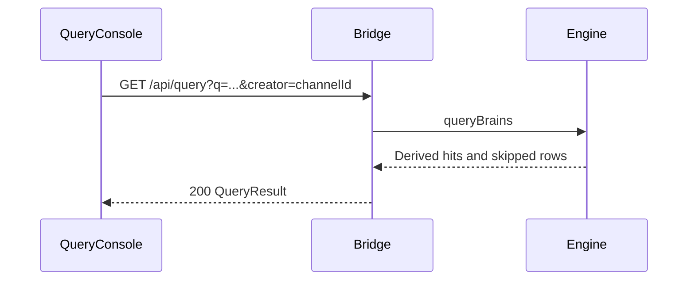

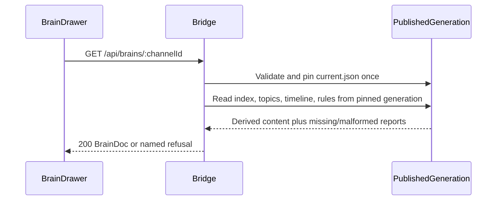

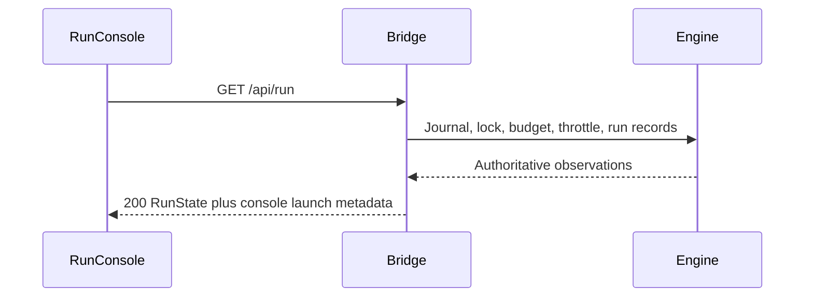

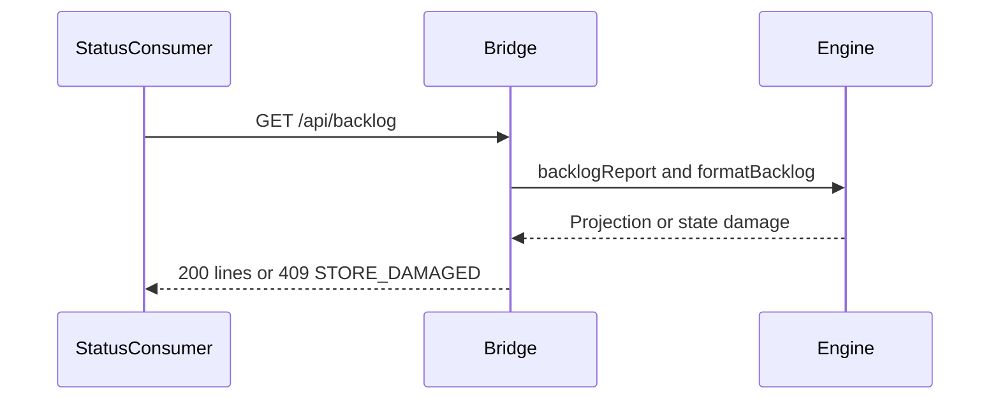

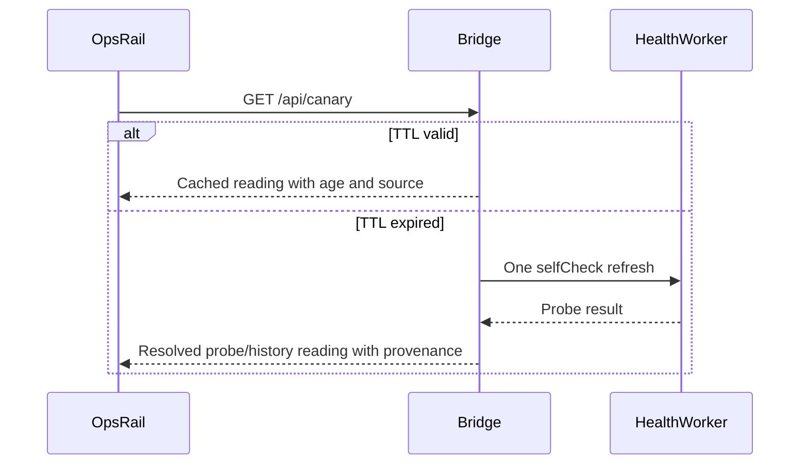

```mermaid
sequenceDiagram
  participant U as RunConsole
  participant B as Bridge
  participant C as DailyChild
  participant E as EngineStore
  U->>B: POST /api/run/daily {perHour}
  B->>B: Validate; claim operation slot; check lock
  B->>C: Spawn fixed run-daily.mjs path
  B-->>U: 202 {requestId,runId:null}
  C->>E: Engine journal, lock and run
  U->>B: GET /api/run
  B->>E: Read journal and matching run record
  B-->>U: Launch correlation and engine verdict
```

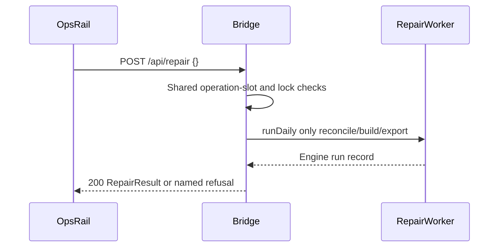

```mermaid
sequenceDiagram
  participant U as OpsRail
  participant B as Bridge
  U->>U: Backup remains disabled; explain privacy gate
  Note over U,B: No backup request is sent
  U->>B: Direct POST /api/backup before authorized slice
  B-->>U: 404 NOT_FOUND
```

**State machines**

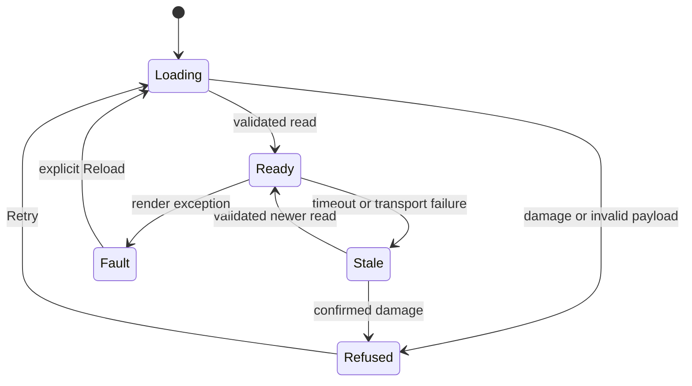

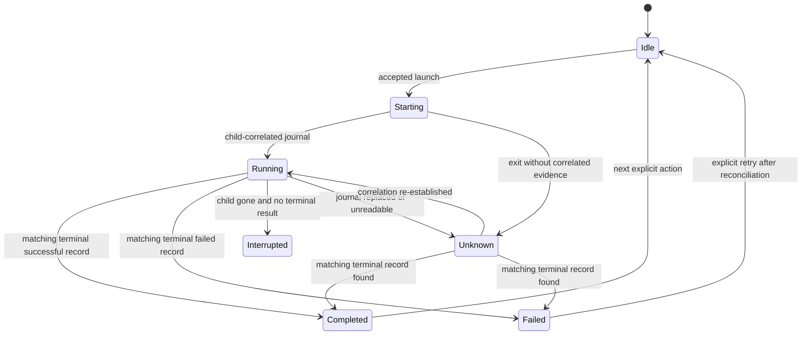

**Data model**

SQL ERD: **N/A — no relational schema or migration**. This diagram documents exact **transport fields**, not invented database columns:

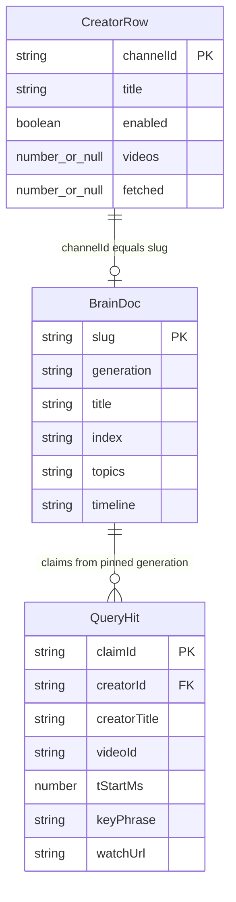

**Concurrency and recovery**

- Resolve creator references in a worker; never perform registry writes there.
- Maximum one add-resolution job; second request receives `409 OPERATION_BUSY`.
- Daily and repair share one console operation slot. Engine lock remains required.
- External CLI/scheduler concurrency is a real boundary. A preflight check is not an atomic lock.
- S4 is blocked until the journal/lock race test passes or the engine owner supplies a reviewed correction.
- Browser disconnect does not cancel committed work. No automatic mutation retry.
- Stop/restart does not restore data. Application rollback preserves the store.
