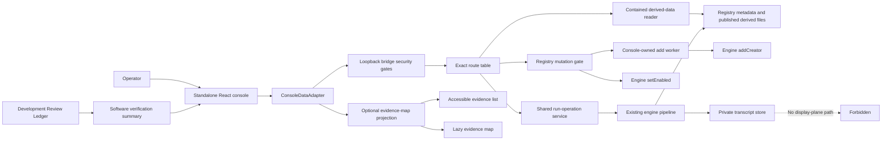
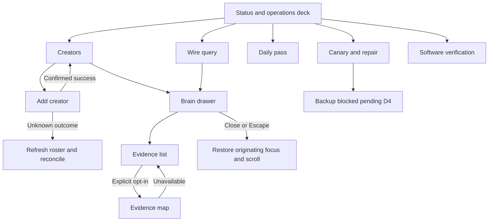
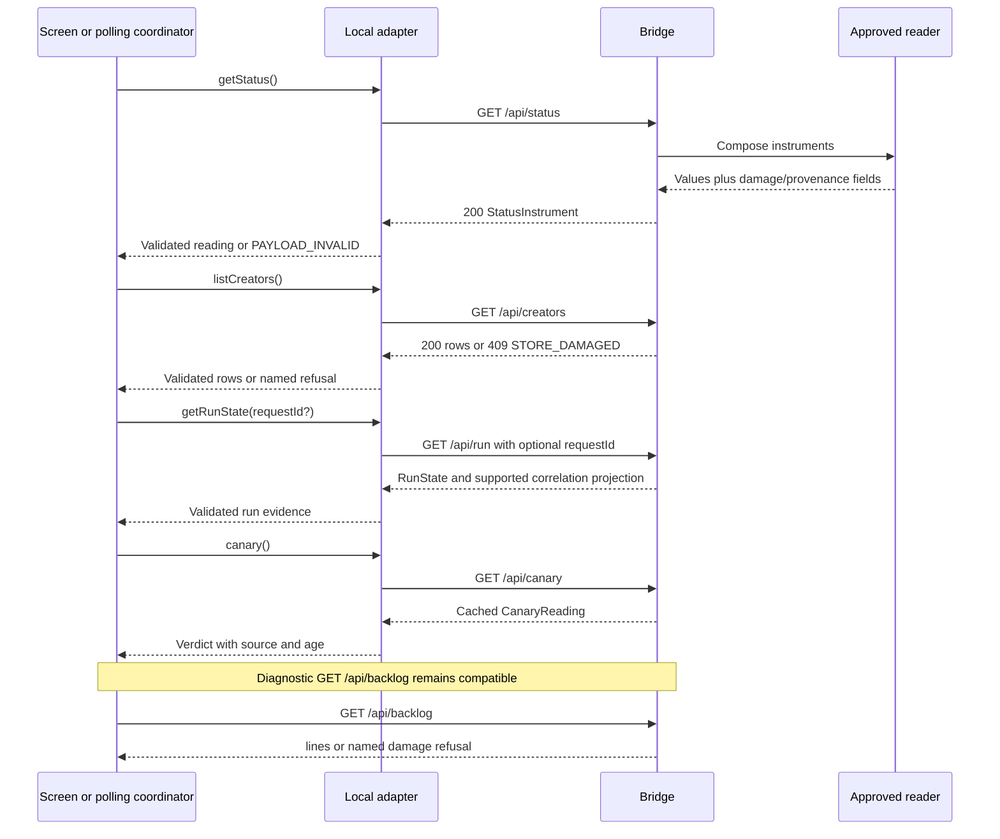
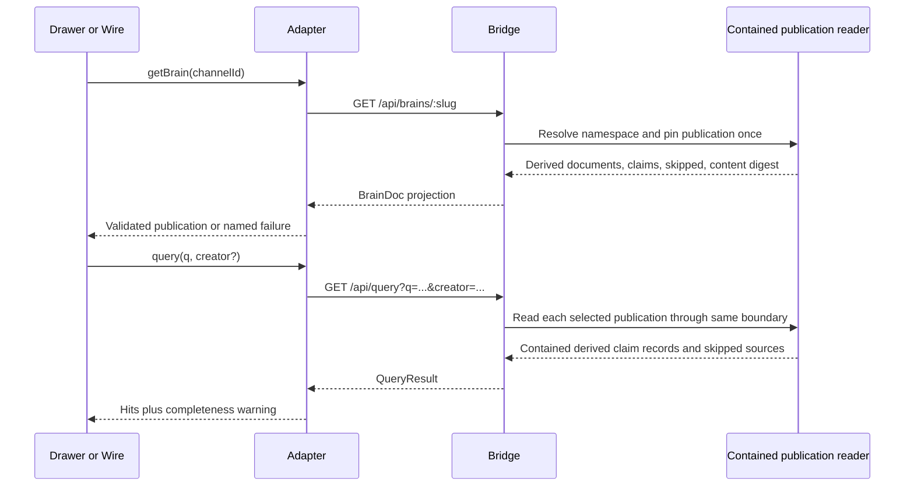
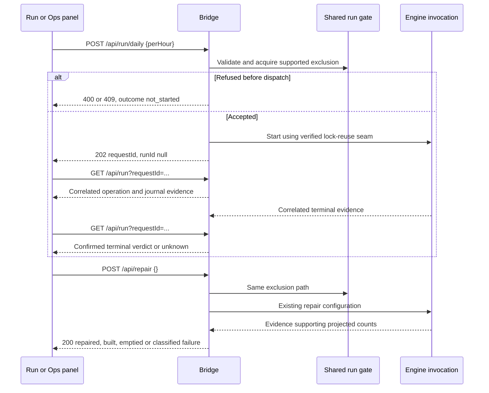
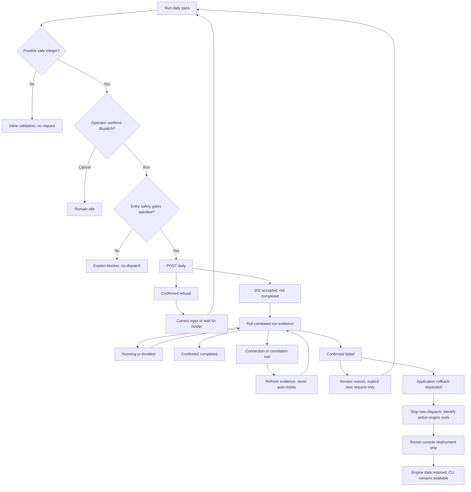
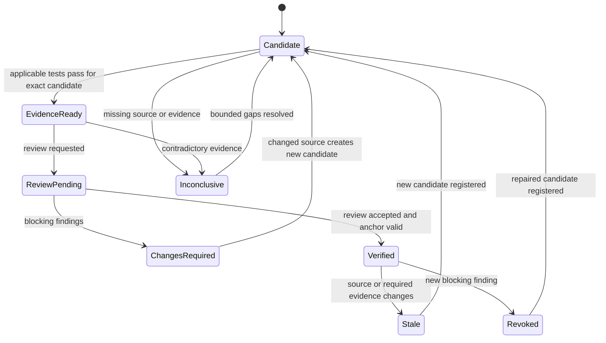
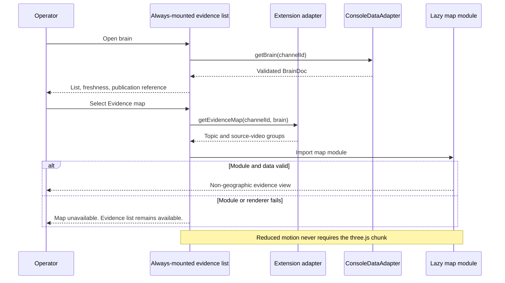
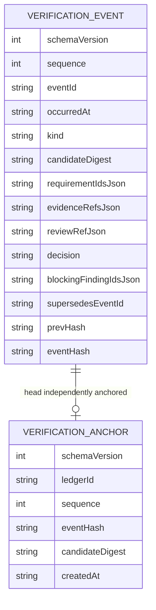

**Decision:** Preserve the deployed architectural seams. Add console-owned coordination and projections; do not move business writes into the UI.

| Boundary | Owner |
|---|---|
| Host validation, URL parsing, envelope | `server.mjs`; Host before dispatch, parser inside guarded handler |
| Exact endpoint allowlist | `routes.mjs`, with structure tests observing every dispatch site |
| Engine composition | `api.mjs` and bounded console `lib/` modules |
| Registry-write exclusion | Console registry gate; covers add and PATCH |
| Blocking add | Worker invoking the existing engine function |
| Engine durable mutations | Existing engine functions only |
| Published display reads | One contained console reader serving both query and drawer |
| Web transport/validation | Local adapter; no component-side fetch |
| Polling | One coordinator with generation guards and cancellation of obsolete reads |
| View selection | Console shell; one selected channel, drawer origin/focus target, query context |
| S5 | Existing constellation module; receives validated data and selection callbacks |
| Atlas | Optional extension adapter plus lazy 2D evidence view |
| Verification | Development ledger and injected read-only software-verification summary |

**Source-entry obligations:** bind the actual `App.tsx` JSX mount, adapter implementations, worker pattern, contained reader, and engine signatures before changing them. [UNKNOWN] Their complete source definitions are not in the packet.

**System and privacy flow**



**Screen/navigation flow**



**Read API interactions**

Each named message is a separate interaction with the same validated transport boundary.



**Add and enable interactions**

```mermaid
sequenceDiagram
  participant UI as Roster
  participant BR as Bridge
  participant G as Registry gate
  participant W as Add worker
  participant EN as Engine
  UI->>BR: POST /api/creators {ref}
  BR->>BR: Validate Host, origin, header, JSON, body
  BR->>G: Try acquire
  alt Busy
    G-->>BR: Refuse before dispatch
    BR-->>UI: 409 WRITE_BUSY, outcome not_started
  else Acquired
    BR->>W: Invoke addCreator through fixed worker entry
    W->>EN: Existing engine add
    UI->>BR: GET /api/status while add blocks
    BR-->>UI: Status response before add finishes
    EN-->>W: Engine result
    W-->>BR: Allowlisted result or typed failure
    BR->>G: Release after worker settles
    BR-->>UI: 201 CreatorRow or classified error
  end
  UI->>BR: PATCH /api/creators/channelId {enabled}
  BR->>G: Same non-queued gate
  BR->>EN: setEnabled
  EN-->>BR: Authoritative mutation result
  BR-->>UI: 200 row; counts may be null
  Note over BR,W: Disconnect does not cancel the write or free the gate
```

**Brain and query interactions**



**Daily/repair interaction**



**Daily-pass control flow, including recovery and rollback**



**Verification state machine**



**Atlas lazy-load sequence**



**Persisted model ERD**

No engine schema is created or migrated. These are exact fields of the **new console development ledger**, a JSONL file rather than SQL tables.



`requirementIdsJson`, `evidenceRefsJson`, and `blockingFindingIdsJson` are canonical JSON strings; `reviewRefJson` and `supersedesEventId` are nullable. Field names/types match `03-contracts.md`.

**N/A:** persisted UI preferences, SQL tables, Sequelize models, and foreign keys—none is introduced. Diagram rendering is not certified by this document; the package gate must parse the literal Mermaid sources.
