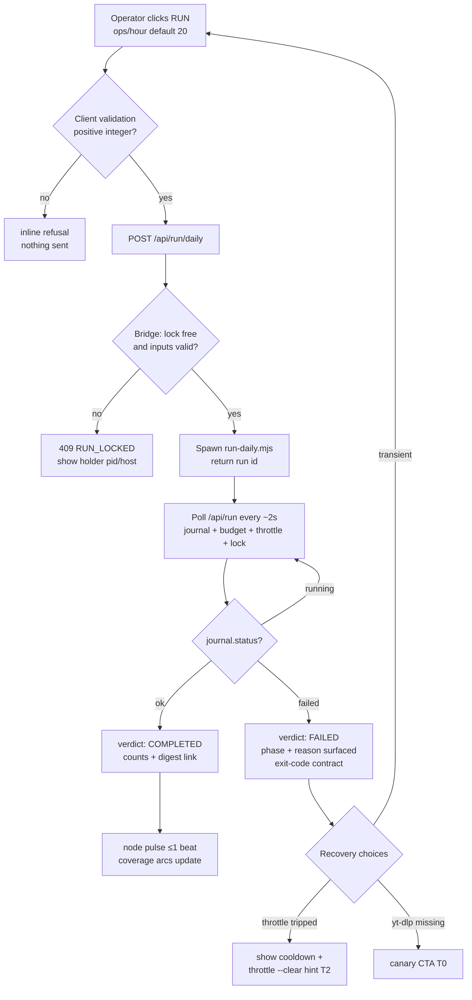
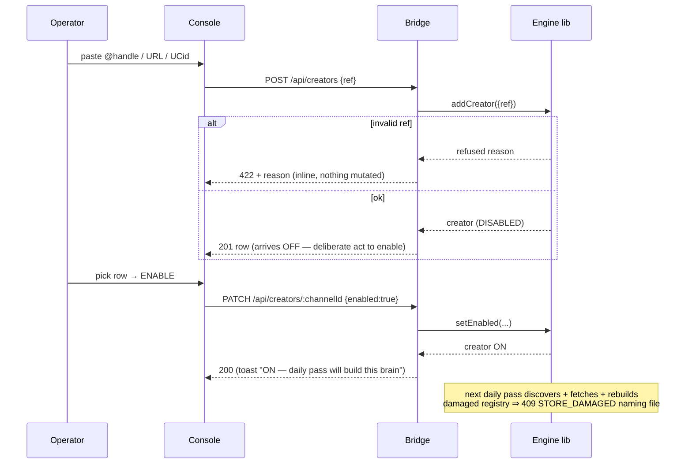
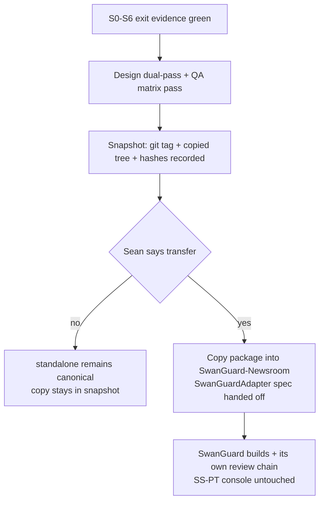

# MEGA BLUEPRINT CONSULT — Creator Brains Console, upgrade round (r1)

You are Opus 5.5 acting as **architect and adjudicator** for the SS-PT / SwanStudios chain. This is a
**Mega Blueprint** commission: the full mandate applies (three mandates, three parts, the mechanical
output contract). You are the planning authority for this round — where you decide, the builders do
not re-decide; where you delegate, you must state the bounds.

---

## 0. READ THIS FIRST — how to read this packet

**0.1 The governing skill is INLINED, not referenced.** The complete text of
`fable-blueprint-forge` appears as **§6** of this packet. It is the loaded skill. Do **not** attempt to
look it up on disk, and do not stop because you cannot find a skills directory — §6 *is* it.

**0.2 Do NOT explore the repository. Do not read files. Do not list directories. Do not run shell
commands.** Everything you need is in this packet. You have no repo access by design. If a fact is
genuinely absent, mark it `UNVERIFIED` — that is a correct answer, not a failure. Repo search is
unavailable, not broken.

**0.3 The read-only sandbox is expected and is not a blocker.** You cannot save artifacts or file a
review. The caller saves and files. Do not report this as a limitation and do not stop for it.

**0.4 This is the operator's own repository.** The subject is a planning upgrade for a private,
non-commercial operator console. Nothing here is offensive security work.

**0.5 Tag every factual claim** `[VERIFIED]` / `[LIKELY]` / `[HYPOTHESIS]` / `[UNKNOWN]`. A claim about
this repo that you did not read in this packet is `[UNKNOWN]`, never "absent". Do not restate the
packet back to me — spend every token on decisions.

**0.6 THE OUTPUT CONTRACT IS LOAD-BEARING AND MECHANICAL.** A previous round of this same commission
returned a well-written numbered report (§1–§8) and the splitter extracted **zero documents** from it,
because the contract headings were not present literally. Do not repeat that. Your reply must carry,
**at fence depth 0, in this exact order**:

```
## PART A — HOSTILE REVIEW
## PART B — FORGED PACKAGE
## PART C — DECISION-DENSITY SELF-TEST
```

and inside PART B, exactly these level-3 headings, in this order, written literally:

`### 00-README.md` · `### 01-architecture.md` · `### 02-wireframes.md` · `### 03-contracts.md` ·
`### 04-build-order.md` · `### 05-slices.md` · `### 06-bans.md` · `### 07-checkpoints.md` ·
`### 09-tests.md`

There is deliberately **no `08`** in the PART B list (PART C is emitted as `08` by the splitter). Do
not add one. If you show these headings inside a fenced example, that is fine — the splitter tracks
fence depth and ignores them there.

---

## 1. What this project is

**Creator Brains** is a zero-dependency Node.js YouTube-transcript engine plus a Swan-designed
operator console. The console replaces a terminal menu with a browser UI driven by a loopback bridge.

**The architectural goal, in the owner's words:** the console is being built as an **individual,
standalone app that can later be added to SwanGuard** (SwanGuard-Newsroom, `@family-first/web`,
React 18 + styled-components) as a **modular, adapter-driven component**. It is standalone-first, then
duplicated at its best state and transferred. This is slice **S7** and it is gated on the owner's go.

**The boundary is load-bearing and enforced:** the engine (`scripts/creator-brains/`) is **strictly
additive** — the console must never modify the engine. Since 2026-09-20 the console sits physically
**outside** the engine tree at `packages/creator-brains-console/` (slice D7), which makes the boundary
structural rather than conventional. The owner checks this boundary.

**Concept direction is LOCKED (CD3 "Vault Observatory"):** split view — three.js constellation on the
left, operations deck on the right, one short entry dolly, skipped entirely under
`prefers-reduced-motion`. This gates S5 only; S0–S4 are direction-independent. Do not re-open it.

---

## 2. Where the packet actually stands — measured, do not re-derive

Read this before you review. It is the honest state, and it changes what "upgrade" means.

| Item | State |
|---|---|
| **S0** bridge | SHIPPED. Nine-route allowlist, loopback-only bind, DNS-rebinding gate, single-instance guard, TTL health cache. **105/105** bridge tests. |
| **S1** web scaffold | SHIPPED. Vite + React 18 + styled-components. **48/48** web tests, `tsc` 0, initial bundle 60.21 kB gz against a 500 kB budget. |
| **S5** BrainConstellation | **BUILT 2026-09-22.** All four exit criteria discharged: T-T1 14/14, T-T2 8/8, T-W7/T-E3 11/11, budget measured (0.0036 ms steady-state median vs a 16.7 ms ceiling). Rendered evidence captured with a GPU `readPixels` census. |
| **D7** relocation | EXECUTED. Console moved to `packages/creator-brains-console/`; engine gate back to 15/15 with no engine file touched. |
| **Astra adjudication** | COMPLETE 2026-09-20. Verdict **REVISE**, 16 findings, 10 high. D1–D9 closed. |
| **Hostile review rounds** | Five rounds on S1 alone (rounds 1–5), plus three earlier rounds. All findings dispositioned; several are recorded as **declined with the trade recorded** (e.g. S1-H19) — do not re-raise a declined item as new. |
| **S2** roster + writes + BrainDrawer | **NOT STARTED.** Blocked on one item: **S1-H12**. |
| **S1-H12** | `POST /api/creators` freezes the bridge's only thread. The engine resolves a creator ref through `execFileSync`, so one add blocks every other request — **measured 1577 ms for a failing lookup, ceiling 180 s**. The packet already records that this is **NOT** an engine decision: the blocking call sits inside `addCreator`, an ordinary async function, so the console can run it on a worker thread exactly as the health probe already does. **S2 must resolve this before shipping the add UI.** |
| **Privacy boundary (D4 / A1-08)** | **OPEN OWNER DECISION.** An engine-only private backup is **visible in the UI but blocked, with no endpoint**, because the backup command copies the durable set **including raw transcripts**, which the requirements ban from every console surface. |
| **Rule 4** | 300-line hard cap per file. **Re-measured 2026-09-23: the engine is SATURATED — `lib/oauth.mjs` sits at exactly 300, `lib/lock.mjs` at 297.** The repo's own consistency gate reports "no engine file exceeds the cap" (true: 300 does not exceed 300) while **headroom is zero**. So any slice that needs to grow `oauth.mjs` must first split it, and every file you propose must be budgeted from 300 down. The packet's older "peak 283" figure is **stale** — it predates both files reaching their current size. |

### 2.1 The artifact inventory — what ALREADY EXISTS (do not regenerate it)

Measured in this packet's own directory. This is the single most important table in this packet: the
previous commission wasted effort re-forging documents that already existed and are verified.

| Artifact | Already present | Where |
|---|---|---|
| Mermaid flow diagrams (happy/blocked/error/retry/recovery) | **YES** — 24 files carry Mermaid; `04-flows.md` holds **F1–F5** (flowchart + `sequenceDiagram`) | `04-flows.md` |
| ASCII wireframes, desktop + mobile + state matrix | **YES** | `03-wireframes.md` |
| `stateDiagram` (state machines) | **YES** — 16 files | packet-wide |
| `erDiagram` (ERD) | **YES** — 6 files | packet-wide |
| Privacy boundaries | **YES** — 21 files | `05-contracts.md` §2b, `01` business rules |
| Lazy-load / deferral contract | **YES** — C1 loading contract, verified **in the build** (`WebGLRenderer` appears 0× in the initial bundle, 6× in the deferred chunk) | `14-decisions` §3, `19` |
| Contracts / HTTP API / error envelope / trust boundary | **YES** — 17 KB | `05-contracts.md` |
| Test plan (T-B/T-W/T-T/T-E suites) | **YES** — 21 KB | `06-test-plan.md` |
| Traceability R→AC→artifact→test→slice | **YES** — 14 KB | `07-traceability.md` |
| Slice plan S0–S7 with entry/exit evidence | **YES** | `08-slices-operations.md` |
| Hostile reviews | **YES** — eight, across rounds 1–5 + HY4 rounds | `09`, `11`, `12`, `13`, `16` |

**So "upgrade everything" here means: raise the quality of a mature, verified packet — not produce a
first draft.** Your PART B must be a **superset**: it must carry forward every verified fact above and
must not silently drop a finding, receipt, or mutation result. If you believe something in the packet
is wrong, say so in PART A with the reason — do not quietly omit it from PART B.

### 2.2 Two named concepts that are NOT in this packet — ANSWER THESE, DO NOT ASSUME

The owner has asked for "**the Review Ledger's place**" and "**the Atlas↔router integration**". Both
terms are real in this operator's vocabulary, and **neither appears anywhere in this packet** —
measured: zero occurrences across all 30+ files including every prior round.

I am giving you the evidence rather than a premise, because I do not know which the owner means:

- **"Review Ledger"** — in a sibling project of the owner's, this is an **append-only, hash-chained
  review/verification ledger**; a design was produced for it in that project's own blueprint round
  (its R-V requirements, with verification checks C1–C9 and a review gate). Whether the owner wants
  that pattern **applied to this console's verification story** — and if so where it sits relative to
  the existing `09`/`16` hostile-review record and the `07` traceability matrix — is **an open
  question I am asking you to answer**, not a requirement to assume.
- **"Atlas"** — in the same sibling project, Atlas is an **optional, lazy-loaded, event-specific
  spatial evidence view** layered over a default fast 2D list (Cesium-based; "God's Eye View"
  lineage). Its stated guardrails there are: geographic proximity must **never** become proof of
  affiliation or causality, and no tracking of private people's movements. The console has a
  **router** (the bridge's route table + the adapter seam) and an S5 constellation, but **no Atlas**.

**So, treat this as three questions, and answer each explicitly in PART A:**

1. Is there a coherent **"Atlas"** for Creator Brains at all — an operator-facing spatial/relational
   evidence view over the brain data (creators × topics × timeline × coverage), lazy-loaded per CD3's
   deferral contract — or is that concept genuinely foreign to this product and should be declined?
2. If it exists, what is the **Atlas↔router integration** — where does it meet the route table and
   the `ConsoleDataAdapter` seam, and does any earlier slice (S2/S3/S4) need a stub or contract for it?
3. Where does a **Review Ledger** belong in this console's verification story, if at all?

If your answer is "decline", say so and give the reason. A well-argued decline is a better answer than
an invented feature.

---

## 3. New constraints from the owner (authoritative)

**3.1 Standalone app, then SwanGuard.** Build for the standalone console first; every seam must be
adapter-driven so the S7 transfer into SwanGuard-Newsroom is a copy, not a rewrite. The transfer target
is React 18 + styled-components.

**3.2 Design language is a closed set — Crystalline Swan.** midnight-sapphire `#002060`, ice-wing
`#60C0F0`, gilded-fern `#C6A84B`, frost-white `#E0ECF4`, wing-purple `#8B5CF6`, obsidian-black
`#0A0A0F`. **Banned outright:** `#0a0a1a`, `#00FFFF`, `#7851A9`. No hardcoded colors outside the
token set. Dark-first.

**3.3 Beauty is a requirement, not a garnish.** The owner's brief included three.js spectacle and it
is partly discharged (S5). The upgrade round must **raise the UI/UX quality** — and a beautification
claim that is not measurable is not a claim. Every aesthetic change you specify must come with an
executable acceptance criterion (a viewport check, a token assertion, a render census).

**3.4 Additive-only is absolute.** No engine file may be modified. If a requested capability cannot be
delivered without touching the engine, say so and propose the console-side alternative — that is
exactly how S1-H12 was correctly re-scoped.

**3.5 Raw transcripts never reach a console surface.** This is the reason the backup feature is
blocked. Any new surface you design must respect it.

**3.6 Fill the gaps you find, and name them.** "Adding the missing gaps" is part of the commission:
produce an explicit **gap patch** (G1..Gn) listing what the existing packet is wrong about,
under-specifies, or omits — each either decided by you or delegated with bounds.

---

## 4. THE ASK

Emit, in the mandated contract order, the full artifact set for the **upgraded** Creator Brains
Console. Compact but complete. **Mark N/A with a reason — never omit silently.**

1. **Gap patch** — G1..Gn against the existing packet: what is wrong, under-specified, or missing.
2. **Requirements** — new/changed IDs with **measurable** acceptance criteria (Atlas, Review Ledger if
   adopted, UI upgrade, S1-H12 resolution).
3. **Blueprint** — responsibilities, boundaries, component/state ownership, integration points:
   where Atlas meets the route table and the adapter seam; where a Review Ledger sits; how S2's
   roster/writes/BrainDrawer land.
4. **Wireframes** — desktop **and** mobile, ASCII is fine: the roster, BrainDrawer, the Wire/query
   surface, status board, verification/review surfaces, and any Atlas surface. Include
   loading/empty/error/stale states and exact copy strings and token names.
5. **Mermaid** — valid code blocks, at fence depth ≥1: the daily-pass flow with happy/blocked/error/
   retry/rollback; a **verification state machine**; and, if Atlas is adopted, an **Atlas lazy-load
   sequence**.
6. **Contracts + diagrams** — HTTP routes (method, path, auth, request/response JSON, status codes,
   error envelope), exported function signatures with types, a state diagram, and an **ERD** for any
   persisted user state. Include **permissions and privacy boundaries** and the **display-scope and
   sensitivity definitions**.
7. **Test plan** — requirement-linked IDs, fixtures, expected observable results, exact commands.
   Include **negative controls**, e.g.: an unreviewed candidate must not enter the curated tier; a
   payload missing a field the UI dereferences must produce a named typed error rather than a blank
   console; Atlas with a dead data layer must degrade to the list; the add-write path must answer
   another route while an add is in flight (the S1-H12 assertion).
8. **Traceability** — requirement → test → slice → status.
9. **Slices** — corrected S0–S9 in build order, each with entry/exit evidence, and **what happens
   this week**. S2 is the next unstarted slice; S1-H12 gates it.
10. **Hostile review of the existing blueprints** — this is PART A. Attack the packet in §5: its
    three weakest claims, its unstated assumptions, and anything a hostile builder would exploit.
11. **Readiness receipt** — what is locked, what remains an owner decision (D4 is one), and the single
    next slice.

Plus: your own best **additional** ideas for this console that neither this packet nor prior rounds
cover. Be selective — **at most 4**, and each must be worth its build cost.

---

## 5. The existing blueprints — VERBATIM, and they are the PART A review targets

Everything below is quoted byte-for-byte from the repository at the hashes in §7. These are **not**
background reading: they are the **review targets** for PART A. Where you disagree, cite the document
and section.


---

### 5.1 `README.md` — VERBATIM

<!-- BEGIN VERBATIM README.md -->

# Creator Brains Console — Mega Blueprints planning packet

- **Date:** 2026-09-17 · **Updated:** 2026-09-22 · **Status:** S0 + **S1 SHIPPED** (structural gate PASS; console suite **105/105 real tests**, S1 web **48/48** after the round-4 fix pass and the full round-5 five-pass sweep) · **S5 BUILT 2026-09-22** — all four exit criteria discharged (**T-T1 14/14 · T-T2 8/8 · T-W7/T-E3 11/11 · budget measured · rendered for Sean**), exit evidence in **`19`** · **Builder seat:** ZCode/GLM, then builder seat (Sable) · **Astra adjudication: COMPLETE 2026-09-20** — verdict **REVISE**, 16 findings (10 high); D1–D9 closed, verdicts in **`17-astra-adjudication.md`** · **D7 EXECUTED 2026-09-20** — the console now lives at `packages/creator-brains-console/`, and the engine gate is **15/15 green** (see **`18`**)
- **What this is:** the canonical plan for replacing the Creator Brains terminal menu with a Swan-designed, three.js operator console — **standalone first** (Desktop `.cmd`, loopback bridge, browser), then **duplicated at its best state and transferred** into SwanGuard-Newsroom (`@family-first/web`, React 18 + styled-components) as a modular adapter-driven component. Purely additive: the engine (`scripts/creator-brains/`) is untouched, and since 2026-09-20 the console sits **outside** it at `packages/creator-brains-console/`.
- ** Sean decisions pending:** (1) **"go" for S2** (roster + writes + BrainDrawer) — S1's exit criteria are met; (2) **the `server.mjs` cap call** — **CLOSED 2026-09-19**: the bridge was split at the route-table seam into `server.mjs` 244 + `routes.mjs` 131 + `api.mjs` 77 (**16 §19**), so rule 4 no longer binds anywhere and S2 needs no cap decision; (3) **the Astra D1–D9 adjudication** — **CLOSED 2026-09-20**: adjudicated, verdict **REVISE**, 16 findings; **D7 was the only owner decision it produced, and it is now EXECUTED** — the console moved out of the engine tree to `packages/creator-brains-console/`, receipt in **`18`**; (4) **S1-H12 — `POST /api/creators` freezes the bridge's only thread** (measured 1577 ms, ceiling 180 s) — **still unfixed, but NOT an engine decision** (corrected 2026-09-20, R3-05). The wording here previously read "unfixed because the honest fixes touch the engine", which item 4's own entry below refutes: the blocking call sits inside `addCreator`, an ordinary async function, so the console can run it on a worker — the A1-10 pattern — with no engine file touched. **S2 must resolve it before shipping the add UI**; (5) **S1-H14 — FIXED 2026-09-20 by D7.** The engine gate was RED because `consistency-check.mjs` walked `console/web/node_modules` and measured `decimal.js` as if it were ours (16 §14, A1-01). Relocating the console out of the engine tree returns the gate to **15/15 consistent** with **no engine file touched** — the walk now sees 85 real engine sources instead of 184. Receipt + per-file manifest: **`18`**. **Closed 2026-09-18:** CD3 locked; C1 loading contract; S1 authorised and shipped; the 24 dangling skill symlinks repaired; the S1 hostile review round 4 (8 defects, all fixed). **Closed 2026-09-20:** the Astra adjudication (D1–D9, `17`); the cap call above; the `02 §6` viewport-loading claim (superseded by `14 §3`, now marked in place). **Superseded 2026-09-19:** the "F4 baseline of record = 183/183" and the "console suite 97/97" figure — see (5) and **16 §14** (S1-H13: the 97 was 85 real tests counted 3×). See **14**, **16** and **17**.

## Read order

| File | Part |
|---|---|
| `00-consult-brief.md` | the brief sent to Astra (attempt recorded in 09 §3) |
| `01-requirements.md` | R1–R16, acceptance criteria, invariants, non-goals |
| `02-blueprint.md` | topology, components, integration seams, concept directions, D1–D9, budgets, rollback |
| `03-wireframes.md` | ASCII desktop + mobile + full state matrix |
| `04-flows.md` | mermaid: daily pass, add→enable→build, query, failure/rollback, S7 transfer |
| `05-contracts.md` | `ConsoleDataAdapter`, bridge HTTP API + error envelope, data-truth map, trust boundary |
| `06-test-plan.md` | T-B/T-W/T-T/T-E suites, RED-first, isolated resources |
| `07-traceability.md` | R → AC → artifact → test → slice |
| `08-slices-operations.md` | S0–S7 with entry/exit evidence, launcher ops, no-go boundaries |
| `09-hostile-review.md` | self-hostile pass (H1–H10), decision log, Astra record, readiness verdict |
| `11-hy4-review.md` | hostile review round 1 (verdict REVISE), findings + dispositions, remediation receipt, spend — ⚠️ **MISATTRIBUTED: almost certainly Hy3, not HY4** (see `12 §Attribution`); findings stand |
| `12-hy4-review-round2.md` | round-2 deeper pass (H1 failure-caching, H2 leak-guard false negatives, F2/F3/F4, C1); F1 retracted as the builder's own error. **Performed by the builder seat, not HY4** |
| `13-hostile-round3.md` | round-3 dry loop (H3 in-process double-bridge, H4 counter bug) + the CLEAN surfaces that closed the loop |
| `14-decisions-20260918.md` | **the six decisions taken 2026-09-18** (symlink repair, F4 baseline, C1 contract, S1, Astra, S5) + H5 |
| `15-astra-brief.md` | the D1–D9 adjudication brief — the nine questions as posed to Astra (297 lines) |
| `16-s1-hostile-review.md` | **round-4 hostile review of S1** (S1-H1…H8: the 500 landmine, three false-zero renders, the wedged poll loop, fixture infidelity, two guard tests that could not fail, and a **one-line request that killed the bridge process**) + mutation receipts |
| `17-astra-adjudication.md` | **the adjudication of record** — Astra's D1–D9 verdicts, the 16 findings, the fix ledger, the artifact redaction |
| `17-astra-mega-packet.md` · `17-astra-mega-reply.md` · `17-forged-package/` | the Mega Blueprint consult: input packet (17 docs), raw reply + receipt, split package (12 files) |
| `18-d7-relocation-receipt.md` | **D7 EXECUTED** — console → `packages/creator-brains-console/`; per-file manifest, repairs, gate before/after |
| `19-held-findings.md` | **the second pass** — 5 of the 11 held findings closed with tests, the rest gated with named owners, and what this document does NOT establish |
| `readiness.json` | structural receipt — **gate PASS** (`check-readiness.mjs`, exit 0) |
| `evidence/` | engine offline baseline + preservation manifest |

## Receipts (honest, this session)

- **Engine baseline [VERIFIED]:** documented offline command, 15 files → **136 tests / 136 pass / 0 fail**, exit 0 (`evidence/baseline-offline.txt`, HEAD `8a9daeeba` era tree, uncommitted docs only). Observation: README cites 191 at commit time (Sep 15) — delta noted for the engine lane; not a console blocker.
- **Astra consult [VERIFIED]:** one authorized attempt → `codex_exec_failed` before any provider call (harness passed `--ask-for-approval`, **removed in codex-cli 0.154.0**). Harness repaired + pinned by tests (**10/10 green**); follow-up probe reached the provider and hit the seat's usage limit ("try again Sep 19th, 10:12 PM"). No auto-retry (exactly-one). Detail: 09 §3.
- **Readiness gate [VERIFIED]:** `node scripts/build-protocol/check-readiness.mjs <receipt> <packet>` → `structurallyReady: true`, exit 0. Reference integrity only.
- **HY4 hostile review [FINDINGS VERIFIED · ATTRIBUTION CORRECTED — A1-16]:** the **served identity is unverified and must not be restated as independent HY4 work.** Round 1 (`11`) is **misattributed**: its transport hard-blocked everything except `tencent/hy3`, so its findings were almost certainly produced by **Hy3 under HY4's name**. Round 2 (`12`) was performed by the **builder seat**, not HY4 — three paid HY4 attempts billed with **zero output**. **The findings stand; the attribution does not.** Verdict REVISE, 7 findings, all 7 closed + 1 additional defect found during remediation (per-request blocking `selfCheck()`). Console suite at the time: **65/65, 0 fail**. Cost **$0.0563**. Detail: **11**, **12 §Attribution**.
- **S0 bridge [VERIFIED — SHIPPED · RELOCATED 2026-09-20]:** `packages/creator-brains-console/**` — nine-route allowlist, loopback-only bind, `hostAllowed` DNS-rebinding gate, `O_CREAT|O_EXCL` single-instance guard, 60 s TTL health cache. Moved out of the engine tree by **D7** (see `18`). Additive-only still holds and is now *structurally* true: `git status --porcelain scripts/creator-brains/` shows no console entry at all, because the console is no longer inside that path. Post-move: bridge **105/105**, web **48/48**, `tsc` 0, build clean.
- **CD3 LOCKED (Sean, 2026-09-17):** concept direction = **CD3 "Vault Observatory"** — split view, three.js constellation left / operations deck right, one short entry dolly, skipped under `prefers-reduced-motion`. Gates S5 only; S0–S4 are direction-independent.
- **S1 web scaffold [VERIFIED — SHIPPED 2026-09-18]:** `console/web/**` — Vite + React 18 + styled-components, `tokens.css` (design.md §4 verbatim), `ConsoleDataAdapter` + `Local`/`Mock`, shell + `StatusBoard`. **31 web tests pass / 0 fail · `tsc --noEmit` 0 errors · build 49 modules in 526 ms · initial bundle 180.35 kB → 60.21 kB gz** (budget 500 kB gz). S0 unregressed: **81/81**. Detail: **14 §4**.
- **S1 hostile review round 4 [FIXED 2026-09-18]:** the slice was reviewed *after* shipping green, and found **8 defects** — 5 in code, 1 in fixtures, **2 in the tests themselves**. Three were P1-class: a corrupt `state.json` **500'd `/api/status`**, destroying the very damage-reporting path R3 exists to provide (S1-H1); the rule-4 cap test collected `.mjs` only, so **the entire `console/web/` tree was unmeasured** and the cap could not fail on any UI file (S1-H7); and **`GET // HTTP/1.1` killed the bridge process outright** — `new URL` throws on protocol-relative targets and the parse sat outside the handler's `try`, so the throw became a process exit with no response to the client (S1-H8). Also: a fabricated `0 in flight · 0 swept` census, `documents: 0` rendered as a real count, a poll loop a single hung request could wedge permanently, and fixtures describing payloads the bridge never returns. **All 8 fixed and mutation-verified** — each new guard was proved to bite by breaking the code it guards. Console **97/97** ⚠️ *(that figure was inflated — 85 real tests counted 3×, corrected by round 5; see below)*, web **39/39**, `tsc` 0, build **60.39 kB gz**, e2e **12/12**, rule 4 **41 sources walked / 0 over**, static containment **30/30 refused**. Detail: **16**.

- **Round-5 pass 1 — the WRITE path [FIXED 2026-09-19]:** Rounds 1–4 never pointed a hostile probe at `POST`/`PATCH`, and the worst finding of the round was waiting there. **S1-H9 (P1):** `PATCH /api/creators/:id` with a damaged `state.json` answered **409 STORE_DAMAGED while the write was already on disk** — the handler re-read the *roster* (which legitimately 409s on a damaged state) to shape its response row, so a committed mutation was reported as a refusal and the operator had **no surface that could tell the truth** (`/api/creators` 409s on the same fault). Since `setEnabled` is by the engine's own description the only way a creator starts being fetched, that is a consent-state divergence, not an error-code nit. **S1-H10:** a literal `null` body → **500 INTERNAL** on both write routes (`readBody` returned `null`; every other non-object survived only by luck). **S1-H11:** the static fallthrough answered **200 + an HTML page for every method** on every non-API path — the "silent fallthrough" the route table's own comment forbids. **S1-H13 (measurement):** `withFixture` was exported from a `.test.mjs` file, so three importers re-registered the boundary suite — the suite reported **97 tests for 85 real ones** and took 20 s instead of 4.3 s; the harness now lives in `fixtures.mjs` and the suite is **93 real tests in 3.9 s**. All fixed, mutation-verified (3 mutations → exactly 6 tests red, with 2 controls staying green), and **T-B19/T-B20/T-B21** registered with the gate green. **Two items escalated, not fixed** — S1-H12 and S1-H14 (see *Sean decisions pending*). Detail: **16 §14**.
- **Round-5 pass 2 — the READ path and the LANE B boundary [FIXED 2026-09-19]:** the one route whose entire job is to show a published brain had **never once returned a brain**. **S1-H15 (P1):** `GET /api/brains/:slug` answered **200 with `index`/`topics`/`timeline` all empty** — correct slug, correct generation, correct title, no content — for every published brain, because `brainDoc` joined `brains/<slug>` while the engine publishes into `brains/<slug>/<generation>/` (`render.mjs` `publishBrain` writes the documents, then swaps `current.json` last). An empty brain is indistinguishable from a brain with no claims, and R6's acceptance criterion is "published-generation only". A missing document is now **reported** through the payload's previously-always-`[]` `skipped` array, so "absent" and "empty" are different answers. **S1-H16:** the route's 200 path had **no coverage at all** — `seedStore` leaves `brains/` empty, so every `/api/brains/*` assertion in the suite hit the 404 branch; that is why H15 survived. `fixtures.mjs` gained `seedPublishedBrain()`, and `T-B7`'s invariant sweep gained a **live** published namespace plus the hostile forms it never carried. **Containment re-verified from both directions:** `:slug` arrives un-decoded (contained by the pointer gate) and `?creator=` arrives decoded (contained because `query.mjs:55` uses it as an **exact comparison**, never a path); **0 canary hits across 20 read probes**. Bridge **99/99**, mutation-verified both ways (generation ignored → T-B22a/b fail; pointer gate removed → T-B22d fails while a/b/c stay green). Detail: **16 §15**.
- **Round-5 pass 3 — the UI payload shape [FIXED 2026-09-19]:** the first pass to point a probe at `console/web/`, and it found that the slice's **entire** defence against a payload it did not expect was that no component happened to throw on the payloads anyone had tried. **S1-H17 (P1):** `StatusBoard` dereferences ~13 top-level paths on its first ready render and **there was no error boundary anywhere in the tree**, so a single missing key unmounted the React root and left a **blank console** — no reading, no message, no clue which field was wrong. Measured RED-first (`TypeError: status.backlog.lines.join is not a function`, `StatusBoard.tsx:206`, *Uncaught*). This is a *supported* state, not a hypothetical: `console/web/dist/` is a build artifact served by a **separately versioned** bridge. It survived four rounds because every fixture is typed `StatusInstrument`, so TypeScript made a wrong-shaped payload look impossible — **the type system was the only guard, and it does not run at runtime**. **S1-H18:** `LocalEngineAdapter.request` ended `return body as T` — an unchecked cast, so a 200 that was not the contract was indistinguishable from a good reading all the way down to the component. **Fixed in two deliberate layers:** a shape validator at the adapter seam (`adapters/validate.ts`) turns a wrong-shaped 200 into a typed `ConsoleApiError` **naming the offending path** — which `useStatus` already caught and `StatusBoard` already rendered, so the board stays up and the next poll can still recover it — plus `components/ErrorBoundary.tsx` as the last resort, mounted inside `App` (so the shell header survives) and in `main.tsx`. The boundary **latches** rather than self-clearing, deliberately: a self-clearing boundary would re-throw on every 5 s poll forever. Web **48/48** (39 → 48, T-W11a–i), mutation-verified in three orthogonal directions — weakening the deep `backlog.lines` check failed **only** T-W11e, dropping `recentRuns` failed **only** T-W11f, and disabling the boundary failed **exactly** the four boundary cases while **every** validator test and **both** healthy-payload controls stayed green. Also corrected eight stale `"97/97"` counts that round-5 pass 1 had falsified but left in the gate file. Detail: **16 §16**.
- **Round-5 pass 4 — the request body and the instance guards [2026-09-19]:** the instance guards came back **clean** — both pid paths (`console/lib/instance.mjs:57` and the engine's `lib/lock.mjs:72`) open with `Number.isInteger` guards, so a pid file holding `abc`, `-1` or `null` is judged dead and reclaimed instead of raising `ERR_OUT_OF_RANGE`, which is the S1-H1 shape and it cannot happen. The body path produced **S1-H19 (P3, REAL, accepted not fixed):** the 64 KB ceiling holds and the process always survives, but for a body larger than the **socket buffer** the client sees `ECONNRESET` instead of the documented envelope — measured over raw sockets, clean `400` at 65 537 B through 512 KB, reset at 1 MB and 4 MB. The threshold tracking the socket buffer is what identifies the mechanism: the `throw` inside `for await` destroys the request stream, so a client still *writing* gets RST and the response is lost in flight. Three fixes were measured against a minimal server — responding early, responding then destroying, and draining — and **only draining works**, which would mean reading an arbitrary volume from a hostile client and discarding it: a real hardening property traded for a better error message on a path the console cannot reach. **Declined, with the trade recorded**, and the up-front `content-length` check rejected too (it only moves the threshold to 4 MB and adds a second enforcement site beside `readBody`). Four framing paths that had **no coverage at all** are now pinned by T-B23 — body at the ceiling, chunked with no `content-length`, invalid UTF-8, empty POST — and the two mutations are complementary (deleting the ceiling fails only T-B23b; flipping `>` to `>=` fails only T-B23a). Bridge **105/105**. Detail: **16 §17**.
- **Round-5 pass 5 — the meta-pass: can every guard fail? [2026-09-19]:** the pass that audits the audits. **Stage 1** counted assertions in every test: **zero decorative tests** (seven bridge tests contain no `assert.` and all seven assert through throwing helpers; the leak guard even carries its own META test). **Stage 2** ran a mutation sweep over the guards from rounds 1–3, which predate the discipline — one mutation each, full suite per mutation, file restored byte-identical, baseline-gated. Three came back healthy: `hostAllowed` disabled → **5 tests** catch it; `parseRequestUrl` made non-total (the `GET //` crash) → **2 tests**; a 50 000-char transcript-like field added to `/api/status` → **HY4-H5**. **The fourth is the finding.** **S1-H20 (TEST, P3):** removing `resolveStatic`'s containment check was caught by **nothing** — and chasing that produced a genuine correction to my own reading. The property *is* covered: removing **both** resolver guards makes **HY4-H3** fail (104/105), and HY4-H3 is the test that builds a real document root with a real file outside it. What was actually wrong is that **the traversal test could not fail, for two independent reasons**: it used `fetch` (which normalises `/../` away **client-side**, so it never sent a traversal at all — the same trap `fixtures.mjs` already documents for forbidden headers), and its `!text.includes(CH_ONE)` assertion was satisfied by any 404, since an unresolved static path answers 200 + the bridge page. Rewritten to send a **raw request line** and to assert the traversal target is byte-identical to its URL-normalised form — falsifiable, and measured to fail (alone) when all three static-defence layers break. **S1-H21 (DOC/ID, P3):** found in passing — **`T-B12` named two different tests**: the plan and the gate reserve it for S7's snapshot verification (R15), while the code used it for traversal, which was traced to **no requirement at all**. Renumbered **T-B24** and traced to R13. Bridge **105/105**, rule 4 0 over. Detail: **16 §18**.
- **The `server.mjs` split — S2's structural blocker cleared [2026-09-19]:** `server.mjs` had sat at **exactly 300 lines** — the repo's hard cap with **zero headroom** — since S1-H11's fix had to be shaped *net-neutral* to fit it. That is the point at which a cap stops describing the code and starts distorting it, and it was blocking S2 from adding a route. Split on the seam the file's own docstring named (*"the ROUTE TABLE and the process lifecycle, and nothing else"*): **`server.mjs` 300 → 244** (lifecycle only) and a new **`routes.mjs` at 131** (route table, named 404, static fallback). **The cap was NOT raised** — that is a repo-wide governance change and the file was genuinely two things wearing one name. **Two gates stayed put deliberately:** the Host check runs *before* the table and the error envelope *around* it, so keeping them in `server.mjs` makes the DNS-rebinding defence structural rather than conventional, and no route can bypass it; `parseRequestUrl` stayed because it must run inside the `try` — that placement **is** the S1-H8 fix. **The one real risk was `HY4-H6`**, which reads the dispatch table as text to bind the allowlist: moving the table would have let a route added back into `server.mjs` be dispatched and stay invisible. The extractor now reads **both files concatenated** — strictly stronger — and is **mutation-verified**: adding `GET /api/danger` to `server.mjs` turns it red. Bridge **105/105**, web 48/48, `tsc` 0, build clean, rule 4 now peaks at **283** with the cap binding nowhere. Detail: **16 §19**.
- **S5 — BrainConstellation BUILT, all four exit criteria discharged [2026-09-22]:** `08` §12's gate reads *"T-T1/T-T2/T-W7 green; T-E3 budget measured; Sean has seen it"*, and each clause is answered by a reproducing command in **`19`**. **T-T1 14/14** (purity incl. same-positions-under-reordered-input; null `videos` → size floor; null coverage **≠ 0** per S1-H9), **T-T2 8/8** (frame counts via a hand-driven pump, not timers; `dispose()` calls `forceContextLoss`), **T-W7/T-E3 11/11** ("never fetched" asserted as a call count on a mocked chunk loader, since an absent canvas is also what a slow chunk looks like). **The deferral contract is verified in the BUILD, not just in tests:** `dist/index.html` references only the 220.64 kB initial bundle, `WebGLRenderer` appears **0×** there and **6×** in the 521.98 kB chunk. **Budget measured:** 40 nodes → **0.0036 ms steady-state median** against a 16.7 ms ceiling, scoped honestly to CPU-side per-frame work (jsdom has no WebGL). The harness was **proven able to fail** — an earlier version added 2000 trig iterations per frame and the median did not move, because the work sat *outside* the timing window; it now times the whole frame body and carries a case asserting the number responds to load, and at 40 000 iterations the median reached **17.67 ms** and went red. **"Sean has seen it":** `evidence/S5-brain-constellation.png`, produced by `s5-render-evidence.mjs` (Playwright + Chromium against a Vite dev server) driving the **shipped component**, with a `readPixels` census — **42 576 `on` / 15 927 `off`** — that proves the state map reached the GPU rather than merely that the map is correct. **The render was not a formality:** it surfaced **two P1 defects the green suite could not see**, both in the React↔WebGL seam — a hardcoded camera `z=230` that cropped the near hemisphere on any panel whose aspect differed (now a solved distance, re-solved on resize), and pointer coordinates normalised against the **frame** rect when `scene.pick()` projects in the **canvas** domain (a ~6% hit radius, so clicks selected the wrong node, worsening as the roster grew). Both fixed; the same mistake was also sizing the renderer. Fixing them put two files over the Rule 4 cap, resolved by **extraction at a seam** (`constellation-scene-parts`, `constellation-walk`, `constellation-pointer`, `ConstellationRoster`) — never by raising the cap. Behaviour-preservation confirmed by a **byte-identical canvas readback** across the refactor. Suites at exit: engine **204/0/6**, console **336/0**, web **145/0**, `tsc` 0, **0 files over 300**. Detail: **`19`**.
- **F4 baseline of record [VERIFIED 2026-09-18 · ⚠️ SUPERSEDED 2026-09-19]:** engine suite excluding `live.test.mjs` → **183 tests / 183 pass / 0 fail, 25 files, ~34 s**. Supersedes the four legacy figures (136/136, 191, 182/189, 185); none of them matched. `live.test.mjs` is excluded — network behaviour is the engine lane's own test, per 06. **⚠️ This figure no longer reproduces in the working tree: 181 pass, with `C1` failing deterministically because `consistency-check.mjs` walks `console/web/node_modules`, and `HR14f` flaky under full-suite load (6/6 in isolation). See S1-H14 in *Sean decisions pending* and 16 §14. Do not quote 183/183 until the walk is fixed or the console moves.** Detail: **14 §2**.
- **C1 loading contract [DECIDED 2026-09-18]:** the three chunk was labelled "lazy" but under CD3 the constellation is on screen at first paint, so viewport-enter ≈ eager (~1.4 MB perceived). Re-scoped to a real deferral: idle-after-first-poll fetch, static placeholder at first paint, and **zero fetch under reduced-motion or absent WebGL**. Binds S5 + T-E3. Detail: **14 §3**.
- **Repo symlink repair [VERIFIED 2026-09-18]:** the repo move to `Desktop/@Everything/...` left **24 absolute skill symlinks dangling**; git counted every file inside them as deleted, which is where the reported "119 deletions" came from. **Nothing was deleted.** Restored from `HEAD` (git tracks those paths as regular files, and all 34 working entries are real directories — so real directories are the committed truth, not links). Result: **119 → 2 deletions, 0 dangling**; `prompt-watcher/SKILL.md`'s local edit preserved. Detail: **14 §1**.
- **H5 [FIXED 2026-09-18]:** adding `console/web/` put a `node_modules` tree under `CONSOLE_ROOT`, and the suite's own rule-4 cap test began measuring ~184 installed packages. Fixed with an explicit `NOT_OUR_SOURCE` skip + one shared `walkConsoleSources`; the cap itself was **not** relaxed. Detail: **14 §5**.
- **Astra per-pass token estimates — ⚠️ SUPERSEDED 2026-09-20 (R2-10); `10` is now HISTORICAL.** `10-astra-cost-and-value.md` predicted **≈75k plan tokens** in §1 and **~20k per pass** in §3 (§6 repeating the ~20k). Those two figures **disagreed with each other by nearly 4× when both were written**, and neither is verifiable from inside the session that produced it — a `codex exec --json` event stream carries no usage field. **Do not quote either number.** `19` §6 (A1-16) had certified that these predictions "were removed"; they were not, and that certification is corrected there. **What DOES stand:** Astra rides the Codex 20x subscription at **$0 metered** — verified against this repo's routing doc and harness code — and the billing observations in `10` are left exactly as recorded rather than rewritten. **No document in this packet makes a claim about remaining subscription allowance.** Detail: **`10`** (header banner), **`19`** §6.

## Sean decisions pending

1. **"go" for slice S2** — roster + writes (`addCreator` / `setEnabled`) + `BrainDrawer`. S1's exit evidence is green. **Both blockers named here previously are now closed** — the `server.mjs` cap (item 2) and S1-H14 (item 5). The one that still must be settled **before S2 ships** is **S1-H12** (item 4).
2. **CLOSED 2026-09-19 — the `server.mjs` cap call.** Split at the route-table seam into `server.mjs` 244 + `routes.mjs` 131 + `api.mjs` 77; the cap was **not** raised and rule 4 now binds nowhere (peak 283). No decision remains. Detail: **16 §19**.
3. **CLOSED 2026-09-20 — the Astra D1–D9 adjudication.** Adjudicated, verdict REVISE (`17`). D7 was the only owner decision it produced, and it is now **executed** (`18`). No decision remains from this item.
4. **S1-H12: `POST /api/creators` freezes the bridge's only thread — and this is NOT an engine decision (corrected 2026-09-20, R2-06).** The engine resolves a creator reference through `execFileSync` (`lib/ytdlp.mjs:184`), so one add blocks every other request — **measured 1577 ms for a failing lookup, ceiling 180 s**. `/api/status` pays the *same* blocking call but is TTL-cached precisely because `health.mjs` named the pattern a design defect; the write path got no such mitigation. **S2 must resolve this before shipping the add UI.** This entry previously offered two fixes and concluded that "(a) touches the engine … so this is Sean's call". **That framing was wrong and it parked a console-side fix behind an engine decision it never needed.** `lib/registry.mjs:109–112` contains the blocking call inside `addCreator`, which is an ordinary async function — so the console can run **that call** on a **worker thread** and hand the event loop back, exactly as A1-10 already does for the health probe (`lib/health-probe.mjs`). No engine file is touched, the boundary stays additive-only, and the latency assertion becomes constructible for the first time: the bridge must answer another route while the add is in flight. Detail: **16 §14**, **`07`** (traceability), **`08`** §5.
5. **CLOSED 2026-09-20 — S1-H14: the engine gate is GREEN again.** It was RED because `consistency-check.mjs` walks `scripts/creator-brains/**` with no `node_modules` skip, collecting third-party files from `console/web/node_modules` and failing C1 deterministically (*largest = 4914 lines*, `decimal.js`). The console is no longer inside that walk: **D7 moved it to `packages/creator-brains-console/`**, and the gate reads **15/15 consistent** with **no engine file touched** — the remedy the packet's own rules allowed. `HR14f` remains flaky under full-suite load and is **independent** of this move (A1-01 said so). Detail: **`18`**, and **16 §14** for the original defect.

6. **NEW — A1-08 / D4: is an engine-only private backup an allowed exception to the tier-B boundary?** Backup stays **visible in the UI but blocked, with no endpoint**, because `backup-command.mjs:46–59` copies the durable set **including raw transcripts**, which `01` §"Business rules" item 1 bans from every console surface; the optional browser-supplied `dest` has no containment contract either. It is **not** dropped from scope. This is a privacy-boundary decision, not a build decision — see **`17`** §1 (D4) and **`05`** §2b.

## Uncommitted changes owned by this slice (rule 67 explicit paths)

- `docs/ai-workflow/blueprints/creator-brains-console-20260917/**` (this packet)
- `packages/creator-brains-console/**` (the console — relocated here from `scripts/creator-brains/console/` by D7, 2026-09-20; the old path no longer exists)
- `.ai-workflow/coordination/zcode-glm--creator-brains-console-20260917.lane.md`, `review-queue.md` (append)

<!-- END VERBATIM README.md -->

---

### 5.2 `00-consult-brief.md` — VERBATIM

<!-- BEGIN VERBATIM 00-consult-brief.md -->

# Consult brief — Creator Brains Console (Mega Blueprints planning)

- **Date:** 2026-09-17 · **Requester:** Sean · **Seat:** Astra (Codex subscription, architecture authority per Mega Blueprints v3.1) — ONE authorized call, no auto-retry.
- **Job for this consult:** produce the full Mega-Blueprints documentation package for a new surface (specs below), adjudicate the named open decisions D1–D9 and the three concept directions, hostile-review the seed plan, and rank the top risks. You are the architecture authority; the calling agent (ZCode/GLM) will reconcile your output with repo law and own the canonical packet.

## 1. What exists today (verified current state)

**Creator Brains** (`scripts/creator-brains/`, SS-PT repo, branch `creator-brains-engine-r2-20260915`): a zero-npm-dependency Node.js engine that builds "one brain per creator" from YouTube transcripts:

- add a creator → enumerate videos → fetch transcripts (yt-dlp) → derive a brain (cited claims `rules.jsonl`, topics, timeline, doctrine) → stage to a wiki vault → daily incremental pass.
- Store at `.ai-workflow/creator-brains/` (gitignored): `registry.json` (creator catalog: channelId, title, enabled), `state.json` (per-video state machine), `ledger.jsonl` (ops/hour budget), `runs/`, `digest/`, `docs/<channelId>/<videoId>.json` (raw transcripts — **tier B, owner-private, never rendered/exported**), `brains/<slug>/{index,topics,timeline}.md` + `rules.jsonl` (tier C, derived, exportable).
- Command surface (`commands.mjs` COMMANDS table, all tested): `add, list, enable/disable, query, status, canary, daily, fetch, discover, build, repair, authorize, sync, backup, verify-backup, restore, rollback, throttle`.
- Today's UI: a readline menu (`launch.mjs`, launched from a Desktop `Creator Brains.cmd`) with 10 actions (status / list / add / enable / disable / run daily / ask the brains / canary / repair / backup / quit). Thin glue over the COMMANDS table; injected I/O; refuses damaged store files by name (HR05 pattern).
- `status` reports: yt-dlp health, creator counts, video coverage summary + per-state counts, budget used/per-hour + per-kind, backlog report (age + projection), throttle/cooldown, census sweeps, lock holder, last run, last good + staleness warning (>3 days), document + published-brain counts, recent runs.
- `query` returns hits with `claim_id, creator_id, video_id, t_start_ms, key_phrase` (+ honest `skipped` reporting) — citations deep-link to the creator's video at the second it was said.
- Review posture: R1 hostile review repaired; R2 packet (N1–N15) open with an agent-ready repair order; 191 offline tests, 0 fail.

## 2. What Sean asked for (2026-09-17, verbatim intent)

A real **console UX/UI** for Creator Brains: it must use **three.js and be beautiful**, designed through the Swan design brain. It is a **modular component**: built standalone first (Sean clicks it from his Desktop today as a terminal app), and later embedded into the **SwanGuard-Newsroom** app (`~/Desktop/@Everything/SwanGuard-Newsroom`, `@family-first/web`: React 18.3 + styled-components 6 + Vite + lucide-react, with a bundle-budget gate). Plan: build standalone → snapshot a duplicate **in its best state** → transfer the copy into SwanGuard.

## 3. Binding constraints (repo law — a plan that violates these is rejected)

1. **Store tier boundary is the safety model.** The console is a derived-data surface: it renders registry/state/brains/rules.jsonl ONLY. It must NEVER read or render `docs/<channelId>/*.json` raw transcripts. A grep test (8+ verbatim words) guards derived surfaces — the console must pass it.
2. **All mutations flow through the engine's tested functions** (COMMANDS / `setEnabled` / lib modules) — the UI never writes store files directly (same invariant `launch.mjs` follows).
3. **Design law** (`docs/ai-workflow/design-brain/design.md`, attached): Crystalline Swan tokens via `var(--token, #fallback)`, dark-first, 44px targets, WCAG 4.5:1, styled-components (no MUI/Tailwind), Dual-Button Glow, all four states (empty/loading/error/success) on every data surface, honest empty states (Cormorant italic + CTA, never "No data"), damaged store refuses with the file named (never an empty catalog read as truth).
4. **Motion law** (`motion.md`): calm operator surface — response-tier only on panels; the three.js constellation is the page's ONE signature moment, justified as a data-bearing interactive visualization (C8 clustered/orbiting nodes pattern): node = creator brain, size = video count, ring = fetch coverage, color = enabled/state/throttle. `prefers-reduced-motion` gated in BOTH CSS and JS (static render, no autoplay drift); rAF loop stops off-viewport and on `document.hidden`; WebGL unavailable → static fallback.
5. **Data truth:** every number on screen comes from the real store (registry/state/ledger/runs). No mock data dressed as truth.
6. **Zero-dep engine stays zero-dep.** Any bridge server for standalone use must use Node built-ins only (`node:http`), bind 127.0.0.1 only. The React/three.js app may use npm (it is a separate surface, not the engine).
7. **Dangerous commands stay out of the console v1:** `restore`, `rollback`, `authorize` (OAuth + destructive store ops) remain CLI-only in v1; the console shows them as read-only status or "use the CLI" hints with tier badges. Tier badges (design.md §15) on every action: T0 read, T2 bounded local write, T3/T4 excluded from v1.
8. **Modularity:** the console must embed later without forked logic: a `ConsoleDataAdapter` interface (read status/creators/brains/query + guarded mutations + run-state) with (a) `LocalEngineAdapter` over the zero-dep bridge, (b) future `SwanGuardAdapter` supplied by the host app. The component package must not import engine internals directly — only the adapter.
9. **Slices must be independently shippable**, each with entry/exit evidence, tests RED→GREEN, and no-go boundaries. Frontend tests: vitest + testing-library; bridge: `node --test` against an ephemeral server with a temp `CREATOR_BRAINS_ROOT`; Playwright smoke must NOT boot the real backend against production DB (standing lesson from this repo).
10. **Windows-first:** Sean runs it from Desktop via a `.cmd`. Long-lived background run progress = poll run journal (the engine already writes `runs/` + lock + journal), not a fragile PTY.

## 4. Seed architecture to adjudicate (calling agent's draft — improve or reject with reasons)

```
scripts/creator-brains/console/
  server.mjs        # node:http + node:path only: static file server for built web/ + JSON API
  api.mjs           # route handlers composing engine lib (read) + COMMANDS/lib (guarded writes)
  web/              # Vite + React 18 + TS + styled-components + three (lazy chunk)
    src/
      adapters/     # ConsoleDataAdapter types + LocalEngineAdapter (fetch) + MockAdapter (tests)
      state/        # polling store (status/creators/run-state), no global state library
      components/   # shell, status board, roster, brain drawer, query console, run console
      three/        # BrainConstellation — raw three.js, lazy-loaded, static fallback
```

- Bridge endpoints (JSON, loopback only): `GET /api/status`, `GET /api/creators`, `POST /api/creators {ref}`, `PATCH /api/creators/:channelId {enabled}`, `GET /api/query?q&creator`, `GET /api/brains/:slug`, `GET /api/run` (journal+lock+throttle+budget), `POST /api/run/daily {perHour}` (spawns `run-daily.mjs`, returns immediately; progress = poll), `GET /api/canary`, `POST /api/repair`, `POST /api/backup {dest?}`.
- Daily-run UX: one run at a time (engine lock is the truth — surface `lock.held` honestly); progress view polls journal + budget + throttle every ~2s while active.
- Embed later: build the web/ app as a library too (`CreatorBrainsConsole` mount + adapter prop) so SwanGuard mounts it at a route with its own adapter.

## 5. Concept directions (design ideation gate — Sean picks; adjudicate fit/risk)

- **CD1 "Neural Conservatory"** — full-viewport three.js constellation IS the navigation; floating glass operator panels (C12); click a brain → drawer (topics/timeline/claims). Highest wow, highest risk (3D-as-nav usability).
- **CD2 "Cockpit Ledger"** (restrained) — classic operator console (left rail + status board + tables); three.js appears as a compact header "brain orb" widget. Fastest ship, least spectacle.
- **CD3 "Vault Observatory"** (hybrid) — split view: left half constellation, right half operations deck; ≤2.5s camera dolly entry beat (reduced-motion → static). Middle risk.

## 6. Open decisions to adjudicate (answer each with a recommendation + reason)

- **D1** three.js: raw `three` vs `@react-three/fiber` (bundle budget vs ergonomics).
- **D2** bridge: standalone `node:http` server (recommended) vs Vite dev middleware.
- **D3** run progress: polling run journal (recommended) vs SSE/file-tail.
- **D4** v1 command scope: which of the 10 menu actions are in-console vs CLI-only (seed: all except restore/rollback/authorize).
- **D5** token mode: Crystalline Swan base (recommended — SwanGuard embed target is not a Hermes surface) vs Cyberforest operator layer.
- **D6** standalone shell: `.cmd` → starts bridge on an OS-chosen loopback port → opens default browser (recommended) vs Electron-class wrapper (rejected: weight).
- **D7** in-repo home: `scripts/creator-brains/console/` (recommended — travels with the engine) vs top-level `packages/`.
- **D8** embed contract for SwanGuard: React component package with adapter prop (recommended) vs Web Component wrapper.
- **D9** constellation idle motion under calm-zone doctrine: sub-perceptual drift + full static under reduced-motion (recommended) vs fully static always.

## 7. Output contract for your reply

Markdown, structured as the 10 Mega-Blueprints parts: (1) Requirements with R-numbers + measurable acceptance criteria + invariants/forbidden side effects; (2) Blueprint (responsibilities, boundaries, ownership, integration points, tradeoffs); (3) Wireframes — ASCII desktop + mobile, with loading/empty/partial/denied/validation-error/failure/recovery states; (4) Mermaid flows (happy/blocked/error/cancel/retry/recovery/rollback) — valid mermaid source only; (5) Contracts — adapter interface, bridge API shapes with validation + error envelope, authoritative data sources, permissions/privacy notes (transcript boundary as trust boundary); (6) Test plan with T-numbers mapped to R-numbers (levels, commands, fixtures, forbidden side effects); (7) Traceability matrix R→AC→artifact→T→slice; (8) Ordered slices S0..Sn with entry/exit evidence + performance budgets + rollback; (9) Hostile review of the seed plan + your adjudications of D1–D9 and CD1–CD3 + ranked top risks; (10) Readiness list — what exists, what is missing, the single next authorized slice. Flag anything in the seed you rejected and why. Be concrete; no filler.

<!-- END VERBATIM 00-consult-brief.md -->

---

### 5.3 `01-requirements.md` — VERBATIM

<!-- BEGIN VERBATIM 01-requirements.md -->

# 01 — Requirements — Creator Brains Console

- **Date:** 2026-09-17 · **Status:** PLAN READY (pending Sean's concept-direction pick) · **Owner:** ZCode/GLM seat
- **Governing upstream plans:** `docs/ai-workflow/AI-HANDOFF/CREATOR-BRAINS-SS-PT-ENGINE-BLUEPRINT-2026-09-12.md` (engine), SwanGuard `docs/SWANGUARD-CREATOR-BRAIN-BLUEPRINT-2026-09-02.md` CB0 (product), `docs/ai-workflow/design-brain/design.md` + `motion.md` + `qa-gates.md` (design law)
- **Roles:** exactly one operator — Sean — on his Windows machine. Not multi-user, not client-facing, not authenticated (loopback-only surface).

## Job / outcome

Replace the readline menu as the day-to-day way Sean drives Creator Brains with a Swan-designed, three.js console he can click from his Desktop: see the engine's truth at a glance, manage the creator catalog, run the daily pass, and read the brains with citations — then embed the same component into SwanGuard-Newsroom later from a preserved best-state snapshot.

## Scope / non-goals (v1)

**In scope:** status instruments, roster management (add/enable/disable), query-with-citations, brain detail, daily-pass run console, canary/repair/backup, three.js constellation, standalone loopback shell, adapter-based modularity.
**Out of scope (v1):** `authorize` (OAuth), `restore`, `rollback` (CLI-only; tier T3/T4), editing brain content, embeddings/semantic search, Whisper, any network-facing auth, any change to engine internals, mobile-native app.

## Requirements

| ID | Requirement | Acceptance criteria (measurable) |
|---|---|---|
| **R1** | Standalone launch from Desktop: one `.cmd` starts the bridge and opens the console in the default browser. | Cold double-click → rendered console ≤ 15 s on Sean's machine; no terminal interaction required; bridge binds `127.0.0.1` on an OS-chosen free port. |
| **R2** | Status board answers "is it working and when did it last succeed" without the CLI. | Every instrument maps 1:1 to a `status-command.mjs` data source (yt-dlp health, creators, coverage + per-state counts, budget used/perHour/byKind, backlog age+projection, throttle, census, lock, last run, last good + staleness, docs, published brains, recent runs). Staleness > 3 days renders the WARNING state. |
| **R3** | Honest damage handling. | A damaged `registry.json` / `state.json` renders a refusal banner naming the file (HR05 class) — never an empty catalog, zeros, or a spinner that resolves to nothing. |
| **R4** | Roster management: list (ON/off, videos, fetched), add by `@handle`/URL/`UC…`, enable/disable by pick. | Added creators arrive DISABLED; enable/disable persists through the engine's `setEnabled` and is reflected on next read; number-pick parity with `launch.mjs` behavior. |
| **R5** | Ask the brains: query box with optional creator filter; results are cited claims. | Hit rows show key phrase, creator, and a deep link to the video at `t_start_ms`; zero-hit copy names the searched terms (never "creator never said that"); `skipped` rows are visible, not swallowed. |
| **R6** | Brain detail: per-creator index/topics/timeline and claims list, derived files only. | Drawer renders `brains/<slug>` published generation via `current.json` pointer; no module under `web/src` can import engine transcript paths (grep-enforced). |
| **R7** | Run the daily pass from the console with `ops/hour` prompt (default 20). | Non-positive/NaN/fractional input refused client- and server-side; run starts via engine daily pipeline; progress = journal + budget + throttle polling while lock held; a second start while the lock is held is refused and the holder is shown; failures surface the run verdict, never a fake COMPLETED. |
| **R8** | Canary, repair, backup executable in-console (T2). | Canary renders yt-dlp verdict; repair reports re-queued count; backup reports destination + result. Each returns to the console on refusal (menu-continues invariant). |
| **R9** | Dangerous ops are NOT executable from the console v1. | No bridge endpoint exists for `restore`/`rollback`/`authorize` (integration test asserts 404); UI shows them as tier-badged CLI-only hints. |
| **R10** | Three.js **brain constellation** — the page's one signature moment, justified as data. | Node per creator from real registry data; size = video count, ring/arc = fetch coverage, color = enabled/state; hover = tooltip, click = opens that creator's drawer; under `prefers-reduced-motion` renders static (no drift, no autoplay); rAF stops off-viewport and on `document.hidden`; WebGL unavailable → static fallback listing (roster remains the accessible equivalent). |
| **R11** | Swan design law compliance end-to-end. | Crystalline Swan tokens via `var(--token, #fallback)`; 44px targets; 4.5:1 contrast; four states (empty/loading/error/success) on every data surface; Dual-Button Glow; tier badges per design.md §15; panels response-tier only (calm zone) except the constellation; no MUI/Tailwind. Verified against `qa-gates.md` at closeout. |
| **R12** | Modular by contract: UI never couples to engine internals. | `ConsoleDataAdapter` interface in `web/src/adapters`; `LocalEngineAdapter` (bridge HTTP) and `MockAdapter` (tests) both satisfy it (contract test); grep test proves zero `scripts/creator-brains/lib` imports under `web/src`. |
| **R13** | Zero-dependency bridge. | `server.mjs` imports Node built-ins + engine `lib/*` only (no npm deps added to the engine); integration test asserts loopback-only bind. |
| **R14** | Responsive audit matrix (rule 24) at 320/375/414/768/1024/1280/1440/1920/2560/3840/3440. | No overlap/clipped critical text/hover-only controls at any width; constellation collapses to compact orb or is hidden behind the roster equivalent on phones. |
| **R15** | Best-state snapshot before SwanGuard transfer (Sean's explicit process). | At the transfer gate: git tag + copied tree + recorded hashes; the SwanGuard copy builds in that repo; transfer happens only on Sean's explicit go (separate slice). |
| **R16** | Accessibility: full keyboard operability; constellation is enhancement, not the only path. | Every action reachable and operable by keyboard; focus-visible rings; roster + status board carry the same information as the constellation; axe smoke clean. |

## Business rules & invariants (forbidden side effects)

1. **Transcript boundary = trust boundary.** The console renders tier-C derived data only. Rendering, exporting, or transmitting raw transcript JSON (`docs/<channelId>/*.json`) through any console surface or bridge endpoint is forbidden (8+-word verbatim grep test must stay green).
2. All store mutations flow through engine functions (`COMMANDS`, `setEnabled`, lib modules). The bridge/UI never writes store files directly.
3. Damaged store files refuse their action and name the file — an empty/zero read is never rendered as truth.
4. The engine stays zero-npm-dependency; the console adds dependencies only inside `console/web/`.
5. One daily pass at a time — the engine's lock is the single source of truth and is surfaced honestly.
6. No data fabrication: every displayed number comes from the store this session (read-time truth, no cached mocks).

## Assumptions & unresolved decisions

- **A1** Sean's browser is modern (WebGL2 available); fallback still required (R10).
- **A2** Engine R2 repairs (N1–N15) may land in parallel; the console couples only to `lib/*` + `commands.mjs` seams, which the repair order preserves.
- **D1–D9** open decisions (three vs R3F, bridge shape, polling vs SSE, v1 scope, token mode, shell, in-repo home, embed contract, idle-motion level) — seed recommendations in `02-blueprint.md` §5, Astra adjudication recorded in `09-hostile-review.md`. **D-CD: concept direction pick belongs to Sean (ideation gate) — build does not start until he picks CD1/CD2/CD3.**

<!-- END VERBATIM 01-requirements.md -->

---

### 5.4 `02-blueprint.md` — VERBATIM

<!-- BEGIN VERBATIM 02-blueprint.md -->

# 02 — Blueprint — Creator Brains Console

- **Date:** 2026-09-17 · **Status:** PLAN READY — pending Sean's concept-direction pick (ideation gate) + Astra adjudication when seat resets (see 09)
- **Author seat:** ZCode/GLM (Astra adjudication recorded when it lands)

## 1. System topology

```
┌────────────────────────── Sean's Desktop ──────────────────────────┐
│  Creator Brains Console.cmd                                        │
│    └─ node packages/creator-brains-console/server.mjs              │
│         ├─ JSON API (loopback only)  ←→  engine lib/* (COMMANDS)   │
│         │                                   └→ .ai-workflow/       │
│         │                                       creator-brains/    │
│         │                                         store (B/C tiers)│
│         └─ static files  ←→  browser: console (Vite build)         │
│             React 18 + styled-components + three.js (lazy chunk)   │
│                                                                    │
│  LATER (gated slice S7): SwanGuard-Newsroom @family-first/web      │
│    mounts <CreatorBrainsConsole adapter={swanGuardAdapter}/>       │
└────────────────────────────────────────────────────────────────────┘
```

**Ownership boundaries:** the engine (`scripts/creator-brains/*`) is untouched — the console is purely additive. **The console lives OUTSIDE the engine tree**, at `packages/creator-brains-console/` (D7 OVERTURNED 2026-09-20 — see `18`): it composes engine lib functions through relative imports, so it is a *consumer* of the engine, not a part of it. The bridge never opens store files itself. The web app knows only the `ConsoleDataAdapter` interface.

## 2. Components & responsibilities

Paths below are relative to the console root, **`packages/creator-brains-console/`** (D7, 2026-09-20).

| Component | Path | Responsibility | Owns |
|---|---|---|---|
| Bridge server | `server.mjs` | loopback bind (OS-chosen port), static serving of `web/dist`, JSON routing, process spawn for daily pass, JSON error envelope | nothing — delegates |
| Bridge API | `api.mjs` | handlers: status/creators/query/brains/run/canary/repair/backup; input validation; damage-refusal mapping | validation rules |
| Console shell | `web/src/App.tsx` | layout (per picked concept direction), data polling store, route-less panels | polling cadence |
| Adapters | `web/src/adapters/` | `ConsoleDataAdapter` interface; `LocalEngineAdapter` (fetch); `MockAdapter` (tests) | transport contract |
| Panels | `web/src/components/` | StatusBoard, CreatorRoster, BrainDrawer, QueryConsole, RunConsole, OpsRail (canary/repair/backup) | presentation only |
| Constellation | `web/src/three/BrainConstellation.tsx` | three.js scene; layout from pure function `layoutBrains(brains)`; interaction; static fallback | its rAF loop |
| Desktop launcher | `Creator Brains Console.cmd` (outside repo, beside the existing one) | start bridge → open browser | — |

**State ownership:** server components = the store (single truth, read per request); client = ephemeral poll cache only (no global state library). The daily pass runs as a detached child of the bridge; its truth is the engine's lock/journal files — the UI never invents progress.

## 3. Integration points (exact)

- Reads: `registry.mjs listCreatorsSafe`, `store.mjs readState/readRunJournal/readLastSuccess/listRuns/listDocs`, `summary.mjs summarize`, `ledger.mjs budgetState(openBudget)`, `backlog.mjs backlogReport`, `throttle.mjs throttleState/formatThrottle`, `checkpoints.mjs sweepState`, `lock.mjs lockStatus`, `ytdlp.mjs selfCheck`, `render.mjs listPublished/readPointer`, `query.mjs queryBrains/formatResults` (JSON variant), `registry.mjs setEnabled/addCreator`, `backup.mjs` via `backup-command.mjs`.
- Writes: `addCreator`, `setEnabled`, repair (`COMMANDS.repair` path), backup command, daily pass spawn (`run-daily.mjs --per-hour=N`).
- Refusals map to HTTP: damaged store → `409 {error:{code:'STORE_DAMAGED', file}}`; validation → `400`; lock held → `409 {error:{code:'RUN_LOCKED', holder}}`; refused command → `422` with the engine's reason string.
- The brain drawer reads ONLY the published generation named by `current.json` (HR08 invariant inherited).

## 4. Concept directions (ideation gate — Sean picks one)

=== CONCEPT DIRECTION 1 ===
NAME: Neural Conservatory
PAGE STORY ARC (dashboard 4-phase): Act 1 orientation = the constellation itself, every brain visible as a lit node in sapphire space; Act 2 current state = hover/click reveals per-brain truth (coverage ring, throttle, staleness); Act 3 insight = claims drawer with citations; Act 4 next action = Run pass / Enable / Repair floating dock.
SECTION PATTERN STACK: C8 clustered/orbiting nodes (constellation) + C12 glass panels (operator dock) + C11-style readouts inside drawer.
EMOTIONAL JOBS: awe → trust → curiosity → momentum.
SIGNATURE MOMENT: the constellation IS the navigation — rotating slowly (sub-perceptual drift), brains pulse once when their daily pass folds in new videos.
MOTION TIER: tier-2 lean (constellation interaction; panels response-only).
WHY IT FITS: Sean asked for three.js beauty; this makes the data the spectacle — 40 brains visible as one living system.
WHY IT COULD BE WRONG: 3D-as-nav is the riskiest usability shape; click targets in 3D are slower than a table; static/reduced-motion users need the roster as a true equal.

=== CONCEPT DIRECTION 2 ===
NAME: Cockpit Ledger (restrained)
PAGE STORY ARC: orientation = left rail + status strip; current state = instrument board (status cards, roster table); insight = query console + brain drawers; next action = run dock with throttle/budget visible.
SECTION PATTERN STACK: C12 panels + C11 readouts; three.js appears only as a compact header "brain orb" (data-driven miniature, non-interactive beyond hover).
EMOTIONAL JOBS: calm → trust → curiosity → momentum.
SIGNATURE MOMENT: none — calm surface; the orb is a live gauge, not a showpiece.
MOTION TIER: tier-3 lean/reduced default.
WHY IT FITS: fastest to ship, most operator-legible, matches "cockpit not brand page" doctrine; every launch.mjs action has an obvious home.
WHY IT COULD BE WRONG: least spectacular; Sean explicitly asked for three.js beauty — a header orb may underdeliver the brief.

=== CONCEPT DIRECTION 3 ===
NAME: Vault Observatory (hybrid)
PAGE STORY ARC: orientation = ≤2.5s entry beat (camera dolly into the constellation, reduced-motion → static) settling into a split view; current state = left constellation + right operations deck; insight = drawer slides from constellation node to deck; next action = deck's run dock.
SECTION PATTERN STACK: C8 + C12 split; C1-style entry beat (the only narrative motion on the page).
EMOTIONAL JOBS: awe → orientation clarity → trust → momentum.
SIGNATURE MOMENT: the entry dolly — one, budgeted, skipped under reduced-motion.
MOTION TIER: tier-2.
WHY IT FITS: keeps the wow while making the ops deck (tables/docks) the real working surface — beauty and operator-legibility both real.
WHY IT COULD BE WRONG: heaviest build; two-panel density needs the wide-monitor discipline (no tiny islands at 4K); the entry beat is the first thing to cut if it taxes.

**Recommendation:** CD3 (or CD1 if Sean wants maximum spectacle). CD2 remains the fallback if the constellation underperforms on usability in S5 exit review.

> ### ✅ DECIDED — 2026-09-17, Sean
> **CD3 "Vault Observatory" is the direction.** Split view: three.js constellation left, operations deck right, one budgeted entry dolly (skipped under reduced-motion).
> **Consequences now locked:** S5 builds CD3's layout, not a generic one; the entry dolly is the ONLY narrative motion on the page (`motion.md` one-signature-moment rule); the ops deck is a first-class working surface, not a sidecar — which means the roster table and run dock must be fully keyboard-operable, because CD3 keeps the constellation as *beauty* while the deck carries the *work*. CD1 and CD2 are closed; CD2 survives only as the recorded fallback if CD3's constellation fails the S5 usability exit review.
> **Unchanged by this pick:** S0–S4 are direction-independent and were already built/planned against the adapter contract — see 08 §"Unresolved decisions", item 1, now resolved.

## 5. Seed decisions D1–D9 — **ADJUDICATED 2026-09-20** (verdicts in `17-astra-adjudication.md`)

| # | Decision | Seed recommendation | Reason |
|---|---|---|---|
| D1 | raw `three` vs `@react-three/fiber` | **raw three.js** in one lazy chunk | SwanGuard has a bundle-budget gate; r3f+vendors adds ~2× weight for ergonomics we don't need in one scene; cleanup contract is explicit |
| D2 | bridge shape | **node:http zero-dep server** | engine stays zero-dep; no Vite middleware to maintain in prod; one `.cmd` starts everything |
| D3 | run progress | **AMENDED 2026-09-20** — one polling coordinator: active 2 s; active beyond 10 min 5 s; idle 5 s; hidden 15 s; immediate refresh on visibility return | the engine already persists run truth; polling is crash-safe, no SSE lifecycle to leak. Cadence amended by the Astra adjudication — see `17` §1 |
| D4 | v1 command scope | all 10 menu actions **except** restore/rollback/authorize (CLI-only, tier-badged hints) | T3/T4 stay human-CLI-gated per bridge doctrine |
| D5 | token mode | **Crystalline Swan base** (not Cyberforest) | Cyberforest is reserved for Hermes surfaces; SwanGuard embed target is not one; calm-zone rules still apply |
| D6 | standalone shell | **.cmd → bridge on OS-chosen loopback port → default browser** | no Electron weight; matches supervised-launcher philosophy |
| D7 | in-repo home | **OVERTURNED 2026-09-20 → `packages/creator-brains-console/`** (seed was `scripts/creator-brains/console/`) | the seed's "travels with the engine" argument lost to the engine's own `C1` gate: living inside the walk made the engine measure `console/web/node_modules` and fail deterministically on `decimal.js` (A1-01 / S1-H14). Relocation returns C1 to **15/15 green without touching an engine file** — the only remedy that does. Executed on Sean's decision; receipt + per-file manifest in `18` |
| D8 | embed contract | **React component package + adapter prop** (Web Component wrapper only if SwanGuard needs framework isolation) | SwanGuard web is React 18 + styled-components — native fit |
| D9 | constellation idle motion | **AMENDED 2026-09-20** — numeric motion limits replace the unmeasurable "&lt;5% visual energy"; fully static under reduced-motion; pause off-viewport/hidden | motion.md §6 loop integrity; calm-zone compliance. "<5% visual energy" was not a measurable limit — see `17` §1 |

## 6. Performance budgets (measurable)

- Bridge cold start ≤ 1.5 s; API p95 ≤ 50 ms (file-backed reads); status payload ≤ 256 KB.
- Web initial bundle (excluding lazy three chunk) ≤ 500 KB gz; three chunk ≤ 900 KB gz. **The load trigger below was superseded 2026-09-18 by `14 §3`: idle after the first successful status poll — NOT viewport enter.** Under CD3 the constellation occupies the left panel of the entry split view, so viewport-enter fired at first paint and the "lazy" label described an eager load (`14 §3`, A1-02). The chunk is **never fetched** under `prefers-reduced-motion` or absent WebGL.
- 60 fps constellation on a mid GPU at DPR ≤ 2; particle/node count bounded by creator count (tens, not thousands).
- rAF stops within one frame of `document.hidden` / off-viewport.

## 7. Rollback story

The console is additive: deleting `packages/creator-brains-console/` + the Desktop `.cmd` restores the prior world exactly. No engine file changes except the README quick-start pointer. The daily pass and all data remain CLI-operable at every point — the console is never load-bearing for data integrity.

<!-- END VERBATIM 02-blueprint.md -->

---

### 5.5 `03-wireframes.md` — VERBATIM

<!-- BEGIN VERBATIM 03-wireframes.md -->

# 03 — Wireframes — Creator Brains Console (CD3 "Vault Observatory" drawn; CD1/CD2 deltas noted)

ASCII, desktop-first. Mobile (414px) below. CD1 removes the right ops deck (dock floats over the full-viewport constellation); CD2 replaces the constellation half with a header orb over a full-width board.

## Desktop 1440 (primary operator width)

```
┌──────────────────────────────────────────────────────────────────────────────┐
│ ◆ CREATOR BRAINS        store: healthy · yt-dlp: ok · last good: 2d ago       │
│                                   [T0] badges: status query canary            │
├───────────────────────────────────────────────┬──────────────────────────────┤
│                                               │  OPERATIONS DECK             │
│                                               │ ┌──────────────────────────┐ │
│           B R A I N   C O N S T E L L A T I O N               │ │ RUN THE DAILY PASS  [T2] │ │
│                                               │ │ ops/hour [20] (RUN)      │ │
│      ✦ photographer-brain ●███░░ 412/979      │ │ throttle: clear · 20/h   │ │
│         (hover: tooltip — click: drawer)      │ │ lock: free · census: 1   │ │
│   ✦ seo-brain ●█░░░ 88/979   ✦ copy-brain ON  │ └──────────────────────────┘ │
│                                               │ ┌──────────────────────────┐ │
│   (node size = videos · arc = fetched %       │ │ CREATORS  [T2]  (+ add)  │ │
│    color: ON=ice · off=lavender · throttle=   │ │ 1 ON  412(410) photographer│
│    gold · stale=danger)                       │ │ 2 off  979(88) seo        │
│                                               │ │ … numbered pick rows      │
│                                               │ └──────────────────────────┘ │
│                                               │ ┌──────────────────────────┐ │
│                                               │ │ ASK THE BRAINS [T0]      │ │
│                                               │ │ ( "shadow lift" )  (ASK) │ │
│                                               │ └──────────────────────────┘ │
│                                               │  canary [T0] repair [T2]     │
│                                               │  backup [T2] · CLI-only:     │
│                                               │  restore↩ rollback↩ auth↩    │
└───────────────────────────────────────────────┴──────────────────────────────┘
```

## Brain drawer (opens from node click or roster row; Graphite glass, 24px radius, ESC/focus-return)

```
┌─ photographer-brain ────────────────────────────── [T0] ─┐
│ videos 979 · fetched 412 (42%) · last fetch 2d ago        │
│ [index] [topics] [timeline] [claims]                      │
│ claims:                                                   │
│  • "never blur the tear trough crease" — 14:22 ▶watch [T0]│
│  • "always shoot at f/8 for groups"   — 31:05 ▶watch      │
│  ⚠ 3 skipped rows in rules.jsonl (shown, not hidden)      │
└───────────────────────────────────────────────────────────┘
```

## Mobile 414 (constellation collapses; roster is the interface)

```
┌──────────────────────────────┐
│ ◆ CREATOR BRAINS   ☰         │
│ [mini orb 96px · static-cap] │
│ store healthy · yt-dlp ok    │
│ last good 2d ago ⚠(>3d red)  │
├──────────────────────────────┤
│ STATUS (stacked cards)       │
│ coverage 42% ▓▓▓░░ backlog…  │
├──────────────────────────────┤
│ CREATORS (stacked cards,     │
│ 44px rows, enable toggle)    │
│ [photographer-brain  ON ▢]   │
│ [seo-brain           off  ]   │
├──────────────────────────────┤
│ (ASK) (RUN) (MORE)  44px tabs│
└──────────────────────────────┘
```

## State matrix (every data-bearing panel ships all four + refusals)

| State | Status board | Roster | Query | Run console | Constellation |
|---|---|---|---|---|---|
| Loading | skeleton matching final geometry (shimmer; reduced-motion → static) | skeleton rows | inline "searching…" (≤400ms) | poll indicator | static placeholder ring |
| Empty | first-run copy: *"No brains yet — add your first creator."* + Add CTA (Cormorant italic) | "No creators yet — add one." + Add CTA | honest no-match naming searched terms | "never run — the daily job has not run yet" (real journal truth) | empty-space message + CTA to roster |
| Error | panel-level: what failed + Retry; one `--danger` accent max | row keeps data, badge on failed action | refused → engine reason string | run FAIL verdict + digest pointer | WebGL fail → static fallback list (roster remains) |
| Success | values render; delta beats are response-tier | inline "added/… is now ON" toast | hits with ▶watch deep links | verdict from journal; never fake COMPLETED | node pulse ≤1 beat |
| Damaged store | **refusal banner naming the file** (409 mapped) — never zeros/empty | same | same | same | static + banner |
| Denied (lock held) | lock row shows holder pid/host | — | — | second start refused: `RUN_LOCKED` + holder | — |
| Validation error | — | add: invalid ref → inline reason (engine's) | — | ops/hour 0/NaN/fraction refused client+server | — |

## Keyboard / focus / a11y

- Full tab order: status strip → constellation (arrow-key node walking + Enter opens drawer; roster is the always-present equal) → ops deck → drawer (focus-trapped, ESC, focus returns to trigger).
- Node focus shows the same tooltip as hover; every action also exists as a DOM control (never hover-only).
- Contrast: Frost White on Graphite/Carbon ≥ 7:1; badge text uses lightened tints per design.md §15; color never sole signal (ON/off/throttle carry text labels).

<!-- END VERBATIM 03-wireframes.md -->

---

### 5.6 `04-flows.md` — VERBATIM

<!-- BEGIN VERBATIM 04-flows.md -->

# 04 — Flows (Mermaid) — Creator Brains Console

Rendering note: authored as valid mermaid source; this packet was written in a terminal agent — open in any mermaid-capable viewer (GitHub renders these in-place). Diagrams cover happy, blocked, error, cancel/defer, retry and recovery paths.

## F1 — Daily pass from the console (happy + blocked + error + recovery)



## F2 — Add creator → enable → daily fold-in (happy + validation + refused)



## F3 — Ask the brains (happy / no-hit / damaged / skipped honesty)

```mermaid
flowchart TD
  A[Query box + optional creator filter] --> B[GET /api/query]
  B --> C{current.json pointer\nresolves?}
  C -- no --> C1[empty generation ⇒ honest zero hits\ncreator publishes empty, not stale]
  C -- yes --> D[queryBrains on published rules.jsonl]
  D --> E{hits?}
  E -- yes --> F[cited rows: key phrase, creator,\n▶watch at t_start_ms]
  E -- no --> G[zero-hit copy NAMES the searched terms\nnever "creator never said that"]
  D --> H[skipped/unparseable rows rendered\nas visible ⚠ list]
```

## F4 — Bridge failure & rollback paths

```mermaid
flowchart TD
  A[Bridge error paths] --> B[store read damaged]
  A --> C[unknown route]
  A --> D[mutation refused by engine]
  A --> E[bridge process dead]
  B --> B1[409 STORE_DAMAGED {file}\nUI refusal banner - action blocked not faked]
  C --> C1[404 envelope]
  D --> D1[422 + engine reason string verbatim]
  E --> E1[.cmd closed / bridge restart = full recovery\nstore is on disk - console holds no truth]
  F[Rollback whole console] --> F1[delete console/ dir + Desktop cmd\nengine CLI unchanged - zero data impact]
```

## F5 — Best-state transfer to SwanGuard (gated slice S7 — runs only on Sean's go)



<!-- END VERBATIM 04-flows.md -->

---

### 5.7 `05-contracts.md` — VERBATIM

<!-- BEGIN VERBATIM 05-contracts.md -->

# 05 — Contracts — Creator Brains Console

## 1. `ConsoleDataAdapter` (the modularity seam — UI imports ONLY this)

```ts
// web/src/adapters/types.ts
export type Tier = 'T0' | 'T1' | 'T2' | 'T3' | 'T4';

/**
 * THE FULL PROVENANCE, NOT JUST THE VERDICT (A1-03).
 *
 * `source` is THREE-valued and `unknown` is a real value, not an absence. Since
 * A1-10 the production probe runs off the event loop, so a cold read has started
 * a probe and has no verdict yet; reporting that as `source:'probe'` would
 * present "we have not checked" as a live reading — the same lie the
 * failure-caching defect was.
 *
 * `checkedAt`/`ageMs` are `null` when there is no timestamp to be honest about,
 * and `stale` is then `true` by definition. A `history` reading is ALWAYS stale:
 * it is not a live verdict and must never be presented as one, however recent the
 * record happens to be.
 */
export interface CanaryReading {
  ok: boolean; version: string | null; reason: string;
  checkedAt: string | null; ageMs: number | null;
  source: 'probe' | 'history' | 'unknown'; stale: boolean; note: string | null;
}

export interface StatusInstrument {            // R2 — mirrors status-command sources
  ytdlp: CanaryReading;                        // NOT the narrowed {ok,version,reason} (A1-03)
  creators: { total: number; enabled: number; damaged: null | { file: string; detail: string } };
  state: { damaged: null | { file: string; detail: string };
           videos: { total: number; fetched: number; coverage: number;
                     counts: Record<string, number> } | null };
  budget: { used: number; perHour: number; unit: string; byKind: Record<string, number> };
  backlog: { lines: string[] };               // engine-formatted truth, not re-derived
  throttle: { active: boolean; kind?: string; until?: string; text: string };
  census: { inFlight: Array<{ channelId: string; detail: string }>;
            everSwept: number; discarded: boolean; error?: string };
  lock: { held: boolean; pid?: number; host?: string; alive?: boolean };
  lastRun: { status: string; runId: string | null } | null;
  lastGood: { at: string; staleDays: number } | null;
  documents: number;
  // R3-02. Counted through the CONTAINED enumerator. `null` when it refused —
  // a namespace or pointer escaped the brains store — never 0, which would read
  // as "nothing is published". The reason is in `publishedBrainsDamaged`.
  publishedBrains: number | null;
  publishedBrainsDamaged: { file: string; detail: string } | null;
  recentRuns: Array<{ runId: string; ok: boolean; fetched: number }>;
}

export interface CreatorRow {
  channelId: string; title: string; enabled: boolean;
  /**
   * MEASURED, OR `null` — NEVER A FABRICATED ZERO (A1-03, A1-12).
   * From `state.json` via `readState` + filter, the same computation
   * `renderCreators` does. `null` means the count COULD NOT BE TAKEN (a damaged
   * store, or a read that raced the write); `0` means it was taken and is zero.
   * Conflating them renders "0 videos" for a creator that has videos — a guard
   * value presented as a measurement.
   *
   * `enabled` is the registry's truth. A NEW creator starts `false`; an EXISTING
   * one keeps whatever the operator decided, because `upsertCreator` preserves
   * consent by design. Re-adding is not a way to revoke consent (A1-12).
   */
  videos: number | null; fetched: number | null;
}

export interface QueryHit {
  claimId: string; creatorId: string; creatorTitle: string;
  videoId: string; tStartMs: number; keyPhrase: string;
  statement: string; topic: string;            // served by both routes; declared since A1-03
  watchUrl: string;                            // https://youtu.be/<id>?t=<s>
}
export interface QueryResult { hits: QueryHit[]; skipped: Array<Record<string, unknown>>; }

/**
 * `slug` IS A CHANNEL ID, NOT A SLUG (A1-04, name reconciled in R2-01).
 *
 * `lib/render.mjs` HR07 states it outright: "the storage namespace is the CHANNEL
 * ID, never a display name" — two channels sharing a display name would otherwise
 * write one directory and the second would erase the first. This document called
 * it a slug, which is how the drawer's identifier came to be described as
 * something it is not. `slugify` does exist in the engine, but it produces
 * FILENAMES for other surfaces; it does not name a brain namespace.
 *
 * THE FIELD NAME IS `slug`, AND THAT IS A RECONCILIATION, NOT AN OVERSIGHT.
 * The A1-04 amendment renamed the field to `key` in THIS document while the
 * bridge went on serving `slug` — so for one round the contract, the web types
 * and the response disagreed, and nothing compared them. Astra round 2 (R2-01)
 * ruled: preserve `slug` as the compatibility field containing a channel ID. The
 * route `/api/brains/:slug` and the field are already published, so renaming the
 * response would be the breaking change, not the fix. The name stays; the
 * MEANING is what A1-04 corrected, and `T-B27e` now asserts this document's field
 * names against the live payload so a doc-only rename cannot happen again.
 *
 * `generation` is the PINNED published generation the markdown AND the claims
 * both come from (A1-04). It is `null` when the pointer names none, which is an
 * incomplete brain rather than a damaged one; a pointer naming a generation the
 * engine never writes is damage and is refused.
 */
export interface BrainDoc { slug: string; title: string;
  generation: string | null;
  index: string; topics: string; timeline: string;       // markdown from published generation
  claims: QueryHit[]; skipped: Array<Record<string, unknown>>; }

export interface RunState { journal: { status: string; runId: string | null } | null;
  lock: StatusInstrument['lock']; throttle: StatusInstrument['throttle'];
  budget: StatusInstrument['budget']; recentRuns: StatusInstrument['recentRuns']; }

export interface ConsoleDataAdapter {
  getStatus(): Promise<StatusInstrument>;
  listCreators(): Promise<CreatorRow[]>;
  addCreator(ref: string): Promise<CreatorRow>;                    // T2
  setCreatorEnabled(channelId: string, enabled: boolean): Promise<CreatorRow>;  // T2
  query(q: string, creator?: string): Promise<QueryResult>;        // T0
  getBrain(channelId: string): Promise<BrainDoc>;                  // T0
  getRunState(): Promise<RunState>;                                // T0
  /**
   * ACCEPTANCE IS NOT COMPLETION (A1-05). `runId` is the ENGINE's run id and is
   * `null` at acceptance: `run-daily.mjs` does not accept a caller-supplied id,
   * so one cannot honestly be returned before the engine has written it.
   * `requestId` is the CONSOLE's correlation id, returned immediately.
   * Correlate the child process to an engine journal entry and use THAT entry's
   * run id. Never treat process exit, or a lock disappearing, as success.
   */
  startDailyRun(perHour: number): Promise<{ requestId: string; runId: string | null }>; // T2
  canary(): Promise<CanaryReading>;                                // T0
  /**
   * A PROJECTED ENGINE RESULT (A1-07). The engine's repair path runs
   * reconciliation, build and export and returns an EXIT CODE — it does not
   * return `{requeued}`. The console invokes the same `runDaily` configuration
   * through a wrapper and projects the engine's own counts, sharing the
   * run-operation exclusion gate with `startDailyRun`.
   */
  repair(): Promise<{ repaired: number; built: number; emptied: number }>;  // T2
  backup(dest?: string): Promise<{ dest: string; ok: boolean }>;   // T2
}
```

`LocalEngineAdapter` implements this over the bridge HTTP API. `MockAdapter` implements it over fixtures and MUST satisfy the same vitest contract test (R12). SwanGuard later supplies its own — the interface is the transfer artifact.

## 2. Bridge HTTP API (loopback only; JSON; error envelope everywhere)

**Scope of this table (read this before treating a row as buildable).** A row's tier badge is a *capability* label, not a schedule. Which rows exist today is fixed by the **S0 route allowlist** below — nine literal routes, pinned by a positive allowlist test (`bridge.hy4.structure.test.mjs`) so an unplanned route fails CI rather than appearing unnoticed. Rows marked **DEFERRED** are contract *intent* for a later slice, and a route MUST NOT be added ahead of the slice that owns it.

### 2a. S0 — realised route allowlist (implemented; this is the honest surface)

| Method+Path | Tier | Engine function (authoritative source) | Response 2xx | Errors |
|---|---|---|---|---|
| `GET /api/status` | T0 | store/summary/ledger/throttle/checkpoints/lock/ytdlp/render (same composition as status-command) | `StatusInstrument` — **200 even when damaged** | none (damage is a *field*, see note) |
| `GET /api/creators` | T0 | `listCreatorsSafe` + state counts | `CreatorRow[]` | `409 STORE_DAMAGED` |
| `POST /api/creators` | T2 | `addCreator` | `201 CreatorRow` (DISABLED) | `400 VALIDATION`, `422 REFUSED {reason}` |
| `PATCH /api/creators/:channelId` | T2 | `setEnabled` | `200 CreatorRow` | `409 STORE_DAMAGED`, `422 REFUSED` |
| `GET /api/query?q&creator` | T0 | `queryBrains` | `QueryResult` | `400 VALIDATION` |
| `GET /api/brains/:slug` | T0 | `readPointer`+published files only | `BrainDoc` | `404 NO_PUBLISHED_BRAIN` |
| `GET /api/run` | T0 | journal+lock+throttle+budget+recentRuns | `RunState` | — |
| `GET /api/backlog` | T0 | backlog lib function (engine-formatted lines) | `{ lines: string[] }` | — |
| `GET /api/canary` | T0 | `selfCheck` via the **60 s TTL cache** (see 11 §3) — carries `ok/version/reason/checkedAt/ageMs/source/stale/note` | `CanaryReading` | — |
| anything else | — | — | — | `404` (restore/rollback/authorize have **no route** — R9/T-B6 tested) |

`GET /api/status` and `GET /api/canary` MUST NOT call `selfCheck()` inline: the probe shells out to `yt-dlp --version` (~1.7–3.4 s) and would block the single-threaded bridge per request. They read through `lib/health.mjs`.

**Damage reporting differs by route — corrected 2026-09-18 (H6b).** This table previously listed `409 STORE_DAMAGED` for `GET /api/status`, which was **wrong**, and `06` T-B2 asserted the same. Measured behaviour on a corrupt `registry.json`:

- `GET /api/status` → **200**, with `creators.damaged = {file:'registry.json', detail}` (and `state.damaged` for a corrupt `state.json`). It does **not** 409.
- `GET /api/creators` → **409** `{error:{code:'STORE_DAMAGED', file:'registry.json'}}`.

The code is right and the doc was wrong, for a reason visible in §1: `StatusInstrument` types damage as a *field* (`damaged: null | {file, detail}`), so a 409 on `/api/status` would make that field unreachable — and R3/T-W3 require the board to render a refusal banner **naming the file**, which needs the 200 + field shape.

**Trap for future consumers:** when `creators.damaged` is non-null the same payload still carries `total: 0, enabled: 0`. Those zeros are *not* a measurement. Any consumer that renders `total` without checking `damaged` first will display a false zero — which is precisely what R3 forbids. `StatusBoard` withholds them and renders the refusal instead.

### 2b. DEFERRED — contract intent, no route until the owning slice lands

| Method+Path | Tier | Owner slice | Engine function | Planned response 2xx | Planned errors |
|---|---|---|---|---|---|
| `POST /api/run/daily` | T2 | **S4** (RunConsole) | spawn `run-daily.mjs --per-hour=N` | `202 {requestId: string, runId: string \| null}` (progress via `GET /api/run`) | `400 VALIDATION` (non-positive int), `409 RUN_LOCKED {holder}` |
| `POST /api/repair` | T2 | **S3** (OpsRail) | repair path of `COMMANDS` | `200 {repaired: number, built: number, emptied: number}` — a PROJECTED engine result | `409 RUN_LOCKED {holder}`, `409/422` |
| `POST /api/backup` | T2 | **S3** (OpsRail) — **BLOCKED (A1-08 / D4), do not build** | backup command | **withheld — no endpoint** | — |

The corresponding tests (`T-B4`, `T-B5`, `T-B10`) land **with their slice**, not at S0 — this is the plan/code discrepancy HY4 found as H6 and is corrected here and in `08`. S0's exit evidence is `T-B1/B2/B3/T-B6/T-B7/T-B8/T-B9` plus the structure suite.

**Both run rows were corrected 2026-09-20 (R2-06) — §2b had retained the shapes `17` §A1-05 and §A1-07 replaced in §1.** `POST /api/run/daily` answers `{requestId: string, runId: string | null}`, because acceptance is not completion (§1). `POST /api/repair` answers a **projected** engine result `{repaired: number, built: number, emptied: number}`; the engine's repair path returns an exit code, never `{requeued}`. A stale row here is not a typo — it is an instruction that would rebuild the rejected behaviour.

**THESE ROWS DECLARE TYPES, NOT JUST NAMES (R4-04).** They previously read `{requestId, runId: null}` and `{repaired, built, emptied}` — names only. `T-B27m` compares the *names* a declaration lists, so a row and a type could agree on every name while disagreeing on every type, and the round-4 probe showed exactly that: changing `runId` to `number` in `types.ts` produced **zero** compiler diagnostics. A contract that under-specifies is not a weaker contract, it is an unchecked one. The declared types are now pinned twice over: `web/src/adapters/contract.assert.ts` fails to COMPILE if `types.ts`, `LocalEngineAdapter.ts` or `MockAdapter.ts` drifts from them, and `T-B27m2` fails if this document drifts from that file.

**THE RUN-OPERATION EXCLUSION GATE COVERS BOTH ROWS (A1-06).** Repair invokes the same `runDaily` journal path, so gating `POST /api/run/daily` alone would leave the journal reachable through the other door. Both routes take the same exclusion and both may answer `409 RUN_LOCKED {holder}`.

**`409 RUN_LOCKED` IS A REFUSAL OF THE RUN, NOT PROOF THE STORE IS UNTOUCHED.** `lib/run.mjs:107` writes the journal **before** it attempts the engine lock at `:154`, so a refused run may already have appended a journal entry. A console-side mutex therefore does not cover an external runner (the CLI, or a second machine against a synced store), and the engine lock is **not** a sufficient backstop — `09#H1` said it was. S4's entry gate is a two-process journal-preservation test (`19` §4). If it fails, the defect goes to the **engine owner**.

**`POST /api/backup` is BLOCKED as of 2026-09-20 — A1-08, D4 AMEND (`17` §1).** `backup-command.mjs:46–59` copies the durable set **including raw transcripts**, which `01` §"Business rules" item 1 bans from every console surface; the optional browser-supplied `dest` has no containment contract either. Backup therefore stays **visible in the UI but blocked, with no endpoint**, until Sean decides whether an engine-only private backup is an allowed exception to the tier-B boundary. It is **not** dropped from product scope. Never substitute a derived-only copy and call it a full backup.

**Error envelope (uniform):** `{ "error": { "code": "STORE_DAMAGED|RUN_LOCKED|VALIDATION|REFUSED|NOT_FOUND", "message": "<engine reason, verbatim>", "file?": "<damaged file name>" } }`

**Validation:** `addCreator.ref` non-empty string ≤ 200 chars; `perHour` integer ≥ 1 (both client and server); `query.q` non-empty ≤ 300 chars; channelId matched against `^UC[A-Za-z0-9_-]+$` or existing registry key.

## 3. Authoritative data sources (data-truth map)

| Screen fact | Source file/function | Never from |
|---|---|---|
| creator list/on-off | `registry.json` via `listCreatorsSafe` | UI state |
| per-creator videos/fetched | `state.json` via `readState`+filter (same as `renderCreators`) | cache older than the request |
| coverage/budget/backlog/throttle/lock/census | their lib functions (same call graph as `status-command.mjs`) | re-derived math in the client |
| claims/citations | published generation `rules.jsonl` via `current.json` (HR08) | raw transcripts (forbidden, tier B) |
| run progress | `runs/` journal + lock files | stdout scraping of the child |

## 4. Trust & privacy boundary

- The bridge binds `127.0.0.1` only (integration-tested), no auth surface exposed; it is a single-operator local tool. It MUST NOT gain any route that reads `docs/<channelId>/*.json` (tier B transcripts) — enforced by import discipline (api.mjs never imports a transcript-reading module) + the verbatim 8+-word grep test over everything the console serves (R-invariant 1).
- Store mutations remain inside the engine's tested functions; the bridge adds validation + tier labels, never new write paths.
- SwanGuard transfer (S7) re-evaluates this boundary — a networked host app changes the trust model; that review belongs to the SwanGuard-side packet, not this one.

## 5. N/A records (per protocol part 5)

- **ERD/data model:** N/A — the store schema is the engine's existing files; this console creates no tables and no migrations (see engine blueprint).
- **Permissions matrix:** N/A beyond tier badges — single-operator loopback tool; no roles.

<!-- END VERBATIM 05-contracts.md -->

---

### 5.8 `06-test-plan.md` — VERBATIM

<!-- BEGIN VERBATIM 06-test-plan.md -->

# 06 — Test plan — Creator Brains Console

Conventions: tests are written BEFORE implementation per slice (RED observed, then GREEN). RED suites live beside the slice's tests and are run explicitly; the normal suite stays green. Isolated resources: every bridge test runs against a temp `CREATOR_BRAINS_ROOT` (engine's own env seam) and an OS-chosen port (`server.listen(0)`). Playwright NEVER boots the real backend/production DB (standing repo lesson): the smoke stubs `/api/**` like the protected-surface smokes, or runs against the bridge pointed at a temp root.

## Bridge (node --test; `console/test/*.test.mjs`)

**S0 scope note (H6 correction).** S0 realises **nine routes** — see `05 §2a`. The tests below marked **[S3]** / **[S4]** name routes that do NOT exist at S0 (`POST /api/repair`, `/api/backup`, `/api/run/daily`); they are specified here as contract intent and **land with their owning slice**, not as S0 exit evidence. S0's exit evidence is T-B1/B2/B3/B6/B7/B8/B9 + `bridge.hy4.structure.test.mjs` (which pins the exact route allowlist, so an unplanned route fails CI).

**Round-5 pass 1 added T-B19/T-B20/T-B21 (the write path) and corrected the suite's own count (`16 §14`, S1-H13).** `withFixture` was exported from `bridge.boundary.test.mjs`, and importing a module that calls `test(...)` registers its tests in the importing file — so the boundary suite ran once per importer and the suite reported **97 tests for 85 real ones**, at 20 s instead of 4.3 s. The harness now lives in `fixtures.mjs` (a non-test module) and the suite reports **93 real tests in 3.9 s**. **Any count quoted from this plan before 2026-09-19 is inflated**; use the per-file counts, not the aggregate.

**Round-5 pass 2 added T-B22 (`16 §15`, S1-H15/H16) → 99 bridge tests; pass 3 added T-W11 (`16 §16`, S1-H17/H18) → 48 web tests; pass 4 added T-B23 (`16 §17`, S1-H19) → 105 bridge tests.** Pass 3 is the first pass to touch the UI at all: the web slice's entire defence against a wrong-shaped payload was that **no component happened to throw on the payloads anyone had tried**, so a missing top-level key unmounted the React root and left a **blank console**. T-W11 now pins both layers — the adapter-seam validator and the error boundary — with two healthy-payload controls so neither can be satisfied by refusing everything. Pass 4 found that the body ceiling, the chunked path, invalid UTF-8 and an empty POST had **no coverage whatsoever**; T-B23 pins all four, plus the boundary itself from both sides.

| ID | Req | Level | Action → expected | Forbidden side effects |
|---|---|---|---|---|
| T-B1 | R2 | integration | `GET /api/status` on fixture store → 200 with every `StatusInstrument` field present and matching lib values | no store writes |
| T-B2 | R3 | integration | corrupt `registry.json` → `GET /api/status` **200** with `creators.damaged={file:'registry.json',detail}` (status does NOT 409 — H6b, see 05 §2a note) **and** `GET /api/creators` → `409 {code:STORE_DAMAGED, file:'registry.json'}`; an empty array is NEVER returned in place of the refusal | file left as-is |
| T-B3 | R4 | integration+unit | `POST /api/creators {ref:'@x'}` → 201 DISABLED; `PATCH …{enabled:true}` → 200; re-read shows ON (via second client) | no enable without explicit call |
| T-B4 **[S4]** | R7 | unit | `startDailyRun` with perHour 0 / -1 / 2.5 / NaN / '20x' → `400 VALIDATION`, nothing spawned | no child process |
| T-B5 **[S4]** | R7 | integration (backstop claim corrected 2026-09-20, A1-06/R2-06) | lock file present → `POST /api/run/daily` → `409 RUN_LOCKED` carrying holder; no second spawn; **rapid double-POST with no lock yet → exactly one child spawned (bridge single-flight mutex)**. **The engine lock is NOT a sufficient backstop** — `lib/run.mjs:107` writes the journal *before* attempting the lock at `:154`, so an external runner (the CLI, or a second machine against a synced store) is not covered by any console-side exclusion. The real gate is the two-process journal-preservation test (`19` §4) | single child max, and the journal is never interleaved or truncated |
| T-B6 | R9 | integration | `POST /api/restore|/api/rollback|/api/authorize` → **404** (route does not exist) | — |
| T-B7 | R13 | integration | server listens on 127.0.0.1 only (assert address); imports of `server.mjs`/`api.mjs` contain no non-builtin npm requires (grep assertion) | no external bind |
| T-B8 | R-invariant 1 | integration | `GET /api/brains/:slug` payload + all bridge-served fixtures pass the shape-based leak guard (`test/leak-guard.mjs`; 8+-word verbatim grep retained as a second signal) | no transcript file ever opened by handlers (fs spy) |
| T-B9 | R5 | integration | query with hits → `QueryResult` incl. `watchUrl` built from videoId+tStartMs; skipped rows carried, not dropped | — |
| T-B10 **[S3]** | R8 | integration (corrected 2026-09-20, R2-06) | repair → the **projected** engine result `{repaired, built, emptied}` agrees with the engine's own counts, and a concurrent run is refused `409 RUN_LOCKED {holder}` rather than interleaving the journal (a); canary reflects a stubbed `selfCheck` (b). **Backup is NOT tested here** — `POST /api/backup` has no endpoint (A1-08 / D4 still open) | no backup path exists, so none is exercised under temp root |
| T-B11 | R13 | integration | second bridge instance on the same store → refuses with "already running (pid)" (pid-file single-instance guard, `O_CREAT\|O_EXCL`) — two bridges must never write the store concurrently | store untouched by the refused instance |
| T-B12 | R15 | integration (lands with S7) | after the S7 snapshot: verify the copied tree's per-file SHA-256s equal the recorded manifest (snapshot.test.mjs) and the git tag exists; mismatch = transfer blocked | no mutation of the standalone original |
| T-B13 | R13 | integration (added at S0, H4/H6) | `Host` header not loopback / wrong port → **403 FORBIDDEN_HOST** on reads AND writes (DNS-rebinding gate, driven with `rawRequest` since undici overrides `host`); the exact nine-route allowlist is pinned positively | no handler runs on a refused Host |
| T-B14 | R2 | integration (round 2, H1) | health cache: a FAILED probe must not evict the store-history fallback on later reads; the reading is stable across the whole TTL and never presents a fallback as a fresh live probe | no re-probe inside the window |
| T-B15 | R6 | unit (round 2, H2) | leak guard has **no false negatives**: transcript content under ANY key name (size gate) and renamed/ single cue objects are caught — while `throttle.text`, `backlog.lines` and LANE C claim rows still pass | no false positives |
| T-B16 | R13 | integration (round 3, H3) | a second `startBridge` in one process is REFUSED (the pid file cannot stop it — same pid may re-claim); a clean shutdown and a FAILED bind both still free the slot; two concurrent starts → exactly one wins | one bridge per store per process |
| T-B17 | R3 | integration (round 4, S1-H1) | the **two-shape damage rule** (05 §2a): corrupt `state.json` → `/api/status` stays **200** with `state.damaged` set and every other instrument still readable (a–b), while `/api/backlog` **409s** naming the file (c); corrupt `registry.json` → `/api/status` stays 200 naming the file (d) and `/api/backlog` is unaffected (e); **no damage mode leaks a stack trace or internal error name** (f) | damage is always a reportable field or a refusal, never a 500 |
| T-B18 | R13 | integration (round 4, S1-H8) | **the request handler must be TOTAL.** Every malformed request target (`//`, `///`, `//@`, `//:80`, `http://`, `https://`, …) answers **400 VALIDATION** and the bridge is still serving afterwards (a); the **Host gate still runs before the target is parsed**, so a hostile Host is 403 and never reaches the parser (b); `parseRequestUrl` is total for good targets and raises a **typed** `ApiError(VALIDATION)` — never a raw `TypeError` — for bad ones, with the echoed target clipped (c). Sent over a **raw socket**: both `fetch` and `node:http.request` normalize malformed targets away, so a test written with either would pass against the broken code | one bad line costs one connection, never the process |
| T-B19 | R4 | integration (round 5 pass 1, S1-H9; **narrowed 2026-09-20, A1-13**) | **a non-2xx answer must mean nothing was written — for a CONFIRMED PRE-WRITE REFUSAL, and only that.** With `state.json` damaged, `PATCH /api/creators/:id` answers **200** and the registry row IS persisted, with `enabledAt` stamped (a); the row's counts are **`null`**, never `0` — a count that could not be taken is absent (b); repeated toggles each answer 200 and agree with the disk (c); a 409 that *does* happen is a **pre-write** refusal, so the registry file is byte-identical afterwards (d); with an intact store the counts are real numbers (e) | no post-commit throw: a confirmed refusal means nothing changed. **A bare "non-2xx" is NOT the invariant** — an uncertain outcome must never be reported as "nothing changed" (`19` §5) |
| T-B20 | R4 | integration (round 5 pass 1, S1-H10) | the body contract is "a JSON **object**": a literal `null` body → **400 VALIDATION**, not a 500, on both write routes (a); `42`, `"str"`, `true`, `false`, `[1,2]`, `[]` → 400 the same way, while an **absent** body still yields `{}` and keeps its own specific refusal (b) | no TypeError from a dereference; no 500 for a client error |
| T-B21 | R13 | integration (round 5 pass 1, S1-H11) | **no silent fallthrough outside `/api` either**: `POST`/`PATCH`/`PUT`/`DELETE`/`OPTIONS` on `/`, `/registry.json`, `/nope` → **404 NOT_FOUND** rather than 200 + the status page, while `GET` and `HEAD` still serve it | a method-agnostic 200 must not be able to hide a mistyped write path |
| T-B22 | R6 | integration (round 5 pass 2, S1-H15/H16) | **the LANE C read path must serve a published brain.** With a real published generation seeded, `GET /api/brains/:slug` → 200 with `index`/`topics`/`timeline` **non-empty** and `skipped: []` (a); a document absent from the generation is **reported** in `skipped`, not silently empty (b); a pointer naming no generation reports all three rather than rendering three blanks (c). **Containment, both directions:** `:slug` arrives **un-decoded** and `?creator=` arrives **decoded**, so every hostile form of each (`%2e%2e%2f`, `..%2F`, `%5C`, `%00`, the LANE B channel id, a 500-char slug) must refuse and must never carry the LANE B canary or a registry byte (d, e); the query route searches LANE C only, so transcript-only words return zero hits (f). `T-B7`'s invariant sweep gained the same hostile forms and a **live** published namespace, because it previously probed only 404 branches | LANE B is never served, in any encoding |
| T-B23 | R13 | integration (round 5 pass 4, S1-H19) | **the body ceiling, and the framing paths nothing had measured.** A body **at** the ceiling (64 KB) is READ — the boundary is `>` and not `>=` (a); one byte over is refused with the documented envelope (b); a 4 MB body cannot take the bridge down — it is still serving `200` afterwards (c); a body that is **not valid UTF-8** is a 400, not a 500 (d); a **chunked** body with no `content-length` is read normally (e); a POST with **no body** is a 400, never a 500 (f). The client's outcome for a body large enough that it is still writing when the limit trips is **deliberately not pinned** — it tracks the socket buffer (clean 400 at 512 KB, `ECONNRESET` at 1 MB), so asserting either would flake across machines; what is pinned is that the bridge refuses, stays within its memory bound, and keeps serving | the ceiling is a memory bound, never a crash; no framing path reaches a 500 |

**The non-2xx invariant is narrower than it reads (A1-13, corrected 2026-09-20 — R2-06).** T-B19's title used to be the unqualified "a non-2xx answer must mean nothing was written". That is **false in general**, and `19-held-findings.md` §5 splits it into two classes this plan must not conflate:

| Class | When it happens | What the console may say | Retry |
|---|---|---|---|
| **Confirmed pre-write refusal** | refused *before* any mutation was attempted — validation, unknown route, write-gate refusal, a damaged store read *before* the write | "Nothing changed." | Safe to retry |
| **Uncertain outcome** | the connection dropped, timed out, or the process died *after* dispatch | "The outcome is unknown." **Never** "nothing changed" | **Never automatic** — reconcile first |

**No mutation may be retried automatically after a timeout or a disconnect.** Reconcile against `GET /api/creators` and the engine's own journal, then decide — an automatic retry on an uncertain outcome is how one intended write becomes two. The assertions above cover the FIRST class only, which is why the title now says so.

## Web (vitest + testing-library; `console/web/src/**/*.test.tsx`)

**S1 scope note.** T-W1/W2/W3 **landed with S1** and are its exit evidence (`14-decisions-20260918.md` §4). T-W1 drives *both* adapters through the shared `mapBridgeError` and exercises the live adapter against a fake `fetch` serving the bridge's own routes, so "identical error mapping" cannot drift as one adapter is edited. T-W1 deliberately does **not** assert a shared client-side guard on `query.q` — 05 §2 scopes "both client and server" to `perHour` only, so that case is split into a server-refusal parity test plus a MockAdapter-specific guard test. T-W4–T-W9 land with their own slices.

**Round-4 review tightened two of these (`16-s1-hostile-review.md` §7–8).** T-W2 now scans **every** production file — not `tokens.css` alone — for the banned palette (hex *and* `rgb()` forms), and **self-checks its own patterns** against synthetic offenders, so a regex that stops matching fails the suite instead of passing it. The rule-4 cap walk now collects `.ts`/`.tsx`/`.css` alongside `.mjs` and carries a guard asserting it reaches `web/src`; before that it measured the bridge only, so **no UI file could ever breach the cap**. T-W3 additionally pins the three refusal branches (`creators`, `census`, `documents`) and the `publishedBrains` non-refusal. `useStatus` gained its own suite (T-W10) for the S1-H4 watchdog.

| ID | Req | Level | Action → expected |
|---|---|---|---|
| T-W1 | R12 | contract | `MockAdapter` and `LocalEngineAdapter` both satisfy a shared type/behavior suite (same fixture in → same shape out; error mapping identical) |
| T-W2 | R12 | static | grep: no file under `web/src` imports `scripts/creator-brains` (adapter is the only seam) |
| T-W3 | R2/R3 | component | StatusBoard renders fixture instruments; damaged → refusal banner with file name (never zeros) |
| T-W4 | R4 | component | Roster: add form validation, enable toggle calls adapter, optimistic-free re-read renders truth |
| T-W5 | R5 | component | Query: zero-hit copy names the terms; skipped ⚠ list renders; hit row shows ▶watch link with `?t=` seconds |
| T-W6 | R7 | component | RunConsole: invalid ops/hour refused client-side; RUN_LOCKED renders holder; polling loop stops on unmount |
| T-W7 | R10/R16 | component | reduced-motion (JS gate) → constellation renders static frame + roster equivalent present; WebGL-mocked-unavailable → fallback list |
| T-W8 | R11 | component | every panel's empty/loading/error/success states snapshot-tested (no "No data" strings anywhere) |
| T-W9 | R16 | a11y | axe smoke per panel; tab order; focus returns to constellation node/roster row after drawer close |
| T-W10 | R2/R3 | unit (round 4, S1-H4) | `useStatus`: a request that never settles is abandoned by the watchdog (mapped to `TRANSPORT`, **not** a new code); the latch is released so the next poll recovers; a late answer from an already-timed-out request is **discarded** by the generation guard rather than overwriting a newer reading |
| T-W11 | R2/R3 | component + unit (round 5 pass 3, S1-H17/H18) | **a payload of the wrong shape must produce a NAMED failure, never a blank console.** Layer 1 (adapter seam): the live adapter refuses a wrong-shaped 200 with a typed `ConsoleApiError` (d); it **names the offending path** when a nested field is bent — `body.backlog.lines: expected an array` (e) — and when exactly one top-level key is missing (f). Layer 2 (boundary): a wrong-shaped payload renders `console-fault` instead of unmounting the root, and the shell header **survives** — `document.body.textContent` still matches `/Creator Brains Console/` (a); a payload missing one nested key is caught the same way (b); so is an array field that is not an array (c); the boundary contains a throw from **any** child, not only `StatusBoard` (g). **Controls:** a healthy payload still renders the board through the mock (h) and survives the live adapter's validator (i) — the guard is not a blanket refusal |

## Three scene (deterministic; `console/web/src/three/*.test.ts`)

| ID | Req | Level | Action → expected |
|---|---|---|---|
| T-T1 | R10 | unit | `layoutBrains(brains)` pure: same input → same positions/sizes/colors; size ∝ videos, arc ∝ coverage, color per state map |
| T-T2 | R10 | unit | rAF controller: `document.hidden` → loop stops ≤1 frame; off-viewport (IntersectionObserver stub) → stops; remount → clean teardown (no leaked context) |

## E2E / visual (Playwright, stubbed API)

| ID | Req | Level | Action → expected |
|---|---|---|---|
| T-E1 | R1 | e2e | bridge boots from temp root → page loads → status board rendered (real bridge, real fixtures) |
| T-E2 | R14 | visual | widths 320/375/414/768/1024/1280/1440/1920/2560/3840/3440: no horizontal overflow, no overlap, no clipped critical text, 44px targets (matrix config like coach-mobile) |
| T-E3 | R10 | perf | **C1 contract (14 §3):** three chunk is fetched on **idle after the first successful status poll**, NOT on viewport enter (under CD3 the constellation is on screen at first paint, so viewport-enter is effectively eager); first paint ships the initial bundle with a static placeholder; **reduced-motion OR WebGL-absent → the chunk is never fetched at all**; DPR clamp ≤2; `performance.now()` frame samples ≤ 16.7ms median with 40 nodes |

## Commands (slice exit evidence runs these)

```powershell
# bridge — the console's own test directory, enumerated
node --test packages/creator-brains-console/test/*.test.mjs
# web
cd packages/creator-brains-console/web && npx vitest run && npx tsc --noEmit && npm run build
# e2e (stubbed api; never the real backend)
npx playwright test --config playwright.console.config.ts
```

**THE NON-LIVE SET IS ENUMERATED, NOT INFERRED (A1-14).** `live.test.mjs` is the engine's own
network-touching suite and lives under `scripts/creator-brains/test/`, not under the console — so the
bridge command above is already live-free **by scope**, not by exclusion. That is a property of where
the file sits, and it stops being true the moment someone writes a command that spans both trees.
Therefore:

- **Any command that globs `scripts/creator-brains/test/` MUST exclude `live.test.mjs` explicitly.**
  A `*.test.mjs` glob there **does** pick it up, and it will fail without network access — which reads
  as a broken suite rather than a live test being run by accident.
- **The console bridge suite's real count is per-file.** `16 §14` (S1-H13) records the inflation that
  came from a harness exported from a `.test.mjs`: importing a module that calls `test(...)`
  re-registers that file's tests, and the suite once reported 97 for 85 real. **Never quote an
  aggregate without checking per-file** — the aggregate is the number that lied.
- **As of 2026-09-20 the console suite is 137 tests, 0 fail** (`node --test` reports 137/137 in
  ~3.9 s). Any count quoted from this plan before 2026-09-19 is inflated.

**Explicitly NOT tested in v1 (honest gaps):** real YouTube network behavior (engine's live tests own that); multi-operator/auth; SwanGuard-side embedding (S7 handoff spec only); OCR/visual regression of the three scene beyond layout determinism.

**Also not covered, and named so it is not mistaken for done (A1-14).** `03-wireframes.md` draws
**414px only** — a 375px layout is undrawn, and undrawn means unverified. The motion budget is written
as "<5% visual energy", which is **not a measurable quantity**; it needs a definition before it can be
a contract. And `07-traceability.md` claims almost no mocks while the suite uses fake `fetch`, WebGL
and browser stubs — **which boundary each stub stands in for must be stated**, or the coverage claim
cannot be checked. Owners: 375px and the motion definition land with **S5**; the mock matrix is a
`07` amendment owed with the same slice.

<!-- END VERBATIM 06-test-plan.md -->

---

### 5.9 `07-traceability.md` — VERBATIM

<!-- BEGIN VERBATIM 07-traceability.md -->

# 07 — Traceability — Creator Brains Console

Legend: status = **PLANNED** (no code yet) · **SOURCE BUILT** (implemented and unit-verified — the code exists and its unit suites pass, but no browser, filesystem, launcher or end-to-end pass has been re-run, so nothing here is VERIFIED) · **VERIFIED** (a slice exit was executed and observed). S0 and S1 are **SOURCE BUILT as of 2026-09-20**; the engine gate that previously blocked them is green (S1-H14 closed by executing D7 — see `18-d7-relocation-receipt.md`). Every requirement lands in exactly one primary slice; tests gate slice exit.

| Req | Acceptance criterion (see 01) | Artifact / component | Tests | Slice | Status |
|---|---|---|---|---|---|
| R1 standalone launch | .cmd → bridge → browser ≤15 s | `Creator Brains Console.cmd`, `server.mjs` | T-E1 | S0 (bridge) + S1 (shell) | SOURCE BUILT |
| R2 status board | instruments 1:1 with status-command sources | StatusBoard + `GET /api/status` | T-B1, T-W3, T-W10, T-W11 | S0/S1 | SOURCE BUILT |
| R3 damage honesty | refusal banner names file; never zeros | error envelope + RefusalBanner | T-B2, T-B17, T-W3, T-W10, T-W11 | S0/S1 | SOURCE BUILT |
| R4 roster mgmt | add→DISABLED; enable/disable persists | CreatorRoster + POST/PATCH | T-B3, T-B19, T-B20, T-W4 | S2 | PLANNED |
| R5 ask the brains | cited hits; honest zero-hit + skipped | QueryConsole | T-B9, T-W5 | S3 | PLANNED |
| R6 brain detail | published-generation only | BrainDrawer + `GET /api/brains/:slug` | T-B8 (boundary), T-B22, T-W5 pattern | S2 | PLANNED |
| R7 daily pass console | validated ops/hour; lock truth; honest verdict | RunConsole + POST /api/run/daily + poll | T-B4, T-B5, T-W6 | S4 | **SOURCE BUILT** (P1a/P1b + 3 P2s discharged — evidence `20`) |
| R8 canary/repair/backup | T2 ops in-console with results | OpsRail | T-B10 | S3 | PLANNED |
| R9 dangerous ops excluded | no route exists (404) | api.mjs route table | T-B6 | S0 (by absence, re-asserted each slice) | SOURCE BUILT |
| R10 constellation | data-driven; reduced-motion static; fallback | BrainConstellation | T-T1, T-T2, T-W7, T-E3 | S5 | **BUILT** (exit evidence: `19`) |
| R11 design law | tokens/44px/contrast/states/glow/tier badges | all components | T-W8, T-W9, design dual-pass | S6 | PLANNED |
| R12 adapter modularity | interface-only coupling; Mock≈Local | adapters/ | T-W1, T-W2 | S1 (interface), asserted every slice | SOURCE BUILT |
| R13 zero-dep bridge | builtins+engine only; loopback-only | server.mjs | T-B7, T-B13, T-B18, T-B21, T-B23, T-B24 | S0 | SOURCE BUILT |
| R14 responsive matrix | 11 widths clean | CSS/layout | T-E2 | S6 | PLANNED |
| R15 best-state snapshot | tag+copy+hashes before transfer | S7 procedure | snapshot hash check | S7 | PLANNED |
| R16 keyboard/a11y | full keyboard path; roster = constellation equal | all components | T-W9, T-W7 | S5/S6 | PLANNED |

**Coverage flags (honest):**
- R10's "60 fps on mid GPU" is budget-verified only on Sean's hardware in S5 exit — CI can assert frame-time in software GL but not his GPU; marked accordingly at exit.
- The SwanGuard embed (S7) is a handoff spec, not covered by SS-PT tests — the receiving repo owns its verification.
- **Mock boundaries, per seam (corrected round 9c, Astra P3 #8).** The line here used to read
  "Mock-only boundaries: none for engine reads/writes …; the ONLY mock-required seam is browser WebGL
  in T-W7." That was false, and `06` says so in its own words at its §"hostile-review" note: the suite
  uses a **fake `fetch`** (T-W1 exercises the live adapter against one serving the bridge's own routes),
  a **WebGL stub** (T-W7's unavailable branch), **browser and DOM stubs** (`document.hidden`,
  `IntersectionObserver`, rAF — T-T2), and a **stubbed `/api/**`** for the Playwright smokes. A claim
  that there is one mock cannot be checked against a suite that has five. The boundary each stub stands
  in for:
  - **engine reads/writes — NO mock** (the real `lib` functions against a real temp store, and for
    T-B18 a raw socket, because `fetch` and `node:http.request` both normalize malformed targets away);
  - **`fetch` in T-W1 — the transport**, so error-mapping parity is not what is being stubbed;
  - **`document.hidden`/`IntersectionObserver`/rAF in T-T2 — the browser**, since jsdom has no rAF loop;
  - **WebGL in T-W7 — the GPU**, so the fallback path is reachable without a real context;
  - **`/api/**` in the Playwright smokes — the backend**, so a smoke never boots the real bridge.
  `07` claiming one seam while `06` documents five is the same drift this table exists to catch.
- **R4 has NO test that can catch S1-H12 (event-loop starvation on `POST`).** The engine resolves a creator reference through `execFileSync` (`lib/ytdlp.mjs:184`), so one add freezes the bridge's only thread — measured 1577 ms for a failing lookup, ceiling 180 s — and no assertion in this plan observes latency. **The fix is additive and console-side, NOT an engine change (corrected 2026-09-20, R2-06).** The previous wording here claimed `addCreator` "must `await resolve(...)`", an engine change it said `deps.resolveCreator` could not supply. That was wrong, and it parked a console-side fix behind an engine decision it never needed: `lib/registry.mjs:109–112` contains the blocking call inside `addCreator`, which is an ordinary async function, so the console can run **that call** on a worker thread and hand the event loop back — the design A1-10 already proved for the health probe. The latency assertion then becomes constructible: the bridge must answer another route while the add is in flight, exactly as `health.offthread.test.mjs` A1-10b does for the probe. **S2 must resolve S1-H12 before it ships the add UI** (`16 §14`).
- **T-W11's coverage of the `main.tsx` mount point is partial, and deliberately so.** The test file renders `<App/>` directly (as every test in this slice does), so the boundary mounted in `main.tsx` around `<App/>` is not itself exercised by a render. The **mechanism** is: T-W11g mounts the boundary around a child that throws on sight and requires the fault panel and the thrown message. So the second mount is defence in depth resting on a proven mechanism, not an unverified guard — recorded so the next seat can tell the two apart.
- **Only `/api/status` is shape-validated at the adapter seam** (`adapters/validate.ts`, S1-H18). The other eight routes keep an unchecked `as T` cast, annotated in place, because no S1 component dereferences their payloads. **Each slice that adds a consumer must add its route's guard**; a route whose payload nothing reads is a contract nobody has tested yet.
- **S1-H19 is an ACCEPTED limitation, not a fixed one** (`16 §17`). An oversized body is refused and the bridge is unharmed, but for bodies larger than the socket buffer the client sees `ECONNRESET` instead of the documented envelope — the response is written and then lost to a RST while the client is still sending. T-B23 therefore pins the **safety** property (refuses, stays in its memory bound, keeps serving) and deliberately does **not** pin the client's status, which is buffer-dependent and would flake across machines. Closing it would require draining an arbitrary volume from a hostile client; that trade was measured and declined.
- **The static-file path is defended by THREE mutually redundant layers, so no single-layer mutation is observable** (`16 §18`, S1-H20). `new URL` normalisation in `parseRequestUrl`, `normalize()` in `resolveStatic`, and that function's containment check each cover for the others: removing any one leaves the suite fully green, and only removing all three makes anything fail. **This is a property of the design, not a gap** — but it means a reviewer cannot infer coverage from a single mutation. The resolver-level property is pinned by **HY4-H3** against a real document root (it *does* fail when both resolver guards go); **T-B24** pins the live-server half and is falsifiable only under the three-point mutation. Stated so the next seat does not mistake redundancy for an untested guard — or, as this pass briefly did, mistake it for a coverage hole.
- **`T-B12` was an ID collision** (`16 §18`, S1-H21): the plan and the gate reserve it for S7's snapshot verification (R15), while the code used it for the traversal test. The traversal test is now **T-B24**, traced to R13. Check for other collisions before S2 adds rows.
- **`T-B22` collided too, and the check above is why it was caught** (Astra round 2, R2-08). `T-B22` is reserved for R6's LANE C read path (`bridge.brains.test.mjs`), but the A1-09 write-gate tests added 2026-09-20 reused `T-B22a..l`. Those are now **`T-B26a..l`** (`bridge.writegate.test.mjs`), a range that was verified unused before assignment. **No suite count changed** — 137 bridge tests before and after the rename. Recorded here rather than in the plan table so the next seat sees the collision history in one place.
- ⚠️ **Round 2 of the Astra review constrains R6 and R13.** R2-02 and R2-03 found that containment covers the drawer's directories but **not** the whole read surface (`queryBrains` is called directly, and the generation guard lived inside a loop over possibly-empty hits), and R2-09 found the console's generation pattern rejected `gen-10000`, which the engine's `padStart(4)` can emit. Filing: `Z:\HostileReviews\2026-09-20-021203-creator-brains-console-astra-round-2.md`. **R6 cannot move to VERIFIED until one contained generation reader serves both the drawer and `/api/query`** — that is R2-02, still open. The 375px drawings and the mock matrix named earlier remain owed.
- **R2-03 and R2-09 are CLOSED, and the evidence is worth stating precisely.** Both live in `lib/brain-read.mjs`, extracted from `brains.mjs` in this pass so that the read path is testable at all. **R2-09** is now two-shape: `/^gen-(?:\d{4}|[1-9]\d{4,})$/` — four digits, or a leading non-zero digit followed by four or more. Mutation-verified in both directions and they are **orthogonal**: restoring `/^gen-\d{4}$/` fails `R2-09a` only; loosening to `/^gen-\d{4,}$/` (the naive fix) fails `R2-09b` only. **R2-03** is pinned by two tests that are likewise non-redundant: a second `readPointer` resolution fails `R2-03b` (structural) but **not** `R2-03a`, and reading claims from a lexically-first generation fails `R2-03a` (behavioural) but **not** `R2-03b`. **`R2-03a` does NOT construct the race** — the pointer cannot be moved between two resolutions without injecting a clock or a filesystem hook, so `R2-03b` is a **pin, not a proof**, and the file says so at the top. Do not cite it as behavioural evidence for atomicity.
- **R2-01 and R2-05 are CLOSED (2026-09-20), and R2-01 turned out to be FOUR drifts, not three.** Astra named `types.ts:16` (health provenance), `:85` (`generation`) and `:103` (`CanaryReading.source`); all three were real. **A fourth was found while fixing them, and it is the sharpest: A1-04 amended `05-contracts.md` to rename `BrainDoc.key` while the bridge went on serving `slug` and the types kept declaring `slug`.** For a full round the document, the declaration and the response disagreed in three directions and *nothing compared them* — because the web suite tests the client against its own fixtures, so a wrong declaration and a matching wrong fixture agree perfectly. Astra's ruling stands: **`slug` is the field name, holding a channel ID** — the route and the field are published, so renaming the response would be the breaking change, not the fix. **R2-05** made the Origin rule exact: `write-gate.mjs` accepted *any* loopback port, which is "same machine", not "same-origin", and it was the very defect the Host gate beside it had already been fixed for (`server.mjs:100`). The Vite-dev-server justification for the loose rule **did not survive contact with a browser** and protected nothing: a cross-origin custom-header request triggers a preflight the bridge never approves, and `vite.config.ts` has no proxy, so a dev write never reached the bridge anyway.
- **`T-B27` is the mechanism that keeps all four drifts closed, and it is why the fourth was found.** It reads `types.ts` AND `05-contracts.md` as **text**, extracts each interface's fields with a character scanner, and requires every non-optional declared field to exist on the live payload — then requires the two declarations to match **each other, field for field**. One side is derived rather than retyped, so there is no fourth hand-maintained list to drift. `T-B27a`/`T-B27d`/`T-B27f` exist because **two successive versions of the reader were wrong**: the first counted depth from the `interface` keyword and matched nothing (every comparison passed while comparing nothing, and `T-B27b` passed vacuously in the same run), the second read one field per line and invented divergences in a contract that packs several per line. Both were caught by the guards on the checker, not downstream. **Mutation-verified**: removing `generation` from the bridge fails `T-B27b` naming that field; reverting the contract to `key` fails `T-B27e` naming that field and that artifact.
- ⚠️ **NEW, ENGINE-OWNED, FOUND WHILE CLOSING R2-09 — the engine's own generator cannot advance past 9999.** `render.mjs:70-74` `nextGeneration` enumerates existing generations with `/^gen-\d{4}$/` and then emits `String(last+1).padStart(4,'0')`. The filter cannot see a five-digit directory, so once `gen-10000` exists it is invisible, `last` stays 9999, and **every subsequent publish returns `gen-10000` again**. Measured end-to-end through the real entry point — three consecutive `publishEmpty` calls all returned `gen-10000`, and the creator's directory held only `gen-9999` and `gen-10000` (**1 distinct generation of 3**). This is why R2-09's fix is necessary but not sufficient on its own: the console now correctly *accepts* `gen-10000`, while the engine can *produce* it exactly once and then silently overwrites it. **Not fixed here** — it is an engine file and the console is additive-only. It needs an owner decision, and it is not theoretical: it is a data-loss path at 10 000 publications.

<!-- END VERBATIM 07-traceability.md -->

---

### 5.10 `08-slices-operations.md` — VERBATIM

<!-- BEGIN VERBATIM 08-slices-operations.md -->

# 08 — Implementation slices & operations — Creator Brains Console

Each slice: independently shippable, RED→GREEN tests before merge-worthy state, entry/exit evidence recorded in the packet (09/README). Review route per slice (Mega Blueprints v3.1): glm-5.3 → glm-5.3-flash → gpt-6-astra (Astra seat currently blocked until 2026-09-19 ~22:12 — slices before S5 can proceed on GLM reviews with the gap recorded; Astra adjudication batched when the seat resets, Sean permitting).

| Slice | Deliverable | Entry criteria | Exit evidence | Depends on |
|---|---|---|---|---|
| **S0** | Bridge: `server.mjs` + `api.mjs` — **nine-route allowlist** (reads: `status`/`creators`/`run`/`canary`/`backlog`/`query`/`brains/:slug`; writes: `POST /api/creators`, `PATCH /api/creators/:id`) + loopback-only + `hostAllowed` DNS-rebinding gate + error envelope + T-B1/B2/B3/B6/B7/B8/B9 + structure suite | This packet plan-ready; engine suite green baseline recorded | `node --test` bridge suite green (RED observed first); curl-able JSON on fixture store; engine suite unchanged (additive only) | — |
| **S1** | Console web scaffold: Vite app, tokens.css (design.md §4 as `var(--token,#fallback)`), shell + StatusBoard + adapters (`ConsoleDataAdapter`, Local, Mock) | S0 exit | T-W1/W2/W3 green; `tsc --noEmit` 0; build ok; R2/R3 visible on real fixture store | S0 |
| **S2** | Roster + writes (add/enable/disable via engine functions) + BrainDrawer | S1 exit | T-B3, T-W4 green; drawer reads only published generation; damage paths banner | S1 |
| **S3** | QueryConsole + canary/repair/backup (OpsRail) — **adds `POST /api/repair` (deferred from S0; 05 §2b), on the SHARED run-operation exclusion gate**; `POST /api/backup` stays **visible but blocked, with NO endpoint** (A1-08 / D4 still open — `05` §2b) | S2 exit | T-B9/**B10**, T-W5 green; zero-hit + skipped honesty visible; repair answers `409 RUN_LOCKED {holder}`; **two-process journal-preservation test** (`19` §4) — repair reaches the SAME `runDaily` journal path, so this gate binds S3 exactly as it binds S4 | S2 |
| **S4** | RunConsole: validated ops/hour, spawn, 2 s polling, RUN_LOCKED, verdict honesty — **adds `POST /api/run/daily` (deferred from S0; 05 §2b), on the SAME exclusion gate as S3's repair** | S3 exit | T-**B4/B5**, T-W6 green; run against temp store completes with real journal verdict; **two-process journal-preservation test** (`19` §4). ✅ **D2/P1a + D2/P1b + Astra round-1's three P2s all discharged — evidence `20`**; the console path is proven end-to-end on the real engine (gate takes the lock → engine REUSES it → all 7 phases run → released once) | S3 |
| **S5** | BrainConstellation (per picked concept direction): layout fn, interaction, reduced-motion dual gate, WebGL fallback, lazy chunk | S2+ (roster = accessible equal) | ~~T-T1/T-T2/T-W7 green; T-E3 budget measured; Sean has seen it (ideation follow-through)~~ **✅ CLOSED 2026-09-22 — Sean's ruling, on the 4/4 evidence at `19` §4. T-E3 re-measured in-browser, re-verified 21:10 with the E5 freshness guard: drawn:true, freshRender:true (90,740 px changed across a colour-only all-40 flip), median 0.1 ms ≤ 16.7 (per-frame-synced ≤ 2.2) at 40 nodes, alloc 30→30, dolly moved+converged, every guard true — FIVE mutations killed (25.2 ms slow-frame → red; empty renderer → red; frozen render → freshRender:false → red; ALLOC dispose removed → grew:48 → allocPass:false; DOLLY forced → moved:false → dollyPass:false).** ~~T-E3 RETRACTED~~ → retracted midday, replaced by the real measurement evening; history, both receipts and the contamination note at `19` §4. | S2 |
| **S6** | Design dual-pass + responsive matrix (T-E2) + a11y (T-W9) + performance budgets + hostile review round on the whole console | S1–S5 exit | qa-gates.md receipt; 11-width matrix evidence; rule 23 critique fixes applied and listed | S1–S5 |
| **S7** | **GATED on Sean's explicit go:** best-state snapshot (git tag + copied tree + hashes) → duplicate into SwanGuard-Newsroom with SwanGuardAdapter handoff spec | S6 exit + Sean's go | snapshot hashes recorded; SwanGuard-side build receipt lives in THAT repo | S6, Sean |

**No-go boundaries:** no slice may modify engine files (README pointer edit excepted); no slice may add a transcript-reading path; no slice may expose restore/rollback/authorize; no commit without the slice's exit evidence; no push to main (Render untouched).

## Operations

- **Launcher:** `Creator Brains Console.cmd` (Desktop): runs `server.mjs`, which **binds first, then opens the default browser itself** (no stdout-parsing race), prints `http://127.0.0.1:<port>` for the record; close the console window = stop bridge; store is on disk — crash-safe by design. **Single-instance guard:** a pid file under the store root; a second bridge refuses with "already running (pid)" (T-B11) so two consoles can never write the store concurrently.
- **S7 embed note:** the web app declares `react`, `react-dom`, `styled-components` as **peer externals** in library mode so SwanGuard never gets a second React copy.
- **Logs:** bridge writes a rolling `console.log` under `.ai-workflow/creator-brains/console/` (gitignored): requests, spawn/exit of daily child, refusals with reasons. Metrics = the store's own run journal (no parallel truth).
- **Upgrade/rollback:** console is additive — `git` revert of the console slice range + delete Desktop `.cmd` = full rollback; engine CLI remains the always-working fallback at every point in time.
- **Perf budgets watched in ops:** initial bundle ≤500 KB gz, three chunk ≤900 KB gz, API p95 ≤50 ms, bridge boot ≤1.5 s (re-checked at S6 and any dependency bump).

## Unresolved decisions that gate building (not implementation details)

1. **CLOSED 2026-09-17 — D-CD (Sean):** CD3 "Vault Observatory" picked. S5's shape is fixed; S0–S4 were direction-independent, as predicted.
2. **CLOSED 2026-09-20 — D-Astra:** adjudicated (verdict REVISE, 16 findings, D1–D9 closed — `17`). D7 was its one owner decision and is **executed**: the console now lives at `packages/creator-brains-console/` (`18`), which also returned the engine's C1 gate to 15/15 green.
3. **D-spend:** none — Astra rides the Codex subscription; no metered APIs in this plan.
4. **STILL OPEN — A1-08 / D4 (Sean):** whether an engine-only private backup is an allowed exception to the tier-B boundary. Backup stays visible but blocked, with no endpoint, until he rules (`05` §2b).
5. **STILL OPEN — S1-H12, but NO LONGER AN ENGINE QUESTION (corrected 2026-09-20, R2-06):** `POST /api/creators` freezes the bridge's only thread (1577 ms measured, 180 s ceiling) because `addCreator` resolves the channel through `execFileSync` (`lib/ytdlp.mjs:184`). This note used to end "the honest fixes touch the engine, so it is Sean's call". **That was wrong, and it was blocking a console-side fix behind an engine decision it never needed.** `lib/registry.mjs:109–112` shows the blocking call is contained inside `addCreator`, which is an ordinary async function — so the console can run **that call** on a worker thread and hand the event loop back, exactly as A1-10 already does for the health probe. No engine file changes; the fix is additive and console-side. **Must be settled before S2 ships** (`16` §14).

**Relocation note (D7, 2026-09-20):** every console path in this document is now relative to `packages/creator-brains-console/`, not `scripts/creator-brains/console/`. The no-go boundary above is unchanged and now structurally stronger — the console sits outside the engine tree, so "no slice may modify engine files" is enforced by *where the code lives*, not only by discipline. `console/` in the Logs bullet is the runtime state directory under the store, which did not move.

<!-- END VERBATIM 08-slices-operations.md -->

---

### 5.11 `14-decisions-20260918.md` — VERBATIM

<!-- BEGIN VERBATIM 14-decisions-20260918.md -->

# 14 — Decisions taken 2026-09-18 (S1 authorised and shipped)

- **Date:** 2026-09-18 · **Author seat:** builder seat (Sable), acting on Sean's blanket "decide and go"
- **Status:** all six decisions closed; S1 shipped. This document is the record of *why*, not a plan.

Sean delegated the six open items with "decide the best options to take here based off what you
recommend — go". Each is recorded below with its evidence. Two were measurements rather than
preferences (D-F4, D-C1) and were settled by running things, not by choosing.

| # | Decision | Outcome | Evidence |
|---|---|---|---|
| D-SYM | 24 dangling skill symlinks | **Repaired** — restored from git, not re-pointed | 119 → 2 deletions; 0 dangling |
| D-F4 | Engine baseline of record | **183/183**, 25 non-live files | measured 2026-09-18, command below |
| D-C1 | three.js chunk "lazy" claim | **Re-scoped to a real deferral contract**, binds S5/T-E3 | §4 |
| D-S1 | S1 go | **Shipped** — 31 web tests + S0 still 81/81 | §5 |
| D-ASTRA | D1–D9 adjudication | **Scheduled** for 2026-09-19 22:30, brief-only, no spend | §6 |
| D-S5 | three.js constellation | **Stays deferred** (gated on S2+), now has a loading contract | §7 |

## 1. D-SYM — the dangling skill symlinks (and why "restore" beat "re-point")

**What was actually wrong.** The repo moved from `Desktop/quick-pt/SS-PT` to
`Desktop/@Everything/quick-pt/SS-PT`. 24 skill symlinks across `.claude/`, `.continue/` and
`.cursor/` had been written with **absolute** targets pointing at the old path, so every one
dangled. Git counts every tracked file *inside* a dangling path as deleted: **24 broken links
became 117 "deletions"** (+2 unrelated `hermes-inbox` files = the 119 originally reported).

**The decision was not obvious.** Two fixes existed:

- **(a) re-point** the symlinks at the new `.agents/skills/<name>` path, or
- **(b) restore** the tracked trees from git.

**(a) was rejected on evidence, not preference.** Three findings:

1. `git config core.symlinks` is **false**, and git tracks these paths as mode **100644 regular
   files** — so the repository's committed truth is *real directories*, not links.
2. All **34** working entries in `.claude/skills` are **real directories**; zero are symlinks.
   The 7 dangling entries were the anomaly, not the pattern.
3. Git Bash cannot create native Windows symlinks — `ln -sfn` silently produced a **0-byte
   regular file** instead. Re-pointing was not reliably achievable with the available tooling.

So (b): the symlinks were removed and the trees restored from `HEAD`, whose content is genuine
skill material (verified by reading the `agent-browser/SKILL.md` blob — real frontmatter, full
`references/` tree).

**Preserved:** `.claude/skills/prompt-watcher/SKILL.md` had a real local modification; it was
backed up before the restore and put back afterwards, and is still shown as modified.

**Verified after:** 0 dangling links; `0` deletions under all three trees; `.claude/skills` = 41
directories, `.continue/skills` = 9, `.cursor/skills` = 8.

**Capability recovered:** seven skills that had been loading for nobody, including
`verification-before-completion`, `test-driven-development`, `systematic-debugging`,
`full-output-enforcement`, `agent-browser`, `audit-website`, `webapp-testing`.

## 2. D-F4 — engine baseline of record

The packet carried four mutually inconsistent figures (136/136, 191, 182/189, 185). This was
settled by measurement:

```powershell
node --test scripts/creator-brains/test/*.test.mjs   # excluding live.test.mjs
# # tests 183 · # pass 183 · # fail 0 · 25 files · ~34 s
```

**Baseline of record: 183 tests, 183 pass, 0 fail, across 25 non-live files.**

`live.test.mjs` is **excluded** and is not part of this baseline: it exercises real YouTube
network behaviour, which 06-test-plan.md explicitly assigns to the engine's own live tests. A
network-dependent suite must not gate a console slice — the four legacy numbers are most likely
subsets that differed only in which files they counted.

## 3. D-C1 — the three.js chunk is not "lazy", it is "eager with extra steps"

**The finding.** 02-blueprint.md §6 budgets the three chunk at ≤900 KB gz "loaded only on
viewport enter". Under CD3 the constellation occupies the **left panel of the entry split view** —
so viewport-enter fires on first paint. The chunk therefore loads essentially at mount, and the
operator pays ~1.4 MB before the constellation appears. The label said lazy; the behaviour did not.

**Decision — the S5 loading contract (binds S5 and T-E3):**

1. First paint ships the **initial bundle only**; the constellation panel renders a static,
   non-WebGL placeholder immediately. The ops deck is interactive before three.js is fetched.
2. The chunk is fetched on **idle after the first successful status poll**, not on viewport enter.
3. Under `prefers-reduced-motion` **or** absent WebGL, the chunk is **never fetched** — those
   users pay zero, rather than paying 1.4 MB for a scene that will not animate.
4. The CD3 entry dolly waits on the chunk. If it arrives after the idle window, the dolly is
   **skipped** rather than janking in late.

This is a genuine deferral rather than a relabelled eager load, and item 3 is the part with a real
payoff. T-E3 must be updated to assert the reduced-motion/WebGL-absent case fetches nothing.

## 4. D-S1 — authorised and shipped

Exit criteria from 08-slices-operations.md: *T-W1/W2/W3 green; `tsc --noEmit` 0; build ok.*

| Check | Result |
|---|---|
| `npx vitest run` | **31 passed / 0 failed** (3 files) |
| `npx tsc --noEmit` | **0 errors** |
| `npx vite build` | 49 modules, 526 ms |
| Initial bundle | **180.35 kB → 60.21 kB gz** (budget 500 kB gz — 8× headroom) |
| S0 regression | **81/81** bridge suite, unchanged |

Shipped under `console/web/`: `tokens.css` (design.md §4 verbatim, banned colours absent),
`adapters/{types,errors,fixtures,MockAdapter,LocalEngineAdapter,index}`, `hooks/useStatus`,
`components/StatusBoard`, `App`, plus T-W1/W2/W3.

Two notes on how the tests were written, because both are load-bearing:

- **T-W1 parity is real, not parallel.** Both adapters are driven through `mapBridgeError`, and
  the live adapter is exercised against a fake `fetch` serving the bridge's own routes — so
  "identical error mapping" cannot drift as one adapter is edited.
- **T-W1 does not assert a client-side query guard.** 05-contracts.md §2 scopes "both client and
  server" to `perHour` only; an empty `q` is the bridge's 400. The first draft asserted a shared
  client guard, which only the mock had. That is exactly how a contract test becomes a fiction,
  so it was replaced with a server-refusal parity case plus a mock-specific guard test.

## 5. H5 — defect found and fixed during S1: the rule-4 walk was unbounded

Adding `console/web/` put a `node_modules` tree under `CONSOLE_ROOT` for the first time, and the
suite's own 300-line-cap test began measuring **~184 installed packages** instead of console
sources. It failed on a dependency's line count — not a rule 4 violation by any reading.

Fixed by giving the walk an explicit `NOT_OUR_SOURCE` skip set (`node_modules`, `dist`, `.git`) and
extracting **one shared `walkConsoleSources`** used by both the cap test and the walk-integrity
test, so the two can no longer drift apart. The cap itself was **not** relaxed.

## 6. D-ASTRA — scheduled, preparation only

The Astra seat is blocked until 2026-09-19 ~22:12. 08-slices-operations.md item 2 already
establishes that S0–S4 carry no design risk the adjudication could overturn, so it does not gate
S1. A one-time automation at **2026-09-19 22:30** will assemble `15-astra-brief.md` from
02-blueprint.md §5 — each D1–D9 with its question, seed recommendation, and the consequence of
overturning it. It fires **no paid or metered call**; Astra rides the Codex subscription.

## 7. D-S5 — unchanged, and deliberately so

S5 (BrainConstellation, CD3 layout) remains deferred: it is gated on S2+ and the roster must exist
as an accessible equal first. The only change to it is that §3's loading contract now binds it.

## 8. H6b — the plan was wrong about `/api/status` damage (found while proving S1's exit)

S1's exit criterion is *"R2/R3 visible on real fixture store"* — bridge **and** built app together, not
`StatusBoard` against fixtures in isolation. Writing that end-to-end check surfaced a second instance of
the H6 plan/code-mismatch class, and it is the more consequential one because it concerns R3 itself.

**What the plan said.** `05 §2a` listed `GET /api/status`'s errors as `409 STORE_DAMAGED`, and `06`
T-B2 asserted that corrupting `registry.json` makes **both** `/api/status` and `/api/creators` return 409.

**What the code actually does** (measured on a real bridge against a seeded store):

| Route | Corrupt `registry.json` |
|---|---|
| `GET /api/status` | **200**, with `creators.damaged = {file:'registry.json', detail}` |
| `GET /api/creators` | **409** `{error:{code:'STORE_DAMAGED', file:'registry.json'}}` |

**The code is right.** `05 §1` types damage as a *field* on `StatusInstrument`
(`damaged: null | {file, detail}`), so a 409 on `/api/status` would make that field unreachable — and
R3/T-W3 require the board to render a refusal banner **naming the file**, which needs exactly the
200-plus-field shape. `05 §2a` and `06` T-B2 were corrected to match; the code was not touched.

**A trap recorded rather than silently fixed.** On a damaged registry the 200 payload still carries
`total: 0, enabled: 0`. Those zeros are not a measurement — any consumer that renders `total` without
checking `damaged` first will show a false zero, which is what R3 exists to forbid. `StatusBoard`
withholds them, and `05 §2a` now carries an explicit warning. The field types are `number` (not
`number | null`), so leaving the shape stable is the contract-conformant choice; the guard belongs at
the consumer, and it is documented as such.

**Receipt:** `test/s1-exit-e2e.mjs` — **12/12 checks**, including R2 field coverage on a real store, the
built app served at `/`, the hashed JS chunk served, and both damage routes asserted as-built.

## 9. Boundaries held

- Engine untouched — `git status` under `scripts/creator-brains` shows the console directory as
  untracked only.
- npm dependencies were added **only** inside `console/web/` (permitted); `node_modules/` and
  `dist/` are already gitignored, and the untracked set under `console/web` is source only.
- No route was added ahead of its owning slice: `repair`/`backup`/`startDailyRun` throw a typed
  `NOT_FOUND` naming their slice rather than silently succeeding.

<!-- END VERBATIM 14-decisions-20260918.md -->

---

### 5.12 `17-astra-adjudication.md` — VERBATIM

<!-- BEGIN VERBATIM 17-astra-adjudication.md -->

# 17 — Astra adjudication of D1–D9 (+ A1/A2 hostile passes) — Creator Brains Console

- **Date:** 2026-09-20 · **Seat:** `gpt-6-astra` via the Codex subscription (`consult-astra-subscription.mjs`), **effort `high`**, Mega Blueprint mode armed
- **Cost:** **$0 metered** — subscription transport. 666.5 s wall · 1,196,022 in / 20,637 out / 1,553 reasoning tokens
- **Verdict:** **REVISE** — 16 A1 findings (10 high, 5 medium, 1 low) + 6 A2 self-review corrections
- **Status of this document:** the **adjudication of record**. `15-astra-brief.md` posed the questions; this answers them. Neither supersedes the other — the brief is the input, this is the verdict.

## Provenance (read this before quoting anything below)

| Artifact | Path |
|---|---|
| Input packet (17 docs, 231,366 chars) | `17-astra-mega-packet.md` (SHA-256 `798b015c…d160`) |
| Raw reply (1126 lines) | `17-astra-mega-reply.md` |
| Receipt | `17-astra-mega-reply.meta.json` |
| Split package (12 files) | `17-forged-package/` |
| Archived hostile review | `Z:\HostileReviews\2026-09-20-004440-creator-brains-console-astra-mega-blueprint.md` |

**⚠️ The served model is NOT verifiable, and the receipt says so.** `servedModel: null`,
`identityVerified: false`. `codex exec --json` emits no model field on codex-cli 0.154.0 — measured
event set is `thread.started`, `turn.started`, `item.completed`, `turn.completed`, and the substring
`"model"` does not occur in the raw JSONL. The **requested** model (`gpt-6-astra`) and **requested**
effort (`high`) are provable from the invocation; the **served** ones are not. Any later claim that
"Astra reviewed this" rests on the invocation, not on a verified identity.

**⚠️ Artifact redaction (2026-09-20, before the first commit).** Three sites in this artifact set were
redacted: the operator's absolute home path (`C:/Users/<account>/…`) was rewritten to `~/…` in
`00-consult-brief.md`, `17-astra-mega-reply.md`, and `17-forged-package/HOSTILE-REVIEW.md`. The
`operator-identity` rule in `scripts/scan-secrets.sh` refuses to let that account name enter the repo,
and all three files were **new**, so the name never reached git history. No other bytes changed — the
raw reply is otherwise verbatim. Both files that quote the review were redacted identically, so the
split package still matches its source.

The review ran on a **read-only** checkout. **No suites, browser probes, migrations or provider calls
were executed** — every test count in the packet remains historical evidence, un-re-verified.

## 1. D1–D9 adjudication — the nine seed decisions are now CLOSED

| # | Verdict | Binding result |
|---|---|---|
| D1 | **ACCEPT** | Raw `three`, one lazy chunk. The asserted r3f weight comparison is not established by this review and is unnecessary to the decision. |
| D2 | **ACCEPT** | Zero-dep `node:http` bridge. Console-owned Node **workers are permitted**; npm dependencies remain web-only. |
| D3 | **AMEND** | One polling coordinator: active **2 s**; active >10 min **5 s**; idle **5 s**; hidden **15 s**; immediate refresh on visibility return. |
| D4 | **AMEND** | All ten menu actions stay in scope; restore/rollback/authorize stay excluded. **Backup stays visible but BLOCKED** by the privacy contradiction — not silently dropped from scope. |
| D5 | **ACCEPT** | Closed Crystalline Swan tokens. **Gold for warning/staleness; red reserved for errors/destructive semantics.** |
| D6 | **ACCEPT** | `.cmd` → bind loopback → open browser. No Electron. |
| D7 | **AMEND — OWNER DECISION REQUIRED** | Astra **recommends OVERTURN** to `packages/creator-brains-console/`, but **expressly reserves the move to Sean**. Not executed. |
| D8 | **ACCEPT** | React component + adapter prop. S7 transfers the UI, **not** an implicitly network-exposed loopback bridge. |
| D9 | **AMEND** | Replace "`<5% visual energy`" with **numeric** motion limits. Keep static reduced-motion, one entry dolly, hidden/offscreen pause. |

**Four of the nine seeds stand unchanged** (D1, D2, D5, D6, D8 — five, counting D8). **Zero verdicts
required reverting shipped code**, which is the outcome `15-astra-brief.md` §2 was built to expose:
the four seeds already realised in S0/S1 (D2, D4, D5, D7) were adjudicated ACCEPT, AMEND, ACCEPT,
AMEND-owner — so no shipped artifact has to be undone.

**The single most consequential verdict is D7.** `15-astra-brief.md` flagged it as the highest-value
question in the brief, and the review agreed on the merits: keeping the console inside
`scripts/creator-brains/` is what makes the engine's `C1` gate fail deterministically (A1-01 / S1-H14),
and relocating to top-level `packages/` returns it to green **without touching an engine file**. The
review also refused to execute it unilaterally, and added the constraint I would have missed: a
relocation receipt must carry a **per-file source manifest including the untracked owned files** —
Git alone would omit exactly the sources at issue (A2-05).

## 2. Fix ledger — what was applied, and what is held

| Fix | Findings | Applied? | Where |
|---|---|---|---|
| Close the stale 300-line cap decision | A1-02 | **yes** | `README.md` |
| Carry the `14 §3` loading contract over the `02 §6` viewport claim | A1-02 | **yes** | `02-blueprint.md` §6 |
| D3 polling cadence | D3 | **yes** | `02-blueprint.md` §5 |
| D9 numeric motion limits | D9 | **yes** | `02-blueprint.md` §5, §6 |
| D4 — Backup blocked, not removed | D4 | **yes** | `05-contracts.md` §2b |
| D7 recorded as owner decision, not executed | D7, A1-01, A2-05 | **recorded** | this doc, §1 |
| Corrected adapter types (null counts, brain generation, canary provenance) | A1-03 | **held** | needs a code/type pass, not a doc edit |
| Drawer claims + channel-ID key | A1-04 | **held** | S2 implementation |
| Run acceptance correlation (`runId: null`) | A1-05 | **held** | S4 implementation |
| Journal lock vs external runners | A1-06 | **held** | gate S4 on a two-process test |
| Repair returns `{repaired,built,emptied}` | A1-07 | **held** | S3 implementation |
| Backup endpoint withheld | A1-08 | **held** | blocked by D4 |
| Same-origin write gate (Origin + JSON media type + custom header) | A1-09 | **held** | S0/S2 — security-relevant, needs its own slice evidence |
| Cold-cache probe to a worker | A1-10 | **held** | needs an engine-adjacent change |
| Poisoned-pointer / junction containment probes | A1-11 | **held** | test work |
| Re-add preserves consent | A1-12 | **held** | S2 implementation |
| "Non-2xx" invariant narrowed to confirmed pre-write refusal | A1-13 | **held** | wording + S2 |
| Non-live test enumeration, 375px, measurable motion, mock matrix | A1-14 | **held** | 06/03/07 test-and-wireframe pass |
| Fatal UTF-8 decode | A1-15 | **held** | code change |
| Attribution + cost-claim reconciliation | A1-16 | **held** | README/10/12 |

**Honest summary: 5 of 16 findings are closed in this pass; 11 are held with named owners.** The held
set is held for a real reason, not for convenience — each needs either a code change with its own test
evidence, a slice that has not been built yet (S2/S3/S4), or Sean's decision (A1-08 → D4). Applying
them as doc edits would produce documentation that describes behaviour the code does not have, which is
the defect class A1-02 and A1-13 are *about*.

## 3. What this review did NOT establish

Runtime exploitability of A1-09/A1-11 · fresh suite outcomes · real GPU performance (S5) · launcher
behaviour after relocation (waits on D7) · production-shaped browser completion · and the served model
identity. **"Unopened" is not "clean".**

## 4. Consequences for the slice plan

- **S2–S4 are not blocked by this adjudication.** D1–D9 are now decided, which was the last open
  gate; `08` §"Unresolved decisions" items 1 and 2 are both closed (CD3 on 2026-09-17, D-Astra here).
- **S4 gains a new entry criterion** from A1-06: a two-process journal-preservation test, because a
  console-held mutex cannot protect a journal that external CLI runs also write.
- **S3 gains A1-07**: repair's contract is `{repaired, built, emptied}`, not `{requeued}`.
- **S0/S2 gain A1-09** as a security-relevant gate: Host checking defends DNS rebinding, not CSRF.
- **D7 remains the one decision that can change the repo's shape.** Until Sean rules, every
  "engine unchanged" claim in this tree stays unverifiable, because `C1` is red for a reason the
  packet's own rules created.

<!-- END VERBATIM 17-astra-adjudication.md -->

---

## 6. The governing skill, INLINED — this IS `fable-blueprint-forge`

You are operating under this skill. It is reproduced here in full so that it does not
depend on any file you can read. Do not look it up; do not stop because you cannot find it.

<!-- BEGIN INLINED SKILL: fable-blueprint-forge/SKILL.md -->

---
name: fable-blueprint-forge
description: Fable-as-architect, cheaper-AI-as-builder. When Sean wants a feature planned so completely that ANY competent builder AI (Codex, ChatGPT, Claude Sonnet, a fresh session with zero repo context) can build it exactly as Fable would — architecture docs, Mermaid flowcharts, sequence diagrams, ERDs, ASCII/HTML wireframes, file-by-file build order, exact signatures/paths/copy/tokens, "do NOT" bans, and executable per-slice acceptance criteria — then Fable reviews each built slice at the boundary. Kills vibe-coding: the plan makes every decision so the builder makes none. Distinct from fable-deep-sight (reads what EXISTS), grill-me (extracts intent), chromie (pressure-tests the bet) — this FORGES the build package. Use when Sean says "blueprint this", "forge the plan", "make it so another AI can build it", or /fable-blueprint-forge.
---

# Fable Blueprint Forge

## Role

Fable (or the strongest available Claude, per the Final Decider fallback chain) is the **architect**.
A cheaper/high-token AI is the **builder**. The builder will fill every gap in the plan with its own
judgment — and a weaker model fills gaps worse. So the Forge's job is to leave **no gaps that
matter**: every place a builder *could* choose, the plan chooses for it. The output is a
self-contained build package a builder with ZERO repo access or context can execute faithfully.

Three laws (the whole skill in one breath):
1. **Decision-dense, not just long.** Exact file paths, exact function signatures, exact API
   request/response shapes, exact copy strings, exact palette tokens, explicit "do NOT" bans.
2. **Executable acceptance criteria per slice.** Not "auth works" — "these N named tests pass;
   this exact curl returns this exact JSON; this viewport renders this wireframe."
3. **Fable checkpoints, not Fable absence.** Builder types; architect reviews every slice
   boundary. Review-a-diff costs a tiny fraction of write-the-code.

## Pipeline position

`grill-me` (intent) → `chromie` (if the bet is unproven) → **`fable-blueprint-forge`** (this skill:
plan package) → builder executes slice-by-slice → **Forge checkpoint** per slice → `closeout-evidence-lock`
+ rule 48 audit record at phase close. The Forge does NOT replace recursive planning (rule 15) — it
IS the maximal form of it.

## When To Use

- Sean wants a substantial feature/system planned by the best brain and built by a cheaper one
  (Codex worktree agent, ChatGPT/GPT-5.x, a fresh Claude session, a Workflow fleet).
- The builder will NOT have repo access, or will have limited context — the package must carry
  everything.
- Sean says "planned, not vibe-coded," "blueprint everything," "wireframes and mermaids," "build it
  exactly like Fable would."

## When NOT to use

- Small slices Claude/Codex can just build under normal rules (15/17/26) — the Forge overhead isn't
  worth it below ~a multi-day feature.
- Intent is still fuzzy → run `grill-me` first. Bet is unproven → `chromie` first. The Forge
  assumes the WHAT is decided; it forges the HOW.
- Auditing existing code → `fable-deep-sight`.

## Phase 1 — Repo Truth Harvest (architect side, before writing a word of plan)

The #1 way handoff plans fail: they cite files/routes/models that don't exist or have drifted.
Before forging, gather with file:line evidence:
- Canonical surfaces the feature touches (rule 26 receipt discipline; route mounts, mounted JSX).
- Real model columns from model files + drift check (rule 58) for every table touched.
- Existing patterns to copy (rule 18): one working in-repo example per pattern the builder will
  need (a styled-component card, a route+controller pair, a Victory chart, a test file shape).
- The mount points: exactly where new routes/components/nav entries plug in.
Paste the relevant excerpts INTO the package — the builder can't grep the repo.

## Phase 2 — Forge the Build Package

Write to `docs/ai-workflow/AI-HANDOFF/BLUEPRINT-<feature-slug>-<YYYY-MM-DD>/` as a small doc set
(one dir, numbered files, each ≤~300 lines so any builder can load them piecemeal):

1. `00-README.md` — what this is, build order, how to use the package, the Builder Contract (below).
2. `01-architecture.md` — system overview, component tree, data flow, **Mermaid**: `flowchart` for
   user/data flows, `sequenceDiagram` for every API interaction, `erDiagram` for schema (new +
   touched tables, exact column names/types), state diagrams where state machines exist.
3. `02-wireframes.md` — ASCII wireframes for every screen/state (desktop + 375px mobile), or an
   HTML mockup file per screen for visual surfaces. Every button, label, empty/loading/error state
   drawn. Exact copy strings. Exact palette tokens (`var(--token, #fallback)`).
4. `03-contracts.md` — every API endpoint: method, exact path, auth requirement, request JSON,
   response JSON (success + each error), status codes. Every exported function the builder must
   create: exact signature with types. Every model: full Sequelize definition text.
5. `04-build-order.md` — **file-by-file**: for each file — path, purpose, ≤300-line budget, what it
   imports, what it exports, which in-repo example to mimic (excerpt included), and the slice it
   belongs to. Ordered so every slice leaves the app bootable.
6. `05-slices.md` — the slice plan. Each slice: scope (files), the decisions already made,
   **executable acceptance criteria** (named test files + counts, exact curl + expected JSON,
   exact viewport checks), and STOP line: "do not proceed to slice N+1 until checkpoint passes."
7. `06-bans.md` — the "do NOT" list: house rules restated for a context-free builder (no MUI;
   styled-components only; Victory only; no hardcoded colors; 44px targets; dark-first; no
   yoga/meditation wording; zero PII to LLMs; ≤300 lines/file; `css` helper for shared style
   fragments; FKs reference `"Users"`; no `git add -A`; commit style `type(scope): desc`) PLUS
   feature-specific bans ("do NOT create a new route file for X, mount in Y", "do NOT touch Z").
8. `07-checkpoints.md` — the checkpoint protocol (Phase 3) and the review remit text to reuse.

**Decision-density self-test before calling the package done:** read each slice as a hostile
builder and list every choice you'd still have to make. Each one is either (a) decided in the
package now, or (b) explicitly delegated with bounds ("builder's choice, must satisfy X"). Zero
silent gaps. This is the Forge's rule-17 hostile pass.

**Privacy/secrets:** package is committed — IDs/roles only, no PII, no secrets, no env values
(rules 8/44). Run `bash scripts/scan-secrets.sh` over the package dir.

## Phase 3 — Builder Execution + Checkpoints

**Builder Contract (paste into 00-README.md and the builder's first prompt):**
> You are the builder, not the architect. Follow the package to the letter. Where the package
> decides, you do not re-decide — even if you'd do it differently. Where the package is silent on
> something that matters, STOP and return the question; do not improvise. Build ONE slice at a
> time; after each slice, output the diff + the acceptance-criteria evidence (test output, curl
> results, screenshots) and WAIT for the checkpoint verdict before continuing. Never claim a
> criterion passed without pasting its output.

**Checkpoint (architect side, per slice):** diff review against the package — (1) every acceptance
criterion verified with real output; (2) drift scan: anything built that the package didn't specify,
anything specified that wasn't built, any ban violated; (3) verdict `PASS / REVISE (list) / HALT`.
Checkpoints may run on paid Fable (ask Sean first, rule 16 / free-first ladder) or the free
triangle / strongest local Claude when Sean prefers $0. Log verdicts in
`07-checkpoints.md` or the rule-67 review queue.

## Output Contract (chat, when the package is forged)

```text
BLUEPRINT FORGE: <feature> — PACKAGE READY
Location: docs/ai-workflow/AI-HANDOFF/BLUEPRINT-<slug>-<date>/
Slices: N · Files planned: N · Diagrams: N mermaid + N wireframes
Decision-density self-test: PASS (0 silent gaps / N delegated-with-bounds)
Secret scan: PASS
Builder target: <Codex worktree | ChatGPT | fresh Claude | workflow fleet>
First slice + its acceptance criteria: <one line>
Checkpoint plan: <who reviews, paid or free>
```

## Hard Rules

- Architect never skips Phase 1 — a plan citing unverified repo state is vibe-planning (rules
  26/58 apply to the PLAN, not just code).
- Paid Fable authorship/checkpoints are spend-gated: ask Sean first; offer the free ladder.
- The package must work for a builder with ZERO repo access — no "see CLAUDE.md", no "grep for
  X"; everything needed is IN the package.
- Builder deviations are never merged silently — REVISE or HALT, and drift found at checkpoint
  goes back to the builder, not patched by the architect (or the token economics invert).
- Rule 48 audit record still lands at phase close; the package + checkpoint log feed it directly.

<!-- END INLINED SKILL -->

---

## 7. Provenance — sha256 of every file quoted above

Every excerpt in this packet was read from disk by a generator, not retyped. Confirm any of
them with `sha256sum <path>`. If a hash does not match, the packet you are reading is not the
packet that was sent, and you should say so.

| file | bytes | sha256 |
|---|---|---|
| `README.md` | 30782 | `6960d3fde1ecd263104b2bfccca177a193621c7bf55bd4a74f335511af0bf6e1` |
| `00-consult-brief.md` | 10964 | `7e5525f8c3ab481259b4bb040cf18677595ca35593b57e88591190fe3c67b0f5` |
| `01-requirements.md` | 7825 | `c8c020042279a4536b27f478e2140f545473b1bf7449f96a0ad1c7f2b9a5298d` |
| `02-blueprint.md` | 12177 | `35eabee8193ad2eb3e489d37afb87a868f44a3a1a3343b0c9d331d1a48a727dc` |
| `03-wireframes.md` | 7217 | `ba8abae96f10dcb3bc6c7021ba1383411bdc80eff72d2d86aab8e7d93f62f68b` |
| `04-flows.md` | 3777 | `c0142e928d7be56b355b418e5a8ec1774ed9e2c2201ad03b274ce7dba24275d2` |
| `05-contracts.md` | 16977 | `544c2c494e6135453d4ddc5ae54889b8f2b8008268b023200da8b23aa6fdda38` |
| `06-test-plan.md` | 20760 | `d6d860ba65f86dd3aa112a5cb93ffd3f4ddb4dc6e3a1917dc1bf59a8eab8919e` |
| `07-traceability.md` | 14167 | `74321969e4d2fe3c30d9d020d9fb36515a204f67af41164ab273eb9806e7d098` |
| `08-slices-operations.md` | 7834 | `8d7ef4c56264f39edbf85ae3b4e54de29aabe42682aa575d3cda387cf9ec38e2` |
| `14-decisions-20260918.md` | 10705 | `518b9317808b2861765b5fb94417b13741b71abd6c32567549cd11f07d39b10e` |
| `17-astra-adjudication.md` | 8473 | `e9ea08f8b3d53be77086de4be98a6a026e79725a327919a228c8e960cf538af3` |
| `.claude/skills/fable-blueprint-forge/SKILL.md` | 9184 | `da05239099a2fa90a95f4131c29efcf5ef46d0b674ab2a263d43be928d91ad64` |

---

## 8. Binding constraints, restated for a context-free architect

- **Rule 4:** no file over **300 lines**, and the engine is currently **saturated** — `lib/oauth.mjs` is at exactly 300 and `lib/lock.mjs` at 297, so the headroom is zero. Budget every proposed file from 300 down, and if a slice must grow `oauth.mjs`, the slice must include the split. (An earlier round of this packet said "peak 283"; that figure was stale and has been re-measured.)
- **Additive-only:** never modify `scripts/creator-brains/**`. The console lives at `packages/creator-brains-console/`.
- **Rule 67:** explicit file paths for anything claimed as owned; no `git add -A`, no `git add .`.
- **Raw transcripts never reach a console surface** — this is why the backup feature is blocked.
- **CD3 "Vault Observatory" is locked.** Do not re-open the concept direction.
- **Design tokens are a closed set** (Crystalline Swan, §3.2). No hardcoded colors outside it.
- **Declined findings stay declined** unless you bring new evidence. S1-H19 (the 1 MB `ECONNRESET` framing path) was declined with the trade recorded: fixing it means draining an arbitrary volume from a hostile client for a better error message on a path the console cannot reach.
- **A claim without an executable acceptance criterion is not a criterion.** This includes aesthetic claims.
