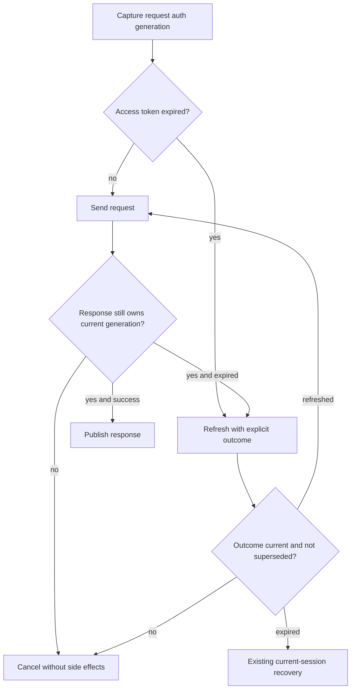

# Combined review repair: request authentication ownership

Status: IMPLEMENTED AND TESTED; independent final combined review pending. Final review 1 returned REVISE for F1 (P1, stale refresh clears a replacement login) and F2 (P2, undefined added theme tokens). Preserve that exact review, its admission, source snapshot and all earlier evidence. This addendum extends I3/I8/I9/I10; Astra owns repair and a new independent exact-source review.

F1 requirements: every protected API request and its response side effects belong to the authentication generation that admitted it. A superseded request must neither clear credentials, restore impersonation, navigate, open a paywall, reset auth counters, publish response data, nor retry under another identity. Logout and account replacement retire pending refresh owners and waiters. Legitimate same-generation refresh and current-generation failure recovery must continue to work.

Architecture: expose the token manager's existing authentication-material generation. Add a structured refresh outcome (refreshed/expired/superseded, token, generation) for the API interceptors while preserving the public string-or-null refresh method for existing callers. Successful internal refresh retains its generation; explicit authentication-material writes invalidate it. A current refresh failure clears expired auth and returns its resulting generation; this distinguishes legitimate expiry from replacement login. Requests store their admission before awaiting refresh; responses check admission before any success/error side effect and check a refresh outcome again after await. Superseded work rejects with Axios cancellation semantics. No new transport, store, dependency, endpoint, credential source or database schema.

User states on desktop/mobile: an old request quietly retires after sign-out/account change; the current account remains signed in. A current expired session follows the existing sign-in/impersonation recovery. A legitimate refresh retries the same request once. Existing loading/error/retry UI and drafts remain; no new UI controls or layout. Wireframes N/A for this service-only repair; the observed account-switch flow is the UI acceptance boundary.

Trust/sequence: authenticated storage -> token manager generation -> request admission -> transport -> guarded response. Roles/permissions remain server-authoritative and unchanged. ERD/migrations N/A. Privacy: synthetic A/B fixtures only; no production identities, endpoint calls or provider work.

Executable tests compose the actual Axios client, request/response interceptors and token manager with only transport deferred. Cover A->B and A->logout during reactive/proactive refresh, refresh waiters, late success/401/403/402, no replacement-identity retry, current successful refresh and current failed refresh. Observe intended RED before repair; then GREEN, existing manager/consumer tests, full frontend regression, typecheck/build. Backend source is unchanged by this repair; prior exact backend/DB evidence remains applicable.

F2: replace undefined toast/header references with registered semantic colors; derive deeper accents with color-mix instead of inventing token names. Do not modify guards or registries to waive findings. Existing inherited fallback drift is advisory. Full staged pre-commit gate, scoped component tests and visual check verify the repair.

Traceability: F1 -> actual-module auth tests -> token manager/API factory -> S14 -> raw RED/GREEN and final review. F2 -> full precommit registry failure -> toast/header styles -> S14 -> actual full precommit PASS. Operations: no schema/data migration, no extra requests, constant-time generation checks. Rollback the scoped source diff; no private state replay or database restore. Keep the failed review visible until both findings are adjudicated against actual evidence. Readiness requires a new reviewed digest; the previous test PASS never implies release approval.

## Mounted provider continuation (S15, implemented and tested)

The remaining production refresh caller is AuthContextProvider, mounted by App through AuthContext. Its boot age-refresh branch treats superseded null as logout, while successful refresh can redundantly store a token after the manager's ownership check. Extend F1 to that caller before final review. The provider uses the structured result internally, preserves its public boolean refresh interface, and checks the current generation after refresh and profile awaits before publishing user state, restoring impersonation, or logging out. Successful refresh storage remains the manager's responsibility. Late profile success or rejection must not publish A or clear B. Legitimate boot refresh, transient cached-session recovery and current-session expiry remain observable acceptance cases.

Tests: actual mounted provider plus actual token manager and deferred synthetic transport, covering retired age refresh, replacement at successful refresh continuation, late profile success/rejection, and valid current-session recovery. Existing AuthContext.refreshSession tests remain active with updated structured outcome fixtures. No UI layout, schema, role, API route or dependency changes. The same desktop/mobile sign-in and account-switch state flow applies; service-only wireframes remain N/A. Parent Astra repairs; Luna authors the bounded regression test. Raw RED/GREEN and combined source review close S15; rollback these provider/test changes with S14 if needed.

S15 actual results: six behavioral RED failures became GREEN. Provider ownership, existing refresh behavior, actual Axios admission and token-manager lifecycle pass together (28 tests). Token-manager observer re-entrancy is fenced before subsequent credential persistence; stale provider boot and public profile continuations do not publish prior-account data or clear a replacement login. The complete final suite includes these regressions.

## Repair verification

Review 2 preserved REVISE for F1-R1: failed-refresh cleanup could adopt a replacement login's generation during synchronous notification. F2 was independently closed. The final repair binds expiry to exactly one owned invalidation; additional generation changes cancel the old operation. API-side missing-refresh and auth-failure-threshold cleanup apply the same rule before redirect. Actual Axios proactive/reactive and mounted-provider regressions reproduced all six cleanup variants as RED, then the four-file auth set passed 34 tests. Both failed reviews remain preserved; a third exact-source review is required to close F1 and F1-R1.

Request admission now checks an existing generation before assigning one, including Axios retry config merging. A replacement login at asynchronous retry entry cancels before transport. Current proactive expiry retains AUTH_SESSION_EXPIRED instead of being mistaken for a replacement-account cancellation. Real Axios regression evidence: initial 1 PASS / 9 FAIL; added boundary cases 10 PASS / 3 FAIL; final 27 focused PASS. Independent actual-Axios transport probe: 8 PASS, zero network calls.

The complete frontend suite passed 8478 tests with four workers and unchanged timeouts/assertions. The preceding unconstrained run recorded two five-second-boundary failures; both passed unchanged in isolation, and that failed report is preserved. Type check, production frontend build, full pre-commit gate, and backend timezone-wiring contract all pass. Existing exact backend 9916 PASS / 6 skipped, native 179 PASS and isolated PostgreSQL 16 PASS remain applicable; backend source hashes did not change in S14. Mounted client overview, actual Socket.IO streak receipt and logout were rechecked against the current source.

Evidence index: .mega-blueprints/artifacts/1ea828daef2b3e6c/verified-v3/final-validation.json. F1/F2 remain pending final independent adjudication until the new source digest receives approval. No production claim.
