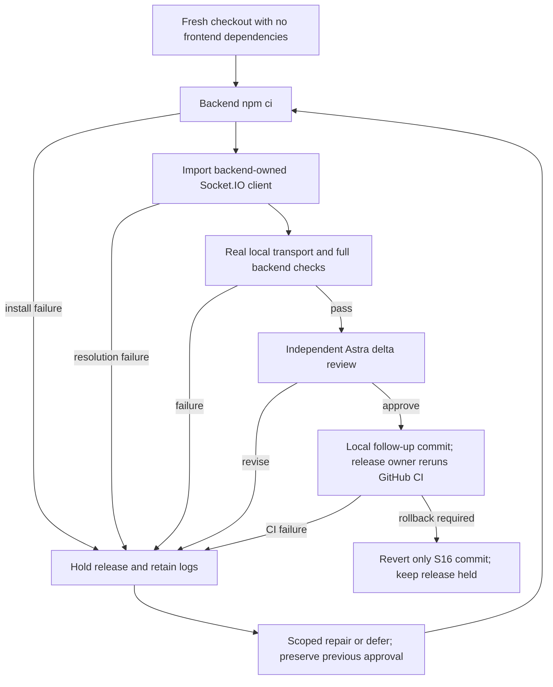

# S16: backend test dependency portability

Status: IMPLEMENTED AND TESTED; independent Astra delta review pending. Owner: Astra, within the existing client-fullsite-integration-20260913 task. This addendum extends the canonical INTEGRATION-2026-09-13.md packet after PR119 CI exposed a new environment boundary. The approved 950526583e9a commit, digest f31135afc0e8212f81179c11a68be7f3686be9eabcc7eec46f1244ec99b62f5f and all three review receipts remain historical authority for that exact source.

## Requirements and baseline

I12 / T12: a fresh backend-only dependency install must execute messagingSocketReceiptIntegration.test.mjs using the real local Socket.IO transport. Its current import reaches into frontend/node_modules, which the independent Ubuntu/Node22 CI backend job never installs. CI observed one load-failed suite, 9909 passing tests and 11 skips. This import failure is environment evidence, not an asserted behavioral RED test. A scan of backend tests found one cross-package node_modules import.

Acceptance: backend declares and locks its own development-only socket.io-client; the integration test imports the package's public entry point; a fresh checkout has no frontend/node_modules or root/node_modules; backend npm ci and both real socket cases pass; full backend Vitest and native node:test gates run without weakening assertions, exclusions, retry policy or CI. Inspect lock changes for unrelated drift. I13: preserve all prior source/review provenance and cumulative accounting; independently review the exact release delta and bind the unchanged approved scope. No production code, schema, API, UI or CI behavior changes are authorized by S16.

## Blueprint, contracts and applicability

Dependency ownership belongs to backend/package.json and its lockfile. Use exact socket.io-client 4.8.1, the existing frontend-locked version compatible with the backend Socket.IO server. Replace the physical frontend distribution-path import with the documented public package entry. npm resolves the backend's own package tree. Test state, real HTTP server, websocket transport, synthetic JWT authentication, message persistence/echo/ack and notification-failure assertions remain intact.

Wireframes, responsive/accessibility, UI state diagrams, ERD, permissions matrix, schema migrations and product performance changes: N/A because this changes only test dependency resolution. Production clients, server dependencies, role authorization and data models retain their prior approved contracts. Trust boundary: synthetic local clients communicate with an ephemeral loopback server and stubbed persistence; no production credentials, databases or model providers. Sequence: clean checkout -> backend npm ci -> public client import -> real socket connect/auth -> send/persist/echo/ack -> disconnect/cleanup. Existing runtime coverage is retained, not replaced by a source-string assertion.

Mermaid source is supplied; local rendered preview is unavailable. Install-lock compatibility is checked by npm ci. A backend-only clean environment is the acceptance test; no additional implementation-mirroring test is introduced.

Actual verification: fresh isolated Ubuntu checkout, Node22.23.2, backend npm ci PASS with both frontend/node_modules and root/node_modules absent. Public import resolved backend socket.io-client4.8.1; both unchanged real Socket.IO cases passed. With CI=true, complete Linux Vitest passed 9911 tests with the same 11 CI skips, and native node:test passed179 with zero skips/failures. No environment variables selected real customer resources; the test setup remains synthetic. Real ffmpeg/ffprobe came from the existing locked backend packages for this local Linux run; GitHub installs system ffmpeg. Lock inspection found seven added dev-only package entries and zero changes to existing dependency entries or production resolutions. npm's unrelated linked-schema metadata refresh was removed before the successful clean install. Evidence is under .mega-blueprints/artifacts/1ea828daef2b3e6c/ci-portability-20260913. The previous CI import failure remains a portability/setup FAIL, not behavioral RED proof.

## Test plan, traceability and operations

I12 -> T12a clean backend-only npm ci and package resolution -> three dependency/import files -> isolated checkout and command logs. T12b -> unchanged real Socket.IO integration cases -> targeted Vitest output. T12c -> full backend Vitest and native tests -> complete JSON/TAP results and disclosed existing skips. Linux/Node22 is the authoritative CI target; record the actual local runtime and disclose any mismatch. I13 -> predecessor state/source hash readback, same-task migrate, new final snapshot, exact independent Astra review -> S16 evidence and readiness receipt.

Astra repairs this CI finding. Before mutation preserve the approved state, source hashes and failing CI log. The COMPLETE controller requires supported migration; preserve the same task ID, all original owned scope, three used integration admissions, original two historical admissions, unchanged ten-call integration cap and all review events. This is a new CI defect after completion, not a retry intended to evade a review limit. Reuse verified unchanged frontend/browser/DB evidence only after hash comparison; rerun full backend and native checks because their dependency environment changes. No application/frontend edits, new paid provider calls, production writes, or pushes by this task. Release owner controls PR119 and deployment.

Hostile questions: can local frontend packages conceal the defect, does npm ci resolve a different client, does the lock change production resolutions, and is the transport test still real? Resolve each with isolated install, package/lock inspection, unchanged source assertions and actual transport execution. Plan readiness: exact defect and acceptance are known, user authorized repair, no product decisions remain. Implementation readiness requires actual test evidence and independent approval; prior approval alone does not cover S16. Rollback: revert the scoped follow-up commit and hold release; no data restore or migration required. Operational owner remains the existing release task; keep the test job fail-closed.
