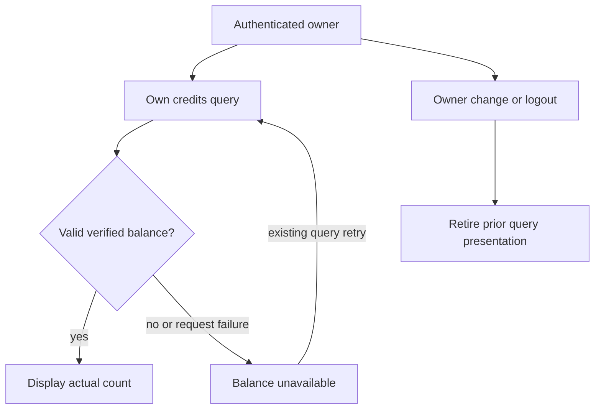

# Session-credit truth integration repair

Status: PLAN READY. Extends I8-I10; Astra adjudication and repair. Browser fixture returned an unconfigured payload and the real home showed zero sessions. Tracing confirms useSessionCredits converts absent/malformed balances into zero and uses an account-independent query key. The existing unit test incorrectly describes zero fabrication as fail closed; preserve its original bytes in git and explicitly change the expected contract.

C1: only finite safe nonnegative integer balances (number or digits string) become numeric session counts. Unknown/malformed/negative/fractional values reject, reaching the existing unavailable banner. C2: query results are keyed by authenticated owner, disabled without identity, and late owner A results never appear for B/logout. C3: real zero, valid metadata and prefix-based billing invalidation remain compatible.

Architecture: retain GET /api/user/credits and React Query; add current AuthContext identity to query key and query enablement, use request cancellation signal. Validate public balance and optional metadata before returning. No new API, storage, schema, dependency, billing mutation or authorization. Exact source scope is useSessionCredits.ts and its existing/new tests. Existing banner error/loading UI remains unchanged.

Desktop/mobile wireframe: [Sessions Remaining / skeleton] -> [verified count / existing Book action] or [Unable to load your session balance right now / existing Book action]. Unknown never becomes a zero-credit warning. Logout/account switch retires the previous count. Accessibility/44px/responsiveness unchanged, covered by existing banner and local browser checks. No new control.

State/sequence/trust flow is above: current user -> own query -> same endpoint -> validated result. Permission matrix unchanged: authenticated self only. ERD/migration N/A: no schema. Privacy: synthetic IDs and balances only. No production/provider calls.

Tests: T-C1 malformed values reject rather than fabricate zero (intended RED); T-C2 deferred A -> B/logout hook queries and disabled identity; T-C3 valid zero/digits/metadata and existing banner regressions. Map Cn -> T-Cn -> hook and tests -> S5. Unit/component fixtures use no real billing data; backend production proof remains separate. Rollback reverts owned files, no data migration. Same request count, bounded per-owner query cache using existing React Query defaults; existing invalidation prefix remains valid. Hostile challenge: stale success during refetch, malformed metadata and unknown identity. Readiness requires actual green tests plus final combined review and browser truth checks. Plan alone is not readiness.
