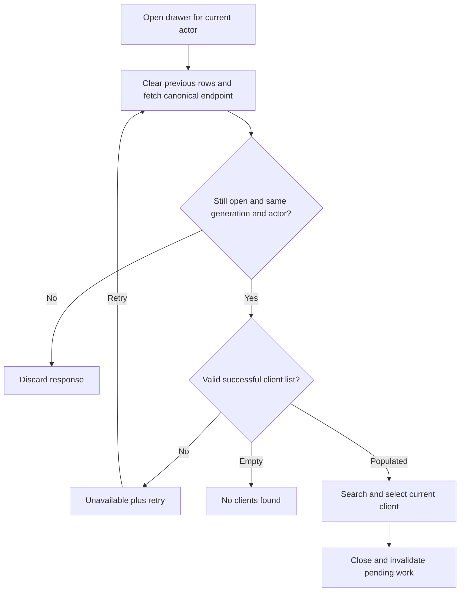

# Supplemental FULLSITE drawer repair

Status: PLAN READY for the bounded contribution below; implementation, combined controller admission and final review pending. Owner: Astra review task 01a0989f-aa93-7df1-b676-6181bc1ad33c. Canonical integration owner: task 01a098a1-d09d-7142-a1cb-55458eb9c4ee. This supplements INTEGRATION-2026-09-13.md and its existing requirements, authority, operations and review limits; it does not replace that packet or reset its review history.

## Baseline and scope

Pinned main c0cbe538d8ed2ca519bb494cdf3282bf43b76699 in the isolated client-fullsite-integration-20260913 worktree. The shared WIP checkout and original full-site repair candidate remain preserved. No application changes to this drawer exist at baseline. Git HEAD preserves its original bytes.

Review follow-up corrects the original report: WorkoutClientDrawer first calls /api/admin/users, then falls back to removed /api/users on any failure. A complete frontend/src reference search finds no current production importer. WorkoutsWorkspace explicitly removed its client drawer dependency. This is dormant source maintenance, not a repaired mounted production route; do not remount it or invent an API to support it.

Authorized contribution: only frontend/src/components/DashBoard/workspaces/WorkoutClientDrawer.tsx, its new WorkoutClientDrawer.truth.test.tsx, this addendum and uniquely named evidence under .mega-blueprints/artifacts/fullsite-review-supplement-20260913. No route, permission, schema, dependency, billing or auth-provider changes. Luna builds/tests; Astra reviews/repairs; final integration owner incorporates these exact paths into the existing controller and final combined review.

## Requirements, contract and traceability

| Requirement | Acceptance / implementation | Executable evidence |
|---|---|---|
| D1 | Failed /api/admin/users lookup never requests /api/users and never claims there are no clients; show a readable unavailable state and explicit retry against the same canonical endpoint | T-D1 rendered rejected-request test, call count and URL assertions |
| D2 | Valid successful empty response remains a distinct empty state; malformed/non-array response is unavailable, not empty | T-D2 successful empty, supported response envelopes and malformed payload tests |
| D3 | Close/unmount/account change invalidates in-flight results and clears selection candidates; older responses cannot replace a newer open/retry result | T-D3 deferred promises for close/reopen and account switch, current result selectable only |
| D4 | Retry succeeds without losing drawer controls; loading never exposes old selectable rows; focus timer is cleaned up | T-D4 retry success/selection and loading state assertions |

Existing response compatibility: users array, data array or direct array, selected in that order when the property is present. Required row fields id/firstName/lastName must be valid before use; accept the application's positive numeric IDs, names as strings, and optional email as string. Reject a malformed envelope or row as unavailable instead of silently claiming a complete empty result. Preserve valid optional display fields; no fabricated credits. Do not log raw Axios errors or response bodies. Owner identity comes from existing useAuth user.id; no permission widening or substitute role-based endpoint. Backend still owns authorization.

State ownership remains local to the drawer. Use a request generation/cancellation fence plus owner-bound displayed results, invalidated on close, owner change and unmount. A retry is a fresh request; only the current generation may publish success/error/loading. Same-account token changes may refetch through the existing authAxios identity without exposing stale results. No database mutation or persistent client cache.

## Wireframes, accessibility and flow

```text
Desktop side drawer / mobile bottom sheet (existing responsive geometry):
[Select Client                         Close]
[Search clients                            ]
Loading: [Loading clients…] (no old rows)
Failure: [Client list unavailable. Try again.]
         [Retry — existing style, >=44px]
Empty:   [No clients found]
Success: [verified client rows / select]
```

Use role=status for loading, role=alert for unavailable, named retry button and visible keyboard focus. Existing search, Escape, close and mobile behavior remain. No new modal system or visual redesign. Production browser applicability is N/A because no mounted caller exists; rendered DOM behavior tests are required, with existing geometry and touch sizes preserved.



Mermaid source is supplied; no rendered preview is claimed. Sequence and privacy boundary: current actor -> canonical authorized read -> validated response -> actor-owned UI; changing actor invalidates previous work. Permissions matrix is unchanged and backend-enforced. ERD/migration N/A (no persistence changes). Rollback restores these two source/test paths from the pinned baseline only, preserving all unrelated integration work. No production access, messages, provider calls or deployment.

## Test and readiness plan

Run the new behavioral tests before implementation and preserve intended assertion failures separately from setup errors. Run the same tests after repair plus utils/imageUrl.siblingSweep.test.ts. Use existing Vitest/config/installed lockfile dependencies and synthetic HTTP/auth fixtures only. Final integration type-check/full tests/review remain the canonical integration owner's gate; this slice cannot claim those results in advance. Include source SHA-256, commands, results and any limitations in the contribution receipt. Tests and code changes remain pending here until actual evidence exists.

Hostile planning decisions: do not build a replacement users endpoint, revive the dormant drawer, label a permission/network error as empty, retain prior-owner rows, or claim this source maintenance fixes a live client workflow. The main review's F1-F6 and five upgrade recommendations remain under integration I1-I10; this contribution closes only the separately identified fallback source debt.
