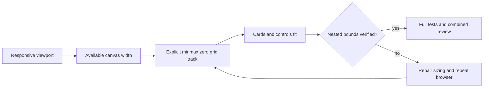

# Final integration test and mobile grid repairs

Status: PLAN READY; extends I2/I5/I9 and final combined review. S11 preserves three failed full-suite assertions as evidence and repairs stale call shapes and an overbroad status selector; no product behavior change. Auth uses shared API with AbortSignal; credits reject unknown counts; malformed quick-post XP must not produce an XP receipt, while a separate truthful billing status may exist. Three named source-policy/profile-metrics tests plus full frontend suite verify compatibility. Headless wireframes/ERD/permissions/migrations N/A for S11.

S12: a settled 390px browser has a 330.857px PrimaryStack with a 484.375px implicit grid column. Ancestor overflow hides clipped controls; document width alone is insufficient. Own priorityStyles.ts/layoutStyles.ts only. Explicit minmax(0,1fr) tracks must constrain rendered children to the canvas without clipping masks or removing content. Preserve mobile program-first order and desktop hero-first order. Desktop wireframe: [hero / stats][recovery] -> [actions] -> [compass] -> [plan]. Mobile: [plan] -> [hero] -> [actions] -> [compass], each within viewport with readable controls. Loading/empty/error content shares identical track constraints. Keyboard and touch targets remain operable. No API/data changes; state/sequence/ERD/privacy migration N/A because CSS sizing only.

Tests: S11 three suite regressions then all frontend. S12 existing home behavior tests, unchanged frontend guard, nested rendered bounds and screenshots at 320/390/768/1440/2560, no hidden clipping. Static CSS is not runtime proof. Performance: no additional JS/network. Rollback: revert two owned CSS files; no database restore. Owner: Luna bounded repair, Astra browser verification/adjudication. Readiness requires actual evidence and independent final approval.
