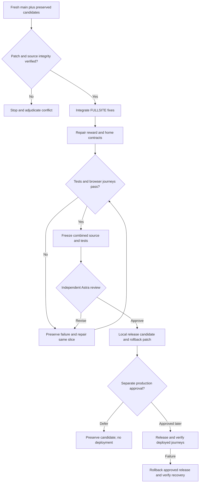

# FULLSITE and client dashboard integration

Owner: Astra. Version 1.1. Status: implementation verification passed; exact combined Astra approval pending. This is the integration addendum to the preserved FULLSITE packet, not a replacement for its requirements. The original README and original candidates remain unchanged. This addendum governs the combined candidate only.

## Outcome, scope and current reality

Sean requests continuing the verified dashboard/FULLSITE work, closing missing gaps and making a consolidated candidate ready to release. The application must preserve workout-first guidance, truthful balances/rewards, current main's permission protections and functional accessible controls. Deployment requires separate production authority and evidence. No local test can certify bug-free software or stand in for deployed verification.

- Caller: documentation mount `C:/Users/BigotSmasher/Desktop/quick-pt/SS-PT`.
- Canonical shared checkout: `C:/Users/BigotSmasher/Desktop/@Everything/quick-pt/SS-PT`, dirty WIP branch, original dashboard commit `f8815a0b1d` (20 files, +604/-57). Its changed paths matched that commit during verification; 29 focused tests passed. Preserve it.
- Preserved FULLSITE candidate: `tmp/worktrees/full-site-repair-20260912`, base `53120649f356c3efccee32872b530096d386642f`; 147 reviewed hashes matched, independent final Astra APPROVE, two consumed review calls. Its local patch and previous controller are preserved with matching hashes under integration evidence. Approval remains historical for those exact bytes.
- Integration worktree: `tmp/worktrees/client-fullsite-integration-20260913`, branch `codex/client-fullsite-integration-20260913`, fresh `origin/main` `c0cbe538d8ed2ca519bb494cdf3282bf43b76699`. PR #118 permission, session-owner, voice-generation and schema-runtime repairs must survive.
- The original dashboard branch is heavily divergent. Port its useful behavior against current main; do not cherry-pick its old surrounding implementation or mount a second reward subscriber.
- Existing canonical home path: UniversalDashboardLayout client overview -> ClientHomeTab -> ClientDashboardHomeTab -> ClientDashboardHome. Main already owns plan shelf, first-session orientation, meaningful insight metrics, safe action routes and Swan geometry/focus styles.
- No graphify graph exists. Trace actual imports/routes and executable callers. Fresh lockfile-based frontend/backend installs completed without lifecycle scripts; no production env copied. Current-main baseline and all subsequent commands/results are recorded in evidence.

## Authority and preserved review history

Continue the FULLSITE assignment already explicitly selected by Sean: Luna xhigh builds/tests bounded slices; Astra owns architecture, adjudication, review repairs and combined final review. The original task's user selection was “Luna builds; Astra reviews combined fixes.” This integration is a new candidate in a different worktree, so its controller is distinct; the completed predecessor controller is copied unchanged as provenance, with its two calls and approval retained. It is not restarted or marked unreviewed. The integration uses at most ten additional admissions, keeping the combined parent history within twelve. No paid API, GLM fallback or usage-reset credits. One final review in flight; default three rounds and 600s per review remain. Any unreported native model/token metadata is null.

Native enrollment will be attempted with actual receipts. Installation/enrollment is not proof hooks executed. Use explicit snapshots and source hash checks regardless. This packet authorizes local implementation and tests, a portable patch and release handoff; no main push, deployment, provider message, purchase, production row read/write or migration is authorized.

## Requirements and acceptance / traceability

| ID | Measurable acceptance | Component and slice | Test/evidence |
|---|---|---|---|
| I1 | All 117 FULLSITE application/test patch paths integrated onto current main without removing PR #118 protections; no unresolved conflict or duplicate bridge | Preserved patch, S1 | T1 patch/source inventory; existing permission/session/voice and FULLSITE regressions |
| I2 | A committed ledger award carries an immutable transaction identity; two different awards within 30s both deliver; duplicate/rollback/spend results never announce earned XP | GamificationRealtimeEvents, points service and award producers, S2 | T2 real emitter/ledger contract tests and committed-vs-rollback fixtures |
| I3 | Each identified reward displays XP once across alias events/reconnect; distinct rewards are not suppressed; old account/socket data never surfaces after identity/token change | useGamificationRealtime, S2 | T3 actual hook lifecycle and event-order tests |
| I4 | Real achievement names and real streak-day values produce their celebration; missing values use truthful generic feedback; no fabricated XP/level/streak or recovery-day milestone claim | Emitter, hook, CelebrationContext, S2 | T4 producer-consumer fixtures, mounted celebration tests, reduced-motion checks |
| I5 | One canonical next-action card is reachable near the training workflow; preserve its existing rest/pain/assignment logic and avoid duplicate subscriptions/cards or forced workout urgency | ClientDashboardHome/rail, S3 | T5 mounted home card count, safe action and order assertions |
| I6 | Settled new-member history reaches teaching copy and a working workout action; loading/error are distinct from new-member state; hide empty unlock/rank lists without suppressing populated lists | Home adapter/feed/rail/viewmodel, S3 | T6 empty/loading/error/populated rendered tests |
| I7 | Standalone Sign Out invokes AuthContext logout; community enters canonical community; existing support remains functional; no dead Billing control; embedded home does not duplicate shell navigation | Home sections/types/adapter, S3 | T7 mounted navigation and logout assertions |
| I8 | Unknown client details never fabricate zero credits; permission failure and stale identity fail closed while retaining drafts; save receipt leads with confirmed workout success and no invented XP | Current main + preserved FULLSITE logger/receipt | T8 real mounted logger failure/recovery and permission regression |
| I9 | Combined candidate passes frontend/backend suites, type-check, build, real isolated DB transaction cases, and representative desktop/mobile authenticated synthetic journeys | All slices / final | T9 actual full logs, local server/DB and browser receipts |
| I10 | Independent final Astra review binds the final combined source; all findings adjudicated; preserved source, portable patch, rollback/release checklist and actual limits are delivered | Final gate | T10 hash manifest, review/controller/readiness and patch application evidence |

All original FULLSITE R requirements remain part of I1/I9/I10 through the preserved original packet. Changes in current main that already solve a report finding are retained and marked already satisfied, not recreated. No external review or prior green suite certifies new combined bytes.

## Boundaries and implementation contract

S1 imports the reviewed code-only patch (117 declared paths) with a dry applicability check before application. Current main changes are non-overlapping unless the check proves otherwise; stop on conflicts for Astra adjudication. Do not overwrite branch instructions, env secrets or existing history. Dependency declarations from current main survive; FULLSITE's documented type-check heap correction is retained. Run relevant preserved tests plus PR #118 regressions, then record tested status.

S2 extends only the existing gamification producer -> socket -> authenticated hook -> CelebrationProvider path. Ledger `pointTransaction.id` is the authoritative stable award identity. Add it as an additive event field; never derive an ID from wall-clock time. Catalog achievement name/ID and known milestone days may be transported via explicitly allowlisted metadata fields; never spread private metadata wholesale. The points service currently drops metadata in `eventEntry`, which must be reconciled when needed. Do not change balances, points formulas, ledger idempotency, API authorization or database schema.

Ledger-origin workout events must not use the legacy per-user 30s throttle, which drops distinct committed awards; committed ledger uniqueness already distinguishes them. Legacy convenience emitters remain compatible. Prefer a stable event/transaction ID; source/sourceId or timestamp is only a bounded compatibility fallback. XP replay identity is shared across points/workout aliases; semantic achievement/streak feedback must not fabricate extra XP. Keep replay history bounded to 256 identified entries and owner-scoped, reset on account change, retain across same-owner token refresh, reject stale socket callbacks. There is no new durable exactly-once guarantee across browser restarts.

An achievement award with catalog name displays that name using React text rendering. A streak event displays a positive safe-integer day count only when supplied by an authoritative producer. A recovery-day `streak_bonus` without a milestone count is reward feedback, not evidence of a streak milestone. Unknown details use an honest generic toast; do not guess from sourceId or parse human descriptions. Celebration callbacks may animate/sound but may not award points or invent point amounts. Reduced motion and muted sound still leave readable feedback. Level-up focus/defer lifecycle from FULLSITE remains intact.

S3 ports the design intent against main. Move the existing Coach compass/NextBestActionCard near the primary training workflow instead of adding HomeTabNextBestAction beside another compass. Preserve NextBestActionCard's source-owned CTA/rest/pain/plan rules. Keep program shelf, orientation and current history-derived metrics. Do not revive old wearable tombstones or label consumed calories as burned calories. Weekly teaching is keyed by successfully settled zero history, not `insights.length`, because current buildInsights always returns real metric rows. Loading and failure must retain distinct text and recovery rather than masquerading as zero history. Hide empty recent-unlocks/community-rank lists; keep main's real-tags-only behavior. Standalone navigation gets logout and canonical community targets; preserve registered support. Remove an unsupported dead Billing action rather than inventing a billing destination. Preserve 20px/12px geometry, visible focus, reduced-motion styles and 44px controls.

## Desktop and mobile wireframes

```text
Desktop (1440+):                 Mobile (390/414):
[existing shell navigation]      [existing mobile shell]
[profile / true progress]        [profile]
[Coach compass: real next step]  [Coach compass / 44px CTA]
[quick actions]                  [wrapping quick actions]
[current plan shelf]             [plan shelf]
[orientation if new]             [orientation if new]
[recap/progress]  [recovery]      [recap / progress]
[training/session] [challenge]   [training / session]
[weekly teaching OR metrics]     [weekly teaching OR metrics]
[community] [real unlock/rank]   [community / populated rail]
```

Use the existing styled-components and responsive grid. No new layout system. Compass stays single at all sizes. New-member teaching offers a working log action; empty secondary lists disappear. Loading uses existing skeleton/status; missing/error has readable unavailable/retry; partial state renders only verified fields. Success announces confirmed workout/reward; denied saves preserve draft and describe unavailable access; retry cannot replay another account's draft. Keyboard order follows visual order. Level-up restores focus to the prior control and defers while a save dialog owns focus; no-motion mode preserves the same text. Check 390, 414, 768, 1440, 2560 and 3840 widths for overflow and action reachability.

## Flow and sequence



```mermaid
sequenceDiagram
  participant DB as Ledger transaction
  participant E as Realtime emitter
  participant S as User socket room
  participant H as Authenticated hook
  participant U as Celebration UI
  DB->>DB: Persist authoritative award and identity
  alt Rollback or duplicate award
    DB-->>E: No new earned event
  else Committed award
    DB->>E: Award result and allowlisted semantic metadata
    E->>S: Identified event, exact XP, optional real name/days
    S->>H: Event (may replay or arrive late)
    alt Old owner/socket or identified replay
      H->>H: Ignore stale/repeated presentation
    else Current distinct award
      H->>U: Exact XP and truthful accessible feedback
    end
  end
  Note over H,U: Logout clears owner presentation; missing detail stays generic
```

Render Mermaid when tooling permits; retain source and disclose renderer limits rather than claiming a preview. State lifecycle: disconnected -> connecting -> authenticated -> event accepted/replayed/rejected -> disconnected; owner change invalidates callbacks and replay state. Authenticated identity is the trust boundary; payload numbers/text are validated and cannot grant authority. Permissions matrix: current client may see own rewards/workouts; trainer/admin scope remains assignment/admin rules; signed-out user has no reward connection. ERD/migration: N/A for new delta because no tables/columns change; the original ledger and user relationship stays authoritative. ML/provider design: N/A, deterministic existing product logic only. External paid services: N/A for this local implementation.

## Test and operations plan

T1-T8 use existing Vitest/node:test runners with synthetic fixtures, including exact producer payloads, duplicate aliases/order, same-owner reconnect, A-B-A changes, malformed booleans/empty/noninteger values, missing metadata, new-member/loading/error and populated panels. New behavior regressions must fail for the intended observable reason before repair; setup/import errors never count as RED. Do not weaken existing guard assertions or tests simply to get green. Main tests already restored are retained, not replaced by stale router mocks.

T9 runs full frontend/backend suites after all code changes, canonical type-check/build, existing isolated PostgreSQL grant/marketplace tests and compiled/local browser journeys. Use no production env/config. Local authenticated synthetic client/trainer/admin fixtures validate route/permission behavior; distinguish their proof from real deployed accounts/providers. Real browser socket proof uses a local Socket.IO test server exercising the actual event/hook path. Workout save remains asynchronous relative to XP; do not change save timing solely to mount a dormant redundant overlay. Existing confirmed SaveSuccessPanel plus later identified rewards forms the actual success flow.

T10 requires final inventory, all no-conflict/secret/diff checks, independent review of the complete combined diff including prior fixes, preservation/restore checks, and a code-only patch applicable to pinned main. Operations owner Sean. No new migration or infrastructure. Existing logs remain minimal; no client data in evidence. Performance budgets: no extra global reward socket, no idle particle animation loop, max 256 replay identities and existing bounded particles; no significant new dependency or full-page blocking fetch.

Rollback: retain original WIP commit, original FULLSITE worktree and verified patch/state. The new worktree is isolated; revert only owned changes or apply the generated reverse patch to the same verified candidate. Do not reset or clean the shared checkout. Release requires current-main reconciliation plus full candidate review; publication remains a separate action. Missing external production evidence is a named release verification step, not a fabricated local pass.

## Planning hostile review decisions

- Reject blind old-branch rebase/cherry-pick: thousands of commits of divergence and newer current-main behavior require selective porting.
- Reject timestamp-only global suppression: it loses distinct rewards and is not an event identity.
- Reject forcing a workout to rescue a computed streak: the existing compass owns rest/pain/plan decisions.
- Reject generic proof percentages: inspect the original 147 hashes and bind the new combined source to new tests/review.
- Preserve successful fresh-main protections, meaningful current metrics, existing support and staged historical evidence.
- Exact implementation file scopes are in the controller init/append inputs. Any architecture expansion returns to Astra before code.

## Preserved delivery documentation

S13 binds the unchanged predecessor plan and audit documents to this candidate's final review and release manifest. They are historical evidence: their old statuses, paths, counters and receipts remain unchanged and do not approve this candidate. The integration addendum and final review receipt govern current readiness. No application code is added by this documentation slice. Verification is exact hash equality to the preserved predecessor documents and a final scoped delivery manifest; rollback removes only these added documentation files. UI/API/state/ERD diagrams are N/A for document preservation. The predecessor readiness.json is historical, and the new implementation receipt is under the integration artifact directory.


## Current implementation verification (2026-09-13)

All thirteen integration slices are implemented. This section supersedes the planning status of the integration addenda; predecessor documents remain historical. Final combined review is pending and must bind the final snapshot, not the old FULLSITE approval.

| Requirement | Actual evidence | Status |
|---|---|---|
| I1 | 117-path import, fresh-main baseline55, full suites;147 predecessor hashes unchanged | PASS |
| I2 | 24 producer/emitter tests; real Socket.IO delivery for distinct committed awards | PASS |
| I3/I4 | 12 original bridge/lifecycle tests;17 final reward tests;2 independent owner replay cases; real browser semantic/replay/focus/logout checks | PASS |
| I5/I6/I7 | 19 home tests;105 supplemental tests; canonical single compass, error/retry/rest navigation;7 responsive widths and explicit mobile control bounds | PASS |
| I8 | FULLSITE logger/draft/receipt regression;13 credit tests;17 recovery lifecycle tests; no fabricated balance or XP | PASS |
| I9 | Frontend8459/0, backend9916/0 (6skip), native179/0, isolated PostgreSQL16/0; typecheck and frontend build exit0; hard frontend guard and diff clean | PASS |
| I10 | Exact source manifest, prior preservation, portable patch check and independent final review | REVIEW PENDING |

Canonical raw verification index: ../../../../.mega-blueprints/artifacts/1ea828daef2b3e6c/final-validation.json. Final controller and implementation-readiness.json are beside it. The first frontend run's3 stale test assertions and backend run's1 stale call-shape assertion remain preserved; repaired final suites pass. The first S10 probe was an import setup failure, then S10-red-2 proved2 intended text-leak failures before the repair. S4/S5 RED and peer independent baseline replays remain preserved. S12 corrected an actual484px implicit track inside331px mobile canvas; seven final widths fit. No duplicate old celebration bridge was mounted.

Browser evidence uses actual application components with local synthetic HTTP/auth/socket fixtures, no production data/provider. Trainer/admin route rendering is smoke proof; real permission enforcement is covered by backend tests. PostgreSQL tests use a dedicated disposable local cluster, not the user's database. Six existing backend skips, advisory file-length warnings and unobserved native hook execution are explicit limitations, not passing claims. Mermaid source remains available; no local renderer is installed.

Release coordination: the existing Review full-site hostile audit task owns Sean's separately authorized push/deployment. This task supplies the exact reviewed candidate, source/patch hashes and rollback packet; it does not independently push main. Verify production health and relevant public/private behavior under that owner's release process before claiming DEPLOYED.


Staged-delivery refinement: the final cached diff check additionally covers new files. It found two extra EOF blank lines in one imported backend test and one historical S7 document copy. Only trailing whitespace was removed; exact originals are preserved in staged-whitespace-repair.json references. The predecessor worktree remains byte-identical. The delivered S7 copy is text-identical after trimming trailing whitespace, not byte-identical. Backend focused regression and staged guard/check are rerun. A supported controller migration preserves all thirteen slices, scope, evidence and zero prior integration admissions before re-freezing this corrected candidate; no review was in flight or discarded.
