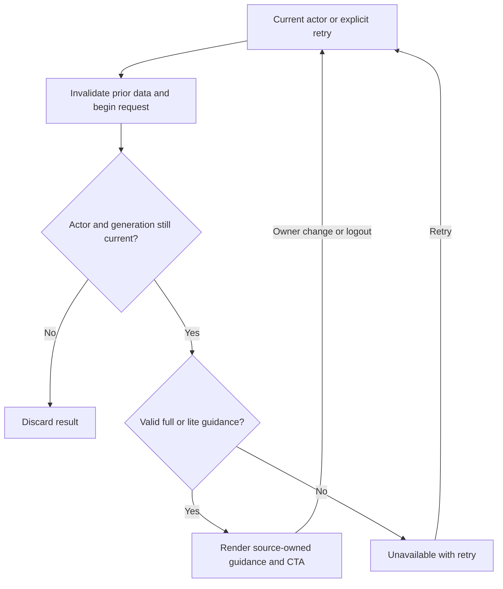

# Supplemental next-action isolation and recovery repair

Status: PLAN READY; three behavioral RED probes reproduced on the current integration candidate; implementation and final combined review pending. Owner: Astra FULLSITE review task 01a0989f-aa93-7df1-b676-6181bc1ad33c. This addendum extends integration I5/I9/I10 under the same canonical packet, reviewer authority and review counters. The integration controller remains owned by task 01a098a1-d09d-7142-a1cb-55458eb9c4ee.

## Baseline, scope and preserved proof

Base c0cbe538d8ed2ca519bb494cdf3282bf43b76699; isolated integration worktree. Current shared NextBestActionCard is mounted in ClientRightRail and is to be promoted by S3. The older urgent HomeTabNextBestAction is not being introduced on the canonical home. Actual useProgressPulse leaves liteNba after owner change/logout; error rendering hides the old title but handleCta still reads that stale primary. Synthetic owner A lite guidance -> owner B failed full payload caused the error action to navigate to owner A's CTA. The failure UI also has no retry and presents first-workout teaching despite unknown history.

Evidence: frontend/tmp/fullsite-review/nextAction.audit.test.tsx and its isolated config; .mega-blueprints/artifacts/fullsite-review-supplement-20260913/next-action-red.json reports three tests, all intended assertion failures. Initial output-directory setup attempt ran no tests and is not RED evidence. Git preserves original source bytes; retain the original audit probe unchanged as historical evidence. Add production regression tests with final product expectations rather than rewriting the historical failure.

Exclusive implementation scope: frontend/src/hooks/analytics/useProgressPulse.ts, new useProgressPulse.lifecycle.test.tsx beside it, frontend/src/components/NextBestAction/NextBestActionCard.tsx and NextBestActionCard.test.tsx. No other source paths without Astra adjudication. The integration S3 owner may move the card and provide its new mount path; update the corresponding source-only mount assertion to that real composition, without weakening behavioral assertions. Do not modify backend points, plan rules, pain/recovery guidance or routes.

## Requirements and contracts

| Requirement | Acceptance / implementation | Test |
|---|---|---|
| N1 | Paid and lite guidance/results are owned by the current auth user and request generation; close/unmount/logout/owner change and refetch invalidate stale publications. No previous-owner payload appears in the returned hook result or executes through a CTA | T-N1 A-lite -> logout and A -> B transitions, late paid/lite completions, same-owner retry |
| N2 | Loading clears previous actionable guidance; missing identity and malformed success result return error with no paid/lite data | T-N2 loading/payload failure, late earlier retry response ignored |
| N3 | Outage renders readable unavailable copy and a working Retry button, without claiming no workouts or requiring training; retry calls refetch, not a prior primary CTA. If a neutral workouts-navigation action is retained, it must use an explicit canonical destination independent of stale data | T-N3 mounted real hook/card outage -> retry -> ready; previous-owner href never executed |
| N4 | Ready/lite valid primary, secondary, constraints, disclosure and source-owned rest/plan/pain CTA behavior survive. Malformed next-action structure cannot crash JSX or provide unsafe navigation | T-N4 valid paid/lite/rest fixtures, malformed primary/secondary/CTA fields, existing onLogWorkout override tests |

Keep the public hook API status/pulse/liteNba/refetch and current canonical endpoint paths unchanged. Preserve the existing free-tier fallback on failed full requests; it must remain owned by the same current request and actor. Do not infer tier, permissions or history from failed HTTP. Validate guidance consumed by JSX: object primary with expected string fields, finite numeric priority when required by the existing API, secondary as valid action array, CTA null or a named internal relative route beginning with a single slash. Reject malformed fields (including arrays/objects where text is expected), scheme/protocol-relative/backslash/control-character routes. Do not serialize or log private response data. No changes to server-generated exercise recommendations.

Use a stable actor identity in result ownership and a request generation/alive fence for asynchronous work. Derive displayed guidance only for ready/lite current data; error and loading paths must not read a leftover primary. Explicit refetch starts a fresh generation, clears actionable prior values and can recover. Same-user authAxios changes also invalidate earlier completions. No persistent cache, schema or auth-provider changes.

## Wireframes, states and trust boundary

```text
Desktop/mobile (existing single Coach compass card):
Loading: [Next Best Action] [Loading guidance…]
Error:   [Guidance unavailable]
         [We could not load your next step. Try again.]
         [Retry — >=44px, named, keyboard focus]
Ready:   [server title / message / caution]
         [server-owned valid action] [secondary guidance]
All states retain existing rule-based disclosure.
```



Mermaid source is provided; no rendered preview is claimed. Sequence is actor -> full endpoint -> optional existing lite endpoint -> validated actor-owned UI. This identity boundary is required even when the authAxios instance is stable. Existing backend authorization is unchanged: no cross-account request parameters, no bypass of premium gating. ERD/migrations N/A; no persistence. State diagram is expressed by the flow above and hook status union. No new providers/ML, dependencies, payments or production operations.

## Execution, traceability and readiness

N1-N4 map directly to the four scoped files and T-N1-T-N4. Luna writes additional meaningful regression tests first and records intended RED, then implements and runs the affected suites. Astra verifies real hook/card composition using synthetic auth/HTTP plus hostile malformed and out-of-order cases. Test snapshots/logs/hashes live under .mega-blueprints/artifacts/fullsite-review-supplement-20260913 with unique names. Integration owner incorporates this scope and evidence into existing controller, full suites/type-check/build and final independent Astra review. No local contribution is a deployed-health claim.

Performance: retain one current guidance request chain, no timer/poll or new cache. UI budgets preserve 44px controls and responsive existing card layout; no fixed widths. Rollback restores only owned delta paths from the pinned base or scoped reverse patch. Do not touch shared WIP or another builder's files. Missing production account/provider proof remains explicitly unverified. Final review cannot pass while ownership/outage regressions remain unresolved.

Planning hostile review: merely clearing pulse is insufficient because liteNba survives; merely hiding stale titles is insufficient because handleCta reads stale values; relying only on effect cleanup allows stale render data unless results are actor-bound; retrying must not execute historical guidance. Preserve original paid/rest/pain behavior rather than making every failure a log-workout instruction.
