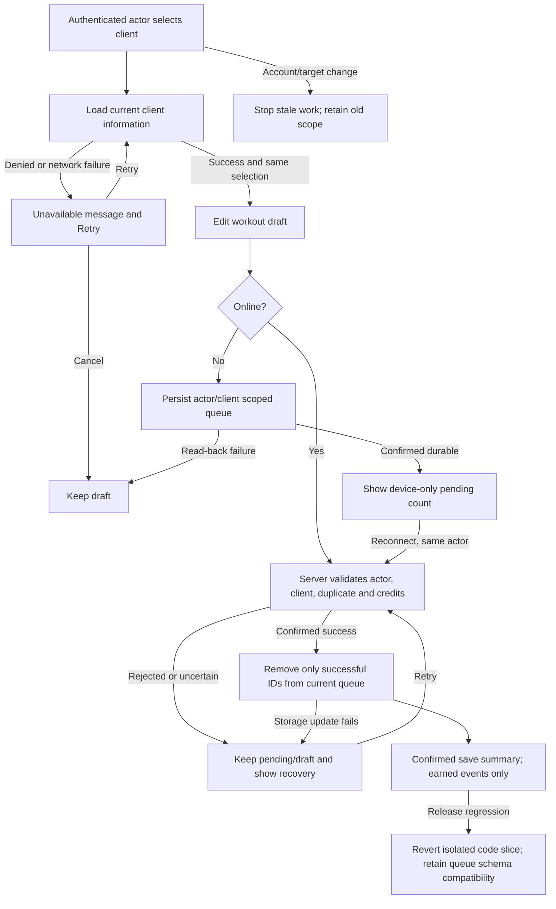

# Full-site repair — canonical execution packet

Owner: Astra orchestrator. Version 2.1, 2026-09-12. Status: LOCAL BUILD AND REGRESSION VERIFIED; independent final Astra review PENDING. The final controller receipt is authoritative for the subsequent review verdict. Prior versions and original audits are preserved; this is the same canonical packet.

Receipt sequence: `readiness.json` is the frozen pre-review plan/test receipt. Its passing tests do not approve implementation. After the final controller gate completes, `.mega-blueprints/artifacts/55c0633e8d876db7/implementation-readiness.json` becomes this packet's canonical implementation receipt and supersedes that pre-review receipt. It embeds the completed workflow outside the frozen source scope, avoiding a circular self-hash. If it is absent, final approval is still pending. The first attempted implementation receipt correctly failed because final review evidence did not yet exist; that failure remains preserved.

This packet governs the full-site audit and repair requested by Sean on September 12. It supersedes the repair recommendations of the two supplied branch audits where current-main evidence disagrees; their original bytes remain in `originals/`, verified by SHA-256. It does not supersede unrelated feature blueprints or authorize production release.

## Baseline and authority

- Caller mount: `C:/Users/BigotSmasher/Desktop/quick-pt/SS-PT` contains documents only. Canonical shared checkout: `C:/Users/BigotSmasher/Desktop/@Everything/quick-pt/SS-PT`, branch `wip/comms-notifications-2026-07-05`, HEAD `a89cbf0f080644877ae8a45729d3f0a59d4cb8b8`, dirty and 598 ahead/2397 behind main. Its application files are untouched.
- Isolated repair worktree: `tmp/worktrees/full-site-repair-20260912` under caller mount; branch `codex/full-site-repair-20260912`; fresh fetch of origin/main, HEAD `53120649f356c3efccee32872b530096d386642f`; initially clean.
- No prior full-site repair packet found in this worktree/history. The supplied reports are historical evidence from a different branch, not current implementation truth.
- Dependencies installed with lockfile-based `npm ci --ignore-scripts --no-audit --no-fund` separately in frontend/backend. No production env files copied.
- Fresh backend Vitest: 1207 files passed, 1 skipped; 9832 tests passed, 6 skipped. Fake test credentials and an unreachable local DB URL; no production database exercised.
- Fresh frontend production build PASS. Documented 8192 MB type-check aborts with V8 heap exhaustion; explicit 16384 MB rerun PASS with no errors. Full frontend baseline: 1612 files, 8206 tests PASS. Current main does not reproduce the old audit's 46 failing tests.
- Public probe: `ss-pt-new.onrender.com/socket.io/?EIO=4&transport=polling` returns HTTP 200 with Engine.IO OPEN; `ss-pt.onrender.com` returns HTML. Preserve the existing socket host. Public health returns HTTP 200. Production privacy page renders its policy, and 414px homepage has no horizontal overflow.
- No graphify graph exists in either inspected repository; direct imports, routes, callers and source tracing are authoritative. No graph generation/provider work required.
- Continuity count: 0 using Git Bash outside the restricted signal-pipe environment. Isolated coordination prune: 0. Native vault/workflow hooks are not yet proven to execute; explicit preservation is used.

## User-selected execution workflow

Sean explicitly answered: **“Luna builds; Astra reviews combined fixes.”** Use bounded `gpt-5.6-luna` xhigh implementation/test slices and final `gpt-6-astra` xhigh hostile review/adjudication/repairs. GLM and Flash are not required for this task. Deferred review is PENDING, never passed. Use the installed controller's schema-4 `override-init`; retain default 12 final-review admissions and 3 review rounds, no paid API or reset credits. Additional bounded slices are authorized by the full-site request. No earlier task state or consumed review calls exists for this new repair task. Read-only discovery calls are preserved as audit evidence, not claimed as implementation approval.

## Requirements and acceptance

| ID | Outcome and acceptance | Component / test ID | Slice |
|---|---|---|---|
| R1 | Offline flush never removes entries appended during an awaited request; only confirmed successful IDs are removed; failure/storage refusal preserves recoverable records | Offline queue; T1 | S1 |
| R2 | Offline entries belong to authenticated actor and target client; account/target switch or unmount stops further submissions; old unowned queues are preserved and never automatically attributed | Queue storage, logger binding; T2 | S1 |
| R3 | Client-info network/permission failure is visibly unavailable with retry; never fabricated zero credits; late responses cannot replace the selected client's information | Client-info loader and logger UI; T3 | S1 |
| R4 | Trainer access to compliance, renewal alerts and debate client context is assignment-scoped at the mounted route; admin remains authorized, unrelated trainer denied before data/provider work | Backend access boundaries; T4 | S2 |
| R5 | Compliance/context query failure never renders an all-clear claim; visible retry remains possible | Compliance service/queue, brief context; T5 | S2 |
| R6 | Concurrent manual credit grants preserve both grants atomically; invalid inputs cannot mutate balances; existing grant/payment separation remains | Manual grant controller; T6 | S3 |
| R7 | One application Redux store; notifications neither leak across accounts nor duplicate across broadcast/replay, and failed deletes remain visible | Store, notification controller/slice/header; T7 | S4 |
| R8 | Realtime uses existing Socket.IO namespaces; canonical token rotation, asynchronous cleanup, room authorization and message receipts remain current through logout/reconnect | Messaging, rewards and root notification transport; T8 | S5, S12 |
| R9 | Canonical client dashboard receives earned reward events; save UI celebrates confirmed work without promising unconfirmed XP; reduced motion, focus and duplicate event handling hold | Mounted client shell and save panel; T9 | S6 |
| R10 | Fresh-main failures are triaged; canonical type-check/build and full unit/component regressions pass; browser and production boundaries are recorded | Baseline/final evidence; T10 | Combined |
| R11 | Package offers reach the registered creation screen; submit uses authoritative pricing/receipt and prevents duplicate actions; uncertain outcome stays explicit | Admin packages and special manager; T11 | S7 |
| R12 | Concurrent marketplace purchase/equip preserves balance and inventory under a real database row lock; failures roll back | AvatarHome transaction service/routes; T12 | S7 |
| R13 | Correct public/admin navigation, truthful compliance states, readable public text, usable controls, reduced motion and resilient optional waiver origin | Public pages, compliance, sitemap and waiver API; T13 | S8–S10, S13 |
| R14 | Malformed optional sign-in discovery cannot crash the password login page | Federated discovery API and provider component; T14 | S11 |

Business invariants: server owns credits, saves, permissions, XP and awards. No fabricated counts, guessed balances or optimistic success without durable evidence. Never silently discard drafts/queued work. No live test data, provider calls, mail, purchases or DB migrations. Preserve existing API shapes unless a compatibility adapter and caller tests are included. Do not resurrect unmounted legacy features merely to satisfy a stale audit. No broad cleanup of the shared worktree.

## Architecture and contracts

Keep React 18, styled-components, current dashboard registries, Express/Sequelize and Socket.IO. Reuse the current save service and backend authorization helpers. No new framework, parallel transport, database or second state store.

S1 uses immutable per-entry localStorage records keyed by actor/client/entry identity, superseding the initial shared-array algorithm (preserved in version 1.1). Only an acknowledged record's own key is deleted. Appending another entry during an awaited request therefore does not share a read-modify-write array. Positive safe actor/client identities and payload target are validated. Legacy ownerless bytes remain intact and are never automatically attributed. Storage access, malformed records, key collision or read-back refusal produce recoverable failure, not successful save. Web Locks serialize scopes across supported tabs; the same-document fallback is not cross-tab exactly-once proof. Generation guards stop subsequent requests and stale UI updates after owner/target change; already transmitted server requests cannot be recalled. No new server idempotency guarantee is claimed. See integrity-amendment-2.md and S1 test evidence.

Client-info states: loading, ready, unavailable. A failed request clears stale client data and offers retry while exercises/draft remain. It does not become zero balance and does not authorize billing. Late previous-target results are ignored. A confirmed zero balance keeps existing guard semantics (admin/non-deducting/linked-session exceptions), with backend validation authoritative. Source fields and personal data are never written to the audit packet.

The bounded S2 through S13 contracts in this directory refined the three source audits before each dispatch. Astra adjudicated and repaired integration findings. Route tests execute actual mount ordering; isolated PostgreSQL proves selected transaction boundaries. Server owns balances, permissions and event receipts. Notification Redux state is scoped by actor/generation; every recipient row emits only to its user room. Messaging sends use REST receipts and Socket.IO reconciliation. Required clinical/compliance domains fail unavailable before an all-clear or provider action. Optional discovery may fail without disabling password login. The public waiver client keeps optional auth and never inherits protected login redirects.

## Desktop/mobile wireframes and UI states

Desktop logger (existing workout details retained):

```text
Training / selected client                 [Back]
[Client information unavailable. Your workout draft is kept.  Retry]
Exercise / sets / reps / load              Session notes
... existing logger controls ...           ...
[2 workouts saved on this device • Waiting for connection]
[Older offline records need owner verification; retained on this device]
                                         [Save workout]
```

Mobile 414px (single column, existing >=44px controls):

```text
Training / selected client
Information unavailable
Your draft is kept. [Retry]
Exercise + sets
Session notes
Offline: 2 pending
Older records retained
[Save workout — full width]
```

Loading: status text; keep draft editable. Empty: existing add-exercise/first-workout guidance. Partial/offline: actual pending count and device-only status. Success: confirmed save summary and real PRs. Denied: access message, no data from previous target. Validation: existing inline invalid-set guidance. Failure: persistent contextual message and retry. Recovery: no auto-destruction; re-read confirmed state. Cancel/back retains existing draft policy. Retry controls are keyboard accessible with text names; status uses aria-live and no color-only meaning; focus is not stolen on asynchronous status changes; reduced-motion skips decorative animation. Desktop and mobile flows have identical authority.

## Flow/state/sequence and trust boundaries



```mermaid
sequenceDiagram
  participant UI as Logger
  participant Q as Scoped browser queue
  participant API as Authenticated save endpoint
  UI->>Q: Read actor/client snapshot A
  Q->>API: Submit A
  UI->>Q: Append B during request
  API-->>Q: Confirm A saved
  Q->>Q: Re-read current queue; remove A only
  Q-->>UI: B remains pending
  Note over UI,API: Account switch stops subsequent requests and stale UI updates
```

State machine: draft → queued-local → syncing → server-confirmed → cleared; rejected/unknown → pending; storage failure → recovery-required; account change → inactive-scope. No transition from unknown to saved. ERD: N/A for S1; no relational schema changes. Existing User–ClientTrainerAssignment–credit/notification models govern later slices; no new table is planned. Permissions matrix: client=self, trainer=assigned clients, admin=existing staff authority; local queue ownership requires actor AND client even when both actors can access the client. Privacy flow: local browser draft/queue → same authenticated backend; tests use synthetic IDs/data; reviewers receive source/contracts only. Production data and credentials stay outside artifacts.

Mermaid source is provided here. A Mermaid renderer was unavailable in the installed frontend dependencies, so no rendered preview is claimed. Source diagrams are reviewable; structural readiness does not validate rendering.

## Test plan and traceability

T1: component hook, deferred service response, enqueue B while A is in flight; only A sent/removed, B survives. Also failure, malformed item, storage throw/no-op, simultaneous hooks, interrupted lifecycle and retry. `vitest run ...useOfflineQueue.concurrent.test.tsx ...offlineQueueStore.test.ts`.

T2: actor/client switch while deferred request in flight, unmount, missing actor, legacy key and mismatched payload. No old scope submission by new actor; no deletion of legacy bytes; recovery notice visible. Include real localStorage in jsdom and injected refusal test; Web Locks test names must distinguish mock coverage from real browser behavior.

T3: client-info success/zero/timeout/denied, explicit retry, A→B out-of-order responses; draft retained and no false credit toast. `vitest run ...useWorkoutPlanLoading.test.tsx ...WorkoutLogger.submitGuard.test.ts ...useWorkoutSubmit.aiAckTruth.test.tsx`.

T4–T9: implemented and tested under the bounded contracts and evidence table below. T10: full frontend/backend unit/component suites, frontend type-check and Vite production build, focused backend import/syntax and mounted Express tests, desktop/mobile browser scenarios. Real PostgreSQL concurrency is exercised against a disposable loopback database for grants and marketplace only. Authenticated production roles, real provider/XP delivery and deployment remain unverified boundaries. No test suite may seed/mutate the shared production DB.

Each R row links acceptance, component, test and slice. Per-slice receipts link exact commands, exits and immutable output hashes. Required behavioral RED precedes implementation where feasible; import/bootstrap failures do not count as RED. Baseline failures are retained without weakening tests. Code-source assertions are supplementary to behavioral tests.

## Slices, operations, rollback and readiness

Sequence: S1 save/offline integrity; S2 assignment/access and unavailable states; S3 atomic grants; S4 store/notification truth; S5 transport lifecycle; S6 reward/save UX; S7 remaining baseline/config regressions and combined validation. Additional bounded repairs discovered by final hostile review remain in this task and keep history. Each entry requires exact owned files, established source behavior and applicable tests; exit requires relevant passing tests, snapshot and test evidence. Final combined review occurs only after all slices are tested.

Performance: queue processing serial per scope, no polling faster than existing behavior; each mounted client-info request remains one request per selection/retry; avoid duplicate Socket.IO connections and listeners. Offline queue must preserve append during network latency, including >=30s synthetic deferred response. Operational owner Sean; errors use current logger/toast conventions without payload/PII. No auto-production writes. Rollback is reverting owned code in isolated branch; preserve actor-scoped and legacy queue bytes, avoid schema downgrade that replays another actor's records. Release requires separately authorized main push and verified deployed asset/backend state.

Hostile decisions: reject changing the live socket hostname; reject resurrecting already fixed raw-WS/schema/legal paths; accept fresh queue-loss, false-balance, route-order, assignment, notification and concurrency findings only with reproduced evidence. Current unit tests do not prove the physical database. No broad UI rewrite is justified by these findings; improve existing workflows at the failing boundary.

## Final traceability and validation evidence

All paths below are under `.mega-blueprints/artifacts/55c0633e8d876db7/` unless stated. Receipts retain exact commands, outputs, preserved failures and source hashes. The original 46 failing tests did not reproduce on fresh main. No failing test was marked passed through a weakened business assertion: stale source-shape/DTO expectations were updated to the actual contract, and the dependency guard now compares dependency sections rather than rejecting an unrelated type-check script change.

| Requirement | Acceptance evidence | Status before final review |
|---|---|---|
| R1–R3 | S1-luna-report.json; S2-workoutlogger-green.stdout.log (792 tests); browser-proof-results-3.json (414/1440, 4 cases); queue interleaving probes and failure tests | PASS |
| R4 | S2-integrity-v2-evidence.json; real mounted access matrices in final backend suite | PASS |
| R5 | S2b-data-truth-evidence.json; compliance-parent-red-green.json; parent-compliance-malformed-row-green.log | PASS |
| R6 | S3-parent-followup.json; S3-parent-postgres-final.log (9 actual PostgreSQL concurrency/rollback cases) | PASS |
| R7 | S4-luna-report.json; final notification/store tests, recipient isolation and stale owner tests | PASS |
| R8 | S5-realtime.json; S12-luna-report.json; parent-shared-socket-green.log; token refresh/logout tests and local Socket.IO integration | PASS |
| R9 | S6-luna-report.json; parent-reward-lifecycle-green.log; parent-particle-restart-green.log; celebration-browser-proof-5.json (4 desktop/mobile motion cases) | PASS |
| R10 | final-frontend-4.json/log; final-backend-3.json/log; final-types-build-4-result.json and associated logs | PASS |
| R11 | S7-offers-config-browser-evidence.json; S7-workout-mission.playwright.json (6 workout mission cases) | PASS |
| R12 | S7-marketplace.json; parent-marketplace-postgres-green.log (7 real transaction cases including concurrent purchase/equip) | PASS |
| R13 | S8-ui-closure.json; S9S10-luna-report.json; S13-luna-report.json; public-local-a11y-production2.json (8 scans, zero violations); public-ui-finish-proof-6.json | PASS |
| R14 | S11-luna-report.json; public-ui-finish-proof-6.json with malformed discovery and actual password login/help DOM still mounted | PASS |

Final frontend: **1634 passed test files, 8364 passed tests**. Backend: **9907 passed tests, 6 skipped** (1219 passed files, 1 skipped). Canonical `npm run type-check` and `npm run build` both exited zero after final transport/config changes. Runtime browser checks use synthetic intercepted API fixtures or isolated real components; production preview is a local compiled bundle, not a deployment. PostgreSQL fixtures use only disposable local tables. Full suite mocks do not prove every SQL statement against a fresh migration.

## Remaining UI contracts and applicability

Desktop notifications: header bell -> recipient list [Read] [Delete]; pending action disables the same action; failed removal keeps the row and a named Retry. Mobile uses the same list and 44px actions. Loading/empty/error are distinct; owner change clears previous data; stale requests cannot restore another account's rows. Keyboard focus stays on existing controls.

Desktop messaging: conversations | message list | draft + [Send]. Mobile: selected conversation -> message list -> draft + [Send]. Pending preserves draft and blocks duplicate submit; failure retains text and shows recovery; successful server receipt clears only the current draft, reconciling echoed IDs. Cancel/navigation never lets late responses alter another conversation.

Desktop staff attention: filters + client rows [Profile] [Message] and explicit unknown metrics. Mobile stacks rows and actions. True empty, filtered empty, required data unavailable and retry are distinct; no client all-clear follows malformed/failed data. Offers use the registered special-manager form; validation retains fields, pending prevents double actions, uncertain receipt directs the operator to existing specials before retry.

Reward desktop/mobile: confirmed save summary remains user-controlled; earned XP can float without false credit promises; level-up [Continue] is a focus-contained dismissible dialog. Existing active modal delays takeover. Reduced motion displays static text and no particle loop; logout cancels pending effects. Parent browser measured Continue at 200x56 and exercised Tab/Shift+Tab/Escape/focus restore at 414 and 1440.

Public desktop: signup form with inline named 44px password-reveal button and 16px fields; readable guidance/footer; pause control for decorative motion. Mobile: single column, same controls, no overlap/overflow. Reduced motion stops video/animation. Login discovery failure leaves password login and public [Get help] -> Contact available. No messages or signup/waiver forms were submitted in browser verification.

ERD applicability: existing User/session balance and AvatarHome JSON inventory rows are locked, with no schema migration. Notification recipient IDs and ClientTrainerAssignment enforce ownership. No new table/relationship is introduced. State/sequence/permissions/privacy diagrams and invariants above apply; exact DTO details reside in S4/S5/S7/S11/S12/S13 contracts. Performance budgets: one shared messaging socket per token among hook owners, one root notification socket per canonical token, no continuing particle RAF while idle, serial queue per supported lock scope, and no duplicate submit while pending. These are lifecycle assertions, not measured production throughput guarantees.

## Hostile adjudication, preservation and release boundary

The source reports and `orchestrator-audit.md` record rejected stale claims as well as additional defects. Live public transport, current main mounts and read-only schema metadata contradicted the proposed hostname change, old raw-WS/schema fixes and unauthenticated emergency-admin claim. Dormant endpoints/widgets are documented source debt; restoring them without a mounted caller would invent product contracts. Current onboarding launch, first-session guidance, client attention actions and save summary already exist and were preserved.

Independent final Astra review remains pending at this frozen packet version; its exact-source result is recorded separately in the workflow controller and final review artifacts so evidence does not create circular hashes. Native enrollment succeeded; that alone does not prove hook execution. User-selected Luna builds / combined Astra review supersedes GLM/Flash cadence; all prior controller events, original states and counters are preserved by supported migration, never reset. Evidence flags the invalid S2b RED method and setup-only browser failures explicitly; only valid behavioral failures count as RED.

Authenticated production trainee/trainer/admin walkthroughs, real external provider delivery, full fresh-database migration rehearsal, physical-device testing and deployment remain **NOT RUN**. These are outside the local implementation-verification receipt and remain release checks. Main push/deploy needs Sean's separate explicit authorization under project rules. No commit, push, deployment, production row mutation, provider call or message has been performed. Read-only schema probe contains metadata only and does not attest a distinct deployed database identity.

Operational owner: Sean. Rollback is revert of owned isolated code, preserving all original queue bytes and avoiding replay of ownerless records; no destructive migration needed. The shared stale checkout remains untouched apart from the documented coordination lane. Baseline SHA: `53120649f356c3efccee32872b530096d386642f`; repair branch `codex/full-site-repair-20260912`. Original audits have a hash manifest. Version 1.1 README/readiness are preserved under local evidence before this closure. `readiness.json` structurally binds requirements and passing local evidence; the final controller gate separately determines IMPLEMENTATION VERIFIED. Neither proves DEPLOYED.

## Repairs from first independent combined review

First final Astra verdict was REVISE, with AF1-01 through AF1-05 preserved in astra-final-1-report.md/json. No finding was silently waived. The controller retained its review, counters and history, and authorized Astra repair. The following repairs passed focused regressions and the new full frontend/compiler/build run; final independent re-review is still PENDING in this packet.

| Finding | Repair and acceptance proof | Evidence under local artifact directory |
|---|---|---|
| AF1-01 (R8) | Actor generations isolate messages, reads, results, errors and callbacks through A-B-A; old data cannot drive read/typing events. Actual deferred-hook regressions and mounted composer checks. | AF1-01-04-repair-report.json; AF1-stale-transport-red.log; AF1-messaging-regressions-5.log |
| AF1-02 (R7) | Exact active request ID plus owner generation; accepted mutations invalidate older snapshots. Both completion orders, rejection, read/delete/socket races. | AF1-02-repair-report.json; AF1-02-red.log; AF1-02-green.log (31 tests) |
| AF1-03 (R11) | Restore mounted flag during StrictMode setup; invalidate old client generations and clear client-owned banners; preserve pending create lock. | AF1-03-05-repair-report.json; AF1-03-05-green.log (19 tests) |
| AF1-04 (R8) | Settled send ends Sending; unknown receipt retains draft and visible recovery; persisted echo deduplicates by ID. Draft/submit state isolates actor and conversation. | AF1-01-04-repair-report.json; AF1-composer-red.log; AF1-messaging-regressions-5.log (46 tests) |
| AF1-05 (R11) | Lost response, timeout and possible post-commit server failure instruct checking existing specials before retry; authoritative validation errors remain usable. | AF1-03-05-repair-report.json; AF1-03-05-red.log; AF1-03-05-green.log |

The lifecycle code was extracted into the existing messaging helper to retain the existing 300 nonblank-line hook guard. No test guard was weakened. Scoped messaging lint exits zero with no warnings. Backend source is unchanged since final-backend-3; all 42 declared backend source/test hashes were rechecked. Final frontend run 4 has 8364 passing tests in 1634 files. Canonical type-check/build run 4 both pass. Full actual tool outputs, source hashes and first-review failures remain preserved. These additional tests use synthetic account/API/socket fixtures and do not substitute for authenticated production walkthroughs.
