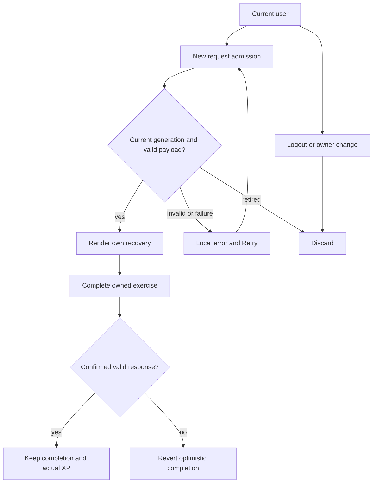

# Mounted recovery boundary repair

Status: PLAN READY; parent Astra repairs a concrete integration finding. Extends I8-I10 of INTEGRATION-2026-09-13.md; same candidate, ownership and final review. No new review counters.

## Evidence and requirements
The mounted RestoreCard accepts a truthy malformed response then calls data.blocks.map, crashing the Home tab. Its hook receives Boolean(userId), so switching between signed-in users does not invalidate data. A shared cancellation boolean also allows a retired request to publish after a later request resets it. Preserve current source in git and this addendum before repair.

R1: malformed successful payloads render a local unavailable/retry state, never crash Home. R2: displayed data, completion state and in-flight results belong to exact current user and request generation; logout/account switch immediately hides old results. R3: failed or malformed completion responses roll back optimistic completion; retired responses cannot publish XP or mutate a new owner's completion state. R4: valid full/strip/cold paths remain supported with no fabricated XP.

## Blueprint, contract and boundaries
Pass actual userId from RestoreCard into useRestoreToday. Keep local state in an owner/generation admission, invalidate it on owner change, retry and cleanup. Validate only public render and completion fields before publishing; existing API endpoints and server authorization remain authoritative. No new storage/schema/dependency or server changes. Existing response envelopes remain unchanged. One request per admission, no extra polling. Exact files: RestoreCard.tsx, useRestoreToday.ts, new useRestoreToday.lifecycle.test.tsx. Existing RestoreCard.test.tsx remains unchanged regression coverage.

## UI and accessibility wireframes
Desktop card and mobile stacked card preserve current geometry and focus controls:
loading [Restore / skeleton]; empty cold [Start with foundations / existing CTA]; ready [existing ritual and completion controls]; denied/failure/malformed [Restore is catching its breath / Retry]; retry clears stale content; cancel/logout removes owner content. No new control, styling or navigation. Existing 44px controls/reduced-motion rules apply.

State and trust flow are represented above. Sequence: user -> hook -> existing API -> validated same-admission state. ERD/migration N/A: no storage changes. Permission matrix unchanged: authenticated self API, no arbitrary clientId sent; backend enforces identity. Privacy: only synthetic fixtures in tests; no client data or raw error payloads in logs.

## Tests, traceability and operations
T-R1 malformed payload -> error, not throw; retry -> valid full. T-R2 A -> B with pending A and B responses, old data and completion absent, late A ignored; logout clears. T-R3 failed/malformed POST rollback and late A completion cannot award B XP. T-R4 existing rendered RestoreCard tests preserve all normal paths. Requirement Rn maps to T-Rn and these three files in S4. RED assertions precede repair, GREEN logs/JSON are actual evidence; mocks do not certify production auth/API. Mounted synthetic browser checks validate composition. Performance: bounded state, request cancellation fence, no new timer. Rollback: revert these three paths from candidate patch; no data restore needed. Parent hostile review challenge: render-before-effect gaps, StrictMode replay and stale mutation completion. Readiness requires passing targeted tests and final combined review; this plan alone is not implementation proof.
