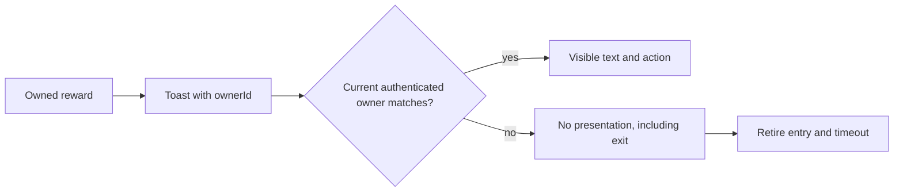

# Reward announcement owner boundary

Status: PLAN READY. Independent actual-hook/actual-ToastProvider probe confirms a visible owner-A achievement remains after switching to owner B. Extends I3/I4/I9; same final review authority/counters. Preserve supplement/reward-toast-owner-red.json and its historical probe.

O1: already-visible reward text and actions immediately disappear on account change/logout, including during AnimatePresence exit. O2: current-owner semantic feedback still renders and ordinary unscoped toasts remain compatible. O3: no remount of application children, no broad application state reset, no timer retention for retired owner notifications.

Architecture: additive optional ownerId on Toast. Reward hook supplies current owner. Each toast presentation observes the existing AuthContext directly and returns nothing for mismatched owners, even if an exit animation retains the child. Provider retires mismatched owner entries and their timers. Existing unscoped toast behavior unchanged. No API/storage/schema/provider changes or new dependencies. Exact files: use-toast.tsx, reward hook and new actual-provider owner regression. Existing CSS literals in the newly touched toast file must satisfy unchanged G4 using token fallbacks, preserving appearance.

Desktop/mobile states: [Achievement unlocked / actual name and XP] for current owner; [no prior-owner toast] immediately on logout/switch; new owner's future toast renders normally. Other loading/error/UI behavior unchanged. Existing keyboard dismiss/live region remain. No new control; 44px and responsive behavior inherited. Wireframe is the same compact notification card with owner gating.

State/sequence/trust boundary is above. Permission unchanged: presentation ownership only; backend still authorizes events. ERD/migration N/A. No private data in artifacts; synthetic names/IDs only. Tests O1-O3: actual hook + ToastProvider + AuthContext transitions A->B/logout, normal unscoped toast compatibility, B announcement after switch. RED reproduces visible leak; GREEN must pass immediate absence without waiting for exit. Also existing reward lifecycle/toast tests, actual frontend guard, full suite and final hostile review. Requirement -> tests -> three files -> S10 -> evidence. Rollback only owned diff, no data restore; performance one context read per visible toast and no extra network. This plan does not certify implementation.
