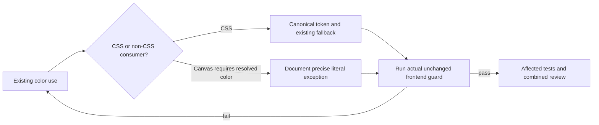

# Existing frontend guard integration

Status: PLAN READY. Release preflight of the actual repository frontend guard found 63 G4 hardcoded-color violations across five changed files; original exact log is preserved in the FULLSITE release artifact. G6 length warnings are advisory. No guard is being disabled. Drawer ownership remains with the supplemental review task.

G1: four remaining files pass scripts/hooks/frontend-guards.mjs using supported tokens and precise exceptions only when a non-CSS canvas/hex API requires literal values. G2: preserve existing color fallbacks, alpha effects, layout, accessible contrast and control behavior. G3: no blanket ignore, guard-code change or dependency. Exact files: CelebrationPortal.tsx, EnhancedNotificationSection.tsx, Footer.tsx, OptimizedSignupModal.tsx. The supplemental drawer owner handles its own file.

Architecture/contracts: CSS colors use existing canonical custom properties with exact prior fallback where needed; Canvas colors remain valid actual colors, not unresolved var() strings. Audit usages before changing shared constants, including hex alpha concatenation. This is token adoption only; no routing, API, state, data, billing or auth behavior changes. Wireframes N/A: identical layout and states. Desktop/mobile and reduced-motion behavior remain unchanged; existing browser checks plus affected tests validate this. State/sequence/ERD/permission diagrams N/A: no changed control/data flow. Privacy N/A: public style literals only.

Tests: actual failing guard output is baseline; rerun per-file guard and affected celebration lifecycle, notification mutations and signup tests after edit. No new tests for pure reversible token substitutions. G1/G2/G3 map to these files, guard output, existing tests and S6 source hashes. Render-state behavior must remain intact; review alpha concatenations and canvas drawing. Rollback: revert only token substitution diff; no storage/migration. Performance unchanged, no new compute or request. Luna builds; Astra reviews exact delta and final combined state. Readiness requires guard PASS and passing affected tests; this document is not proof.
