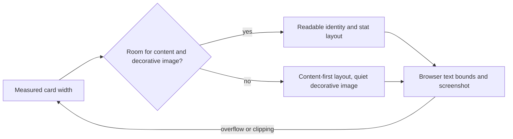

# Responsive profile-card integration repair

Status: PLAN READY; extends I5/I6/I9. Actual 1440x1000 mounted client screenshot shows the two-column HeroPanel leaves only about 350px for three icon/stat tiles; labels wrap into adjacent space and the hero becomes over 500px tall. Current browser has one compass and no page overflow; this is internal card readability and hierarchy, not missing data. Exact source scope: ClientDashboardHome.heroStyles.ts. No other source file.

V1: at 390/768/1440/2560 widths, profile/stat text stays within its tile and is readable. V2: decorative Swan media must not consume the minimum content width needed by identity/stats; preserve brand image, actual stats, rank, 44px action controls and contrast. V3: reduce unnecessary hero height so workout actions and compass follow a compact identity section. No new information, CTA, provider, state, API, schema, storage or data claims.

Blueprint: keep existing composed HeroPanel/content/media/StatGrid consumers; repair responsive styles based on available card space, with wrapping/min-width rules and decorative imagery treatment. Avoid global navigation/layout edits. Desktop wireframe: [identity + discreet Swan art] / [points | level | streak] / [rank + momentum]. Mobile: [compact identity] / [readable stats stacked if needed] / [rank + momentum]; art must not add an empty second row. Existing loading/empty/error/action states are inherited unchanged. Keyboard/focus controls unchanged; avoid clipped text, fixed text height and visual-only data hiding.

State/sequence/ERD/permissions/privacy diagrams N/A: style-only public UI change. Requirement V1-V3 maps to heroStyles, browser measured bounds/screenshots, unchanged mounted home tests, and S9. No new tests mirroring CSS; actual browser check is the acceptance evidence. Run unchanged frontend guard and affected home tests, then final combined suite/build/review. Performance: no JS, requests, animation or dependencies added. Rollback: revert this one style file. Parent Astra reviews contrast, text bounds, hierarchy and mobile screenshot. Canonical final readiness receipt references actual evidence; this plan is not a pass.
