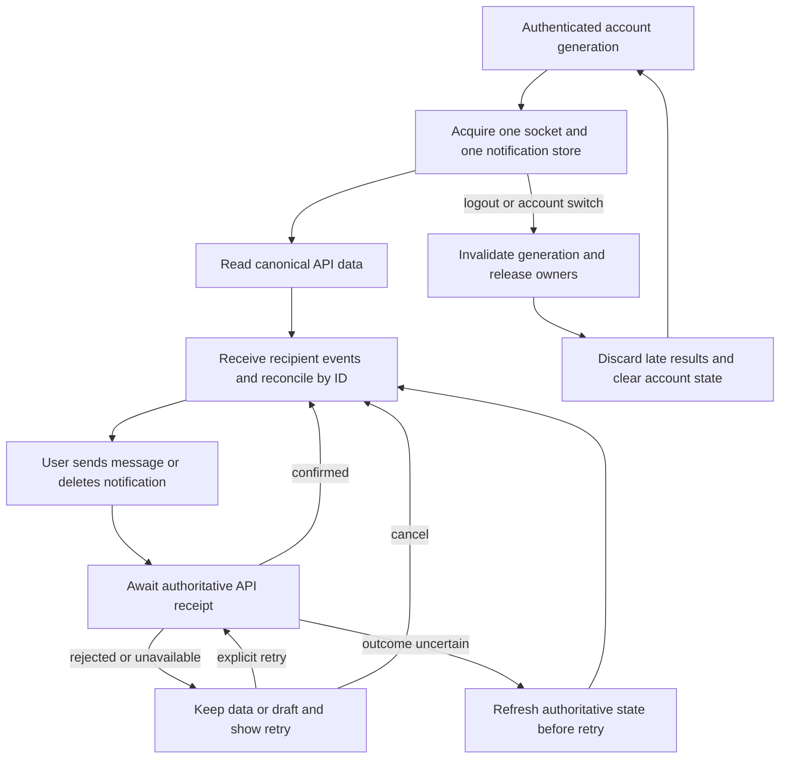

# Transport, notification state, and public-route reconciliation

Status: AUDIT COMPLETE; remediation and executable regression tests NOT RUN by this subtask.
Owner: Astra audit_transport. Effective date: 2026-09-12. Version: 1.
Canonical parent: full-site-repair-2026-09-12 packet. This is a bounded audit input, not a competing implementation plan or readiness receipt.

## Baseline and authority

- Worktree: `C:/Users/BigotSmasher/Desktop/quick-pt/SS-PT/tmp/worktrees/full-site-repair-20260912`.
- Source: `53120649f356c3efccee32872b530096d386642f`, initially clean. Parent owns baseline/full suites, public probes, packet/controller, and overall release decision.
- Prior report reconciled: `C:/Users/BigotSmasher/Desktop/@Everything/quick-pt/SS-PT/docs/ai-workflow/AI-HANDOFF/FULL-SITE-HOSTILE-AUDIT-2026-09-12.md`. Prior report was not edited. This new file did not exist before creation; no existing artifact was overwritten.
- Read-only inspection plus two in-memory synthetic probes of actual extracted functions. No network, provider calls, database access, production mutations, app edits, browser interactions, or full test runs by this subtask.
- Read installed non-vibe-coding and its vault reference, relevant AGENTS.md sections, active priorities/good-ideas documents. `rolling-last-done.md` absent. `node scripts/lane.mjs digest` returned `not a git repository — no ledger` despite `git rev-parse` succeeding; this is a tooling limitation, not proof that this worktree is not Git. Parent owns enrollment/coordination. No graphify graph exists; scoped direct source tracing used without rebuilding a graph.
- Parent supplied public probe evidence: `ss-pt-new.onrender.com/socket.io/?EIO=4&transport=polling` returns HTTP 200 Engine.IO open packet; `ss-pt.onrender.com` returns HTML instead. **Preserve ss-pt-new. Do not change the hostname based on naming history.**
- User-selected workflow reported by parent: Luna implements/tests bounded slices, then combined Astra review/repair. This report does not claim deferred reviews passed.

## Ranked findings

### T1 — P1 VERIFIED: notification initialization dispatches into a second Redux store

`frontend/src/App.tsx:58,249` supplies `redux/store.ts` to React. `App.tsx:202-215` starts `setupNotifications()` after authentication. `frontend/src/utils/notificationInitializer.ts:5,21,44` imports the different `store/index.ts` singleton, dispatches initial/polling fetches into it, and uses its auth state to decide whether polling continues. `frontend/src/store/index.ts:21-40` calls `configureStore`, while `frontend/src/redux/store.ts:19` independently calls it. `frontend/src/main.jsx:43` imports `utils/storeInitSafeguard.js`, whose `:14,39` initialization also targets the detached store.

Mounted receipt: `App.tsx` Provider -> authenticated header `frontend/src/components/Header/components/ActionIcons.tsx:224-228` -> `EnhancedNotificationSectionWrapper.tsx:56` -> `EnhancedNotificationSection.tsx:532-534` selects provided-store notifications. Header's own fetch only happens when dropdown opens (`:573-578`). Initial notification results do not populate that header; detached-store auth can stop polling after the first interval.

Correct a misleading portion of the prior report: hooks imported from `store/index.ts` still call React Redux `useDispatch/useSelector`, so those hooks read the Provider store. A type import or typed hook import alone does not bind a component to the second store. The verified detached consumers are direct singleton dispatch/getState users.

Minimal repair: keep `redux/store.ts` as sole constructor; make `store/index.ts` a compatibility facade with the same named/default store, typed hooks, and existing persister compatibility shape. Preserve `customization`, `menu`, and `orientation` reducer compatibility when unifying the two reducer sets. Do not substitute an entirely new state system.

Required account isolation in this slice: the notification reducer does not reset on `auth/logout` (`store/slices/authSlice.ts:172-181` only changes auth), while initializer cleanup only clears its interval (`notificationInitializer.ts:56-59`). In-flight fetch fulfillment can outlive logout/account switch. Reset account-owned notification state at auth boundary and abort/invalidate previous-generation fetches; a late response for user A must never populate user B's bell. React component unmount or clearing an interval alone is insufficient.

Exact proposed source files: `frontend/src/redux/store.ts`, `frontend/src/store/index.ts`, `frontend/src/store/slices/notificationSlice.ts`, `frontend/src/utils/notificationInitializer.ts`; touch `frontend/src/App.tsx` only if account identity must be passed explicitly. Existing safeguard should work unchanged through the facade.

Tests: new `frontend/src/store/storeIdentity.test.ts` (strict singleton identity + compatible state keys + Provider visibility); new `frontend/src/utils/notificationInitializer.test.ts` (initial fetch, periodic fetch, cleanup, A->logout->B with delayed A response); extend `frontend/src/store/slices/notificationSlice.test.ts` (logout/reset and stale fulfillment). Use synthetic users/tokens and deferred promises, no real DB.

### T2 — P1 VERIFIED: admin notification fanout creates duplicate and foreign-owned rows in each bell

`backend/controllers/notificationController.mjs:404-416` creates one row per admin. `:423-432` then broadcasts every row to shared `admin` room and sends each recipient's row again to its personal room. Server joins authenticated admins to both room types (`backend/socket/socketManager.mjs:342` and personal-room helper `:321`). Header listens to `notification:new` (`EnhancedNotificationSection.tsx:551-566`); reducer unconditionally prepends every delivery (`notificationSlice.ts:175-178`). Two admins therefore receive three events each: own row twice plus another admin's row. Clicking the foreign row cannot succeed because read/delete controller queries include current `userId`.

Reproduced in-memory from the actual controller source with two synthetic admins 7/8 and fake Notification model/IO: emitted `admin -> row100/user7`, `admin -> row101/user8`, `user:7 -> row100/user7`, `user:8 -> row101/user8`, plus personal unread counts. Result `success:true`. This verifies control flow, not PostgreSQL or live delivery.

Mounted receipt: registration `backend/controllers/authController.mjs:653`, order `orderController.mjs:90`, and orientation `orientationController.mjs:305,579` call this helper; default Socket.IO is initialized by `core/startup.mjs:393,406` before `server.mjs:131` adds messaging. API mount `core/routes.mjs:399` -> `routes/notificationRoutes.mjs:62,98,105,112,119,126` GET/PUT/PATCH/DELETE handlers. Authoritative `backend/models/Notification.mjs:13-22,66-80,86` declares integer id, required title/message, recipient userId/senderId, table `notifications`.

Minimal repair: emit each persisted row only to its recipient room, keeping per-user count updates. Add ID-based replay/upsert protection in the frontend reducer; duplicates must not increase unread count. Do not make foreign IDs markable to hide this bug.

Exact source files: `backend/controllers/notificationController.mjs`, `frontend/src/store/slices/notificationSlice.ts`. Tests: new `backend/tests/api/notificationAdminFanout.test.mjs` (actual controller under model/IO fakes; each admin receives only own ID exactly once; zero admins; socket failure preserves durable creation); extend `frontend/src/store/slices/notificationSlice.test.ts` for duplicate ID replay/read-state/count behavior.

### T3 — P1 VERIFIED source/control-flow: socket sends have no success/failure receipt and can remain “Sending...” forever

`frontend/src/components/Social/Messaging/useMessaging.ts:143-147` adds pending text, emits `send_message`, and immediately resolves. Backend `socket/socket.mjs:135,140,152,160,204` emits `error` for throttle, membership, relationship, block, or server failure. `useMessagingSocketEffects.ts` listens to `new_message`, typing, read and presence only; neither it nor `useMessaging` subscribes to `error`. Pending text clears only on matching successful echo (`useMessagingSocketEffects.ts:62`), and the composer already clears its draft (`MessageThread.tsx:90-103`). The visible pending bubble (`MessageThread.tsx:228-233`) can spin indefinitely after rejection. No local timeout or acknowledgment exists. Dropped connection between `connected` check and emit also produces no outcome.

Mounted receipt: `main-routes.tsx:936` mounts dashboard; `UniversalDashboardLayout.routes.tsx:160,202,231` registers role `/messages`; `UniversalDashboardLayout.shellPieces.tsx:96-109` renders `<Component />`; `pages/MessagingPage.tsx:15` renders `<MessagingView />`; `MessagingView.tsx:191-207` wires `onSend={sendMessage}` into `MessageThread`. Backend namespace mounted at `socket/socket.mjs:85` via `server.mjs:131`. Existing REST path is `POST /api/messaging/conversations/:id/messages`, `core/routes.mjs:397` -> `routes/messagingRoutes.mjs:84`, protected and messaging-thread authorized.

Minimal safe repair option: use the existing REST send for persisted writes in both connected/disconnected states, retaining Socket.IO for receive/typing/read/presence. Await authoritative response, reconcile socket echo and REST result by server message ID, preserve/restore failed draft, expose a clear retry, and do not auto-retry an ambiguous write. This avoids adding a second receipt/idempotency protocol. If preserving socket writes instead, add correlated acknowledgment/error/timeout contracts on both ends; do not resend automatically through REST after an uncertain socket timeout.

Exact source files for REST-write option: `frontend/src/components/Social/Messaging/useMessaging.ts`, `MessageThread.tsx`, `useMessagingSocketEffects.ts` (same directory). Tests: new `useMessaging.sendReceipt.test.tsx` and `MessageThread.sendRecovery.test.tsx` in that directory; extend `useMessaging.safeErrors.test.tsx`. Cover connected rejection, disconnect-before-send, one successful write, echo-before-response dedup, failed draft recovery, explicit retry, navigation/unmount, and two identical message texts with different IDs. Validate existing REST response contract before claiming end-to-end completion.

### T4 — P1 VERIFIED source/control-flow: messaging socket lifecycle has asynchronous creation and stale-token races

`frontend/src/hooks/useSocket.ts:81-95` checks shared `globalSocket` before awaiting dynamic import/create, without sharing an in-flight creation promise. Concurrent consumers can both create sockets. If a consumer unmounts during import, `:95-100` still assigns the newly created socket before checking cancellation; no disposer was returned, so `:163` cannot release it. Under StrictMode or rapid navigation this can leak a connection. Existing `useSocket.test.ts` only checks source strings, so it does not exercise these races.

Token refresh is also unwired: `useSocket.ts:127-137` subscribes to `token_refreshed`; repo-wide source search finds no emitter. `frontend/src/services/productionTokenManager.ts:127-140` writes the refreshed token and resolves subscribers but never dispatches this event. The hook effect has `[]` dependencies and reads storage once. A reconnect after access-token expiry can keep authenticating with the old token even after API refresh. Account switch/logout must explicitly release the previous socket, listeners, and subscriptions.

Mount: same actual Messages chain as T3. `/messaging` server consumes `socket.handshake.auth.token` and verifies the access-token type (`backend/socket/socket.mjs:48-67`). The namespace/protocol is correct; changing to a raw WebSocket or changing hostname would regress it.

Minimal repair: one acquisition promise/generation per current auth identity; reference-count actual mounted owners; dispose a resolved socket if its generation was canceled before adoption. Hook auth identity must be reactive, not inferred from an unobserved localStorage write. Wire the central token manager's existing API refresh into an explicit tested token-change contract and reconcile context/manual-login/logout changes. Subscribe Manager `reconnect_attempt` on the Manager rather than the Socket if reporting reconnect state. Do not remove other consumers' listeners when only one consumer unmounts.

Exact source files: `frontend/src/hooks/useSocket.ts`, `frontend/src/services/productionTokenManager.ts`; `frontend/src/context/AuthContextProvider.tsx` only if the chosen centralized auth event needs its existing login/logout transitions. New test `frontend/src/hooks/useSocket.lifecycle.test.tsx`; extend token-manager tests in its existing location or add `frontend/src/services/productionTokenManager.socketLifecycle.test.ts`. Deferred socket factory + two hook instances + StrictMode + unmount-before-resolution + refresh/reconnect + A->B + last-owner cleanup are mandatory.

### T5 — P2 VERIFIED: notification delete failure silently masquerades as removal

`frontend/src/components/Header/EnhancedNotificationSection.tsx:625-629` first dispatches `removeNotification(id)`, then executes `api.delete(...).catch(() => {})`. A network/server/ownership error permanently removes the visible row/count until next refetch, with no explanation or retry. Same header/API/model receipt as T1/T2. Especially observable with T2's foreign row IDs.

Minimal repair: await successful server deletion before removal, or perform an optimistic mutation with bounded pending state and rollback/refetch on failure. Expose failure and retry; do not double-delete on repeated clicks. Source: `EnhancedNotificationSection.tsx` and `notificationSlice.ts` if introducing a delete thunk. New test `frontend/src/components/Header/EnhancedNotificationSection.deleteRecovery.test.tsx`; assert rejection retains/restores row and count, success removes exactly once, and account switch prevents old completion mutating the new list.

### T6 — P2 VERIFIED server boundary; no current UI emitter found: normalized ADMIN fails session-room authorization

`backend/socket/socketManager.mjs:97` normalizes roles to uppercase, stores that at `:102`; `assertSessionRoomAccess` tests `user.role === 'admin'` at `:412`. Therefore unrelated admins are denied a permitted session room. Actual-function synthetic probe with a session owned by IDs 10/20: role ADMIN/id99 -> false, role admin/id99 -> true, CLIENT/id10 -> true, CLIENT/id99 -> false. No frontend `schedule:join_session` emitter was found, so do not describe this as a currently broken calendar mount; current calendar invalidates on global schedule events.

Minimal repair: normalize role consistently; validate canonical positive session IDs and preserve owner/trainer/outsider authorization. Existing room join passes original ID into room name after parseInt authorization, so reject noncanonical IDs rather than accepting `3junk` or silently authorizing a different room string. Source `backend/socket/socketManager.mjs`; new `backend/tests/unit/socketSessionRoomAuthorization.test.mjs` executing actual registered handler or extracted production authorization helper with model fake. Test uppercase admin, client owner, assigned trainer, unrelated actor, invalid/missing session, malformed ID, and auth failure. Model fields: `backend/models/Session.mjs:69` userId, trainerId in that model, table `sessions` at `:342`.

### T7 — P2 VERIFIED configuration fragility, not a proven production outage: public waiver API fallback points to visitor localhost

`frontend/src/services/publicWaiverService.ts:12-15` uses only VITE_API_URL then localhost:10000, appending `/api/public/waivers`. Mounted by `main-routes.tsx:451` -> `PublicWaiverPage.V3.tsx` -> `pages/waiver/usePublicWaiverForm.ts` -> this service; backend `core/routes.mjs:582` -> `publicWaiverRoutes.mjs:16-17`. A build using only VITE_API_BASE_URL or VITE_BACKEND_URL ignores those values and calls the visitor's machine; VITE_API_URL ending in `/api` doubles the path. **Current tracked `.env.production:6-7` defines the apex origin and render.yaml also declares VITE_API_URL: this is not evidence that today's deployed waiver is broken.**

Minimal repair if included: reuse or extract one explicit API-origin resolver with normalized path semantics, honor configured origin and production same-origin fallback, retain localhost only in development. Public waiver remains public/optional-auth: do not inherit a client interceptor that forces login for signed-out waiver users. Source `publicWaiverService.ts` plus narrowly scoped resolver (new `frontend/src/utils/apiOrigin.ts` if no appropriate existing one after implementation inspection). Tests: extend `publicWaiverService.authPipeline.test.ts` with behavioral axios config tests, new `apiOrigin.test.ts` only if helper added. Cover configured root, configured `/api`, trailing slash, alternate supported key, production with no key, development, and optional token absence.

Other fallback hits: `services/packageService.ts:18`, `trainerService.ts:18`, `gamification/gamification-service.js:14`. They currently have no proven live method consumer from the scoped search (barrel exports are not mount proof). No blanket rewrite required.

## Actual realtime contract reconciliation

| Surface | Client -> server | Server -> client | Current result |
|---|---|---|---|
| Default shared context | `SocketContext.tsx:54` emits authenticate `{token}`; `socketManager.mjs:76` validates it | authenticated/auth_error; client `:57-64` handles them | Names and auth payload match. Namespace transport correct. |
| Calendar and admin sessions | Shared context auth; REST fetch remains authoritative | `realTimeScheduleService.mjs:91-109` emits schedule:update `{type,data,timestamp,priority,sessionId,trainerId,clientId}`; manager emits schedule:sync_required. `useCalendarData.ts:293-306` and `useAdminSessionsData.ts:165-172` refetch on both | Current calendar is not the prior raw-WS implementation. |
| Messaging room subscription | `useMessagingSocketEffects.ts:43` emits join_conversations array of IDs | `socket.mjs:97-117` checks active participant and joins string room | Names/payload match. |
| Messaging writes | `useMessaging.ts:146` emits send_message `{conversationId,content}` | `socket.mjs:174` emits new_message raw DB message + sender; `messagingApiAdapters.ts` normalizes it | Success contract matches; error/recovery T3 remains. |
| Typing | is_typing `{conversationId}` at useMessaging.ts:172 | user_typing `{conversationId,userId,userName}`, socket.mjs:208-218; effect handles at :84-117 | Names/payload match. |
| Read receipts | mark_as_read `{conversationId,lastMessageId}` at useMessaging.ts:179 | messages_read `{conversationId,userId,userName,readMessageIds}`, socket.mjs:220-262; effect :130-149 | Match. Backend ID types vs frontend readIds.includes strict comparison deserves focused fixture coverage when touching this path. |
| Presence | Server connection/disconnect | user_online/user_offline `{userId}`; effects :153-175 | Names match; onlineUsers maps one socket per user, so multi-tab disconnect can falsely show offline. Lower-priority bounded follow-up. |
| Header notifications | REST reads/mutations, default shared context | notification:new canonical notification and notification:count `{unreadCount}`, controller :145-154; header :551-566 | Match; T1/T2/T5 state/ownership issues remain. |
| Gamification | `hooks/gamification/useGamificationRealtime.ts:126-140` uses Socket.IO default namespace and authenticate | `socket/gamificationEvents.mjs:90` emits gamification:<event>; hook :15-34 registers points_awarded/workout_completed/achievement_unlocked/level_up/streak_milestone and checks userId | Current active implementation matches names and token handshake. It is separate Socket.IO connection, not inherently a defect. |

Messaging SQL notification boundary handed to parent backend audit: `backend/socket/socket.mjs:193-196` inserts `notifications(user_id,type,content,created_at)` and emits `new_notification` on `/messaging`. Canonical Notification model has required title/message and camel recipient fields. Header consumes `notification:new` on default namespace. These are different storage/payload/event contracts, not an alias that can be fixed just by renaming client event. Actual physical DB schema remains unverified here; parent should decide the minimal canonical persistence bridge, preserving a successful message when secondary notification fails.

## Rejected/stale prior claims and dormant surfaces

| Prior claim | Current evidence / decision |
|---|---|
| ss-pt-new host abandoned/broken | Rejected by parent's current Engine.IO probe; keep URL and resolver. |
| `hooks/use-socket.ts` and calendar `useRealTimeUpdates.ts` are mounted raw WS | Files absent at this SHA. Calendar/admin-sessions use default SocketContext. |
| All raw WebSockets should be converted now | `enterpriseAdminApiService.ts:570-599` still contains a raw admin connection factory with JWT query, but no caller found. `yolo-analysis-service.ts:169` is a distinct video-analysis boundary. Neither proves active app-wide realtime failure. Do not indiscriminately rewrite. |
| enhancedClientDashboardService is active realtime truth | `useEnhancedClientDashboard.ts` imports it, but no importer of that hook found. Its Socket.IO manager lacks authenticate and listens to stale unprefixed events; classify orphaned/legacy candidate, not canonical repair. No deletion authorized by this report. |
| Footer privacy/terms dead; sitemap link broken | Legal JSX exists at main-routes.tsx:458-469, aliases :476-480. Current Footer.tsx:424-425 contains legal links; sitemap link removed. |
| Compact footer /help dead | CompactFooter.tsx:89 now links `/support`, whose route exists at main-routes.tsx:779. |
| Emergency admin unguarded | Rejected: main-routes.tsx:763 wraps it with ProtectedRoute allowedRoles admin. Development bypass internals are not proof of production unauthenticated access. |
| No 404 page | Rejected: main-routes.tsx:978-983 renders NotFoundPage. Role-internal dashboard unknown routes still deliberately redirect to role home (shellPieces.tsx:115,118), so do not claim every unknown URL has a 404. |
| ForgotPassword requests nonexistent movie.mp4 | Rejected: ForgotPasswordModal.jsx:79 uses VIDEO.waves; old path occurs only in comment. Current page is mounted at main-routes.tsx:375. Remote video fetch not tested here. |
| SessionLogService localhost:5000 reached from TrainerHomeTab | Rejected: service file absent; current SessionLogButton is a styled button (`TrainerHomeTab.styles.ts:156`) with navigation to Coach/build-plan/log-workout at TrainerHomeTab.tsx:183-198. |
| CRA gamification WS fallback | Prior component path absent; current useGamificationRealtime uses resolver and Socket.IO. |
| NotificationToastBridge arbitrary navigation | Prior file absent. Header currently navigates notification.link directly, but no tested exploitable external navigation or untrusted writer established; do not label XSS/open redirect from source alone. |

## Bounded slice architecture and evidence contract

1. **State/notification slice**: T1 then T2/T5 together or adjacent. One store; recipient-only notification events; ID-based replay protection; read/delete remain server-owned. No DB migration. Account-switch cancellation must be demonstrated before merging.
2. **Messaging lifecycle/receipt slice**: T3/T4. Preserve `/messaging` namespace and URL. Prefer existing REST write receipt plus realtime receive. Synthetic connection factory for deterministic races, then parent-owned real local Socket.IO boundary test and authenticated browser smoke.
3. **Server room/input slice**: T6. Small backend authorization correction with real handler harness and no database mutation.
4. **Optional configuration robustness slice**: T7, only after higher-priority defects. Preserve public waiver optional-auth and current working production origin.

UI recovery contract for T3/T5: idle -> pending (prevent duplicate action) -> confirmed success; denied/server error -> visible failure retaining data -> explicit retry; navigation/account change cancels stale UI completion. Mobile and desktop must expose the same retry and preserve draft. No new visual design is required. Existing component layouts are the wireframe basis; parent packet owns full wireframes/accessibility previews.

Mermaid source authored; not rendered by this subtask. No migration/ERD changes proposed; permissions and event/storage boundaries are described above. Rollback is revert of the owned slice, never reset the shared checkout. Logs should contain event/error class and synthetic test identity only, not token, message content, or private user fields. Parent must record baseline, test RED/GREEN and final combined review; this report is not IMPLEMENTATION VERIFIED or DEPLOYED.

Search evidence used: `rg -n 'new WebSocket|WebSocket\(' frontend/src`; `rg -n 'useEnhancedClientDashboard|createAdminWebSocketConnection|SessionLogService|SessionLogButton|VoiceSessionLogger|packageService|publicWaiverService|trainerService' frontend/src -g '!*.test.*' -g '!**/assets/**'`; `rg -n 'token_refreshed|token-refreshed|tokenRefreshed' frontend/src -g '!*.test.*' -g '!**/assets/**'`; direct reads of both stores, current route JSX, event handlers and emitters. Source snapshots under frontend/src/assets are not mounted runtime evidence.

Hygiene: only this audit artifact created by this subtask; no app edits, deletion, move, dependency install, or cleanup. Subsequent parent/other-agent changes may appear concurrently. Next authorized step: parent adjudicates this report into the active packet and dispatches Luna's bounded state/notification slice.
