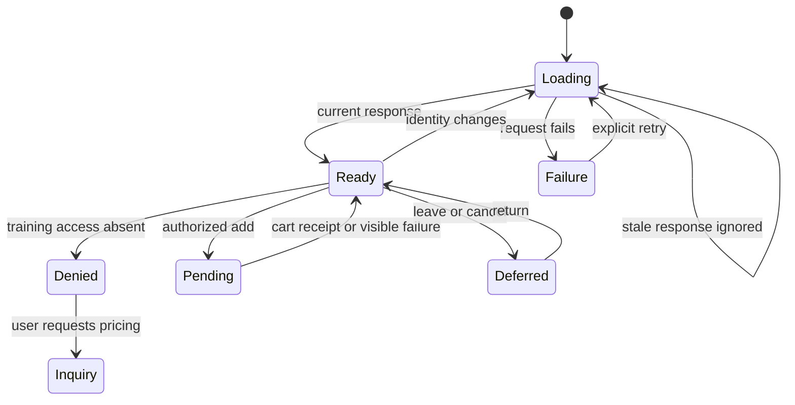
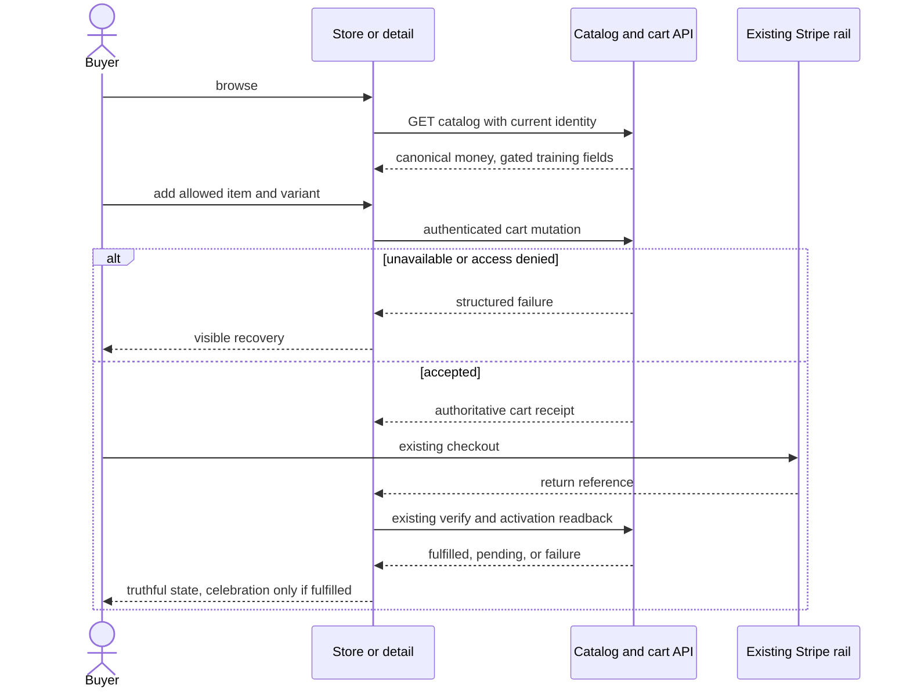

# Store upgrade: verified commerce and Crystal Case experience

Artifact STORE-UPGRADE-20260913, version 1, effective 2026-09-13.
Owner: Astra architecture/adjudication, Luna bounded implementation.
Status: PLAN; implementation and release not verified.
Target: isolated branch codex/store-upgrade-20260913 from fetched origin/main
c0cbe538d8. Native task: 01a098a4-1c60-7fe2-bdd0-0fa6a5673993.
User authorizes review, supported enhancements and implementation. No push,
production migration, live payment, provider spend, or client-data publication.

## Baseline and preservation

Declared task directory is a documentation mount. The original @Everything
checkout is f8815a0b1, diverged 2401/599 from main, with unrelated changes.
This candidate starts at current main; other active tasks remain isolated.
Live route main-routes.tsx mounts StoreV3 (with StoreV2 fallback), not StoreV4.
V4 exists but omits current membership, personal-special, inquiry, physical
variant and inline checkout workflows; retain V3 and reuse presentation ideas.
Graphify graph is absent; source/caller inspection used, no rebuild inferred.

Four existing Kimi/CART plans plus pasted chat are preserved under originals.
The portable skill snapshot preserved 904 planning files outside this worktree:
../store-upgrade-preservation-20260913/manifest.json (absolute path in evidence).
Manifest SHA256: 08f4cd0e03a9185dcbd6e3c727941edd8dab4abaf17ad2ba6c4b460ccd4399f0.
All 904 hashes verified; 2 files restored to isolated temp and compared.
Native vault hook absent on this main baseline; automatic protection unproven.
Use explicit snapshots before revisions. Coordination lane claims this packet;
application scopes below will be claimed before builder dispatch.

Baseline frontend: 4 files / 13 tests PASS (storeCatalog, PackageCard inquiry,
store price gate contract, SuccessPage auth refresh), Vitest 4.0.18.
Initial sandbox esbuild spawn EPERM was setup failure, not RED; elevated test
run succeeded. Shared dependency junctions reuse installed dependencies only.
Bash promotion counter unavailable in sandbox; equivalent read found 0 markers.
Native planner metadata confirms gpt-6-astra/xhigh. Billing usage tool confirms
included plan quota remains and no credits; no usage reset authorized.

## Source decisions and hostile findings

| Chat claim | Decision and evidence |
|---|---|
| V4 unbuilt | STALE: implementation exists; not mounted. Preserve Kimi trio as historical design input. |
| Restore activeSpecial | REJECT simple mapper fix: AdminSpecial bonuses are absent from checkout snapshots/session grants. Public DTO also ignores assignedClientIds. Suppress unsupported promises; preserve admin records and supported CustomPackage rail. |
| /api/admin/specials absent | REFUTED: core/routes.mjs mounts it. admin-packages-view calls incompatible special-offers API; separate full-site S7 owns repair. |
| add-sessions unmounted | REFUTED: sessionPackageRoutes mounts manual-grant router. Separate full-site BE-03 owns atomicity repair. |
| CART-500 proven boot race | UNPROVEN: server awaits model cache before app/listen. Do not install extra gate without reproduction. |
| Public training prices | REJECT as automatic fix: explicit owner policy grants store-prices per user. Physical product prices ARE public. Fix misleading copy and item-specific purchase rules. |
| Checkout privacy report | REFUTED scope: report means Git checkout, concerns Coach outbound privacy. Actual Axios console-error leakage is accepted separately. |
| Two dead success components | STALE: already absent. Enhance existing verified SuccessPage only. |
| End-to-end verified in code | REJECT: code is not live Stripe/DB/browser proof. |
| Proof/story/FAQ/comparison | ACCEPT with verified process and catalog fields; no invented outcomes, guarantees, popularity or savings. |
| Generated birds/feathers | REJECT as current doctrine: design.md optics law forbids generated creatures/feather motifs. Use crystal/ice/caustics. Preserve existing assets until replacement is verified. |
| Single membership/package checkout | REJECT: different products, entitlement and billing rails. Share live membership presentation; retain separate checkout mechanisms. |
| Broad reduced motion pass | REFUTED: autoplay card video and smooth scrolling need JS handling. |
| Sitemap expansion | Partial: static routes only; literal :id/:slug placeholders are invalid sitemap URLs. Full-site task owns sitemap edits. |

Additional accepted defects:
- Storefront maps price before totalCost; canonical charged price prioritizes
  variant, totalCost, price. Actual-source synthetic probe yields display/charge
  175/8400, 0/8400, and malformed 17junk -> 17/24.
- ProductDetail formats redacted null price and crashes; monthly labels use
  wrong fields; physical variants/stock are absent.
- StoreV3 gates physical cart actions using training grant, logs toast instead
  of showing feedback, and fails to invalidate/refetch catalog on auth change.
- PackageCard rounds cents and treats null rate as Best Value.
- Membership summary fetches tiers but prints hardcoded prices/features.
- Checkout renders unsupported Money Back Guarantee and disabled empty-pay UI.
- Duplicate packages anchor, early error returns that hide independent content,
  redundant cart launchers, and no reduced-motion video gate harm usability.

## Requirements and measurable acceptance

| ID | Acceptance | Tests | Slice |
|---|---|---|---|
| R1 | List/detail monetary DTO matches actual resolveUnitPrice for conflict, zero, null, malformed and variants; no fabricated zero | T1 | S1 |
| R2 | No unsupported AdminSpecial promise or assigned-offer summary in public list/detail; supported CustomPackage unchanged | T2 | S1 |
| R3 | Server training grant preserved; public physical pricing; auth change clears old training prices before stale request can render | T3 | S2 |
| R4 | Grid/detail preserve cents/null, correct monthly metadata, selected stocked variant and accessible inquiry | T4 | S2 |
| R5 | Cart errors/success visible, pending submissions deduplicated, no PII/token/error-object logs | T5 | S2 |
| R6 | Membership summaries derive tier data; donation cadence explicit; Ascension actions show pending/failure/retry | T6 | S2 |
| R7 | Empty checkout has recovery without pay panel; guarantee removed; celebration only after existing verified fulfillment | T7 | S2 |
| R8 | Four-act store with factual method, one commitment spotlight, live comparison, FAQ and independent loading/retry sections | T8 | S2 |
| R9 | Keyboard focus, 44px targets, unique anchors, reduced-motion media and overflow checks at mobile through 4K | T9 | S2 |
| R10 | Preserve existing purchase/auth/custom-special/cancel behavior; build/type-check, mounted browser smoke and review evidence | T10 | Final |

Invariants: no client logs/stories/images or medical data in public content;
no generated metrics, seed fallback catalog, automatic admin grants, new
discount policy, live provider charge, database writes or migration. Keep all
catalog and checkout authority server-side; frontend prices are display only.
Only authoritative paid/fulfilled response may trigger purchase celebration.

## Blueprint, ownership and contracts

S1: backend storefront DTO calls existing resolveUnitPrice for each parent and
variant. Serialization remains JSON numeric money at the existing boundary,
with exact cents preserved by Decimal until serialization. Unpriceable is null,
not a free sale. Strip gated training money after normalization. Never fall
back from explicitly redacted training fields to another hidden field.

Legacy AdminSpecial is an admin campaign record without implemented grant
semantics: public item activeSpecial and aggregate activeSpecials must not
advertise it. Supported per-client CustomPackage API/checkout remains intact.
No schema change, grant mutation or promotion engine is introduced.

S2: shared StoreItem normalization defines nullable display money and strict
number parsing; malformed IDs/values cannot enable purchase. Item kind selects
training grant versus public physical price visibility. Authentication owns
writes. ProductDetail reuses normalized catalog, variant selector, inventory
rules and existing inquiry component; request ownership prevents stale writes.
Purchase amount and fulfillment remain recalculated server-side.

StoreV3 becomes a thin orchestrator: catalog hook owns request generation/auth
invalidation; existing CartContext owns cart; extracted styles/sections own
presentation. Preserve /store, /shop, /swanstudios-store routes and V2 fallback.
Current universal header cart remains; store action is a contextual entry into
the same cart, not a second state store. Do not alter global header ownership.

A presentation-only spotlight uses public commitment metadata (valid months,
totalSessions, then stable displayOrder/id) and labels actual duration. Never
select by hidden price or invent recommendation/popularity/best-rate claims.
Comparison shows known sessions, months, frequency and authorized totals/rates;
missing data is unavailable, not zero. Keep physical products separate.

Memberships: /api/subscriptions/tiers is authoritative. Reuse one selection and
presentation contract on store/Ascension; preserve donation/trial/subscription
rails. One hook owns each fetch, explicit retry rather than duplicate effects.
Never infer availability from a static price list.

Checkout empty and load/error states precede payment panels. Remove unsupported
guarantee. Existing SuccessPage verified states remain authoritative; enhance
celebration through reduced-motion aware static icon/small optical response,
not new third-party event writes. Diagnostics allowlist operation/status/code;
never log Axios objects, request configs, raw response/error/customer payload.

## Desktop and mobile wireframes

Desktop:
[Global header / existing cart]
[Compact hero title + existing media/poster] [Explore] [Consultation]
[Training process: consultation -> selection -> log and review progress]
[Training title / truthful access explanation]
[One commitment spotlight: catalog facts | authorized price OR inquiry]
[Compare package details disclosure]
[Training cards 3 columns]
[Physical recovery products: public price, variant, stock]
[Live membership summaries -> selected Ascension tier]
[FAQ -> consultation]
[Existing cart panel / contextual cart control]

Mobile 320-430:
[Header]
[Compact hero + controls]
[Short method]
[Spotlight stacked -> inquiry/add]
[Comparison disclosure, stacked fact rows]
[Single column training / products]
[Memberships / FAQ]
[Cart action clear of mobile shell; reserved bottom padding]

Product detail desktop: media left, sticky facts/purchase right.
Mobile: title/known price near top, one sticky bottom action bound to the same
quantity/variant state; reserve space and respect shell offsets.
Hidden training: no price numbers; inquiry enabled, purchase absent/disabled.
Checkout empty: icon + Your cart is empty + Browse the store; no pay control.

State matrix: loading uses section skeletons and aria-busy; empty explains no
available catalog and keeps consultation/membership; partial retains independent
sections; denied training uses inquiry; invalid/unpriceable/sold-out states name
why purchase is unavailable; failure has visible alert/retry; success follows
write receipt; retry never creates an automatic second purchase; defer/cancel
returns to browsing; recovery uses existing cart deep-link/verification paths.
Keyboard: native buttons/links/disclosures, visible focus, tab focus on scroll
destination, modal focus return. Motion: matchMedia/useReducedMotion in JS,
no autoplay under reduce, no smooth scrolling, static success treatment.

## Flowchart and lifecycle

Mermaid source is flow.mmd; preview should be rendered in the app when supported.
The flow includes retry, denied, cancellation and rollback paths. State/sequence
diagrams below bind the asynchronous request and payment boundaries.

ERD: no new entities/migrations. Existing StorefrontItem -> ProductVariant;
Cart -> CartItem -> catalog/variant; checkout snapshot -> Order/OrderItem ->
payment/session grant remains unchanged. AdminSpecial is not a paid entitlement;
CustomPackage owner-scoped special remains separate.

Permissions: guests browse physical prices/training descriptions and inquire;
authenticated ungranted users may buy physical items; granted users/admins may
view/buy training under existing server policy. No public client progress.
Privacy flow: synthetic tests -> local logs; no client data. Code-only sanitized
review packet -> guarded coding-plan reviewer; no credentials/raw transcript.
Provider reviews remain serial, same snapshot, bounded 8000 tokens/600s; no paid
fallback or automatic retry. Quota/lock/unknown execution stops advancement.

## Executable test plan and traceability

T1: mocked actual Express list/detail handlers + real price resolver; synthetic
conflicts/zero/null/garbage/decimal/variant fixtures; assert exact visible price
and null unavailable, no model writes. Backend route test plus pricing suite.
T2: public/targeted/expired AdminSpecial fixtures, assert absent promises and
summaries; regression existing CustomPackage gating/redemption.
T3: component guest/granted/ungranted/physical cases; deferred request race on
logout/account switch; assert old private prices cannot reappear.
T4: mapper/detail/cards with null/decimal/malformed metadata, physical variant
selection/stock, actual months/frequency; assert correct cart payload or inquiry.
T5: rejected/success/pending cart writes; visible alerts and no duplicate write.
Synthetic Axios sentinels prove no auth/customer strings in console diagnostics.
T6: changed tier prices/features update rendered summary; one-time donation;
pending/error/retry from subscription actions; no static savings assumptions.
T7: empty/loading/error cart cases versus ready checkout; no pay for empty;
existing success verification/retry/auth refresh + reduced-motion celebration.
T8: mounted store with loading/error/empty/ready catalog; independent sections
remain visible; deterministic spotlight and comparison use supplied facts.
T9: browser fixture harness at 320,375,768,1440,2560,3840; reduced motion,
keyboard inquiry/cart flow, no horizontal overflow, unique anchor, no autoplay.
T10: existing targeted frontend/backend suites, full frontend type-check/build,
mounted routes and advisory review. Synthetic browser/network boundaries are
explicitly mock-only; no production Stripe/DB/authenticated real-user claim.

Every R row links its T and slice above; each test receipt must link back to R.
Baseline command: node node_modules/vitest/vitest.mjs run
src/pages/shop/components/storeCatalog.test.ts
src/pages/shop/components/PackageCard.inquiry.test.tsx
src/pages/shop/storePriceGating.contract.test.ts
src/components/NewCheckout/SuccessPage.authRefresh.test.tsx --reporter=dot
Backend command: node node_modules/vitest/vitest.mjs run <owned tests>
Frontend production: npm run type-check; npm run build.
Write behavioral RED tests before source changes, observe assertion failure;
import/setup failures are not RED. Preserve actual command output and source hash.

## Ordered slices, operations and rollback

S1 small server contract repair: canonical price DTO + remove unsupported promo
claims, list/detail regression tests. Exit exact tests pass; GLM -> Flash ->
Astra review at current source. No UI changes before S1 closure.
S2 cohesive store experience: nullable/gated data, detail and cart states,
membership truth, story/spotlight/comparison/FAQ, reduced motion, extraction.
Entry S1 accepted; exit focused tests, type-check/build and mounted responsive
smoke plus same review sequence. Break builder work internally into modules
within the frozen architecture and exclusive file ownership.
Final: combined regression and GLM -> Flash -> Astra; preserve all findings.

Budget: at most 12 review admissions, 3 rounds/slice, one in flight, 8000 output,
600 seconds. Two initial local architecture/audit collaboration tasks are
diagnostics, preserved separately; never represented as GLM gate approvals.
Unknown provider execution/identity/quota stops, never resets counters.

Operational owner Sean; rollout is a separate reviewed branch integration with
the full-site task, then explicitly authorized main push/deploy. No migration.
Rollback revert scoped candidate commits; prior main restored, catalog/grant
data unchanged. Retain original plans, review/history and synthetic receipts.
Performance targets: no new animation library/binary assets, no ambient per-card
video network/playback under reduce; no extra catalog fetch per render; one
in-flight checkout action; responsive layout through 4K. Measure build chunks
and local browser layout; no unsupported global performance claim.

Sitemap/admin-special/manual grant integration belongs to existing full-site
candidate; do not duplicate or mark local-only changes deployed. Consented
stories/charts/outcome statistics and new video assets await verified source
material; omit from current UI instead of placeholders or fabricated evidence.
Asset direction: optical crystal vault, ice/caustics, restrained gold spotlight;
silent poster-first loops with reduced-motion still and config/videoAssets.ts.
Do not generate or publish new media/spend under an unverified provider route.

## Readiness and honest limits

All ten categories accounted for here and evidence/originals. Structural receipt
must pass check-readiness before application implementation. Actual hosted DB,
Stripe event replay, consented proof assets and production deployment NOT RUN.
Passing the structural gate is PLAN READY only; implementation completeness
requires all owned tests and review sequence. No claim of automatic hook
enforcement without a native sentinel. New findings must be adjudicated, not
silently dropped. Scope exclusions remain visible above.

