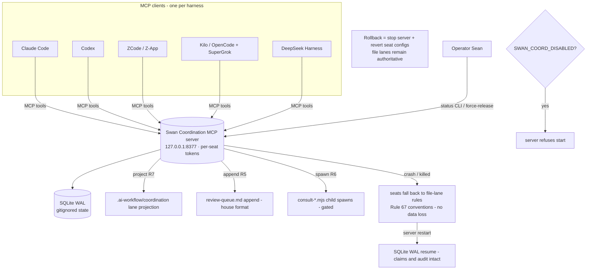
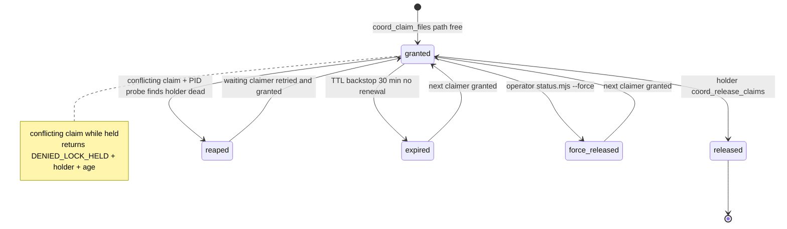
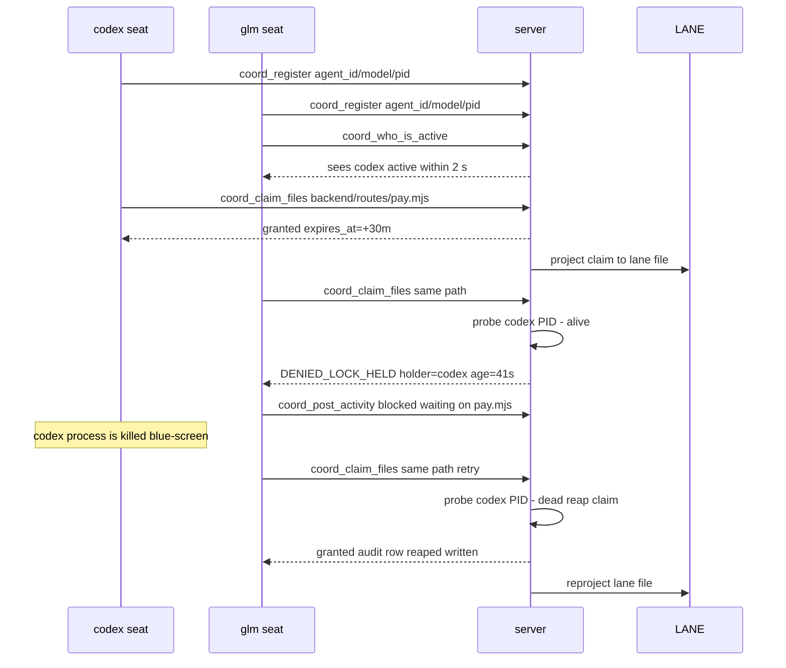
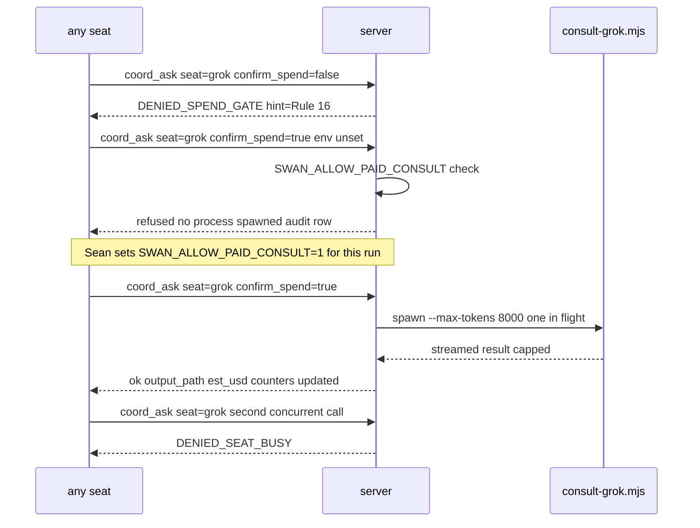

# 04 — Flowcharts, state and sequence diagrams (Mermaid)

> Rendering disclosure: authored as source only in this planning session — no
> local Mermaid renderer was invoked (disclosed per protocol). Builder task
> S7/B-V4: render with pinned Mermaid and commit `diagrams.html` alongside,
> following the `agent-ready-workout-planner-2026-09-06` packet precedent.
> All paths shown: happy, blocked/denied, error, retry, recovery, rollback.

## 4.1 System context (incl. degrade + kill switch + rollback)

## 4.2 Claim state machine (R2/R3)

## 4.3 Sequence — claim conflict, denial, dead-holder recovery (R1–R3, R7)

## 4.4 Sequence — gated cross-model consult (R6, Rule 16)

