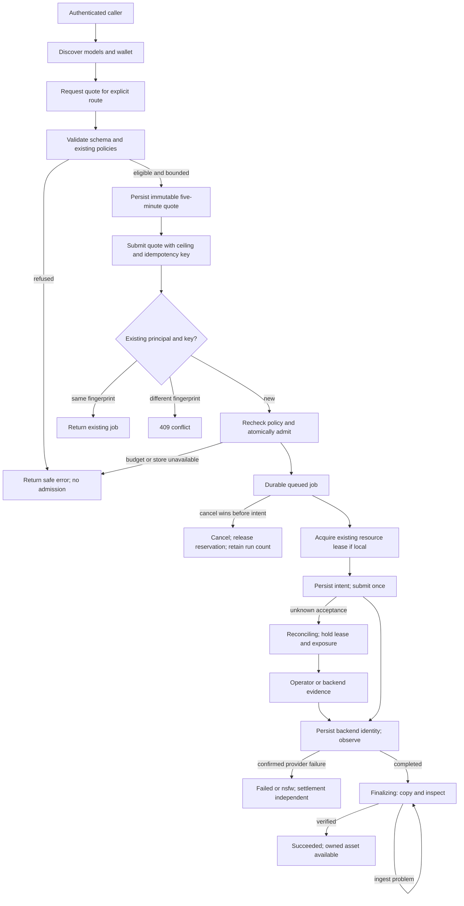
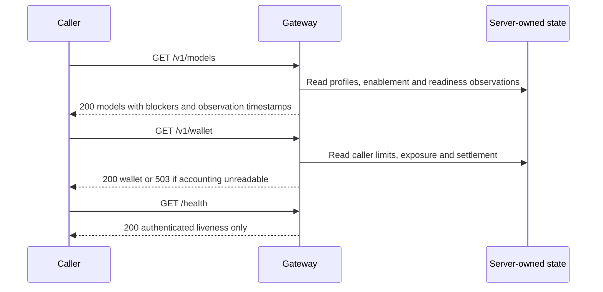
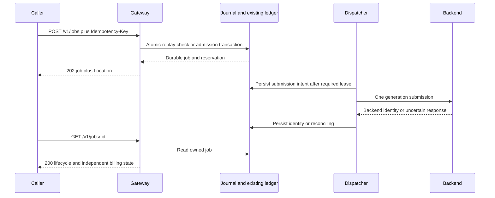
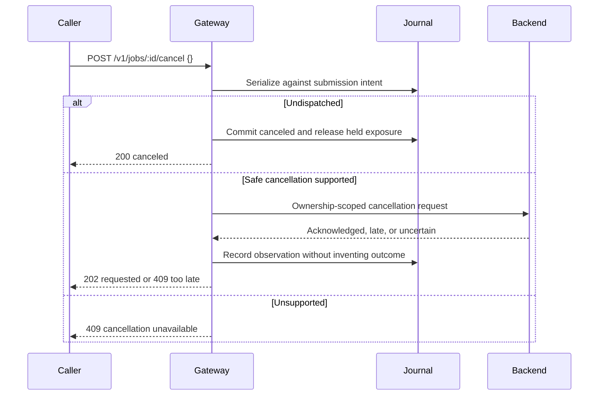
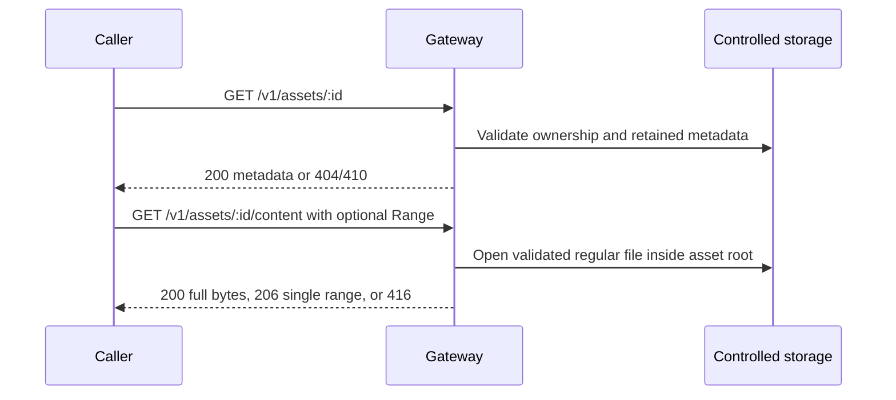
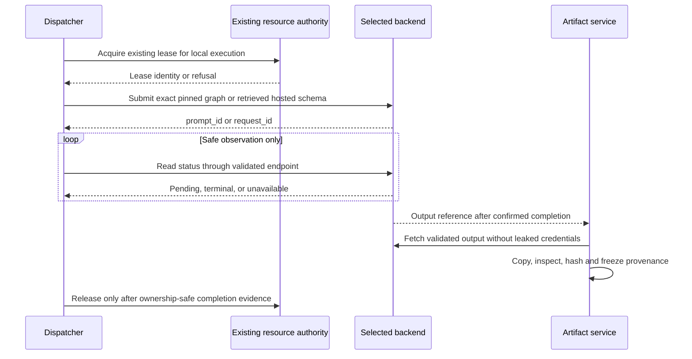
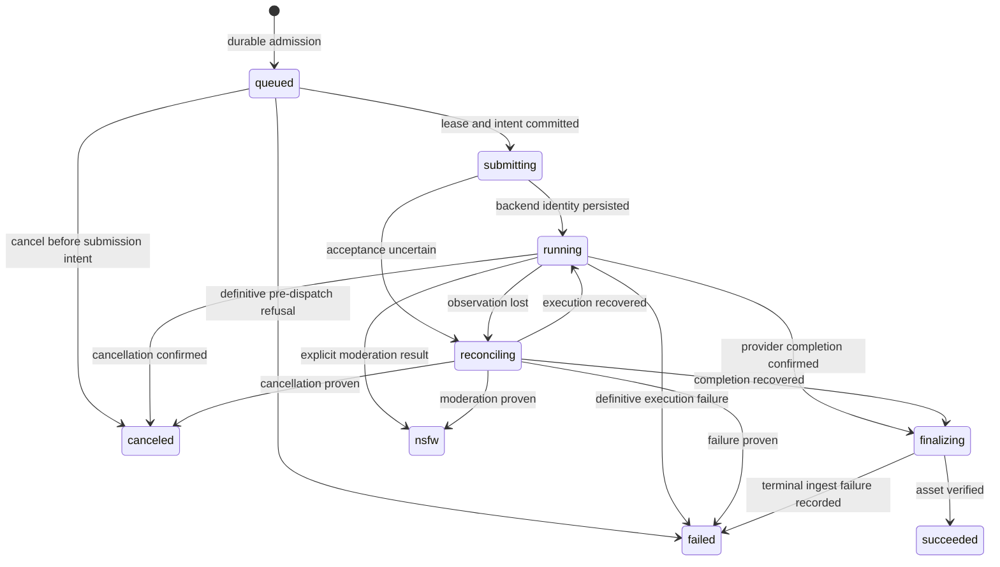
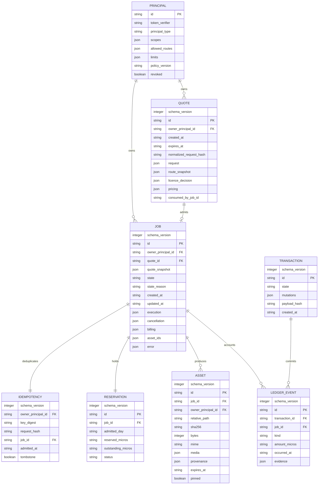

# Astra Reply — subscription transport — 2026-09-19T23:20:12.711Z

**Provider:** openai-codex
**Billing:** chatgpt-subscription
**Authentication:** chatgpt_subscription
**Transport:** codex-cli
**Requested model:** gpt-6-astra
**Served model:** unknown
**Tokens:** in=977581 out=16607
**Packet:** `C:/tmp/ss-media-api/docs/ai-workflow/blueprints/swan-media-api-2026-09-18/ASTRA-MEGA-PACKET.md`
**Wall:** 542.6s
**Mega Blueprint:** ARMED (remit, document)

> Marginal cost $0 — this leg rides the ChatGPT subscription, not OpenRouter.

---
Mega Blueprint. I’ll check the required skill, lane identity, and review archive before drafting the package. I’ll keep provider execution disabled and distinguish recorded evidence from checks performed in this pass.

I found and loaded the `fable-blueprint-forge` skill. The lane matches `90f8e34ed`; the packet file is untracked. Archive lookup through Node failed with “Access is denied,” so I’ll read the index directly. This session is read-only: I can emit the package, but cannot file the review in `Z:\HostileReviews` or claim archive completion.

Two claims need correction beyond the ledger’s conceded gaps: “loopback only” has an environment override that permits other bind addresses, and `/v1/models` marks an enabled local row runnable without checking its executable binding. The “Next” instruction also switches Slice 1 from the adjudicated Wan workflow to H3 and omits the required restart proof. I’ll make those boundaries explicit in the revised package.

## PART A — HOSTILE REVIEW

**Assessment: DEFECTS FOUND. Implementation advancement remains blocked.**

Reviewed the supplied packet, prior adjudication, selected ledger sections, and targeted source files in `C:/tmp/ss-media-api`. Verified HEAD as `90f8e34ed228fbe207dcdfdbcf12c4003c037e0d`, branch `feat/media-api-2026-09-18`. The packet file is untracked; the working tree is therefore not entirely clean.

The recorded **29 gates / 1097 assertions** remain historical evidence supplied by the lane. They were not rerun here. Node execution and the continuity-count command failed with `Access is denied`. No provider was enabled, no service started, and no files changed.

Read the existing archive entry `2026-09-19-160803-swan-media-api-lane-round-23-the-queue.md`. Its settled completion-module findings are not presented as new discoveries. README lines 537–1037 remain outside this review.

**Archive status: BLOCKED.** This session permits reads only. The required filing to `Z:\HostileReviews` and reindexing could not be performed; this response is an unfiled review draft, not a completed Rule 86 archive receipt.

**A1 — Existing blueprints and ledger**

| ID | Severity | Evidence | Finding and concrete fix |
|---|---|---|---|
| A1-01 | High | `ASTRA-PRO-REPLY.md#D-G`; `README.md#Next` | The authoritative Slice 1 requires the audited **Wan** workflow and restart reconciliation. “Next” substitutes **H3** and calls the remaining work a configuration exercise. That contradicts the chosen entry gate and understates admitted recovery gaps. **Fix:** retain Wan as the Slice 1 target, require the entire original exit, and block if its actual graph or resource authority is unavailable. H3 substitution requires a separate explicit plan amendment. |
| A1-02 | High | `server.mjs:69–76`; `ASTRA-PRO-REPLY.md#D-D` | The claimed loopback invariant contains `SWAN_MEDIA_API_ALLOW_NON_LOOPBACK=1`, which bypasses refusal. This is an enforceable exception to a non-negotiable prohibition, not merely missing live listener evidence. **Fix:** remove the exception; reject non-loopback addresses even when the legacy variable is set. Accept literal loopback addresses only. |
| A1-03 | High | `routesCatalog.mjs:67`; `README.md#The flow, demonstrated over a real socket`; `ASTRA-PRO-REPLY.md#D-H/CAP-001` | `runnable: on && caps.transport === 'comfyui'` equates enablement and transport identity with readiness. It does not establish the graph, bindings, licence context, resource authority, or backend observation. The conceded absence of a live GPU test does not fully disclose this affirmative API claim. **Fix:** derive readiness from a timestamped, profile-bound observation; missing evidence yields `runnable:false` and explicit blockers. |
| A1-04 | High | `store.mjs:79`; `store.mjs:102–108`; `README.md#NOT proven/11`; `ASTRA-PRO-REPLY.md#D-E` | The recovery concession is incomplete. Valid JSON with an invalid collection shape becomes an empty store, and retention prunes by count without preserving nonterminal jobs. Recovery cannot reconcile records already discarded. **Fix:** validate schema and every record; block on malformed state; never count-prune unresolved jobs, reservations, leases, or idempotency references. |
| A1-05 | High | `server.mjs#handle`, idempotency lookup and subsequent `jobs.update`; `ASTRA-PRO-REPLY.md#D-A,D-E` | “Same key, same job” is weaker than the specified durable admission contract. The lookup does not compare request fingerprints, and the idempotency key is attached after job creation and runner invocation. **Fix:** atomically persist principal, key digest, request fingerprint, quote consumption, job, and reservation before dispatch eligibility. Different payload under the same key returns `409`. |
| A1-06 | High | `README.md#NOT proven/5,6,21`; `generateVideo.mjs:199,207`; `ASTRA-PRO-REPLY.md#D-C` | The ledger concedes post-success accounting, then calls not counting failed free renders “correct” and quote reuse “safe” because daily caps bind. Those conclusions contradict **admitted-run** accounting and overlook overlapping admissions. Zero provider charge does not mean zero volume consumption. **Fix:** charge run volume at durable admission for every lane; retain the charge on failure/cancellation; reserve atomically before dispatch. |
| A1-07 | High | `ASTRA-PRO-REPLY.md#D-G`; `README.md#Next` | Slice 1 requires durable restart/lease recovery, while Slice 2 postpones the mechanisms needed to provide it. The build dependency is circular. **Fix:** place the minimum admission journal, lifecycle adapter seam, and lease recovery inside Slice 1; retain exhaustive crash and concurrency hardening in Slice 2. Slice numbers and live authorization gates remain unchanged. |
| A1-08 | Medium | `README.md#The headline number`; `ASTRA-PRO-REPLY.md#D-B,D-C` | “Local MiniMax H3 @ 6s: $0.00” reinstates a duration the graph cannot promise and implies equivalence the adjudication expressly rejected. **Fix:** state “hosted six-second arithmetic at the supplied published rate: $0.78; audited local execution: zero provider/API charge, output duration profile-bound and measured afterward.” |
| A1-09 | Medium | `routes.mjs:63–69`; `ASTRA-PRO-REPLY.md#D-A,D-E` | A quote always records `grant_recorded:false`, even though resolution reads configured grants. This is not an honest snapshot when a grant actually authorized admission. **Fix:** return the authoritative licence decision from the existing gate and snapshot its evidence reference; never infer a grant, and never hardcode its absence. |
| A1-10 | Medium | `routesCatalog.mjs:168`; `ASTRA-PRO-REPLY.md#D-F` | The estimate caveat says published-rate arithmetic “bounds exposure,” although the packet lacks the billable-quantity and maximum-charge contract. The NOT-proven list does not cure an affirmative wire claim. **Fix:** expose `charge_bound_verified:false`; use exact copy stating that arithmetic neither authorizes execution nor establishes a maximum charge. |
| A1-11 | Medium | `ASTRA-PRO-REPLY.md#D-A,D-E` | The adjudication accepts server-owned image/preview asset IDs but supplies no ingress or approval contract. It also expires idempotency records after 90 days while forbidding expired-key reuse indefinitely. Both leave consequential builder choices. **Fix:** initially accept only qualifying existing gateway assets; explicitly block external image ingestion. Retain compact idempotency tombstones beyond full-job retention. |
| A1-12 | Medium | `README.md#Readiness receipt`, `#Re-verified from the patch`, `#NOT proven/25` | The stale patch is already conceded; the remaining defect is that authoritative-looking present-tense patch receipts survive beside the concession. Arithmetic consistency cannot establish execution against a particular artifact. **Fix:** make the commit the sole current handover identity; label patch receipts historical/unreproduced and attach future test results to commit, dirty diff, command, environment, and exit status. |

The other conceded gaps remain open requirements, **not new findings**: hosted schemas and licence evidence, reservation accounting, float bridging, caller identity, range responses, cancellation reachability, provenance execution identity, GPU retries, artifact-origin controls, short-secret handling, and absent live verification.

Their dispositions are explicit below. “Disclosed” does not mean “accepted for enablement.”

**A2 — One review of the draft package**

The draft was reviewed once. These changes are incorporated in Part B:

| ID | Draft defect | Correction incorporated |
|---|---|---|
| A2-01 | “Single writer” could be mistaken for a second GPU lock. | Separate gateway persistence ownership from the existing GPU resource authority; forbid a replacement GPU lock. |
| A2-02 | Single-use quotes would reject legitimate same-key retries. | Resolve authenticated idempotency replay before quote consumption/expiry checks; changed payload still conflicts. |
| A2-03 | A successful artifact could be withheld indefinitely by pending vendor settlement. | Keep execution state and settlement state independent; success requires verified assets, not a fabricated settled charge. |
| A2-04 | New schema restoration could duplicate an ambiguous submission. | Rollback stops dispatch and preserves unresolved exposure; never restore an old snapshot as authority over later submissions. |
| A2-05 | Named future test files could be mistaken for existing runnable evidence. | Mark future suites **TO IMPLEMENT / NOT RUN**; supply a standalone executable snapshot audit separately. |
| A2-06 | Generic download retry could fetch a new target after a redirect. | Disable automatic redirects; independently validate each allowed hop, resolved address, and destination policy. Unknown CDN contracts block hosted ingestion. |
| A2-07 | A clock reset could make a used spending period look fresh. | Persist accounting-day progression; clock rollback blocks new admissions until reconciled. |
| A2-08 | Live verification looked like the next executable command. | No live command is supplied or invoked without the operator’s explicit authorization and a bounded run manifest. |

## PART B — FORGED PACKAGE

### 00-README.md

**Artifact:** Swan Media API blueprint revision 2  
**Baseline:** `90f8e34ed228fbe207dcdfdbcf12c4003c037e0d`  
**Owner:** Sean  
**Status:** UPDATED PLAN; implementation and archive gates remain BLOCKED.

This package carries forward the prior adjudication’s neutral asynchronous API, explicit provider identity, server-owned allowances, durable jobs, truthful settlement, and five slices. It repairs contradictory execution instructions and specifies missing boundaries. It does not enable execution.

**Canonical placement**

Use the existing directory:

```text
docs/ai-workflow/blueprints/swan-media-api-2026-09-18/
```

Preserve `PACKET.md`, `ASTRA-PRO-REPLY.md`, and the existing README as historical evidence. The nine numbered documents become the revised implementation package after being saved and checkpointed. Do not create a competing blueprint directory.

The documents are emitted here but have **not** been saved. Preservation hashes, splitter validation, secret scan, archive filing, and readiness-tool execution remain NOT RUN.

**Outcome**

An authenticated caller can discover eligible routes, obtain an immutable quote, admit one durable job, observe truthful execution, and retrieve verified media. Local and hosted execution retain their distinct duration, licence, resource, billing, and cancellation semantics.

**Non-goals**

No frontend, MiniSwan generation worker, production deployment, external image upload API, arbitrary graph API, vendor proxy, automatic fallback, predictive GPU-time guarantee, or provider enablement.

| Requirement | Measurable acceptance | Owner/component | Tests |
|---|---|---|---|
| R1 — Explicit execution identity | Every admitted job pins provider, profile/schema, policy and quote hashes | Registry, profiles, admission | ROUTE-001, CAP-001 |
| R2 — Strict authenticated API | Invalid shape/auth refuses before any admission or backend request | HTTP, auth, contracts | API-001, AUTH-001/002 |
| R3 — Policy preservation | Licence, prompt, preview and graph gates remain authoritative | Existing policy modules | LIC-001, GRAPH-001, REG-001 |
| R4 — Bounded admission | Atomic run count and integer-money reservation precede dispatch | Existing ledger extended | PAY-001/002, PRICE-001 |
| R5 — Durable lifecycle | Restart never invents failure or repeats uncertain submission | Store, journal, dispatcher | JOB-001/002/003, STORE-001 |
| R6 — Controlled artifacts | Success means copied, hashed, inspected, owned asset with provenance | Artifact service | ASSET-001, DUR-002 |
| R7 — Exposure boundary | Literal loopback only; no configuration escape hatch | Server configuration | NET-001 |
| R8 — Honest evidence | Claims identify observed, published, synthetic and unproven facts | Catalogue, receipts | CAP-001, EVID-001 |

**Builder contract**

Follow the package’s decisions. Build one bounded sub-slice at a time. Return its exact diff and acceptance evidence for checkpoint review. Where a consequential dependency is unavailable, record BLOCKED rather than inventing it. Never convert a mock result into live proof.

**Current receipt**

- VERIFIED: baseline commit and branch; targeted static source evidence.
- RECORDED, NOT RERUN: 29 gates / 1097 assertions.
- BLOCKED: real Slice 1 execution, resource-policy integration identification, Windows crash proof, hosted contract/enablement, archive filing.
- NOT RUN: new tests, rendered-diagram validation, secret scan, structural readiness check.
- N/A: frontend wireframes, UI accessibility matrix, Sequelize migration.
- No files, screenshots, or temporary artifacts created in this pass.

### 01-architecture.md

**Mounted entry and ownership**

The service is a standalone Node HTTP gateway, not a React or production Express route:

```text
media-api/server.mjs
  buildServer() / start()
    → media-api/router.mjs::matchRoute(method, path)
      → media-api/routes.mjs
      → media-api/routesCatalog.mjs
    → backend/scripts/handlers/generateVideo.mjs
      → existing registry, policy, ceilings, adapters, provenance
```

Verified current route declarations are in `router.mjs`. The current detached runner is at `server.mjs:109–138`. The updated architecture replaces immediate dispatch with durable admission and a scheduler; it does not create another policy engine.

**Authority boundaries**

| Authority | Responsibility |
|---|---|
| Existing registry/licence/prompt modules | Decide provider eligibility and input policy |
| Profile registry | Pin graph, bindings, schema and measured configuration |
| Existing spend ledger, extended | Sole monetary and admitted-volume authority |
| Existing worker resource policy | Sole GPU lease authority |
| Gateway writer/journal | Serialize and recover persistence; grants no GPU authority |
| Backend adapter | Submit once, expose backend identity, observe, cancel where safe |
| Artifact service | Copy, inspect, hash and publish controlled media |
| Sean | Enablement, runtime approval, credentials and spending authorization |

The exact `worker-resource-policy.mjs` implementation and callable lease interface were not established in this checkout during this pass. **Integration is BLOCKED until its actual file, exports, ownership and recovery behavior are captured.** Do not satisfy this dependency with a new lock.

**Route identity**

Provider-qualified identities remain authoritative. Model-only quoting requires exactly one server-pinned routing profile; otherwise return `409 E_ROUTE_SELECTION_REQUIRED`. No cheapest-provider search or silent fallback.

Local profiles contain immutable graph and binding hashes. H3 seconds remain unsupported. Wan Slice 1 requires the actual audited graph corresponding to the recorded configuration; its proposed profile identifier does not prove that graph exists.

**User and subsystem flow**



**Discovery APIs — separate read-only interactions**



**Estimate and quote interactions**

```mermaid
sequenceDiagram
    participant C as Caller
    participant G as Gateway
    participant P as Existing policy
    participant S as Store
    C->>G: POST /v1/estimate
    G->>P: Validate identity and arithmetic inputs
    G-->>C: 200 arithmetic; admissible false; no charge bound implied
    C->>G: POST /v1/quotes
    G->>P: Resolve pinned route; evaluate all quote gates
    alt Ineligible or unbounded
        G-->>C: 4xx refusal
    else Eligible
        G->>S: Persist quote snapshot
        G-->>C: 201 quote
    end
```

**Admission and polling**



**Cancellation**



**Asset APIs**



**Backend interactions**



Hosted submission details remain unavailable until retrieved. This diagram defines the adapter seam, not an invented vendor request schema.

**Execution state**



An ingest failure preserves `backend_outcome:"completed"` and all financial exposure.

**Logical JSON persistence schema**

These are **new target record fields**, not claimed existing database columns. Nested record types are defined in `03-contracts.md`; no relational database is introduced.



All records reject unknown schema versions and invalid required fields. Nullable fields use explicit `null`, never invented defaults.

### 02-wireframes.md

**N/A — headless HTTP service.** This scope contains no browser pages, desktop screens, 375px mobile screens, palette tokens, navigation, focus behavior, or touch controls. No UI is invented to satisfy the document list.

Caller-visible states are JSON contracts:

| State | Exact safe message |
|---|---|
| Disabled provider | `This provider is disabled.` |
| Missing executable observation | `This execution profile has not been verified as runnable.` |
| Unbound seconds | `This profile does not accept duration in seconds.` |
| Unknown price bound | `A maximum charge has not been established for this request.` |
| Pending reconciliation | `Execution outcome is unknown. The request will not be resubmitted automatically.` |
| Unsupported cancellation | `This job cannot currently be canceled safely.` |
| Quote drift | `The quoted execution contract changed. Request a new quote.` |
| Accounting unavailable | `Accounting state is unavailable. New jobs are blocked.` |
| Arithmetic-only estimate | `Published-rate arithmetic only. This is not a charge bound or permission to execute.` |

Error messages never include prompts, credentials, signed URLs, internal paths, raw backend exceptions, or private operator details.

### 03-contracts.md

**Common types and validation**

```ts
type Micros = string; // canonical nonnegative integer: /^(0|[1-9][0-9]*)$/
type USD = string;    // canonical decimal with exactly six fractional digits
type UTC = string;    // valid UTC ISO-8601 timestamp
type Evidence = "probed" | "published" | "claimed";
type PrincipalType = "human" | "agent" | "service";
type State =
  | "queued" | "submitting" | "running" | "reconciling"
  | "finalizing" | "succeeded" | "failed" | "nsfw" | "canceled";
```

Use `BigInt` for authoritative micro-dollar calculations. Reject malformed, negative, nonfinite, exponential, boolean, array, and overprecision monetary inputs. Do not silently round a maximum charge downward. A contract requiring finer units is unsupported until an explicit precision migration.

All request objects reject unknown fields. JSON body limit remains 262,144 bytes. IDs are server-generated UUIDs; malformed or unauthorized object IDs return `404`. Authenticate before object lookup.

Every JSON response includes `request_id`. Binary responses carry `X-Request-Id`.

**Generation specification**

```json
{
  "route": {
    "provider_model": "comfyui/wan-2.2",
    "execution_profile": "wan22-ti2v5b-832x480-49f-20steps"
  },
  "operation": "text-to-video",
  "input": {
    "prompt": "A paper sailboat crossing a painted sea",
    "seed": 1234
  },
  "output": {
    "duration_mode": "profile"
  },
  "use_context": {
    "commercial": true
  },
  "preview_asset_id": null
}
```

The profile name is reserved pending identification of the actual graph.

Rules:

- Exactly one of `route.provider_model` or `route.model`.
- Local execution requires `execution_profile`.
- `operation`: `text-to-video`, `image-to-video`, or `text-to-image`, additionally capability-gated.
- `seed`: integer `0..4294967295`; absent seed is generated once and persisted in the quote.
- Prompt: nonempty string, at most 8,000 Unicode code points, then existing prompt policy.
- `input.image_asset_id` is required only for image-conditioned operations.
- `duration_mode:"profile"` forbids `duration_seconds`.
- `duration_mode:"seconds"` requires a finite positive number accepted by the retrieved route schema.
- No generic width/height/tuning passthrough in this revision.
- Commercial context can become stricter server-side, never weaker.
- Preview and input assets must belong to the principal, remain available, and satisfy the existing content/preview policy.
- No upload route is added. Missing qualifying assets block the operation. A generated image is not automatically an approved preview.

**REST contract**

All routes require a nonrevoked per-principal bearer credential.

| Endpoint | Scope | Request | Success |
|---|---|---|---|
| `GET /health` | Any valid principal | None | `200 {ok:true, request_id}`; liveness only |
| `GET /v1/models` | `models:read` | None | `200 {models:Model[], request_id}` |
| `POST /v1/estimate` | `models:read` | Generation specification | `200 {estimate:Estimate, request_id}`; no quote/reservation |
| `POST /v1/quotes` | `quotes:create` | Generation specification | `201 {quote:Quote, request_id}` |
| `POST /v1/jobs` | `jobs:create` | `{quote_id,max_cost_usd}` and `Idempotency-Key` | `202 {job:Job,request_id}`, `Location` |
| `GET /v1/jobs/:id` | `jobs:read` | None | `200 {job:Job,request_id}` |
| `POST /v1/jobs/:id/cancel` | `jobs:cancel` | `{}` | `200` canceled/already canceled; `202` cancellation requested |
| `GET /v1/assets/:id` | `assets:read` | None | `200 {asset:Asset,request_id}` |
| `GET /v1/assets/:id/content` | `assets:read` | Optional single byte range | `200` or `206` binary |
| `GET /v1/wallet` | `wallet:read` | None | `200 {wallet:Wallet,request_id}` |

`max_cost_usd` is required even for local execution; use `"0.000000"`.

`Idempotency-Key` is 16–128 printable ASCII characters. Persist its digest, principal, and canonical fingerprint of `{quote_id,max_cost_usd}`. Same principal/key/fingerprint returns the existing job without new accounting. A changed fingerprint returns `409 E_IDEMPOTENCY_CONFLICT`.

Quotes are single-use for **new** admissions. Same-key replay remains valid after quote consumption or expiry. Different key against consumed quote returns `409 E_QUOTE_USED`.

**Response record definitions**

```ts
type Model = {
  id: string;
  model_family: string;
  model_version: string | null;
  enabled: boolean;
  capabilities: Record<string, {
    value: unknown | null; provenance: Evidence; source_ref: string | null
  }>;
  readiness: {
    runnable: boolean;
    profile_hash: string | null;
    observed_at: UTC | null;
    blockers: string[];
  };
};

type Pricing = {
  currency: "USD";
  basis: "none" | "output_second" | "generation" | "image";
  rate_usd: USD | null;
  rate_provenance: Evidence | null;
  rate_source: string | null;
  rate_checked_at: UTC | null;
  price_version: string | null;
  billable_quantity: number | null;
  estimated_micros: Micros | null;
  reservation_micros: Micros | null;
  estimated_usd: USD | null;
  reservation_usd: USD | null;
  charge_bound_verified: boolean;
  bound_basis: object | null;
};

type Estimate = {
  selected_route: string;
  pricing: Pricing;
  admissible: false;
  message: string;
};

type Quote = {
  id: string;
  created_at: UTC;
  expires_at: UTC;
  normalized_request_hash: string;
  selected_route: string;
  execution_profile_hash: string | null;
  hosted_schema_hash: string | null;
  requested_output: object;
  duration_binding: "profile" | "seconds";
  licence_decision: {
    allowed: true;
    policy_version: string;
    grant_recorded: boolean;
    grant_evidence_ref: string | null;
  };
  capability_evidence: object;
  pricing: Pricing;
  cancellation: { supported_now: boolean; reason: string };
  requirements: string[];
};

type Billing = {
  estimated_micros: Micros;
  reserved_micros: Micros;
  vendor_reported_gross_micros: Micros | null;
  vendor_reported_refund_micros: Micros | null;
  settled_net_micros: Micros | null;
  settlement_status: "pending" | "reconciled" | "disputed";
  settlement_evidence: object[];
};

type Job = {
  id: string;
  state: State;
  state_reason: string | null;
  created_at: UTC;
  updated_at: UTC;
  selected_route: string;
  execution_profile: string | null;
  requested_output: object;
  execution: {
    kind: "local_gpu" | "hosted";
    backend_outcome: "unknown" | "running" | "completed" | "failed" | "nsfw" | "canceled";
    gpu_occupancy_seconds: number | null;
    render_wall_seconds: number | null;
    model_version: string | null;
    model_version_provenance: "declared" | "observed" | null;
    graph_hash: string | null;
  };
  billing: Billing;
  cancellation: {
    supported_now: boolean;
    requested_at: UTC | null;
    effective_at: UTC | null;
    reason: string;
  };
  assets: string[];
  error: { code: string; message: string; retryable: false } | null;
};

type Asset = {
  id: string;
  job_id: string;
  sha256: string;
  bytes: number;
  mime: string;
  media: {
    duration_seconds: number | null;
    width: number | null;
    height: number | null;
    frame_count: number | null;
  };
  provenance: object;
  expires_at: UTC | null;
};

type Wallet = {
  day: string;
  admitted_runs: number;
  limits: object;
  reserved_micros: Micros;
  unresolved_exposure_micros: Micros;
  settled_net_today_micros: Micros;
  available_micros: Micros | null;
  gpu_occupancy_seconds: number | null;
  gpu_budget_enforcement: "metered_only";
  accounting_status: "healthy" | "blocked";
};
```

Public responses exclude backend credentials, vendor URLs, internal filesystem paths, and raw prompts. Existing provenance may retain bounded prompt text internally under its existing commitment; public projection returns the prompt hash rather than that text.

**Error envelope**

```json
{
  "error": {
    "code": "E_DURATION_UNBOUND",
    "message": "This profile does not accept duration in seconds.",
    "retryable": false,
    "details": {}
  },
  "request_id": "server-generated-id"
}
```

| Status | Codes |
|---|---|
| 400 | `E_BAD_JSON`, `E_NO_IDEMPOTENCY_KEY` |
| 401 | `E_UNAUTHORIZED` |
| 403 | `E_SCOPE_DENIED`, existing licence refusals, `E_PROVIDER_DISABLED`, `E_PREVIEW_REQUIRED`, `E_BUDGET_EXCEEDED` |
| 404 | `E_NO_ROUTE`, `E_OBJECT_NOT_FOUND` |
| 409 | `E_ROUTE_SELECTION_REQUIRED`, `E_QUOTE_CHANGED`, `E_QUOTE_USED`, `E_IDEMPOTENCY_CONFLICT`, `E_CANCEL_TOO_LATE`, `E_CANCEL_UNAVAILABLE` |
| 410 | `E_QUOTE_EXPIRED`, `E_ARTIFACT_EXPIRED`, `E_IDEMPOTENCY_EXPIRED` |
| 413 | `E_BODY_TOO_LARGE`, `E_INPUT_TOO_LARGE` |
| 416 | `E_RANGE_UNSATISFIABLE` |
| 422 | `E_INVALID_REQUEST`, `E_CAPABILITY_UNSUPPORTED`, `E_DURATION_UNBOUND`, `E_PRICE_UNBOUNDED`, `E_PROFILE_UNVERIFIED` |
| 429 | `E_RUN_LIMIT`, `E_QUEUE_FULL`, `E_RATE_LIMIT` |
| 503 | `E_STORE_UNAVAILABLE`, `E_ACCOUNTING_UNAVAILABLE`, `E_RESOURCE_UNAVAILABLE` |

Preserve existing named licence codes and map them consistently. Adapter failure after admission appears in the job returned by `GET`, not as a replacement HTTP status for the earlier `202`.

**Money and volume**

- Defaults: zero paid allowance; 50 admitted jobs per UTC day.
- Principal-specific limits may only narrow global limits.
- Atomic admission increments volume and reserves the documented maximum charge.
- Failed and canceled admitted jobs retain volume consumption.
- Idempotent replays consume nothing.
- Free local execution reserves zero USD, but still consumes volume and exclusive GPU occupancy.
- All unresolved reservations count across midnight.
- UTC clock rollback blocks new admissions; it cannot reopen a spending period.
- Separate lifetime funding exposure prevents midnight from creating credit.
- Unknown price or maximum quantity means no quote.
- Failed or `nsfw` status alone never releases paid exposure.
- Settlement records gross, refund, and net independently with evidence.
- Charges above reservation are recorded in full and stop further paid admission.
- GPU occupancy is nullable until measured; `metered_only` is not evidence that a measurement exists.

The supplied `$0.13 × 6 = $0.78` remains published-rate arithmetic, not a verified endpoint capability, charge cap, or invoice.

**Persistence and recovery**

Use a required OS-restricted state root outside the checkout. Extend the existing ledger; the journal is recovery machinery, not another monetary authority.

Admission transaction:

1. Validate authenticated identity and immutable request.
2. Resolve replay/conflict.
3. Revalidate quote, licence, preview, profile/schema, pricing and limits.
4. Prepare one journal transaction for quote consumption, job, idempotency, run volume and reservation.
5. Durably write and flush prepared intent.
6. Apply idempotent record updates and flush.
7. Commit transaction.
8. Only then make the job dispatchable and return `202`.

Startup blocks dispatch until journal recovery, accounting validation, and resource ownership reconciliation finish. Process locks must not be removed solely because a PID appears stale.

Submission requires a separate persisted attempt identity. If backend acceptance is uncertain, retain `reconciling`; never issue another generation POST automatically.

**Retention**

- Unresolved jobs, reservations, leases and journals: no automatic purge.
- Terminal jobs: 90 days.
- Assets: 30 days unless pinned.
- Ledger events: at least 365 days, plus any unresolved dependencies.
- Provenance: at least asset lifetime and longer if the existing licensor commitment requires it.
- Idempotency tombstones: retained indefinitely; at capacity, refuse new admissions rather than discard replay protection.
- Expired owned assets: `410`; foreign or unknown IDs: `404`.

**Migration and rollback**

Legacy stores are imported read-only first. Produce a migration report and preserve original bytes/hashes.

- Unknown legacy execution becomes `reconciling`.
- Unknown historical charge remains unknown.
- Legacy monetary values must be exactly representable on the target micro-dollar grid; otherwise block migration.
- Missing legacy caller attribution is not assigned to a fabricated principal.
- No automatic deletion or “start fresh” repair.
- Rollback stops dispatch, preserves all current journals and unresolved exposure, and restores code separately from state.
- Never restore pre-submission accounting over later external execution.
- No production DB migration is required.

**Configuration**

Existing variables remain recognizable, but the target configuration is stricter:

| Variable | Target handling |
|---|---|
| `SWAN_MEDIA_API_HOST` | Only `127.0.0.1` or explicitly configured `::1` |
| `SWAN_MEDIA_API_PORT` | Integer `1..65535`; default 8788 |
| `SWAN_MEDIA_API_ALLOW_NON_LOOPBACK` | Rejected when set; cannot relax binding |
| `SWAN_MEDIA_API_STATE_DIR` | New required absolute path outside checkout |
| `SWAN_MEDIA_API_PRINCIPALS_FILE` | New restricted credential-verifier/policy file |
| `SWAN_MEDIA_API_TOKEN` | Legacy only; no shared-owner fallback in target auth |
| `SWAN_VIDEO_PROVIDERS_ENABLED` | Empty by default; configuration alone cannot bypass readiness |
| Existing global/per-caller caps | Parsed into integer authority; invalid values block startup |
| Existing ComfyUI graph/binding variables | Must match pinned profile; duration stays unbound for H3 |
| Higgsfield credentials | Unprovisioned; never required for offline tests |

No environment values or credentials belong in the package.

**Asset and network rules**

- Local artifact path must resolve inside the configured output root and be a regular file; reject traversal and links escaping the root.
- Hosted downloads require a retrieved destination policy, public-address validation, bounded bytes, TLS, redirect revalidation, and no vendor authorization header on CDN requests.
- No guessed CDN allowlist.
- Default maximum artifact size: 512 MiB; larger supported media requires an explicit profile amendment.
- Single byte-range support only; malformed/multiple ranges return `416`.
- Verify media with local inspection before publication; filename extension alone is insufficient.
- Poll retry is observation only. Submission retry is forbidden.
- Stop polling is not cancellation.

**New adapter seam**

```ts
interface LifecycleAdapter {
  inspect(profile: object): Promise<object>; // no generation
  submitOnce(attempt: object): Promise<
    | { kind: "accepted"; backend_id: string; evidence: object }
    | { kind: "rejected"; error: object }
    | { kind: "uncertain"; evidence: object }
  >;
  observe(backendId: string, binding: object): Promise<object>;
  cancelOwned(backendId: string, ownership: object): Promise<object>;
}
```

Preserve the current `generate()` compatibility export for existing callers. The gateway must use lifecycle operations so backend identity is persisted before completion. Compatibility callers must not become a reservation bypass.

### 04-build-order.md

**Order is by dependency, within the original five slices.** All new source files have a maximum budget of 300 lines. Extract by responsibility before exceeding it.

| Order / slice | File | Purpose and interface | Imports/pattern |
|---|---|---|---|
| 1 / 1A | Existing blueprint README and numbered documents | Correct authority, evidence labels and stop gates | Preserve historical originals |
| 2 / 1A | `media-api/contracts.mjs` | `parseGeneration(body)`, `parseAdmission(body)`, `canonicalHash(value)` | Existing strict HTTP object checks; reject unknown keys |
| 3 / 1A | `media-api/server.mjs` | Remove bind escape hatch; retain `buildServer`, `start`, `readServerConfig` | Existing Node HTTP surface |
| 4 / 1A | `media-api/profiles.mjs` | `resolveProfile(id)`, `inspectProfile(profile, deps)` | Existing graph inspection, registry and catalogue |
| 5 / 1A | `media-api/routesCatalog.mjs` | Timestamped readiness and arithmetic-only estimates | Existing `capabilities()` and shared evidence predicates |
| 6 / 1A | `media-api/auth.mjs` | `authenticate(req, principals)`, `requireScope(principal, scope)` | Existing constant-time primitive; OS-restricted verifiers |
| 7 / 1B | `media-api/storeSchema.mjs` | `validateRecord(kind, value)` | Strict explicit schema versions; no malformed-to-empty fallback |
| 8 / 1B | `media-api/store.mjs` | Preserve store exports; validated records and retention | Existing injected-I/O testing seam |
| 9 / 1B | `media-api/journal.mjs` | `transact(mutations)`, `recover()` | Single durable writer; idempotent replay |
| 10 / 1B | `shared/providers/video/usageLedger.mjs` | Extend existing persistence with reservations/events | No second ledger |
| 11 / 1B | `shared/providers/video/spendGuard.mjs` | Integer atomic admission judgment | Existing global authority |
| 12 / 1B | `media-api/admission.mjs` | `admit({principal,key,body,now})` | Contracts, quotes, journal and existing guards |
| 13 / 1B | `media-api/dispatcher.mjs` | `dispatchNext()`, `recoverExecution(job)` | Existing resource authority; lifecycle adapters |
| 14 / 1B | `shared/providers/video/comfyuiLocal.mjs` | Add lifecycle exports; preserve compatibility API | Existing graph and history modules |
| 15 / 1B | `backend/scripts/handlers/generateVideo.mjs` | Preserve shared policy/provenance; prevent accounting bypass | Existing adapters and ceilings |
| 16 / 1B | `media-api/artifacts.mjs` | `ingest(job, output)`, `openOwnedAsset(...)` | Existing provenance and checksum behavior |
| 17 / 1B | `media-api/routes.mjs`, `router.mjs`, `wire.mjs` | Mount strict contracts and public projections | Existing pure route table |
| 18 / 1C | `media-api/local-live.acceptance.mjs` | Authorized real Wan lifecycle/restart receipt | Actual existing graph; no synthetic substitute |
| 19 / 2 | Store, dispatcher, artifact and auth tests | Exhaustive crash, race, range and isolation coverage | Isolated temporary state; injected transports |
| 20 / 3 | `higgsfield.mjs`, `higgsfieldTransport.mjs`, disabled hosted data | Retrieved-contract-only lifecycle implementation | No guessed path or live call |
| 21 / 3 | `media-api/hostedContracts.mjs` | `validateHostedContract(record)` | Eight enablement prerequisites |
| 22 / 4 | Authorized verification harness | One separately approved hosted execution | Remains unbuilt/disabled pending authorization |
| 23 / 5 | `media-api/routingProfiles.mjs`, `recovery.mjs` | Pinned model routing and evidence-backed operator recovery | Existing identity/policy authority |

Example patterns already present and retained:

```js
// router.mjs: explicit method/path table, not a generic vendor proxy
if (method === 'POST' && path === '/v1/quotes') {
  return { handler: createQuote };
}
```

```js
// store.mjs: retain dependency injection, strengthen validation/durability
export function makeJobStore(path, {
  fs: io = defaultIo,
  maxJobs = DEFAULT_MAX_JOBS,
  now = () => new Date(),
} = {}) { /* target implementation */ }
```

The second excerpt is an interface pattern, not implementation supplied by this plan. `maxJobs` must stop admission or prune eligible terminal metadata only; it cannot discard active records.

**Hard dependency:** dispatcher implementation cannot proceed until the existing resource-policy file and recovery contract are identified. That is an explicit blocked integration decision, not delegated permission to invent an API.

### 05-slices.md

**Slice 1 — Local over-wire vertical slice**

Sub-slices preserve the original live exit:

- **1A: Offline contract and truth repairs.** Strict schemas, literal loopback, per-principal authority, honest readiness, profile inspection, corrected receipts.
- **1B: Minimum durable execution.** Journal, atomic admission, lifecycle adapter, existing resource lease integration, artifact ownership, recovery.
- **1C: Authorized real Wan demonstration.** Full quote → admission → actual graph execution → restart reconciliation → verified artifact served through HTTP.

Acceptance:

```text
node --test media-api/tests/api-contract.test.mjs
node --test media-api/tests/readiness.test.mjs
node --test media-api/tests/auth.test.mjs
node --test media-api/tests/admission.test.mjs
node --test media-api/tests/recovery.test.mjs
node --test media-api/tests/artifacts.test.mjs
```

These suites are specified in `09-tests.md` and are **TO IMPLEMENT**, not existing evidence.

Slice 1C requires explicit operator authorization, the actual audited Wan profile, known resource authority, synthetic/nonpersonal input, zero hosted egress, and recorded graph/checkpoint identity. Test the real gateway entry point, not only `buildServer()`.

**STOP:** Slice 1 remains incomplete until API-002, JOB-002 and GPU-001 have real authorized evidence. No ComfyUI start or provider enablement is authorized by this document.

**Slice 2 — Admission and crash hardening**

Entry: full Slice 1 checkpoint.

Scope: every write boundary, concurrency, cross-midnight exposure, clock rollback, corruption, ownership, cancellation races, artifact retention and rollback.

Acceptance:

```text
node --test media-api/tests/store-crash.test.mjs
node --test media-api/tests/accounting.test.mjs
node --test media-api/tests/cancellation.test.mjs
node --test media-api/tests/migration.test.mjs
```

Required evidence includes a Windows process-termination drill. In-memory exceptions alone do not prove filesystem recovery.

**STOP:** No advancement with uncertain lease ownership, lost admission records, or failed reservation recovery.

**Slice 3 — Hosted contract, offline only**

Entry: Slice 2 checkpoint and retrieved, archived model-specific contract evidence.

Scope: disabled catalogue data; exact schema validation; maximum-charge arithmetic; hosted lifecycle fixtures; refunds; redaction; destination policy.

Acceptance:

```text
node --test media-api/tests/hosted-contract.test.mjs
node --test media-api/tests/hosted-lifecycle.test.mjs
node --test media-api/tests/download-policy.test.mjs
```

A partial research result cannot be labeled “mostly done.” Missing model path, licence, charge bound, or accounting source blocks the route.

**STOP:** No real Higgsfield requests, credentials, enabled rows, or invented endpoint/CDN values.

**Slice 4 — Optional owner-authorized hosted verification**

Entry: separate explicit spending approval, securely provisioned credentials, all eight hosted gates, exact request hash, one-call cap, funding cap, no automatic top-up, and no automatic retry.

Exit: one approved execution with retained artifact and independently labeled accounting evidence.

**STOP:** Not authorized. No executable live command is issued here.

**Slice 5 — Explicit routing and operations**

Entry: proven route-specific contracts. A disabled hosted route does not become eligible through a family alias.

Scope: one-target routing profiles, recovery procedures, restore/retention verification and caller-scoped wallet operation.

Acceptance:

```text
node --test media-api/tests/routing.test.mjs
node --test media-api/tests/operations.test.mjs
```

**STOP:** No silent fallback, MiniSwan generation registration, or invented performance promise.

### 06-bans.md

1. Do not enable providers, start ComfyUI, call Higgsfield, or spend under this planning request.
2. Do not alter the 5090 installation, GSQ service on 18082, MiniSwan installation, or their configuration.
3. Do not bind LAN/tailnet addresses. No environment override may relax literal loopback.
4. Do not use paid `partner/` nodes or remove `--disable-api-nodes`.
5. Do not trust node display names. Audit node categories and nested execution dependencies.
6. Do not substitute H3 for the adjudicated Wan Slice 1 profile.
7. Do not map seconds to `length`, `frames`, or `value` by name matching.
8. Do not guess hosted model paths, schemas, licences, CDN origins, charge bounds, or refund interfaces.
9. Do not create a second spending ledger, GPU lock, licence gate, or prompt-policy engine.
10. Do not treat enablement as readiness, published rates as measured cost, or declared model labels as observed weights.
11. Do not resubmit uncertain generation, silently switch providers, or translate polling failure into confirmed execution failure.
12. Do not release uncertain exposure merely because a job failed, expired locally, or stopped being polled.
13. Do not discard active records to satisfy a count cap.
14. Do not erase corrupt state or restore an old wallet over newer external execution.
15. Do not expose credentials, raw prompts, signed URLs, private paths, or backend exception text.
16. Do not use source-string assertions as the sole proof of behavior.
17. Do not claim a new suite exists or passed until its exact file and result are verified.
18. Do not inherit a patch receipt from a different artifact.
19. Do not broad-stage, clean, reset, push, deploy, or edit unrelated shared work.
20. Keep new source files at or below 300 lines. No UI framework or chart library is introduced; UI house rules are N/A because this scope has no UI.

### 07-checkpoints.md

**Checkpoint result:** `PASS`, `REVISE`, or `HALT`, always scoped to an exact slice and immutable source identity.

A checkpoint requires:

1. Commit hash plus dirty diff/hash, if any.
2. Exact files changed and preserved baseline artifacts.
3. Requirement-to-test mapping.
4. Commands, exit status, assertions and environment.
5. Separation of static, synthetic, filesystem, real GPU and live hosted evidence.
6. Confirmation that no prohibited action occurred.
7. Review findings and explicit resolution/blocker for each.
8. Archived review ID and successful archive lookup.
9. Remaining unproven boundaries.
10. The next authorized sub-slice.

A missing archive file prevents a completed hostile-review receipt. A failed test-import/setup command is BLOCKED evidence, not a valid RED regression.

**Review remit**

> Review only the named slice at the recorded commit and dirty-tree hash. Query prior archive findings first. Attack mounted callers, authority boundaries, durable admission, ambiguous submission, resource ownership, public truth and test discrimination. Do not repeat conceded gaps as new findings. For every new finding provide source evidence, reachable consequence, concrete repair and a test that fails without the repair. Do not infer provider or spending authorization.

**Roles**

This package’s A2 is the requested single self-review, not an independent final implementation approval. Preserve the existing final-decider workflow for implementation checkpoints; do not silently replace it with the package author.

**Evidence manifest**

Future receipts must record:

```json
{
  "commit": "full-commit-hash",
  "dirty_diff_sha256": null,
  "command": "exact command",
  "cwd": "exact working directory",
  "started_at": "UTC timestamp",
  "finished_at": "UTC timestamp",
  "exit_code": 0,
  "evidence_kind": "synthetic",
  "provider_requests": 0,
  "gpu_executions": 0,
  "paid_requests": 0,
  "result_artifact_sha256": "hash"
}
```

Use actual observations; do not fill zeros without a transport/process recorder capable of establishing them.

**Operational limits**

- Eight waiting local jobs; one active existing-authority GPU lease.
- Admission refuses when durable state, disk capacity, or accounting is unavailable.
- No render-time SLA.
- Unknown lease duration prevents a guaranteed GPU-time cap.
- Polling uses bounded observation retries; exhaustion enters reconciliation.
- Logs contain allowlisted IDs, transition codes and accounting amounts only.
- Sean owns enablement, unresolved accounting adjudication and operational recovery.

**Current checkpoint**

`HALT` for runtime advancement. The revised documents are emitted, but archive filing, persistence, executable new suites, resource authority binding and live Slice 1 proof remain incomplete.

### 09-tests.md

**Evidence status**

Existing lane suites: **recorded green at baseline; NOT RERUN here**.

New suites below: **TO IMPLEMENT / NOT RUN**. Each named case is an acceptance requirement, not a claim that the file already exists.

Tests use isolated temporary directories, synthetic credentials, explicit injected time and transports that reject unexpected egress. They must never read production DB configuration or ambient provider credentials.

**Executable read-only snapshot audit**

The following complete Node script can run from `C:/tmp/ss-media-api` without starting services or writing state. It checks three narrow source-level contradictions identified in this review. It is **not** a replacement for the behavioral suites.

```js
// snapshot-audit.mjs
import assert from 'node:assert/strict';
import { readFileSync } from 'node:fs';
import { test } from 'node:test';

const read = path => readFileSync(new URL(path, `file://${process.cwd().replaceAll('\\', '/')}/`), 'utf8');

test('NET-001: configuration has no non-loopback override', () => {
  const source = read('media-api/server.mjs');
  assert.equal(
    /if\s*\(\s*!loopback\s*&&\s*!override\s*\)/.test(source),
    false,
    'Non-loopback binding is permitted by an override',
  );
});

test('CAP-001: runnable is not derived only from enablement and transport', () => {
  const source = read('media-api/routesCatalog.mjs');
  assert.equal(
    /runnable:\s*on\s*&&\s*caps\.transport\s*===\s*['"]comfyui['"]/.test(source),
    false,
    'Readiness lacks executable binding evidence',
  );
});

test('STORE-001: malformed collection is not converted to an empty store', () => {
  const source = read('media-api/store.mjs');
  assert.equal(
    /Array\.isArray\(raw\?\.\[key\]\)\s*\?\s*raw\[key\]\s*:\s*\[\]/.test(source),
    false,
    'Valid JSON with an invalid collection shape resets store history',
  );
});
```

Command after saving the supplied script in an authorized test location:

```text
node --test snapshot-audit.mjs
```

Expected baseline result from inspected source: these three assertions fail. **Not executed here.** Passing them after a refactor does not prove the corresponding behavior; the cases below do.

**Behavioral acceptance matrix**

Each command is:

```text
node --test media-api/tests/<file>
```

| File | Named cases / IDs | What must be observed |
|---|---|---|
| `api-contract.test.mjs` | `API-001 malformed JSON`; `unknown nested field`; `duration union`; `missing ceiling`; `request id on errors` | Correct 400/422; zero jobs, reservations and backend requests |
| `readiness.test.mjs` | `CAP-001 enabled but missing graph`; `stale observation`; `claimed capability`; `changed profile hash` | `runnable:false`; capability remains null where claimed; quote refusal |
| `auth.test.mjs` | `AUTH-001 missing invalid revoked`; `foreign job quote asset`; `AUTH-002 forged human and limit fields` | 401/404/422; identity and server allowance unchanged |
| `network.test.mjs` | `NET-001 override cannot enable wildcard`; `hostname rejected`; `literal loopback listener` | Startup refusal before listener for forbidden hosts |
| `licence.test.mjs` | `LIC-001 US H3 commercial without grant`; `grant snapshot matches decision`; `territory cannot weaken policy` | Licence refusal or accurate evidence; zero fallback/submission |
| `duration.test.mjs` | `DUR-001 H3 four seconds`; `profile duration omits seconds`; `DUR-002 decoded duration` | No graph `length` mutation; 422 on seconds; actual media duration from inspection |
| `admission.test.mjs` | `API-002 synthetic over-wire`; `same key same body`; `same key changed body`; `consumed quote new key`; `expired quote existing key` | One durable admission; replay safe; conflicts 409; synthetic label explicit |
| `accounting.test.mjs` | `PAY-001 zero allowance`; `PAY-002 simultaneous last allowance`; `midnight held reservation`; `clock rollback`; `failed free run consumes volume` | Atomic limits; no duplicate exposure; no fresh credit from clock changes |
| `pricing.test.mjs` | `PRICE-001 H3 arithmetic`; `DoP units`; `image count`; `unknown rounding`; `micro-dollar boundary` | Correct dimensions; no float authority; unknown bounds refused |
| `recovery.test.mjs` | `JOB-001 poll unavailable`; `JOB-003 accepted before ID persistence`; `backend identity recovered`; `missing history` | Reconciling when uncertain; generation POST count remains one |
| `store-crash.test.mjs` | `STORE-001 each journal boundary`; `valid JSON wrong schema`; `active record at capacity`; `second writer`; `flush failure` | Recovery preserves admission/accounting agreement; malformed state blocks dispatch |
| `resource.test.mjs` | `GPU-001 existing competing lease`; `gateway dies with active lease`; `authority unavailable` | No second lock or overlapping execution; unknown ownership blocks dispatch |
| `cancellation.test.mjs` | `CANCEL-001 queued wins`; `dispatch wins`; `owned local cancel unsupported`; `hosted late cancel` | Serialized outcome; no global interrupt; truthful 200/202/409 |
| `artifacts.test.mjs` | `ASSET-001 copy fails after completion`; `path escape`; `wrong MIME`; `checksum`; `single range`; `expired owned asset` | No false success; charge retained; verified bytes; 206/416/410 as specified |
| `hosted-contract.test.mjs` | `missing path`; `missing terms`; `unknown maximum`; `expired price evidence`; `agent cannot grant itself spend` | Every missing prerequisite blocks; rows remain disabled |
| `hosted-lifecycle.test.mjs` | `JOB-001 every vendor status`; `BILL-001 failed without refund evidence`; `confirmed zero`; `debit then refund`; `reservation breach` | Execution and settlement independent; no invented refund; paid admission disabled on breach |
| `download-policy.test.mjs` | `SEC-001 private resolved address`; `redirect target changes`; `credential header isolation`; `byte cap`; `short secret in error` | Forbidden request never leaves; no secret in log/wire; bounded ingestion |
| `graph.test.mjs` | `GRAPH-001 misleading name`; `partner category`; `nested forbidden node`; `unavailable node definition` | Reject before submission; unknown audit evidence does not pass |
| `migration.test.mjs` | `legacy unknown execution`; `unrepresentable money`; `unattributed caller`; `rollback after later submission` | Preserve unknowns and bytes; block unsafe import/restore |
| `routing.test.mjs` | `ROUTE-001 absent profile`; `ambiguous target`; `quoted target disabled`; `licence denied` | Explicit refusal; never another provider |
| `operations.test.mjs` | `idempotency tombstone after retention`; `restore unresolved exposure`; `ledger unavailable wallet`; `provenance declaration versus observation` | Replay protected; no fabricated zero; labels remain truthful |
| `evidence.test.mjs` | `EVID-001 stale patch receipt`; `synthetic cannot satisfy live gate`; `untracked packet identity` | Receipt distinguishes artifact, execution and dirty state |

**Real execution tests — blocked**

- **API-002 real variant:** authenticated HTTP admission produces video from the actual audited Wan graph; returned content hashes match stored metadata.
- **JOB-002:** terminate and restart the gateway during that approved render; recover the same job and backend identity without a second submission.
- **GPU-001 real variant:** verify resource ownership before, during and after restart.
- **NET-001 SSH variant:** approved forwarding reaches the loopback listener with authentication; no LAN/tailnet bind.
- **DUR-002 real variant:** media inspection reports actual profile output duration without claiming seconds were requested.

No existing CPU-ffmpeg test satisfies these live variants.

**Baseline regression commands**

```text
node --test media-api/media-api.test.mjs
node media-api/demo-http-flow.mjs
node media-api/hostile-http-probe.mjs
node media-api/control-round12-checks.mjs
node media-api/smoke-adapters.mjs
```

From `backend/`:

```text
npx vitest run tests/unit/videoProviderRegistry.test.mjs
npx vitest run tests/unit/videoComplianceControls.test.mjs
```

Also run each existing `media-api/hostile-round2-probe.mjs` through `hostile-round23-probe.mjs` individually, recording its exit status. Inspect their fixtures before execution and remove ambient credentials from the test environment.

Disclosure assertions that intentionally pin an old gap must be replaced with new behavioral requirements when that gap is repaired. Preserve the old assertion and its historical result in review evidence; do not retain the defect to keep the suite green.

## PART C — DECISION-DENSITY SELF-TEST

| Remaining builder choice | Decision or bounded delegation |
|---|---|
| Public API shape | Neutral `/v1` quote → job → asset; exact routes and record fields specified |
| Existing flattened request compatibility | Migrate lane fixtures to the strict target shape; do not silently accept both ambiguous forms |
| Extra estimate/health endpoints | Retained with explicit read-only/liveness semantics |
| Local versus hosted identity | Provider-qualified route is authoritative; branding is not equivalence |
| Model-only routing | Exactly one server-pinned target; otherwise 409 |
| Slice 1 model | Wan remains authoritative; H3 substitution is not delegated |
| Actual Wan graph | **Blocked fact:** locate and audit existing artifact; no invented workflow |
| Existing GPU authority interface | **Blocked fact:** identify and verify actual implementation; no second lock |
| H3 duration | Profile-only; requested seconds refused |
| Auth identity | Per-principal opaque token verifier; body fields cannot establish authority |
| Token provisioning | Sean provisions restricted records; no secret values or credential creation in this pass |
| Licence grant representation | Snapshot existing gate’s evidence; never hardcode absence |
| Input/preview ingress | Existing qualifying owned assets only; upload feature out of scope |
| Readiness lifetime | Timestamp/profile bound; unknown or stale observation refuses quoting |
| Exact observation freshness | Builder may choose 1–60 seconds for local readiness, documented and tested; admission always rechecks |
| Quote reuse | Single-use new admission; same-key replay retained |
| Idempotency expiry | Durable tombstones; capacity exhaustion refuses new work |
| Money representation | Integer micro-dollar authority with exact decimal wire values |
| Higher precision prices | Block until explicit precision/schema amendment |
| Volume accounting | Count admitted jobs, including failed/canceled local jobs |
| Midnight and clock rollback | Outstanding exposure persists; backward day movement blocks admission |
| GPU time | Measured occupancy only; no hard-cap promise |
| Job and settlement completion | Independent states; no fabricated refund or erased charge |
| Submission retry | Never automatic |
| Observation retry timing | Builder may select bounded backoff between 1 and 30 seconds; deadline enters reconciliation, never resubmission |
| Cancellation | Serialize against intent; ownership-safe operations only |
| Store mechanism | One durable writer and journal around existing ledger; actual Windows crash proof required |
| Filesystem durability API | Builder must use supported flush primitives and prove process-crash recovery; unsupported semantics block acceptance |
| Retention | Explicit periods; unresolved records protected; no count-based active pruning |
| Legacy data migration | Preserve bytes and unknowns; no inferred callers, charges or outcomes |
| Artifact transfer | Controlled root, inspected media, checksum, byte cap, single ranges |
| Hosted CDN/schema/charge facts | **Blocked external evidence:** retrieve; never guess |
| Hosted execution authorization | **Blocked authorization:** separate explicit bounded approval required |
| Module extraction | Builder may split by responsibility under 300 lines; no new authority or unrelated refactor |
| Test implementation | Named cases/files/commands specified; fixture internals delegated only within isolated, zero-egress bounds |
| Historical green receipt | Recorded evidence only until rerun against exact artifact |
| Review filing | **Blocked environment:** read-only session cannot archive or reindex |
| Completion claim | Revised package emitted; implementation readiness, archive completion and live proof remain blocked |

**Self-test result:** consequential choices are decided, bounded, or explicitly blocked. The package does not convert missing facts or authorization into builder discretion.
