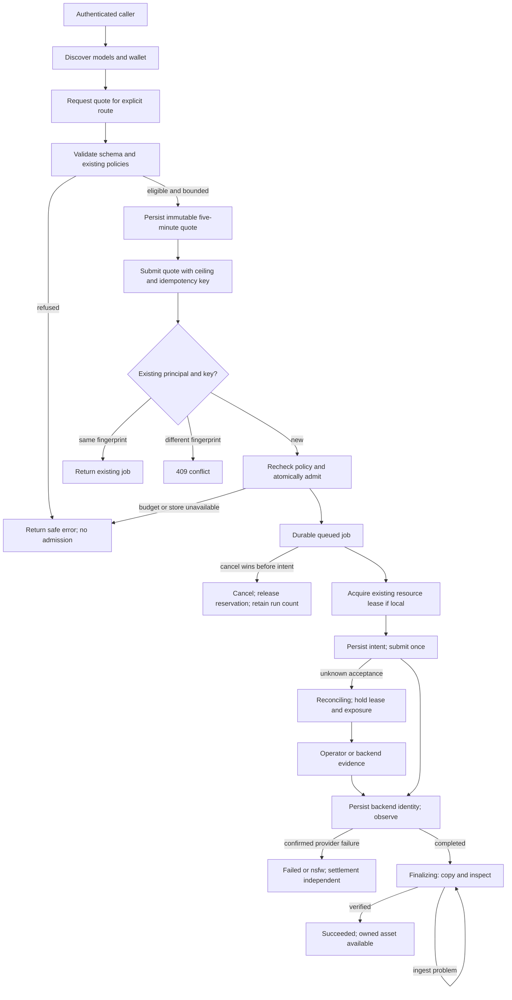
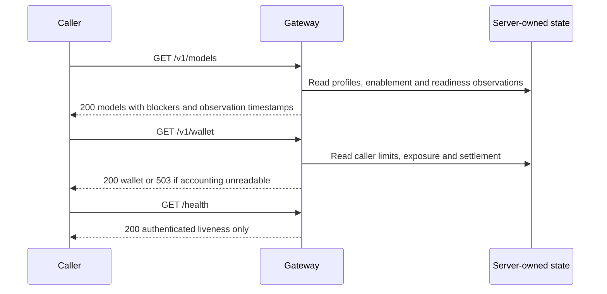
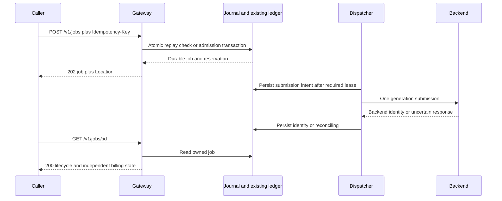
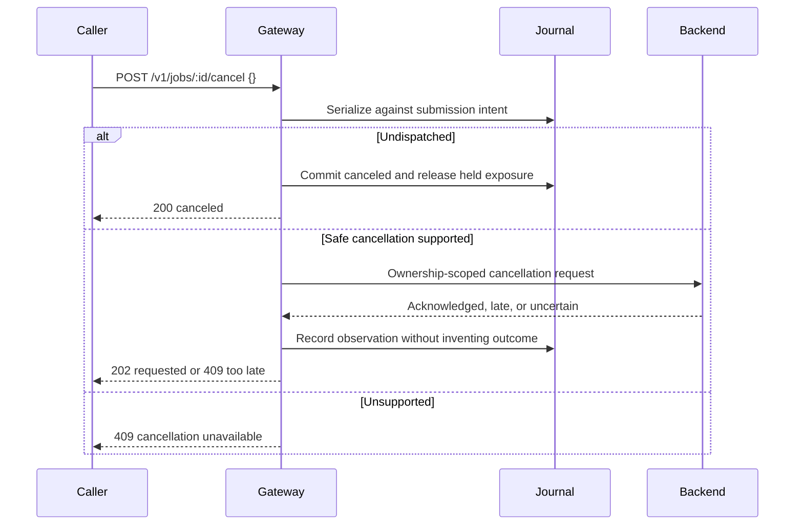
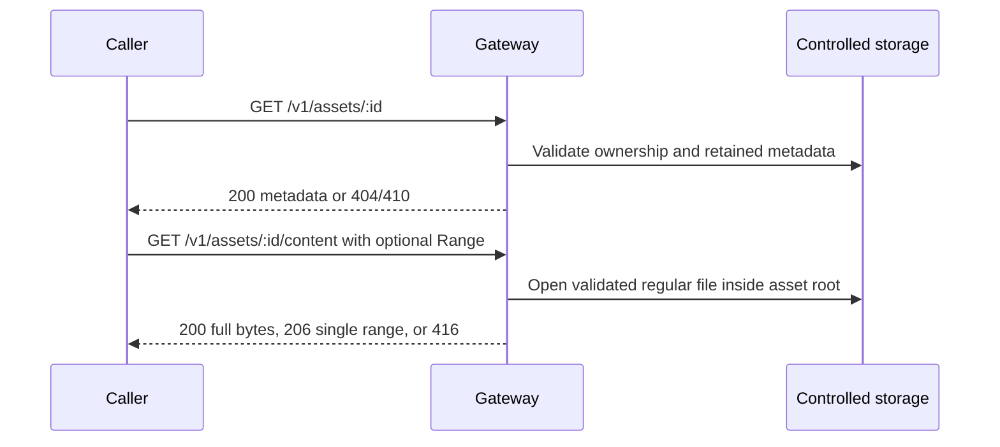
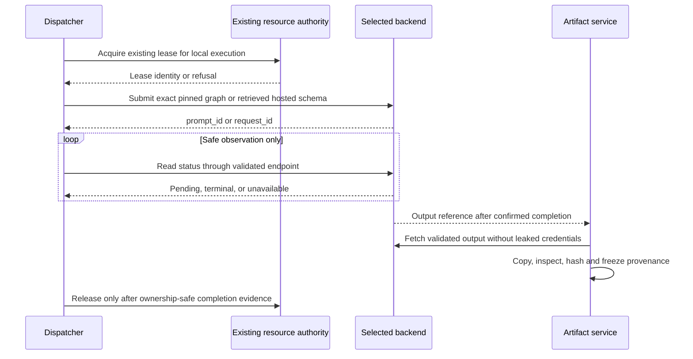
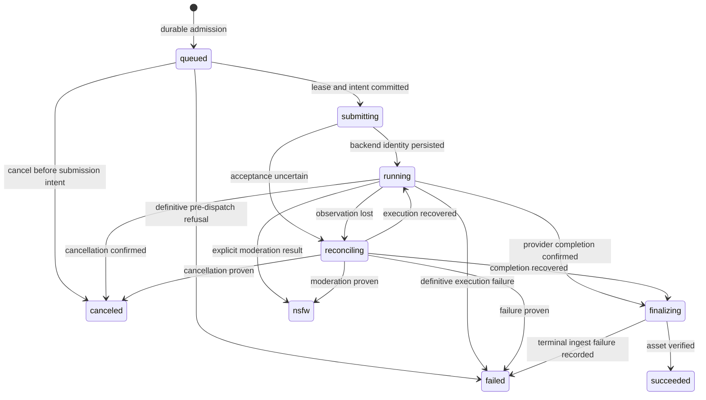
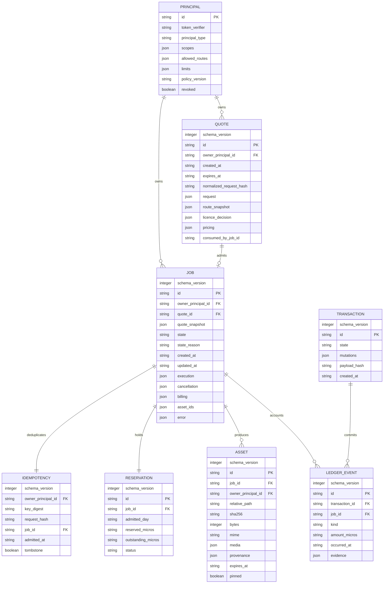

**Mounted entry and ownership**

The service is a standalone Node HTTP gateway, not a React or production Express route:

```text
media-api/server.mjs
  buildServer() / start()
    → media-api/router.mjs::matchRoute(method, path)
      → media-api/routes.mjs
      → media-api/routesCatalog.mjs
    → backend/scripts/handlers/generateVideo.mjs
      → existing registry, policy, ceilings, adapters, provenance
```

Verified current route declarations are in `router.mjs`. The current detached runner is at `server.mjs:109–138`. The updated architecture replaces immediate dispatch with durable admission and a scheduler; it does not create another policy engine.

**Authority boundaries**

| Authority | Responsibility |
|---|---|
| Existing registry/licence/prompt modules | Decide provider eligibility and input policy |
| Profile registry | Pin graph, bindings, schema and measured configuration |
| Existing spend ledger, extended | Sole monetary and admitted-volume authority |
| Existing worker resource policy | Sole GPU lease authority |
| Gateway writer/journal | Serialize and recover persistence; grants no GPU authority |
| Backend adapter | Submit once, expose backend identity, observe, cancel where safe |
| Artifact service | Copy, inspect, hash and publish controlled media |
| Sean | Enablement, runtime approval, credentials and spending authorization |

The exact `worker-resource-policy.mjs` implementation and callable lease interface were not established in this checkout during this pass. **Integration is BLOCKED until its actual file, exports, ownership and recovery behavior are captured.** Do not satisfy this dependency with a new lock.

**Route identity**

Provider-qualified identities remain authoritative. Model-only quoting requires exactly one server-pinned routing profile; otherwise return `409 E_ROUTE_SELECTION_REQUIRED`. No cheapest-provider search or silent fallback.

Local profiles contain immutable graph and binding hashes. H3 seconds remain unsupported. Wan Slice 1 requires the actual audited graph corresponding to the recorded configuration; its proposed profile identifier does not prove that graph exists.

**User and subsystem flow**



**Discovery APIs — separate read-only interactions**



**Estimate and quote interactions**

```mermaid
sequenceDiagram
    participant C as Caller
    participant G as Gateway
    participant P as Existing policy
    participant S as Store
    C->>G: POST /v1/estimate
    G->>P: Validate identity and arithmetic inputs
    G-->>C: 200 arithmetic; admissible false; no charge bound implied
    C->>G: POST /v1/quotes
    G->>P: Resolve pinned route; evaluate all quote gates
    alt Ineligible or unbounded
        G-->>C: 4xx refusal
    else Eligible
        G->>S: Persist quote snapshot
        G-->>C: 201 quote
    end
```

**Admission and polling**



**Cancellation**



**Asset APIs**



**Backend interactions**



Hosted submission details remain unavailable until retrieved. This diagram defines the adapter seam, not an invented vendor request schema.

**Execution state**



An ingest failure preserves `backend_outcome:"completed"` and all financial exposure.

**Logical JSON persistence schema**

These are **new target record fields**, not claimed existing database columns. Nested record types are defined in `03-contracts.md`; no relational database is introduced.



All records reject unknown schema versions and invalid required fields. Nullable fields use explicit `null`, never invented defaults.
