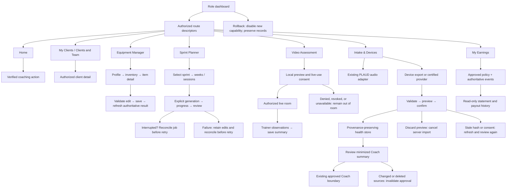
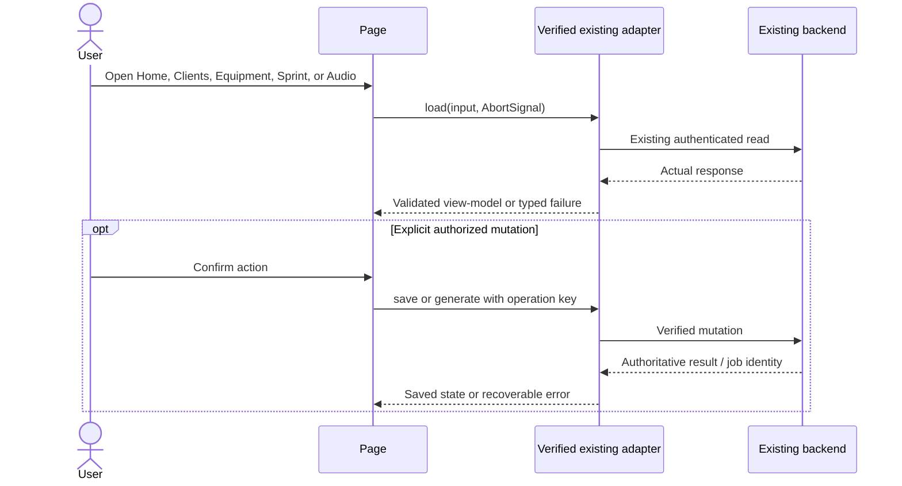

**Candidate r3 — 2026-09-24. Owner: Astra document repair. Design contract only; implementation and product tests NOT RUN.**

Supersedes the r2 text only in this candidate. Hash-verified originals remain in the review preservation set.

**System overview**

The packet describes existing frontend equipment, sprint, audio-intake, and shared-client seams. This package adds a common presentation contract and three explicitly new domains: device ingestion, working live assessment, and trainer earnings. Existing backend behavior remains an integration dependency until its routes, models, and authorization are supplied.

**Rendered hierarchy**

New paths use these exact roots:

- `F = frontend/src/features/trainer-workspace/`
- `B = backend/services/trainerWorkspace/`

```text
Existing role dashboard layout
└─ Existing route registry, bound to workspace route descriptors
   └─ F/WorkspaceShell.tsx
      ├─ F/WorkspaceHeader.tsx
      ├─ F/WorkspaceState.tsx
      └─ One page:
         ├─ existing mounted TrainerHomeTab → F/HomeContent.tsx
         ├─ existing client workspace → existing ClientHubGridCard
         ├─ existing EquipmentManagerPage → F/EquipmentContent.tsx
         ├─ existing SprintPlannerPage → F/SprintContent.tsx
         ├─ F/VideoAssessmentPage.tsx
         ├─ F/IntakeDevicesPage.tsx
         └─ F/EarningsPage.tsx
```

Existing full paths not supplied in the packet must be bound under B-01 in `10-delegated-bounds.md`. The builder must not create substitute pages merely because those paths are unknown.

**User and data flows**



**Quality subsystem**

```mermaid
stateDiagram-v2
    [*] --> Static
    Static --> Balanced: preferences allow; initial checks pass
    Balanced --> Enhanced: interaction window meets budget
    Enhanced --> Balanced: sustained frame overrun
    Balanced --> Static: severe overrun or reduced motion
    Enhanced --> Static: reduced motion or context loss
    Enhanced --> Suspended: hidden document or active video
    Balanced --> Suspended: hidden document or active video
    Suspended --> Static: visible and video ended
    Static --> Static: low capability or effects disabled
```



**Existing API interactions**

The following diagram defines the integration shape, not unverified HTTP paths or response bodies.



**Mandatory architecture sections**

- [Service sequences and import lifecycle](01-service-flows.md).
- [Logical data model](01-domain-model.md).

These companions preserve the full r2 diagrams and add explicit failure/recovery contracts. Mermaid source is supplied; rendered preview remains NOT RUN.

**Persistence**

Current physical ERD: **INCOMPLETE**. The r3 source check observes an INTEGER User primary key and legacy VideoSession JSONB wearable storage; see `15-current-bindings.md`. Full new-domain models, associations and migration/restore behavior remain unbound. The original consult did not inspect these models.

New physical migrations are blocked on B-01. Every user FK must reference `"Users"` using its actual key type. No builder may turn the wire-domain `string` type into an assumed PostgreSQL UUID.

**Out of scope**

Schedule enhancement; automatic workout prescription; recording and transcription; financial transfers; retrospective destructive data cleanup; broad global theme migration.
