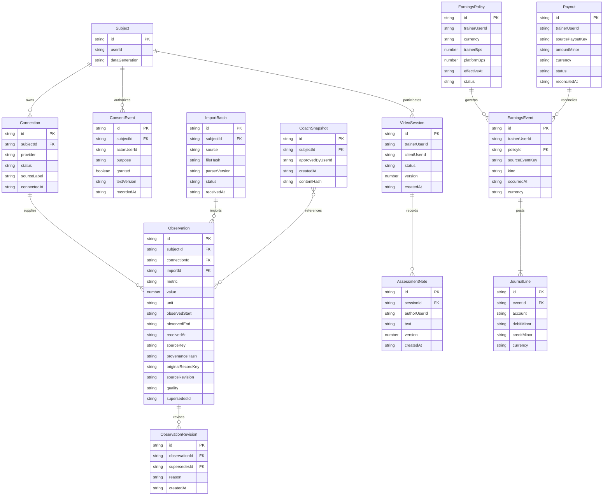

**Candidate r3 — 2026-09-24. Owner: Astra document repair. Design contract only; implementation and product tests NOT RUN.**

Mandatory companion to [01-architecture.md](01-architecture.md); same scope, bindings, and pending approvals.

**Logical data relationships**

The following is a **proposed wire-domain ERD**. Field types are exact JSON-contract types; it is not a representation of current PostgreSQL columns.

The observation is the immutable clinical revision; `ObservationRevision` is its audit metadata, not another competing value store. Active-reading views exclude quarantined, superseded, or erased observations. Previews reference exact observation IDs/revisions plus the subject generation; approval never recomputes different content silently. These are logical requirements, not authority to infer physical SQL types.
