**Candidate r3 — 2026-09-24. Owner: Astra document repair. Design contract only; implementation and product tests NOT RUN.**

Mandatory companion to [01-architecture.md](01-architecture.md); same scope, bindings, and pending approvals.

**Video API interactions**

```mermaid
sequenceDiagram
    actor Participant
    participant UI
    participant API
    participant Transport as LiveKit adapter
    UI->>API: GET /api/video-assessments/v1/sessions
    API-->>UI: Authorized sessions
    opt Trainer creates assessment
        UI->>API: POST /api/video-assessments/v1/sessions
        API-->>UI: Created session
    end
    Participant->>UI: Enable preview; agree to live use
    UI->>API: POST /sessions/:id/consents
    API-->>UI: Consent receipt
    UI->>API: POST /sessions/:id/join
    API->>API: Check participant, session, consent
    API->>Transport: Issue scoped credential
    API-->>UI: Join credential
    UI->>Transport: Connect camera/microphone
    opt Consent withdrawn
        UI->>API: POST /sessions/:id/consents, granted=false
        API->>Transport: Disconnect participant
        API-->>UI: Revocation receipt
    end
    opt Trainer saves assessment
        UI->>API: PUT /sessions/:id/notes
        API-->>UI: Versioned notes
    end
    opt Trainer ends assessment
        UI->>API: POST /sessions/:id/end
        API->>Transport: Close room
        API-->>UI: Ended session
    end
```

Paths abbreviated after the first request retain `/api/video-assessments/v1`.

**Health API interactions**

```mermaid
sequenceDiagram
    actor Client
    participant UI
    participant API
    participant Provider
    participant Worker
    participant Store
    UI->>API: GET /api/health-ingestion/v1/workspace?subjectId=...
    API-->>UI: Connections, consent, imports, freshness
    UI->>API: GET /observations?subjectId=...&metric=...&cursor=...
    API-->>UI: Authorized source-linked observations
    Client->>UI: Grant ingestion consent
    UI->>API: POST /consents
    API-->>UI: Consent receipt
    alt Export import
        UI->>API: POST /imports, multipart file and metadata
        API->>Worker: Validate quarantined upload
        API-->>UI: Import job
        UI->>API: GET /imports/:id
        API-->>UI: Versioned preview with previewHash / validation results
        Client->>UI: Confirm valid records
        UI->>API: POST /imports/:id/commit, expectedPreviewHash + operation key
        API->>Store: Idempotent import transaction
        API-->>UI: Commit job
    else Certified provider
        UI->>API: POST /connections/:provider/authorize
        API-->>UI: Authorization redirect
        UI->>Provider: User authorization
        Provider->>API: GET /connections/:provider/callback
        API->>Provider: Server-side code exchange
        API-->>UI: Same-origin result redirect
        Worker->>Provider: Authorized incremental synchronization
        Worker->>Store: Validated source observations
    end
    opt Discard before commit acceptance
        UI->>API: POST /imports/:id/discard, expectedVersion
        API-->>UI: Cancelled or conflict; reconcile GET /imports/:id
    end
    opt Disconnect
        UI->>API: DELETE /connections/:id
        API->>Provider: Revoke when supported
        API-->>UI: Disconnected
    end
    opt Erase health data
        UI->>API: DELETE /subjects/me/data
        API->>Store: Atomically advance subject generation and fence old jobs
        API-->>UI: Deletion job
        UI->>API: GET /deletions/:id
        API-->>UI: Queued / running / completed / failed receipt
    end
    opt Explicit Coach handoff
        UI->>API: POST /coach-previews with eligible observation IDs
        API-->>UI: Exact minimized content + hash + expiry
        Client->>UI: Review this content and approve
        UI->>API: POST /coach-snapshots with previewId + expectedSummaryHash
        API->>Store: Revalidate sources, consent, relationship and generation
        API-->>UI: Reviewed snapshot receipt
    end
```

Paths after the first request retain `/api/health-ingestion/v1`.

**Earnings API interactions**

```mermaid
sequenceDiagram
    participant Source as Verified payment/service adapters
    participant Ledger
    actor Trainer
    participant UI
    participant API
    Source->>Ledger: Idempotent authoritative event
    Ledger->>Ledger: Validate policy; post balanced immutable lines
    Trainer->>UI: Open My Earnings
    UI->>API: GET /api/trainer-earnings/v1/statement?period=...&currency=...
    API->>Ledger: Read trainer-scoped statement
    Ledger-->>API: Totals, entries, reconciliation state
    API-->>UI: Statement or policy-pending state
    UI->>API: GET /api/trainer-earnings/v1/payouts?cursor=...
    API-->>UI: Reconciled payout records
```

**Health import state machine**

```mermaid
stateDiagram-v2
    [*] --> Uploaded
    Uploaded --> Validating
    Uploaded --> Cancelled: discard wins before commit
    Validating --> Cancelled: discard fences validation result
    Validating --> Reviewable: at least one valid record
    Validating --> Rejected: invalid or unsafe input
    Reviewable --> Committing: explicit confirmation
    Reviewable --> Cancelled: discard
    Committing --> Completed: transaction/job finished
    Committing --> Failed: recoverable job failure
    Failed --> Committing: retry same operation; current consent and generation required
    Failed --> Cancelled: no committed result; discard
    Uploaded --> Expired: retention deadline
    Reviewable --> Expired: retention deadline
    Validating --> Expired: retention deadline
    Failed --> Expired: retention deadline
    Committing --> Failed: subject generation or consent invalidated
```




Discard and commit serialize on the import version. After acceptance, closing a dialog changes no server state; poll the existing operation. Completed imports cannot be discarded. A generation fence prevents a delayed validator, sync, import, or snapshot job from publishing after deletion. See the [health lifecycle](03-health-contracts.md).
