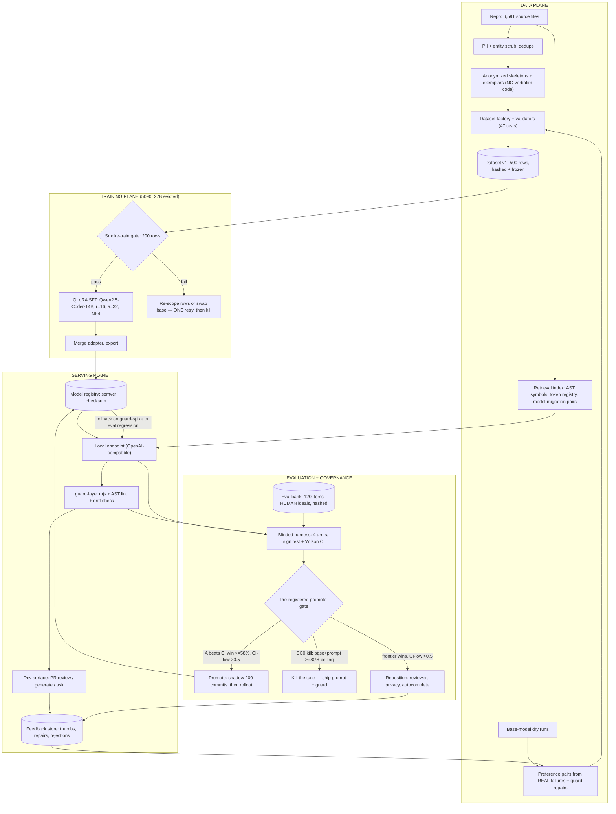
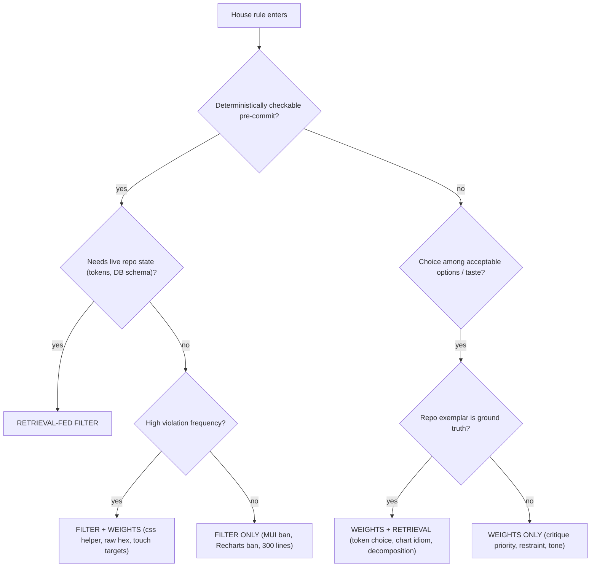
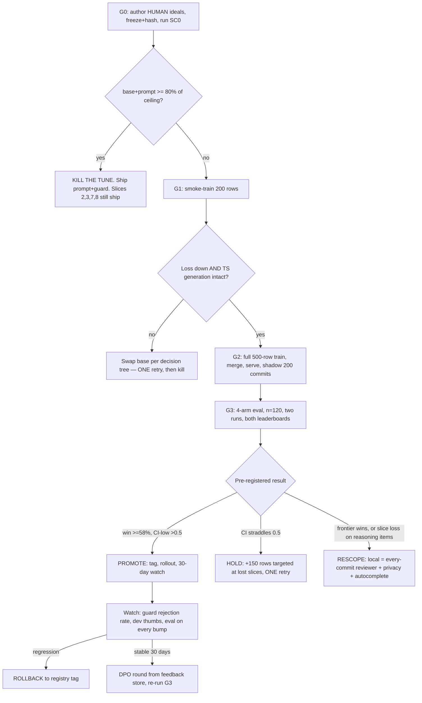

# SWAN CODER BRAIN — BLUEPRINT

**Date:** 2026-08-18 · **Author:** Opus 5 (Final Decider) · **Reviewers:** GLM 5.3 + Qwen 3.8 (both $0)
**Consults:** [`coder-brain-consults-2026-08-18/01-glm.md`](coder-brain-consults-2026-08-18/01-glm.md) · [`02-qwen.md`](coder-brain-consults-2026-08-18/02-qwen.md) · packet: [`coder-brain-consult-packet-2026-08-18.md`](coder-brain-consult-packet-2026-08-18.md)

---

## 0. The verdict Sean needs to hear first

**"Better than the frontier models" is not achievable as stated, and both reviewers said so independently.** Stop using the sentence internally — it will cause us to build toward a target that cannot be hit and to call a real success a failure.

**The winnable claim, which is genuinely valuable:**

> The tuned 14B + guard + retrieval is the **default brain for this repo** — it wins convention-dense generation, constitution review, and every-commit cadence — with a frontier model retained as the **escalation path** for novel reasoning.

Expected effect size: **58–65% win rate on the winnable slices, not a blowout.** Notably, our existing harness floor (win ≥58%, CI-low >0.5) is already calibrated to roughly that effect — the measurement apparatus we built is correctly sized for the real answer.

**Where the line actually falls** (both reviewers converged, GLM's framing is sharper — it is not "our codebase vs general SWE," it is *where the winning answer lives*):

| Local wins — the answer is retrievable or conventional | Frontier wins — the answer needs net-new reasoning |
|---|---|
| A styled-components component in house idiom | Novel algorithms |
| An RTK slice, an Express `.mjs` route module | Architecture across >5 interdependent files |
| A Sequelize model+migration pair | Race conditions (socket.io reconnect storms, Sequelize N+1) |
| A Victory chart wrapper | Performance forensics |
| Diff review against the constitution | Unfamiliar frameworks |
| Raw-hex→token swaps, `css`-helper wraps | Precise synthesis over 50+ files |

*"Add a tipping row to checkout that updates the Victory total chart"* → **local wins.**
*"Diagnose why socket.io rooms leak listeners under reconnect"* → **frontier wins** — though the local model can apply the fix in house style once diagnosed.

**Two structural reasons this holds:** (1) frontier models degrade on *stated* conventions under task pressure — our own 18→5 datapoint is direct evidence, since every survivor sat under deliberate adversarial pressure; weights and filters have no attention-dilution failure mode. (2) A frontier context window fills with our repo faster than it holds our constitution precisely; retrieval + a 32k local model keeps precision as the repo grows.

---

## 1. Sean's decisions, recorded (2026-08-18)

1. **Track C gate:** *Run SC0 now; keep SC1/SC2 gated.* R1's logic is honored — Track C unblocks on **evidence**, not enthusiasm. SC0 needs no training and its base is already on disk.
2. **Real-code training:** *Derived patterns only, no verbatim code.* Conventions are extracted from the 6,600 real files and taught through authored synthetic examples. Nothing verbatim, nothing client-adjacent leaves the machine — the privacy doctrine holds **by construction**, not by review.

Decision 2 independently matches GLM's technical recommendation, which is the stronger of the two reviewers' positions here (see §3 disagreement 1).

---

## 2. Where the reviewers agreed (high confidence — treat as settled)

- **Base model: `Qwen2.5-Coder-14B-Instruct`.** Both picked it over Qwen3-Coder (less settled recipe ecosystem) and over MoE 30B-A3B (QLoRA-on-quantized-MoE tooling is not boring, and it cannot co-tenant with the resident 27B on one 5090).
- **Coder base, not generalist.** House "judgment" here means critique *about* styled-components/Sequelize/Victory code — that is code reading, which coder bases do better. Cover the tone gap with critique rows, not a base swap.
- **500–800 rows, quality over volume.** Past ~1,000 synthetic rows you pay in general-code regression; past ~2,000 it is real damage.
- **Enumerable → filter; judgment → weights; repo facts → retrieval.**
- **The blanket "beat frontier" claim is wrong;** privacy, latency and zero marginal cost are the real moats.

---

## 3. Where they disagreed — and my ruling

**Disagreement 1 — how real code enters training.** Qwen: 40% real anonymized code as SFT. GLM: direct SFT on raw files is *near-worthless* for convention adherence, because file-level next-token training teaches syntax *distribution*, not "respond with the convention when asked"; real code should enter as **anonymized skeletons and exemplars inside instruction-shaped rows**, plus the retrieval corpus.

**RULING: GLM.** The failure mode it names is real, and it happens to be exactly what Sean independently chose. Qwen's 40% allocation would spend ~200 of 500 precious rows teaching the wrong objective.

**Disagreement 2 — the kill criterion.** Qwen proposed a new one (kill if base+prompt ≥90% of tuned). GLM kept the existing pre-registered ≥80%-of-ceiling.

**RULING: GLM, on process grounds.** The criterion was pre-registered *before the run* precisely so it cannot be renegotiated afterwards. Qwen's version is also structurally worse — it compares against the tuned model, so it cannot be evaluated until after we have paid for the tune, which defeats the entire purpose of a cheap pre-gate.

**Disagreement 3 — a testable prediction, recorded before SC0 runs.** This is the most useful thing in the two consults, because it calibrates both reviewers for free:

| | Prediction for prompt-alone violation reduction on the coder track |
|---|---|
| **Qwen 3.8** | **~70%** — coder rules are binary like the coach's, so expect a similar result |
| **GLM 5.3** | **~50–60% blended** — below the coach's 72%, because codegen consumes attention that conversation does not; `house_rule_codegen` 50–70%, `design_critique` 30–50%, **adversarial slices <30%** |

SC0 settles it. **Record who was right in the run card** — that is empirical routing data for every future consult (Rule 68 external-model calibration).

Qwen adds one genuinely useful nuance GLM did not: **binary vs structural rules.** "No MUI" is binary and prompts well; "use the `css` helper for interpolated fragments" is *structural* — the model must remember the syntax of the fix, not just the ban. Structural rules should be expected to resist prompting and are prime weights candidates.

---

## 4. The four things GLM caught that we would otherwise have got wrong

**4.1 — Two leaderboards, or the experiment lies to us.** With the guard layer on, the prompt-vs-tune gap on enumerable rules collapses to ~zero, because the guard repairs *both* arms. So: the **shippable claim** is evaluated with guard on **all** arms; the **"what did the weights actually buy"** diagnostic runs with guard **off**. Conflating them produces a confident wrong answer in either direction.

**4.2 — Arm fairness is non-negotiable.** The frontier arm must get the **same** house-context prompt, the **same** guard, and the **same** retrieval pack. If only our arm gets the infrastructure, we are benchmarking infrastructure and calling it a model win.

**4.3 — GLM must not judge its own eval bank.** GLM generated the 40 coder eval inputs. Using it as judge is a provenance conflict. The judge must come from a **third family**, be calibrated with planted seeded flaws, and have scoring discarded if it misses them.

**4.4 — The 40-item bank is underpowered for the headline claim.** Six categories at n=4–10 per slice against our own n≥30 floor. Expand to **120 items** and report one composite plus three grouped slices (generate / review / adversarial-resistance).

---

## 5. Ships regardless of whether the tune ever happens

Three items are pure value with no dependency on the model question. **Do these even if SC0 kills the tune.**

1. **Guard hardening → `eslint-plugin-swan`.** Rules: `no-mui-imports`, `victory-not-recharts`, `no-raw-hex` (whitelisting the `var()` fallback slot), `css-helper-for-interpolated-fragments`, `file-max-lines-300`, `min-touch-target-44`, `banned-palette`. Pre-commit + CI.
2. **Sequelize drift detection needs no model at all.** A recurring bug class in this repo with a deterministic ~50-line detector: diff `information_schema.columns` against Sequelize model attributes, scheduled and pre-merge. **This is unexploited value shipping this week regardless of everything else in this document.**
3. **The retrieval index.** tree-sitter over all 6,591 files → symbols, exports, styled fragments, a token registry parsed from `tokens.css` *including values* (enabling fallback-drift checks), and model↔migration pairs.

And the strategic point both reviewers reached from different directions: **every-commit cadence is the actual moat.** A local model reviews every commit at ~zero marginal cost with zero data egress. You cannot put a frontier API on every commit for cost or privacy reasons. The 18→5 residual gets caught a hundred times a day instead of at code review. **The guard layer is simultaneously a preference-data factory** — every rejection/repair pair is a labeled chosen/rejected row, which means v2's training set is being generated by whatever we ship first. That flywheel is the thing a frontier vendor cannot copy: it is our data, on our commits, at our cadence.

---

## 6. Architecture



## 7. Rule routing — weights vs filter vs retrieval

**Restated doctrine (GLM's amendment, which I accept):** it is **not a partition, it is a stack.** *Deterministic where determinable, weights for frequency and judgment, retrieval for repo facts; nothing enumerable relies on the model alone, and nothing judgment-shaped is wasted on regex.*

Two corrections to our existing doctrine:
- **"Enumerable → code only" leaves accuracy on the table.** High-frequency enumerable rules belong in **both**. The `css`-helper rule is the counterexample: it is AST-detectable, but the failure is a *mount-time crash*, so a post-hoc repair still costs a wasted cycle. A model that never makes the mistake is strictly better. The question is not "which one" but "does this rule *also* deserve weights?"
- **There is a hidden fourth category:** rules checkable only against **live repo state** — token existence, fallback drift vs `tokens.css`, Sequelize schema vs the live DB. These are *retrieval-fed filters*: not pure regex, not weights.

| Rule | Filter | Weights | Retrieval |
|---|---|---|---|
| No MUI / Victory-not-Recharts | import lint | light | – |
| Raw hex / retired palette | AST+regex (allow `var()` fallback slot) | yes | token vocab |
| `css` helper for interpolated fragments | AST | **yes** | exemplars |
| 44px / WCAG / dark-first | best-effort lint + computed contrast | **yes** (taste at the margin) | – |
| 300-line cap | trivial | yes (when-to-split judgment) | – |
| Sequelize drift | **introspection script** | flag-in-review judgment | model↔migration pairs |
| Token choice / decomposition / critique priority | no | **yes** | **yes** |



## 8. Gate flow



## 9. Developer surface (wireframe)

```
+---------------------------------------------------------------------------------------+
| swan-coder > PR #482 "checkout tip row"        [Review] [Generate] [Ask]    * local 14B |
| model: tuned v0.3 - guard v7 - retrieval: tokens+exemplars     [escalate to: frontier v]|
+----------------------------------------------+----------------------------------------+
| DIFF  src/components/checkout/TipRow.tsx     | GUARD   ! 2 escalations - 4 auto-fixed  |
|                                              |----------------------------------------|
|  12 + const TipRow = styled.div`             | ! E2  raw hex = retired palette value  |
|  13 +   color: <retired-hex>;                |       suggest: var(--accent-2, #6C2BD9)|
|  14 +   padding: 8px 16px;                   |       [apply repair] [reject] [ask]    |
|  15 + `;                                     |----------------------------------------|
|  16 + export default TipRow;                 | ! E1  touch target 32px < 44px minimum |
|                                              |       [apply repair] [reject] [ask]    |
| brain: "That hex is the retired accent. Use  |----------------------------------------|
| var(--accent-2, #6C2BD9). Also min-height    | ok  auto: css-helper wrap  Row.tsx:31  |
| 44px for the tap target."                    | ok  auto: var() fallback inserted      |
|                                              | ok  auto: no Recharts import           |
| [insert fix] [explain] [thumb up/down]       | ok  auto: 214/300 lines                |
+----------------------------------------------+----------------------------------------+
| VERDICT: BLOCK - 2 unresolved escalations (E1, E2)     review posted to PR  [override] |
+---------------------------------------------------------------------------------------+
| ask: "why does the css helper matter here?" [enter]     every action -> feedback store |
+---------------------------------------------------------------------------------------+
```

**Generate mode** swaps the left pane for: ticket text → generated file(s) + a compliance checklist (token usage, 44px, `css` helper, line count, drift flag) → the same guard panel on the output → the same thumbs.

**Qwen's addition, accepted:** the same guard belongs in a **VS Code extension** for as-you-type feedback. Sub-500ms local inference makes real-time linting possible in a way a frontier API cannot match. That is a DX moat, and it reuses the guard layer already shipped.

---

## 10. Slices — numbered, independently shippable

**Slice 1 — Unblock the decision (gates everything).**
Author **human** ideals for the 40 coder items from the constitution — *never from model output* — hash and freeze. Expand to 120 (+40 real-commit replay from post-constitution history at FE:BE 2:1, +20 traps, +10 review, +10 context-switch). Dry-run the base on 20 items, **rank rules by observed violation frequency**, and build the best-effort baseline prompt from that ranking rather than from our priors. Run SC0 exactly as pre-registered. Record which reviewer's §3 prediction was right.
*Done when:* SC0 result with CI and the kill criterion adjudicated in a signed memo.
*Kill:* K1 triggers → skip Slices 4–6; Slices 2, 3, 7, 8 proceed regardless.

**Slice 2 — Guard hardening.** `eslint-plugin-swan` (7 rules per §5) + `drift-check.mjs`. Pre-commit + CI. Every rejection/repair logged to the feedback store.
*Done when:* 0 false positives on a 200-file random sample, <5s pre-commit, drift-check catches 3 seeded drifts.

**Slice 3 — Retrieval index.** tree-sitter over 6,591 files → symbols/exports/styled fragments; token registry with values; model↔migration pairs. `GET /exemplars?pattern=…&k=3`.
*Done when:* 95% of 50 probe queries return a compliant exemplar, p95 <100ms.

**Slice 4 — Dataset v1 (only after SC0 says the tune is needed).** 500 rows: 200 synthetic instruction→code from anonymized skeletons · 125 preference pairs (60 mined from *real* base-model failures, 65 authored adversarial near-misses) · 75 review/critique rows **of which 25 are clean diffs answered "no findings"** (teaches restraint) · 50 refusal/trap · 50 context-switch. Caps ≤40 rows per pattern family; 50-row holdout never trained.
Four judgment mechanics: never correct the same rule the same way twice; **15% of rows carry an explicit in-prompt override** ("this legacy file allows raw hex") so it learns *conditional* compliance rather than baked reflex; the 25 clean-review rows teach it to pass compliant code instead of inventing findings; rejected answers must be the *plausible* failures the base model actually produces — mined from dry runs, never hand-invented strawmen.
*Done when:* factory tests green, 0 PII flags, caps enforced, hashed and frozen.

**Slice 5 — Train, serve, shadow.** Evict the 27B in a scheduled window. Smoke-train 200 rows → gate on loss + a 10-item TS spot-check. Full train 500 rows, 3 epochs, r=16/α=32/lr 1e-4/NF4/ctx 4096. Merge, serve, tag in the registry. Shadow-run 200 historical commits with **no developer exposure**.
*Done when:* shadow shows ≥30% fewer guard escalations vs base+prompt on the same commits.

**Slice 6 — The proving eval.** Four arms (A tuned+guard+retrieval · B base+prompt+guard+retrieval · **C frontier+same prompt+same guard+same retrieval** · D frontier cold, reported not headlined), n=120, two runs, third-family calibrated judge, 20% human adjudication, **both** leaderboards.
*Done when:* promote/hold/rescope memo signed by Sean against K1–K3.

**Slice 7 — Dev surface.** The §9 wireframe: web panel + PR bot + `swan review`/`swan gen` CLI + the VS Code extension. Every action writes the feedback store.
*Done when:* used for 2 weeks, ≥70% of escalations get an explicit action, feedback capture verified.

**Slice 8 — Flywheel.** 200–400 DPO pairs from the feedback store (chosen = accepted repair, rejected = original violation), β=0.1, lr 5e-6, 1–2 epochs; re-run G3. Every model bump re-runs the eval; registry rollback on guard-spike or eval regression.

---

## 11. Pre-registered kill criteria (fixed before any run)

- **K1 (SC0):** base+prompt ≥80% of rubric ceiling → **the tune is cargo.** Ship prompt+guard, keep collecting preference data.
- **K2:** tuned-vs-frontier win rate <58% or CI-low ≤0.5 → the claim fails; reposition.
- **K3:** tuned wins composite but loses the multi-file/debug-flavored items → **scope the claim explicitly.** A composite win gamed by easy items is a lie.
- **"Stop, the frontier is still better":** frontier beats tuned on composite with CI-low >0.5 **and** on ≥2 of 3 slices, across two independent runs. Then local ships as every-commit reviewer + privacy layer + first-draft generator, and the "better than frontier" wording dies permanently.

## 12. Open, non-blocking

- GPU tenancy policy is undecided and it gates the MoE question entirely: training and serving both require evicting the 27B, and serving a 14B alongside it is tight (~26GB with KV pressure). Decide eviction windows vs offload before MoE is even on the table.
- A FIM autocomplete sidecar (Qwen2.5-Coder-3B-base) is attractive for inline completion but competes for the same VRAM. Deferred until tenancy is settled.
