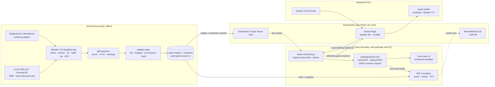
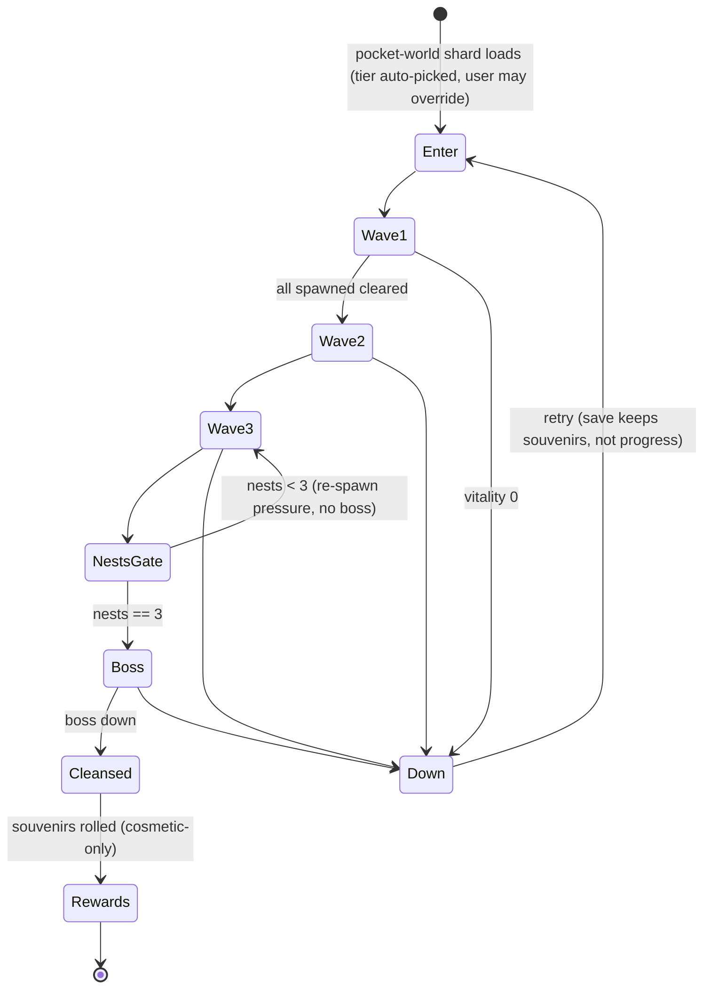
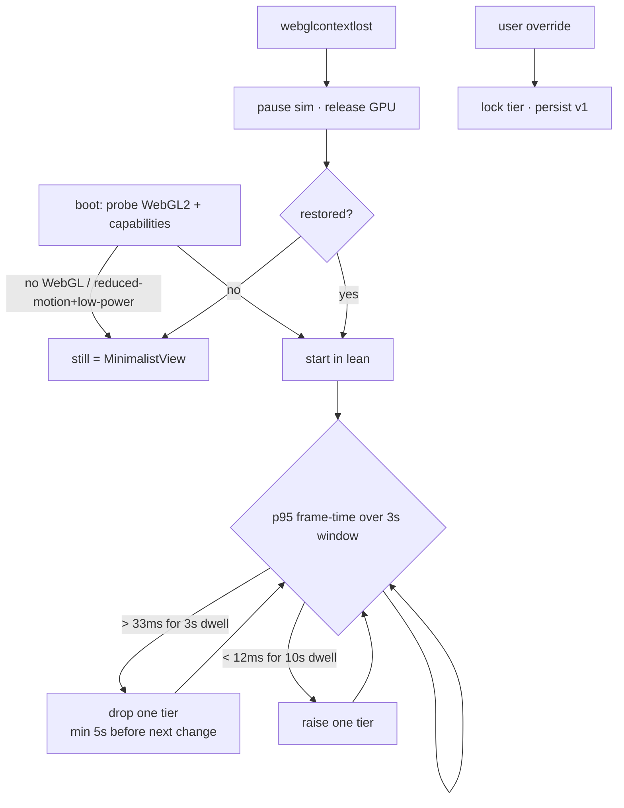

# Project Aftertaste — Swanverse Fallen-World Mini-Game + Asset Factory Blueprint

**Date:** 2026-08-25 · **Author:** Fable 5 (synthesis) over a 5-seat hostile panel · **Status:** blueprint, NOT a build authorization · **Panel outputs:** `docs/ai-workflow/AI-HANDOFF/panel-2026-08-25-aftertaste/`

> Read order for a fresh session: this doc → `swanverse-game-universe-vision-2026-07-22.md` (lore canon) → `swanstudios-rpg-game-2026-06-13.md` (what's already built) → the panel INDEX.

---

## ⚠ CORRECTION (2026-08-25, post-panel — read this first)

**`world.miniature-play.voxel-realm` EXISTS.** It is entry 16 of 18 in `docs/ai-workflow/design-brain/worlds.md` on `origin/main` (L229), and `scripts/ai-workflow/world-engine-catalog-validation.mjs` validates it. The GPT plan's anchor was **correct**; the packet's G8 row told the panel it was hallucinated, and five seats built findings on that false premise (Grok P0#1, HY3 P0#1, Qwen P0#1 → its REJECT, GLM's "G8-class recurrence").

**Cause:** the verifying grep was `grep -nE "miniature|voxel" | head -8`; entries 14 (`tiny-metropolis`) and 15 (`pocket-worlds`) consumed all 8 lines before line 229. A truncated instrument reported an absence. Same failure class as `20260825-an-instrument-that-did-not-run-reports-clean`, repeated the same day.

**Effect on the plan — it gets STRONGER, and one constraint is new:**
- Voxel Realm's World DNA already mandates *"beveled voxels with disciplined roughness, not plastic cubes"* and bans *"Minecraft likeness"* — **C10's art law was already repo doctrine**, not a panel invention.
- Its asset-provenance clause already requires generator/model/version, seed, licenses, SHA-256, and a similarity review excluding *"protected game assets, characters, UI, audio, trademarks, and real likeness"* — **Kimi's generator-license finding was already doctrine.**
- Its proof/action contract already states the action is *"never awarded or unlocked by play"* and *"no gameplay gates proof or action"* — **C8's souvenir-not-gate rule was already doctrine.**
- Its anti-cheese line already warns the world *"fails fastest when block fonts, loot sparkle, achievements, and a copied sandbox-game look turn evidence into gamification sludge"* — a direct caution against the Vault-loot/achievement layer.
- **NEW CONSTRAINT (no seat saw this):** Voxel Realm is **Law B (Licensed Departure)** — *"No Swan-branded surface may use this Law-B chrome"*, audience fit *"disqualify Swan chrome"*, licensed subset = *"non-Swan campaign microsites, gaming/education client demos, and factory/internal experiments only."* A game wearing Voxel Realm's palette **cannot be embedded in the Swan-chromed dashboard**. Either the embedded build runs **Law A** (Swan palette per §5) and only the standalone build wears Law B, or the game lives off-Swan from the start. **This makes P4 (standalone deploy) the natural home and makes P3's in-dashboard embed the constrained case — it must be Law A.** See §3 line 1 and §13 decision 5.

**Unaffected by this correction** (verified independently, not downstream of G8): C1 branch drift, C3 vocabulary fork, C4 receipt design, C5 Blender-MCP, C6 proof size, C7 health language, C9 house rules, C11 sim purity, C12 spend. The Swanverse-lore miss (G1) is also independently true — those docs really are local-branch-only.

---

## 0. Verdict in one paragraph

The GPT plan you pasted is architecturally sound in its bones (app↔game firewall, imperative sim outside React, IP hygiene, potato-to-ultra ladder) and **wrong in its footing**: it audited `origin/main` and never saw your Swanverse lore (local branch only), it cited a design-brain world entry that does not exist, it invented a second quality vocabulary and a second progression, it named "signed idempotent receipts" without designing them, and its 7-asset factory proof is a production start wearing a proof costume on a machine that has no Blender installed. Panel: **4× REVISE, 1× REJECT (Qwen)**. Every seat independently said the same five things (§1). This blueprint is the corrected plan.

## 1. Panel synthesis (GLM 5.3 · Qwen 3.8 · Grok 4.6 · Kimi K3 · HY3; Ox Alpha 429'd ×3)

### Consensus (5/5 unless noted)
| # | Finding | Fix adopted |
|---|---|---|
| C1 | **Dead execution base.** Branch is 443 ahead / 2246 behind `origin/main`; the two lore docs exist only here. | P0 step 1: fresh branch off `origin/main`; land the two lore docs + this blueprint as the first PR; stale branch read-only. |
| C2 | **Lore silo.** "Midnight Food Court" as a standalone map forks the Swanverse cosmology and the ID namespace. ~~The cited `world.miniature-play.voxel-realm` anchor is fiction~~ — **CORRECTED: it exists (see banner); the packet was wrong, not the plan.** | Frame the slice as a **contamination pocket-world** (a fallen Earth-tier shard the champion redeems); the food court is its first *zone skin*, not its identity. Art/provenance/proof doctrine is **inherited from `world.miniature-play.voxel-realm`**; the shard framing borrows `pocket-worlds` ("each island carries one idea completely"). Author no new world entry — extend. |
| C3 | **Vocabulary fork.** Five invented quality modes vs the shipped `Full / Lean / Still` (+ 2D `MinimalistView`); "game level" vs `ClientProgress.overallLevel` 0–1000. | One enum: `full \| lean \| lite \| still`. Game XP exists only in-session; **the game never writes `overallLevel`**. Mapping table + tests at 0 and 1000 (`overallLevel` is inclusive-0 — verified in the model). |
| C4 | **Reward receipt is a name, not a design.** Client-side game ⇒ any JS-minted signature is forgeable; no nonce, replay window, key custody, or tenant scope. | §6: server-issued session nonce, server-side plausibility envelope, dedupe table w/ TTL, recipient from session never payload, **rewards are cosmetic/souvenir-only, forever**. Written in P0 even though integration is deferred. |
| C5 | **Blender-MCP is local RCE.** "Review the Python" does not scale. | Wrap before enable: separate Windows user or container, read-only source mount, write only to `export/`, MCP bound to 127.0.0.1, egress-deny, checkpoint as a pre-pass hook in the wrapper, one writer per asset, import allowlist. MCP is the **last** thing installed. |
| C6 | **Proof too big.** 7 assets is "why don't these seven match," not "does the pipe work." (Kimi 2, GLM 3, Grok 1+1) | **1+1:** one rigged organic enemy through the whole pipe, then the same pipe on one *app* asset (companion stage or badge frame) so the DEFER-era ROI is real. |
| C7 | **Health-language landmine.** "Grease Drag" (and a force-feeding clown) reads as fat-shaming to a hostile reader despite §3.4. (Kimi, Grok, GLM) | Rule: **debuffs are named for the environment/material, never the body.** Renames in §3. Boss force-feed targets the avatar's *willpower/schedule* fiction, not eating. |
| C8 | **Workout = gate in bonus costume.** "Work out to level up" vs "playable without workouts" cannot both hold in one slice. (Grok, GLM, Kimi) | Contract: combat power + zone completion are 100 % in-session. Verified training grants **souvenirs** (cosmetics, pocket-world materials, companion flair). Missing receipt ≡ full game, fewer souvenirs. Decay-free. |
| C9 | **House rules not restated for the game HUD.** (Grok, GLM, HY3) | HUD = styled-components, `var(--token,#fallback)`, 44 px targets, dark-first, WCAG 4.5:1 on solid chips (never raw scene), Dual-Button Glow, ≤300 lines/file enforced by lint. Status cue = icon + label + shape + audio, never color alone. |
| C10 | **Microvoxel at runtime is wrong.** Per-unit micro detail on a swarm = N unique geometries = draw-call death on Lite. (Grok, GLM) | **Art law:** voxel is the *authoring dialect*; runtime is remeshed, beveled, atlas-baked low-poly with vertex color + one normal/AO/roughness atlas. Live microvoxels only on static decor. "One level above Minecraft" = bevel + irregular scale + baked dirt, not smaller cubes. |
| C11 | **Sim purity is unenforced; determinism is theater.** | `packages/swan-sim` has zero renderer imports (dependency-cruiser rule); fixed timestep (60 Hz accumulator) + seeded RNG; rapier **dropped** from MVP (kinematic controller suffices). |
| C12 | **Pay for nothing this phase.** (5/5) | Meshy/Rodin/Luma/Mixamo/courses: no. One-month Meshy pre-authorized *only if* local TRELLIS/Hunyuan3D hasn't produced a usable base mesh in 3 engineer-days. |

### Contradictions
- **Route.** Qwen: grey-box loop first (B) — "the Owner is distracted by tooling." Grok/Kimi/HY3: factory first (A) — B spends the deferred-game budget proving a loop nobody may ship and yields nothing for badges/companions. GLM: A with a 48-hour grey-box probe inserted before any bespoke enemy art. **Fused: Route A′ = GLM's shape.** The factory pays regardless of DEFER; the 48 h probe answers Qwen's fun question for the price of two days.
- **Local image→3D.** Qwen: a trap for a solo dev (retopo/UV/rig cost > subscription). Grok/GLM: the 5090 is exactly the box; provenance beats Meshy's topology fights. **Fused:** local first, time-boxed 3 days, Meshy fallback pre-authorized, and *either way* AI meshes are base blockouts that go through the same bevel/bake/LOD pipe — never shipped raw.
- **Godot.** Qwen leans Route C; Grok/GLM name a hidden tax (COOP/COEP headers on the host page can break payment/video iframes; iframe = clickjack/token surface). **Fused:** not now. Tripwires for leaving R3F: >30 pathfinding agents, animation state machines past ~4 layers, ragdoll/stacked physics, rollback networking, or a second walkable interior. That is P5/P6.

### Unique insights worth keeping
- **GLM:** Draco breaks on skinned/morph-target GLBs — validator rejects Draco on rigged assets, prefers Meshopt. Headless-Chrome perf numbers are SwiftShader fiction — perf truth = headed Chrome on the 5090 + one real iGPU laptop; CI is smoke-only. `webglcontextlost` mid-wave is the common failure, not startup. *(Its "G8-class recurrence" point is void — G8 was my error, not the plan's. The registry-validator fix it proposed stands on its own merit: `world-engine-catalog-validation.mjs` already does exactly this for worlds, and is the model for the asset registry.)*
- **Grok:** contamination FX fit animated SDF/metaball *shaders* better than meshes; 2.5D locked-camera diorama matches `pocket-worlds` ("each island carries one idea") and the potato mandate better than a walkable food court for slice one; concrete Lite budgets (§7).
- **Kimi:** the generator's *license* needs the same IP rigor as the characters — `provenance.license` is a validated enum, not free text; tier-flapping needs dwell time; local saves need a version envelope + tolerant reader + golden-save tests.
- **HY3:** a wave director that counts waves and nests separately can spawn the boss before nests are cleared — one state machine, not two counters; flagged the Ollama bind — verified LAN-listening, but the bind is deliberate (Hermes-in-WSL); the real fix is the firewall rules (§10 step 0), never a rebind.
- **Qwen:** "Ringmaster + Banquet + Clown" is a crowded IP space (FNAF, Cuphead) — trademark search before *any* concept art of the boss.

### Blind spots (nobody raised — Fable adds)
- **The `story` skill and this blueprint must not both be canon for the same facts.** Blueprint owns *mechanics/contracts*; lore doc owns *cosmology/names*. Cross-link, never duplicate (rule 27 applied to docs).
- **Sound.** Every seat skipped audio. Round/wave audio cues are the single most COD-Zombies-recognizable element; original sound design is an IP-separation row, not polish.
- **Minors.** SwanStudios has minors' data paths. The game surface must inherit the app's age posture: no chat, no UGC, cosmetic-only economy, no real-money store in P≤4.

## 2. Corrected vision (what we are building)

**The Swanverse (canon):** train on Earth → earn the right to travel → redeem negative-energy worlds → build your own. **Project Aftertaste** is the *first fallen world*: a contaminated Earth-tier pocket-shard where discarded food, grease, sugar, and the things that feed on leftovers have become living threats. Cleansing it (nests → boss → the shard turns benevolent) is the first act of the redemption loop the lore already defines. Everything Swan-crystalline (player, cleansed ground, rewards) is the light; contamination is the dark.

**Modes (unchanged from the GPT plan, re-anchored):** Layer A = Swan Life / Avatar Home (calm, needs, rooms, pets — the existing ~60 %-built RPG). Layer B = Aftertaste (active survival). One account, one champion, one cosmetic inventory, one `overallLevel`, one Vault rarity ladder, one `CompanionPetService` cast.

**Renamed fictional statuses (C7):** Sugar Crash ✓ (keep) · Grease Drag → **Slick Footing** · Salt Lock → **Brine Stiff** · Gut Static → **Spoilage Hum** · Contamination ✓ · Fatigue ✓ · Dehydration ✓. Counters stay food/water/movement-named. Statuses originate from enemies and floor, never describe the avatar's body.

**Boss:** archetype "banquet ringmaster" stays, **name and silhouette are unassigned until a trademark/likeness search** (Qwen). Design rule: no clown makeup, no red/yellow trade dress, no crown/bucket/arches. His signature is manipulation and excess (a maître d' of rot), not a clown.

## 3. The five-line contract (write this before any mesh — GLM/Grok "afternoon that saves a quarter")

1. The slice **inherits `world.miniature-play.voxel-realm`** (art DNA, Law-B palette, provenance, anti-cheese, proof/action contract) and is registered as `pocket.aftertaste.fallen-food-court`, a Swanverse shard framed on `pocket-worlds`. **No new world entry is authored.** Asset IDs come from **one registry file**; the validator rejects unregistered IDs — modelled on the existing `scripts/ai-workflow/world-engine-catalog-validation.mjs`. **Law gate:** any Swan-chromed surface renders Law A; Law-B chrome is standalone-only.
2. Quality enum = `full | lean | lite | still`; `still` = the existing 2D `MinimalistView`. Persisted overrides carry a version and a migration map.
3. Loot = Vault rarities; pets = `CompanionPetService` species×stage IDs; avatar = existing tier ladder. The game mints no parallel catalog.
4. Training receipts are souvenirs, never gates; the game never writes `overallLevel`.
5. Factory proof = 1 enemy + 1 app asset through the full pipe. Nothing else is authored until both pass the validator.

## 4. Architecture (mermaid)



### Core loop (mermaid)

*One state machine — waves and nests are not separate counters (HY3).*

### Quality tier selection (mermaid)


## 5. Wireframes (house-rule compliant)

**Avatar Home entry card (Layer A → B)**
```
┌──────────────────────────────────────────────────────────────┐
│ AVATAR HOME                                   LEVEL 18 ◈ ring │
│ ┌──────────────┐  VITALITY   ████████░░  72%                   │
│ │ champion     │  RECOVERY   ██████░░░░  61%                   │
│ │ (3D | still) │  CLEAN STREAK 4 days                          │
│ └──────────────┘                                               │
│  ⚠ A FALLEN SHARD CALLS — Fallen Food Court (contamination)    │
│  [ ▶ ENTER THE SHARD ]  ← 44px, sapphire bg → purple glow      │
│  Last souvenir: Crystal Cleanser Handle (Rare)                 │
│  Still mode · Quality · Accessibility  ← 44px text buttons     │
└──────────────────────────────────────────────────────────────┘
```
**In-game HUD** — every chip is a solid token-background surface, never text on raw scene:
```
┌──────────────────────────────────────────────────────────────┐
│ [WAVE 3/3] [NESTS ◉◉○ 2/3]            [CONTAMINATION ▮▮▮░ 28%] │
│                                                               │
│                         (scene)                               │
│                                                               │
│ [⚠ SLICK FOOTING ⏱4s]  [◆ SUGAR CRASH]     [BOSS: DORMANT]     │
│ [CLEANSER ▮▮▮▮░ 64%] [GAUNTLET] [ABILITY ● READY]              │
│ [💧×1] [FIBER×2] [GREENS×0]                      [◎ objective] │
└──────────────────────────────────────────────────────────────┘
```
Status chips: icon + label + countdown + distinct silhouette + audio cue. ≤ 6 chips visible; overflow collapses to a "+N" chip. Phone width: two rows, tools collapse to icons with labels on press.

## 6. Data contracts (the parts the GPT plan named but never designed)

**`swan.game-asset.v1`** — as in the GPT plan, with three changes: `id` must exist in `assets/registry.json` (validator-enforced); `provenance.license` is an enum `{owner-authored, cc0, ccby, model:<name>@<version>:<license-id>}`; `provenance.generator` records the local model + weights hash when AI-assisted; `budgets.*` are **required numbers** (a null budget fails validation).

**Level mapping** — `GameTier = floor(overallLevel / 200)` → 0..5 (inclusive-0 verified). No `level-1` indexing anywhere. Tests at 0, 199, 200, 999, 1000.

**`swan.training-reward.v1` (server → game, P3+)**
```json
{ "schema":"swan.training-reward.v1", "sessionNonce":"srv-issued-once", "userPublicId":"opaque",
  "tierFlags":["tier3","streak7"], "souvenirRollEligible":true, "issuedAt":"ISO", "expiresAt":"ISO+2h",
  "sig":"HMAC(server-key, nonce+userPublicId+flags+issuedAt)" }
```
**`aftertaste.game-result.v1` (game → server, P3+)**
```json
{ "schema":"aftertaste.game-result.v1", "sessionNonce":"same", "zoneId":"pocket.aftertaste.fallen-food-court",
  "durationMs":412000, "wavesCleared":3, "nestsCleansed":3, "bossDefeated":true, "clientHash":"sha256(sim event log)" }
```
Server rules: recipient = session user (never payload); nonce single-use with TTL; plausibility envelope (`durationMs` ≥ 90 s per wave cleared, score monotone); rewards resolved **server-side** from Vault rarity tables; rate-limit 6 results/hour/user; a failed verify drops silently and logs — never errors to the client (no oracle). Threat-model line: *local save tampering is acceptable because nothing in the save has economic value.*

## 7. Quality ladder + Lite budgets (priors → replace with lab numbers)

| Tier | Target | Budget (Lite = integrated-GPU laptop, 30 fps floor) |
|---|---|---|
| `still` | no WebGL / a11y / reduced-motion+low-power | existing `MinimalistView`; poster + rewards + text summary |
| `lite` | 5-yr-old laptop | ≤ 80 k tris in view (champion ≤ 12 k, swarm unit ≤ 1.5 k, boss ≤ 18 k) · ≤ 60 draw calls (one instanced swarm batch, one atlas) · ≤ 16 MB GPU textures (1×2048 atlas + 1×512 enemy sheet, KTX2) · ≤ 24 live swarm + ≤ 4 elites (hard cap **before** quality drop) · ≤ 8 MB compressed download · dyn-res 0.6–1.0, 200 ms hysteresis · baked light + 1 directional |
| `lean` | common laptops/desktops, 60 fps | ≤ 350 k tris · ≤ 120 draw calls · ≤ 96 MB textures · ≤ 150 swarm / ≤ 3 unique skinned · 1 dir + baked AO + ≤ 4 points · ≤ 25 MB download |
| `full` | gaming PCs | higher LODs, denser particles, realtime shadows, SDF contamination shaders |

Per-unit swarm state (tint, decal) via a data texture / instanced attribute — never by de-instancing. Perf truth = headed Chrome on the 5090 + one named iGPU laptop; Playwright in CI is smoke-only (GLM).

## 8. Roadmap — slices with exit gates (Route A′)

| Slice | What | Exit gate | Gated by |
|---|---|---|---|
| **P0 — Footing** (1–2 days) | Fresh worktree/branch off `origin/main`; PR #1 = the two lore docs (Swanverse + badge/companion — neither is on main) + this blueprint + the panel record + `assets/registry.json` + the IP/health/**sound** one-pager. **No new world entry** — the zone inherits `world.miniature-play.voxel-realm` and is registered in `assets/registry.json`. Boss archetype name searched and REJECTED (Ringmaster space is crowded); archetype re-cast as a maître d' of rot. Ollama firewall launcher handed to Sean. | PR merged; registry validates; contract signed; no name enters concept art with an open search. | — |
| **P1 — Factory proof 1+1** (≤ 1 week) | Install order §10. Hand-author ONE enemy (Fryling) in MagicaVoxel → bpy bevel/UV/bake/rig/LOD0-1-2/collision/still → gltf-transform → manifest → validator FAILS → fix → PASSES → hashed GLB in a clean viewer. Then the same pipe on ONE app asset (companion stage or badge frame). | Both assets pass the validator; contact sheet reviewed by Owner; app asset renders in the existing Avatar Home card. | P0 |
| **P1.5 — 48 h fun probe** | Grey-box the pocket-world in a **standalone Vite app** (not the dashboard): primitives, kinematic controller, one swarm, 3 waves, nests gate, stub boss. Fixed timestep + seeded RNG from day one. | 30-second capture; Owner says "I'd play that again" or the loop is redesigned before any more art. | P1 |
| **P2 — Vertical slice** | Real Fryling + Patty Larva + Crumb Roach (Grease Flies and Pizza Husk **cut**), boss v1, 4 statuses + 4 counters, `lite/lean/full/still`, KB/M only (gamepad cut), local save v1, context-loss handling. Own package; zero app imports. | Perf lab passes Lite budget on the named laptop; dependency-cruiser clean; validator clean; hostile pass dry. | P1.5, Owner go |
| **P3 — App preview** | Lazy route + flag + test accounts; nonce/verify endpoints; souvenir receipts; Avatar Home card. | No dashboard perf regression; IDOR/replay tests pass; receipts idempotent. | **Chromie DEFER lifted** (≥ ~50 WAU + truthful charts) |
| **P4 — Standalone web game** | separate deploy, shared identity + registry. | | P3 |
| **P5 — Life RPG / build-mode** | rooms, photo-to-3D (IDs only, never images to LLMs), planets via `story`. | | P4 |
| **P6 — Engine decision** | R3F vs Godot/Unity/Unreal at the tripwires (§1 contradictions). Portable investment = Blender sources, GLBs, clips, skeletons, registry, balance data, lore. | | P5 |

## 9. Tools to BUILD (in-house, ranked by compounding value) — vs pay

| # | Tool | Replaces | Notes |
|---|---|---|---|
| 1 | **`scripts/assets/validate-asset.mjs`** — registry ID check, tri/draw/texture budgets, clip-name enum (`idle,move,attack,hit,death`), skeleton ID, provenance enum, sha256, rejects Draco on rigged | nothing (nobody sells this) | **First.** Compounds across badges, companions, hero visuals, every future game. |
| 2 | **`scripts/assets/optimize.mjs`** — gltf-transform: prune → dedup → resize → KTX2 (UASTC for normals, ETC1S for color) → meshopt; emits LOD variants; writes manifest | none | npm script, deterministic, hashed |
| 3 | **`tools/blender/swan_pipe.py`** — headless bpy: `.vox` import → remesh → bevel → UV → bake AO/normal/roughness → Rigify shared Swan skeleton → LOD decimate → collision proxy → GLB export → turntable contact sheet | Mixamo / AccuRIG / manual clicking | Run via `blender -b --python`; no MCP needed |
| 4 | **`tools/blender/mcp-wrapper.ps1`** — copy-to-sandbox, checkpoint, localhost bind, egress-deny, script log + hash | Blender-MCP as-is | Only after #3 works by hand |
| 5 | **`tools/gen3d/local-gen.py`** — TRELLIS / Hunyuan3D 2.1 batch on the 5090 with weights hash + prompt receipt (IDs only) | Meshy / Rodin / Luma (~$20–60/mo) | Time-boxed 3 days; outputs are blockouts → #3 |
| 6 | **`scripts/assets/perf-lab.mjs`** — headed Playwright on 5090 + iGPU laptop; boots each tier; p50/p95 frame-time, heap, draw calls via `renderer.info` | none | CI = smoke only |
| 7 | **`scripts/assets/prompt-lint.mjs`** — ID-whitelist linter chained onto spend-guard for every paid concept call | none | Closes GLM's PII-egress hole |
| 8 | **`scripts/assets/vox-palette.mjs`** — enforces the contamination vs crystalline palettes from tokens; flags retired Galaxy-Swan hex | none | |
| 9 | Local Qwen 3.8 concept variants (enemy taxonomy, names, status copy) with one paid cut at the end | paid LLM subscriptions | already have it |
| 10 | `swan-scout` yt transcript → per-video notes | courses | already have it |

**Pay for:** nothing this phase. **Pre-authorized fallback:** one month of Meshy iff #5 fails its 3-day box.

## 10. Install list (order matters — Grok/GLM) — nothing installed yet; Owner approves each

| Step | What | How (Windows) | Why this order |
|---|---|---|---|
| 1 | **Blender 4.5 LTS** (not 5.2) | blender.org LTS installer (winget only offers 5.2.0; blender-mcp and most bpy pipelines are verified on 4.5 LTS) | canonical source of truth; headless bpy is tool #3 |
| 2 | **gltf-transform CLI** | `npm i -g @gltf-transform/cli` (4.4.2) + KTX-Software `toktx` (needed for KTX2) | tool #2 |
| 3 | **MagicaVoxel 0.99.7** | direct download (ephtracy.github.io — not on winget); Blockbench (free) as the GLB-native alternative for rigged characters | authoring dialect |
| 4 | Validator + optimize scripts (#1, #2) | in repo | gate exists before the first asset |
| 5 | R3F lock set in a **separate `packages/aftertaste`** Vite app: `@react-three/fiber@8.18.0`, `@react-three/drei@9.x`, `three@0.169` (match app), **no rapier** | `npm i` with exact pins; `--dry-run` first | never in the prod frontend until P3 |
| 6 | `dependency-cruiser` rule for `swan-sim` | dev dep | sim purity |
| 7 | *(later, P1 day 3)* Hunyuan3D-2.1 WinPortable (Blackwell/CUDA 12.9 build) or TRELLIS | portable zip | tool #5 |
| **0** | **FIX NOW — Ollama's installer firewall rules.** `[VERIFIED 2026-08-25]` Ollama binds `0.0.0.0:11434` **on purpose** — Hermes runs in WSL and reaches it at the WSL gateway IP (localhost does NOT work from WSL), so **do not rebind to 127.0.0.1** (an earlier draft of this row said to; that would have killed Hermes). Real exposure: two installer-made `ollama.exe` inbound ALLOW rules (any port, any remote, **Public profile**). On Private networks only the deliberate `Allow Ollama From Pi` rule applies; on any Public Wi-Fi, anyone can drive the 5090. | Run `c:	mp\ollama-firewall-fix.ps1` as Administrator: disables the two installer rules, tests WSL→Ollama, auto-reverts if Hermes loses access. Output `c:	mp\ollama-firewall-fix.out.txt`. | security, before any MCP/gen tooling |
| 8 | *(last)* blender-mcp | uvx per blendermcp.org, behind wrapper #4 | C5 |
| ✗ | Godot | not now (P6 tripwires) | |

## 11. Learning path (verified on YouTube 2026-08-25 via swan-scout; views at crawl)

Order = the order you'll actually need them. Watch 1–4 before touching Blender-MCP.
1. **Joey Carlino — Rig MagicaVoxel Characters in Blender** (`bkn_uA2_qbc`, 17 min, 99 k) — the exact voxel → Blender → rig bridge.
2. **TutsByKai — Import & Rig a MagicaVoxel Character in Blender** (`c8xocTFhvaw`, 10 min, 59 k) — second angle on the same bridge.
3. **Wawa Sensei — From Blender to Three.js: The Complete Baking Guide (AO, PBR, High→Low)** (`fBH8SYA1aTI`, 36 min) — this is C10's "bake the microvoxel detail" in practice.
4. **Wawa Sensei — How to Bake Lighting with Blender for Three.js** (`w2XvGYxQiOk`, 51 min) — Lite tier = baked light.
5. **Wawa Sensei — How to Create a 3D game with R3F: Part 1 (Zustand)** (`zwNF1-lsia8`, 27 k) then **Build a multiplayer game with R3F & Socket.io** (`uLv1Zu8GyUw`, 24 k) — skip the multiplayer, keep the sim/HUD split.
6. **Wawa Sensei — I Built a Multiplayer Sims Game with Javascript** (`73XOJlLhhZg`, 21 min) + the Grid / Pathfinding / Shop parts — Layer A (Avatar Home, rooms, P5).
7. **SimonDev — I Tried Making a 3D RPG Game in JavaScript** (`SBfZAVzbhCg`, 1.24 M) + **Spatial Hash Grids** (`sx4IIQL0x7c`, 144 k) + **Simple Character Controller** (`EkPfhzIbp2g`) — the imperative-sim mindset and the swarm broad-phase you'll need without rapier.
8. **FinalForEach — I Remade Minecraft But It's Optimized** (`fz3Td2zlgro`, 873 k) — why runtime voxels are the wrong dialect (C10), in 6 minutes.
9. **Max Novak — I connected Claude AI to Blender 3D (MCP)** (`r7H60u0kHRA`, 322 k) and **Aidan Stanik — Claude Code + Blender MCP** (`Bdelqytx9oI`, 102 k) — watch *after* you've done one asset by hand; **JC BuenaVentura — Claude Opus vs Codex vs local Qwen in Blender MCP** (`TojQChim9mM`, 86 k) is directly your seat question.
10. **Stefan 3D AI — I Built My Dream Game in 72 Hours: Assets by AI, Gameplay by Claude Code** (`k9cbm5jSOxk`, 248 k) — the whole workflow end-to-end; treat as inspiration, not process.

Transcripts on demand: `yt_transcript <id>` via swan-scout — I can turn any of these into a checklist.

## 12. Your workflow, taught (one asset, start to finish)

1. **Concept (you + local Qwen):** 5 one-line variants of the enemy → you pick one → write the IP-matrix row (name, silhouette, palette, props, commercial comparisons) and the health-language check. Registry ID minted.
2. **Author (you, MagicaVoxel, ~1 h):** silhouette + palette only. Bevel and detail are *not* your job here. Export `.vox` + `.obj`.
3. **Pipe (script #3, one command):** `blender -b --python tools/blender/swan_pipe.py -- --in enemy.fryling.vox --skeleton skeleton.creature-small.v1` → GLB LOD0/1/2 + collision + still PNG + contact sheet.
4. **Optimize + validate (scripts #2, #1, one command):** `npm run assets:build -- enemy.fryling` → KTX2/meshopt GLBs + manifest; validator prints budgets pass/fail.
5. **Look (you, 2 min):** open the contact sheet; taste call on silhouette/palette/bevel. Loop to 2 if wrong.
6. **Animate (you or Claude-in-Blender behind wrapper #4, later):** `idle, move, attack, hit, death` on the shared skeleton; re-run 3–5.
7. **Commit:** `assets/source/` (`.vox`, `.blend`) + `assets/runtime/` GLBs + manifest; validator runs pre-commit.

Human-only forever: silhouette, palette, animation timing, boss identity, "is this still a clown," health-language pass. Everything else is a script.

## 13. Open decisions for Sean (blocking P0)
0. **Security action (not a decision):** run the firewall launcher (§10 step 0) as Administrator. Do **not** rebind Ollama — Hermes depends on the LAN bind.
1. **Boss archetype name/silhouette** — run the trademark search first; "Mirthmouth / Ringmaster" is *not* approved (crowded space).
2. **2.5D locked-camera diorama vs walkable third-person** for slice one (Grok's pocket-worlds fit vs your "Zombies" feel). Recommend: **locked/orbit camera diorama** for P1.5–P2, walkable in P4.
3. **Does the factory's first *app* asset = companion stage or badge frame?** Recommend companion stage (feeds SWA-60's Kimi design pass directly).
5. **Law A vs Law B (new, from the correction):** does the embedded P3 build render Swan palette (Law A) while only the standalone P4 build wears Voxel Realm's Law-B chrome — or do we skip the embed and go standalone-first? Recommend: **Law A embedded, Law B standalone.**
4. **Do you want the 48 h grey-box probe** (GLM/Qwen) or straight to P2 after P1? Recommend: yes, it's two days.

## 14. Panel calibration + spend (for the Hermes ledger)
- Real spend: Grok $0.058 · Kimi $0.047 · HY3 $0.004 · GLM/Qwen $0 · **≈ $0.11** (dry-run estimate was $0.16). Ox: 3× upstream 429, no output. Fable arbitration (this doc) = the session model, no API spend.
- Findings adopted per seat: GLM 11/13 (unique: Draco-on-rigged, SwiftShader, context-loss, off-by-one) · Grok 10/12 (unique: Lite budgets, art-law, iframe/COOP tax, status renames) · Kimi 6/7 (unique: generator license, tier flapping, save versioning) · HY3 5/6 (unique: single state machine, Ollama bind) · Qwen 3/5 (unique: boss IP crowding; its "local 3D is a trap" is kept as the 3-day time-box, its REJECT-for-Route-B is overruled). Cost did not predict value again: the $0.004 seat found the wave/nest double-counter.
