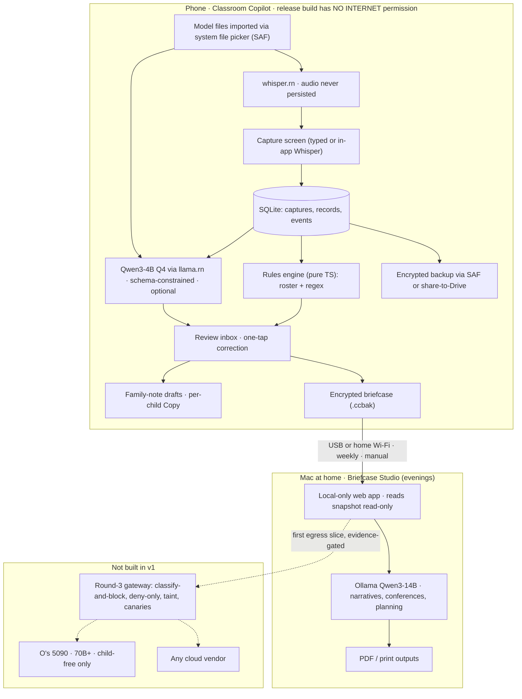
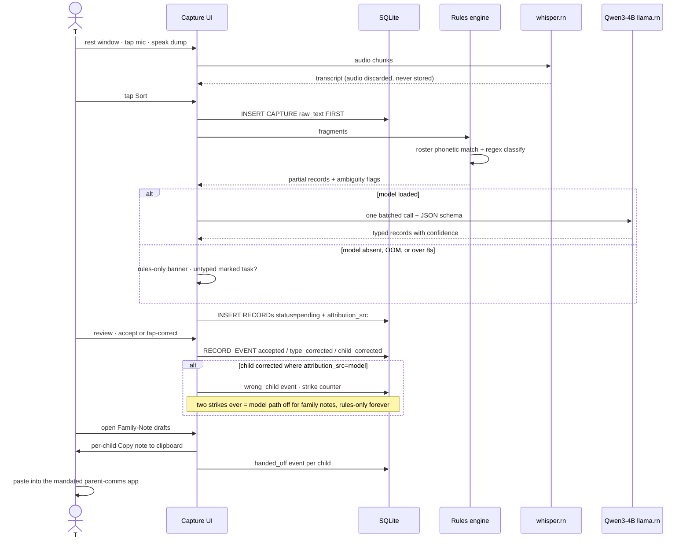
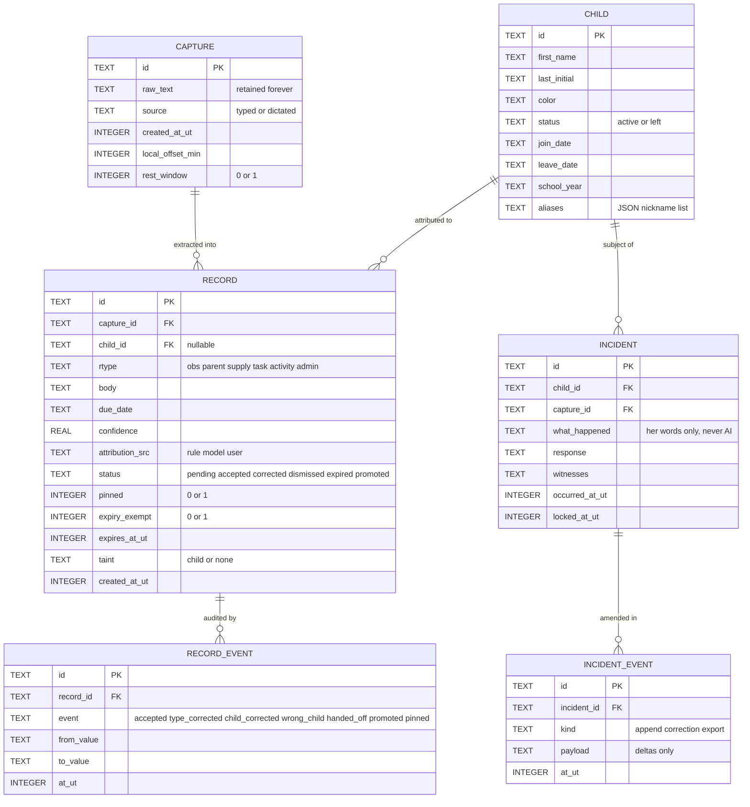
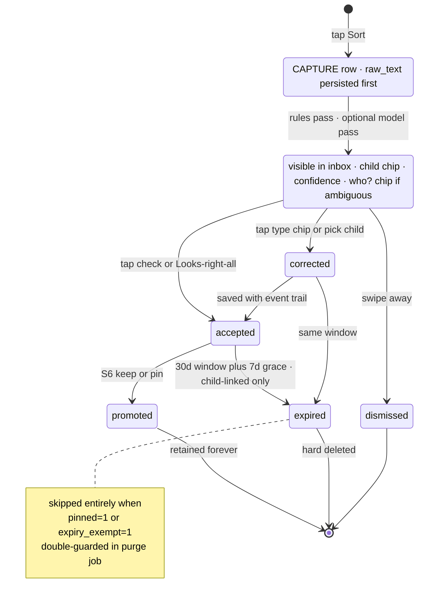

# GLM Consult

**Model:** glm-5.3
**Document:** docs/ai-workflow/brainstorms/classroom-copilot-2026-08-15/50-PACKET-R4-FULL.md
**Tokens:** 9544 in / 32000 out (reasoning: 20103) | total 41544
**Wall:** 741.7s

---

**Declared strongest angle: systems/architecture** (with security as its attached twin — in a local-first system they are the same discipline). That's where my deepest pass goes: the inference-placement finding below is an architecture call that quietly determines whether the product's one anchored moment physically works. Everything else — product, interaction, visual, strategy, synthesis — is covered in full, marked as such, in Part A and throughout the blueprint.

---

# THE THREE FINDINGS I WOULD DEFEND HARDEST

## Finding 1 — The core inference loop is assigned to the wrong device, and the locked decisions contradict themselves about it

Round 1 settled: *"Grammar-constrained JSON from a small on-device model; deterministic rules first"* — an **on-phone** model, in the app, via `llama.rn`. Rounds 3–4 then locked model tiers that put **T1 = her Mac** (Qwen3 8B) as the extraction brain. Nobody reconciled these. They cannot both be true, and the tier version is the wrong one:

- **The anchor moment is phone-shaped.** Midday rest with sleeping 2-year-olds: she is often required to remain in the room supervising; a laptop open next to a nap mat is awkward at best and against room norms at worst; the screen glow and keyboard are louder than a phone. Open question #1 ("where is the laptop at midday?") is still open **because the answer is "nowhere useful."** The design has spent three rounds treating this as a logistics question. It's an architecture verdict wearing a logistics costume.
- **Cold-start kills the window.** A 14B Q4 load is 8GB from disk: 10–30s before the first token, on a machine that may be asleep, at home, or unplugged. The rest window is realistically 40–90 minutes and shared with her lunch, sanitizing, and setup. The loop must complete in under 5 minutes total.
- **The phone is sufficient for THIS task.** This is not open-ended generation. It's closed-schema extraction over ≤120 spoken words into ~6 enum types plus roster attribution. A Qwen3-4B Q4_K_M (~2.4GB GGUF, 10–18 tok/s on a Snapdragon 8 Gen 3, ~2k context, JSON-schema-constrained) does this in seconds. The quality delta between 4B-on-phone and 8B-on-Mac at this task is small; the availability delta is total — one runs where she stands, the other runs in another room, possibly another building.

**Counter-argument I'd expect:** "The Mac gives better extraction, and O can support the same brain he runs." **Rebuttal:** keep the Qwen3 family everywhere (4B phone / 14B Mac / 70B O's box) and you keep the support story intact. And the real alternative to 4B-at-midday is not 8B-at-midday; it's *nothing* at midday, with the sort happening after school — i.e., after the family-note deadline the whole anchor exists to hit.

**Amendment:** restructure tiers as **T0 = rules (phone, always), T1 = Qwen3-4B (phone, the daily loop), T2 = Qwen3-14B (her Mac, evenings/weekly heavy jobs), T3 = O's 5090 (unbuilt), T4 = cloud (unbuilt).** Child-data ceiling unchanged: her phone + her Mac. The Mac becomes the strong engine for the jobs that are already evening-shaped (S6 conference binder, S8 display narratives, S11 planning) instead of a dependency for the one job that is midday-shaped.

## Finding 2 — The last 100 feet are undesigned: the product's value is realized *inside another app*, and the kill criteria can't see it

The loop ends when a family note lands in the mandated parent-comms app. That handoff — app draft → per-child paste into a third-party app, ×10–14 children, against a pickup deadline — is the single most repeated interaction in the product, and it appears nowhere in the brief, the slices, or the kill criteria.

- Kill criterion 1 measures "drafts family notes from the app." Drafting is not the value; **completed handoff** is. If copying is clumsy, she'll draft in the app once or twice "to be nice" and go back to typing directly into the parent app — and the habit metric will read false-positive for weeks.
- Kill criterion 2 (≥90% acceptance over 20 samples) is **currently unmeasurable**: nothing in the roadmap logs accept/correct events. The criteria are good; the instrumentation to enforce them does not exist and **cannot be retrofitted** — day-one behavior that wasn't logged is gone forever.
- Open question #2 (what the parent app records per child per day) isn't a nice-to-have inventory; it **determines the handoff format** (per-child fields vs. one class note, character limits, photo slots). S1's UI cannot be frozen before it's answered.

**Amendment:** a per-child **[Copy note]** affordance on a dedicated Family-Note Drafts screen, a `handed_off` event logged per copy, and an events table in v1 from the first build. Slices below make this S1c.

## Finding 3 — The locked input choice violates the locked privacy constraint, by the project's own rule

C1: child data never leaves her device. The locked primary input: *"text plus Gboard's on-device dictation."* Gboard's on-device dictation is **not provably on-device**: it depends on per-device settings, language support, account state ("voice activity"), and OS-update drift, and it falls back to server recognition silently. Dictating "C7 counted five bears" with real names is exactly the minor-specific behavioral-note class the project itself ranks highest-sensitivity.

The project already wrote the correct rule and then failed to apply it to its own keyboard: **uncertainty always blocks; the classifier may veto, never authorise.** An input path whose data flow you cannot verify and which can silently revert to cloud is not a control — it's a hope.

**Amendment:** long-form dictation moves **in-app** to on-device Whisper (`whisper.rn`, ggml base/small int8, ~75–150MB, trivial on an 8 Gen 3, ideal in a quiet rest room — the loud-room weakness of STT doesn't apply to the one window where dictation is promoted). Because the release build will have **no INTERNET permission at all** (see blueprint), in-app dictation is *provably* egress-free — the same guarantee the gateway aspires to, obtained by absence instead of by classification. Gboard remains for typed short notes; typed keystrokes stay local under default settings, which O verifies on setup day (clipboard history off, voice personalization reviewed).

---

# PART A — HOSTILE REVIEW

## A1. The locked decisions, one by one

| # | Locked decision | Verdict |
|---|---|---|
| 1 | v1 is one feature (paragraph → records → correction) | **Agree.** Correct and bravely small. |
| 2 | H0 is not an app; 5-day gate | **Agree, fix the measurement.** The gate is observed by O, who wants to build — conflict of interest. See A1.1. |
| 3 | Expo Android, TS, expo-sqlite, llama.rn "later" | **Agree platform; amend "later" → S1b.** And resolve the round-1 vs round-4 contradiction in favor of round 1 (Finding 1). |
| 4 | Phone/laptop do not sync | **Amend.** As written, S6 and S8 are unimplementable — conference prep and display narratives need the observations, which live on the phone. Amend to: *"no background sync, ever; deliberate teacher-initiated encrypted export ('briefcase') only."* The lock was defending against sync-engine complexity, which this preserves. |
| 5 | Voice fallback; dictation promoted in rest window | **Partially reverse.** Long-form dictation must be in-app Whisper (Finding 3). The rest-window promotion itself is right. |
| 6 | Midday rest anchor | **Agree — and it dictates the architecture** (phone-native loop, dark rest UI, Mac decoupled). The anchor is right; the tiers were built as if the anchor didn't exist. |
| 7 | Scratchpad; pinned + expiryExempt in v1 | **Agree with corrected rationale.** In SQLite, adding columns later is a trivial migration — that's *not* the rewrite risk. The genuinely unrecoverable things are: **event/telemetry history, raw-capture retention, and attribution provenance.** Those, not the flags, are the real "must exist in v1" (see B2). |
| 8 | Three kill criteria | **Agree; they're currently unmeasurable.** Define the events that feed them (B2), define "wrong child" (child-field correction where `attribution_src = model`), pre-register the sample. |
| 9 | Model tiers | **Restructure** per Finding 1. T3/T4 staying unbuilt: agree strongly. |
| 10 | Sensitivity outranks capability | **Agree — and apply it to Gboard** (Finding 3). It's currently applied selectively. |
| 11 | Child data never on O's 5090 | **Agree — and extend it to the place it's actually most likely to leak: O's development loop.** See A4, absence #4. |
| 12 | Separate vaults for T and O | **Agree.** No notes. |
| 13 | Ported hostile review | **Agree, cap the cadence** — review only outputs that leave her head (incident exports, display narratives, family-note drafts at most weekly). Reviewing the sorting pass is explicitly banned already; good. |
| 14 | Never AI-generate an incident narrative | **Agree — enforce architecturally, not by prompt.** The incident code path makes zero model calls; a unit test asserts the model service is never invoked (B6/S3). |
| 15 | Gateway: classify-and-block, deny-only, O installs boundary in person | **Right design, wrong v1.** In v1 nothing ever egresses — the gateway is dead code on day one. The strongest v1 "gateway" is **structural: the release build has no INTERNET permission**, so the app cannot exfiltrate even if every line of app code is compromised, dependency-poisoned, or prompt-injected. That is a control that holds when "the application code is untrusted" — round 3's own hardest requirement — and it costs one line of config. The classifier architecture is deferred to the first slice that introduces egress (T3/T4 era), where it belongs. The watchdog becomes: install-time + quarterly permission audit (`aapt dump permissions` shows no `android.permission.INTERNET`). |

### A1.1. The H0 gate has an observer problem

O set up the ritual, O wants the app, O judges "unprompted." Fix with three cheap moves:

1. **Pre-register** the gate definition and the kill decision in a dated file before the week starts.
2. Make the ritual produce **machine-checkable traces**: the brain-dump lands as a dated file in a fixed Mac folder (end of day, at home), and O photographs the paper triage sheet each evening (10 seconds). "Unprompted" = the trace exists and O did not remind her that day (O logs reminders honestly in the same file).
3. **Sunk-cost honesty:** O *may* build S1a during gate week (5 days of evenings; it keeps the timeline alive), but T does not see the app until the gate passes. The gate's function is evidence about *her habit*, not a prohibition on code. Pre-registration is what manages the conflict of interest — idleness doesn't.

## A2. Open questions — fatal, shaping, or non-problem

| Q | Triage | Why / action |
|---|---|---|
| 3. Employer policy on child data on personal devices | **Potentially fatal to everything, and costs one conversation.** Answer this *before* the app gate, not after. If personal devices are banned for child data, no amount of local-first engineering survives; the product becomes paper + the Mac-at-home, if even that. It has been treated as mid-ranked for three rounds while an entire tier architecture was designed around an unasked HR question. |
| 4. Real rest window / note deadline | **Fatal if wrong — the anchor is the product.** One question to T, this week. |
| 2. Parent-comms app field inventory | **Shapes S1's UI freeze** (handoff format, per-child vs class-wide, character limits). One conversation + screenshots. Blocks S1c design, not S1a. |
| 1. Where is the laptop at midday | **Dissolved by Finding 1.** Once the loop is phone-native, the laptop's midday location is irrelevant; the Mac does evening work at home, where it already is. |
| 5. Exact Samsung model | **Non-problem.** Any S24-class device runs the 4B tier. Confirm storage ≥128GB free-ish on setup day (model + DB + backups ≈ 3GB). |
| 6. School network permits mesh VPN | **Non-problem for v1** (T3 unbuilt). Defer to the T3 slice, where it was already handled by fallback-to-T2. |

## A3. The three unsolved problems — triage

1. **Browser channel voids the privacy claim.** Correctly diagnosed; correctly mitigated (make the local path good enough; stricter gates *increase* browser flight). Non-fatal, permanent, documented risk. The v1 contribution: since the app has no network, the browser is the *only* egress path that exists at all, and it's hers, on her phone, outside the system — an accepted risk with a name, which is the honest best available.
2. **Local model can launder taint.** Real, but **moot in v1** (no egress to launder toward). Their instinct — scope it as its own slice when the first egress feature exists — is right. Do the cheap part now: a `taint` column set at capture and propagated to every derived object (B2). The expensive part (store/tool-layer enforcement) waits for T3/T4 and should be its own slice then.
3. **"Proof" is the wrong standard.** Agree entirely. In v1 the honest metrics are: zero network permission (machine-checkable), canary corpus reserved for the T4 era, coverage reconciliation deferred with it. Deferring a metric you can't yet compute is not a hole; pretending to compute it is.

## A4. New absences — ranked by severity × likelihood × cost-to-fix-later

| # | Absence | Sev | Likel. | Cost-later | Lands in |
|---|---|---|---|---|---|
| 1 | **The handoff affordance** (Finding 2): per-child copy, `handed_off` events, format driven by parent-app inventory | Critical | High | Unfixable post-launch (metrics blind; habit dies quietly) | S1c; UI freeze blocked on Q2 |
| 2 | **Acceptance telemetry** (events table, attribution provenance, wrong-child strike counter) from build one | Critical | Certain | **Unrecoverable** — history not logged is gone | S1a schema |
| 3 | **Backup/restore slice is missing from the roadmap entirely.** Round 1 settled encrypted backup to her own cloud; S1–S12 contain no slice for it. Meanwhile incidents — the records that legally protect her — *never expire*, i.e., the system's most important data has no survival story for a lost phone in October | High | Med | A lost-phone event with no backup = permanent loss of exempt records | S1c (2–3d) + quarterly restore drill |
| 4 | **The development loop is the likeliest first leak.** O debugging with real captures — log lines, screenshots in git issues, remote JS debugging, fixtures "borrowed" from her DB — puts child data on O's machines and repo, violating lock #11 in spirit and soon in letter. Rule: **synthetic fixture corpus only; remote debugging off; logs redact record bodies; no real capture ever leaves her device, including to the builder** | High | High | A leaked dev artifact is a real breach with no rollback | S0 rule + enforced in repo hygiene from S1a |
| 5 | **Setup-day runbook.** Several locked controls are actually manual setup acts (Gboard clipboard history off, voice settings, screen lock + find-my-device, model sideload, roster entry, backup destination). Undocumented = drift. One page, executed by O in person (matching lock #15's spirit) | High | Certain | Drift silently defeats controls | S0, appended each slice |
| 6 | **Lock-screen / notification hygiene.** Android shows notification content on the lock screen by default; "C4 bit C9" glowing on a locked phone in a pickup line is a disclosure. v1 answer: **no notifications at all** — the app is pull-based, reminders live in Today | Med-High | Med | Cheap now; a habit of chatty notifications is hard to unwind | S1a decision |
| 7 | **Raw audio retention.** Dictated audio of toddler-room voices is biometric-adjacent PII of minors. Decide now: **transcribe-and-discard, never persist audio** | Med | Certain (once dictation is in-app) | Trivial now; a stored-audio trove later is a liability | S1b |
| 8 | **School-year rollover + mid-year joiner/leaver.** Roster deactivation (never deletion), display-board takedown flags when a child leaves, year-end archive of exempt records, roster reset. Flows can wait; **fields cannot** (`school_year`, `join_date`, `leave_date`, `status`) | Med | Certain by spring | Cheap now, awkward migration + lost provenance later | Schema S1a; flows S5/S6 |
| 9 | **Multilingual families.** Nobody in three rounds asked what languages her families read. If the class has ELL families, translated family-note drafts are high recurring value — Mac-side (14B), briefcase path, later | Med | Unknown | Low if Q2 inventory is taken (the parent app may already translate) | S13 candidate, post-S11 |
| 10 | **Spotlight prompts** (attention equity is downstream of noticing): at rest, one gentle question — "who was at the sand table today?" — feeds S9 and costs nothing | Low-Med | — | Low | Fold into S9 |
| 11 | **O's maintenance budget & version pinning.** Expo/llama.rn/OS updates will break things; nobody budgeted the roting. Pin everything, no `expo-updates` OTA, quarterly O hour | Med | Certain | The app dies of neglect by spring if ignored | Standing, from S1a |

## A5. Product / interaction / visual / strategy / synthesis verdicts (the non-architecture lanes, covered)

**Product.** The v1 feature is right; the roadmap's top logic (S2 morale-first, S3 protective record, S4 her stated #1) is right and the "flag it out loud if S4 must jump S3" honesty is right. The one product-level correction is Finding 2 — the product's actual deliverable is *a pasted note in someone else's app*, and the roadmap currently ends one step short of the deliverable.

**Interaction.** The riskiest unexamined moment is not dictation (quiet room, hands free — fine) but the **review-and-correct pass under time pressure**: 7 records, 4 minutes, one thumb. Consequences: "Looks right — all N" bulk accept with per-card undo; type corrections as one tap on an always-visible chip rail (the locked "one-tap correction" is honest only for type changes — child changes are two taps via bottom sheet; say so rather than promise falsely); every record permanently displays its child chip and confidence; ambiguity is surfaced as a visible "who?" chip, never silently resolved. Zero wrong-child tolerance is won or lost in attribution policy (B3, step 6).

**Visual.** The anchor window demands a **rest mode**: pure black background, white ≥18pt text, one 88dp mic button, live transcript, no animation, manual brightness — designed for a dark room with sleepers. Day-mode UI: bottom-anchored everything (thumb zone), 56dp+ primary targets, 64dp roster tiles (color + first name), consistent type-color language across every screen (teal obs / amber parent / violet supply / slate task / pink activity). Error copy is human and specific ("Model's asleep — sorted by rules only. Tap a type where I got it wrong."), never generic "Something went wrong." No emoji in incident contexts, ever.

**Strategy — the first three weeks.** Lives or dies on: midday loop under 5 minutes end-to-end; handoff genuinely faster than typing into the parent app; zero wrong-child; nothing that asks upkeep. Death mechanism, concretely: model TTFT over ~5s twice in one rest window → she sorts by hand in her head → app becomes a notes file → dead by week 3. Every design choice above (phone-local model, rules-first, bulk accept) exists to keep that loop under budget. The daily `events` table is the early-warning instrument: review it nightly in week 1–2, not at the end.

**Synthesis.** One principle silently organizes every correction in this review: **controls must be verifiable by someone who isn't standing there.** No-network beats a classifier (you can `aapt dump` it); fixtures beat a no-real-data policy (repo diff proves it); events beat impressions (SQL counts them); SAF import beats trust-in-keyboard-settings (absence of permission proves it). The v1 security posture is built entirely from **absences** — no network, no accounts, no SDKs, no notifications, no stored audio, no photos — and gates appear only when egress does. That is also why the gateway, however well designed in round 3, is the wrong thing to build first: v1's strongest boundary is an empty socket.

**Final-decider judgements, plainly:** WRONG — Mac-as-midday-inference (Finding 1). WRONG — Gboard dictation as primary long-form input under C1 (Finding 3). WRONG — trust hardening parked at S12 while backup doesn't exist at all. WRONG — "no sync" phrased so S6/S8 can't be built. MISFRAMED — kill criteria without instrumentation; "storage rewrite" risk located in flags rather than in unlogged history. Everything else locked survives hostile review substantially intact, which — after four rounds — is itself evidence the core is sound.

---

# PART B — BUILD BLUEPRINT

## B0. H0 (this week) — the non-app, with a measurable gate

1. O clones his local-assistant pattern onto her Mac, **separate vault, her instance** (locked decision). One standing inbox folder: `~/copilot/inbox/`.
2. Ritual (end of day, at home): T types or pastes one messy brain-dump into a standing note that lands in the inbox; the local assistant sorts it into a markdown triage file (MUST/SHOULD/EXTRA) and prints/updates the **paper triage sheet** for the next morning.
3. Phone habit: one notes-app template, three lines — `NEED: / SAW: / PARENT:` — no new apps on the phone.
4. **Gate:** ≥4 of 5 school days where (a) a dated dump file exists in the inbox AND (b) the paper sheet was used (O photographs it nightly) AND (c) O did not prompt her. Pre-register all of this in `DECISIONS.md` before day 1. O may build S1a in parallel; T sees no app until the gate passes.
5. Same week, in parallel — the S0 conversations (see B6). Especially the employer-policy question.

## B1. Architecture

```text
┌────────────────────────── PHONE (Galaxy S24-class) ──────────────────────────┐
│  Classroom Copilot — Expo dev-build target, RELEASE BUILD HAS NO             │
│  android.permission.INTERNET (verified: aapt dump permissions)               │
│                                                                              │
│  UI layer (React Native, styled-components)                                 │
│    CaptureScreen (rest mode + day mode) · InboxScreen · CorrectionSheet      │
│    FamilyNotesScreen · IncidentScreen · TodayScreen · Settings(O-gated)      │
│                                                                              │
│  Services (pure TS where possible)                                           │
│    rulesEngine      — sentence split, roster phonetic match, regex classify   │
│    extractionService— llama.rn, Qwen3-4B-Instruct Q4_K_M, JSON-schema-       │
│                       constrained output; OPTIONAL — app fully works without │
│    dictationService — whisper.rn ggml-base int8; audio never persisted       │
│    store            — expo-sqlite, raw SQL + typed helpers, no ORM           │
│    handoff          — per-child Clipboard.setStringAsync                     │
│    backup           — WebCrypto AES-256-GCM, key = PBKDF2(expo-crypto)       │
│                       writes .ccbak via SAF; share-sheet → her Drive app     │
│    modelImport      — SAF ACTION_OPEN_DOCUMENT → copy GGUF into sandbox      │
│                       (no network needed, ever)                              │
└──────────────────────────────────────────────────────────────────────────────┘
        │ deliberate encrypted briefcase (USB / home Wi-Fi), weekly, manual
┌────────────────────────── MAC (home, evenings) ──────────────────────────────┐
│  Briefcase Studio — small local web app (Vite + Node, localhost only)        │
│  Reads decrypted snapshot READ-ONLY · runs Ollama Qwen3-14B for the heavy    │
│  jobs (S6 conference binder, S8 display narratives, S11 planning, later      │
│  translation). Outputs PDFs/print. No writeback to phone in v1.              │
└──────────────────────────────────────────────────────────────────────────────┘
┌────────────────────────── O'S 5090 / ANY CLOUD ──────────────────────────────┐
│  NOT BUILT IN v1. T3 (child-free only, mesh) and T4 activate only with a     │
│  future evidence-gated slice, at which point the round-3 gateway design      │
│  (classify-and-block, deny-only, taint propagation, canaries) ships WITH     │
│  the first egress path, not before.                                          │
└──────────────────────────────────────────────────────────────────────────────┘
```

**Why no-network is the real v1 boundary.** The app cannot leak what it cannot send — this holds against bugs, poisoned dependencies, and prompt injection alike (round 3's untrusted-application requirement), costs one config line, and is machine-auditable. Dev/debug builds keep network for Metro; her daily build does not have the permission at all. Model files enter via the system file picker (SAF), which needs no INTERNET permission. Backups reach her cloud *through the OS*: the app hands an encrypted file to the Drive app via share sheet — the developer of Copilot never operates anything, satisfying round 1's operator-avoidance exactly.

**Known integration risk (flagged, with fallback):** `llama.rn` inside an Expo dev build on current RN/Hermes. If it stalls, S1b slips and the app still ships — the rules-only path is a locked design feature, not a degradation mode we're embarrassed by.

**Storage layout on device (app sandbox):**

```text
/files/copilot/
  copilot.db            # expo-sqlite DB (see B2); OS file-based encryption at rest
  models/
    qwen3-4b-q4km.gguf  # ~2.4GB, imported via SAF on setup day
    whisper-base.int8.gguf
  backups/              # .ccbak staging before share-to-Drive
  logs/                 # redacted diagnostics (event counts, errors — never record bodies)
```

## B2. Data model

Every table, every field. `UT` = Unix ms UTC. The v1-must-exist list at the end is ordered by *unrecoverable-if-missing*, which is the actual rewrite risk — not column additions, which SQLite migrations handle trivially.

**CHILD**
| field | type | notes |
|---|---|---|
| id | TEXT PK | uuid |
| first_name | TEXT NOT NULL | what she calls them |
| last_initial | TEXT | |
| color | TEXT NOT NULL | chip color, chosen to avoid collisions |
| status | TEXT CHECK IN (`active`,`left`) | deactivation, never deletion |
| join_date / leave_date | TEXT ISO date | mid-year churn, rollover |
| school_year | TEXT NOT NULL | e.g. `2026-27`; rollover partitioning |
| aliases | TEXT JSON | nicknames, dictation variants ("Emmy"/"Emers") |

**CAPTURE** — the raw dump, retained always (it is the audit + re-extraction source).
| field | type |
|---|---|
| id TEXT PK · raw_text TEXT NOT NULL · source TEXT CHECK IN (`typed`,`dictated`) · created_at_ut INTEGER · local_offset_min INTEGER · rest_window INTEGER 0/1 |

**RECORD**
| field | type | notes |
|---|---|---|
| id | TEXT PK | |
| capture_id | TEXT FK→CAPTURE | provenance |
| child_id | TEXT FK→CHILD NULL | NULL = unattributed (visible "who?" chip) |
| rtype | TEXT CHECK IN (`obs`,`parent`,`supply`,`task`,`activity`,`admin`) | closed enum, chip-rail order |
| body | TEXT NOT NULL | cleaned fragment |
| due_date | TEXT NULL | "tomorrow" resolved at capture |
| confidence | REAL | model or rule score |
| attribution_src | TEXT CHECK IN (`rule`,`model`,`user`) | feeds the wrong-child strike counter |
| status | TEXT CHECK IN (`pending`,`accepted`,`corrected`,`dismissed`,`expired`,`promoted`) | |
| pinned | INTEGER 0/1 | locked: exempt from expiry |
| expiry_exempt | INTEGER 0/1 | locked: set for incident links & promoted items |
| expires_at_ut | INTEGER NULL | null while pending; set on acceptance (default +30d, O-managed setting) |
| taint | TEXT CHECK IN (`child`,`none`) | round-3 deferral made cheap; propagates to every derived object |
| created_at_ut / accepted_at_ut | INTEGER | |

**RECORD_EVENT** — the kill criteria live here. Append-only.
| field | type |
|---|---|
| id TEXT PK · record_id FK · event TEXT CHECK IN (`accepted`,`type_corrected`,`child_corrected`,`edited`,`dismissed`,`wrong_child`,`handed_off`,`promoted`,`pinned`) · from_value TEXT · to_value TEXT · at_ut INTEGER |

**INCIDENT** (schema ships in S1a; UI is S3). Append-only after lock.
| field | type |
|---|---|
| id TEXT PK · child_id FK NOT NULL · capture_id FK NULL · what_happened TEXT NOT NULL (her words only) · response TEXT · witnesses TEXT · occurred_at_ut INTEGER · notified TEXT JSON · locked_at_ut INTEGER NULL |

**INCIDENT_EVENT** — id PK, incident_id FK, kind CHECK IN (`append`,`correction`,`export`), payload TEXT (deltas only, never full rewrites), at_ut.

**DONE_ITEM** — id PK, label TEXT, source TEXT CHECK IN (`auto_from_record`,`manual`), record_id FK NULL, day TEXT ISO, at_ut.
**PARKING_ITEM** — id PK, text TEXT, created_at_ut, promoted_to_record_id FK NULL.
**SETTING** — key TEXT PK, value TEXT. O-gated behind a long-press gesture; T never sees settings (lock C5).

**Indexes:** `records(child_id,status)`; `records(expires_at_ut) WHERE status='accepted' AND pinned=0 AND expiry_exempt=0`; `record_events(record_id)`; `record_events(event, at_ut)`; `captures(created_at_ut)`.

**Must exist in v1 because missing them later is unrecoverable (ordered):**
1. `RECORD_EVENT` rows written from the first build — acceptance rate, wrong-child strikes, and handoff counts are the kill criteria; unlogged history cannot be reconstructed.
2. `CAPTURE.raw_text` retained — re-extraction after model changes, and any audit, die without it.
3. `attribution_src` — strikes must distinguish model guesses from user choices.
4. `pinned` / `expiry_exempt` (locked — agreed).
5. `taint` — one column now; a retrofit across derived objects later is the real rewrite.
6. `school_year`, `join_date`, `leave_date`, `status` on CHILD — cheap now, spring-rollover-blocking later.

## B3. The capture → extract → correct loop (with every failure path)

1. **Enter.** Rest window: Capture screen in rest mode (black, giant mic). She taps mic, speaks the dump; whisper.rn streams a live transcript; **audio is never written to disk**. Day mode: she types. Either way: one text blob, zero pre-organization (C4).
2. **Persist raw first.** `CAPTURE` row inserted before any processing. If the app dies here, the dump survives — worst case she triages it manually later. *(Failure path: DB write error → blob held in memory, screen shows "not saved yet," retry loop; never silently drop.)*
3. **Rules pass (deterministic, always runs).** Sentence-split → per fragment: roster match (exact, then fuzzy ≤2 edits, then phonetic against names + aliases) → regex classify (supplies "need/low/out of", dates "tomorrow/Friday", parent markers "mom asked/dad said", activity asks) → due-date resolution.
4. **Ambiguity handling.** Two roster candidates within threshold → fragment marked `ambiguous`, rendered with a "who?" chip showing both children. **The rules never guess; the model never guesses silently; only she resolves ambiguity.** Unattributed fragments stay unattributed with a visible chip. *(This rule is the wrong-child-kill-criterion's first line of defense.)*
5. **Model pass (optional tier).** Fragments still untyped or low-confidence go to Qwen3-4B in **one batched call**, JSON-schema-constrained (`llama.rn` schema support), ≤2k context. Schema: array of `{fragment_id, rtype, child_code|null, confidence}`. Model may only choose from the enum and the roster — it cannot invent children or types. *(Failure paths: model not imported → skip to 6 with rules-only banner; OOM → release model, retry rules-only; >8s wall clock → cancel, rules-only. All three are the same UX: "Model's asleep — rules sorted N of M. Tap what's missing.")*
6. **Attribution policy.** Explicit name match → `rule`. Pronoun/ellipsis resolution → `model`, and only within the same fragment chain after a named child; otherwise null. Every record shows its child chip + confidence forever. Corrections to `child_id` where `attribution_src='model'` log a `wrong_child` event; **two cumulative → local flag disables model extraction for family-note paths permanently** (locked kill criterion), app continues rules-only.
7. **Review.** Inbox lists pending records (newest capture's records expanded, rest collapsed). Per record: ✓ accept, ✎ edit, ✕ dismiss. Type correction = one tap on the card's chip rail. Child correction = tap chip → bottom-sheet roster grid (64dp tiles) → tap child. "Looks right — all N" bulk-accepts with per-card undo (toast, 5s).
8. **Handoff.** FamilyNotesScreen builds per-child drafts **from accepted `obs`/`parent` records only**, never from incidents. Per-child **[Copy note]** → clipboard → she pastes into the mandated app. Each copy logs `handed_off(child_id)`. *(Failure path: clipboard set fails → screen shows the note as selectable text; she long-press-selects. Never a dead end.)*
9. **Expiry.** On acceptance, child-linked non-exempt records get `expires_at_ut = +30d` (O-managed). A purge job hard-deletes expired+7d-grace records, guarded by **two independent checks** (`pinned=0 AND expiry_exempt=0`) plus a negative join against incidents/promotions; guarded by a unit test that attempts to delete exempt fixtures and asserts failure. Weekly purge count goes to `logs/` as a number only — no content (the audit-log-is-sensitive trap, avoided at app scale).
10. **Backup.** Any time from Settings: dump DB → AES-256-GCM encrypt (PBKDF2 passphrase, 600k iters, salt+versioned header) → `.ccbak` → SAF save or share-to-Drive. Restore: SAF-pick → decrypt → verify schema version → replace. Quarterly restore drill on O's test device (runbook B8).

## B4. Diagrams









## B5. Wireframes (phone-width; `(tap)` marks ≥48dp targets; all primary actions bottom-anchored)

### 1 · Capture — rest mode (the anchor screen)

```
┌──────────────────────────────────────┐  pure black, brightness hint shown
│                                      │  on first use
│                                      │
│         ( ▶ MIC · 88dp ▷ )           │  (tap) hold the phone, talk
│                                      │
│   "c4 had a hard time cleaning       │  live transcript, ≥18pt
│    up… c7 loved the playdough,       │  white on black, no animation
│    counted 5 bears… need wipes…      │
│    parent asked about nap…"          │
│                                      │
│   [ ⌨ keyboard ]     [ SORT → ]      │  (tap 56dp) both bottom-anchored
└──────────────────────────────────────┘
  loading:  "…listening" (mic pulses once, then static — no glow loop)
  empty:     "Nothing yet. Dump your brain — the messiest
              paragraph wins."
  error:     "Mic said no. Type it instead — ⌨ never fails."
```

### 2 · Inbox / review (day mode)

```
┌──────────────────────────────────────┐
│  Tue Sep 8 · rest 12:40      ⚙ long-│  (long-press 2s = O settings)
│├────────────────────────────────────┤
│  TO REVIEW · 7                        │
│  ┌────────────────────────────────┐  │
│  │ ▐C7▌ counted 5 bears at the    │  │  teal child chip = attribution
│  │      playdough table           │  │
│  │ OBS·0.9        [✓][✎][✕]      │  │  (tap each 48dp)
│  ├────────────────────────────────┤  │
│  │ ▐C4▌ hard time at cleanup      │  │
│  │ OBS·0.7   who? [C4][C9]       │  │  ambiguity surfaced, never guessed
│  ├────────────────────────────────┤  │
│  │ ── wipes running low ── SUPPLY │  │  violet, no child
│  │ [OBS][PARENT][SUPPLY][TASK][+] │  │  chip rail = one-tap type fix
│  └────────────────────────────────┘  │
│  [ ✓ Looks right — all 7 ]  (56dp)   │  bulk accept + 5s undo toast
│                              ( + )    │  FAB (tap 64dp)
└──────────────────────────────────────┘
  loading:  "Sorting… model warming (~2s)" skeleton cards
  empty:    "Clean slate. Nothing to review." + ( + ) pulsing once
  error:    "Model's asleep — rules sorted 5 of 7.
             Tap a type on the rest." banner persists, amber
```

### 3 · Correction sheet (bottom sheet)

```
┌──────────────────────────────────────┐
│  Edit record                       ✕ │  (tap 48dp)
│  ┌────────────────────────────────┐  │
│  │ counted 5 bears at playdough   │  │  editable text (tap)
│  └────────────────────────────────┘  │
│  CHILD                               │
│  ▐C7▌ ▐C4▌ ▐C2▌ ▐C9▌  ⋯9 more      │  64dp color tiles (tap)
│  TYPE                                │
│  [OBS][PARENT][SUPPLY][TASK][ACT]    │  one tap = corrected
│  KEEP                                │
│  ( ) normal · expires in 30d         │
│  (•) pinned — never expires          │
│        [ Save ]         [ Delete ]   │  (tap 56dp)
└──────────────────────────────────────┘
  (sheet has no loading state; local-only writes are instant)
  error: "Couldn't save — showing unsaved dot ●. Try again."
```

### 4 · Family-note drafts (the last 100 feet)

```
┌──────────────────────────────────────┐
│  Family notes · 14:10 · 3 of 12 ⧗    │
│  Paste into the parent app, per child│
│  ┌────────────────────────────────┐  │
│  │ C7 — loved the playdough       │  │
│  │ today and counted five bears   │  │
│  │ all by herself!                │  │
│  │            [ ⧉ Copy note ]     │  │  (tap 56dp) → clipboard
│  ├────────────────────────────────┤  │
│  │ C4 — worked really hard on     │  │
│  │ cleanup today, needed two      │  │
│  │ tries but did it ♡             │  │
│  │            [ ⧉ Copy note ]     │  │
│  └────────────────────────────────┘  │
│  ✓ copied: C7 C2 C5 · remaining: 9   │
│  [ ⧉ Copy all as text ]              │  class-note fallback
└──────────────────────────────────────┘
  empty:   "No accepted observations yet. Review first?"
  error:   clipboard fail → notes render as selectable text,
           "long-press to copy" hint
```

### 5 · Incident (S3) — the never-AI screen

```
┌──────────────────────────────────────┐
│  INCIDENT RECORD                     │
│  ⚠ You write this. The assistant     │
│    checks fields. It never writes    │
│    the account. Ever.                │
│  Child: [ C3 ▾ ]   Time: [12:07 ▾]  │  (tap)
│  What happened — your words:         │
│  ┌────────────────────────────────┐  │
│  │ Fell from the low slide, bump  │  │  plain textarea, no suggestions
│  │ on forehead, cried ~2 min,     │  │  no autocomplete, no AI
│  │ ice pack, calm by 12:15        │  │
│  └────────────────────────────────┘  │
│  Response:  [ice · comfort · recheck]│  chip multi-select
│  Parent notified: (•) at pickup ( )app│
│  [ 🔒 Lock & keep forever ]  (56dp)  │  append-only after this
└──────────────────────────────────────┘
  error: "NOT LOCKED — battery died? Text is saved. Lock when
          you're back." (draft persistence is the error state)
```

### 6 · Today — MUST/SHOULD/EXTRA (S4)

```
┌──────────────────────────────────────┐
│  TODAY · Tue Sep 8                   │
│  MUST                                │
│  ☐ family notes ×12 · 9 done         │  auto from handed_off events
│  ☐ print family photos               │
│  SHOULD                              │
│  ☐ laminate labels                   │
│  EXTRA                               │
│  ☐ apple activity idea               │
│  ────────────────────────────────    │
│  DONE TODAY ✓                        │
│  wipes logged · 2 obs · new song x2  │  auto-fills from records
│                              ( + )    │
└──────────────────────────────────────┘
  empty:  "Nothing yet today. It'll come."
```

### 7 · Settings / backup (O-gated)

```
┌──────────────────────────────────────┐
│  SETUP (O)                           │
│  Model: qwen3-4b · loaded ✓ 2.3GB    │
│  [ Import model via Files ] (SAF)    │
│  Expiry window: [30d ▾]  exempt: 2   │
│  Strikes (wrong child): 0 of 2       │
│  ────────────────────────────────    │
│  [ 🛡 Backup now → .ccbak ]          │
│  [ ♻ Restore from backup… ]          │
│  [ View events export (CSV, redacted)]│
└──────────────────────────────────────┘
  error: backup fail → "File didn't write. Try again — your
         data is safe on the phone either way."
```

## B6. Slice order (day estimates are focused build-days for one builder; hard acceptance test each)

| Slice | Days | Ships | Hard acceptance test |
|---|---|---|---|
| **S0 · Facts & policy gate** | 0.5 + conversations | Employer-policy answer in writing; rest window + note deadline confirmed; parent-app field inventory (screenshots); phone model/storage confirmed; pre-registered H0 gate in `DECISIONS.md` | All five answers exist as dated entries before S1a UI freeze |
| **S1a · Capture core, rules-only** | 5 | Capture (typed), roster CRUD, rules engine, review inbox, chip corrections, full schema incl. events/incident tables, no-INTERNET release profile | The round-1 sample paragraph (synthetic names) → ≥5 records; every correction ≤2 gestures; `aapt dump permissions` on release APK shows no INTERNET; event rows written from first run |
| **S1b · On-device extraction + dictation** | 6 | llama.rn 4B + JSON schema; whisper.rn in rest mode; ambiguity flow; strike counter; rules-only fallback flag | 20-paragraph synthetic corpus → ≥85% type/child accuracy, **0 wrong-child**; full sort ≤8s wall clock; kill the model file → app remains fully usable, amber banner shown |
| **S1c · Handoff + backup + lock** | 3 | FamilyNotesScreen with per-child copy + `handed_off` events; encrypted backup/restore; biometric app-lock (10
