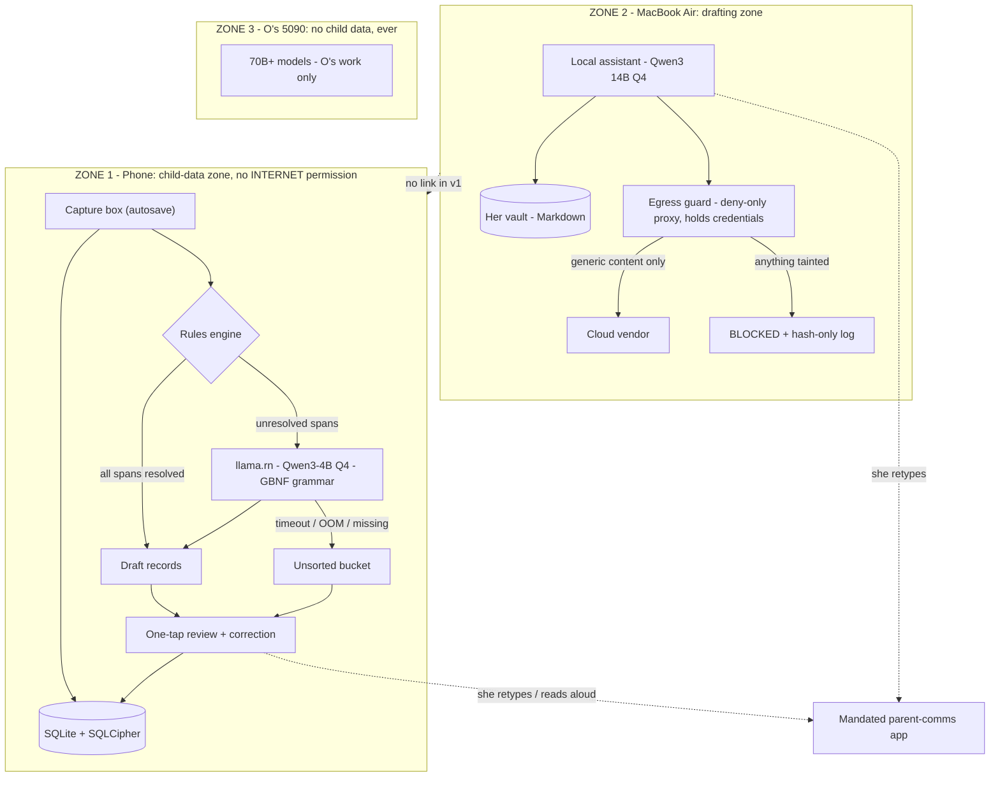
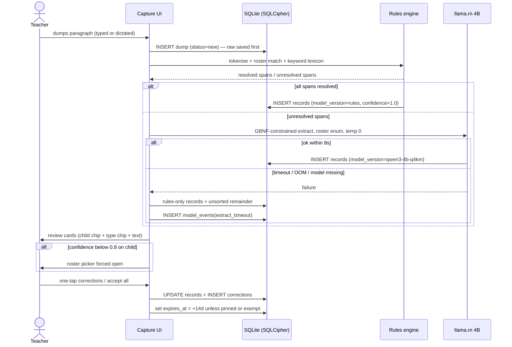
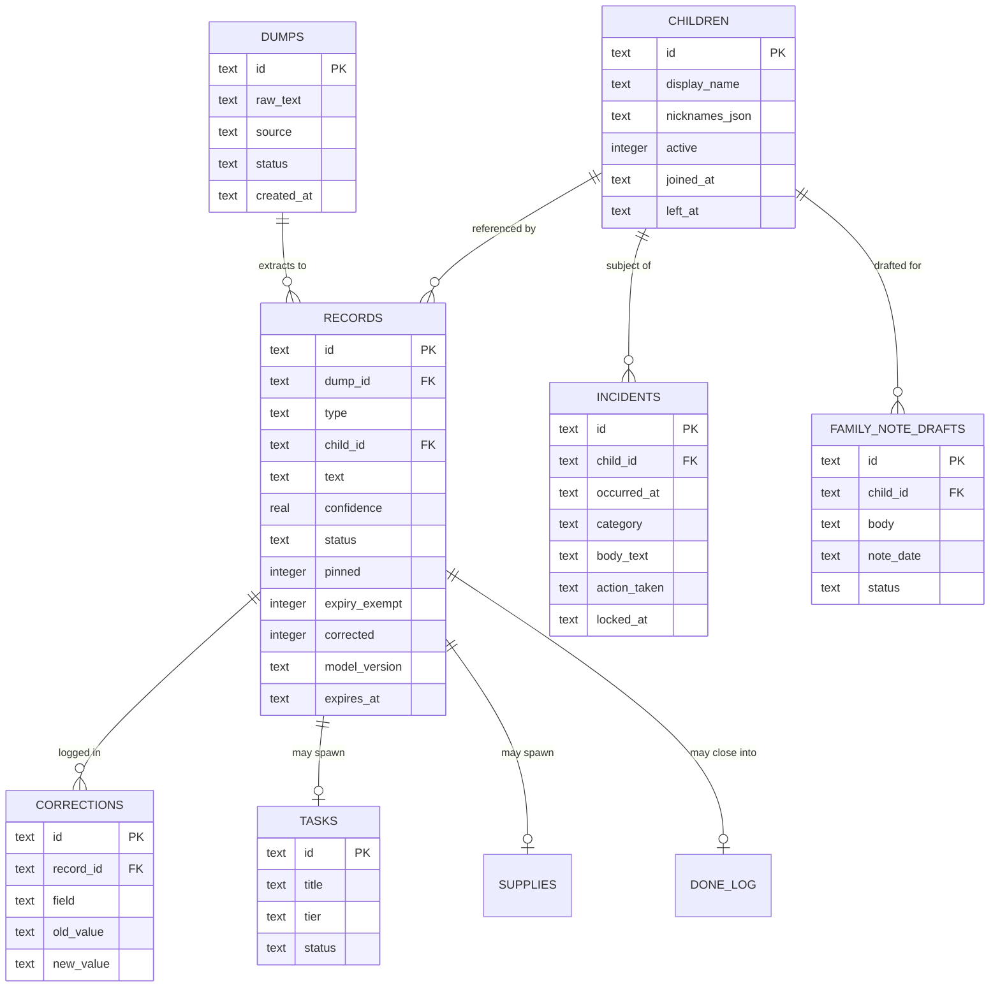
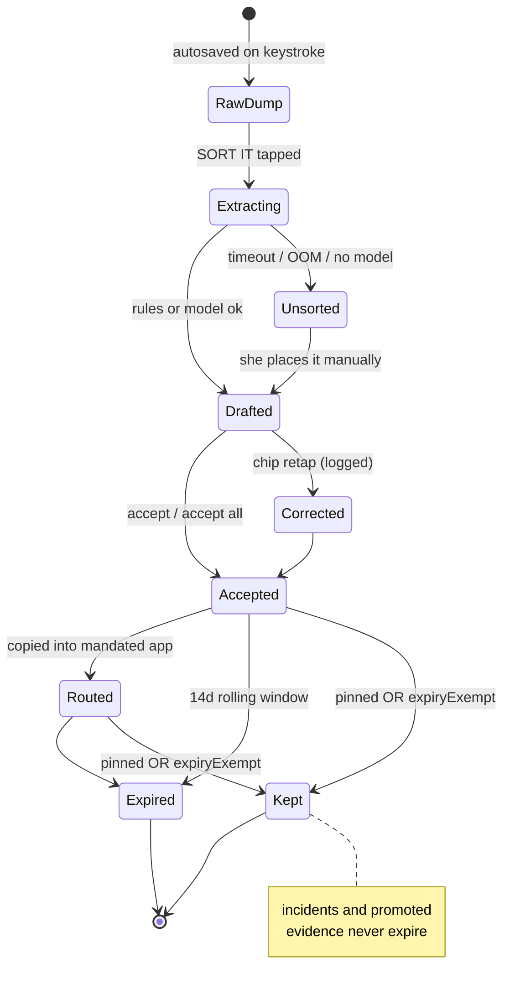

# Kimi K3 - Review

**Reviewer:** `moonshotai/kimi-k3` (high)
**Document:** docs/ai-workflow/brainstorms/classroom-copilot-2026-08-15/50-PACKET-R4-FULL.md
**Seed:** (none)
**Tokens:** 9712 in / 18819 out | **Cost:** ~$0.3114 | **Wall:** 518.3s | **finish_reason:** stop

---

# ROUND 4 — FULL-SPECTRUM HOSTILE REVIEW + BUILD BLUEPRINT

**Strongest angle declaration:** Security & privacy is my strongest lane, and it gets the deepest pass (§A.0 and the threat model woven through §B). Systems architecture is my second. Every other angle — product, interaction, visual, strategy, synthesis, final-decider — is covered in §A, §B, and §D regardless.

---

## THE THREE FINDINGS I WILL DEFEND HARDEST

**Finding 1 — The gateway guards the front door of a house with no walls. The real egress channels are the OS, the keyboard, and the SDKs — and none of them are in the threat model.**
The entire Round-3 edifice — classify-and-block, deny-only classifier, watchdog — protects one channel: deliberate API calls from the assistant. Meanwhile, on the phone that actually holds the child data: (a) **Android Auto Backup is on by default** in an Expo app and ships the SQLite database to the user's Google Drive — child data leaves the device with zero code written; (b) **"Gboard's on-device dictation" is an assumption, not a fact** — on Samsung devices, voice typing can fall back to network speech recognition unless the offline pack is installed and verified, which means child data egresses through the *keyboard*, below every layer you designed; (c) any analytics/crash SDK (Firebase, Sentry, EAS Update's phone-home) is an egress channel with a supply chain attached. The fix is not a better classifier. The fix is architectural: **the child-data app ships with no `INTERNET` permission at all** (model delivered by USB on setup day, updates by APK), `android:allowBackup=false`, no third-party network SDKs, and dictation verified offline on setup day or disabled for child content. This lands in `app.json` / `AndroidManifest.xml` and the setup-day checklist. If you do one thing from this review, do this.

**Finding 2 — The locked architecture has no tier for the phone, so the product's core loop has no specified brain.**
Read the locked decisions together: capture is phone-first; the timing anchor is the midday rest window; child-data-capable models are T1/T2 = *her Mac*; phone and laptop do not sync. So at 12:47 with a messy paragraph on her phone, **where does extraction run?** The tier table never assigns the phone a tier. Either the phone runs an on-device model (then say so, spec it, and pay the 2.5GB RAM / 3GB storage / battery cost) or extraction is deferred to the Mac — which delivers value after the family-note deadline, the exact failure the timing-anchor catch was supposed to prevent. Open Question 1 ("where is the laptop at midday?") is not a question; it is the symptom of this hole. Resolution specified in §B.1: the phone is **T0** — Qwen3-4B Q4 via `llama.rn`, rules-first, model-as-fallback — and the Mac is demoted to the evening/weekly drafting tool. This lands in S1 and the model-tier table.

**Finding 3 — The wrong-child kill criterion, as locked, is a plan to destroy the product — and the schema to even *measure* it doesn't exist yet.**
"Two wrong-child errors and the model path dies permanently, rules-only forever" sounds rigorous. It is actually a suicide pact: rules-only extraction cannot resolve "the little boy who had a rough drop-off" to a roster child either, so the day the model path dies, the *product* dies — the one feature is extraction. And none of the three kill criteria are measurable without a `corrections` table and a `model_events` table in the **v1** schema, which the current data-model discussion never mentions. The correct design: child attribution is **never free text** — it is a grammar-constrained enum over the 10–14-child roster, low-confidence attributions are forced through a confirmation tap (not silently accepted), every correction is logged, and the response to wrong-child errors is **graduated degradation** (raise confirmation threshold → shrink model scope → rules-plus-manual), not permanent death. This lands in the `records`/`corrections` tables, the GBNF grammar, and the review screen.

---

# A. HOSTILE REVIEW

## A.0 Deepest pass — Security & privacy (my strongest angle)

### Threat model, stated properly for the first time

Assets: developmental/behavioural/bodily-function notes on 10–14 named two-year-olds; incident records (legally protective, legally sensitive); family circumstances; O's business/medical/immigration data (dual-use layer). Adversaries: (1) a commercial cloud vendor retaining prompts; (2) a lost/stolen/inspected phone; (3) a compromised or subpoenaed personal cloud account; (4) a prompt-injected local model laundering taint into clean prose; (5) the school's own IT/policy apparatus discovering child data on a personal device; (6) — say it out loud — **O himself, as a person outside the authorised circle**, and O's future unavailability.

### The egress surface, ranked by actual leak probability

| Channel | Today | Leak mechanism | Fix |
|---|---|---|---|
| Android Auto Backup | **open** | DB + prefs → Google Drive, silently | `allowBackup=false`, `fullBackupContent=false` |
| Keyboard dictation | **unverified** | network speech recognition fallback | verify offline pack on setup day, else disable for child text |
| Third-party SDKs (analytics, crash, EAS Update) | **open by default** | telemetry + supply chain | none in the child-data app; local crash log only |
| Clipboard | open | paste into browser/chat | app never auto-copies child text; "copy" is always a deliberate tap with a plain-text preview |
| Notification previews | open | child name on lock screen | notifications carry no content ("3 records to review") |
| Browser tab (the known void) | open by design | paste into vendor chat | accepted risk; mitigation is local-path quality, correctly framed in the brief |
| The gateway itself | designed | — | deny-only, correctly framed |

The brief's own honest flag about the browser void is right, and the mitigation is right. But the browser is the channel she *chooses*; the OS channels are the ones she never sees. **The honest name for the whole system is not "privacy boundary" — it is "egress inventory."** You cannot guard what you have not listed. The setup-day checklist in §B.6/S0 is the inventory made executable.

### At-rest and device loss

`expo-sqlite` does not encrypt by default. The child-data store must be SQLCipher (Expo SDK ≥52 supports SQLCipher in `expo-sqlite`; if the pinned SDK doesn't, use `op-sqlcipher`), key in Android Keystore, app-level PIN with biometric unlock. Device loss then degrades to "lost encrypted blob," which is the paper-notebook-equivalent posture the legal frame assumes. **Backup passphrase:** a non-technical user *will* forget a passphrase. Mandate a paper recovery key, written by hand on setup day, kept in her classroom drawer — not photographed, not in O's vault.

### The taint-laundering problem — scoped as its own slice, as the brief demands

The brief is correct that this is unsolved and correctly refuses to pretend otherwise. Concrete mechanism for the store layer: every row carries `taint` (bitmask: `CHILD`, `FAMILY`, `MEDICAL`, `FINANCIAL`). Taint is set at write time by the capture path (roster match ⇒ `CHILD`), **propagates by union through every transform** (any derived row ORs its sources' taint), and is checked at the tool boundary: any tool whose effect is egress refuses tainted input, full stop. The local model never sees a "please clean this" path that clears taint — taint is cleared only by a human retyping, which is the one transform that genuinely re-derives content. This is slice G3 in §B.6.

### Audit log trap — solved

The brief names the trap (a redaction log is a concentrated sensitive store). Solution: the gateway logs **hashes and classifications, never payloads** — `sha256(payload)`, detected classes, decision, timestamp, destination. Canary verification works against hashes. The coverage check (destination's records must match gateway log exactly) works on hashes. Nobody ever needs the payload to audit the boundary.

### The maintainer is the vulnerability

"Installed once, in person, by O" + "she will not maintain a system" + a watchdog = a system whose entire maintenance posture is one person who is not the user. Hostile review must say the quiet part: travel, illness, a bad month, a breakup — any of these turns her copilot into unmaintained infrastructure holding child data. Mitigations: the watchdog must **page O** (not log silently); the app must **fail safe without O** (rules-only mode is fully usable forever — this is already a locked decision and it is the right one, hold it); and every setup-day action must produce a one-page printed runbook she can hand to *any* technical person.

## A.1 The locked decisions, attacked one by one

| Locked decision | Verdict | What breaks |
|---|---|---|
| v1 = one feature (paragraph → records → one-tap correction) | **Hold.** | Correct. The failure mode is scope creep by O, not the decision. |
| H0 is not an app; 5-day gate, ≥4 unprompted days | **Hold, with a caveat.** | The gate measures *habit*, but habit without *value* is a false pass — she can do the ritual because it's novel. Add one question on day 5: "did the sorted output save you time on family notes?" If no, the gate failed even at 5/5. |
| Expo Android, TS, styled-components, expo-sqlite, llama.rn | **Hold, amended.** | Add: SQLCipher, Keystore, `allowBackup=false`, no INTERNET permission, no EAS Update. The stack as locked is fine; the *manifest* as locked is a leak. |
| Phone and laptop do not sync | **Mis-framed. Rewrite.** | The correct decision is "**no server, no cloud, no account**" — not "no sync." A same-room, end-to-end-encrypted local sync (Wi-Fi direct, initiated by her, during the rest window) keeps data on her two devices, makes nobody an operator, and dissolves Open Question 1. For v1, no sync is acceptable *only if* Finding 2 is fixed (phone is self-sufficient). Lock the right thing. |
| Voice is fallback; rest-window exception | **Half wrong.** | The rest window is not the exception — it is *the* window. The anchor is midday; the room is dark and quiet; her hands are free; dictation is the primary input *at the moment that matters most*. Promote dictation to co-primary in the rest window, contingent on the offline-verification check. |
| Timing anchor: midday rest window | **Hold.** | Best catch in the project. But it is unconfirmed (Open Q4) — confirm on day one, and make the window a setting she can move. |
| Scratchpad, not archive + pinned/expiryExempt in v1 schema | **Hold.** | Kimi's catch is right and the amendment is right. I am extending it: `corrections` and `model_events` are in the same category — retrofit is a rewrite. See §B.2. |
| Three kill criteria | **Fix #3 (Finding 3).** | Habit and accuracy criteria are good. Wrong-child "zero, full stop, permanent death" is replaced with graduated degradation + forced confirmation on low confidence. |
| Model tiers T1–T4 | **Incomplete — add T0.** | The phone is T0: Qwen3-4B-Instruct Q4_K_M (~2.5GB), llama.rn, GBNF-constrained, 8s timeout, rules-first. Child data: yes (it never leaves the device — there is no network to leave through). T2 remains the ceiling for child data *on the Mac*. T3 unchanged. T4 unchanged. |
| Sensitivity outranks capability | **Hold.** | Correct, and the no-INTERNET-permission posture makes it enforceable rather than aspirational. |
| Child data never reaches O's 5090 | **Hold.** | Correct reasoning, correctly accepted. Extend: child data never reaches O's *anything* — including his Hermes logs, his vault, and his backup drives. Setup-day rule. |
| Separate vaults | **Hold.** | Correct. The shared household vault is fine. |
| Hostile review fork (local 14B for child-data work) | **Hold.** | Correct trigger ("does this output leave her head and go somewhere real?"). |
| Never AI-generate an incident narrative | **Hold, harden.** | Extend the ban: the model may not *summarise, paraphrase, or "improve"* an incident record either. Field-completeness checks only. An LLM-polished incident narrative is a fabrication with good grammar. |
| Gateway: classify-and-block primary, deny-only, installed once by O, watchdog | **Hold, renamed.** | Accept the brief's own honest rename: "assistant egress guard." Add the OS-level inventory above, or the guard is a turnstile in an open field. |

## A.2 Open questions — fatal, non-problem, or mis-framed

| # | Question | Verdict |
|---|---|---|
| Q3 | Employer policy on child info on personal devices | **FATAL and blocking — check before setup day, before H0 ends.** If the policy forbids it, the app is dead and the survivors are: paper triage sheet, the Mac assistant for child-free planning, and the DONE list. This is not an "open question," it is a *precondition*, and it is currently scheduled as an afterthought. One phone call from her to her director answers it. |
| Q4 | Real rest window + family-note deadline | **Fatal to the anchor if wrong; trivially cheap to confirm.** Ask her on day one. Make it a setting. |
| Q1 | Laptop location at midday | **Mis-framed.** Not a question — a design requirement: *the phone must not depend on the Mac.* Once T0 exists (Finding 2), the laptop's location stops mattering for the core loop. |
| Q2 | What the parent-comms app already records | **High value, not fatal.** If it already captures per-child daily notes with structure, the copilot's family-note drafting shrinks to a copy-paste bridge — which changes S6–S8 priority, not v1. |
| Q5 | Exact Samsung model | **Non-problem.** S24-class is certain enough; confirm RAM ≥12GB on setup day. |
| Q6 | School network + mesh VPN | **Non-problem for her.** T3 never touches child data, so this only affects O's dual-use layer. Note it and move on. |

## A.3 The three unsolved problems — verdicts

1. **Browser channel:** correctly framed, correct mitigation. Non-fatal. Do not tighten the gate.
2. **Taint laundering:** correctly framed, genuinely unsolved, scoped as slice G3. Fatal to the *gateway's claims* if ignored; not fatal to the *copilot* (which has no egress at all under the no-INTERNET posture — note that the copilot sidesteps this problem entirely, which is another argument for Finding 1's fix).
3. **"Proof" is the wrong standard:** correct. Adopt the proposed triad — measured miss-rate under adaptive attack, canary values, destination-coverage check — as the gateway's acceptance test (G4).

## A.4 The absences, round 2 — what is *still* not there

The brief asks for another whole-category absence. Here are four, ranked:

1. **The OS as an egress channel** (Finding 1). An entire attack surface — backup, keyboard, clipboard, notifications, SDKs — absent from every round. Highest severity × likelihood product in this review.
2. **Roster lifecycle.** Children join and leave mid-year; the round-2 brief named it and the roadmap *still has no slice for it*. It is not a slice — it is three screens in S1 (add child, deactivate child, edit nicknames), because the extraction grammar is built from the roster and a child who joins in October is invisible to the sorter until someone edits a list. Also: roster setup is the *entire onboarding* and must take under 10 minutes or H1 dies on day one.
3. **The setup day itself.** Nobody has specced the 90 minutes where O installs everything: model via USB, offline dictation verified, backup passphrase + paper recovery key, roster entry, rest-window setting, employer-policy confirmation. S0 in §B.6. The project has a slice for supplies and no slice for *the day the whole thing becomes real*.
4. **Photos.** Nobody has said the word, which means someone will build it. Photos of children on a personal device, outside the mandated parent app, are the single worst policy and storage decision available. It goes on the do-NOT list at the top.

## A.5 Findings register — ranked by severity × likelihood × cost-to-fix-later

| # | Finding | S | L | C-fix-later | Lands in |
|---|---|---|---|---|---|
| 1 | Auto Backup / keyboard / SDK egress | 10 | 9 | 2 (fix now) / 10 (after launch) | `app.json`, manifest, S0 |
| 2 | No phone tier → core loop brainless at anchor time | 9 | 10 | 8 (re-architecture if discovered post-S1) | S1, tier table |
| 3 | Wrong-child criterion unmeasurable + product-killing | 8 | 8 | 7 (schema + grammar rewrite) | `records`, `corrections`, GBNF, review UI |
| 4 | Employer policy unchecked | 10 | 4 | ∞ (invalidates everything) | S0, one phone call |
| 5 | expo-sqlite unencrypted at rest | 8 | 5 | 6 (migration of live DB) | S1 storage layer |
| 6 | Passphrase loss = total data loss | 7 | 8 | 1 (paper key, day one) | S0, backup flow |
| 7 | O bus-factor / watchdog pages nobody | 6 | 6 | 5 | G-slices, runbook |
| 8 | Roster lifecycle missing | 6 | 9 | 3 | S1 screens |
| 9 | Rest window unconfirmed | 8 | 3 | 2 (it's a setting) | S0 |
| 10 | Audit log stores payloads | 7 | 5 | 4 | G2 (hash-only logging) |

---

# B. BUILD BLUEPRINT

*Written for a competent builder with zero project context. Where a decision is not stated here, it is stated in §A; where it is stated nowhere, do not improvise — pick the option that touches less data.*

## B.1 Architecture — components, boundaries, what runs where

**Three machines, three trust zones, no servers anywhere.**

**ZONE 1 — Phone (Galaxy S24-class, 12GB). The child-data zone.**
- Expo (SDK ≥52) Android app, TypeScript, styled-components.
- `expo-sqlite` with SQLCipher; DB key in Android Keystore; biometric + PIN app lock.
- **No `INTERNET` permission. No `ACCESS_NETWORK_STATE`. No third-party SDKs. No EAS Update.** Model file (~2.5GB) and app updates delivered by USB/APK from O. This is the load-bearing decision: it converts "child data never leaves the device" from a promise into a *physical property*.
- `android:allowBackup="false"`, `android:fullBackupContent="false"`.
- Extraction: deterministic rules engine first (TypeScript, pure functions); fallback `llama.rn` running **Qwen3-4B-Instruct Q4_K_M**, temperature 0, GBNF grammar constraining output to the schema in §B.3, 8-second hard timeout, model unloaded when idle >5 min (RAM and battery).
- Dictation: Gboard voice typing **only after** offline speech recognition is verified on setup day (airplane-mode test: dictate a sentence with radios off; if it fails, dictation is disabled for child content and the setting says so).

**ZONE 2 — MacBook Air (24GB floor). The drafting zone.**
- Ollama (or LM Studio) serving **Qwen3 14B Q4** locally — the child-data ceiling on this machine, and the fallback for everything.
- Her vault: plain Markdown files, same folder architecture as O's, separate instance. Weekly reset, conference prep, display-board narratives drafted here in H2.
- The egress guard (Round 3 component) lives here as a **local proxy process** holding all provider credentials; apps hold none. Deny-only classifier (the 14B), uncertainty blocks, hash-only audit log, watchdog that notifies O on drift. This zone is dual-use architecture but **her instance and O's instance share nothing but code**.

**ZONE 3 — O's 5090. The no-child-data zone.**
- 70B+ models over the encrypted mesh. Child data: never, including in logs, caches, and backups. Enforced by policy + the guard, verified by canaries.

**Boundary rules:** Phone ↔ Mac: no sync in v1 (phone is self-sufficient). If H2 wants it: same-room Wi-Fi-direct, E2E encrypted, user-initiated, no server. Mac → vendors: only through the guard, only child-free content. Phone → anywhere: nothing, ever, at the OS level.

## B.2 Data model — every table, every field

All tables live in one SQLCipher database on the phone. IDs are `TEXT` (UUIDv4). Timestamps are `TEXT` ISO-8601 local time. `INTEGER` booleans are 0/1.

```sql
children(
  id TEXT PK,
  display_name TEXT NOT NULL,        -- roster label she recognises
  nicknames_json TEXT NOT NULL,      -- ["C4","nickname","initials"] feeds rules + grammar
  color TEXT NOT NULL,               -- chip colour; NEVER the only encoding
  active INTEGER NOT NULL DEFAULT 1, -- 0 = left mid-year; rows kept, hidden from pickers
  joined_at TEXT NOT NULL,
  left_at TEXT,
  sort_order INTEGER NOT NULL
)

dumps(
  id TEXT PK,
  raw_text TEXT NOT NULL,            -- the messy paragraph, verbatim, never edited
  source TEXT NOT NULL,              -- 'typed' | 'dictated'
  status TEXT NOT NULL,              -- 'new' | 'processed' | 'partial'
  created_at TEXT NOT NULL,
  processed_at TEXT
)

records(
  id TEXT PK,
  dump_id TEXT NOT NULL REFERENCES dumps(id),
  type TEXT NOT NULL,                -- 'observation'|'child_followup'|'parent_followup'
                                     -- |'supply'|'prep_task'|'activity_idea'|'incident_seed'
  child_id TEXT REFERENCES children(id),   -- NULL = not child-linked
  text TEXT NOT NULL,                -- extracted item text
  confidence REAL NOT NULL,          -- 0.0–1.0; rules=1.0 on exact roster match
  status TEXT NOT NULL,              -- 'draft'|'accepted'|'corrected'|'unsorted'|'routed'
  pinned INTEGER NOT NULL DEFAULT 0,        -- v1 REQUIRED (retrofit = rewrite)
  expiry_exempt INTEGER NOT NULL DEFAULT 0, -- v1 REQUIRED (legal protection)
  corrected INTEGER NOT NULL DEFAULT 0,     -- feeds accuracy kill metric
  model_version TEXT,                -- 'rules' | 'qwen3-4b-q4km' — provenance per row
  created_at TEXT NOT NULL,
  expires_at TEXT                    -- created_at + 14d for child-linked, NULL otherwise
)
CREATE INDEX idx_records_child ON records(child_id, created_at);
CREATE INDEX idx_records_type_status ON records(type, status);
CREATE INDEX idx_records_expiry ON records(expires_at) WHERE expiry_exempt = 0 AND pinned = 0;

incidents(                            -- S3; NEVER model-written
  id TEXT PK,
  child_id TEXT NOT NULL REFERENCES children(id),
  occurred_at TEXT NOT NULL,
  category TEXT NOT NULL,             -- 'injury'|'behaviour'|'toileting'|'illness'|'other'
  body_text TEXT NOT NULL,            -- her words only; model may check completeness, never write
  injury_location TEXT,
  witnesses TEXT,
  action_taken TEXT NOT NULL,
  parent_notified_at TEXT,
  parent_notified_by TEXT,
  created_at TEXT NOT NULL,
  locked_at TEXT                      -- set on parent notification; row becomes append-only
)

tasks(
  id TEXT PK,
  title TEXT NOT NULL,
  tier TEXT NOT NULL DEFAULT 'should',  -- 'must'|'should'|'extra'  (S4)
  due_date TEXT,
  status TEXT NOT NULL DEFAULT 'open',  -- 'open'|'done'|'dropped'
  source_record_id TEXT REFERENCES records(id),
  created_at TEXT, done_at TEXT
)

supplies(id TEXT PK, item TEXT NOT NULL, status TEXT NOT NULL DEFAULT 'needed',
         source_record_id TEXT REFERENCES records(id), created_at TEXT, purchased_at TEXT)

parking_lot(id TEXT PK, idea_text TEXT NOT NULL, created_at TEXT, reviewed_at TEXT)

done_log(id TEXT PK, text TEXT NOT NULL,
         source_record_id TEXT REFERENCES records(id), done_at TEXT NOT NULL)

family_note_drafts(
  id TEXT PK,
  child_id TEXT REFERENCES children(id),  -- NULL = whole-class note
  body TEXT NOT NULL,
  note_date TEXT NOT NULL,
  status TEXT NOT NULL DEFAULT 'draft',   -- 'draft'|'copied'
  copied_at TEXT
)

corrections(                          -- v1 REQUIRED: the kill metrics live here
  id TEXT PK,
  record_id TEXT NOT NULL REFERENCES records(id),
  field TEXT NOT NULL,                -- 'child' | 'type' | 'text'
  old_value TEXT, new_value TEXT,
  created_at TEXT NOT NULL
)

model_events(                         -- v1 REQUIRED: telemetry, local only, never leaves
  id TEXT PK,
  event TEXT NOT NULL,                -- 'extract_ok'|'extract_timeout'|'extract_error'
                                      -- |'rules_only'|'wrong_child_confirmed'
  detail TEXT,
  created_at TEXT NOT NULL
)

settings(key TEXT PK, value TEXT)     -- rest_window_start, rest_window_end,
                                      -- dictation_verified_offline, backup_passphrase_hint
meta(key TEXT PK, value TEXT)         -- schema_version = 1
```

**Fields that must exist in v1 because adding them later is a storage rewrite:** `pinned`, `expiry_exempt`, `corrected`, `model_version`, `confidence`, the whole `corrections` table, the whole `model_events` table, `children.active`/`left_at`. Everything else can migrate cheaply.

## B.3 The capture → extract → correct loop — exact sequence

1. **Capture.** App opens to the input box, keyboard up, autosave on every keystroke into `dumps` (status `new`). Raw text is persisted *before* any processing — extraction can fail, the dump cannot be lost.
2. **Rules pass (always first, <50ms).** Tokenise; match roster names/nicknames/initials (from `children.nicknames_json`); keyword→type lexicon ("wipes|glue|paint"→supply; "parent|mum|dad|asked"→parent_followup; "counted|stacked|said|played"→observation; "fell|bit|hit|bump"→incident_seed). Sentence-split the dump; each sentence becomes one candidate record.
3. **Decision:** if every sentence has a type and every child reference resolved to exactly one roster entry → write `records` with `model_version='rules'`, confidence 1.0, go to step 6.
4. **Model pass (fallback).** Prompt: system instruction + roster enum + the unresolved sentences. GBNF grammar constrains output to:
   ```json
   {"records":[{"type":"...","child":"<one of roster | null>","text":"...","confidence":0.0}]}
   ```
   `child` is an **enum over the roster** — the model cannot invent a child. Temperature 0. Timeout 8s.
5. **Failure paths (all non-blocking):** timeout / OOM / model file missing → write rules-resolved records, dump the remainder into `status='unsorted'`, log `model_events`, show the rules-only banner. **The app is fully usable in this state forever.**
6. **Review.** One card per record: child chip, type chip, text. Tap child chip → roster picker (§B.5, Screen 4). Tap type chip → type picker. **Any record with confidence <0.8 on child attribution arrives with the picker already open** — forced confirmation, not silent acceptance. "Accept all" commits.
7. **Log.** Every chip change writes a `corrections` row and sets `records.corrected=1`. A confirmed wrong-child writes `model_events(event='wrong_child_confirmed')`.
8. **Route & expire.** Child-linked records get `expires_at = now + 14d` unless pinned/exempt. A nightly (on-open) sweep deletes expired rows. Family-note drafts are assembled from today's accepted child records when she opens the app in the rest window.

## B.4 Mermaid diagrams









## B.5 Wireframes — every v1 screen, all states

Phone-width, monospace. Tap targets in `[ ... ]`; all primary targets ≥48dp, bottom-half thumb zone. Example content is real, names are roster codes only.

### Screen 1 — Capture (home). Happy path:

```
┌────────────────────────────────────┐
│ 12:47                          [⚙] │ ← [⚙] = Settings
│ Tue · rest window · 12 here today  │
│ ┌────────────────────────────────┐ │
│ │ today was crazy. C4 had a hard │ │
│ │ time cleaning up. C7 loved the │ │
│ │ playdough. need more wipes. a  │ │
│ │ parent asked about nap. forgot │ │
│ │ to print the family pictures   │ │
│ └────────────────────────────────┘ │
│ [ 🎤 DICTATE ]      (verified ✓)   │ ← tap target
│ ┌────────────────────────────────┐ │
│ │            SORT IT             │ │ ← primary target, 56dp
│ └────────────────────────────────┘ │
│ today: 1 dump · 6 records · 4 done │
└────────────────────────────────────┘
```

Empty state (no text yet):

```
│ ┌────────────────────────────────┐ │
│ │ Dump it here. Messy is fine.   │ │
│ │                                │ │
│ │ "C7 counted 5 bears, need      │ │
│ │  glue sticks, call C2's mum"   │ │
│ └────────────────────────────────┘ │
│ [ 🎤 DICTATE ]                     │
│ [ SORT IT ]  (greyed until text)   │
```

Loading state (after SORT IT):

```
│ ┌────────────────────────────────┐ │
│ │ Sorting…                       │ │
│ │ ▓▓▓▓▓▓▓▓░░░░░░░░               │ │
│ │ rules ✓ · model thinking…      │ │
│ └────────────────────────────────┘ │
│ (never blocks longer than 8s)      │
```

Error state (model missing / failed — rules-only):

```
│ ⚠ On-device model unavailable.     │
│ Sorted what rules could; 2 items   │
│ are in UNSORTED for you to place.  │
│ [ CONTINUE ]                       │
```

### Screen 2 — Review (extracted records). Happy path:

```
┌────────────────────────────────────┐
│ [←] SORTED · 6 records  [ACCEPT ✓] │ ← [ACCEPT ✓] = accept all
│ ┌────────────────────────────────┐ │
│ │ [C4 ▾] OBSERVATION             │ │ ← [C4 ▾] = tap to reassign child
│ │ had a hard time cleaning up    │ │
│ │ [type ▾]            [✕ delete] │ │
│ ├────────────────────────────────┤ │
│ │ [C7 ▾] OBSERVATION             │ │
│ │ loved the playdough            │ │
│ ├────────────────────────────────┤ │
│ │ [— ▾] SUPPLY                   │ │
│ │ need more wipes                │ │
│ ├────────────────────────────────┤ │
│ │ [C2 ▾] PARENT FOLLOW-UP        │ │
│ │ asked about nap                │ │
│ ├────────────────────────────────┤ │
│ │ [— ▾] PREP TASK                │ │
│ │ print the family pictures      │ │
│ ├────────────────────────────────┤ │
│ │ ⚠ [?? ▾] OBSERVATION           │ │ ← low confidence: picker
│ │ "he had a rough drop-off"      │ │   forced open on entry
│ └────────────────────────────────┘ │
└────────────────────────────────────┘
```

Empty state:

```
│ Nothing to review.                 │
│ Dump a paragraph on the home       │
│ screen and tap SORT IT.            │
```

Error state (extraction failed entirely):

```
│ ⚠ Couldn't sort that one.          │
│ Your words are saved — nothing is  │
│ lost.                              │
│ [ PLACE ITEMS MYSELF ]  [ DISMISS ]│
```

### Screen 3 — Unsorted / manual triage (the error-path screen):

```
┌────────────────────────────────────┐
│ [←] UNSORTED · 2 items             │
│ ┌────────────────────────────────┐ │
│ │ "the thing with the blocks     │ │
│ │  after lunch"                  │ │
│ │ [ assign child ▾ ]             │ │ ← tap target
│ │ [ assign type  ▾ ]             │ │ ← tap target
│ ├────────────────────────────────┤ │
│ │ "she said the thing again"     │ │
│ │ [ assign child ▾ ]             │ │
│ │ [ assign type  ▾ ]             │ │
│ └────────────────────────────────┘ │
│ [ SAVE ]                           │
└────────────────────────────────────┘
```

Empty: `All sorted. Nothing waiting.` — Loading: not applicable (local read, <16ms; show skeleton cards if ever >100ms).

### Screen 4 — Correction sheet (modal over Review):

```
┌────────────────────────────────────┐
│ WHICH CHILD?              [cancel] │
│ ┌────────────────────────────────┐ │
│ │ [ C1 ] [ C2 ] [ C3 ] [ C4 ]    │ │ ← 48dp grid targets,
│ │ [ C5 ] [ C6 ] [ C7 ] [ C8 ]    │ │   name + colour chip,
│ │ [ C9 ] [ C10] [ C11] [ C12]    │ │   never colour alone
│ │                                │ │
│ │ [ — not about a child — ]      │ │
│ └────────────────────────────────┘ │
└────────────────────────────────────┘
```

Type sheet is identical in structure: `[OBSERVATION] [CHILD FOLLOW-UP] [PARENT FOLLOW-UP] [SUPPLY] [PREP TASK] [ACTIVITY IDEA]`. Error state: none possible (pure choice). Loading: none.

### Screen 5 — Settings / status. Happy path:

```
┌────────────────────────────────────┐
│ [←] SETTINGS                       │
│ Model:    ready ✓ (Qwen3-4B,       │
│           on-device, no network)   │
│ Dictation: offline verified ✓      │
│ Backup:   last export Tue 15:02 ✓  │
│ Roster:   12 children · [EDIT]     │ ← add/deactivate/rename
│ Rest window: 12:30–14:00  [EDIT]   │
│ ────────────────────────────────── │
│ Last 20 records: 18 accepted,      │
│ 2 corrected · wrong-child: 0       │ ← the kill metrics, visible to her
│ ────────────────────────────────── │
│ [ EXPORT ENCRYPTED BACKUP ]        │
│ Recovery key: written on paper ✓   │
└────────────────────────────────────┘
```

Error states: `Model: NOT INSTALLED — rules only. Hand this to O.` / `Backup: 9 days since last export ⚠ [EXPORT NOW]`. Empty state: first run → `Roster: 0 children — [ADD YOUR CLASS]` blocking everything else.

## B.6 Slice order — day estimates + hard acceptance tests

**S0 · Setup day (1 day, O + T in person).** *Ships:* app installed via APK, model via USB, roster entered, offline dictation verified (airplane-mode test), backup passphrase + paper recovery key, rest window set, employer policy confirmed, printed runbook. *Acceptance:* with the phone in airplane mode, she dictates a dump, sorts it, corrects one record, exports a backup. All pass or nothing else starts.

**S1 · Capture core (12–15d).** *Ships:* §B.3 end-to-end. *Acceptance:* the verbatim example paragraph from the brief sorts into ≥5 correctly-typed records with zero child misattribution; airplane-mode the phone and repeat — identical result; kill the app mid-extraction — raw dump survives.

**S2 · DONE list + parking lot (2d).** *Acceptance:* every accepted record offers "mark done"; Friday view shows the week's DONE count without scrolling.

**S3 · Incident record (4d).** *Acceptance:* she completes an incident in <3 minutes; the model cannot write any field (attempt → refusal message); locking on parent-notification makes the row append-only.

**S4 · Triage must/should/extra (3d).** *Acceptance:* one tap re-tiers any task; the "today" view shows only MUSTs by default. *(If week-2 data shows triage distress, this jumps S3 — knowingly, out loud, with her.)*

**S5 · Weekly reset (2d).** *Acceptance:* Friday flow carries open tasks forward and archives the week in <5 taps.

**S6 · Promote-to-keep + conference binder (4d).** *Acceptance:* pinning a record sets `expiry_exempt`; per-child binder view shows pinned records oldest-first.

**S7 · Sub/sick day sheet (2d).** *Acceptance:* generates a one-page printable from roster + routines + this week's notes.

**S8 · Display-board narratives (4d, Mac-side).** *Acceptance:* one observation → the four-part narrative scaffold; she edits every sentence before it's shown as final.

**S9 · Attention equity + patterns (3d).** *Acceptance:* "C9 — 9 days since last observation" appears on the home screen; no child hits 14 days silently.

**S10 · Supplies queue (2d).** *Acceptance:* supply records auto-list; one tap marks purchased.

**S11 · Lesson planning (5d, Mac-side, child-free → guard-eligible).** *Acceptance:* weekly plan drafts into her spreadsheet format.

**S12 · Trust hardening (3d).** *Acceptance:* 20-record accuracy audit runs from `corrections` in one tap; results match the Settings screen numbers.

**Gateway slices (O's side, parallel):** G1 proxy + credential custody (3d) · G2 deny-only classifier + hash-only log (4d) · G3 taint propagation at the store/tool layer (5d) · G4 adversarial corpus + canaries + coverage check (ongoing; gate: measured miss-rate reported, not asserted).

## B.7 The do-NOT list

1. **No photos.** Ever. The mandated app owns photos; a personal-device photo store of children is the worst available decision.
2. **No INTERNET permission "for later."** The moment it exists, every future feature will find a reason to use it.
3. **No analytics, crash-reporting, or update SDKs.** Local crash log only; updates by APK.
4. **No accounts, login, or cloud sync server.** That is the operator trap from the legal frame.
5. **No AI-written, AI-summarised, or AI-polished incident content.** Field checks only.
6. **No taxonomy editor, settings maze, or "customise your categories."** C5 is load-bearing.
7. **No points/reward tracker in v1–v2.** It's a second product wearing a feature's clothes.
8. **No streaks, badges, or gamification.** The DONE list is morale; streaks are obligation.
9. **No notification content.** "3 records to review," never a child's name on a lock screen.
10. **No auto-copy to clipboard.** Copying child text is always a deliberate tap with preview.
11. **No "just this once" cloud button** in the child-data app. T4 stays unbuilt until evidence.
12. **No multi-user / multi-teacher mode.** The enterprise fork is answered in Round 2: enterprise-grade for this product means *robust, recoverable, trustworthy* — not shared infrastructure.

---

# C. THE REMAINING ANGLES, COVERED

**Product.** Right thing, right order — with one correction: the roadmap's own honest flag (her stated #1, triage, lands at S4) is resolved correctly by the conditional jump, but S2 at 2 days is the best morale-per-day in the project and should ship the moment S1 stabilises, not a week later. The product's real competitor is paper + the parent app; the honest answer to "what does she gain" is: *the sorting, the DONE list, and the protective record* — and that is enough, and it is only enough if capture costs under 10 seconds.

**Interaction.** Twelve two-year-olds means: one hand, paint on fingers, eyes on the room. Hence: autosave (no save button), keyboard up on open, zero required fields, 56dp primary target in the thumb zone, forced-confirmation only where the cost of error is a wrong child. The rest window is a **dark room with sleeping toddlers** — the app must auto-switch to a dim dark theme during the configured window; a bright white screen at 12:47 is an interaction failure nobody listed.

**Visual.** Hierarchy: the SORT IT button is the loudest element on the home screen; record cards are the loudest on review. Type ≥18sp, contrast ≥4.5:1, child chips carry **name + colour, never colour alone** (colour-only coding fails at arm's length, in dim light, and for colour-weak users). One screen = one job; no tabs in v1.

**Strategy — the first three weeks.** Week 0: S0 + H0 gate + the employer-policy phone call (the cheapest fatal-risk retirement in the project). Weeks 1–2: app only if gated; the kill metrics render from `corrections`/`model_events` — which is why those tables are v1. Week 3: the Friday weekly reset is the retention ritual; if she opens the app on Friday unprompted, the product lives. The biggest strategic risk is O: he will want to build S8–S11 because they're interesting. The do-NOT list is addressed to him.

**Synthesis — what the pieces say together that none says alone.** Every layer of this design assumes the danger is the *model* — wrong extractions, cloud vendors, laundering. But the ranked findings say the danger is the *plumbing and the people*: the OS backup nobody disabled, the keyboard nobody verified, the passphrase nobody wrote down, the maintainer nobody can replace, the policy nobody checked. The model is the most scrutinised and least dangerous component in the system. Build the boring inventory first; the intelligence is already over-engineered relative to its risks.

**Final-decider judgement — where the existing decisions are simply WRONG, plainly:**
1. "Phone and laptop do not sync" is the wrong lock. Lock "no server, no cloud, no account" instead; and the tier table is wrong by omission — **add T0 (the phone) or the core loop has no brain at the moment that matters.**
2. "Two wrong-child errors and the model path dies permanently" is wrong. It is a plan to kill the product on its first bad week. Graduated degradation + forced confirmation + logged corrections.
3. "Gboard's on-device dictation" as a locked *fact* is wrong. It is an unverified claim about a third-party component on a Samsung device. Verify on setup day or disable.
4. expo-sqlite as locked is wrong as specified — unencrypted at rest. SQLCipher + Keystore or the legal posture is fiction on a lost phone.
5. Scheduling the employer-policy check as an "open question" is wrong. It is a precondition, it costs one phone call, and it can invalidate everything downstream. Make the call this week.
