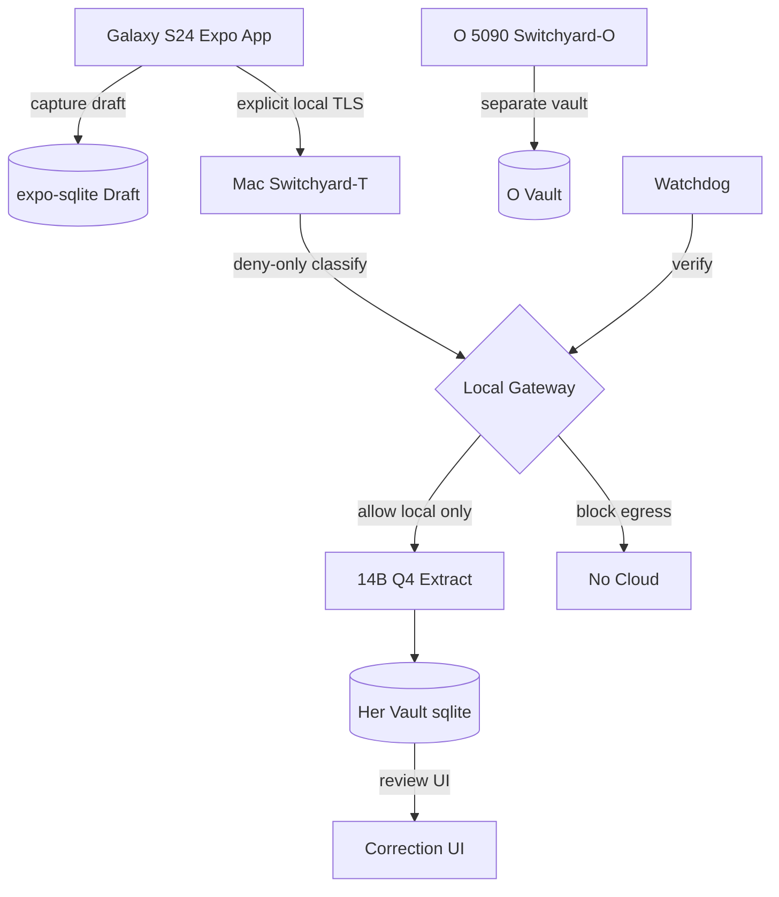
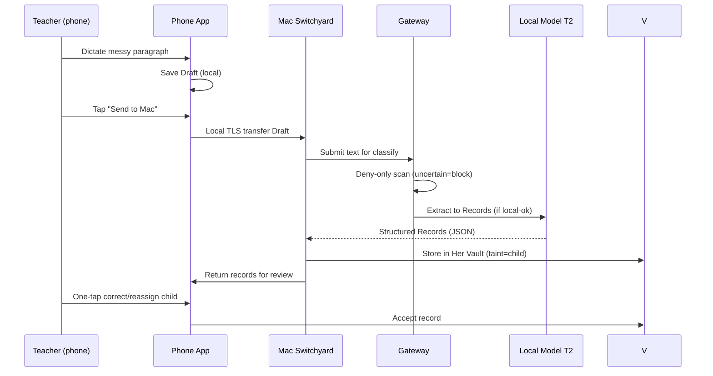
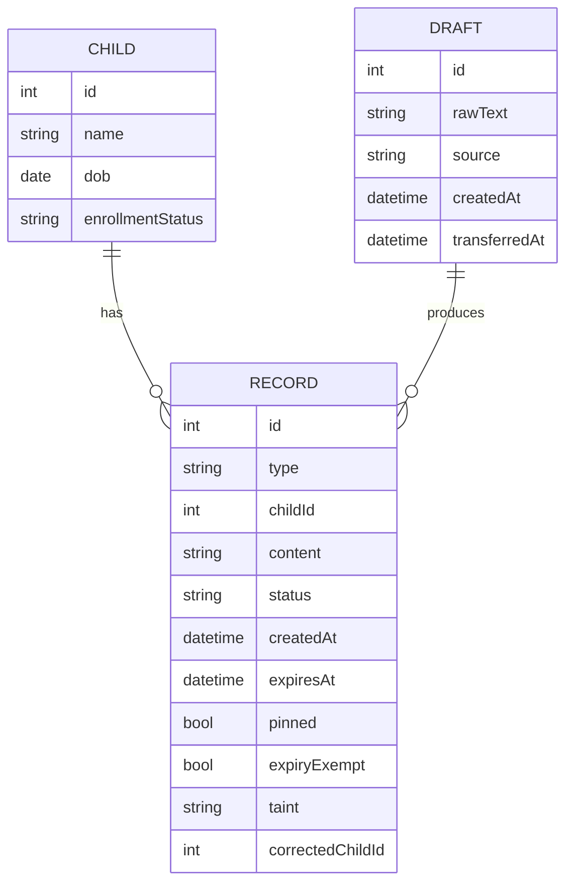
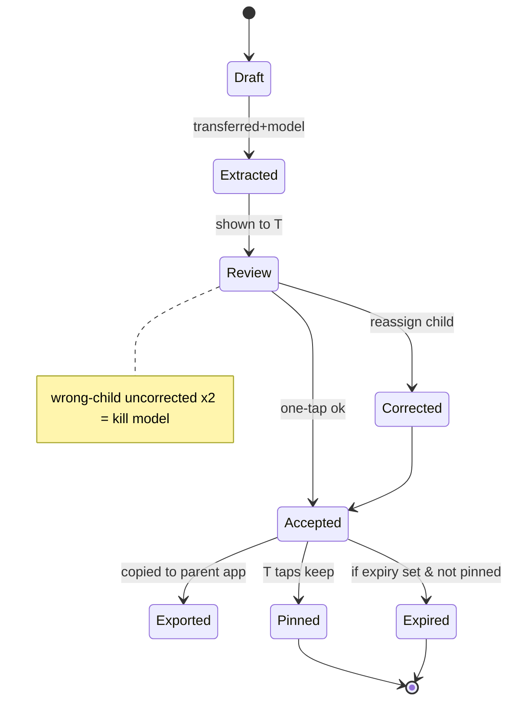

# Tencent Hy3 - Design Inspiration

**Reviewer:** `tencent/hy3` (high)
**Document:** docs/ai-workflow/brainstorms/classroom-copilot-2026-08-15/50-PACKET-R4-FULL.md
**Seed:** (none)
**Tokens:** 9832 in / 9898 out | **Cost:** ~$0.0065 | **Wall:** 143.5s | **finish_reason:** stop

---

# FULL-SPECTRUM HOSTILE REVIEW + BUILD BLUEPRINT  
**Project:** Classroom Copilot (T’s phone-first capture tool) + The Switchyard (local privacy/model gateway, dual-use for O)  
**Reviewer stance:** Single pass, all angles, “locked” treated as target.  
**Ignored:** <REDACTED-PROTECTED-TERM> branding, Victory charts, palette, component conventions. This is a separate preschool-teacher project.

---

## THREE FINDINGS I WILL DEFEND HARDEST

1. **The “phone and laptop do not sync” lock is structurally wrong as written and breaks the midday-rest timing anchor.** The v1 feature is “messy paragraph in → typed records out → one-tap correction,” but the extraction models (T1/T2) are locked to her Mac, and the phone is the capture device. If the devices “do not sync” in any form, the paragraph never reaches the model, or the correction loop never reaches her hand. The lock should read: *no cloud sync, no background continuous sync, but an explicit, local, user-initiated transfer path is mandatory.* Without that, the product is two inert halves.

2. **Default observation expiry (even with `pinned`/`expiryExempt` fields present) is a legal-risk time bomb for T.** The panel already caught that blanket auto-expiry deletes protective records; the amendment patches *incidents* and *promoted evidence*, but leaves ordinary behaviour/development observations expiring by default. A contemporaneous note about a child’s biting incident that wasn’t “promoted” yet can be the only thing that protects T in a dispute. Expiry must be **opt-in per record**, not default-on for the observation class.

3. **The local model “laundering” taint problem is not covered by the current gateway design and must be scoped as its own slice before any cloud path exists.** The gateway inspects at egress, but a local assistant with tool access can rewrite a child-linked note into clean prose *before* the gate sees it. Taint must propagate through every local transform, enforced at the store/tool layer, not just at the door. This is a first-class architecture problem, not a footnote.

**My strongest angle:** **Systems / Architecture** (data model, boundaries, failure modes, gateway enforcement). I go deepest there below, then cover Product, Interaction, Visual, Security (overlapping but called out), Strategy, Synthesis, and Final-Decider Judgement.

---

# A. HOSTILE REVIEW

## A.1 Attack on LOCKED decisions (Section 4)

I go through each lock, mark it **UPHOLD**, **WRONG**, or **PARTIAL**, and state what breaks.

| # | Locked decision | Verdict | What breaks if upheld as written |
|---|---|---|---|
| L1 | v1 is one feature: messy paragraph → typed records → one-tap correction | **UPHOLD** (but underspecified) | “One-tap correction” assumes a review surface with reliable child attribution; not designed. |
| L2 | H0 is not an app; paper + Mac local assistant + phone habit, gated on ≥4/5 days | **UPHOLD** | None. This is correct. |
| L3 | Platform Expo Android, TS, styled-components, expo-sqlite, llama.rn later. No iOS/macOS/Catalyst. Phone & laptop **do not sync** | **PARTIAL / WRONG on “do not sync”** | See Finding 1. The no-sync absolute makes T1/T2 on Mac unreachable from phone capture. Must be redefined as “no cloud sync, explicit local transfer only.” |
| L4 | Voice fallback; Gboard on-device dictation primary; rest-window dictation safest | **UPHOLD** but attack loud-room failure | In a room of 12 toddlers, Gboard dictation error rate is unknown; no fallback specified when dictation mis-transcribes child IDs. |
| L5 | Timing anchor: midday rest window | **PARTIAL** | Depends on Open Q1 (where is laptop at midday). If laptop not in room, anchor floats to after-school, past family-note deadline. |
| L6 | Scratchpad not archive + amendment | **WRONG as default** | See Finding 2. Default expiry on observations destroys protective records. |
| L7 | Observations expire; incidents/promoted evidence never do; `pinned`+`expiryExempt` in v1 schema | **PARTIAL** | Fields exist but default behaviour still expires non-incident protective notes. Should be: expiry only if user marks “scratch.” |
| L8 | Three kill criteria (habit, accuracy ≥90%, wrong-child zero) | **UPHOLD** but wrong-child criterion needs UI hardening | If correction UI makes mis-attribution easy, two errors can occur from UX, not model malice. Kill should trigger on *uncorrected* wrong-child, not model guess. |
| L9 | Model tiers: T1 Mac Qwen3 8B, T2 Mac 14B Q4, T3 O’s 5090 no child data, T4 cloud deliberately absent | **UPHOLD** | None on tier logic. But T3/O’s 5090 dual-use creates taint risk (see unsolved). |
| L10 | Sensitivity outranks capability, always upward locally | **UPHOLD** | Correct. |
| L11 | Child data never reaches O’s 5090 | **UPHOLD** | Correct legally. |
| L12 | Separate vaults for T and O; shared household vault ok | **UPHOLD** | Correct. But needs explicit filesystem boundary and taint flag. |
| L13 | Hostile review by local 14B for child data; cheap reasoner for child-free | **UPHOLD** | Fine. |
| L14 | Never AI-generate incident narrative | **UPHOLD** | Correct. |
| L15 | Gateway: classify-and-block primary, stripping defence-in-depth, deny-only local classifier, uncertainty blocks, installed once by O with watchdog | **PARTIAL** | Enforcement mechanism unspecified; watchdog “verifies no drift” but no spec on how. Browser channel voids claim (panel already noted). Needs host/OS-level egress guard on the Mac at minimum. |

**Ranked by severity × likelihood × cost-to-fix-later (top hits):**

- **No-sync lock (L3)** — Severity 5, Likelihood 5 (almost certain to bite), Cost-later 5 (storage/transfer rewrite). Lands in: `expo-sqlite` transfer layer + Switchyard ingest.
- **Default expiry (L6/L7)** — Sev 5, Lik 4, Cost-later 4 (schema migration + behaviour change). Lands in: `expo-sqlite` record table, Mac vault writer.
- **Taint laundering (unsolved)** — Sev 5, Lik 3, Cost-later 5 (every local tool). Lands in: Switchyard tool layer, vault store.
- **Gateway enforcement unspecified (L15)** — Sev 4, Lik 4, Cost-later 4. Lands in: Switchyard egress proxy.
- **Wrong-child UX (L8)** — Sev 5, Lik 3, Cost-later 3. Lands in: correction screen.

## A.2 Open questions (Section 5) — fatal / non-problem / mis-framed

1. **Where is laptop at midday?** *Fatal if ignored.* Structural. Must be answered before slice S1 ships. If laptop not in room, either (a) model runs on phone via llama.rn earlier than “later,” or (b) capture deferred to after-school on Mac, killing the anchor.
2. **What does parent-comms app already record?** *Non-trivial, not fatal.* Changes gap list; could make some extraction redundant. Must be mapped in S1 acceptance.
3. **Employer policy on child info on personal devices?** *Potentially fatal.* If prohibited, entire local-first personal-device architecture is invalid. Must be checked by O in person before H0 ends.
4. **Real rest window & family-note deadline.** *Fatal if wrong.* The anchor is the product. Confirm with T in first 2 days.
5. **Exact Samsung model.** Minor; confirm on setup day for RAM floor.
6. **School network permits P2P mesh VPN?** Non-fatal; T3 already falls back to T2. Known.

## A.3 Unsolved problems — honest attack

- **Browser channel voids privacy claim:** Correct. Mitigation “make local path good enough” is weak. Must add a technical friction: on her Mac, the Switchyard proxies *all* outbound HTTP from the assistant process; but she can still open Chrome. The honest name is “assistant egress guard.” For the phone, the Expo app never needs a browser; we should *block* the vendor domains at OS level via a local VPN profile on the phone (always-on, no cloud) to close the temptation.
- **Local model laundering taint:** As Finding 3. Must be its own slice (call it S12a).
- **“Proof” wrong standard:** Agree. Report miss-rate under adaptive attack, canary values, coverage check. Add to gateway slice.

## A.4 Attack what is NOT there (absences — highest-value)

Ranked by value to T, not novelty:

1. **Explicit local transfer mechanism (phone→Mac).** Absent from all briefs. The entire v1 depends on it. *Slice: S1.1.*
2. **Restore / device-loss recovery flow for non-technical user.** Backup mentioned but not the 8-step restore on a new phone without O. *Slice: S1.2.*
3. **Wrong-child prevention UI pattern.** Not specified; only kill criterion. *Slice: S1.3.*
4. **Employer-policy check artifact.** A signed note from T’s director. *Before H0 ends.*
5. **Gateway watchdog specification.** How does O verify no drift? *Slice: GW-2.*
6. **Attention-equity alert for T’s own wellbeing** (not just child equity) — she is solo; a “you haven’t eaten” nudge. Absent. *Slice: S13.*
7. **Sub/sick day sheet** (listed but not in v1). Keep as S7.
8. **Physical setup ritual doc** for O to install gateway in person. Absent.

---

# B. BUILD BLUEPRINT

## B.1 Architecture

**Components & boundaries**

- **Phone (Galaxy S24-class, Expo Android):** Capture UI, `expo-sqlite` local store for drafts & accepted records, Gboard dictation, explicit “Send to Mac” via local WiFi/USB (no cloud). No model in v1 (llama.rn later). Runs its own deny-only lightweight classifier for *accidental egress* (e.g., if she pastes into a mail intent? We block external shares of child data).
- **Mac (24GB floor, M3/M4 Air):** “Switchyard–T” service (Node/Express local-only, no internet listen except localhost). Hosts T1/T2 models via Ollama or llama.cpp. Runs the **deny-only gateway** inspecting all outbound from assistant processes. Separate filesystem vault `~/ClassroomCopilotVault` (her) vs `~/SwitchyardO` (O). A shared `~/SwitchyardHouse` for household.
- **O’s 5090 desktop:** Switchyard–O, T3 models, separate vault, never sees child data; taint flag propagated so any record with `taint=child` is rejected at its gateway.
- **Cloud:** Deliberately absent in v1. The gateway’s default is fail-closed: if uncertain, block.

**What runs where:** Capture on phone; extract on Mac; correct on phone (after transfer back) or Mac; incident/pinned stored permanently in Mac vault and mirrored to phone read-only.

**Boundaries:** Phone↔Mac transfer uses a local TLS socket with a pre-shared key O sets up in person. No data leaves the two devices except via T’s own cloud backup (encrypted, passphrase-only).

## B.2 Data model (v1 must-haves in bold)

```
Child { id, name, dob, enrollmentStatus, createdAt }  // name stays on device only
Draft { id, rawText, source(device), createdAt, transferredAt }
Record {
  id,
  type ENUM(observation, incident, supply, task, parentFollowup, activityIdea, prepTask, parkingLot, done),
  childId NULL,
  content TEXT,
  status ENUM(draft, extracted, review, accepted, exported),
  createdAt,
  expiresAt NULL,
  **pinned BOOL DEFAULT 0**,
  **expiryExempt BOOL DEFAULT 0**,
  **taint ENUM(none, child, adult, household) DEFAULT none**,
  sourceDraftId,
  correctedChildId NULL
}
Incident extends Record with mandatory fields: what, when, witnesses, action taken (never AI-written)
VaultMeta { key, value } // separate per vault
AuditLog { id, action, recordId, decision, ts } // stores only hashes/canaries, not content
```

**Why these must be in v1:** `pinned`, `expiryExempt`, `taint` are storage-rewrite risks if added later. `correctedChildId` supports wrong-child kill criterion.

Indexes: `Record(childId, status)`, `Record(createdAt)`, `Draft(transferredAt)`.

## B.3 Capture → Extract → Correct loop (exact steps + failures)

1. **Capture (phone):** T taps big “+” → types or dictates paragraph → saved as `Draft` (local). *Loading:* keyboard opens. *Empty:* prompt “dump today’s chaos.” *Error:* dictation failed → show “type instead” button.
2. **Transfer (explicit):** At rest window, T opens “Send to Mac” → local socket → Mac receives → `Draft.transferredAt` set. *Failure:* socket fails → “Email to self?” blocked; instead “Copy to clipboard” manual path.
3. **Classify (Mac gateway):** Deny-only classifier scans for child-linked content. *Uncertain* → block, flag `taint=child` anyway, route to local only.
4. **Extract (T2 14B Q4):** Grammar-constrained JSON → `Record` rows with guessed `childId`. *Model absent* → rules-only heuristic (regex for “C4”, “C7”) → still produces records but marks `status=extracted_needs_review`.
5. **Review (phone or Mac):** UI lists records, each with child chip, content, tap targets [Accept][Edit][Reassign]. *Wrong-child* → tap reassign → `correctedChildId` logged. Two uncorrected wrong-child in sample → kill model path.
6. **Accept:** `status=accepted`. If `type=incident` → `expiryExempt=1` forced. If observation and T taps “keep” → `pinned=1`, no expiry.
7. **Export:** T copies text to parent app manually. *Error:* copy blocked if `taint=child` and destination is external share → we disable share intent for those.

## B.4 Mermaid diagrams (valid)









## B.5 ASCII Wireframes (phone-width ~40 cols)

### Screen 1: Capture (Home)
**Happy:**
```
┌──────────────────────────────┐
│ Classroom Copilot            │
│ ──────────────────────────── │
│ [ Today's dump ]             │
│ ┌──────────────────────────┐ │
│ │ C4 had hard time clean-  │ │
│ │ up. C7 loved playdough.  │ │
│ │ need more wipes.         │ │
│ └──────────────────────────┘ │
│ [ mic ] (dictate)  [Send➤Mac]│
│ Tap targets: 18dp min        │
└──────────────────────────────┘
```
**Loading:** keyboard animating, “saving…”  
**Empty:** `┌─────────┐│ What happened││ today?   │└─────────┘`  
**Error (dictation):** `!! dictation failed │ [ Type instead ]`

### Screen 2: Review / Correct
**Happy:**
```
┌──────────────────────────────┐
│ Review (3 records)           │
│ ──────────────────────────── │
│ [C4] Observation             │
│ "hard time cleaning up"      │
│ [Accept] [Edit] [Reassign]   │
│ [C7] Observation             │
│ "loved playdough"            │
│ [Accept] [Edit] [Reassign]   │
│ [Supply] "need more wipes"   │
│ [Accept] [Edit]              │
└──────────────────────────────┘
```
**Loading:** `Extracting… (local model on Mac)`  
**Empty:** `No records yet. Send a draft.`  
**Error (transfer fail):** `!! Mac not reachable │ [Copy to clipboard]`

### Screen 3: Gateway Status (Mac mirror)
**Happy:** `Gateway: ACTIVE │ Child data: LOCAL ONLY │ Last check: ok`  
**Loading:** `Watchdog verifying…`  
**Error:** `!! Gateway drift detected │ O notified │ Fail-closed`

## B.6 Slice order (re-derived with day est + hard acceptance)

- **S0 (0.5d):** Employer policy check + setup ritual doc. *Accept:* signed note from director.
- **S1.1 (3d):** Local transfer phone→Mac. *Accept:* draft appears in Mac vault within 10s.
- **S1.2 (2d):** Backup/restore passphrase flow. *Accept:* new phone restores vault from her cloud.
- **S1 (capture core) (10d):** input + store + rules-only extract. *Accept:* 20-paragraph sample → records, ≥90% accepted after correction.
- **S1.3 (2d):** Wrong-child reassign UI. *Accept:* two wrong-child errors trigger kill flag in log.
- **S2 (2d):** DONE list + parking lot. *Accept:* T uses ≥3 days.
- **GW-1 (3d):** Deny-only classifier on Mac. *Accept:* canary child note blocked from any egress attempt.
- **GW-2 (2d):** Watchdog + audit (hashes only). *Accept:* simulated drift blocked.
- **S3 (4d):** Incident record (no AI narrative). *Accept:* incident forced expiryExempt.
- **S12a (4d):** Taint propagation in local tools. *Accept:* laundered text still flagged at egress.
- **S4 (3d):** Must/Should/Extra triage. *Accept:* T’s #1 need met.

If only three more after S1: **S2, S3, S4** as panel said.

## B.7 The “do NOT” list

- Do NOT add cloud sync “for convenience.”
- Do NOT make observation expiry default-on.
- Do NOT let the app share child data to any external intent (mail, browser).
- Do NOT build a stripping-only gateway.
- Do NOT merge T and O vaults.
- Do NOT promote voice to primary input in loud room.
- Do NOT generate incident narratives via model.
- Do NOT add user-facing schema/admin panels.
- Do NOT trust the app code for egress; enforce at gateway.

---

# C. OTHER ANGLES (full coverage)

## Product
Right thing to build? The v1 single-feature is correct, but the *order* must answer Open Q1/Q4 first. The product succeeds only if the midday rest window is real and the laptop is present. Strategy: gate the app build on H0 ritual (already locked) but add the employer-policy gate.

## Interaction (physical act with 12 two-year-olds)
One-handed, arm’s length, big tap targets (min 44dp). Dictation only in rest window with sleeping kids. Capture must be <10s: open app, big mic, done. Correction must be swipe/large buttons. No typing required except minor.

## Visual design
High contrast, large type (18sp+), no tiny labels. Child chips color-coded but not relying on color alone (initials). Loading/empty/error must be textual, not just spinners.

## Security & Privacy (called out separately despite arch overlap)
Attack: browser channel, taint laundering, watchdog. The gateway is “assistant egress guard,” not full privacy boundary. We add phone-local VPN profile blocking vendor domains. Audit log stores only canary hashes. Fail-closed on uncertainty.

## Strategy (first three weeks)
Success: H0 ritual sticks → app build justified. Die: employer says no personal device → pivot to paper + Mac only. Kill criteria monitored openly.

## Synthesis
The pieces together show a system where the *human* is the only compliant component; the tech is a scaffold to keep her from leaking or losing protective records. The no-sync lock, if fixed to explicit local transfer, actually strengthens privacy. The expiry default is the one place where well-meaning scratchpad design undermines legal protection — a classic product/legal conflict.

## Final-Decider Judgement (where decisions are plainly WRONG)
1. **“Phone and laptop do not sync” is WRONG as absolute.** Must be “no cloud sync; explicit local transfer only.”  
2. **Default observation expiry is WRONG.** Must be opt-in per record.  
3. **The privacy gateway named as boundary is WRONG**; it is an assistant egress guard, and the browser channel must be technically closed, not wished away.  
4. **Wrong-child kill criterion applied to model guess (not uncorrected UX) is WRONG**; it will punish the UI, not the model.

---

**End of full-spectrum pass. No lane left uncovered.**
