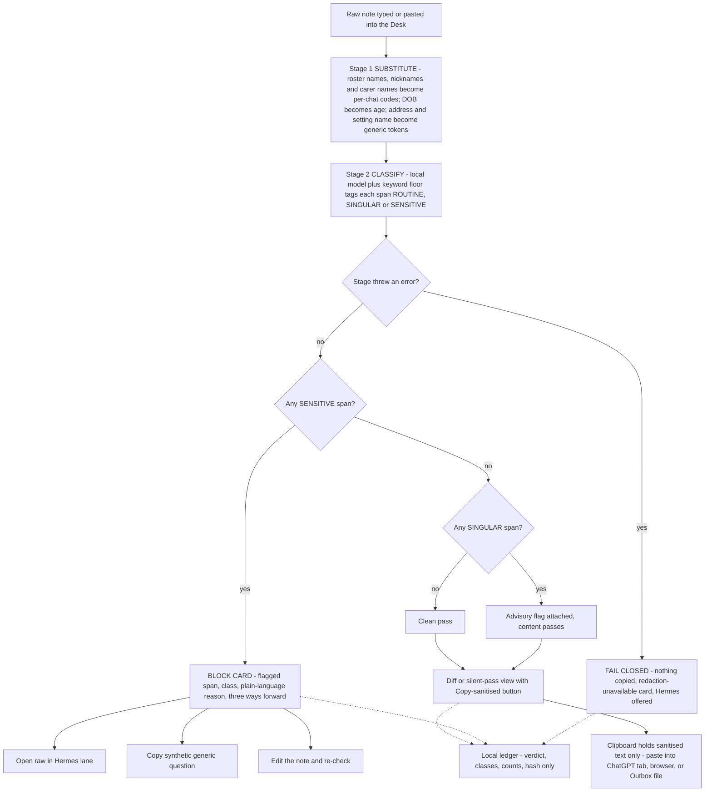
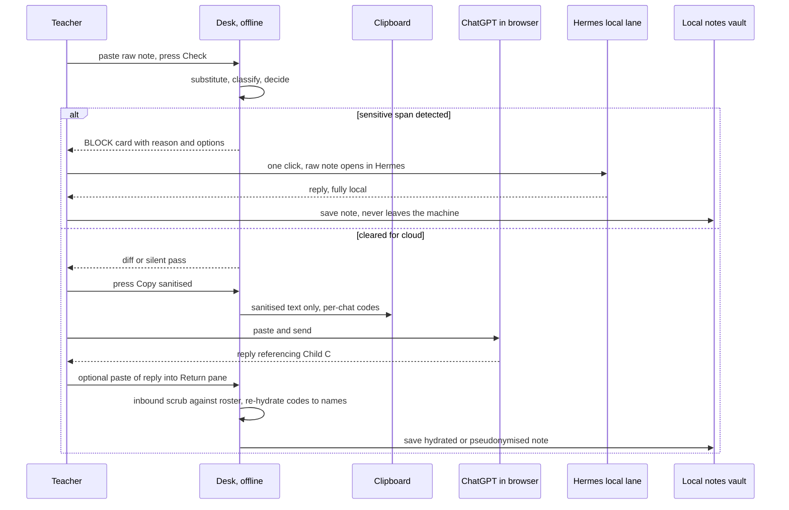

# GLM Consult

**Model:** glm-5.3
**Document:** docs/ai-workflow/brainstorms/classroom-copilot-2026-08-15/70-PACKET-REDACTION-MIDDLEWARE.md
**Tokens:** 1985 in / 27345 out (reasoning: 21372) | total 29330
**Wall:** 428.8s

---

## VERDICT
In a closed cohort of twelve, circumstance *is* identity, so the middleware's primary control must be classify-and-block with name-substitution as cosmetic defence-in-depth — never the sole control. Shape B (visible paste-through) wins because Shape A is an enterprise pattern missing its enterprise: it needs a managed device, an API budget, and an IT function that a solo teacher does not have, and it abandons the one surface her employer actually approved. The honest limit, stated up front: the mum-in-hospital sentence cannot be made cloud-safe by any transformation that preserves its meaning — the design's job is to refuse it visibly and make the refusal useful, not to pretend otherwise.

## SHAPE A OR B

**B. The paste-through desk tool ("the Desk") is primary. Not close.**

**Defense, in order of force:**

1. **Shape A is not achievable in this deployment.** A proxy only redacts on the path it owns. T's realistic path is the ChatGPT app on her phone at 9pm on the sofa. A laptop proxy covers neither the phone nor the approved consumer app — only a hypothetical API client nobody approved, paid for, or can maintain. Enforcing A properly requires MDM, a managed device, and an IT function. A is not a product for a party of one; it's an enterprise pattern with the enterprise missing.
2. **Legal.** Her approval attaches to *ChatGPT the app*. Routing through `api.openai.com` is a different product with different data terms, a paid key, and a new data relationship nobody signed. B keeps her inside the approved surface and adds **zero new cloud parties** — the Desk is fully offline. That is the cleanest compliance story available.
3. **Philosophy.** With classify-and-block primary, the middleware's core act is a *refusal*. Refusals must be legible or they teach nothing. A buries the machinery; B's diff is a training loop. After fifty diff views, T's own eye becomes layer three. A never trains anyone.
4. **Operations.** No keys, no network stack, no proxy updates, survives every ChatGPT UI redesign. For a solo teacher, the only tool that survives is a boring one.

**What the loser costs.** A gives on-path enforcement ("cannot" instead of "will not, visibly"), zero-friction auto-redaction of routine content, and invisible re-hydration without the paste-back. Those are real losses. B is voluntary and one paste bypasses it; the compensations are that the Desk path must be *faster than the bypass* (one keystroke to check, one click to copy) and that the diff builds the habit A would have prevented her from needing.

**The hybrid ruling — deterministic, no in-the-moment judgement.** The Desk decides lanes by content class; T chooses content, never lane. SENSITIVE content → Hermes only, cloud tabs locked. ROUTINE child-specific and child-agnostic content → Desk-sanitised copy, paste anywhere including the browser. Child-agnostic files/code → Claude Code in a sandboxed Outbox folder (a *structural* boundary, not a per-message decision). The one A-like element — the Outbox filesystem gate for lane 3 — is configuration, not judgement.

**The load-bearing distinction — yes, it is.** Tool approval is procurement; data approval is a controller decision under privacy law (developmental, toileting, and family-circumstance notes about under-fives are high-sensitivity personal data, arguably special category). Nobody approving ChatGPT for lesson plans contemplated a two-year-old's toileting record. **The owner should confirm with the director, before shipping:** (1) does the approval memo contemplate *any* child personal data entering prompts — get the actual wording; (2) which tier — consumer ChatGPT (may train on inputs, no DPA) vs Team/Edu (zero-retention options, DPA); (3) who is the controller and is there a DPA/transfer basis; (4) has a DPIA been done for AI use with children's data; (5) the incident/parental-communication path if something leaks. The elegant property: the middleware's posture — *cloud lanes behave as if nothing child-identifying may ever enter* — is the correct design under every possible answer. The director conversation changes the school's paperwork, not this architecture.

## BLUEPRINT

**Trust boundary.** Inside: roster vault, raw notes, Hermes, Desk memory. Crossing: the Desk's own copy button (sanitised text only) and the Outbox folder. Outside: browser + ChatGPT, Claude Code session. **The Desk itself has zero network capability** — the security-critical component is offline by construction, holds no credentials, and has nothing to steal.

1. **The Desk** (one local app, offline): Compose pane → Check → verdict screen → copy/redirect. Three destination stamps (Hermes / ChatGPT / Outbox); which are *lit* is decided by the pipeline, not by her.
2. **Roster vault** (local, disk-encrypted, app-held only while open): per child — preferred name, legal name, nicknames/diminutives, siblings' names, parents'/carers' first names. One-time setup, T-maintained. Never written outside the vault; never on the clipboard; never in the Outbox.
3. **Stage 1 — Substituter** (deterministic): roster-driven matching including diminutive generation ("Theo"→"Teddy"→"T"); DOB→age in months; address, setting name, room name→generic tokens; phone/email→removed. **Per-conversation stable pseudonyms ("Child C"), rotated across conversations** — coherence within a chat, no cross-chat dossier linkage. Pseudonym maps expire after 30 days.
4. **Stage 2 — Classifier** (local small model, same runtime as Hermes, plus a deterministic keyword floor: hospital/admitted/unwell/custody/social services/diagnosis families). Tags spans ROUTINE / SINGULAR / SENSITIVE with class labels (health, family circumstance, safeguarding, injury incident, emotional-toileting). A cohort-frequency tally from her own notes informs SINGULAR vs ROUTINE (napped-dropping = common; pacifier = maybe one child).
5. **Stage 3 — Decider** (pure policy, no ML): any SENSITIVE span → BLOCK both cloud lanes, **no override toggle** (the only paths are Hermes, a synthetic rewrite, or editing the note). SINGULAR → pass with advisory flag. Uncertain span (low confidence on sensitive-adjacent vocabulary) → treated as SENSITIVE. Conservative by default.
6. **Synthetic rewriter** (on the block card): a local rewrite that strips child, cohort, and first-person-class linkage entirely, producing a generic pedagogy question. Deterministic constraints: no "one of my children," no cohort size, no timeline.
7. **Outbox** (lane 3): one folder, the only shared boundary with Claude Code. Project root = that folder; permission config denies reads outside it; Full Disk Access never granted. Only the Desk writes sanitised files in; outputs come back through the Return pane. Raw notes, vault, and Hermes live outside it, permanently.
8. **Return pane + inbound scrub**: paste a cloud reply; scrub against the roster (any real name hit = red banner + logged incident, not silent cleanup); optional re-hydration of codes→names for saving to the local notes vault.
9. **Ledger** (local): every check — timestamp, verdict, classes, counts, hash of outbound text (never the text). The operator's single audit artefact.
10. **Fail-closed, enumerated**: roster fails to load → cloud tabs won't unlock (Hermes unaffected); classifier fails → keyword-floor-only mode with a "reduced checking" banner that blocks anything with carer/health vocabulary; any pipeline throw → **nothing is copied**, explicit "redaction unavailable" card (stolen from the production system); clipboard write fails → retry, never falls back to raw.

**Onboarding card (policy layer, human factors):** ChatGPT memory OFF, training/history OFF if the tier allows it, no roster files ever uploaded, work account not personal. One page, done once, checked in the quarterly drill.

## MERMAID





## WIREFRAMES

**W1 — Compose (main screen)**

```
┌──────────────────────────────────────────────────────────┐
│ THE DESK                       roster 12 ✓   ● OFFLINE   │
├──────────────────────────────────────────────────────────┤
│ Destination:  [● ChatGPT] [○ Hermes (private)] [○ Outbox]│
│                                                          │
│ ┌──────────────────────────────────────────────────────┐ │
│ │ Type or paste the note here…                         │ │
│ │                                                      │ │
│ └──────────────────────────────────────────────────────┘ │
│                                                          │
│ [ Check  ⌘K ]                    ledger ▸    self-test ▸ │
└──────────────────────────────────────────────────────────┘
```

**W2 — Silent pass**

```
┌──────────────────────────────────────────────────────────┐
│ ✓ NOTHING TO REDACT                                      │
│ No child names, no identifying details, 0 flags.         │
│                                                          │
│   [ Copy for ChatGPT  ⌘⇧C ]    [ Send to Hermes instead ]│
│                                                          │
│ Checked 14:32 · substitutions 0 · advisories 0 · logged ✓│
└──────────────────────────────────────────────────────────┘
```

**W3 — Diff view (substitutions + advisory)**

```
┌──────────────────────────────────────────────────────────┐
│ ✓ CLEARED FOR CHATGPT — 3 substitutions · 1 advisory     │
├──────────────────────────────────────────────────────────┤
│ YOUR NOTE                     WHAT THE CLOUD WILL SEE    │
│ his mum Sarah picked him up   Child C's mum picked up    │
│ at St Luke's, Rainbow Room    at my setting              │
│ DOB 14/03/2023                age 2y7m                   │
│ still uses a pacifier at nap  still uses a pacifier ⚡    │
├──────────────────────────────────────────────────────────┤
│ ⚡ ADVISORY — not blocked: unique to one child in your    │
│ cohort right now. Routine class, allowed — but anyone    │
│ holding your roster could link it.                       │
│                                                          │
│  [ Copy sanitised version ⌘⇧C ]  [ Send to Hermes instead]│
└──────────────────────────────────────────────────────────┘
```

**W4 — The refusal (never a dead end)**

```
┌──────────────────────────────────────────────────────────┐
│ ⛔ STOPPED — THIS ONE STAYS OFF THE CLOUD                 │
├──────────────────────────────────────────────────────────┤
│ Flagged: "whose mum is in hospital"                      │
│ Class: family circumstance — health of a carer           │
│                                                          │
│ Why: in a group of 12, this sentence names a child       │
│ without using his name. Anyone who knows your class      │
│ knows who this is. Removing a name cannot fix this —     │
│ the circumstance IS the identifier.                      │
│                                                          │
│ WHERE IT CAN GO                                          │
│ [▸ Open in Hermes — full detail, stays on this laptop ]  │
│                                                          │
│ WHAT YOU CAN STILL ASK CHATGPT                           │
│ [ Copy a generic version ] →                             │
│   "How can I support a 2-year-old at drop-off while      │
│    a parent is hospitalised? Strategies for a preschool  │
│    teacher." — no child, no class, no name               │
│                                                          │
│ [ Edit the note and re-check ]                           │
│ Nothing was copied. Logged 14:34.                        │
└──────────────────────────────────────────────────────────┘
```

**W5 — Return pane (normal + leak state)**

```
┌──────────────────────────────────────────────────────────┐
│ RETURN PANE — paste ChatGPT's reply to save it           │
│ ┌──────────────────────────────────────────────────────┐ │
│ │ paste reply here… Child C may benefit from a calm    │ │
│ │ corner and a predictable good-bye routine…           │ │
│ └──────────────────────────────────────────────────────┘ │
│ [✓] Re-hydrate names for my notes (map stays local)      │
│ PREVIEW: "Theodore may benefit from a calm corner…"      │
│   [ Save to Notes ]   [ Copy as-is, pseudonymised ]     │
└──────────────────────────────────────────────────────────┘

LEAK STATE, same pane:
┌──────────────────────────────────────────────────────────┐
│ ⚠ NAME ALERT — the reply mentioned "Sarah".              │
│ That name is on your roster. The cloud should not know   │
│ it. Logged as an incident.                               │
│  [ Remove the name and continue ]   [ Tell the owner ]   │
└──────────────────────────────────────────────────────────┘
```

**W6 — Ledger / self-test (operator view)**

```
┌──────────────────────────────────────────────────────────┐
│ LEDGER                                 self-test [ RUN ▸ ]│
├──────────────────────────────────────────────────────────┤
│ Last 7 days  blocks 9 · passes 41 · advisories 12 · leaks 0│
│ Lane mix     Hermes 34% · ChatGPT 66%  (stable)          │
│ SELF-TEST    run 3 days ago · rulepack v1.4              │
│              block recall 98.7% · false-block 6.1% ●GREEN│
│ Outbox       6 files · re-scan clean · oldest 11 days    │
└──────────────────────────────────────────────────────────┘
```

**W7 — Roster setup (once)**

```
┌──────────────────────────────────────────────────────────┐
│ ROSTER — stays on this laptop, encrypted. Never sent.    │
│  1  Theodore "Theo/Teddy" · mum Sarah, dad James         │
│  2  Amara "Mimi" · mum Grace · gran collects Tue/Thu     │
│  [ + add child ]                                         │
│  Add what the children actually get called — nicknames   │
│  are how notes leak.                                     │
└──────────────────────────────────────────────────────────┘
```

## THE HARD CASE

> *"The little boy whose mum is in hospital had a rough drop-off again."*

**Stage 1 substitutes nothing — there is nothing to substitute.** This is precisely where name-based designs, including the production system's, wave it through untouched. **Stage 2** tags "mum is in hospital" as family-circumstance/health-of-carer — SENSITIVE — via the local model *and* the deterministic keyword floor ("hospital", "admitted", "unwell" co-occurring with a carer noun), so the verdict survives a model failure. "Rough drop-off" alone would be ROUTINE; the hospital clause trips it, and the classifier reasons with roster context: cohort of twelve, singular circumstance. **Stage 3 blocks both cloud lanes. No override.** The card offers Hermes (case-specific reasoning, full detail), the synthetic generic question (retains ~95% of the pedagogical value — the strategy for hospitalised-parent drop-offs does not depend on which child), or editing.

**The plain statement:** no transformation of this sentence is both cloud-safe and useful. Pseudonymising is cosmetic (no name exists to remove); generalising to "a family disruption" destroys the meaning. The design does not solve this sentence — **it refuses it, visibly, explains why in one breath, and redirects in one click.** If the owner needs cloud-quality reasoning on such content, that is a *legal* fix (school-level Edu/Enterprise deployment, DPA, DPIA, controller acceptance), not a redaction fix. Residual risk: a novel paraphrase ("her mum got admitted again") could dodge the model; the keyword floor narrows but cannot close that, which is why the corpus and the trained human eye are layers three and four.

## PRODUCTION SYSTEM VERDICT

**What T's case exposes.** Run the sentence through their pipeline: zero strip-list hits, zero scrub hits, sent intact, and the inbound scrub defends nothing because the leak never contained a name. Their core inference — name-removal ⇒ safety — holds only under two assumptions: the adversary lacks the roster, and transcripts never flow back into a closed community. For a large, mutually anonymous customer base, both mostly hold. For any coach with a small client book, the fields they deliberately KEEP (age + gender + height + weight + injury history + medical concerns) are close to unique for N≤20 — "62-year-old female client, knee replacement, nut allergy" identifies her to anyone holding the book, or to the gym group chat if a screenshot escapes.

**Ruling: no structural upgrade.** This is a different-threat-model case where their design is correct for their own users. Rebuilding them around circumstance-blocking would destroy the product — a fitness assistant forbidden from injury history and medical concerns is worthless, and their KEEP list is the product. Their sensitivity calculus (adults, consented paying clients, controller accepts the residual) is defensible where T's (two-year-olds, no consent, closed community) is not.

**Cheap actions, ranked by risk retired per effort — if anything:**
1. **A DPIA paragraph documenting small-roster quasi-identifier residual risk with controller-side acceptance.** Effort ≈ zero; retires the "never considered it" regulatory finding entirely.
2. **A "tight mode," auto-offered when a fetched roster is ≤~15 clients:** coarsen age to 5-year bands, weight/height to bands, suppress rare-condition strings. They already fetch rosters, so the trigger is free. Off by default, coach's choice.
3. **Promote inbound-scrub hits from silent cleanup to logged incidents.** Trivial; converts an existing control into a detector.

**Do NOT touch:** the body-aware/identity-blind model, fail-closed-by-withholding, bidirectional scrubbing mechanics, history-window re-sanitisation, targeted term generation, the five suites (extend, don't rewrite). One flip condition: if their customer base includes schools, children's services, or coaches serving minors, T's problem becomes theirs and this becomes a rebuild conversation, not a paragraph.

**What the Desk steals:** (1) fail-closed-by-withholding — error ⇒ nothing copied, explicit placeholder; (2) bidirectional inbound scrub, upgraded from silent cleanup to leak alarm; (3) roster-driven targeted term generation, extended to diminutives; (4) history re-sanitisation, translated to its stateless analogue — Outbox files are **re-scanned whenever rules tighten**, so yesterday's clear expires; (5) the multi-suite culture, translated into the adversarial corpus below.

## VERIFICATION

- **Corpus.** ~150 owner-authored, versioned notes: 50 should-pass (routine), 50 should-block (sensitive/singular, including fresh paraphrases of the §3 sentence and sibling-borne identifiers), 50 mixed. Run as a first-class **self-test button** in the Desk (W6) and as a mandatory gate before any rulepack ships.
- **Canaries.** Two fictional roster entries ("Zander Quill"). Any appearance of a canary in outbound copy or an inbound reply = pipeline breach, regardless of what the corpus says.
- **Metrics the operator watches.** *Block recall on corpus ≥ 98%* (the number); *false-block rate ≤ 10%* (guardrail — above this she abandons the tool and the whole control evaporates); *inbound name hits = 0*, each investigated; *days since self-test*; *lane-mix trend* — if Hermes share collapses and ChatGPT traffic balloons, the Desk is being bypassed (the ledger can't see the browser, but it can see its own usage die).
- **Drift.** Rulepack updates re-run the corpus before deploy; Outbox re-scan on every rule change; pinned local-model version so a silent model upgrade can't silently change verdicts.
- **Human-layer verification.** Quarterly ten-minute drill: the owner sends T three texts (one clean, one fresh paraphrase of the hard case, one with a nickname she's never entered); pass = her call matches the Desk's *and* she can explain the block card in her own words. A control nobody can measure is theatre; this design ships with the measure attached.

## HOW THIS LEAKS ANYWAY

1. **The second device.** Phone, sofa, 9pm, ChatGPT app — no Desk exists there and none can. Every control in this packet governs the laptop. The only mitigations are organisational (the school's AI policy, memory off) and behavioural (the Desk path must stay *faster* than the bypass), and both decay.
2. **Aggregate dossier + retro-keying.** Each routine fact passes legitimately; the cloud accumulates "Child C: pacifier, dinosaurs, speech-referral, mum often late." Any single future slip — one unredacted name in one paste, one "remember Theo from last term?" — retroactively identifies the *entire* accumulated history. Per-conversation pseudonym rotation, memory-off, and new-chat-per-topic reduce this to small; nothing reduces it to zero.
3. **The unmanaged surface this packet never mentions.** T's raw notes almost certainly *already* sync to a consumer cloud (Notes/iCloud, Google Keep, Dropbox) from before any of this existed, and her laptop is a single unencrypted-by-default point of failure containing twelve children's sensitive records. The middleware governs the AI lanes while the larger standing exposure sits untouched. Fix: disk encryption on day one; audit and either disable or legitimise notes sync — before shipping the Desk.

## DISSENT

1. **The packet's risk weighting is wrong.** It industrialises the AI lanes — the *new*, small, fashionable risk — while the pre-existing sync surface and device custody (theft, repair shop, unencrypted disk, the tote bag with paper notes) plausibly dominate. Three prior rounds found thirteen defects, eight introduced by fixes; this packet is primed to engineer the elegant problem instead of the large one. The owner should spend one day on baseline hygiene before any middleware ships.
2. **Three lanes for one solo teacher is over-productised.** Claude Code with filesystem access is the owner's toy, not T's workflow; every lane is attack surface and configuration drift she cannot carry. Recommend shipping lanes 1+2 and keeping lane 3 with the owner — or restricting it to child-agnostic file tasks, in which case the Outbox gate is doing real work for a feature she may never use.
3. **"Cannot receive a child's identity" is unachievable as stated.** Any design that leaves her a browser is voluntary at the last step. If the owner genuinely requires *cannot*, the answer is organisational — managed device, MDM, API-only access, director sign-off — not middleware, and the packet should say so rather than letting Shape B's visibility stand in for enforcement.
4. **The re-hydration premise is half-wrong.** "She will stop using it" cuts the other way too: the asker knows who Child C is. A mandatory paste-back round trip adds friction where none is needed and raises abandonment risk — the exact failure the packet fears. I made re-hydration an optional save step for her notes; the packet's requirement, taken literally, would have mandated it.
5. **"Adversarially reviewed, child data safe there today" is asserted, not evidenced — and local ≠ safe.** Hermes on a stolen laptop with an unencrypted disk is a worse disclosure than any ChatGPT paste. The local lane's security is device custody, and nothing in the packet addresses it. Relatedly, my no-override stance on SENSITIVE blocks is deliberately paternalistic; it is the right default for children's data, but the owner should choose that consciously — a logged break-glass override is a defensible v2, and pretending there is no trade-off would be this packet's fourteenth defect.
