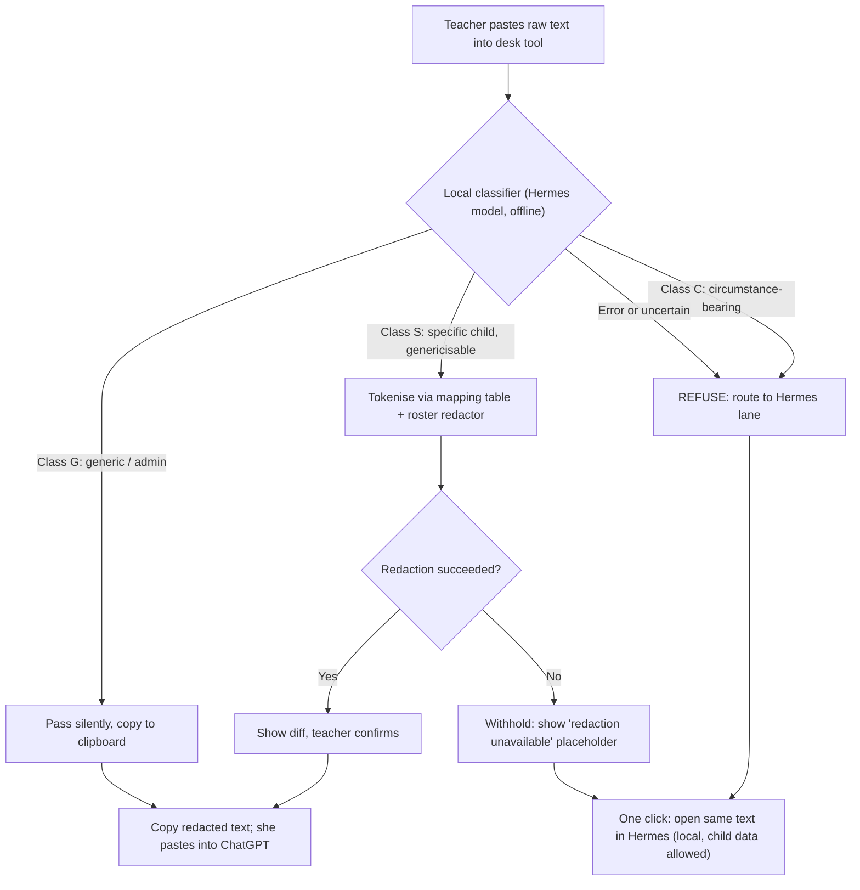

# Kimi K3 - Review

**Reviewer:** `moonshotai/kimi-k3` (high)
**Document:** docs/ai-workflow/brainstorms/classroom-copilot-2026-08-15/70-PACKET-REDACTION-MIDDLEWARE.md
**Seed:** (none)
**Tokens:** 2060 in / 8741 out | **Cost:** ~$0.1373 | **Wall:** 181.3s | **finish_reason:** stop

---

## VERDICT

The single most important decision: **the middleware's primary control is classify-and-route, not redact-and-send** — because in a cohort of twelve, circumstance is identity, and no redaction survives §3. Pick **Shape B (paste-through desk tool)**: it works with the ChatGPT app she was actually approved to use, makes the redaction visible (which is the real control — it builds her calibration), and Shape A doesn't close the browser hole either, so its "unavoidable" claim is only true on its own path. And yes, the tool-approval vs data-approval distinction is **load-bearing** — before anything ships, the owner must confirm with the director: scope of the approval, an enterprise account with a DPA (no training on inputs), a DPIA, lawful basis, and parent notice. Without those, the middleware is a fig leaf over a missing lawful basis.

## SHAPE A OR B

**Primary: Shape B — paste-through desk tool.**

Reasons, in order of weight:

1. **It matches the approval.** The employer approved the ChatGPT app/website. Shape A requires API keys, billing, and a custom client — a *different* product that was never approved, with credentials now living on a teacher's laptop.
2. **Shape A doesn't close the hole it claims to close.** Its redaction is "automatic and unavoidable" *only on its own path*; the browser remains one click away in both shapes. Since neither shape eliminates the undisciplined path, choose the one that maximises use of the sanctioned path and minimises friction on it.
3. **Visibility is the control.** The diff view teaches her what identifying content looks like. Six months of diffs is six months of calibration training. Shape A is invisible — and when an invisible control fails, it fails silently.
4. **Zero new attack surface.** Shape B needs no network, no keys, no accounts. It cannot exfiltrate anything because it cannot send anything.

**What the loser (A) costs:** she abandons the approved app; API keys and billing appear on her device; the browser hole stays open anyway; and the redaction becomes invisible, so neither she nor anyone else ever sees it working — or failing.

**Hybrid, specified by content class, not by her judgement:** free-text composition (the only content class that exists today) goes through B. If a future need appears for bulk structured exports (e.g., anonymised term summaries), that class — and only that class — may get a Shape A pipeline later, designed then. Nothing in the current design routes by in-the-moment discretion.

## BLUEPRINT

Everything runs **on her laptop, inside the trust boundary**. The boundary is the network interface: nothing in this design crosses it. The cloud lanes are outside; *she* is the only transport, carrying clipboard contents.

| Component | Runs where | What it does | What it never does |
|---|---|---|---|
| **Capture box** | Local app window | Accepts pasted or typed text. Single action: "Check & copy". | Never stores raw text beyond the session; never auto-sends. |
| **Classifier** | Local, **hosted on the Hermes model she already has** | Assigns one of three classes (below). Uncertain or error → treated as Class C. | Never runs in the cloud; never sees the mapping table. |
| **Roster redactor** | Local | NER + roster-driven variant matching (stolen from §4: full name, "Last, First", nicknames, parent/sibling names, address, phone). | Never weakens its match list to reduce false positives. |
| **Mapping table** | Local, encrypted at rest (OS keychain) | Stable pseudonyms: child ↔ `Child A`, `Child B`. The crown jewel. | Never appears in logs, never leaves the device, never given to the classifier. |
| **Diff renderer** | Local UI | Shows exactly what changed and why. | Never hides a change; no "don't show again". |
| **Refusal router** | Local UI | On Class C: refuses *and* offers the Hermes lane in one click. | Never offers "send anyway". No override exists for Class C. |
| **Rehydrator** | Local | Paste the cloud reply back: scrubs inbound for hallucinated/leaked identifiers (stolen from §4), then maps `Child A` → real name for her eyes only. | Never rehydrates into any outbound-bound text. |
| **Audit log** | Local, append-only | Counts only: class distribution, block events, canary trips. Content-free. | Never logs raw or redacted text. |

**Content classes:**
- **G — Generic/admin.** Lesson plans, activity ideas, templates, "separation-anxiety strategies for 2-year-olds". No specific-child predicate. → Pass silently.
- **S — Specific child, genericisable.** "Child A bit another child at snack time" — the predicate is ordinary developmental behaviour, identifying only in combination with the name, which the token replaces. → Tokenise + redact + show diff.
- **C — Circumstance-bearing.** Any predicate about a specific child that is *itself* identifying in a known cohort: family circumstances, health, incidents with unique texture, §3's sentence. → **Blocked, routed to Hermes. Never redacted — redaction does not survive this class.**

**Fail-closed rule:** classifier error, redactor error, or low confidence → Class C. The production system's "withheld: redaction unavailable" placeholder is stolen verbatim for the redactor path.

## MERMAID

**Decision pipeline:**



**One round trip, including re-hydration:**

```mermaid
sequenceDiagram
    participant T as Teacher
    participant DT as Desk Tool (local)
    participant H as Hermes (local model)
    participant CG as ChatGPT (cloud)
    T->>DT: Paste raw note
    DT->>H: Classify + redact (offline)
    H-->>DT: Class S, tokenised text ("Child A")
    DT-->>T: Diff view; she confirms
    T->>CG: Pastes redacted text (browser, approved app)
    CG-->>T: Reply referencing "Child A"
    T->>DT: Paste reply for re-hydration
    DT->>DT: Inbound scrub for leaked or hallucinated identifiers
    DT->>DT: Re-hydrate "Child A" to real name via local mapping table
    DT-->>T: Readable reply; names restored; nothing left the device
```

## WIREFRAMES

**Screen 1 — Silent pass (Class G).** Friction budget near zero; the whole interaction is one click.

```
┌──────────────────────────────────────────────────────┐
│  Desk Tool                                    — □ x  │
├──────────────────────────────────────────────────────┤
│  ┌────────────────────────────────────────────────┐  │
│  │ Rainy-day activity ideas for my 2–3 room...    │  │
│  └────────────────────────────────────────────────┘  │
│  ✓ No child-specific content detected                │
│  [ Copy for ChatGPT ]   (copied ✓)                   │
└──────────────────────────────────────────────────────┘
```

**Screen 2 — Diff view (Class S).** Every change visible, every change explained. Confirm is required; the copy button is disabled until she clicks confirm.

```
┌──────────────────────────────────────────────────────┐
│  2 changes made — review before copying              │
├──────────────────────────────────────────────────────┤
│  OUT (what ChatGPT sees):                            │
│  ┌────────────────────────────────────────────────┐  │
│  │ [Child A] had a rough drop-off and needed      │  │
│  │ extra cuddles at transition.                   │  │
│  └────────────────────────────────────────────────┘  │
│  Changes:                                            │
│   • "Leo" → [Child A]        (name — roster match)   │
│   • "his mum" → "a parent"   (family reference)      │
│  [ Confirm & copy ]   [ Edit ]   [ Block instead ]   │
└──────────────────────────────────────────────────────┘
```

**Screen 3 — Refusal (Class C).** A refusal that dead-ends drives her to the browser, so the refusal is a router, not a wall. The primary button sends the *same text* to the lane where child data is allowed.

```
┌──────────────────────────────────────────────────────┐
│  ⛔ This can't go to a cloud lane                    │
├──────────────────────────────────────────────────────┤
│  Why: this describes a specific child through a      │
│  family circumstance. In a group of 12 children,     │
│  the circumstance identifies the child even with     │
│  no name present. Removing names does not fix this.  │
│                                                      │
│  Triggering phrase: "...whose mum is in hospital..." │
│                                                      │
│  [ ▸ Open in Hermes (private, on this laptop) ]      │
│  [ Ask a general question instead ]  ← shows the     │
│    rewritten generic version before allowing         │
│  [ Save as draft ]                                   │
│                                                      │
│  (No "send anyway" option exists for this class.)    │
└──────────────────────────────────────────────────────┘
```

"Ask a general question instead" is not a bypass: it produces e.g. *"General strategies for supporting toddlers through a family health crisis at drop-off?"* — and that rewritten text is itself re-classified before copying. If the rewrite still carries the specific-child predicate, it stays blocked.

## THE HARD CASE

Plainly: **no redaction mechanism survives §3's sentence, and this design does not pretend otherwise.** "The little boy whose mum is in hospital had a rough drop-off again" is **Class C, and Class C is blocked, not cleaned.**

The mechanism that catches it is not pattern-matching; it is a two-part test run by the local classifier:

1. **Specific-child reference** — does the text predicate something about one particular child (by name, role, relationship, or definite description: "the little boy whose…")?
2. **Cohort-identifiability test** — *could this sentence, shown to anyone who knows the cohort, pick out the child?* A circumstance predicate (family, health, unique incident) in a closed cohort of twelve fails this test with probability ~1.

Note the honest subtlety: even the *generalised* rewrite — "a toddler whose parent is hospitalised" — still fails the test, because the re-identification audience for the cloud lane is not only cohort members but **contextual linkage**: the employer-approved account, the school's domain, and the chat history together point at the school, and the circumstance points from the school to the child. Under GDPR-style analysis this is pseudonymised, not anonymous, data about an identifiable child — still personal data, still special-category-adjacent. So the sentence's *content class* never leaves the device, full stop. The design's answer to §3 is **routing**: that question goes to Hermes, where child data is allowed today.

What *may* leave is only what is generic by construction: no specific-child predicate at all. That is a narrow lane, and the design says so rather than widening it.

## PRODUCTION SYSTEM VERDICT

**What T's case exposes that the §4 design does not handle:**

1. **Circumstance-as-identifier.** The system's core assumption — "identity is what creates the risk" — is false in any closed cohort. And its own user base is not as anonymous as assumed: a coach with 30 clients who share a gym, a team, or a group class *is* a closed cohort. "The client whose husband just died" re-identifies with zero names.
2. **The KEEP list is a quasi-identifier set.** Age + gender + weight + height + injury history + workout history is exactly the attribute bundle linkage attacks run on. Against the adversary it designs for (provider logs, breach), a joined dataset re-identifies a meaningful fraction of users. k-anonymity over the kept fields was never tested.
3. **Legal misclassification.** Kept health/injury data is special-category personal data even with names stripped; "identity-blind" does not make it anonymous. That is a lawful-basis problem, not an engineering one.

**Upgrade or not?** **Yes — but narrowly.** "No upgrade needed" would be defensible only if its users were truly mutually anonymous *and* the sole adversary were the provider. Neither fully holds. But the architecture is sound; this is a threat-model patch, not a rewrite. (Given the sibling package's history — eight of thirteen defects introduced by fixes — the discipline here is to keep the list short.)

**Ranked by risk retired per unit of effort:**

1. **Closed-cohort circumstance flag.** Per-account cohort-size signal; below a threshold, a circumstance classifier (same two-part test as above) flags or blocks predicates about specific clients. Highest risk retired; medium effort.
2. **k-anonymity cap on the KEEP set.** When a rare attribute is present (unusual injury, uncommon condition), suppress or bucket the correlating fields (exact weight, exact age). Low-medium effort; retires the linkage attack.
3. **Reclassify kept health fields as special-category** and confirm the DPA/lawful basis actually covers them. Paperwork, not code.

**Do NOT touch:** fail-closed-by-withholding, bidirectional scrubbing, history-window re-sanitisation, roster-driven variant generation, the PII-manager/sanitiser layer split, the five test suites. Those are the load-bearing walls.

**What the new middleware steals, specifically:** fail-closed-by-withholding (adapted: withhold → route to Hermes, not just a placeholder); **inbound scrubbing for hallucinated names** (models regurgitate and confabulate identifiers — the rehydrator must clean before mapping); history-window re-sanitisation (in Shape B: re-run the classifier over the *whole* thread on every "continue" paste, not just the new text); roster-driven variant generation; separate classifier/redactor layers; dedicated adversarial test suites.

## VERIFICATION

A control nobody can measure is theatre, so:

- **Canary corpus.** Synthetic child records with known canary names *and canary circumstances* ("the child whose grandmother runs the bakery on Mill Road"). Canaries are injected into test runs; any canary string in clipboard-bound output trips an alert. Target: **0 canary leaks, ever.**
- **Labelled adversarial corpus.** A growing set (seeded from §3-style cases, extended with every real block) of circumstance-bearing sentences with known classes. Metric: **classifier recall on Class C ≥ 99% with the fail-closed rule counting every miss**; precision tracked so over-blocking doesn't train her to route around the tool.
- **Regression gate.** The local classifier model is version-pinned. Any model or prompt update runs the full corpus first; a recall regression blocks the update. This is the six-month answer: drift is impossible without a visible gate failure.
- **Operator dashboard (content-free):** weekly class distribution, block rate, diff-edit rate (how often she edits after seeing the diff — a rising rate signals over- or under-redaction), canary trips. The one metric that pages someone: **canary trip > 0**.
- **Quarterly human audit:** a sample of block decisions reviewed by the owner to catch the classifier and the teacher drifting together.

## HOW THIS LEAKS ANYWAY

1. **Conversational drift past the tool.** The middleware only sees what passes through it. She pastes a clean, redacted block — then types follow-ups directly into the ChatGPT window ("yes, it's the one whose mum is in hospital"). The *session* re-identifies even though every pasted block was clean: generic tokens + her drift + the school-identifiable account = a fully re-identifying transcript in provider logs. The "re-sanitise the whole thread on continue" mitigation only works if she uses the tool to continue. The browser is one click away, forever.
2. **The tool teaches evasion.** After a few Class C blocks she learns to pre-generalise — "a child whose parent is ill" — and types that straight into the browser, bypassing the tool entirely. Worse: the classifier shares her blind spot, so her cleaned-up leak may *also* pass the classifier. The control can manufacture more efficient leakers. The audit metric (block rate trending to zero while usage holds) is the only tripwire, and it's weak.
3. **Lane 3 bypasses everything.** Claude Code has local filesystem access. If it can read her notes directory, the middleware is irrelevant — the exfiltration path is file reads, not chat. Unless Claude Code's filesystem scope is restricted to a sanitised directory (or child records live somewhere it cannot reach), the three-lane design ships with an unmediated disclosure path built in. (Runner-up: the mapping table is one laptop-theft away from undoing every redaction ever made — hence OS-keychain encryption, but a logged-in, unlocked session defeats that.)

## DISSENT

Where this packet is wrong, or at least unproven:

1. **The three-lane premise may be the defect.** The honest conclusion of my own design is that Class C — the content T most needs help with — *never reaches the cloud*. So the middleware's real function is traffic policing, not enablement. If Hermes answers the blocked class adequately, ChatGPT's marginal value for child-specific work is near zero, and the middleware is elaborate plumbing solving a problem the three-lane decision created. The cheaper design: two lanes, and a rule.
2. **The legal question is upstream of all of this.** Tool approval ≠ data approval, and pseudonymised ≠ anonymous. Without an enterprise account + DPA, a DPIA, a lawful basis, and parent notice, even perfectly generic text may sit on an unlawful foundation. No middleware fixes a missing lawful basis — and shipping this before the director conversation inverts the correct order of operations.
3. **Claude Code for a solo preschool teacher** looks like developer-tooling enthusiasm, not a user need. It is the highest-risk lane (filesystem access) with the least articulated use case. Cut it unless someone names the job it does.
4. **A warning from the packet's own history:** thirteen prior defects, eight introduced by fixes. My ranked upgrade list for the production system is exactly the kind of list that grows those defects. The strongest version of my §4 verdict might be: *do item 3 (the legal reclassification — paperwork, no code), trial item 1 behind a flag, and leave the running system otherwise untouched.*
