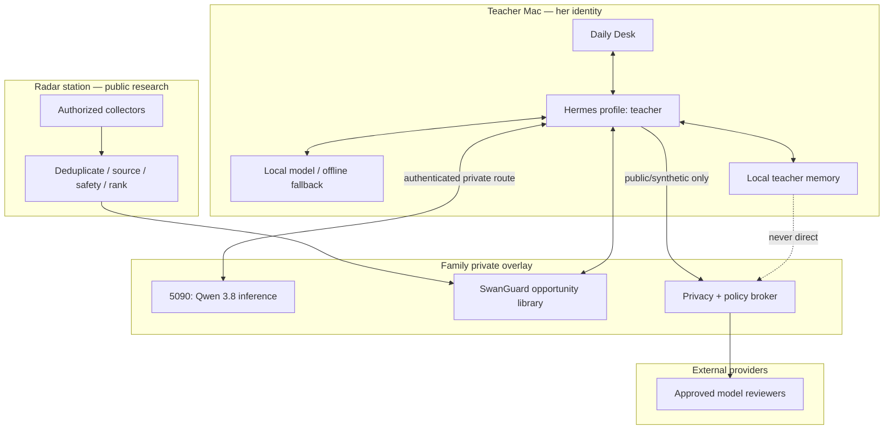
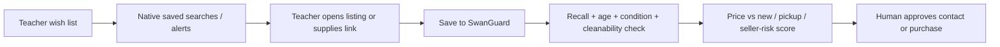

# Teacher Hermes + Classroom Radar — Master Blueprint

**Date:** 2026-08-21  
**Owner:** Sean and the teacher  
**Status:** IMPLEMENTATION BLUEPRINT — Mac installation not started; five-model panel pending approved spend  
**Supersedes:** any assumption that she should share Sean's Hermes memory/profile, that the Radar is mainly a field-trip engine, or that marketplace sites may be scraped  
**Companion gate:** `CLASSROOM-HERMES-PRIVACY-EGRESS-ASSURANCE-GATE-2026-08-21.md`

## Plain-English Summary

She should have her own Hermes on her Mac, with her own memory, habits, skills, credentials, and teacher workflow. Your always-on 5090 should be an optional private power source, not her identity and not a requirement for basic work. The Radar should continuously search public sources for age-appropriate ideas, timely school context, reusable materials, and bargains. SwanGuard should hold the shared, reviewable opportunity library.

Do not copy Sean's Hermes brain into hers. Package shared skills, public references, schemas, and approved SwanGuard capabilities; keep each person's memories and credentials separate. Give her a separate identity with full SwanGuard rights so either device can be revoked and audited without reducing her access.

The first release should make one daily job excellent: in under three minutes, turn the school calendar, current theme, weather, inventory, and her feedback into one realistic two-year-old activity, one movement option, one transition idea, and a short material list. Everything more ambitious follows only after she actually uses that loop.

## 1. What We Are Building

| Product | Job | Authority |
|---|---|---|
| Teacher Hermes | personal planning, local notes, drafts, memory, and conversation | teacher-owned |
| Private 5090 inference | Qwen 3.8 reasoning when the Mac is slower or offline quality is insufficient | family-controlled, private overlay only |
| Classroom Radar | collect public ideas, calendar context, supplies, discounts, reuse leads, and source evidence | research-only; no purchases/messages |
| SwanGuard classroom library | shared inbox, comparison board, approved ideas, wish lists, and provenance | both adults full access |
| External review panel | critique synthetic/generic plans after privacy gate | advisory only |

### Explicit non-goals

- no random or autonomous field-trip planning;
- no marketplace scraping, CAPTCHA evasion, automated seller contact, or purchasing;
- no cloud model receiving real student narratives, photos, voice, rosters, or family messages;
- no diagnosing, ranking, rewarding, punishing, or comparing two-year-olds;
- no AI-authored incident record presented as witnessed fact;
- no silent cloud fallback;
- no shared Hermes home or copied personal memories between spouses.

## 2. Corrected Architecture



### Trust boundaries

1. **Identity boundary:** her profile and credentials are distinct even though SwanGuard permissions are equal.
2. **Memory boundary:** personal memories never synchronize by copying folders; shared knowledge is published deliberately to SwanGuard or a versioned shared-skill package.
3. **Network boundary:** Ollama/Hermes services bind privately and require authenticated overlay access; no public port forwarding.
4. **Data boundary:** Radar handles public/synthetic context. Student-specific content stays local/private.
5. **Action boundary:** research and drafting are automatic; messaging, purchases, policy changes, and school-record writes require a human.

## 3. Her Daily Experience

```text
┌──────────────────────────────────────────────────────────────┐
│ GOOD MORNING — 90 seconds                                    │
│ Today: school rhythm • weather • theme • known constraints   │
├───────────────────────┬──────────────────────────────────────┤
│ DO THIS               │ EASY VERSION                         │
│ One core play activity│ 2-minute setup / materials on hand   │
│ Why it fits age two   │ substitutions if something is absent │
├───────────────────────┼──────────────────────────────────────┤
│ MOVE                  │ TRANSITION                           │
│ short gross-motor play│ song / visual / choice / calm cue    │
├───────────────────────┴──────────────────────────────────────┤
│ CARE ROUTINE FOCUS: meal • handwashing • rest • arrival cue │
│ SAFETY: choking • allergy-flag • sanitation • supervision   │
├──────────────────────────────────────────────────────────────┤
│ [Use] [Adapt] [Save] [Skip] [Ask Hermes]                    │
└──────────────────────────────────────────────────────────────┘
```

Card rules (panel 2026-08-21, D-06/D-07/D-11): auto-generated the night before, print-first, readable in ≤90 seconds. **No deals on the daily card** — bargains live only in the weekly human-approved queue. Allergy/safety flags come from a **deterministic local check**; the roster never enters any prompt, local or cloud.

### End-of-day, under 90 seconds

One tap: used / adapted / skipped. Optional second tap: engagement low/mixed/high or setup-too-hard. Optional: keep / change / never again; inventory used or now needed. No voice notes (rejected D-14 — ambient capture of children).

No child-level free text is required for the planning loop. Any school-required child record remains in the school-approved system.

## 4. Weekly Planning Board

The weekly board takes under 20 minutes and reuses successful routines instead of inventing five spectacles.

| Lane | Contents |
|---|---|
| Rhythm | official school dates, closures, special days, weather-sensitive constraints |
| Five day cards | repeated core routine with small variations and a two-minute fallback |
| Development | language, social-emotional, cognitive, gross/fine motor, self-help, creative play |
| Inclusion | communication, mobility, sensory, dual-language, temperament, participation adaptations |
| Materials | on hand, substitute, borrow/free, buy, optional |
| Evidence | source, age fit, confidence, safety notes, teacher feedback |

## 5. Two-Year-Old Teaching Doctrine

The classroom plan uses infant/toddler foundations, not a four-year-old worksheet curriculum.

1. Use warm, responsive back-and-forth interaction. Harvard describes “serve and return” as a key support for early language, social skills, and brain development.
2. Embed short learning opportunities in play, meals, cleanup, handwashing, dressing, and transitions. Head Start specifically frames these as meaningful infant/toddler contexts.
3. Offer repetition, modeling, simple language, concrete choices, songs, movement, and response time.
4. Adjust difficulty per child without turning developmental differences into grades or diagnoses.
5. Let AI prepare the adult; do not replace adult-child play with a screen.
6. Use CDC milestones as a broad observation reference, not a test or diagnosis. CDC defines them as things at least 75% of children can do by an age.
7. Favor process art and sensory exploration with explicit ingestion, allergy, choking, and sanitation checks—not a required identical product.
8. Material ban list: water beads, latex balloons, high-powered magnets, button batteries, cords/strings, non-age-graded small parts. Found-content rubric: 1–3 steps, adult-prepped, process-not-product, passes the small-parts test, group time ≤5 minutes and voluntary.
9. Biting/incidents: environment and prevention suggestions only — never behavior plans, consequence language, or AI-authored incident narratives. Escalate per school policy. No structured per-child observation capture in v1 (D-27).

### High-value activity pattern

Every recommendation must include:

- **goal:** one simple functional or playful opportunity;
- **materials:** no more than five, with on-hand substitutes;
- **launch:** one sentence the teacher can say;
- **child action:** touch, move, choose, imitate, name, match, carry, scoop, pretend, or help;
- **adult response:** notice, imitate, expand language, wait, offer one level of help;
- **exit:** clean transition before interest collapses;
- **safety:** supervision and material-specific checks;
- **adapt:** easier, richer, sensory-reduced, and mobility/communication variants.

### Toileting correction

The public Fairmont Anaheim Hills FAQ and 2025 preschool handbook say preschool students must be fully potty-trained and independently use the restroom. The system must therefore treat this as a policy discrepancy to resolve, not assume classroom initiation of toilet training.

Until the director/staff handbook clarifies the two-year-old classroom:

- support predictable bathroom routines, easy clothing, neutral language, handwashing, privacy, and accident response;
- never shame, punish, force sitting, or turn accidents into behavior scores;
- draft family communication for teacher review only;
- keep child-specific toileting details out of external models.

## 6. Radar Research and Sourcing

### Source priority

1. official school calendar/handbook and teacher-approved curriculum sources;
2. California CDE/CDSS, Head Start, NAEYC, CDC/AAP, CPSC, public libraries;
3. established educator/reuse organizations and merchant pages;
4. public inspiration sources with provenance and age/safety review;
5. user-supplied secondhand listings.

### Radar schedule

| Cadence | Job | Output |
|---|---|---|
| daily 05:30 | calendar/weather/theme/source scan | capped daily candidates |
| daily 05:45 | dedupe, age-fit, safety, cost, setup scoring | top 3 + why others lost |
| weekly Thursday | next-week planning and material gap scan | five day-card candidates |
| weekly Friday | deals/reuse/borrow scan | wish-list board, not purchases |
| monthly | stale source, recall, dead link, and policy audit | maintenance receipt |

### Marketplace-compliant flow



Meta, OfferUp, and Craigslist restrict unauthorized automated collection. The Radar may use permitted notifications, emails, public merchant feeds, authorized APIs, or user-supplied URLs. It may not scrape those services or message sellers automatically.

Query and output contract (D-12/D-13): Radar queries come from a **controlled vocabulary** — never free text derived from teacher notes; query logs are audited. Radar emits **structured cards** (title, age-band, materials, safety flags, source URL, verified|generated) — never raw HTML or email into any model context. Deal alerts arrive only in a **dedicated deals inbox** that never receives parent or school mail. Every retailer source beyond the three cited marketplaces gets its own terms check before ingestion.

### Used-item safety gate

Reject or hold any listing that lacks enough information to verify:

- manufacturer/model and CPSC recall status;
- intended age and no detachable/breakable small parts for children under three;
- completeness, structural condition, sharp edges, exposed hardware, and tip-over risk;
- cleanability and suitability for sanitizing, especially mouth-contact materials;
- paint/lead, porous fabric/pest, battery, magnet, cord, water-bead, balloon, and ingestion hazards;
- school policy/vendor approval where required;
- pickup safety and total price compared with new.

### Promising local/public lanes to verify live

- OC Public Libraries Library of Things; Anaheim Link Labs makerspace (library card + orientation + appointment);
- Child Creativity Lab Depot (Santa Ana); Greener Good creative reuse and Teacher Shop;
- teacher discounts at established craft/education retailers; local Buy Nothing via native/manual workflow.

Availability, discounts, hours, and inventory are live facts and must be checked on the day of recommendation.

## 7. Mac Installation Plan

The Mac installation is a supervised, reversible sequence. Desktop control is used only after Sean starts that phase and the hardware/policy facts are visible on the Mac.

Prerequisites before M2 (panel D-17/D-18/D-22): the director's WRITTEN answer on child data on personal/family devices and on AI planning tools at all; a named operator with a maintenance cadence and the rule "operator unavailable ⇒ offline floor"; a written retention/purge policy (child departure, year-end, teacher departure, device loss).

| Phase | Action | Acceptance gate |
|---|---|---|
| M0 facts | record Apple Silicon model, RAM, macOS, free disk, FileVault, school-device policy, and the H0 runtime state — install status + 5-day gate result; the WRAP state machine in `mac-prep/H0-WRAP-DECISION.md` then governs (D-20) | no assumption remains |
| M1 protect | immediate screen lock, FileVault, REQUIRED dedicated standard macOS account, backup/restore point | restart and recovery verified |
| M2 install | verify current Hermes artifact; use official supported installer/CLI route | version, signature/source, `doctor` clean |
| M3 profile | create teacher-specific `HERMES_HOME`; `terminal.home_mode: profile` where separate CLI identity is desired; exclude the home from iCloud/Spotlight/Time Machine | no Sean memory/keys/session present; a second process cannot open the home |
| M4 local floor | install/verify Ollama without cloud sign-in; benchmark an approved local model | works with network disabled |
| M5 private 5090 | authenticated private overlay, TLS/auth, model allowlist, synthetic prompt only | public internet cannot reach endpoint |
| M6 SwanGuard | her full-access identity, device revocation, audit receipt, public Radar inbox | equal permissions, separate identity |
| M7 tools | enable filesystem/browser/computer-use skills one at a time | least access needed; revoke test passes |
| M8 privacy | connect only public/synthetic external review through broker | G0–G8 evidence before student-specific use |

### Model decision

Qwen 3.8 27B Q4_K_M is about 19 GB before context cache and macOS overhead. Panel 2026-08-21 (4/4, D-05): **27B is NOT the Mac local default** — rejected on 24 GB, measure-first candidate only on 32 GB. The invariant is **Qwen 3.8 on the 5090**; the Mac floor is a smaller, explicitly approved, measured local model — or template-only mode, the most reliable offline fallback. Exact tag/license/digest verified from what the machine actually lists. No unannounced model or cloud fallback.

The current Hermes website DMG must not be trusted blindly: an open upstream issue reports that the public macOS installer predates the newer “connect to existing Hermes” onboarding. Verify the downloaded artifact and feature behavior, or use the supported official CLI installer.

## 8. Shared Brain Without Shared Memory

```text
Sean Hermes memory ──X── Teacher Hermes memory
        │                       │
        └── publish approved shared assets ──┐
                                             ▼
                              SwanGuard / versioned skill pack
                              - public research
                              - schemas and prompts
                              - approved school-neutral skills
                              - Radar opportunities
                              - no credentials or personal history
```

Synchronization is publish/subscribe, not folder mirroring. Conflicts resolve in the shared store with provenance and an owner; private memories never participate. SwanGuard's schema **physically lacks child-capable fields** (D-15); identities are separate with individual audit and revocation. The 5090 receives generic prompts only — pseudonymous child narratives are still child records (D-16) — with a verified prompt-retention purge.

## 9. Implementation Sequence

### Build now

Verify the actual Mac facts and school data policy; install her isolated Hermes profile and local/offline floor; create the daily briefing and end-of-day feedback loop using only public/synthetic data; expose SwanGuard with her own full-access identity; establish the private 5090 synthetic test route; and create the Radar source registry, provenance schema, and safety score.

### Build next

Add official-calendar change detection, inventory/wish-list and substitute matching, compliant alert ingestion and manual listing capture, the privacy-broker caller inventory/network allowlist/adversarial suite, and the weekly planning/feedback board.

### Build later

Add an approved external panel for sanitized plans, school-approved integrations, richer Radar personalization from non-child-specific feedback, and optional mobile capture only after the simple daily loop earns repeat use.

### Reject or defer

Reject autonomous purchasing/messaging, raw marketplace scraping, direct school-system writes, whole-brain syncing, child-level cloud personalization, and a large custom app before the teacher demonstrates the daily habit.

## 10. Success Measures

| Outcome | Initial target |
|---|---:|
| daily brief opened | 4 of 5 school days |
| useful without major rewrite | at least 3 of 5 briefs |
| morning review time | under 3 minutes |
| weekly planning time | under 20 minutes |
| ideas using on-hand/borrowed materials | at least 60% |
| unsafe or age-inappropriate recommendation reaching teacher | 0 known |
| external requests containing canary/PII | 0 |
| autonomous messages/purchases | 0 |

If adoption is low, ask which substrate failed: timing, device location, interface, source quality, setup burden, or recommendation fit. Do not conclude that the assistant idea failed merely because a terminal-style interface failed.

## 11. Evidence Baseline

School/policy: [Fairmont FAQ](https://www.fairmontschools.com/anaheim-hills/faq), [preschool handbook](https://www.fairmontschools.com/USCAW%20-%20Fairmont%20Schools/Fairmont%20-%20Anaheim%20Hills/Download%20%26%20policies/Preschool%20Handbook%202025.pdf), and [calendar](https://www.fairmontschools.com/anaheim-hills/calendar). Teaching: [California two-year-old guidance](https://www.cde.ca.gov/sp/cd/ci/serving2yofaqs.asp), [infant/toddler publications](https://www.cde.ca.gov/sp/cd/re/cddpublications.asp), [NAEYC DAP](https://www.naeyc.org/resources/position-statements/dap/contents), [Head Start ELOs](https://headstart.gov/publication/embedded-learning-opportunities-faqs), [Harvard serve and return](https://developingchild.harvard.edu/key-concept/serve-and-return/), [CDC age-two milestones](https://www.cdc.gov/act-early/milestones/2-years.html), and [AAP toilet readiness](https://www.healthychildren.org/English/ages-stages/toddler/toilet-training/Pages/the-right-age-to-toilet-train.aspx).

Privacy/safety/local resources: [FTC COPPA schools guidance](https://www.ftc.gov/business-guidance/resources/complying-coppa-frequently-asked-questions), [California ELPIPA index](https://leginfo.legislature.ca.gov/faces/codedisplayexpand.xhtml?tocCode=BPC), [CPSC reseller guide](https://www.cpsc.gov/s3fs-public/254_ResellersGuide_2-5-25.pdf), [OCPL Library of Things](https://www.ocpl.org/books-more/library-things), [Anaheim Link Labs](https://www.anaheim.gov/6445/Link-Labs), [Child Creativity Lab](https://www.childcreativitylab.org/depot-for-reuse), and [Greener Good](https://www.greener-good.org/about-us). Runtime: [Hermes docs](https://hermes-agent.nousresearch.com/docs/), [profiles](https://hermes-agent.nousresearch.com/docs/user-guide/profiles/), [configuration](https://hermes-agent.nousresearch.com/docs/user-guide/configuration/), [Ollama macOS](https://docs.ollama.com/macos), and [Qwen 3.8 27B GGUF](https://huggingface.co/ggml-org/Qwen3.8-27B-GGUF).

## 12. Panel Status and Decision Ledger

The five-model panel ran 2026-08-21 on the frozen packet (SHA-256 `FF09857BBDD5D86563AC1FA13CBB4ADA26C1DE04E1B16C43F7F1C31855061AE5`, verified before send): Kimi K3, GLM 5.3, Grok 4.6, GPT-5.6 Sol Pro, one attempt each, plus the Fable 5 final synthesis. Result: **4/4 REVISE → Fable verdict REVISE BEFORE MAC.** Spend: $0.9915 of the $2.50 cap + one GLM plan credit. ADOPT decisions are folded into this blueprint; the full classification lives in `docs/ai-workflow/AI-HANDOFF/panel-classroom-hermes-radar-claude-2026-08-21/DECISION-LEDGER.md` with the synthesis beside it. Remaining blockers before supervised Mac setup — all facts, no open design: H0 runtime state (D-20 design half = **WRAP**, per `mac-prep/H0-WRAP-DECISION.md`; if the 5-day gate is mid-flight, no teacher-visible change until it completes), the director's written data/AI answer (D-22), and the actual Mac facts (D-23).
