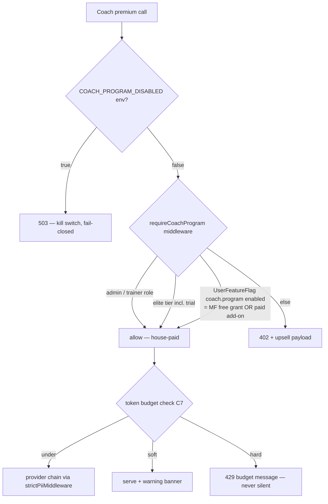
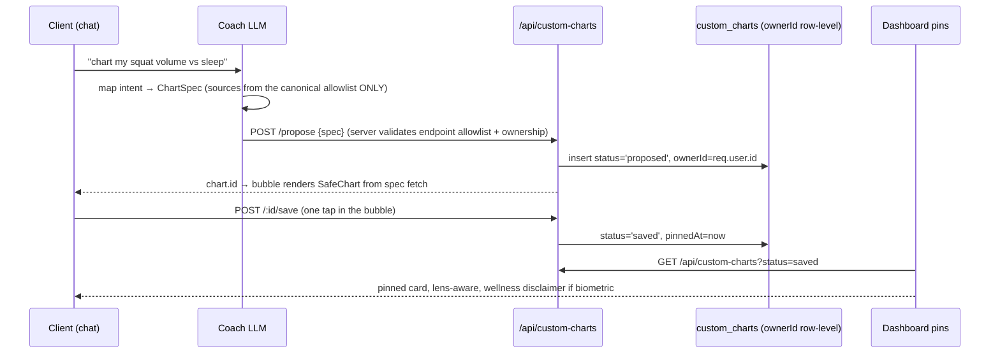
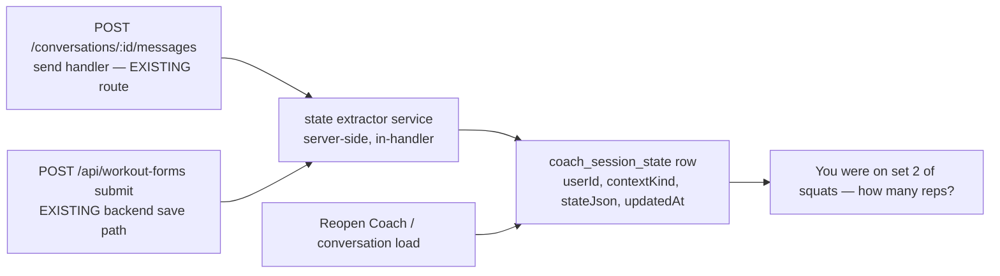

# C-PACK — SWAN COACH PROGRAM (Lane 2 · §8b Agent-Pack Contract) · v2.0

> **Pack id:** `coach-program-pack-2026-07-14` · **Author:** Fable (Final Decider) ·
> **Source mandate:** SUPER-PROMPT §5 (Workstream C — highest-value pack; internal
> codename "Jarvis", NEVER user-facing), Village consensus adoptions (§10:
> CustomChart state machine + hook decomposition + shared-write-path law; security/
> data-safety CRITICALs), Phase-2C chat design seed (binding), Rule 62 strategy gate.
> **Executing agent:** SEPARATE from Lane-1 and from the A-pack agent. Read
> `.ai-workflow/coordination/*` and claim your lane first (Rule 67).
> **Acceptance test:** you can build every phase without asking ONE design question.
> If you hit a design decision this pack does not answer — STOP and escalate (§7).
> **Escalation posture:** this pack touches BILLING and PII. The §7 triggers are
> not advisory: any Stripe object creation, any schema migration, any gating flip
> is a stop-and-confirm with Sean even though this pack specs them.
> **v1.1:** hostile-review round-1 findings folded — the C1 gate redesigned
> against requireTier.mjs ground truth (dedicated fail-closed middleware + env
> kill switch; the FEATURE_GATES rename is DROPPED), add-on purchase/persistence
> fully specified (second Stripe sub → UserFeatureFlag webhook), context-state
> writes piggyback the send route (dispatchWorkoutLogged is frontend-only),
> export re-ruled to the proven client-canvas idiom + signed serving, C7 gains
> step 0 (chat path does NOT write AiInteractionLog today), requireSubscription
> premise corrected (it is throttling, NOT a paywall — C1 is a free→matrix
> ACCESS CHANGE), Village-contract drift declared, non-LLM retention summarizer,
> provider-native realtime transport supersession, Venice 4th provider, FTC
> receipt wording.
> **v1.2:** round-2 findings folded — webhook add-on discriminator + exclusion
> guard (metadata.addOn stamps; the existing mode==='subscription' block RETURNS
> for add-on events before touching tier), sanctioned add-on cancel extension,
> the three stale requireTier('coach.program') instances swept to
> requireCoachProgram, auto-trial exclusion rules (free-tier auto-trial and MF
> clients never pass rule 2), requireCoachProgram resolves entitlement via its
> OWN direct Subscription query (deliberately divergent trial policy,
> documented), C2 mount = coachModule slot prop per the programShelf precedent,
> C3 write-lane enumeration, 9-case matrix sync.
> **v1.3:** round-3 findings folded — boundary law 3 de-staled; add-on revoke
> sets enabled:false (+ the 10th matrix case); ONE frontend read path for
> add-on state via GET /status `addOns.coach`; admin toggle three-state write
> semantics sanctioned on the existing PUT; payment-failure lane re-ruled to
> Stripe dunning auto-cancel → subscription.deleted; webhook guard responds
> before returning; MF exclusion set = exactly {'move_fitness'}.
> **v1.4:** round-4 findings folded — addOns.coach splits paid vs granted
> (active-paid / active-granted; cancel row renders ONLY on active-paid);
> toggle guarded against live paid rows (409 + a fourth 'cancel-paid' admin
> action); admin state read sanctioned (derived state on the existing admin
> GET); dunning re-ruled as the ACCOUNT-level Stripe setting with Crystalline
> blast-radius disclosure + a per-event fallback lane; 11th matrix case
> (MF + active elite → 402).
> **v1.5:** round-5 findings folded — live-paid guard covers paid-offered +
> cancel-paid idempotency + state-aware §4.3 control; lane B gains its
> missing cancel action; MF self-enroll bypass closed ('unavailable' state +
> 403 checkout guard); duplicate-purchase 409; §4.2 export de-staled to the
> C4 ruling (png-only, POST upload); C7 cache keyed per-user.
> **v1.6:** round-6 findings folded — guard condition = derived state
> 'active-paid' (a cancelled row keeps 'stripe:' notes; bare notes-check
> would lock rows forever) + post-revoke-writable test; 'unavailable' joins
> the declared union; admin derivation does NOT apply the MF override;
> export + signer generalization move wholly into C5 (C4 = render +
> disclaimer only); lane B idempotent; cache restricted to the chit-chat
> tier.
> **v1.7:** round-7 findings folded — /transcribe + /tts ruled premium (gated
> in C1: they spend LLM tokens); realtime sessions metered into
> AiInteractionLog (C6) so C7 budgets cover the most expensive lane; the
> three stale C4-export attributions swept to C5; admin read = the five true
> states, never 'unavailable'.
> **v1.8:** round-8 findings folded — realtime metering made server-anchored
> (broker writes the session-start pending row; unreconciled sessions billed
> at the estimate-rate × max-duration cap; the client end-checkpoint only
> REFINES downward-verifiable usage, never sets the floor); C4 heading
> de-staled.
> **v1.9:** round-9 findings folded — end-checkpoint demoted to a CLAIM; the
> sweep (nightly, same cron family as C1's retention job) is the SOLE
> finalizer and only after the session's max-duration window closes
> (early-checkpoint-then-keep-talking can no longer zero-bill); pending rows
> count at cap until finalized.
> **v2.0:** round-10 findings folded — the finalization formula is PINNED
> (claims are upward-only; every session finalizes at estimate×cap OR the
> higher claim; fairness comes from SHORT 10-minute mint windows with
> re-mint budget checks, not from downward claims); the C6 billing test
> suite specified; C6 heading de-WebRTC'd.

---

## 1. FABLE VISION STATEMENT (exact language — do not reinterpret)

Swan Coach is the product's voice. It lives ON the home page — the first thing
a client and a trainer see — not in a tab-hotel. It is a persistent, resumable,
voice-first coaching conversation that KNOWS the training record, renders live
charts inside the chat, and lets a client conjure a custom chart with a
sentence and pin it to their dashboard like a first-class card. It must feel
like a brilliant coach with perfect memory: calm, immediate, never salesy,
never clinical. It is a FITNESS COACH, never a doctor, and it never pretends
otherwise.

The wedge (Rule 62): Coach deepens the trainer-led loop — next best action,
progress proof, adherence. Everything in this pack must strengthen coaching,
adherence, progress proof, community, revenue, or trust; anything else is cut.

Economics are part of the product: admins and trainers get Coach as house-paid
tooling; SwanStudios clients unlock it as a $9.99/mo self-serve upgrade; Move
Fitness clients get it only when Sean's admin toggle grants it (paid or free
path). The $20 Gemini plan is NOT a public utility — budgets and tiering are
features, not afterthoughts.

Where it sits: the Coach PROGRAM is a parent capability. Its children are the
home-page module (client + trainer), the full Coach page (exists today), the
chart bubbles, the custom-chart builder, and the dashboard pin cards. The
existing coach-assistant page family is the foundation — this pack UPGRADES
and DECOMPOSES it; it does not rebuild it.

---

## 2. ARCHITECTURE (ground truth · contracts · boundary laws · forbidden patterns)

### 2.1a WHAT ALREADY EXISTS (receipts — build ON these, do not rebuild)

Line counts exact (`wc -l`, 2026-07-14):

| File | Lines | Truth |
|---|---|---|
| `frontend/src/hooks/useAIChat.ts` | 611 | THE chat hook. Conversations persist server-side: `POST /api/ai-chat/conversations`, `GET /conversations` (list, 5-min cache), `GET /conversations/:id` (full history), `POST /conversations/:id/messages`, archive/delete. Resumable threads EXIST. |
| `backend/models/AiConversation.mjs` | 106 | Table `ai_conversations`: `userId`, `role`, `title`, `context` (13-value enum incl. `coach_assistant`), `targetUserId`, **`messages` JSONB** (whole thread in one row), `status`, `metadata` (provider/token counts), `messageCount`, `lastMessageAt`. |
| `backend/routes/aiChatRoutes.mjs` | 1177 | Full CRUD + `POST /transcribe` (:987) + `POST /tts` (:1043). Message send (:540) passes `requireSubscription('pro', {feature:'chat'})` — which is **NOT a paywall**: its own header says AI is free for everyone; it is anomaly-throttling (50 req/min cooldown) + monthly usage counters. Chat is FREE for all users TODAY. Also `aiRateLimiter` + `strictPiiMiddleware`. 200-msg cap (:677). |
| `backend/services/aiChatService.mjs` | 2211 | Provider chain **Gemini → OpenAI → Anthropic → Venice** (four providers, env-key presence, :1966-2014; Venice at :1976). LLM context = last 6 messages (`MAX_HISTORY_MESSAGES`, :1858-1866). Normalizes `tokenUsage` per provider (:2052-2155). **Chat path does NOT write `AiInteractionLog`** — its consumers are the workout/schedule AI lanes; chat token usage lives only in `AiConversation.metadata`. |
| `backend/middleware/piiSanitizationMiddleware.mjs` | 330 | `strictPiiMiddleware` on the send route — identity-blind outbound (Rule 8). Test exists. |
| `backend/models/AiInteractionLog.mjs` | 105 | Per-call audit: provider, promptVersion, tokenUsage, SHA-256 hashes of de-identified payload/response. |
| `backend/models/UserFeatureFlag.mjs` | 81 | `user_feature_flags`: `userId`, `featureKey`, `enabled`, `grantedBy/At`, `revokedAt`, `notes`; unique (userId, featureKey). Built generically — THE Move-Fitness toggle extension point. Routes: `featureFlagRoutes.mjs` (34) `GET /me`, admin `PUT /:featureKey/:userId`, bulk. |
| `backend/routes/subscriptionRoutes.mjs` | 776 | `GET /tiers` `GET /status` `POST /start-trial` `POST /checkout` `POST /cancel` `POST /webhook` `GET /admin/all` **`POST /admin/grant`** (:731 — admin comp path exists). |
| `backend/models/Subscription.mjs` | 145 | `tier ∈ ['free','pro','elite']` (free=Starter · pro=Guardian donation · elite=Crystalline $24.99), `status`, `amount`, trial fields, Stripe ids, `cancelledAt`. |
| `backend/config/tierCatalog.mjs` | 243 | `FEATURE_GATES` (:160): `coach.chat: 'free'`, `charts.basic: 'free'`, `charts.full: 'pro'`, … enforced by `middleware/requireTier.mjs` (402 on insufficient) and `middleware/requireSubscription.mjs` (252). |
| `backend/routes/clientAnalyticsRoutes.mjs` | 288 | **21 `GET /chart-*` endpoints** under `/api/client/analytics/` (teaser vs Guardian gating). Sibling surface: `routes/analyticsRoutes.mjs` (199) `/:userId/chart-*` for trainer/admin scope (`requireOwnershipOrTrainer`). |
| `backend/routes/goalRoutes.mjs` / `routes/wearableDataRoutes.mjs` | 304 / 329 | Goals + wearables endpoints EXIST (custom-chart sources). |
| `backend/services/voiceTranscriptionService.mjs` | 248 | `transcribeAudio(buffer)` — multer memoryStorage, base64 → Gemini inline, **zero fs/DB/R2 writes: audio is transcribe-and-discard TODAY** (GDPR Art. 9 posture already correct — receipt it, don't rebuild it). |
| `backend/services/photoUrlSigner.mjs` | 104 | Short-TTL HMAC signer (15-min, fail-closed, constant-time). Path-generic core — C5 GENERALIZES it (with the export endpoint); do not write a second HMAC implementation. |
| `frontend/src/components/DashBoard/Pages/coach-assistant/SwanCoachAssistantPage.tsx` | 296 | The full Coach page + its 42-hook family (voice controls 73, CoachInputBar 256, ComposerPanel 109, dock 300, usePremiumTTS 189, useCoachBrowserSpeechInput 260, useVoiceRecorder 190, useGeminiTranscription 80). |
| `frontend/src/components/UserDashboard/components/ClientDashboardHomeTab.tsx` | 274 | CLIENT home composition (route `/dashboard/client/overview` → `ClientHomeTab` 58-line bridge). "Ask Coach" quick action EXISTS (:159). |
| `frontend/src/components/DashBoard/Pages/trainer-dashboard/TrainerHomeTab.tsx` | 257 | TRAINER home. Per-session "Coach" dictate button (:189) + "Ask Coach" (:236) EXIST. |
| `frontend/src/components/Charts/SafeChart.tsx` | 163 | The chart error boundary — chart bubbles render through it, always. |
| `frontend/src/hooks/useSubscription.ts` | 216 | `tier`, `hasGuardianAccess` (= pro‖elite‖trial), `checkout(tier)` (typed `'pro'|'elite'` — the add-on extends this, C1), `cancel()`. §7b self-serve cancel SHIPPED (`140cb404d`, 2026-07-12, live) as a 2-tap arm→confirm on the billing card — this MEETS the FTC click-to-cancel requirement (deliberate confirm step); the pack DoD verifies PRESENCE, not tap count. |

**Greenfield (verified ABSENT — the pack builds these):** WebRTC (zero hits
repo-wide) · retention/summarization policy · per-user token budgets ·
per-feature paid add-on (no $9.99 product anywhere) · custom-chart
schema/CRUD/pins · chart-image export · home-page embedded Coach module ·
conversational context state machine.

### 2.1b PACK RULINGS on discovered conflicts (binding)

1. **Gating truth (money-path):** chat is FREE for everyone TODAY —
   `requireSubscription` is anomaly-throttling + usage counters (its header
   says so), and `tierCatalog.mjs` agrees (`coach.chat: 'free'`). C1 is
   therefore an **ACCESS CHANGE** (free → the §3.0 matrix), not a vocabulary
   cleanup. RULING: the gate is a NEW dedicated middleware,
   `requireCoachProgram` (C1 spec, §2.2b) — NOT `requireTier('coach.program')`
   (that literal call passes a feature key where the middleware expects a
   TIER; `TIER_RANK[unknown] ?? 0` = free = ADMITS EVERYONE — fail-open).
   The `coach.chat` FEATURE_GATES key is left UNTOUCHED (a rename would
   fail-open every consumer still reading it, incl. the frontend mirror
   `frontend/src/config/tierCatalog.ts:62,97`). `requireSubscription` STAYS in
   the chain (its throttling + counters must survive); `requireCoachProgram`
   is ADDED after it. Because live client access changes, C1's flip is an
   EXPLICIT Sean-confirm before merge (§7).
2. **Chart surfaces (Rule 27):** `clientAnalyticsRoutes.mjs`
   (`/api/client/analytics/chart-*`, self-scoped) is CANONICAL for
   client-facing reads — the canonical progress grid consumes it. The
   `analyticsRoutes.mjs` `/:userId/chart-*` family is the trainer/admin-scoped
   variant (ownership-gated). Custom-chart sources bind to the canonical
   family + `goalRoutes` + `wearableDataRoutes`; NEVER add a third chart
   surface.
3. **Design seed variance:** `docs/ai-workflow/design-brain/design.md` §14
   says coach bubbles carry an "Ice Wing accent edge"; the Phase-2C
   Village-ratified seed (§4.4 below) says purple left border. RULING: the
   Phase-2C seed WINS (it is the §5 binding spec and newer); the executing
   agent notes the design.md reconciliation in its closeout — do NOT edit
   design.md in this pack.
4. **Village hook names vs reality:** the consensus decomposes "useCoachState"
   — the real monolith is `useAIChat.ts` (611 lines). The decomposition
   targets in §2.3 law 6 apply to useAIChat.

### 2.2 Contracts (verbatim — the executing agent codes against THESE)

```ts
// ── Custom charts (Village architecture consensus, adopted with TWO
//    declared pack amendments: (a) ownerId string→number — Users.id is an
//    integer PK; (b) ChartSpec DEFINED here — the Village text referenced
//    it without defining it. Everything else is the consensus shape.) ──
// ONE canonical shape. One source of truth: the backend.
type CustomChartStatus =
  | 'ephemeral'    // in chat only, not yet proposed
  | 'proposed'     // Coach has generated, awaiting client confirm
  | 'saved'        // persisted to DB, pinned to dashboard
  | 'unpinned';    // saved but removed from dashboard (still in history)

interface CustomChart {
  id: string;                    // uuid, assigned at 'proposed'
  status: CustomChartStatus;
  ownerId: number;               // Rule 8 + Village data-safety CRITICAL 4:
                                 // ownership enforced at the SCHEMA level;
                                 // EVERY fetch re-checks ownerId === req.user.id
                                 // (or existing trainer-ownership gate)
  spec: ChartSpec;               // canonical chart definition (below)
  createdAt: string;
  pinnedAt: string | null;
  // NO duplicate fields between chat and dashboard shapes
}

interface ChartSpec {
  title: string;                 // PII-sanitized before ANY outbound LLM call
  source: {                      // ONLY these three source families
    kind: 'analytics' | 'goals' | 'wearables';
    endpoint: string;            // MUST be one of the canonical route strings
    params?: Record<string, string>;
  }[];                           // 1-2 sources (overlay max = 2 series)
  representation: 'line' | 'bar' | 'area';  // familiarity budget: no exotic
                                            // marks in v1 (Chart Charter)
  windowDays: 30 | 90 | 180;
}

// ── Entitlement middleware (C1 — the ONLY Coach gate; fail-closed) ──
// backend/middleware/requireCoachProgram.mjs (NEW, ≤120 lines)
// Order of resolution (first hit wins):
//   0. process.env.COACH_PROGRAM_DISABLED === 'true'  → 503 kill switch
//      (explicit boolean — NEVER tier-rank math, which is fail-open)
//   1. req.user.role ∈ {'admin','trainer'}            → allow (house-paid)
//   2. subscription row says tier==='elite' AND (status==='active' OR
//      (status==='trial' AND trialEndDate in the future))  → allow.
//      TRIAL EXCLUSIONS (binding): GET /status AUTO-CREATES a
//      { tier:'free', status:'trial', +30d } row for every user
//      (subscriptionRoutes.mjs:114-133) — that free-tier auto-trial does
//      NOT pass rule 2 (tier check is 'elite', not effective-trial math).
//      This is DELIBERATELY divergent from requireTier's site-wide
//      trial-is-elite policy: Coach is matrix-gated, not trial-blanket.
//      Move Fitness clients NEVER pass rule 2 regardless of subscription
//      state (matrix: OFF unless the admin toggle grants). Identification:
//      User.clientSource === 'move_fitness' EXACTLY (the field exists —
//      backend/models/User.mjs:416, canonical values in
//      backend/schemas/clientSource.mjs). Do NOT reuse the
//      isNonDeductingClientSource predicate — it also matches 'external',
//      which the matrix does not exclude. Exclusion set = {'move_fitness'},
//      nothing else.
//   3. UserFeatureFlag('coach.program').enabled        → allow
//      (covers BOTH the MF free grant AND the paid add-on — see below)
//   4. else → 402 { upsell: { price: '$9.99/mo', feature: 'coach.program' } }
// ENTITLEMENT SOURCE: the middleware queries the Subscription row DIRECTLY
// (findOne by userId) inside its own try/catch → 503 on ANY error. It does
// NOT reuse requireTier's module-private resolver (that helper fails open
// to the JWT claim on DB error and encodes the site-wide trial policy —
// both wrong for this gate; the divergence is intentional and documented).
// requireSubscription stays mounted BEFORE this (throttle + counters live).

// ── $9.99 add-on: purchase + persistence (C1) ──
// The add-on is a SECOND Stripe subscription (its own Price, created by
// Sean — §7 escalation) alongside any tier sub. It NEVER touches
// Subscription.tier (enum stays ['free','pro','elite']).
// Persistence + DISCRIMINATION (exact mechanism — the existing webhook's
// mode==='subscription' block at subscriptionRoutes.mjs:566-619 defaults
// metadata.tier to 'elite' and WOULD hijack the add-on into a free
// Crystalline upgrade unless guarded):
//   - Checkout stamps BOTH the Checkout Session metadata
//     { addOn: 'coach' } AND subscription_data.metadata.addOn='coach'
//     (so renewal/cancel events carry the marker on the Subscription obj).
//   - The EXISTING mode==='subscription' handler gains a FIRST guard:
//     if (session.metadata?.addOn === 'coach') → run the add-on branch and
//     RETURN — it must NEVER reach the tier-mapping lines (never touches
//     Subscription.tier or User.subscriptionTier).
//   - Add-on branch: UPSERT UserFeatureFlag { featureKey: 'coach.program',
//     enabled: true, revokedAt: null, notes: 'stripe:<subscriptionId>' }.
//     The branch RESPONDS `res.json({received:true})` and returns — a bare
//     early return would hang Stripe's delivery and eventually disable the
//     whole webhook endpoint.
//   - REVOKE: on customer.subscription.deleted where
//     subscription.metadata.addOn==='coach' → set { enabled: false,
//     revokedAt: now } (BOTH — rule 3 reads `enabled`; revokedAt alone
//     would leave access on forever). PAYMENT FAILURES — two lanes, Sean
//     picks at the §7 escalation (both fully specced so the build never
//     stalls):
//     LANE A (preferred, zero code): the Stripe ACCOUNT-level Billing
//     setting "cancel subscription after final failed retry". DISCLOSURE:
//     this is account-wide — it also changes the EXISTING Crystalline
//     tier's behavior, whose past_due subs currently park un-cancelled
//     (subscriptionRoutes.mjs:658-675). Sean must accept that blast
//     radius explicitly.
//     LANE B (per-event, add-on-scoped): on invoice.payment_failed where
//     invoice.next_payment_attempt === null (the FINAL retry), retrieve
//     the subscription by id (invoice.subscription) via the Stripe API;
//     if its metadata.addOn === 'coach', CALL THE STRIPE CANCEL API on
//     that subscription — IDEMPOTENT (catch already-canceled as success:
//     Stripe delivers at-least-once and the deleted event may precede a
//     redelivered payment_failed; an uncaught error here would non-2xx the
//     whole webhook endpoint). The cancellation fires
//     customer.subscription.deleted, which performs the single revoke.
//     (Without this explicit cancel, the sub parks past_due forever and
//     access never revokes — verified: existing past_due subs park
//     un-cancelled, subscriptionRoutes.mjs:657-675.) Crystalline behavior
//     unchanged.
//     Either way the deleted-event revoke above is the single revoke
//     implementation.
// ONE entitlement read path server-side (the flag). ONE read path for the
// FRONTEND: GET /api/subscriptions/status gains
//   addOns: { coach: 'none' | 'offered' | 'active-paid' | 'active-granted'
//             | 'cancelled' | 'unavailable' }
// DERIVATION PRECEDENCE (evaluate top-down; first match wins):
//   cancelled (revokedAt set) → active-paid → active-granted → offered →
//   none; THEN the MF override maps none/cancelled → 'unavailable'
//   (client-side status ONLY — the ADMIN read below never applies the MF
//   override: admins see the true state, else the first MF grant could
//   never be initiated).
// derived server-side from the flag row:
//   offered        = enabled:false + notes:'offered-paid' + revokedAt null
//   active-paid    = enabled:true  + notes starts with 'stripe:'
//   active-granted = enabled:true  otherwise (admin-free grant)
//   cancelled      = revokedAt set
//   none           = no row
//   unavailable    = MF OVERRIDE: for User.clientSource==='move_fitness',
//                    'none' and 'cancelled' are REPORTED AS 'unavailable'
//                    (the matrix says MF access is admin-initiated ONLY —
//                    an MF client must never be pitched the $9.99 purchase;
//                    that is the poaching-optics line the MF white-label
//                    doctrine draws).
// Raw notes NEVER reach the client. Render rules (exact): the $9.99 cancel
// row renders ONLY on 'active-paid' (an admin-granted MF client must never
// see a price for money they don't pay); the consent module renders on
// 'offered'; the upsell renders on 'none'/'cancelled'; NOTHING renders on
// 'unavailable' (the home module simply omits the Coach input/upsell row).
// SERVER-SIDE MIRROR (law 3 — render rules are display sugar): the
// checkout add-on branch REFUSES User.clientSource==='move_fitness' unless
// their flag row is currently 'offered' → 403 "Swan Coach access is
// managed by your trainer." It also returns 409 when addOns.coach is
// already 'active-paid' (a duplicate purchase would create a second live
// sub and orphan the first — same strand class the admin guard blocks).
// Checkout: the EXISTING POST /api/subscriptions/checkout gains the
// sanctioned extension `{ addOn: 'coach' }` (route family unchanged —
// §6 permits exactly this extension); useSubscription.checkout's type
// widens accordingly.
// CANCEL (FTC — the NEW recurring charge needs its own self-serve exit):
// the EXISTING POST /api/subscriptions/cancel gains the sanctioned
// extension `{ addOn: 'coach' }`: it finds the add-on subscription id from
// the flag row's notes ('stripe:<subId>'), sets cancel_at_period_end on
// THAT Stripe subscription, and the webhook's deleted event soft-revokes
// the flag. Frontend: ClientMembershipCard renders an add-on row
// ("Swan Coach — $9.99/mo") with the SAME 2-tap arm→confirm affordance
// whenever the flag is active with stripe notes. §8 DoD verifies the
// add-on cancel PRESENCE as well as the tier cancel.
// Admin three-state toggle (MF clients) maps onto the flag row:
//   Off  = no row, or { enabled:false, revokedAt: set }
//   Free = { enabled: true,  grantedBy: <adminId>, notes: 'admin-free' }
//   Paid-offered = { enabled: false, revokedAt: null,
//                    notes: 'offered-paid' } ← webhook success flips it to
//        enabled=true + notes='stripe:<subId>'
// CONTROLLER AMENDMENTS (sanctioned — the existing write path force-stamps
// revokedAt whenever enabled===false, which would collapse Paid-offered
// into Off):
//   WRITE: the existing admin PUT /api/feature-flags/:featureKey/:userId
//   gains `state: 'off' | 'free' | 'paid-offered' | 'cancel-paid'`.
//   - off / free / paid-offered implement the exact rows above
//     (paid-offered bypasses the force-revoke stamp).
//   - LIVE-PAID GUARD: while the row's DERIVED STATE is 'active-paid'
//     (enabled:true AND notes starts with 'stripe:' — NEVER a bare notes
//     check: a cancelled row RETAINS its 'stripe:' notes, and a bare check
//     would 409 the row forever after revoke), 'off', 'free', AND
//     'paid-offered' are ALL REFUSED
//     with 409 "Cancel the paid add-on first" — any of the three would
//     strand a live recurring charge and/or overwrite the stored
//     subscription id (orphaning the charge with no self-serve exit).
//   - 'cancel-paid' (the fourth action): valid ONLY on active-paid rows —
//     on any row whose notes lack a 'stripe:' id → 409 "No paid add-on on
//     this account". Reads the sub id from notes, sets
//     cancel_at_period_end; IDEMPOTENT: an already-cancelling or
//     already-canceled Stripe sub is treated as success (catch Stripe's
//     already-canceled error). The webhook's deleted event performs the
//     revoke (enabled:false + revokedAt), after which off/free/paid-offered
//     become writable.
//   ADMIN READ: the existing admin GET /api/feature-flags/:featureKey rows
//   gain a derived `state` field carrying the FIVE TRUE STATES
//   (none/offered/active-paid/active-granted/cancelled — NEVER
//   'unavailable': the MF override is client-status only) so
//   the §4.3 row control can render truthfully (today's response cannot
//   distinguish Off from Paid-offered or Free from Paid-active). Derived
//   only — raw notes are not added to the response.
//   GET /api/feature-flags/me is UNTOUCHED — the client-side frontend reads
//   add-on state exclusively from GET /status addOns.coach.
// (UserFeatureFlag needs NO schema change.)

// ── Realtime voice (provider-abstracted; C6) ──
interface RealtimeVoiceSession {
  start(opts: { ephemeralToken: string; onTranscript: (t: TranscriptEvent) => void;
                onAudio: (chunk: ArrayBuffer) => void; onStateChange: (s: VoiceSessionState) => void }): Promise<void>;
  sendAudio(chunk: ArrayBuffer): void;
  stop(): Promise<void>;
}
type VoiceSessionState = 'connecting' | 'listening' | 'thinking' | 'speaking' | 'ended' | 'failed';
// Providers implement this interface; the app imports ONLY the interface.
// TRANSPORT SUPERSESSION (pack ruling): SUPER-PROMPT §5 says "WebRTC"; the
// sole permitted first provider (Gemini Live) exposes a WebSocket realtime
// channel (bidiGenerateContent), not client-direct WebRTC. This pack
// supersedes the transport WORD with "the provider's native realtime
// channel (WebSocket or WebRTC per provider)". The interface above is
// transport-agnostic; the sub-second latency target stands unchanged.
// First implementation: Gemini Live. NO OpenAI dependency without Sean's
// explicit approval. Fallback = the SHIPPED chain (browser dictation /
// recorder → /transcribe → chat → /tts) — documented, not rebuilt.
```

### 2.3 Boundary laws (violating any = REJECT at review)

1. **Shared write path (Village CRITICAL):** every write the Coach can trigger
   goes through the SAME service layer as the human UI — no parallel
   `/api/coach/*` write family. Custom-chart CRUD lives at ONE route family
   (`/api/custom-charts`, C5) used by chat AND dashboard identically.
2. **Chat transcript holds `chart.id` references ONLY** — never a full spec.
   Dashboard queries `GET /api/custom-charts?status=saved`; Coach context
   reads the same endpoint; NO local spec copies (Village single-source law).
3. **Server-side entitlement on EVERY premium call** — the gate is
   `requireCoachProgram` on every Coach premium route (never `requireTier`
   with a feature key — fail-open, 2.1b-1), never client-only checks.
   Client-side `useSubscription`/flag reads are display sugar.
4. **Zero-PII outbound (Rule 8):** every LLM-bound body — including free-form
   chart titles/descriptions — passes the existing `strictPiiMiddleware`
   path. C1 adds the regression test that injects known PII strings and
   asserts zero presence in outbound payloads.
5. **Raw voice audio is NEVER persisted** — the shipped transcribe-and-discard
   posture is a LAW, not an accident. C6's realtime path must also keep audio
   in-memory/transport-only; transcripts only.
6. **Hook budgets (Village consensus, binding):** `useCoachSession` ≤200 ·
   `useCoachMessages` ≤200 · `useCoachCost` ≤150 · `useVoiceInput` ≤150,
   strict import boundaries (session ↛ messages internals; cost imports
   neither). `useAIChat` becomes a thin composition ≤120 or is retired with a
   re-export shim during migration.
7. **FDA General-Wellness line:** the system prompt carries the hard rule
   (coach, not doctor; never diagnose; never interpret biometrics as medical
   symptoms). The forbidden-phrase regression suite (C1) is a merge gate for
   EVERY later phase.
8. **Coach is never "AI" user-facing** — copy says "Swan Coach". "Jarvis" is
   an internal codename that must not appear in any user-visible string.

### 2.4 Forbidden patterns

New chart rendering library (Victory only, Rule 10) · a second HMAC signer ·
a third chart route surface · localStorage entitlements · unbounded JSONB
growth (C1 retention is a prerequisite for GA) · OpenAI realtime voice without
Sean's written OK · raw audio at rest anywhere (R2 included) · Coach-initiated
writes outside the shared service layer · exotic chart marks (radar/heatmaps)
in custom charts v1 · client-side model selection.

---

## 3. FLOWS (mermaid — one per user story)

### 3.0 Economics matrix (the §5 table, binding)

| Audience | Default | Path |
|---|---|---|
| Admin + trainers | ON, house-paid | `coach.program` granted by role — no flag rows needed |
| SwanStudios clients | upgrade option **$9.99/mo** | self-serve add-on checkout (C1) |
| Public/free users | paid tier only | subscription upsell |
| Move Fitness clients | **OFF** | admin per-client toggle → **Paid** (client sees consent module: "$9.99/mo unlocks Swan Coach" → Stripe → access) or **Free** (grant via UserFeatureFlag, instant) |

### 3.1 Entitlement resolution (C1)


### 3.2 Custom chart: conjure → propose → save → pin (C5)


### 3.3 Realtime voice session (C6)
```mermaid
sequenceDiagram
    participant C as Client device
    participant BE as Backend broker
    participant P as Provider (Gemini Live first)
    C->>BE: POST /api/coach/voice-session (requireCoachProgram)
    BE->>P: mint EPHEMERAL session token (house key never leaves server)
    BE-->>C: short-TTL token + ICE/config
    C->>P: provider-native realtime channel (WS for Gemini Live; sub-second)
    P-->>C: audio replies + live transcript events
    C->>BE: transcript checkpoints → conversation persistence (text ONLY)
    Note over C,P: audio never persisted anywhere — transport only
```

### 3.4 Context continuity (C3)

(The frontend `dispatchWorkoutLogged` is a window CustomEvent that never
reaches the server — state writes hook the two EXISTING backend paths above;
zero new endpoints.)

---

## 4. WIREFRAMES + TASTE ANCHORS

### 4.1 Client home — Coach module (C2; top of ClientDashboardHomeTab)
```
┌────────────────────────────────────────────────────────────┐
│  ◉ SWAN COACH                          [Open full Coach ↗] │
│ ┌────────────────────────────────────────────────────────┐ │
│ │ (coach bubble) Morning, ready to build on Tuesday's    │ │
│ │ squats? Your volume is up 12% this month.              │ │
│ │ [inline chart bubble — SafeChart, role="img"]          │ │
│ └────────────────────────────────────────────────────────┘ │
│ [🎙 Hold to talk]  [Type a message…            ] [Send ▲]  │
│  Resumes your last thread · history in the full Coach page │
└────────────────────────────────────────────────────────────┘
```
- The module IS the last-active conversation (via the existing `useAIChat`
  list+load — thread id = most recent `coach_assistant` context conversation;
  none → create on first send). It replaces the current "Ask Coach" quick-
  action LINK on both homes (the link's route stays as the "Open full Coach"
  affordance).
- Unentitled clients see the SAME shell with the input replaced by the upsell
  row: exact copy “Swan Coach — your training brain. $9.99/mo.” + [Unlock]
  (checkout) — never a dead control.
- Trainer home gets the same module bound to the trainer's own thread; the
  per-session dictate buttons that exist today are untouched.

### 4.2 Chart bubble (C4) + pin card (C5)
```
┌─ coach bubble ───────────────────────────────┐
│ Here's squat volume vs sleep, last 90 days:  │
│ ┌──────────────────────────────────────────┐ │
│ │ [SafeChart · Victory · lens-aware]       │ │  role="img", aria-label =
│ │                                          │ │  chart title + window
│ └──────────────────────────────────────────┘ │
│ Wellness view — not medical advice.          │  ← MANDATORY on biometric
│ [Pin to dashboard]  [Share ↗]  [Adjust]      │     sources (weight/body/
└──────────────────────────────────────────────┘     wearables), exact copy
```
- Pin card on the dashboard = the standard Swan data-card chrome (client-card
  system), title + chart + `Unpin` in the card menu; lens-aware via the
  existing chart palette seams; NEVER hover-only controls.
- [Share ↗] (C5 ruling — the affordance does not exist until C5 lands; C4
  bubbles ship without it): the client renders the PNG with the existing
  canvas idiom, `POST /api/custom-charts/:id/export` uploads it
  (`image/png` ONLY, server validates magic bytes — SVG is never accepted:
  no magic bytes + XSS-when-served), stored to R2, response = a short-TTL
  signed URL from the GENERALIZED HMAC signer (one signer, two consumers).
  [Share] hidden until the chart is saved.

### 4.3 Move Fitness consent module (C1)
```
┌──────────────────────────────────────────────┐
│ Your trainer enabled Swan Coach for you.     │
│ $9.99/mo · cancel anytime in Billing.        │
│ [Start Swan Coach — $9.99/mo]   [Not now]    │
└──────────────────────────────────────────────┘
```
Admin toggle UI lives in the existing admin client-management surface as a
per-client row control rendered FROM the derived state field: on
off/free/offered/cancelled rows it offers `Off | Free | Paid` (writes the
UserFeatureFlag + audit fields; Paid = the 'paid-offered' state — it only
sends the consent module; access starts at the Stripe success webhook, never
at toggle time). On an ACTIVE-PAID row the three options are replaced by a
single `[Cancel paid add-on]` action (the 'cancel-paid' state param) with a
confirm step; Off/Free/Paid unlock only after the webhook revoke lands.

### 4.4 Taste anchors (Phase-2C seed — BINDING; fallbacks authoritative)
- User bubble: Blue→Purple gradient (`var(--accent-primary-deep, #002060)` →
  `var(--accent-secondary, #8B5CF6)`), right-aligned, Frost White text.
- Coach bubble: graphite gradient (`var(--bg-surface, #1A1A24)` →
  `var(--bg-elevated, #141419)`) + 2px PURPLE left border
  (`var(--accent-secondary, #8B5CF6)`), left-aligned. (Overrides design.md
  §14's Ice Wing edge — ruling 2.1b-3.)
- Mic listening = Arctic (`var(--data-arctic, #50A0F0)`) w/ Wing Purple glow;
  thinking = Purple→Cyan shimmer; both dead under `prefers-reduced-motion`.
- Transcript container `aria-live="polite"`; mic button dynamic `aria-label`
  ("Start voice input" / "Listening — tap to finish"); inline charts
  `role="img"` + descriptive label; input row sticky, 64px, 44px+ controls.
- Voice states map to `VoiceSessionState` 1:1 — no invented states.

---

## 5. PHASES (each independently shippable · tests-first · receipts · tap counts)

**C1 — Entitlement rails + day-one guardrails (money-path; Sean-confirm gate).**
Backend: NEW `middleware/requireCoachProgram.mjs` per the §2.2 contract
(env kill switch first; role bypass; elite+trial; UserFeatureFlag; 402 with
upsell payload; FAIL-CLOSED on lookup errors). Mount it on the send route
AFTER the existing `requireSubscription` (whose throttling + monthly counters
MUST survive — Rule 20 sweep any other consumers before touching the chain)
AND on `POST /transcribe` (:987) and `POST /tts` (:1043) — both spend LLM
tokens and are Coach PREMIUM routes under boundary law 3 (today they carry
only aiRateLimiter; ungated they leak house tokens to unentitled users even
when the send 402s).
Do NOT rename `coach.chat` in FEATURE_GATES (frontend mirror consumers exist);
`requireTier` is NEVER called with a feature key (fail-open — see 2.1b-1).
The $9.99/mo add-on per the §2.2 persistence contract: second Stripe Price
(ESCALATION: Sean creates/approves it; sandbox-branch prototype FIRST per the
Village risk fold), webhook branch upserts/revokes the UserFeatureFlag row,
checkout route gains the sanctioned `{ addOn: 'coach' }` extension, MF
three-state toggle maps onto the flag exactly as specified (no schema
change). FDA system-prompt hard rule appended to every coach context prompt +
`coachWellnessGuardrails.test` forbidden-phrase suite (the merge gate for all
later phases); PII regression test (inject known strings → assert absent from
outbound bodies); retention policy: conversations `status='archived'` +
summarized after 90 days inactive OR at the 200-message cap —
**summarizer is NON-LLM v1** (deterministic: date range, message count, and
topic keywords via local heuristics — NO outbound call, so no PII path;
LLM-quality summaries are a future Sean-gated escalation), summary written to
`metadata.summary`, thread truncated to the last 20 messages + summary line;
nightly job reuses the existing cron pattern (`weeklyChallengeCron` /
`sessionReminderCron` / `automationCron` family — verified present).
Tests-first: gate matrix (11 cases: admin, trainer, elite-active,
elite-trial → allow; free-tier AUTO-trial → 402; **MF client with an ACTIVE
elite subscription → 402** (the rule-2 MF exclusion — the pack's one
deliberately divergent branch MUST have a red-before-green test); client
add-on active → allow; cancelled add-on (enabled:false + revokedAt) → 402;
MF free → allow; MF paid-offered-unpaid → 402; free-no-flag → 402),
kill-switch 503, forbidden phrases, PII injection, summarizer unit.
DoD: matrix enforced server-side; kill switch = `COACH_PROGRAM_DISABLED=true`
env (503 path — TESTED, fail-closed by construction); zero client-visible
change until Sean confirms the access flip. Tap receipt: n/a (backend).
Rule 42 + secret scan mandatory (backend-heavy phase).

**C2 — Coach ON the home page (client + trainer).**
NEW `frontend/src/components/UserDashboard/components/HomeCoachModule.tsx`
(≤250) + styles file (≤200): the §4.1 module. MOUNT MECHANISM (ruled —
`ClientDashboardHomeTab.tsx` is a headless adapter whose entire render is
one `<ClientDashboardHome/>`): `ClientDashboardHome` gains an OPTIONAL
`coachModule?: ReactNode` slot prop rendered as its first content section
(follow the existing `programShelf` slot precedent in that component);
the Tab passes `<HomeCoachModule/>` into it. Budgets: ClientDashboardHomeTab
274→≤300 · ClientDashboardHome (the 77-line wrapper) →≤120 · TrainerHomeTab
257→≤300 (it renders directly — the module mounts as its first section). Uses `useAIChat` AS-IS this phase (the C3
decomposition lands underneath later — no behavior change either side).
Entitled = live thread; unentitled = upsell row (§4.1 copy, checkout via the
C1 rails). Voice = the SHIPPED dictation contract (tap-to-stop, review, send).
Tests-first: module renders last thread; upsell renders for unentitled (no
dead controls); a11y roles; reduced-motion.
DoD: 320/375/414/768/1440 receipts; the old "Ask Coach" links become the
[Open full Coach] affordance. Tap receipts: send a message from cold home
open = 2 taps (tap input, Send) typed or 2 (mic, mic) dictated — both ≤
today's path (nav to Coach page + compose = 3+).

**C3 — Hook decomposition + context continuity.**
Split `useAIChat.ts` (611) per §2.3 law 6: `useCoachSession` (conversation
lifecycle/list/resume) · `useCoachMessages` (messages/send/stream) ·
`useCoachCost` (token usage surface from conversation metadata + budget
headers) · `useVoiceInput` (wraps the shipped dictation/recorder lanes).
`useAIChat` becomes a composition shim (≤120) so ALL existing consumers keep
working unchanged (source-contract test: no consumer file changes in this
phase). Backend: `coach_session_state` table (userId, contextKind, stateJson
JSONB ≤8KB validated, updatedAt; ESCALATION: migration). WRITE PATH (ruled —
`dispatchWorkoutLogged` is a frontend window event that never reaches the
server): a small state-extractor service invoked INSIDE two EXISTING
handlers — the message-send handler (extracts workout-context state from the
just-sent exchange, e.g. exercise + set counters the Coach was told about)
and the `/api/workout-forms` submit handler (plan/session context on save),
PLUS the workout-session lane (`workoutSessionRoutes` POST `/start` and
`/:id/end`) — the self-logging path. SIBLING LANES enumerated (Rule 20):
`adminWorkoutLoggerRoutes` and the PLAUD `workoutLogUploadRoutes` are
documented v1 NON-GOALS (admin/import flows don't need mid-workout resume);
listed so nobody mistakes partial coverage for an oversight. Zero new
endpoints; shared-write-path clean. READ at conversation open to produce the
resume line; state expires ≤24h.
Tests-first: shim equivalence suite (the existing useAIChat consumers' tests
stay green untouched); state-machine unit (write/read/expire ≤24h).
DoD: line budgets hold; resume line appears after a simulated drop.
Tap receipt: zero new taps.

**C4 — Charts-in-chat.**
Coach responses may carry `chartRef: { endpoint, params, windowDays }` bound
to the CANONICAL allowlist (2.1b-2); bubble renders SafeChart from a fetch of
that endpoint (client-scoped; trainer scope through the existing ownership
gates). Wellness disclaimer (exact §4.2 copy) whenever the source is
weight/body-fat/recovery/wearables. EXPORT IS NOT IN THIS PHASE — it
requires the custom_charts table and save flow, which land in C5 (a C4
export endpoint would need a table that doesn't exist yet — sequencing).
C4's chart bubbles ship with NO [Share] affordance; C5 adds it.
Tests-first: allowlist rejection (unknown endpoint → 400), disclaimer
presence.
DoD: chart bubble live in chat (render + disclaimer + honest loading/empty/
error states). Tap receipt: chart visible with zero taps (inline).

**C5 — Custom Chart Builder + dashboard pins.**
Backend: `custom_charts` table per the §2.2 CustomChart contract (ownerId
NOT NULL + fetch-time ownership check; ESCALATION: migration); route family
`/api/custom-charts` (propose/save/unpin/list/get/export) — the ONE write
path (law 1); entitlement `requireCoachProgram` (NEVER requireTier with a
feature key — fail-open, 2.1b-1); spec validation =
source allowlist + representation ∈ line/bar/area + windowDays enum.
EXPORT (moved here from C4 — needs this phase's table): the client renders
the PNG with the EXISTING `progressShareCardExport` canvas idiom, then
`POST /api/custom-charts/:id/export` uploads it (multer memoryStorage, 2MB
cap, ownership check, `image/png` ONLY — server validates MAGIC BYTES,
never the header) to R2 under `exports/charts/<ownerId>/`; response = a
short-TTL signed URL from the GENERALIZED signer: extract `photoUrlSigner`'s
HMAC core into `services/urlSigner.mjs` (path-generic; photo module
re-exports; ESCALATION: the photo signer's 10-test suite stays green
untouched). This ruling supersedes the Village "server-rendered" wording —
the security properties that mattered (our origin, MIME whitelist,
short-TTL signing, ownership scope) are preserved. [Share] renders only on
saved charts.
Frontend: `useCustomCharts` (CRUD, ≤200) + `useDashboardPins` (derived filter,
≤100, NEVER fetches independently — law: it consumes useCustomCharts' cache);
chat bubble gains [Pin to dashboard] (propose→save flow §3.2); dashboard pin
card (§4.2) renders in the client dashboard's card grid under the canonical
progress grid (one new section, standard Swan data-card chrome).
Tests-first: ownership 403 (other user's chart id), spec-validation
rejections, pin/unpin round-trip, transcript-holds-id-only source contract,
export MIME/magic-byte rejection, signer generalization keeps
`measurementPhotoSigning.test.mjs` 10/10, export URL dies after TTL.
DoD: "chart my squat volume vs sleep" → propose → save → pinned card visible
on the dashboard after reload. Tap receipts: propose→pinned = 2 taps (Save,
implicit pin); unpin = 2 (card menu, Unpin).

**C6 — Realtime voice (provider-native realtime transport, provider-abstracted).**
NEW `frontend/src/services/voice/realtimeVoiceSession.ts` (the §2.2 interface,
≤80) + `geminiLiveVoiceSession.ts` (first implementation, ≤250) +
`backend POST /api/coach/voice-session` broker (ephemeral tokens; house key
server-side only; gated by `requireCoachProgram`; ESCALATION: new provider
scope on the Gemini key — Sean confirms plan coverage). Home module + Coach page mic gain the
realtime lane when the session broker succeeds; the SHIPPED dictation/recorder
chain is the automatic fallback (already fail-over wired from the voice-fix
slice). Transcript checkpoints persist through the EXISTING message
endpoints; audio transport-only (law 5). SESSION METERING (so C7's budgets
cover the most expensive lane — SERVER-ANCHORED, never client-cooperative):
the BROKER writes a pending AiInteractionLog session-start row when it
mints the token (provider 'gemini-live'; the token's max-duration cap is
recorded on the row — the model's status/durationMs/tokenUsage columns
already fit, no schema change). The client's end-checkpoint records a
usage CLAIM on the row — it never finalizes anything. THE SWEEP IS THE SOLE
FINALIZER: a nightly job on the SAME existing cron pattern as C1's
retention job finalizes every session whose max-duration window has CLOSED.
FINALIZATION FORMULA (pinned — the server has no ground-truth session
duration, so claims can only RAISE the bill, never lower it):
`finalized = max(estimateRate × maxDuration, claimedUsage)`.
Every session is billed at least its full window; there is no downward
path, so early-checkpoint-then-keep-talking cannot under-bill. FAIRNESS
comes from the WINDOW SIZE, not from claims: the max-duration window is
SHORT — 10 minutes per mint (ONE constant next to the broker, with the
estimate rate) — and a longer conversation re-mints seamlessly, each mint
re-running the §3.1 budget check. Disclosure: an honest 30-second session
is billed one 10-minute window — accepted cost of a forge-proof floor on a
house-paid key. Until finalized, pending rows count at their CAP in the
mint-time budget check (pessimistic by construction). Realtime spend
accrues to the same aggregation C7 reads.
Tests-first: interface conformance suite (mock provider), broker auth (401/
402/200 matrix), fallback engagement when broker fails, and the BILLING
suite: broker writes the pending row at mint; the sweep never finalizes an
open window; no-claim sessions finalize at estimate×cap; a claim BELOW the
window floor does not lower the bill (early-checkpoint attack red test); a
claim above it raises it; pending rows count at cap in the mint-time budget
check; re-mint runs the budget check again.
DoD: sub-second round-trip on desktop Chrome (measured receipt); state chip
follows VoiceSessionState; reduced-motion + a11y per §4.4.
Tap receipt: voice conversation = 1 tap to start (mic), 1 to end.

**C7 — Cost guardrails + admin dashboard.**
STEP 0 (prerequisite — the chat path does NOT write `AiInteractionLog`
today): add the interaction-log write to the send handler — provider,
promptVersion, normalized tokenUsage, and the model's EXISTING SHA-256
de-identified hashing pattern (copy the workout-AI lane's usage of the same
model; zero new columns). Only then: per-user monthly token budget via
derived aggregation over AiInteractionLog (PREFER derived, no new table;
measure the aggregate query at 10k rows — if it needs a table →
ESCALATION migration); soft warning at 80%, hard stop at 100% (the §3.1
budget node; exact user copy: “Coach is resting — your monthly conversation
budget renews on <date>.”); model tiering: chit-chat contexts route to the
cheap model in the EXISTING provider chain config, heavy asks to the standard
model (config-driven, no new providers); response cache for common questions
(key = userId + hash of sanitized prompt — PER-USER scope; and ONLY for the
contexts the tiering step classifies as chit-chat/cheap-tier: personalized
training-record contexts are NEVER cached — a morning answer must not
survive a noon workout when the product promise is a live record; 24h TTL,
in-memory LRU, no Redis dependency). Frontend: `useCoachCost` (from C3) surfaces budget %, admin cost
dashboard panel in the existing admin gamification/analytics surface family
(per-user usage table from AiInteractionLog aggregation).
Tests-first: budget math edges (month rollover, soft/hard boundaries), cache
hit determinism, tiering routing unit.
DoD: budgets enforced server-side; admin can see per-user monthly usage.
Tap receipt: n/a (guardrails) — state this.

Order: C1 → C2 → C3 → C4 → C5 → C6 → C7. C3 may run parallel to C4 after C2.
Every phase: Rule 61 hostile review before report; Rule 42 + secret scan on
every backend-touching commit; Rule 48 audit record at pack close.

---

## 6. FORBIDDEN CHOICES (the executing agent may NOT decide)

Any new LLM provider or SDK (the shipped chain is
Gemini→OpenAI→Anthropic→Venice; realtime = Gemini Live ONLY pending Sean) ·
any new chart library · Stripe product/price creation without Sean's explicit
confirmation (C1 escalation) · changing tier names/prices ($9.99 is fixed;
Guardian/Crystalline untouched) · new REST surface names beyond
`/api/custom-charts` and `/api/coach/voice-session` (the SANCTIONED
exceptions: the `{ addOn: 'coach' }` extensions of the existing checkout AND
cancel routes + the webhook add-on branch/guard + the C5 export POST under
`/api/custom-charts`)
· renaming `coach.chat` in FEATURE_GATES (fail-open blast radius — 2.1b-1) ·
calling `requireTier` with a feature key · schema fields beyond the §2.2
contracts ·
renaming existing hooks/routes/models · a second PII sanitizer (extend the
existing middleware) · Redis or any new infra dependency · persisting audio ·
exotic chart representations · touching the A-pack's Lab files (separate
agent, zero overlap) · marketing copy beyond the exact strings in §4 ·
"Jarvis" in any user-facing string.
**Default rule: anything not explicitly delegated is forbidden — stop and ask.**

## 7. ESCALATION TRIGGERS (halt + return to Fable/Sean)

Every schema migration (C3 state table, C5 custom_charts, C7 if-table) · the
C1 gating flip on the live send route (Sean confirms — client access changes)
· Stripe product/price creation ($9.99 add-on) · extending the Gemini key to
Live/realtime scope · ANY OpenAI usage · touching `photoUrlSigner` beyond the
sanctioned extraction (its 10-test suite must stay green untouched) · any
test that cannot pass without changing a shipped contract · budget/cost data
that would require a new infra dependency · discovery that the send route's
`requireSubscription('pro')` gate is load-bearing for another surface (Rule
20 sweep FIRST) · lane collision per `.ai-workflow/coordination/` · any
ambiguity between this pack, SUPER-PROMPT §5, and the Village artifacts (cite
all, ask, wait).

## 8. VERIFICATION (per slice and at pack close)

- Tier-A: `NODE_OPTIONS=--max-old-space-size=8192 npx tsc --noEmit`
  (Rule 56 disclosure), targeted vitest (coach-assistant + hooks + Charts +
  UserDashboard + trainer-dashboard folders; backend: aiChat/subscription/
  featureFlag/analytics suites), build, `node --check` on touched .mjs.
- Money-path receipts (C1): the 11-case gate matrix test output pasted in
  the slice report; Stripe flows exercised in test mode only until Sean's
  flip; the webhook add-on discriminator test (add-on event must NOT touch
  Subscription.tier), the webhook-responds test (add-on branch returns
  {received:true}), the add-on cancel round-trip test (cancel →
  deleted event → enabled:false + revokedAt → 402 → status
  addOns.coach='cancelled'), the MF checkout 403 test (move_fitness +
  no 'offered' row), the duplicate-purchase 409 test (checkout while
  active-paid), and the live-paid toggle guard tests (off/free/
  paid-offered all 409 on an active-paid row; cancel-paid idempotent;
  POST-REVOKE WRITABLE: after the webhook revoke, off/free/paid-offered
  succeed on the row even though its notes still carry 'stripe:').
- PII receipt: the injection regression run per phase touching outbound.
- Screenshots 414 + 1440 per UI phase; device-matrix spot 320/375 + notched
  safe-area for the home module.
- Rule-42 backend audit + secret scan every commit (this pack is
  backend-heavy) · Rule 46-as-amended review chain per substantial slice ·
  Rule 48 audit record at pack close (`COACH-PROGRAM-PACK-AUDIT-RECORD-<date>.md`).
- Pack DoD: matrix-gated Coach live on both homes · charts render in chat ·
  a client can conjure→save→pin a custom chart · realtime voice works with
  documented fallback · budgets + retention + guardrail suites green ·
  self-serve cancel verified PRESENT on the billing surface (shipped as the
  2-tap arm→confirm — meets FTC click-to-cancel; verify presence, not tap
  count; already live, don't rebuild).
