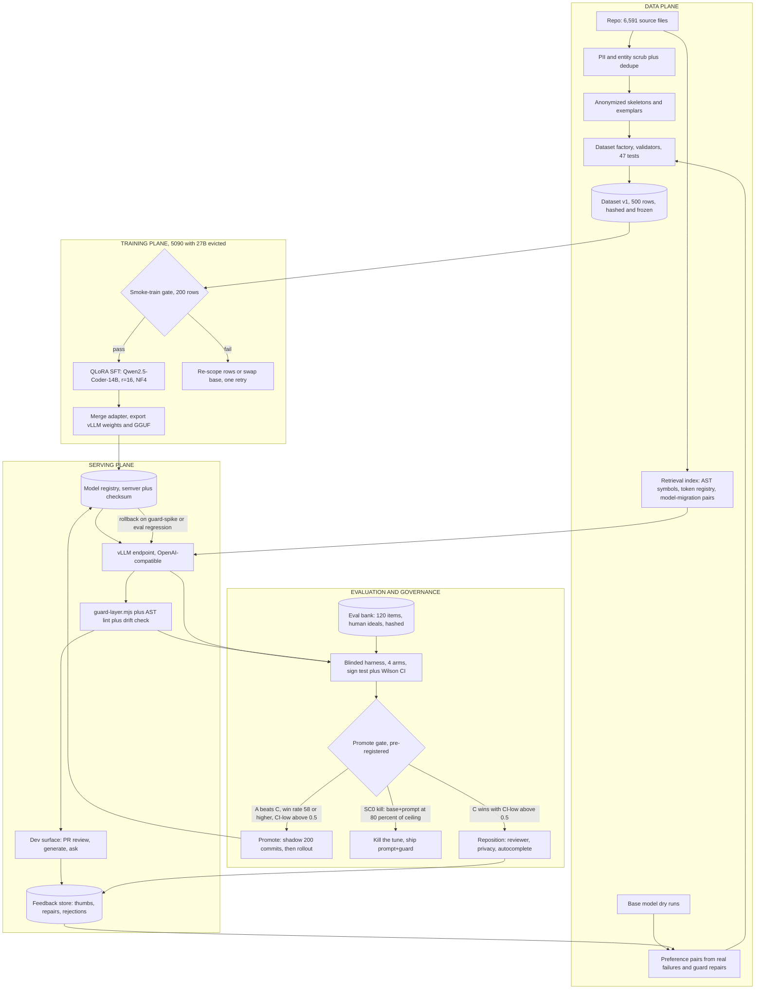
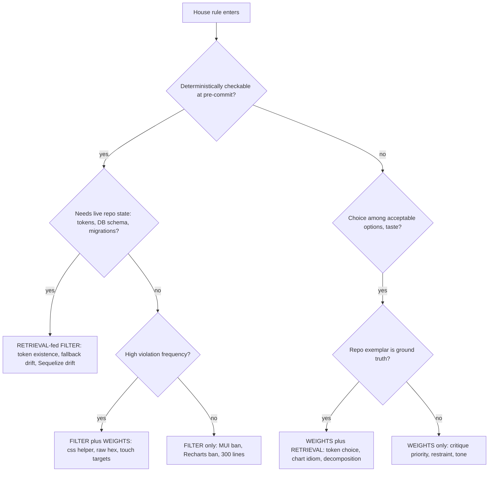
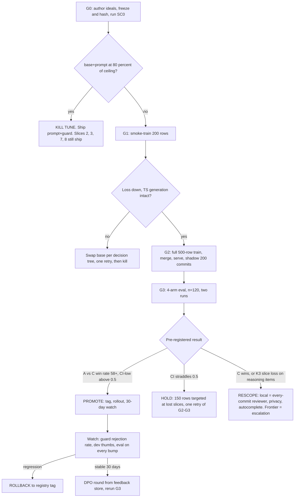

# GLM Consult

**Model:** glm-5.3
**Document:** docs/ai-workflow/brainstorms/coder-brain-consult-packet-2026-08-18.md
**Tokens:** 2121 in / 22113 out (reasoning: 15553) | total 24234
**Wall:** 343.9s

---

# Verdict up front

"Better than the frontier models" as a blanket claim is not achievable and you should stop using that sentence internally. The achievable claim is: **the tuned 14B + guard + retrieval is the default brain for this repo — wins convention-dense generation, constitution review, and every-commit cadence — with the frontier retained as the escalation path for novel reasoning.** Expect a 58–65% win rate on the winnable slices, not a blowout. Your own statistical floor (≥58%) is roughly calibrated to the realistic effect size. Everything below is engineering toward that honest version.

---

## Q1 — Framing and the crossover point

Framing is correct, with one amendment: the crossover isn't "our codebase vs. general SWE," it's **where the winning answer lives**.

- **Local wins** when the answer is mostly *retrievable or conventional* — it exists in the 6,600 files or the constitution, and correctness is checkable. Concretely on your stack: a styled-components component in house idiom, an RTK slice, an Express `.mjs` route module, a Sequelize model+migration pair, a Victory chart wrapper, diff review against the constitution, raw-hex→token swaps, `css`-helper wraps.
- **Frontier wins, always** when the answer requires *net-new reasoning*: novel algorithms, architectural decisions across >5 interdependent files, race-condition debugging (socket.io reconnect storms, Sequelize eager/lazy loading producing wrong joins or N+1), performance forensics, unfamiliar frameworks, precise synthesis over 50+ files.

Concrete repo examples: *"add a tipping row to checkout that updates the Victory total chart"* → local wins. *"diagnose why socket.io rooms leak listeners under reconnect"* → frontier wins, though the local model can apply the fix in house style once diagnosed.

Two structural reasons the crossover holds: (1) frontier models degrade on stated conventions under task pressure — your own 18→5 datapoint is direct evidence: a prompt got compliance to ~83% and every survivor sat under deliberate adversarial pressure. Weights and filters don't have that attention-dilution failure mode. (2) Frontier context windows fill with your repo faster than they hold your constitution precisely; retrieval + a 32k-context local model keeps precision as repo context grows.

## Q2 — What 18→5 predicts for the coder track

Both effects you named are real and they split by eval category. My predictions, to be settled by actually running SC0:

| Slice | Prompt-alone violation reduction (prediction) | Why |
|---|---|---|
| `house_rule_codegen` | 50–70% | Crisp rules prompt well — but codegen consumes attention, unlike the coach track's conversational task, so you won't match 72% |
| `design_critique` | 30–50% | Rules compete with actual critique content |
| `context_switch`, `hostile_review`, `refusal_trap` | <30% | This is the 18→5 "survivor" zone — deliberate pressure collapses prompt compliance |

Blended: ~50–60%, below the coach track's 72%. A 1,000-line constitution in a prompt on a 14B approaches zero marginal effect per rule past ~10 ranked rules; don't try it. The right prompt carries only the top 8–10 rules *ranked by observed violation frequency*, and everything else lives in guard + weights.

Two consequences you must act on:

1. **SC0's kill criterion (≥80% of rubric ceiling) probably does NOT trigger overall** — the adversarial slices will drag the prompt arm down. So the tune proceeds, but understand its measurable job is narrow: kill the adversarial-slice survivors and reduce guard load. 18→5 tells you exactly where the residual lives: under pressure. Build your training rows there.
2. **Run two leaderboards.** With the guard layer on, the prompt-vs-tune gap on enumerable rules collapses to ~zero — the guard repairs both arms. The shippable claim must be evaluated *with* guard on all arms; the "what did the weights actually buy" diagnostic runs *without* guard. Conflating these is how this experiment lies to you.

And bluntly: SC0 has never been run and ideals aren't authored. That's a two-day task gating a multi-week dataset build. Run it before anything else (Slice 1).

## Q3 — Base model

**Pick Qwen2.5-Coder-14B-Instruct for v1.** Reasons: dense QLoRA on 32GB is boring (4-bit NF4 ≈ 9GB weights + adapters, grad checkpointing at 4k ctx fits easily); best-documented TypeScript/MultiPL-E performance in the 14B dense class; the LoRA recipe ecosystem is settled. If a dense Qwen3-Coder ≤14B exists in your registry by the time you train, admit it only through the smoke-train gate (loss curve + 10-item TS spot-check), not by name.

The generalist hypothesis is wrong for your eval. "House judgment" in *this* packet means design critique and review discipline **about styled-components/Sequelize/Victory code** — that's code reading, which coder bases do better than generalists. The generalist's real advantage is persona and tone — that was the coach track. Cover the coder base's tone gap with the 75 critique rows in Q4, not with a base swap.

**MoE 30B-A3B: defer to v2.** 3B-active inference is fast and attractive for every-commit review, but: QLoRA-on-quantized-MoE tooling is not boring, and you cannot co-tenant it with the 27B on one 5090 (≈17–18GB at 4-bit for the MoE + ≈15GB for the 27B + KV caches = thrash). Which surfaces the operational decision you haven't made: **training and serving both require evicting the 27B, and serving the 14B alongside the 27B at 4-bit is possible but tight (~26GB with KV pressure).** Decide the tenancy policy (eviction windows vs. offload) before the MoE question is even open.

Training config: LoRA r=16, α=32, lr 1e-4, 3 epochs, ctx 4096, effective batch 16–32. Hundreds of rows = hours on a 5090, not days.

## Q4 — Data composition

Direct SFT on raw files is near-worthless for convention adherence — file-level next-token training teaches syntax distribution, not "respond with the convention when asked." Real code enters as **anonymized skeletons and exemplars for instruction-shaped rows**, plus the retrieval corpus. PII rule applies to local training too — run the entity scrubber + your contamination validator on every row, 10% manual spot-check.

**500-row v1, exactly:**

| Bucket | Rows | Source |
|---|---|---|
| Synthetic instruction→code from real skeletons | 200 | 60 component, 25 RTK slice, 35 Express route, 30 Sequelize model+migration, 25 Victory chart, 25 socket handler |
| Preference pairs (chosen/rejected) | 125 | 60 mined from real base-model failures + guard repairs; 65 authored adversarial near-misses |
| Review/critique rows | 75 | Diff + verdict; **25 of these are clean diffs with "no findings" answers** — teaches restraint |
| Refusal/trap rows | 50 | Recharts suggestions, MUI imports, retired-palette requests |
| Context-switch rows | 50 | Task that tempts a violation mid-task |

Caps: ≤40 rows per pattern family (dedupe), 50-row holdout never trained, hash + freeze everything.

**How many rows move the needle:** convention adherence via LoRA on a 14B saturates around **300–600 excellent rows**. Past ~1,000 synthetic rows you start paying in general-code regression; past ~2,000 it's real damage. Preference pairs: 150–400 is the effective band. Your 400-excellent instinct is right; ship 500. Add a 200–400-pair DPO pass only after the feedback store exists (Slice 8).

## Q5 — The three prompts

**(a) Ship-time system prompt for the tuned model — deliberately short; the conventions live in weights, the prompt carries only what weights can't:**

```
You are the house coding brain for a React 18 + TypeScript / Node ESM + Sequelize + Postgres product.

Non-negotiables (enforced downstream, but get them right first shot):
- styled-components only. Never Material-UI. Charts: Victory, never Recharts.
- Colors: var(--token, #fallback) only. No raw hex outside the fallback slot. Never the retired palette.
- Shared style fragments containing interpolation: css helper. A plain template string crashes at mount.
- 44px min touch targets, dark-first, WCAG 4.5:1, max 300 lines per file.

Working rules:
- Retrieve an exemplar before writing a new pattern; the repo's way beats the generic way.
- If unsure a token, migration, or export exists: retrieve, never guess names.
- Output contract: full file or unified diff, fenced, first line = path. No prose unless asked.
- If a request violates a non-negotiable: one line naming the violation, then the compliant alternative.
```

**(b) SC0 baseline house-context prompt — best-effort means ranked, with worked examples, and ranked by *measured* violation frequency from a base-model dry run, not by your priors. Target ≤2,500 chars:**

```
You are coding in a React 18 + TS / Node ESM + Sequelize codebase with strict house rules.

RULES, ranked:
1. styled-components only — never Material-UI. If asked for MUI, deliver styled-components and note it.
2. Never hardcode hex; only var(--token, #fallback). Banned palette: <retired values from constitution>.
   BAD:  color: #7B2CBF;
   GOOD: color: var(--accent-2, #6C2BD9);
3. Shared style fragments with interpolation must use the css helper:
   BAD:  export const flexRow = `display:flex; gap:${g}px;`
   GOOD: export const flexRow = css`display:flex; gap:${g}px;`
4. Charts: Victory only, never Recharts.
5. Interactive elements ≥44px touch target; dark-first; contrast ≥4.5:1.
6. Files ≤300 lines; split early.
7. Sequelize: model definition is truth; touching a model means flagging/emitting the migration and drift risk.

Generating: apply rules even if the request implies otherwise; fix and note the fix in one line after the code.
Reviewing: cite rule numbers for each finding.
```

**(c) Training-row prompt shape** — the schema that teaches judgment rather than mimicry:

```
<system>  short role line. NO rule list (rules live in weights). On 30% of rows, a rotating "focus" hint.
<user>    task + retrieved exemplar/skeleton + occasionally an EXPLICIT override
<assistant> compliant solution + one-line note when a rule tempted a violation
            | refusal + alternative on traps
            | "no findings" on clean-review rows
```

The four judgment mechanics: (1) never correct the same rule the same way twice — vary surface form so it learns the rule, not the phrasing; (2) **15% of rows carry an explicit in-prompt override** ("this legacy file allows raw hex") — conditional compliance is the difference between judgment and baked reflex; (3) the 25 clean-review rows teach it to pass compliant code instead of inventing findings; (4) rejected answers in preference pairs must be the *plausible* noncompletions the base model actually produces — mine them from dry runs, don't hand-invent strawmen.

## Q6 — Weights vs filter vs retrieval

Your doctrine is half right, and the half that's wrong matters. **It's not a partition; it's a stack.** Amendments:

1. **"Enumerable → code only" leaves accuracy on the table.** High-frequency enumerable rules belong in *both*: the filter guarantees, the weights reduce guard load and produce right-first-time diffs. The `css`-helper rule is your own counterexample — it's AST-detectable, but the failure is a mount-time crash, so a post-hoc repair means a wasted review cycle; a model that never makes it is strictly better. Assignment question is not "which one," it's "does this rule also deserve weights?"
2. **There's a hidden fourth category: rules checkable only against live repo state** — token existence, fallback-value drift vs. `tokens.css`, Sequelize schema vs. the live DB. These are *retrieval-fed filters*, not pure regex and not weights.

The mapping for your rules:

| Rule | Filter | Weights | Retrieval |
|---|---|---|---|
| No MUI / Victory-not-Recharts | import lint | light | – |
| Raw hex / retired palette | AST+regex, allow `var()` fallback slot | yes | token vocab |
| `css` helper for interpolated fragments | AST (exported template literal containing `${` must be `css`-tagged) | **yes** | exemplars |
| 44px / WCAG / dark-first | best-effort lint, computed contrast | **yes** (it's taste at the margin) | – |
| 300-line cap | trivial | yes (when-to-split judgment) | – |
| Sequelize drift | **introspection script** (`information_schema.columns` vs model attributes) | flag-in-review judgment | model↔migration pairs |
| Which token / decomposition / critique priority | no | **yes** | **yes** |

Restated doctrine: **deterministic where determinable, weights for frequency and judgment, retrieval for repo facts; nothing enumerable relies on the model alone, and nothing judgment-shaped is wasted on regex.**

## Q7 — The eval that settles it

Your 40-item bank is underpowered for the headline claim — 6 categories means n=4–10 per slice; your own harness floor is n≥30. Expand to **120 items, human-authored ideals (never from model outputs, hashed and frozen before any arm runs), reported as one composite + three grouped slices**: generate / review / adversarial-resistance (context_switch + hostile_review + refusal_trap merged).

- **Items:** 40 real-commit replay (post-constitution history, FE:BE at 2:1 matching your file counts), 30 ticket→component generation, 30 diff reviews with seeded violations, 20 traps.
- **Arms:** A tuned+guard+retrieval · B base+SC0-prompt+guard+retrieval · **C frontier+same-SC0-prompt+same-guard+same-retrieval** (fairness is non-negotiable — if only your arm gets the guard and the retrieval pack, you're benchmarking infrastructure, not the tune) · D frontier cold (reported, not headlined). Equal output budgets, documented decoding params, both leaderboards (guard-on for the claim, guard-off for diagnostics).
- **Judge:** a frontier model from a *third family* — not the competitor, not GLM (GLM authored the items; that's a provenance conflict). Calibrate the judge by planting seeded flaws; discard scoring from judges that miss them. Human adjudication on a 20% stratified sample. Your existing harness mechanics (commitments, sign test, Wilson CI, position swap, contamination gate) carry over; extend the contamination gate to near-dup against the training set.
- **Pre-registered kill criteria:**
  - **K1 (SC0, existing):** B ≥ 80% of rubric ceiling → the tune is cargo. Ship prompt+guard, keep collecting preference data.
  - **K2:** A vs C win rate < 58% or CI-low ≤ 0.5 → the claim fails. Reposition.
  - **K3:** A wins composite but loses multi-file/debug-flavored items → scope the claim explicitly; composite wins gamed by easy items are lies.
  - **"Stop, the frontier is still better":** C beats A on composite with CI-low > 0.5 AND on ≥2 of 3 slices, across two independent runs. Then local ships as every-commit reviewer + privacy layer + first-draft generator, and the "better than frontier" wording dies permanently.

## Q8 — What you're missing

1. **Every-commit cadence is the actual moat**, not one-shot quality. A local model reviews *every* commit and PR at ~zero marginal cost with zero data egress; you can't put a frontier API on every commit for cost and privacy reasons. The 18→5 residual gets caught 100 times a day instead of at code review.
2. **The guard layer is a free preference-data factory.** Every rejection/repair pair is a labeled chosen/rejected row. Combined with thumbs on the dev surface, that flywheel is worth more than any single eval. The tune's v2 training set is being generated right now by whatever you ship first.
3. **A FIM autocomplete sidecar.** Latency is your unfair advantage: local first-token ~200–400ms. Run Qwen2.5-Coder-3B-base (FIM) for inline completion alongside the 14B for review/generation. Note the VRAM math above — something gives; either eviction windows or drop the sidecar.
4. **Sequelize drift doesn't need a model at all.** You have a recurring bug class with a deterministic 50-line detector. A scheduled `information_schema` diff is unexploited value shipping this week regardless of the entire model question.
5. **Shadow mode on history.** Run the brain over 200 past commits before any developer sees it — free regression eval and the cheapest guard-rate delta measurement you'll get.

---

# Blueprint

## 1) Architecture end to end



## 2) Rule assignment + promote/kill gates





## 3) Developer surface (Review mode, the primary screen)

```
+---------------------------------------------------------------------------------------+
| swan-coder > PR #482 "checkout tip row"        [Review] [Generate] [Ask]    * local 14B |
| model: tuned v0.3 - guard v7 - retrieval: tokens+exemplars      [escalate to: frontier v]|
+----------------------------------------------+----------------------------------------+
| DIFF  src/components/checkout/TipRow.tsx     | GUARD   ! 2 escalations - 4 auto-fixed  |
|                                              |----------------------------------------|
|  12 + const TipRow = styled.div`             | ! E2  raw hex #7B2CBF = retired palette|
|  13 +   color: #7B2CBF;                      |       suggest: var(--accent-2, #6C2BD9)|
|  14 +   padding: 8px 16px;                   |       [apply repair] [reject] [ask]    |
|  15 + `;                                     |----------------------------------------|
|  16 + export default TipRow;                 | ! E1  touch target 32px < 44px minimum |
|                                              |       [apply repair] [reject] [ask]    |
| brain: "#7B2CBF is the retired accent. Use   |----------------------------------------|
| var(--accent-2, #6C2BD9). Also min-height    | ok  auto: css-helper wrap  Row.tsx:31  |
| 44px for the tap target."                    | ok  auto: var() fallback inserted      |
|                                              | ok  auto: no Recharts import           |
| [insert fix] [explain] [thumb up/down]       | ok  auto: 214/300 lines                |
+----------------------------------------------+----------------------------------------+
| VERDICT: BLOCK - 2 unresolved escalations (E1, E2)     review posted to PR  [override] |
+---------------------------------------------------------------------------------------+
| ask: "why does the css helper matter here?" [enter]     every action -> feedback store |
+---------------------------------------------------------------------------------------+
```

Generate mode swaps the left pane for: ticket text box → generated file(s) with a compliance checklist (token usage, 44px, css-helper, line count, drift flag) → same guard panel on the output → same thumbs.

## 4) Independently shippable slices

**Slice 1 — Unblock the decision (2 days, gates everything).**
Author human ideals for all 40 items from the constitution (never from model output); hash/freeze. Expand to 120: +40 commit replay (post-constitution git history, FE:BE 2:1), +20 traps, +10 review, +10 switch; author ideals. Dry-run the base model on 20 items, rank rules by violation frequency, build the best-effort baseline prompt per Q5(b). Run SC0 exactly as pre-registered. **Done when:** SC0 result with CI and the kill criterion adjudicated in a signed memo. **Kill:** K1 triggers → skip Slices 4–6; Slices 2, 3, 7, 8 proceed regardless.

**Slice 2 — Guard hardening (ships value even if the tune dies, 1 week).**
`eslint-plugin-swan`: `no-mui-imports`, `victory-not-recharts`, `no-raw-hex` (whitelist the `var()` fallback slot), `css-helper-for-interpolated-fragments` (exported template literal containing `${` must be `css`-tagged), `file-max-lines-300`, `min-touch-target-44` (best-effort), `banned-palette`. Plus `drift-check.mjs`: diff `information_schema.columns` vs Sequelize model attributes, scheduled + pre-merge. Wire as pre-commit hook + CI action; log every rejection/repair to the feedback store (file, rule, model_output, repair, ts). **Done when:** 0 false positives on a 200-file random sample, <5s pre-commit, drift-check catches 3 seeded drifts.

**Slice 3 — Retrieval index (1 week).**
`swan-index`: tree-sitter-typescript/javascript over all 6,591 files → Postgres tables (symbols, exports, styled fragments); token registry parsed from `tokens.css` including values (enables fallback-drift checks); model↔migration pair table. API: `GET /exemplars?pattern=rtk-slice|victory-chart|express-route&k=3`. **Done when:** 95% of 50 probe queries return a compliant exemplar, p95 <100ms.

**Slice 4 — Dataset v1 (1 week, after SC0 passes).**
Scrub + validate 500 rows per the Q4 table with caps and 50-row holdout; hash/freeze. **Done when:** factory tests green, 0 PII flags, dedupe caps enforced.

**Slice 5 — Train, serve, shadow (3 days).**
Stop the 27B (scheduled window). Smoke-train 200 rows (QLoRA r=16, α=32, lr 1e-4, NF4, ctx 4096) → gate on loss + 10-item TS spot-check. Full train 500 rows, 3 epochs; merge; serve via vLLM, OpenAI-compatible, tagged in the registry. Shadow-run 200 historical commits, no dev exposure. **Done when:** shadow shows ≥30% fewer guard escalations vs base+prompt on the same commits. **Kill:** smoke gate fails twice → re-scope or swap base once, then kill per the flowchart.

**Slice 6 — The proving eval (1 week).**
Four arms per Q7, n=120, two runs, third-family judge + calibration + 20% human adjudication, both guard-on/guard-off leaderboards. **Done when:** promote/hold/rescope memo signed by Sean against K1–K3.

**Slice 7 — Dev surface (2 weeks).**
Implement the wireframe: web panel + PR bot (guard verdict + brain notes + thumbs) + `swan review` / `swan gen` CLI; every action writes the feedback store. **Done when:** 3 devs use it 2 weeks, ≥70% of escalations get an explicit action, feedback capture verified.

**Slice 8 — Flywheel (ongoing).**
Build 200–400 DPO pairs from the feedback store (chosen = accepted/repair, rejected = original violation); DPO (β=0.1, lr 5e-6, 1–2 epochs); re-run G3. Every model bump re-runs the eval; registry rollback on guard-spike or eval regression. This is the loop the frontier cannot copy — it's your data, on your commits, at your cadence.
