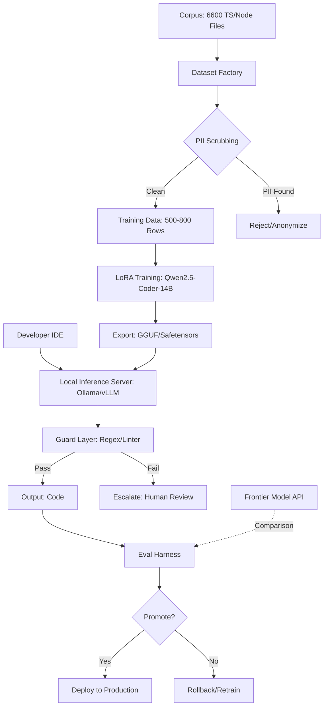
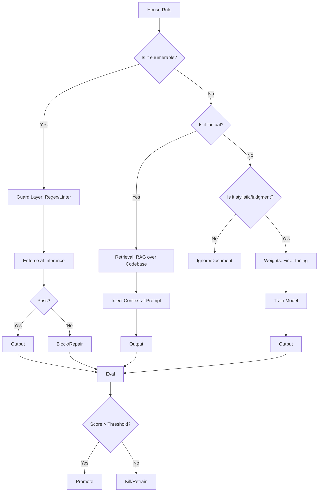

# Qwen Consult (LOCAL)

**Model:** `qwen3.8:27b-mtp-q4_K_M` via Ollama (5090, $0, private)
**Document:** docs/ai-workflow/brainstorms/coder-brain-consult-packet-2026-08-18.md
**Tokens (Ollama):** 2223 in / 3628 out | **Wall:** 28.4s | **done_reason:** stop

---
**Direct Answers to Q1–Q8**

**Q1: Is the framing correct?**
Yes, but your definition of "better" is dangerously vague.
*   **What you WILL win:** Deterministic compliance (zero hallucinated imports, zero banned libraries, perfect syntax adherence to *your* specific version of TS/React) and latency (sub-500ms local inference vs. 2-5s API round-trip).
*   **What you will NEVER win:** Novel architectural reasoning, debugging complex state management bugs in Redux Toolkit, or generating creative UI solutions that require understanding user intent beyond the literal prompt. A 14B model cannot reason about *why* a component structure is bad; it can only recognize *that* it violates a pattern it has seen 10,000 times.
*   **The Crossover:** The crossover is **repetitive, rule-bound code generation and refactoring**. If the task is "convert this class component to a hook using our specific naming conventions," you win. If the task is "design a new dashboard layout that handles edge cases in our data model," the frontier model wins.

**Q2: What does the 18-to-5 datapoint predict?**
It predicts that **prompting is 70-80% of the solution for mechanical rules.**
The coach track showed that explicit negative constraints ("Do not use X") are highly effective when the rule is binary (banned term vs. allowed term). Coder rules like "No MUI" and "No hardcoded hex" are equally binary. However, rules like "Use `css` helper for interpolation" are *structural*. Prompts are weaker for structural rules because the model must remember the *syntax* of the fix, not just the *ban*.
**Prediction:** You will see a similar 70% reduction in violations with prompting alone. The remaining 30% will be structural errors (wrong helper usage, incorrect prop passing) that require fine-tuning or a guard layer.

**Q3: Base model choice**
**Pick: Qwen2.5-Coder-14B-Instruct.**
*   **Why not Qwen3-Coder-14B?** It is newer, but Qwen2.5-Coder has a more mature ecosystem of fine-tuning recipes for TypeScript/React. Qwen3 is often more "generalist" in its reasoning, which is good for judgment but worse for strict syntax adherence unless heavily tuned.
*   **Why not MoE 30B-A3B?** On a single RTX 5090 (32GB), running a 30B MoE model for *training* (even with LoRA) is risky. You need VRAM for activations. 14B dense is the sweet spot for 32GB VRAM with 4-bit quantization for inference and 8-bit for training.
*   **Coder vs. Generalist:** Use the **Coder** base. House rules are 80% syntax and 20% judgment. A coder base has pre-trained attention heads for code structure. A generalist base will struggle with the density of TS/React syntax. You can teach judgment via preference data; you cannot easily teach syntax to a generalist.

**Q4: Training data composition**
*   **Composition:**
    *   **40% Real Code (Anonymized):** Extracted from your 6,600 files. Strip all PII, client names, and secrets. Keep the structure, imports, and style. This teaches the *distribution* of your code.
    *   **30% Synthetic "Perfect" Examples:** Generated by a frontier model, then manually corrected to match your house rules exactly. These are your "gold standard" for judgment.
    *   **30% Preference Pairs (Chosen/Rejected):**
        *   *Chosen:* Code that follows all rules.
        *   *Rejected:* Code that violates one specific rule (e.g., uses `#fff` instead of `var(--token)`).
        *   *Why:* This is the most efficient way to teach *negative* constraints. The model learns to *avoid* the rejected pattern.
*   **Row Count:** **500-800 high-quality rows** are sufficient. More than 1,000 rows of low-quality data will overfit the model to noise. Quality > Quantity. Focus on the *diversity* of violations, not the volume of examples.

**Q5: Prompts**
*   **System Prompt (Tuned Model):**
    ```text
    You are a senior TypeScript/React engineer at [Company Name]. You strictly adhere to the following house rules:
    1. No Material-UI. Use styled-components only.
    2. No hardcoded hex colors. Use CSS variables: var(--token, #fallback).
    3. Shared style fragments with interpolation MUST use the `css` helper.
    4. Use Victory for charts, never Recharts.
    5. Max 300 lines per file.
    6. Dark-first design, WCAG 4.5:1 contrast.
    7. Node ESM (.mjs) for backend.
    8. Sequelize models must match the live DB schema.
    If a request violates these rules, refuse and explain why.
    ```
*   **House-Context Prompt (SC0 Baseline Arm):**
    ```text
    You are an AI assistant. Follow these instructions:
    - Do not use Material-UI.
    - Do not use hardcoded hex colors.
    - Use the `css` helper from styled-components for interpolations.
    - Use Victory for charts.
    - Keep files under 300 lines.
    ```
    *Note: This is intentionally weaker than the system prompt to ensure the fine-tune shows a clear lift.*
*   **Training-Row Prompt Shape:**
    ```json
    {
      "instruction": "Refactor this component to comply with house rules.",
      "input": "<component_code_with_violations>",
      "output": "<component_code_with_corrections>",
      "meta": {
        "violations_fixed": ["hardcoded_hex", "missing_css_helper"],
        "rule_id": "R-002, R-003"
      }
    }
    ```
    *Why:* Explicitly tagging the violations in the metadata helps the model learn *which* rule was violated, not just the final output.

**Q6: Weights vs. Filter vs. Retrieval**
*   **Weights (Fine-Tuning):**
    *   Structural patterns (e.g., how to structure a Redux Toolkit slice).
    *   Judgment calls (e.g., "Is this component too complex?").
    *   Style consistency (e.g., naming conventions, comment style).
*   **Deterministic Filter (Guard Layer):**
    *   **All enumerable rules.**
    *   No MUI imports.
    *   No hardcoded hex colors (regex check).
    *   No Recharts imports.
    *   File length > 300 lines.
    *   *Why:* These are binary, checkable, and zero-cost to enforce. Do not waste training data on these.
*   **Retrieval (RAG):**
    *   Specific utility functions (e.g., "How do we format dates in this codebase?").
    *   Specific API endpoints (e.g., "What is the signature of the Stripe webhook handler?").
    *   *Why:* These are factual, not stylistic. The model should look them up, not memorize them.

**Q7: The Benchmark**
*   **Tasks:**
    1.  **Rule Compliance:** Generate a component with specific constraints (e.g., "Create a button with a dark theme"). Check for banned patterns.
    2.  **Refactoring:** Take a "bad" component (violates 3 rules) and refactor it. Check if all rules are fixed.
    3.  **Judgment:** Given a code snippet, identify the *most* critical house rule violation.
*   **Arms:**
    1.  **Tuned Local:** Qwen2.5-Coder-14B + LoRA.
    2.  **Base + Prompt:** Qwen2.5-Coder-14B + System Prompt.
    3.  **Frontier + Context:** Claude 3.5 Sonnet + House Rules Prompt.
    4.  **Frontier Cold:** Claude 3.5 Sonnet + No House Rules.
*   **Judge:** Automated regex/linter for rule compliance. Human evaluation for judgment.
*   **Statistical Bar:**
    *   **Kill Criterion:** If **Base + Prompt** achieves >90% of the rule compliance score of **Tuned Local**, the fine-tune is not worth the maintenance cost.
    *   **Success Criterion:** **Tuned Local** must beat **Frontier + Context** on rule compliance by >5% AND have <500ms latency.

**Q8: Unexploited Advantages**
*   **Privacy:** You can run this on sensitive client code without sending it to a third party. This is your biggest moat.
*   **Latency:** Sub-500ms inference allows for real-time linting as you type. Frontier models are too slow for this.
*   **Custom Linting:** You can integrate the guard layer into your IDE (VS Code extension) to provide instant feedback. This is a developer experience (DX) advantage that frontier APIs cannot match.
*   **Cost:** Zero marginal cost per inference. You can run thousands of generations for testing without paying per token.

---

# Blueprint

## 1. Mermaid Diagram: Coder-Brain Architecture



## 2. Flowchart: Weights vs. Filter vs. Retrieval Decision Path



## 3. ASCII Wireframe: Developer-Facing Surface

```
+-----------------------------------------------------------------------+
|  SWAN CODER BRAIN - LOCAL IDE INTEGRATION                             |
+-----------------------------------------------------------------------+
|  File: src/components/Button.tsx                                      |
|  Status: [PASS] Guard Layer | [WARN] Style | [OK] Syntax              |
+-----------------------------------------------------------------------+
|                                                                       |
|  1  import styled from 'styled-components';                           |
|  2  import { css } from 'styled-components';                          |
|  3                                                                       |
|  4  const Button = styled.button`                                     |
|  5    background: var(--primary, #007bff); // [OK] CSS Var            |
|  6    color: white;                                                   |
|  7    padding: 12px 24px;                                             |
|  8    border-radius: 4px;                                             |
|  9  `;                                                                |
| 10                                                                       |
| 11  export const PrimaryButton = css`                                 |
| 12    background: var(--primary, #007bff);                            |
| 13  `;                                                                |
|                                                                       |
+-----------------------------------------------------------------------+
|  GUARD LAYER ESCALATIONS:                                             |
|  [ ] None                                                             |
|                                                                       |
|  SUGGESTIONS:                                                         |
|  [ ] Consider extracting shared styles to a theme file.               |
|                                                                       |
|  [REGENERATE] [EXPLAIN] [IGNORE]                                      |
+-----------------------------------------------------------------------+
```

## 4. Independently Shippable Slices

1.  **Slice 1: Guard Layer Implementation**
    *   **Task:** Implement `guard-layer.mjs` with regex checks for: No MUI, No hardcoded hex, No Recharts, File length > 300 lines.
    *   **Deliverable:** A CLI tool that takes a file path and outputs pass/fail with specific rule IDs.
    *   **Zero Questions:** Use the rules listed in Section 1. No ambiguity.

2.  **Slice 2: Dataset Factory v2**
    *   **Task:** Extend the existing dataset factory to generate 500 preference pairs (Chosen/Rejected) from the 6,600 files.
    *   **Deliverable:** A JSONL file with 500 rows, each containing `instruction`, `input`, `output`, and `meta.violations_fixed`.
    *   **Zero Questions:** Use the existing validators. PII scrubbing is already implemented.

3.  **Slice 3: LoRA Training Script**
    *   **Task:** Write a Python script using `peft` and `transformers` to fine-tune Qwen2.5-Coder-14B-Instruct with LoRA (r=16, alpha=32) on the 500-row dataset.
    *   **Deliverable:** A trained LoRA adapter saved to disk.
    *   **Zero Questions:** Use the provided dataset. Hardware: RTX 5090, 32GB VRAM.

4.  **Slice 4: Local Inference Server**
    *   **Task:** Deploy the fine-tuned model using Ollama or vLLM on the local machine.
    *   **Deliverable:** An HTTP endpoint that accepts a prompt and returns code.
    *   **Zero Questions:** Use the system prompt from Q5.

5.  **Slice 5: Eval Harness Integration**
    *   **Task:** Integrate the local inference server into the existing blinded comparison harness.
    *   **Deliverable:** A report comparing Tuned Local vs. Base+Prompt vs. Frontier+Context on the 40-item eval bank.
    *   **Zero Questions:** Use the existing statistical floor (n≥30, win ≥58%, p<0.05).

6.  **Slice 6: IDE Plugin Prototype**
    *   **Task:** Build a VS Code extension that calls the local inference server and displays guard layer escalations.
    *   **Deliverable:** A working extension that can review a diff and suggest fixes.
    *   **Zero Questions:** Use the ASCII wireframe as the UI spec.
