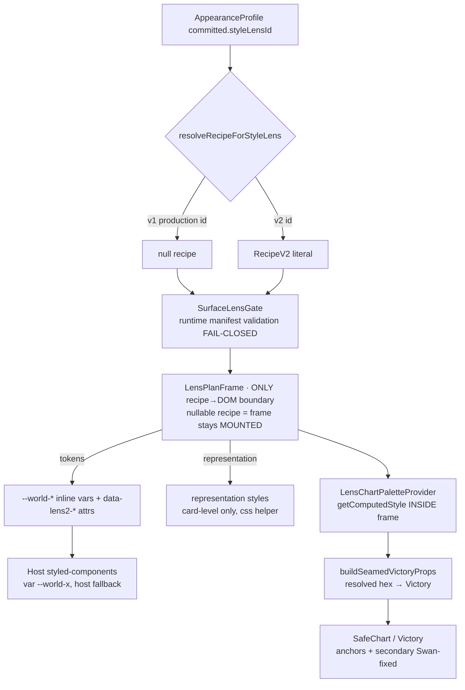
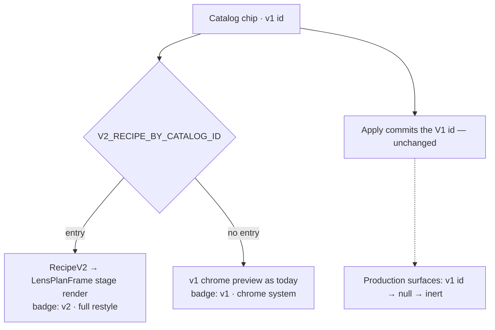
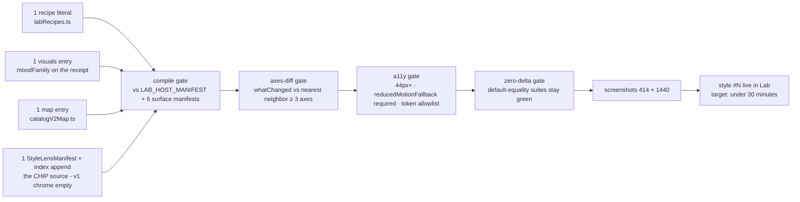
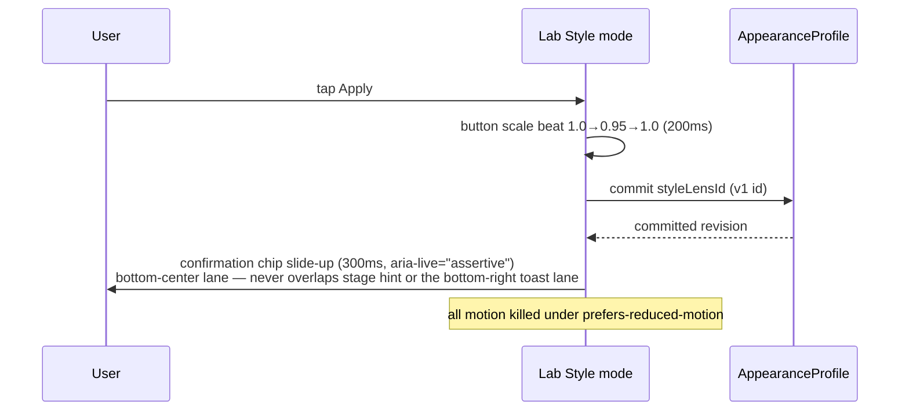

# A-PACK — SMART LENS FINISH (Lane 2 · §8b Agent-Pack Contract) · v1.7

> **Pack id:** `lens-finish-pack-2026-07-14` · **Author:** Fable (Final Decider) ·
> **Source mandate:** SUPER-PROMPT §3 (Workstream A), Village catalog spec §2.2/§2.4
> (binding), ultra-prompt `smart-lens-os-ultra-prompt-2026-07-12.md` §13/§14 (base
> diagrams — extended here), Codex REVISE on LensRenderRecipe honesty (folded into A3).
> **Executing agent:** a SEPARATE agent from Lane-1 work. Zero file overlap with any
> live lane is a lane rule (Rule 67 — read `.ai-workflow/coordination/*` first).
> **Acceptance test:** you can build every phase without asking ONE design question.
> If you hit a design decision this pack does not answer, the PACK failed — STOP and
> escalate (§7 below). Never improvise.
> **v1.1:** round-1 findings folded (Lab file map, 25→family enumeration,
> chip→v2 map, boundary-test gap, chart-law direction, real line counts,
> id-regex truth, tap receipts, default-safety pinning).
> **v1.2:** round-2 findings folded (safety-note dedup mechanism, Compare
> mixed-state + Engine-dropdown ruling, v2-only new-style law, exact chart-seam
> paths, search-vs-pin law, catalog order law, nearest-neighbor gate rule,
> confirmation-chip home, compileRecipe exact count).
> **v1.3:** round-3 findings folded (suppression attr moves to the Lab ROOT so
> Compare dedups too, v2-default ownership + committed-wins rule, compile-fail
> footer preservation, pin-duplicate semantics + wireframe correction, §2-item-3
> supersession note, chip fires from LabPage's applyLens, wording fixes).
> **v1.4:** round-4 findings folded (listbox semantics PRESERVED — families are
> ARIA groups, not buttons/h3s; ALL FOUR LabPage [0]-fallback sites ruled;
> pinned duplicate never carries selection state; "footer" = the per-pane
> captions, placement ruled).
> **v1.5:** round-5 findings folded (What-Changes list ruled into A3 with a
> both-v2 condition + familiarity dropdown CUT; additive-only carve-outs for
> labRecipes.ts/surfaceManifests.ts reconcile FROZEN vs the pipeline; style
> catalog test-guard citation corrected to styleAxis.test.tsx + pinned-label
> regex law).
> **v1.6:** round-6 findings folded (THE CHIP MECHANISM: add-a-style gains the
> StyleLensManifest step — 5 entries, not 3 — plus the one sanctioned
> count-law amendment (hardcoded style-25s → WORKOUT_DESIGN_STYLE_COUNT);
> LabPage added to A3's Files line).
> **v1.7:** round-7 findings folded (registry suite joins the amendment with
> enumerated treatments; renderer-pick rule replaces "copy a manifest"; all
> four styleAxis count sites ruled individually; Apply honesty for
> chrome-less styles via the map's dashboardChrome flag).

---

## 1. FABLE VISION STATEMENT (exact language — do not reinterpret)

The Smart Lens OS is the reason SwanStudios NEVER looks old. It is a **theming
operating system**, not a theme: worlds (structural layouts) and styles (Lens
recipes) are orthogonal, and a style is DATA — a validated recipe object — never
code. The Lab is where Sean and (later) trainers/members try styles on live,
truthful UI and commit with a receipt of exactly what changed.

Workstream A is the **FINISH**, not a feature push: STOP feature-building;
PERFECT what shipped, DOCUMENT it so a stranger extends it in minutes, and make
the engine PORTABLE to Sean's future sites. The product of this pack is the
**ADD-A-STYLE PIPELINE**: Sean will keep adding styles FOREVER; every phase here
serves "style #27 in under 30 minutes, gates green, zero code."

It must FEEL like: a jeweler's counter, not a settings page. Calm, precise,
reversible. Every Apply has a visible moment and a written receipt. Nothing
flashes, nothing lies — a chrome-only v1 lens must SAY it is chrome-only.

Where it sits: the Lab is a child surface of the workout-design-lab route
family. The v2 engine (`core/style-lens-os/v2/`) is the portable parent; the
Swan adapters (`adapters/style-lens-swan/`) are its Swan-specific child. That
boundary is the product's future — treat it as law.

---

## 2. ARCHITECTURE (file maps · contracts verbatim · boundary laws · forbidden patterns)

### 2.1a FROZEN interface (build AGAINST these; editing any = §7 escalation,
EXCEPT two ADDITIVE-ONLY carve-outs that ARE the product: (1) `labRecipes.ts`
— APPENDING new `RecipeV2` literals and their exports is sanctioned; that is
the add-a-style pipeline itself, incl. A4's timed style-#27 dry-run; existing
recipes and `LAB_HOST_MANIFEST` stay frozen. (2) `surfaceManifests.ts` —
ADDITIVE optional variants only, per §6. Everything else in this table:
read-only.)

Line counts are exact (`wc -l`, 2026-07-14):

| File | Lines | Role |
|---|---|---|
| `frontend/src/core/style-lens-os/v2/recipeV2.ts` | 122 | `RecipeV2` schema + validation (token allowlist: no `url()`, no expressions, no `;`/`{}`) |
| `frontend/src/core/style-lens-os/v2/compileRecipe.ts` | 119 | `compileRecipe(recipe, manifest) → CompileResult` — FAIL-CLOSED; emits `ResolvedLensPlan` |
| `frontend/src/core/style-lens-os/v2/whatChanged.ts` | 74 | Axis diff (`DIFF_AXES`) powering What-Changed receipts + Compare footers |
| `frontend/src/core/style-lens-os/v2/hostCapabilityManifest.ts` | 37 | `HostCapabilityManifest` (slots, templates, variant vocab) |
| `frontend/src/core/style-lens-os/v2/capability-manifest.schema.ts` | 77 | `SurfaceCapabilityManifest` runtime validation (forbids layout fields, raw colors, free-form versions) |
| `frontend/src/adapters/style-lens-swan/v2/labRecipes.ts` | 131 | `LAB_HOST_MANIFEST` + the two production recipes (Candy Glass Arcade, Prism Terminal) |
| `frontend/src/adapters/style-lens-swan/v2/surfaceManifests.ts` | 99 | 6 production `SurfaceCapabilityManifest`s (logger, planner, schedule, clients, bootcamp, progress w/ `chart.progress`) |
| `frontend/src/adapters/style-lens-swan/v2/recipeResolution.ts` | 23 | `resolveRecipeForStyleLens(id)` — v2 ids only; EVERY v1 production id → `null` (zero visual delta law) |
| `frontend/src/adapters/style-lens-swan/v2/SurfaceLensGate.tsx` | 67 | Shared gate + `makeLensFrame(manifest, ariaLabel, displayName)` factory; validates manifests at runtime |
| `frontend/src/adapters/style-lens-swan/v2/surfaceRepresentationStyles.ts` | 45 | Card-level representation fragments (`css\`\`` helper — Rule 43) |
| `frontend/src/components/Charts/lensChartPalette.tsx` | 55 | `LensChartPaletteProvider` + `useLensChartPalette` — resolves `--world-accent` via getComputedStyle INSIDE a frame |
| 7 per-surface `*LensFrame` bindings | ~10 ea | One-line `makeLensFrame` bindings (logger, planner, schedule, clients, bootcamp, progress, detailed-progress wrapper) |

### 2.1b FILES YOU WILL TOUCH (the Lab surface — line counts exact, budgets binding)

| File | Lines now | Budget | Phase | What changes |
|---|---|---|---|---|
| `frontend/src/components/DashBoard/Pages/workout-design-lab/WorkoutDesignStyleExplorer.tsx` | 135 | ≤ 260 | A1, A2, A3 | Detail card footer strip, catalog family grouping, engine badge, pinned current |
| `frontend/src/components/DashBoard/Pages/workout-design-lab/WorkoutDesignComparePanel.tsx` | 199 | ≤ 280 | A3 | Chip-driven v2 rendering via the catalog map (replaces hardcoded GOLDEN_PAIR pair-pick), chrome-only footer note |
| `frontend/src/components/DashBoard/Pages/workout-design-lab/WorkoutDesignLabPage.tsx` | 263 | ≤ 300 | A1, A3 | A1: root suppression attr + chip mount/trigger. A3: LAB_DEFAULT_LENS_ID fallback swap (all four [0] sites) |
| `frontend/src/components/DashBoard/Pages/workout-design-lab/WorkoutDesignLabModes.tsx` | 43 | 43 (no change) | — | UNTOUCHED — the Apply control lives in Explorer (~line 118, verified); listed to stop you hunting here |
| `frontend/src/components/DashBoard/Pages/workout-design-lab/workoutDesignStyleCatalog.ts` | 18 | ≤ 40 | A2 | No reordering of manifests; the promoted set grows ONLY via the A4 pipeline (manifest step) |
| `frontend/src/components/DashBoard/Pages/workout-design-lab/LensPlanFrame.tsx` | 116 | frozen | — | The ONLY recipe→DOM boundary — read, never edit in this pack |
| `frontend/src/components/DashBoard/Pages/workout-design-lab/lensRepresentationStyles.ts` | 91 | frozen | — | Lab representation fragments — read only |
| `frontend/src/adapters/style-lens-swan/visuals.ts` | 140 | ≤ 220 | A2 | ADDITIVE field on `SwanStyleLensVisualReceipt`: `moodFamily` (sanctioned in §6) |
| `frontend/src/components/DashBoard/Pages/workout-design-lab/concepts/conceptShared.styles.ts` | 230+ | +10 max | A1 | ONE addition to `PrototypeNote` (~line 227): the A1 suppression rule. NOTHING else changes in this file |
| NEW `frontend/src/components/DashBoard/Pages/workout-design-lab/LabConfirmationChip.tsx` | — | ≤ 80 | A1 | The Apply confirmation chip (A1 mechanism) |
| NEW `frontend/src/adapters/style-lens-swan/v2/catalogV2Map.ts` | — | ≤ 60 | A3 | `V2_RECIPE_BY_CATALOG_ID` (see 2.2c) |
| NEW `docs/ai-workflow/references/LENS-ADD-A-STYLE.md` | — | — | A4 | The 30-minute recipe doc |
| NEW `docs/ai-workflow/references/LENS-PORTABILITY-CONTRACT.md` | — | — | A5 | Export surface + host checklist |

Existing test suites you will EXTEND (never fork): `WorkoutDesignLab.contract.test.ts`,
`WorkoutDesignLab.interaction.test.tsx`, `WorkoutDesignLab.styleAxis.test.tsx`,
`adapters/style-lens-swan/v2/labRecipes.test.ts`,
`adapters/style-lens-swan/swanStyleLensRegistry.test.ts` (A4 — enumerations +
derived counts per the count-law amendment),
`core/style-lens-os/styleLensBoundary.test.ts`.

### 2.2a Contracts (verbatim from `recipeV2.ts` — code against THESE)

```ts
export const RECIPE_V2_SLOTS = [
  'text.display', 'text.body', 'surface.card',
  'collection.exercise', 'action.primary', 'chart.progress',
] as const;
export type RecipeSlot = (typeof RECIPE_V2_SLOTS)[number];
export const CONTAINER_PROFILES = ['mobile-minimal', 'tablet', 'desktop-enhanced'] as const;
export type ContainerProfile = (typeof CONTAINER_PROFILES)[number];
export type ChartFamiliarity = 'conservative' | 'expressive';
export interface RecipeTokens { [tokenName: string]: string } // values allowlisted: no url(), no expressions, no ; or {}
export interface RecipeComponentChoice { variant: string; familiarity?: ChartFamiliarity } // familiarity: chart slots only
export interface RecipeV2 {
  schema: 'smart-lens/recipe-v2';
  id: string;      // MUST match ^[a-z][a-z0-9-]{1,64}(\.[a-z][a-z0-9-]{1,64})*$
                   // convention for Swan styles: swan.<style-name>.v2
                   // (both shipped ids follow it: swan.candy-glass-arcade.v2, swan.prism-terminal.v2)
  version: string; // semver, bounded
  compatibility: { engine: string; requires: readonly RecipeSlot[]; optional?: readonly RecipeSlot[] };
  tokens: RecipeTokens;
  composition: Partial<Record<ContainerProfile, { template: string }>>;
  components: Partial<Record<RecipeSlot, RecipeComponentChoice>>;
  constraints: { minimumTouchTargetPx: number; reducedMotionFallback: 'required' };
}
```

### 2.2b Visuals receipt (ADDITIVE change, Phase A2 — the only interface edit this pack sanctions)

`adapters/style-lens-swan/visuals.ts` — add ONE optional field to
`SwanStyleLensVisualReceipt`:

```ts
/** Catalog grouping (Lab v6). One of the five §4.2 families. */
moodFamily?: 'playful' | 'calm' | 'technical' | 'luxe' | 'atmospheric';
```

Populate it for all 25 catalog lenses using the §4.2 table VERBATIM. Glyphs
remain where they are today (hardcoded in `WorkoutDesignStyleExplorer.tsx`) —
relocating them is NOT in this pack.

### 2.2c Catalog→v2 map (NEW file, Phase A3 — the engine-badge mechanism)

```ts
// adapters/style-lens-swan/v2/catalogV2Map.ts
import { CANDY_GLASS_ARCADE_RECIPE, PRISM_TERMINAL_RECIPE } from './labRecipes';
import type { RecipeV2 } from '../../../core/style-lens-os/v2/recipeV2';

/** Catalog chips carry v1 ids; this map declares which chips have a v2
 * full-restyle recipe. Presence in the map = `v2 · full restyle` badge.
 * Absence = `v1 · chrome system` badge. Style #27+ adds one entry here.
 * dashboardChrome: does this style ALSO have a v1 chrome block in
 * SwanStyleLensGlobalStyles.ts (i.e., committing it visibly changes the
 * dashboard today)? The two originals do; v2-only new styles do NOT —
 * their Apply receipt + footer copy derive from this flag (§4.3). */
export interface CatalogV2Entry { recipe: RecipeV2; dashboardChrome: boolean }
export const V2_RECIPE_BY_CATALOG_ID: Readonly<Record<string, CatalogV2Entry>> = Object.freeze({
  'candy-glass-arcade': { recipe: CANDY_GLASS_ARCADE_RECIPE, dashboardChrome: true },
  'prism-terminal': { recipe: PRISM_TERMINAL_RECIPE, dashboardChrome: true },
});
```

**Commit-scope law (answers the production question):** Apply on ANY chip
commits the **v1 catalog id exactly as today**. The Lab STAGE renders v2 (via
this map) when the selected chip is v2-capable; `resolveRecipeForStyleLens`
and the six production surfaces remain UNTOUCHED and inert — committed v1 ids
still resolve to `null` there. Turning v2 recipes ON across production
surfaces is a SUCCESSOR decision (Sean's), not this pack.

### 2.3 Boundary laws (violating any = REJECT at review, no exceptions)

1. **`LensPlanFrame` (`components/DashBoard/Pages/workout-design-lab/LensPlanFrame.tsx`)
   is the ONLY recipe→DOM boundary.** No other component may translate recipe
   tokens into style. The frame stays MOUNTED with a nullable recipe — lens
   switches must never remount the host surface.
2. **`core/style-lens-os/` imports NOTHING from `adapters/` or `components/`.**
   The existing `core/style-lens-os/styleLensBoundary.test.ts` already walks
   every core source file recursively, but its forbidden-pattern list has NO
   `adapters/` pattern — an adapters import would pass TODAY. Phase A5's job is
   to ADD that pattern (that is the gap; the walker itself is fine).
3. **Fail-closed everywhere:** unknown style id → null recipe; invalid manifest
   → null; compile failure → visible receipt + host defaults. Never fail-open.
4. **Charts:** Victory receives RESOLVED hex only (CSS `var()` is unsafe in SVG
   presentation attributes). The ONLY chart seams are `useLensChartPalette`
   (`components/Charts/lensChartPalette.tsx`) and `useSeamedVictoryProps` +
   `buildSeamedVictoryProps` (`components/DashBoard/Pages/client-dashboard/`
   `CanonicalProgressChartsGrid.lensPalette.tsx` / `.victoryProps.ts`).
   The PRIMARY series follows `--world-accent`. The
   SECONDARY series is fixed to Swan Wing Purple (`CHART_COLORS.wingPurple`)
   and must NEVER be wired to `--world-action` — that is a button-background
   token (Prism maps it to Midnight Sapphire, ~1.3:1 against chart cards); the
   Swan-fixed secondary exists precisely because that wiring failed contrast.
   A future `--world-chart-secondary` token is the only sanctioned path to a
   lens-aware secondary, and it is NOT in this pack's scope.
5. **Host-fixed zones are never lens-addressable:** the logger's phone set-row
   law grid (`32px | 1fr | 1fr | 48px`), critical action semantics, data truth,
   endpoints, and tier locks. The grid-law test asserts `--world-row-columns`
   never enters logger styles — keep it green.
6. **DB stores nothing from this pack.** Committed appearance state flows
   through the existing appearance profile; recipes are code-shipped literals
   until the Atelier track (NOT this pack).

### 2.4 Forbidden patterns (recur from ultra-prompt §15; enforce in review)

AI-generated CSS/JS at runtime · remote asset URLs in recipes · selector
exception matrices · a second preview renderer · ownership in localStorage ·
chart representation swaps outside the familiarity budget · new slots beyond
the six · Track-2 (Forge/Atelier/commerce) work of ANY kind without Sean's
explicit go.

---

## 3. FLOWS (mermaid — extended from ultra-prompt §13; 13.2 superseded by 3.1)

### 3.1 Runtime resolution AS SHIPPED (v2 path — this is the live truth)


### 3.2 Lab stage resolution (Phase A3 — how chips reach v2 WITHOUT touching production)


### 3.3 Add-a-style pipeline (the product of this pack — Phase A4 builds the gates)


### 3.4 Apply moment (Lab, §2 item 4 — Village-adopted spec, binding)


---

## 4. WIREFRAMES + TASTE ANCHORS (Lab v6 — ultra-prompt §14 base + every §2 fix folded)

### 4.1 Style mode detail card (fixes §2 item 1: dead space, glyph collision, toast overlap)
```
┌────────────────────────────────────────────────────────────────────┐
│ 25 Worlds × 25 Styles. One session.        [Prototype-only card]   │  ← §2 item 5: this card renders ONCE
│ [World] [Style●] [Compare]                                         │
│ ┌───────────────┐ ┌────────────────────────────────────────────┐   │
│ │ 🔍 search      │ │ ◉ CANDY GLASS ARCADE            (glyph)   │   │  ← glyph: 8px min inset from panel
│ │ ▼ CURRENT      │ │ signature · layout · motion · a11y        │   │     edge at EVERY width (clamp)
│ │ ●Candy Glass ◄ │ │ WHAT CHANGES vs current:                  │   │  ← pin-duplicate law: also appears
│ │ ▼ PLAYFUL      │ │  • Type: vaulted serif → rounded athletic │   │     in PLAYFUL below, verbatim order
│ │ ●Candy Glass   │ │  • Cards: faceted glass → floating candy  │   │
│ │ ●Kinetic Kanban│ │  • Exercises: plates → arcade cards       │   │
│ │ ▼ CALM …      │ │  • Action: altar beacon → glass dock      │   │
│ │  …             │ │  • Charts: rose-window → arcade meter     │   │
│ │               │ │ ───────────────────────────────────────── │   │
│ │               │ │ ENGINE: v2 · full restyle   [Apply][Cancel]│   │  ← §2 item 1: footer strip fills the
│ └───────────────┘ └────────────────────────────────────────────┘   │     dead space below Apply (engine
│ ══ LIVE STAGE · Meridian wearing Candy Glass ══════════════════════│     badge + honesty label, §4.3)
└────────────────────────────────────────────────────────────────────┘
   Confirmation chip slides up bottom-CENTER — the bottom-right lane is
   reserved for receipt toasts; the stage-hint italic line stays clear.
   WHAT-CHANGES LIST RULING (Phase A3, not A1): the axis list renders ONLY
   when BOTH the selected chip AND the committed lens are v2-capable (both
   compile via the 2.2c map) — whatChanged needs two compiled plans. In every
   other state the card keeps the SHIPPED signature/layout/motion/a11y
   definition list unchanged (chrome lenses have no recipe to diff).
   FAMILIARITY DROPDOWN: CUT from this pack — the ultra-prompt §14.1
   "Charts: [Conservative ▾]" control is NOT built (no profile field exists;
   §2.3 law 6 — DB stores nothing; it belongs to the Vitals/chart-familiarity
   arc). Do not render it.
```

### 4.2 Catalog (fixes §2 item 2 — Village fold is BINDING) + THE FAMILY TABLE (verbatim data)

Layout: **mobile (P1)** single-column mood-family list, search pinned and
always visible, the CURRENT lens pinned first above its family, bottom sheet
gets `padding-bottom: env(safe-area-inset-bottom, 16px)` so the last chips are
never obscured. **Desktop:** two columns within family groups; family headers
sticky. **Pinning law:** if the committed lens is not a catalog lens
(`default-safety`, `swan-flagship`), pin NOTHING; render the neutral line
`Current: Swan Flagship (system)` above the first family instead.
**Search law:** an active query REPLACES the grouped view with a flat filtered
list — no family headers, no pinned chip; clearing the query restores groups
and the pin. **Order law:** families render in the table order below; chips
within a family render in that row's order, verbatim. **Pin-duplicate law:**
the pinned current chip is a SECOND RENDER inside a `CURRENT` pseudo-group
above the first family; its family row keeps its verbatim position (the lens
appears twice). The pinned instance is presentational-plus-shortcut: it gets
`aria-label="Current style: <Name>"`, it NEVER carries selection state
(`aria-selected` false/absent even when its lens is the selected one — ONLY
the family instance reflects selection), and activating it behaves exactly
like activating the family instance; catalog-count tests count FAMILY rows
only (25).

The 25→family mapping (Fable taste — copy VERBATIM into `visuals.ts`;
the executing agent maps, never re-decides):

| Family | Lenses (7/4/6/4/4 = 25) |
|---|---|
| `playful` | candy-glass-arcade · kinetic-kanban · signal-garden · tempo-forge · orbit-atlas · modular-harbor · kintsugi-circuit |
| `calm` | quiet-meridian · recovery-cloister · monastic-grid · lunar-stack |
| `technical` | prism-terminal · blueprint-fold · analog-flight-recorder · chronograph-board · terrain-console · coach-ledger |
| `luxe` | crystalline-cathedral · carbon-atelier · meridian-magazine · glass-rail |
| `atmospheric` | aurora-index · tidal-columns · split-horizon · cedar-workshop |

### 4.3 Engine honesty (fixes §2 item 3 — folds the Codex LensRenderRecipe REVISE)
- Badge source: `V2_RECIPE_BY_CATALOG_ID` presence (2.2c). Badge renders in TWO
  places: the detail-card footer strip (4.1) and as a small suffix glyph on the
  catalog chip row (text label only on the card; chip shows `v2` mini-tag).
- Copy, exact: `v2 · full restyle` / `v1 · chrome system`.
- Compare rules (COMPLETE — no other states exist):
  - The panel's Engine dropdown (v1 / "v2 Golden Pair") is REMOVED. Each pane
    independently resolves its selected chip through `V2_RECIPE_BY_CATALOG_ID`
    (this replaces the hardcoded golden-pair pick — the `v2Panes`/`goldenPair`
    memo in `WorkoutDesignComparePanel.tsx`).
  - v2-capable pane → LensPlanFrame render. Chrome-only pane → the existing
    v1 scoped preview. Mixed panes side-by-side are ALLOWED and expected.
  - "Footer" PLACEMENT RULING: there is no shared footer element — all copy
    below renders in the existing per-pane `ComparePaneCaption` elements
    (`WorkoutDesignComparePanel.tsx:145-147`), which remain the only caption
    surface. States: BOTH v2 → per-pane axes-diff captions as shipped. BOTH
    chrome-only → BOTH captions show the exact copy: “Chrome systems restyle
    trim, not structure — try a v2 style for a full restyle.” MIXED → the
    chrome pane's caption shows the exact copy: “<Pane letter> · <Lens name>
    is a chrome system — trim only.”; the v2 pane keeps its axes-diff caption.
    COMPILE FAILURE in any v2 pane → keep the SHIPPED fail-closed behavior
    verbatim (pane falls back per §2.3 law 3; the existing "compile failed"
    caption text is preserved unchanged — it is not one of the §4.3 copy
    strings and must not be rewritten).
- APPLY HONESTY for chrome-less styles (`dashboardChrome: false`): the Apply
  receipt copy for such styles is the exact string "<Name> applied — full
  restyle shows in the Lab; dashboard-wide wear arrives with the v2 rollout."
  (replacing the shipped "applied across the dashboard" copy ONLY for these
  styles), and their detail-card footer adds the exact line "Lab preview
  today — dashboard rollout pending." Styles with `dashboardChrome: true`
  keep the shipped receipt copy unchanged. Nothing lies.
- v2 becomes the Lab's DEFAULT selection — precise rule: the FALLBACK initial
  selection (used when the visitor has no committed catalog lens) changes from
  `WORKOUT_DESIGN_STYLE_LENSES[0]` (quiet-meridian) to `candy-glass-arcade`;
  a committed catalog lens ALWAYS wins over the fallback, exactly as today.
  Mechanics: add ONE module constant in `WorkoutDesignLabPage.tsx` —
  `const LAB_DEFAULT_LENS_ID = 'candy-glass-arcade';` — and replace EVERY
  `WORKOUT_DESIGN_STYLE_LENSES[0]` fallback in that file with the
  candy-glass-arcade lookup: the `activeLensId` init (~60-62), the
  `compareLensAId` init (~63-65), the `activeLens` resolution (~74), and
  `cancelLens` (~120-121). Committed-lens-wins logic at each site is
  UNCHANGED — only the final fallback constant changes, so the v2 default
  survives Cancel-preview and Compare too. This edit is PART OF PHASE A3's
  file list even though LabPage also appears in A1 (both phases may touch
  it; budget ≤ 300 total).
  **Supersession note:** SUPER-PROMPT §2 item 3 says "make v2 the DEFAULT once
  all 25 convert" — THIS PACK SUPERSEDES that condition for the Lab's initial
  SELECTION only (conversion stays out of scope, Sean's §11 item 3; the six
  production surfaces and the committed-lens behavior are untouched).
  v1→v2 recipe conversion is EXPLICITLY OUT OF SCOPE; honesty labels are the
  interim.

### 4.4 Taste anchors (exact tokens — Crystalline Swan; fallbacks are AUTHORITATIVE)

> These custom properties are not globally defined in the live cascade — the
> `#fallback` IS the rendered value today. Write the `var(--token, #fallback)`
> form anyway (Rule 6): tokens light up when a global theme layer lands.

- Panel surfaces: `var(--bg-elevated, #141419)` on `var(--bg-base, #030712)`;
  borders `color-mix(in srgb, var(--accent-primary, #60C0F0) 22%, transparent)`.
- Family headers: Fira Code 0.68rem 800 uppercase, `var(--accent-primary, #60C0F0)`.
- Chips: 44px min height; selected ring `var(--accent-secondary, #8B5CF6)`.
- Dual-Button Glow: Apply = blue bg `var(--accent-primary-deep, #002060)` →
  purple glow `var(--accent-secondary, #8B5CF6)`; Cancel = ghost (transparent,
  1px border `color-mix(in srgb, var(--accent-primary, #60C0F0) 16%, transparent)`).
- Engine badge: v2 = `var(--accent-gold, #C6A84B)`; v1 = `var(--text-muted, rgba(224, 236, 244, 0.4))`.
- Motion: Apply beat 200ms scale; chip slide-up 300ms ease-out; BOTH inert
  under `prefers-reduced-motion` (no substitute animation).
- A11y RULING (binding): the shipped catalog semantics are PRESERVED —
  `role="listbox"` container, `role="option"` chips with `aria-selected`
  (`WorkoutDesignStyleExplorer.tsx:74-98`). The STYLE catalog's real test
  guard is `WorkoutDesignLab.styleAxis.test.tsx` (25-option count via the
  /style lens/i aria-label match at line 69; option queries at 79/101) —
  those assertions stay GREEN and unedited; `WorkoutDesignLab.interaction.test.tsx`'s
  listbox assertions target the WORLD explorer and are untouched by this
  pack. LAW: the pinned duplicate's aria-label ("Current style: <Name>")
  must NOT match /style lens/i — never append wording containing "style
  lens" to it, so the 25-count stays honest. Families render as
  `role="group"` elements with `aria-label="<FAMILY>"` INSIDE the listbox
  (a valid ARIA pattern: listbox → group → option); the visible family
  header text inside each group is `aria-hidden="true"` (the group label
  carries the semantics — no `<h3>` inside the listbox). The CURRENT
  pseudo-group is likewise a `role="group"` with `aria-label="Current"`.
  Confirmation chip `aria-live="assertive"`; search input
  `aria-label="Search styles"`.

---

## 5. PHASES (each independently shippable · tests-first · receipts · tap counts)

**Phase A1 — Detail-card + stage polish (§2 items 1, 4, 5).**
Files: `WorkoutDesignStyleExplorer.tsx`, `WorkoutDesignLabPage.tsx`, NEW
`LabConfirmationChip.tsx`, `concepts/conceptShared.styles.ts` (the one
addition below). The Apply control lives in `WorkoutDesignStyleExplorer.tsx`
(~line 118) — verified; `WorkoutDesignLabModes.tsx` stays untouched unless
reality disagrees (then §7).
**Safety-note dedup mechanism (the ONLY §2-item-5 change):** LabPage keeps its
`SafetyCard`; the per-concept `PrototypeNote` (`conceptShared.styles.ts:227`)
gains ONE suppression rule so concept-level notes hide EVERYWHERE inside the
Lab — add to PrototypeNote's styles:
`[data-lab-safety='page'] & { display: none; }` — and the attribute goes on
the Lab ROOT container (the outermost shell element LabPage renders — the
WorkoutDesignLabShell root), NOT the stage: the root covers World, Style, AND
Compare modes (Compare renders two concept panes and is exactly the 3-copies
screen from SUPER-PROMPT §2 item 5). Zero per-concept component (`.tsx`)
files change; the note still renders wherever concepts mount OUTSIDE the Lab.
**Confirmation-chip mechanism:** NEW `LabConfirmationChip.tsx` (≤ 80 lines,
bottom-center fixed lane, `aria-live="assertive"`, 300ms slide-up, hidden
under reduced-motion). LabPage mounts it AND triggers it itself inside its
existing `applyLens` handler, only on the success path of `commitPreview()`
(LabPage already owns the success signal — `WorkoutDesignLabPage.tsx:110-117`).
Explorer's `onApply` contract is NOT changed and Explorer is NOT involved in
the chip. No context, no new state library. A failed apply never fires the
chip (nothing lies).
Tests first: source-contract on single Prototype-card render (LabPage stage
sets the suppression attr; PrototypeNote carries the rule); chip lane
placement (bottom-center); reduced-motion kills both animations; a11y roles.
DoD: §2-item-1 defects fixed at 320/375/414/768/1440; Apply beat + chip per
§3.4; ONE safety card per screen. Receipts: before/after screenshots 414 +
1440; computed-signature test for the 200ms/300ms timings.
Tap receipt: apply-a-style stays ≤ today's count (select chip → Apply = 2).

**Phase A2 — Catalog v6 + family data (§2 item 2, Village fold).**
Files: `visuals.ts` (the 2.2b field + §4.2 table), `WorkoutDesignStyleExplorer.tsx`
grouping UI, `WorkoutDesignLab.styleAxis.test.tsx` extension.
Tests first: every catalog lens carries a `moodFamily` matching the §4.2 table
(data test); grouping renders from the receipt field (no families hardcoded in
components); current-lens pinning incl. the `default-safety`/`swan-flagship`
neutral-line law; search always visible; safe-area padding source contract.
DoD: 25 styles in the five families exactly per §4.2; P1 single-column.
Tap receipt: find-and-apply any named style ≤ 3 taps with search (search →
chip → Apply); ≤ 4 by scroll; neither exceeds today's counts.

**Phase A3 — v2 default + engine honesty (§2 item 3 + Codex REVISE fold).**
Files: NEW `catalogV2Map.ts` (2.2c), `WorkoutDesignStyleExplorer.tsx` badges,
`WorkoutDesignComparePanel.tsx` map-driven v2 panes + caption rules,
`WorkoutDesignLabPage.tsx` (the LAB_DEFAULT_LENS_ID fallback swap — §4.3
mechanics; What-Changes list per the §4.1 ruling).
Tests first: badge derives from map presence; exact footer copy; Lab default
selection is v2-capable; Apply still commits the v1 id (commit-scope law);
production `resolveRecipeForStyleLens` untouched (source contract).
DoD: v2 default-visible in the Lab; all 25 v1 lens suites still green; honesty
labels everywhere a lens is named in the Lab.
Tap receipt: zero new taps anywhere.

**Phase A4 — ADD-A-STYLE pipeline (the product).**
EXTEND `adapters/style-lens-swan/v2/labRecipes.test.ts` (do NOT fork a new
suite): today it asserts the golden pair compiles + diffs ≥ 5 axes. Add, FOR
EVERY entry of `V2_RECIPE_BY_CATALOG_ID`: (1) compiles against
`LAB_HOST_MANIFEST` AND all 6 surface manifests with zero degradations beyond
declared optional slots, (2) distinctness gate — for EVERY PAIR of map entries,
`changedAxisCount(a, b) ≥ 3` (the MINIMUM across all other entries, not one
designated comparand) — **threshold law: the flagship golden pair keeps its
shipped ≥ 5 check; every other pair gates at ≥ 3** (both stated in the test), (3) constraints valid (44px+,
`reducedMotionFallback: 'required'`), (4) token values pass the allowlist,
(5) id matches the `swan.<style-name>.v2` convention (2.2a regex).
**New-style law (pack ruling, satisfies SUPER-PROMPT §3(d)'s "v1 OR v2"):
new styles are v2-only from this pack forward.** The v1 chrome route
("manifest + visuals + 1 CSS block") is DEPRECATED for new styles and appears
in the doc only as a short "how the original 25 were made" appendix.
**CHIP MECHANISM (the manifest step — chips render ONLY from
`WORKOUT_DESIGN_STYLE_LENSES`):** a new style is FIVE entries, not three:
(1) a `StyleLensManifest` file at `adapters/style-lens-swan/manifests/<name>.ts`
(data-only; NO SwanStyleLensGlobalStyles chrome block — the style renders
through the v2 path). RENDERER RULE (do not "copy a manifest"): the closed
renderer unions may NOT be extended; pick the manifest's
`navigationRenderer`/`shellRenderer` pair such that the registry's pairwise
gate (each promoted pair differs on ≥ 2 of layoutSignature/
navigationRenderer/shellRenderer — `swanStyleLensRegistry.test.ts:82`) stays
green against EVERY existing style; the `default-navigation`/`default-shell`
trio (used only by the runtime default manifest) is the recommended first
pick for style #27; the gate suite is the arbiter — if red, change the two
renderer picks, never the gate,
(2) append it to `SWAN_EXPANSION_MANIFESTS` (`adapters/style-lens-swan/index.ts`
— ADDITIVE-ONLY carve-out, same law as labRecipes.ts),
(3) the `RecipeV2` literal appended to `labRecipes.ts`,
(4) the visuals entry (`moodFamily` + receipt fields) in `visuals.ts`,
(5) the `catalogV2Map.ts` entry keyed by the manifest's catalog id.
Still 0 CSS. **Count-law amendment (sanctioned test edits, enumerated exactly):**
in `WorkoutDesignLab.styleAxis.test.tsx` — line 58 `expect(WORKOUT_DESIGN_
STYLE_COUNT).toBe(25)` → `toBeGreaterThanOrEqual(25)` (floor, not pin);
line 59 (array `toHaveLength(25)`) → DELETE (vacuous once derived — COUNT is
that array's length); line 60 (unique-id set) → `toHaveLength(WORKOUT_DESIGN_
STYLE_COUNT)` (uniqueness law survives); line 69 (option count) →
`toHaveLength(WORKOUT_DESIGN_STYLE_COUNT)`.
In `adapters/style-lens-swan/swanStyleLensRegistry.test.ts` (this suite JOINS
the extend list): the per-style enumerations are EXTENDED with each new style
(append its id/name to `expectedExpansion`, its visuals key to the
expectations at ~110-111) — that enumeration IS the suite's job; the count
literals (`available()).toHaveLength(27)` at ~71, signatureMoment set
`.size).toBe(25)` at ~115) become derived: `expectedSentinels.length +
expectedExpansion.length + 2` and the expected-ids length respectively.
World/concept 25-counts (`WorkoutDesignLab.contract.test.ts`
CONCEPT_REGISTRY) are about WORLDS — untouched. The §4.4/2.1b "stay green
unedited" laws bind phases A1–A3 (which add no styles); A4 applies these
amendments once, explicitly.
Then write `docs/ai-workflow/references/LENS-ADD-A-STYLE.md`: the exact
30-minute recipe — the FIVE entries above + run the gate suite + 414/1440
screenshots, incl. a Lab render of the new chip through the v2 stage path.
DoD: a stranger following ONLY that doc ships style #27 with gates green AND
the chip live in the Lab in < 30 min (time it; the timing goes in the
receipt).
Tap receipt: n/a (no user-facing UI change) — state this in the closeout.

**Phase A5 — Portability final docs (ultra-prompt Track-2 P7).**
EXTEND `core/style-lens-os/styleLensBoundary.test.ts`: add the missing
`adapters/` forbidden-pattern (the walker already visits every file — the
PATTERN LIST is the gap; see boundary law 2). Then write
`docs/ai-workflow/references/LENS-PORTABILITY-CONTRACT.md`: the export surface
(schema, compiler, whatChanged, manifest validation), the host-integration
checklist (author manifest → validate → bind a frame via the gate factory →
mount the chart palette provider), and what a NEW host must supply. DoD: doc +
hardened boundary test; NO package extraction (publishing is Track 2 —
forbidden here). Tap receipt: n/a (docs + test only) — state this.

Order A1→A5; A4/A5 may swap. Every phase: Rule 61 hostile review before
report; Rule 42 audit every commit (backend untouched — ANY backend file in
the diff is a §7 escalation).

---

## 6. FORBIDDEN CHOICES (the executing agent may NOT decide)

New libraries or dependencies (none — including drag/virtualization libs) ·
new REST endpoints or schema changes (none exist in this pack) · renaming any
shipped export, file, token, or lens id · changing the §4.2 family mapping or
family names · interface changes beyond the ONE sanctioned `moodFamily` field
(2.2b) · new recipe slots · touching `resolveRecipeForStyleLens` or its
v1→null law · editing `LensPlanFrame.tsx` or `lensRepresentationStyles.ts` ·
altering any zero-delta/default-equality test expectation · converting v1
lenses to v2 (out of scope) · committing v2 ids from Apply (commit-scope law,
2.2c) · any Track-2 surface (Forge/Atelier/pricing/entitlements) · rewriting
the exact copy strings in §4.3 · palette values outside §4.4 · changes to the
six production surface manifests beyond ADDITIVE optional variants.
**Default rule: anything not explicitly delegated is forbidden — stop and ask.**

## 7. ESCALATION TRIGGERS (halt + return to Fable/Sean)

Any schema or DB change · any new dependency · anything touching auth,
billing, or PII · a test that cannot pass without changing a shipped contract
· a §2 fix requiring layout surgery beyond the files in 2.1b · discovery that
a FROZEN file (2.1a, or LensPlanFrame/lensRepresentationStyles) must change ·
the Apply control not living in Explorer/Modes (map the real owner, then ask)
· any ambiguity between this pack and the SUPER-PROMPT/ultra-prompt (cite
both, ask, wait) · lane collision: any file already claimed in
`.ai-workflow/coordination/*.lane.md`.

## 8. VERIFICATION (per slice and at pack close)

- Tier-A: `NODE_OPTIONS=--max-old-space-size=8192 npx tsc --noEmit`
  (baseline-clean disclosure per Rule 56), targeted vitest folders
  (workout-design-lab + adapters/style-lens-swan + core/style-lens-os +
  the 25-lens suites), production build.
- Computed-signature receipts for motion timings; screenshots at 414 AND 1440
  per phase; device-matrix spot for the catalog: 320 + 375 + a safe-area
  device (notched iPhone class).
- Zero-delta locks: all default-equality suites and the 6 surface-manifest
  suites stay green untouched; `resolveRecipeForStyleLens` source contract.
- Rule-42 backend audit every commit (expected: empty) · secret scan.
- Review chain: Rule 61 self-hostile per slice → fresh-eyes hostile agent per
  phase → Rule 46-as-amended (Fable gate) before push · Rule 48 audit record
  at pack close, filed as `LENS-FINISH-PACK-AUDIT-RECORD-<date>.md`.
- Pack DoD (from §3): all §2 items fixed w/ receipts · 25 v1 lenses green ·
  v2 engine default-visible in the Lab · stranger adds style #27 in < 30
  minutes (timed receipt).
