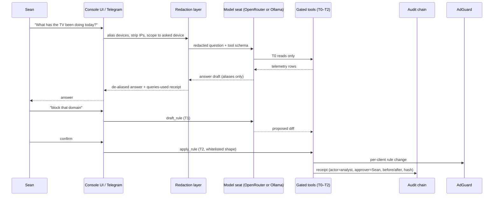

# Network Console — LG Containment + AI Analyst Harness (Addendum)

**Status:** LOCK-WITH-CHANGES (Fable 5.1, 2026-09-14) — changes folded in §10b; LG-A ships in amended form · **Date:** 2026-09-13, Rev 2 2026-09-14 · **Owner:** Sean
**Extends (does NOT supersede):** `docs/ai-workflow/AI-HANDOFF/NETWORK-CONSOLE-BLUEPRINT-2026-08-26.md` (master blueprint, merged Ox Alpha + GLM 5.3) · brief at `network-master-console-2026-08-26.md` · router ground truth at `docs/ai-workflow/references/archive/ROUTER-UPGRADES-GT6.md`
**Panel spend so far:** ~$0. Today's addendum authored by ZCode/GLM with web research; hostile review of the addendum is §10.

---

## 1. Why this addendum exists

Sean pasted the transcripts of the Gamers Nexus LG investigation (the Sept 2026
"216,000,000 Spy TVs" report + the LG-response rebuttal video) and asked for:
(1) defense against the LG TV specifically, (2) whole-house monitoring with
parental control for the kids, (3) an AI assistant harness on top of the
network console comparable to his Hermes + OpenRouter setup, and (4) a hostile
review of the whole concept before he sends it to other AI reviewers.

The master packet already answers (2) end-to-end. This addendum adds the two
things that did not exist on 2026-08-26: the **LG containment requirements**
(§3–§5) and the **AI analyst harness** (§6), plus tonight's no-code actions (§4).

**Scope guard (anti-panic clause):** today's LG news must NOT reshape the master
architecture. The TV containment is one evening of work pulled forward from
master Slice 2 plus one focused slice. Everything else in the master packet
stands unchanged.

---

## 2. Threat digest — what the investigation established, as design input

Per the Gamers Nexus investigation (their claims, demonstrated on LG G3/G5/C-series
hardware; second video dismantles LG's written response):

| # | Established behavior | Design implication for us |
|---|---|---|
| T1 | ACR fingerprints screen + HDMI audio → LG Ad Solutions ("Alfonso"), ~4 GB/mo of ACR data, even as dumb HDMI monitor (44–618 connects/hour observed) | DNS-level blocking of LG ad/ACR domains is the primary control; it must be **per-device** (scoped to the TV, not the household) |
| T2 | Voice near the TV is captured, transcribed to plain text in TV memory, retained; capture window stays open ~10–15 s after speech stops; clear pickup at ~70 ft; ambient conversation logged | The mic is hostile **regardless of the physical switch** (T6). Router cannot stop local storage — only egress + power do. Settings honesty required in the console's device notes |
| T3 | TV reverse-scans the whole LAN, enumerates devices (serials, hostnames, MACs), even TeamViewer presence; feeds LG's 363M-device household graph | TV must be isolated from trusted LAN (no inbound reach into NAS/PCs); its scans are themselves an alert signal |
| T4 | Wi-Fi neighbor scanning (SSIDs, BSSIDs, signal strength) → geolocation to street level; exfil via DNS-reversible channel on LG Channels | BSSID scanning is invisible to DNS blocks; only egress/IP policy + capture reveal volume anomalies |
| T5 | Untrusted-execution reality: RCE-class vulnerabilities under responsible disclosure, unpatched at publication; earlier CVEs (2022-6317/6318/6319/6320) gave root on LAN-exposed services | **Assume the TV can be compromised by anything on its network segment.** Isolation, not trust, is the control. Never expose LG admin/UPnP beyond its segment |
| T6 | Mic switch disables only the built-in mic; remote-mic and USB-webcam capture paths stay live; menu "disabled" states were re-enabled from a shell | Never attach webcams; treat every LG "off" as software-only; power-off is the only full stop |
| T7 | Audio stored locally while offline, exfiltrated after reconnect (demonstrated) | "Just unplug it from the network" is NOT a defense if it ever reconnects. Either **never** network it, or contain it **every** time it is networked |
| T8 | Dark patterns: tracking toggles off-by-default-opt-in, misleading "cookies" toggle, one-final-snapshot on opt-out, firmware updates silently re-adding ad IDs to 4-year-old TVs | Console must surface **blocked-attempt telemetry** as ground truth (what the TV *tried*), not LG's settings page as truth |
| T9 | webOS store apps shipped residential-proxy SDKs (43% of tested apps); Spur/Above analysis | App allowlist posture: TV installs nothing without operator approval; console flags new app installs when visible |

**Attribution honesty:** T1–T9 are the investigation's demonstrated claims, not
independently re-verified on Sean's hardware. The console's own telemetry
(master Slice 5 PCAP + DNS logs) is how we verify which apply to his set.

---

## 3. New requirements

### LG containment
- **R-LG1 — TV is a second-class citizen.** The TV resolves DNS through AdGuard
  Home with the LG telemetry blocklist (SAFE tier) applied **per-client** to the
  TV only. Acceptance: TV requests to `*.lgtvsdp.com`, `*.lgsmartad.com`,
  `alfonso.tv`, `ueiwsp.com` return NXDOMAIN; every other device unaffected.
- **R-LG2 — Deny-by-default mode.** A stricter profile where the TV resolves
  ONLY an explicit allowlist (app servers, NTP, optionally firmware). Acceptance:
  with deny-by-default on, streaming apps still work and no LG ad/ACR domain resolves.
- **R-LG3 — Attempt telemetry.** Every blocked TV lookup is logged + counted;
  a "TV tried to phone home N times today" counter exists on the TV's device page.
  Acceptance: counter increments when a known ACR domain is queried.
- **R-LG4 — Isolation.** TV sits on the guest/IoT SSID with intranet access
  disabled (it needs internet, never the LAN). Acceptance: from the TV's address,
  NAS/PC/workstation addresses unreachable; internet still reachable.
- **R-LG5 — Hardcoded-IP honesty.** DNS blocking cannot stop traffic to raw IPs
  (T4). Document the gap; optional SSH/iptables MAC-scoped egress filter on the
  GT6 (master packet already established SSH+Entware works on GT6) as Slice LG-B,
  with the ~200–400 Mbps capture/CPU budget disclosed.
- **R-LG6 — No jailbreak, no DMCA-1201 exposure.** All controls are network-side
  (DNS, firewall, power). No TV firmware modification. Acceptance: the plan
  contains zero TV-side modification steps.

### Kid protection (sharpens master Slices 2/4 — nothing new architecturally)
- **R-KID1 — Category + SafeSearch defaults** per kid device (AdGuard parental
  categories, SafeSearch/YouTube Restricted enforcement). Acceptance: adult
  search suppression active on kid devices, off on adults'.
- **R-KID2 — Schedules/budgets** (master Slice 4): bedtime, daily budgets,
  holiday overrides. Acceptance per master gate: "Quota tests green."
- **R-KID3 — Ask-to-unblock** (master §4 Ox feature): kid hits block page →
  Telegram button → Sean taps → 30-min grace, logged. Acceptance: grace is
  time-boxed and audited.
- **R-KID4 — OS-layer complement.** Network controls see DNS/SNI metadata, never
  message content (TLS). Family Link / Screen Time run ON the devices for
  content-level rules. The console's docs say this in one line — over-promising
  network-side content visibility is the #1 honesty failure.

### AI analyst harness ("Swan Net Analyst")
- **R-AI1 — Ask the network questions in plain English.** "What has the TV been
  doing today?" → answer grounded ONLY in console telemetry, with the queries shown.
- **R-AI2 — Provider-agnostic model layer.** OpenRouter-backed (Sean's existing
  pattern) with per-seat config so any model can be dropped in; local Ollama seat
  supported for zero-egress operation (his existing Z:\AI-Runtimes watchdog path).
- **R-AI3 — Redaction before any model call.** Device names → stable aliases
  (`device-7`); local IPs redacted; scheduled digests carry category counts only,
  never domain lists. Domain-level detail reaches a model ONLY in a direct
  operator query about one device. (Rule 8 zero-PII discipline, carried over.)
- **R-AI4 — Tiered tool gates** (Hermes T0–T4 pattern, mapped below). No T3/T4
  paths exist at all. Kill switch `NET_ANALYST=off` disables the entire harness.
- **R-AI5 — Spend gate.** Per-day model-call budget + worst-case cost disclosed
  in config; no auto-retry on paid failures (Sean's standing spend discipline).
- **R-AI6 — Audit receipts.** Every analyst-initiated write emits an append-only
  receipt into the master packet's hash-chained operator audit log.

**Tool gate mapping:**

| Tool | Tier | Behavior |
|---|---|---|
| `list_devices`, `device_activity`, `dns_query_search`, `blocked_attempts` | T0 | Read-only over console DB |
| `draft_rule(block/unblock, domain, scope)` | T1 | Returns a proposed diff; applies nothing |
| `apply_rule(draft_id)` | T2 | Whitelisted rule shapes only, TV/kid-client scope, Telegram-confirm or console confirm; receipt |
| `capture_pcap(device, seconds ≤ 120)` | T2 | Bounded router-side tcpdump (master Slice 5 path) |
| anything else (config push, deletes, firmware, WAN changes) | — | **Not implemented. Deliberately.** |

---

## 4. Phase 0 — tonight, zero code (pick one, ~2 minutes)

1. **Stopgap full stop (recommended tonight):** on the GT6 client list, set the
   TV's DNS to a black-hole address (e.g. `192.168.50.1` with port-53 blocked for
   the TV, or simply use AiProtection → BLOCK internet service for the TV when
   unused). TV loses smart features; HDMI inputs keep working. Reversible in one tap.
2. **TV settings hardening (~20 min, model-dependent — menu names per AdGuard's
   LG guide):** disable ACR/"viewing information", "personalized advertising",
   Home Dashboard recommendations/ad banners; enable "Do not sell my info"
   (buried — that's the dark pattern); decline voice agreements; physical mic
   switch OFF; never attach a webcam (T6).
   **Honest limit (T7/T8):** settings reduce surface but are NOT containment —
   GN demonstrated opt-outs that still beacon, and a final data snapshot on opt-out.
   Only §5 makes it real.

---

## 5. Slice LG-A — TV containment (one evening, pull-forward of master Slice 2)

1. AdGuard Home on **radar** at `192.168.50.53` (master architecture, unchanged);
   GT6 DHCP hands it out LAN-wide. Force-DNS redirect (NAT 53→radar, block 853/DoH
   bootstrap IPs) via GT6 SSH script — closes the hardcoded-DNS bypass.
2. Import [furkan-bayrak/lg-tv-blocklist](https://github.com/furkan-bayrak/lg-tv-blocklist)
   **SAFE tier** (evidence-annotated from a 267k-query audit post-investigation;
   SAFE preserves apps while killing ACR/telemetry). Per-client scoped to the TV (R-LG1).
3. Flip R-LG2 deny-by-default ON after 48 h of SAFE-tier baseline, using the
   observed-needed allowlist; one-command rollback to SAFE tier when apps break.
4. TV → guest/IoT SSID, intranet access off (R-LG4).
5. Blocked-attempt counter on the TV device page (R-LG3) — first "truth" artifact.

**Gate:** TV plays YouTube/Netflix normally; ACR domains NXDOMAIN; counter shows
what was caught; from the TV, LAN devices unreachable.

**Known caveats (community-maintained lists drift):** `ngfts` (firmware/app CDN)
and `us.lgtvsdp.com` have side effects when blocked — see §10-H4 for the update paradox.

---

## 6. Swan Net Analyst — how it plugs into the master architecture

Runs on **radar** beside the collector (master §5 hosts table, unchanged).
Consumes the collector's Timescale data through the existing API; the only new
surface is `/analyst` (chat + receipts) in the console package.

Kill switch: `NET_ANALYST=off` (env + Settings toggle) short-circuits before
redaction — no model call is ever constructed. Budget: per-day call cap + a
displayed worst-case cost; failed paid calls never auto-retry (R-AI5).

**UI states (only new screen — the Analyst panel):** loading (streaming answer),
empty ("Ask about any device…"), denied (kill switch ON — panel shows why and
where to flip it), error (model failure + retry, never auto-retry), budget-hit
(state + reset time). Mobile: same panel full-screen; 44px send/confirm targets;
confirm buttons never hover-only.

---

## 7. Test additions

| ID | Proves | Level |
|---|---|---|
| T-LG1 | TV client + SAFE list → ACR domains NXDOMAIN; other clients resolve them | integration (AdGuard API fixture) |
| T-LG2 | Deny-by-default: non-allowlisted domain NXDOMAIN, allowlisted resolves | integration |
| T-LG3 | Blocked-attempt counter increments on blocked query | unit + integration |
| T-LG4 | Force-DNS script: NAT 53 redirect present, DoT/853 blocked (router fixture) | integration |
| T-AI1 | Redaction: no device names/local IPs in ANY outbound model payload; digests carry counts only | unit (property-style) |
| T-AI2 | T1 drafts apply nothing; T2 rejects non-whitelisted rule shapes; TV/kid scope enforced | unit |
| T-AI3 | `NET_ANALYST=off` → zero model calls constructed (spy on fetch) | unit |
| T-AI4 | Budget cap blocks call N+1; no auto-retry on 402/429 | unit |
| T-AI5 | Every apply_rule writes a chained audit receipt; tamper test (master §8) still green | integration |
| T-KID1 | SafeSearch enforcement flags present for kid client, absent for adult | integration |

---

## 8. Traceability (addendum scope)

| Req | Slice | Test | Status |
|---|---|---|---|
| R-LG1,3 | LG-A steps 2,5 | T-LG1, T-LG3 | planned |
| R-LG2 | LG-A step 3 | T-LG2 | planned |
| R-LG4 | LG-A step 4 | manual check (master P-series) | planned |
| R-LG5 | LG-B (optional) | T-LG4 + capture budget check | planned, gated on §11-D3 |
| R-LG6 | — | by construction (no TV-side steps) | satisfied in plan |
| R-KID1–4 | master Slices 2/4 | T-KID1 + master gates | planned |
| R-AI1–6 | Slice AI (after master Slice 2) | T-AI1–5 | planned |
| Master R-set | master §8 Slices 0–7 | master §7 suite | unchanged, Slice 0 not started |

---

## 9. Ordering change to the master delivery table

Master Slices 0→7 stand. Two insertions:
- **LG-A** executes immediately after Slice 1 (it needs Slice 1's radar/Tailscale
  baseline and delivers the urgent value), before master Slice 2's general
  parental layer — LG-A IS most of Slice 2 for one device.
- **AI (Net Analyst)** after Slice 3 (it needs history to be worth asking about).

---

## 10. Hostile review of THIS addendum (self-pass; Ox/GLM reviews of the master packet remain authoritative there)

- **H1 — "DNS block = contained" is a lie we must not tell.** T4/T9 show raw-IP
  and DNS-reversible channels; DNS blocking stops the loud paths, not all egress.
  *Resolution:* R-LG5 names the gap; console device page shows "containment level:
  DNS / DNS+egress" instead of a binary "protected" badge. LG-A's claim language
  is "telemetry blocked at DNS; IP-level egress optional in LG-B."
- **H2 — Deny-by-default breaks the TV and Sean blames the console.** *Resolution:*
  staged rollout (monitor → SAFE → deny-by-default), 48 h baseline, one-command
  rollback, ask-to-unblock path for the TV too.
- **H3 — The analyst is a new leak channel.** Kid browsing metadata → cloud model
  is exactly the T8-class betrayal we're defending against, re-implemented at home.
  *Resolution:* R-AI3 redaction + digests-are-counts-only + local-Ollama seat +
  kill switch + budget. Test T-AI1 makes the redaction claim mechanical, not hopeful.
- **H4 — The firmware paradox.** Blocking LG update domains preserves the
  blocklist but freezes KNOWN RCE-class holes (T5); allowing updates lets LG
  silently re-add tracking IDs (T8). *Resolution:* controlled-update policy —
  updates allowed only inside an operator-approved window, followed by a
  blocklist/settings re-audit (the counter + SAFE list diff makes regression
  visible). LG security advisories watched manually. Residual risk stated, not hidden.
- **H5 — Panic scope creep.** This addendum must not delay SS-PT production work
  (workspace priority rule) or rewrite the master plan. *Resolution:* §1 scope
  guard; LG-A is one evening; master Slice 0 (probe) still gates everything.
- **H6 — Monitoring the household creates a household panopticon.** Master §7
  governance (adult aggregate-only default, consent gate, audit chain) applies
  unchanged to the analyst — the analyst can query adults' data too, so redaction
  must run BEFORE the model, and the consent gate must gate analyst queries as well.
- **H7 — SSID-move side effects.** Guest-net isolation can kill AirPlay/DLNA
  casting from family phones to the TV. Acceptable tradeoff, but say it before the
  evening it confuses everyone: casting moves to app-based (YouTube/Netflix remote)
  which work over the isolated path, or the TV gets a pinned exception.
- **H8 — Blocklist drift.** Community lists rot as LG renames endpoints. The
  counter (R-LG3) doubles as the drift detector: a sudden rise in *allowed* LG
  traffic is the review trigger. Quarterly re-check is on the future-review-hooks list.

**Verdict on the addendum: REVISE-free with the above resolutions folded in.
The one decision this review escalates:** if "protect the kids fully" outranks
"keep the GT6," the OPNsense box (master §10) stops being optional — GLM's
closing line stands and tonight it applies to the TV path too.

---

## 10b. Fable 5.1 Final Ruling — LOCK-WITH-CHANGES (2026-09-14)

Reviewer: `anthropic/claude-fable-5.1` via OpenRouter — 16,283 in / 14,159 out,
~$0.87, 202.6 s. Full ruling: `docs/ai-workflow/AI-HANDOFF/netconsole-FABLE-5.1-HOSTILE-REVIEW-r2-2026-09-14.md`.
(First attempt preserved at `netconsole-FABLE-5.1-HOSTILE-REVIEW-2026-09-14.md`:
reasoning-only output with no ruling — a known Fable-via-OpenRouter failure shape;
its partial findings were subsumed by the r2 ruling. Combined spend ~$1.29.)

**Master architecture (SECTION B) ratified unchanged. All ten findings ACCEPTED;
§5 LG-A ships in the amended form below.**

| # | What everyone missed | Folded change |
|---|---|---|
| H1 | R-LG4 guest isolation breaks R-LG1: the TV cannot reach radar's AdGuard; the DNAT lands in PREROUTING and dies in guest FORWARD isolation; counter reads zero = false "contained" | Dedicated **TV-only guest SSID** (sole tenant), GT6's own upstream DNS = radar, DNAT guest:53 → router dnsmasq (AdGuard sees the router as that SSID's client — LG profile applies because the TV is the only tenant). TV must **forget the main SSID**. Friend devices get a different guest SSID |
| H2 | "Zero persistent state on the GT6" is an unmanaged failure mode: stock firmware drops NAT/tcpdump/egress rules on every reboot, no hook re-arms them | Radar-owned 60 s SSH re-arm job (`iptables -C`, `pgrep tcpdump`, re-apply, Health alert on uptime drop). SSH LAN-only, key auth |
| H3 | Per-client scoping fails OPEN: AdGuard keys by IP; private-MAC cycling silently erases kid/TV policy | Kid-safe **default client profile** (unknowns fail closed); DHCP reservations lift adults out; private-MAC off on home SSID for kid devices; unknown MAC → DNS-quarantine + Telegram approve |
| H4 | Blocklist supply chain: upstream commit can inject `@@` exceptions / `$dnsrewrite` redirects | Pin to commit SHA, vendor into console repo, auto-update OFF, PR-with-diff updates, lint bans `$dnsrewrite`/`$important`/`@@`/non-LG lines |
| H5 | Counter is neither floor nor ceiling (caching, hardcoded IPs, DoH, NXDOMAIN storms) yet presented as truth | Relabel "blocked DNS lookups"; add second tile "connections w/o DNS answer" (blank-with-reason until Slice 5) |
| H6 | No prompt-injection model: DHCP hostnames/domains are attacker-controlled strings reaching the LLM | Schema-typed data fencing, hostname charset validation pre-LLM, ≤8 tool calls/query, `capture_pcap` confirm-gated, "grounded" badge only for receipt-backed sentences |
| H7 | Redaction ≠ consent: `device-7 + domain` is still an adult's browsing record | Server-side subject scope on every T0 call (adult devices = aggregates without a consent row); ZDR provider preference; **D4 resolved:** hybrid = local Ollama for any domain-level query, cloud only for count-level questions |
| H8 | §9 ordering wrong: LG-A needs neither Tailscale nor Slice 0 | New order: **Phase 0 + LG-A-lite (no code) same evening → Slice 0 → Slice 1.** Stopgap and LG-A-lite land the same night — unblocking later without AdGuard live would upload the T7 offline hoard |
| H9 | Isolation covers infrastructure only: Wi-Fi Direct/Screen Share, Bluetooth, stored SSIDs bypass it | LG-A acceptance adds: Screen Share off, Bluetooth off, main SSID forgotten |
| H10 | 48 h baseline too short for deny-by-default (streaming CDNs rotate weekly) | 14-day baseline + wildcard domain families before deny-by-default enables |

**Single highest risk (Fable):** H1+H2 compound into **false assurance** — after an
SSID move or one router reboot the TV silently reverts to unfiltered, unisolated,
uncounted while the badge still says contained. De-risk: the containment badge is
**derived, not configured** — a radar posture probe every 5 min marks
"DNS BYPASSED" (TV associated + zero AdGuard queries >30 min), "UNARMED" (NAT rule
absent), and re-arms + alerts on uptime drops. Badge states: DNS / DNS+egress /
**UNKNOWN**. The word "protected" never renders. Ships with the very first slice.

### UI compartmentalization spec (Fable-locked — binding for the console package)

**Screens (one job each):** Home — "is anything wrong, what needs my tap?" ·
Devices (Kids/Adults/IoT/Unknown groups, find any device ≤3 taps) · Device detail
(status · today · policy · actions) · TV (pinned Device variant: containment level,
blocked lookups, unresolved-IP tile, allowlist, update window) · Kids (schedules,
budgets, ask-to-unblock, bedtime) · Activity (DNS search + 60 s PCAP, power users) ·
Reports · Analyst · Alerts & Audit · Settings.

**Home, exact contents (≤2 viewport-heights, no tables):** VH1 = four status tiles
(WAN+latency · collector/router health · TV containment+blocked-lookups · kids
online/bedtime) → "Needs you" queue, max 3 cards, one 44px primary action each →
quick-action row of 4 (Pause TV · Bedtime now · Pause kid · 60 s PCAP). VH2 = one
24 h Victory sparkline → top-5 devices as name + category bar (no domains) →
last-sync footer.

**Density budgets:** Home ≤12 numbers, 1 chart, 3 cards, 4 actions · device row ≤3
data points · device detail ≤8 numbers + 1 chart above fold, query list behind
"Show queries" · Reports ≤2 charts/viewport · Analyst answer ≤200 words, receipts
collapsed · ≤4 alert categories.

**Taps-to-action:** Pause TV 2 · approve unblock 1 (Telegram) · "what did the TV
try today?" 0 (Home tile) · Bedtime now 2 · find a device ≤3.

**Never rendered by default:** adult domain lists (consent gate) · raw MAC/IP ·
full DNS log · geo map + SNI inventory (empty-state sentence until real data —
never ship zeros) · Trend Micro categories unless enabled · audit hashes · analyst
receipts · any chart with <1 h of data.

**Mobile:** bottom nav, 5 tabs (Home · Devices · Kids · Analyst · More), 44px,
dark-first, `var(--token,#fallback)`, 4.5:1, styled-components only.

**Telegram-first surfaces (beat opening the console):** ask-to-unblock approve ·
unknown-device approve · TV phone-home spike (count + device-ID only) ·
router/collector down + re-arm events · bedtime override · Sunday digest
(counts only). Zero domains, zero hostnames.

### Tonight's $0 execution order (Top-10 items 1–6 are all TODAY-$0)

1. **LG-A-lite:** AdGuard on radar + GT6 DHCP DNS→radar + TV-only guest SSID with
   router-upstream DNS + TV forgets main SSID + Screen Share/BT off +
   SafeSearch/YouTube Restricted on the TV client.
2. **Radar re-arm job** (H2) + the **derived containment posture probe** (highest-risk de-risk) first.
3. **Fail-closed identity:** reservations for TV/kids, kid-safe default profile, private-MAC off.
4. **Pin + vendor the blocklist** (SAFE tier, commit SHA).
5. Until console code exists, the AdGuard query log IS the honest counter (H5 tiles land with the UI).
6. Analyst hardening (H6/H7) is binding spec for when the analyst is built (post-Slice 3).

The ~$35 switch, when bought, unlocks only L2 truth (T3 LAN-scan detection,
unsampled per-device bandwidth, definitive bypass evidence) — nothing tonight
depends on it. OPNsense stays a trigger-based decision (30 days of counter data).

---

## 11. Decisions Sean owns (recommended first)

- **D1 — TV posture.** ⭐ Cage it (LG-A: contain + isolate + mic off, keep smart
  features) vs dumb-panel (never network it) vs replace the TV. Recommend cage now;
  revisit dumb-panel after 30 days of counter data.
- **D2 — Tonight.** ⭐ **Amended by Rev 2 / Fable H8:** the Phase-0 stopgap and
  LG-A-lite land the SAME night (Top-10 #1, all $0) — a later unblock without
  AdGuard live would upload the T7 offline hoard. The one-tap stopgap still
  applies the moment you decide, before the evening starts.
- **D3 — Hardware.** Order the $35 mirror-port switch now (unlocks master Slice 5
  truth) vs also order the ~$200 N100/OPNsense box (true enforcement, VLANs) vs
  hold all spend. Recommend switch now, OPNsense decision deferred until after
  Slice 3 proves daily use. **Nothing tonight depends on the switch** (Fable
  Top-10 #1–6 are all $0 on current hardware).
- **D4 — Analyst model seat.** ~~Recommend hybrid.~~ **RESOLVED by Fable H7:**
  hybrid = local Ollama for any query containing domain-level detail, cloud
  (OpenRouter, redacted, ZDR-preferred) only for count-level questions.
- **D5 — Kids' devices OS layer.** Which kids, ages, and device OSes (Family Link
  vs Screen Time vs both) — needed to size R-KID1/R-KID4 honestly.

## 12. Next slice

`Next slice: tonight's LG-A-lite execution (Fable Top-10 #1, all $0) — AdGuard on
radar + TV-only guest SSID per H1 + radar re-arm job (H2) + the derived containment
posture probe, because the highest risk is false assurance after the first router
reboot, and every piece ships on hardware already in the house.`

---

## 13. Sources

- Gamers Nexus investigation transcripts (pasted by Sean, 2026-09-13): "216,000,000
  Spy TVs — The LG Smart TV Problem" + LG-response rebuttal video.
- [furkan-bayrak/lg-tv-blocklist](https://github.com/furkan-bayrak/lg-tv-blocklist)
  (+ [methodology](https://github.com/furkan-bayrak/lg-tv-blocklist/blob/main/docs/methodology.md))
  — SAFE/STRICT tiers, 267k-query audit, AdGuard/Pi-hole/NextDNS formats.
- [Perflyst/PiHoleBlocklist (LG list)](https://github.com/Perflyst/PiHoleBlocklist) —
  long-standing community list; blocking `us.lgtvsdp.com`/`ngfts` side-effect threads
  ([#64](https://github.com/Perflyst/PiHoleBlocklist/issues/64),
  [#26](https://github.com/Perflyst/PiHoleBlocklist/issues/26)).
- [r/LGOLED 267k-query audit](https://www.reddit.com/r/LGOLED/comments/1wca3xu/audited_267k_queries_on_my_lg_g1_after_the_gamers/) ·
  [r/pihole Safe & Strict tiers](https://www.reddit.com/r/pihole/comments/1wca5il/curated_lg_tv_telemetry_blocklist_safe_strict/) ·
  [Level1Techs LG block how-to](https://forum.level1techs.com/t/lg-tv-block-mini-how-to/255178) ·
  [AdGuard LG settings guide](https://adguard.com/en/blog/smart-tv-ads-playstation-hdmi-block.html) ·
  [wisq/lgtv-sdp (domain side effects)](https://github.com/wisq/lgtv-sdp).
- [asuswrt-merlin.net](https://www.asuswrt-merlin.net/) — GT6 unsupported (matches
  ROUTER-UPGRADES-GT6.md correction); [ASUS IPTV ≠ port mirroring](https://www.asus.com/support/faq/1011708/) —
  stock GT6 has no SPAN; mirror port needs the $35 managed switch (master §10).
