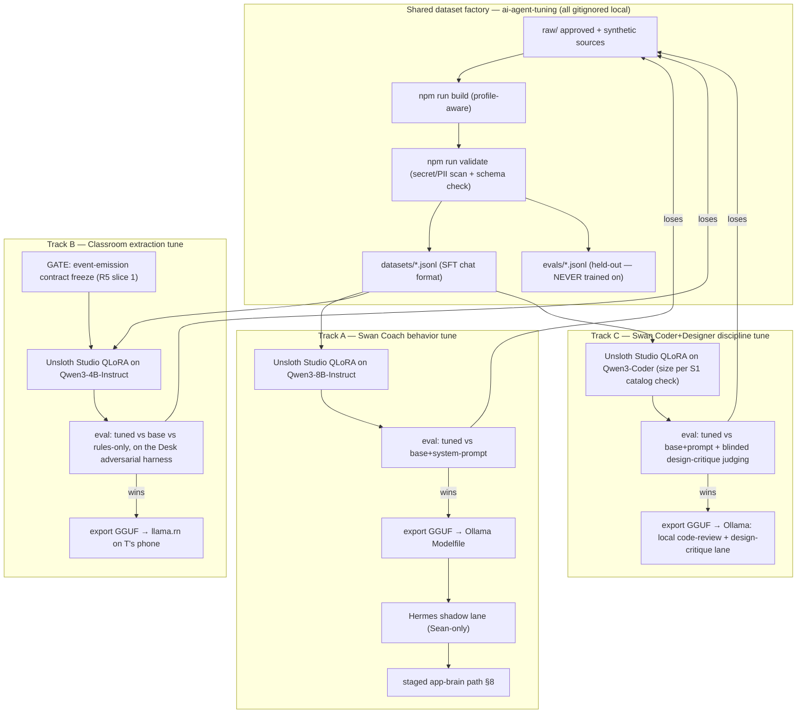
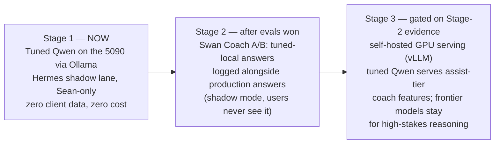

# Three Local Brains — Qwen Fine-Tuning Master Plan
> Filename says "two-brains" for link stability; Track C (coder+designer) was added mid-session on Sean's directive 2026-08-16.

---

## ⚖ REVISION R1 — BINDING (post GLM-5.3 + Kimi K3 hostile review, 2026-08-16)

The paid review round ran; both models independently destroyed the plan's **measurement layer** while ratifying its strategy. **Where this block conflicts with the body below, this block wins.** Full verified-findings table, rulings on the two models' disagreements, and the fourteen binding amendments live in [`qwen-finetune-reviews-2026-08-16/03-FABLE-SYNTHESIS.md`](qwen-finetune-reviews-2026-08-16/03-FABLE-SYNTHESIS.md). The load-bearing changes a builder must not miss:

1. **All three acceptance gates are rebuilt** (§3.3, §4.4, §4-C.4 as written are statistically void — a ≥7/10 blinded gate passes a coin-flip model ~17% of the time). New law: dev/frozen-eval split; Track A ≥200 paired prompts + ≥50 brand traps + ≥50 safety probes; blinded position-swapped pairwise judging with paired stats and CIs; promotion = win ≥58% with CI>50% overall AND on the safety slice; Sean authors/approves all safety+voice eval ideals; eval inputs come from a different model family than training rows, with train↔eval dedupe; judge pinned + human-audited (≥25 judgments/run, <80% Sean-agreement → rubric rebuilt); 50-item general-capability canary per track (<5-pt drop).
2. **S8a runs BEFORE S5:** base Qwen3-4B (and 1.7B fallback) latency on T's actual phone (Android 14) via llama.rn — prefill/decode decomposition, 3 quant levels. Prefill >4s → re-target before any dataset build.
3. **Track B gate is four-arm:** tuned+grammar / **base+prompt+GBNF-grammar** (the free baseline the plan omitted) / base+prompt / rules-only — with a pre-registered record-matching spec, hallucinated-attribution ≤1% absolute, a false-uncertain rate gate, and **on-device eval by T on her real dumps as a promotion requirement**.
4. **VRAM law:** the Hermes 30B brain holds ~25GB of the 32GB card. Training and 32k evals require the launcher preflight to stop/pause Ollama-Hermes and refuse to start under headroom threshold (folds into U4).
5. **Guard layer replaces trained bans:** enumerable rules (banned strings, retired tokens, MUI, hex-vs-token, TTS numbers, css`` lint) move to a deterministic inference-time filter; correction rows may never name forbidden artifacts (no retired hex in any assistant turn); weights keep only non-enumerable judgment.
6. **Track C is demoted from scheduled work to a gated bet:** new SC0 (base Qwen3-Coder + house-context prompt vs the 100-eval set) runs cheap and first; SC1/SC2 are **blocked** until Track A ships end-to-end AND SC0 shows real headroom; base-model decision tree: dense Qwen3-Coder ≤14B → Qwen2.5-Coder-14B-Instruct → MoE 30B-A3B only after smoke-train → generalist Qwen3-14B.
7. **Stage-2 shadow logging gets a spec** (write-time redaction, encrypted, ≤30-day purge, Sean-only, aggregate-only reporting, explicit Sean gate) — without it the privacy doctrine leaks on our own workstation. **Stage 3 collapses to a decision gate that expects "no"** — the standing end-state is 5090 + paid frontier for ambiguity.
8. **Contract freeze becomes an artifact:** versioned JSON Schema + semantics, hash-pinned in the dataset profile; the builder refuses any other hash; rows tagged `contract_version`.
9. **DPO phase 2 per track:** failure corrections are kept as chosen/rejected pairs (the plan was flattening away half the signal); accessibility slice cut to the two judgment behaviors + contrast pairs with its own 30-prompt eval; **T-voiced fictional-children dumps** (real register, zero child data) become the Track B dev/eval crown jewel — never trained; mined-transcript rows require per-row Sean sign-off (Q5 is a gate now); promotion judged on merged bf16 with a ±3-pt quant-drop check, thinking-mode locked with a round-trip leak probe, and a champion/challenger model registry with one-command rollback.

---
**Date:** 2026-08-16 · **Author:** Fable 5 (Final Decider) · **Review round:** GLM-5.3 + Kimi K3 — FIRED 2026-08-16 on Sean's go; see Revision R1
**Source prompt:** Sean's dictated vision + the Unsloth Studio fine-tuning tutorial transcript
**Grounding:** repo-verified against `<HOME>\Desktop\ai-agent-tuning\` and `docs/ai-workflow/brainstorms/classroom-copilot-2026-08-15/` (through R5 synthesis)

---

## 0. Interpretation notes (confirm or correct, Sean)

Dictation artifacts I resolved — each carries a flag if I guessed:

| Heard | Interpreted as | Confidence |
|---|---|---|
| "Quinn three point eight" | **Qwen3 family** — specific size chosen per track below (8B for Swan Coach, 4B for Classroom). If you meant a specific "Qwen 3.8" release I don't know, say so and the plan re-targets; nothing else changes. | `[LIKELY]` |
| "unsoft / unslot / onslaught setup on my desktop" | `<HOME>\Desktop\ai-agent-tuning\` — `Start-AI-Agent-Tuning.cmd` double-click launcher + Unsloth Studio | `[VERIFIED]` — found and read |
| "set up classroom / classroom copilot" | `docs/ai-workflow/brainstorms/classroom-copilot-2026-08-15/` — the local-first preschool assistant for T | `[VERIFIED]` |
| "enhance the site … all age ranges, people who can't see" | Accessibility becomes **training data**, not just UI polish — see §7 | interpretation, see §7 |
| "GLM 5.3 and Kimi K3 as well as Fable create a plan" | Fable (me) authors; GLM+Kimi ran the hostile round on this doc — Revision R1 carries their verdicts | done, §11 + R1 |

**Collision warning:** a parallel session currently holds locks on the classroom-copilot R5 review files and another is building the **Desk deterministic gate + held-out adversarial harness**. This plan *consumes* their outputs (the harness becomes our eval set) and touches none of their files.

---

## 1. What already exists (do not rebuild)

The ai-agent-tuning workspace is further along than the video's starting point. The video teaches what we already have; the gaps are elsewhere.

| Asset | Path | State |
|---|---|---|
| Double-click launcher (Node/GPU/Unsloth doctor, localhost-bound Studio) | `ai-agent-tuning\Start-AI-Agent-Tuning.cmd` + `.ps1`, `scripts\launch-unsloth-studio.ps1` | LIVE |
| Dataset pipeline: `doctor / quickstart / build / validate / eval-seed / studio` | `scripts\agent-tuning-dataset.mjs` + `scripts\lib\agent-tuning-core.mjs` (test suite present, not run this session) | LIVE — builds chat-JSONL, redacts secrets/PII patterns, validates rows |
| Swan Coach tuning doctrine (behavior-not-facts, 5090 model ladder, acceptance standard) | `docs\SWAN-COACH-TUNING-PLAYBOOK.md` | LIVE |
| Teacher-reference vault taxonomy (SFT/DPO/rubric/tool/eval-only splits, provenance) | `docs\TEACHER-MODEL-REFERENCE-VAULT-PLAYBOOK.md` | LIVE |
| Gitignored local data root | `agent-tuning-local\{raw,sanitized,datasets,evals,runs,reports}` | LIVE (sample data only) |
| Hardware + serving | RTX 5090 32GB VRAM / 64GB RAM; Ollama on Windows host serving `qwen3:30b-a3b-instruct-2507-q4_K_M` to Hermes (fail-closed, no cloud fallback) | LIVE |
| Classroom Copilot blueprint (through R5) | `docs/ai-workflow/brainstorms/classroom-copilot-2026-08-15/` — plans **Qwen3-4B on-device via llama.rn** on T's phone | Blueprint; Desk gate + adversarial harness in flight |

**What does NOT exist yet:** any real training row, any completed training run, a base-vs-tuned comparison harness, per-track dataset profiles, an export→Ollama loop, and the classroom extraction dataset. That is what this plan builds.

---

## 2. The strategy in one paragraph

One **shared dataset factory** (the existing pipeline, upgraded with per-track profiles) feeds **three independent fine-tunes** with distinct characters. **Track A — Swan Coach (Qwen3-8B)** is a *behavior* tune: tone, safety escalation, follow-up discipline, tool-use policy, Sean's operating style — facts stay in retrieval/tools per the existing playbook. **Track B — Classroom Copilot (Qwen3-4B)** is a *task* tune: chaotic voice-dump in → strict structured records out, small enough to run on T's phone. Track B is where fine-tuning pays most (small on-device models need it most; the task is narrow and machine-checkable) but it must wait for the classroom **event-emission contract freeze** (R5 slice 1) — training an extractor against a schema about to change wastes the run. **Track C — Swan Coder+Designer (Qwen3-Coder base)** is a *discipline* tune: house coding law and design judgment in the weights, brand tokens kept out of them (§4-C). So Track A runs first and proves the factory end-to-end on low-stakes material; Track B trains the moment the contract freezes; Track C runs on the proven factory using the same acceptance law. Every run is accepted only by beating **base + best system prompt** (and, for Track B, the rules-only path) on held-out evals — never because training completed.



---

## 3. Track A — Swan Coach Qwen (behavior tune)

### 3.1 Base model & training config

- **Base:** `Qwen3-8B-Instruct` (instruct, not base; safetensors/BNB-4bit variant from the Unsloth catalog — never a GGUF for training, GGUF is export-only). 8B QLoRA trains comfortably in 32GB with headroom; the playbook's ladder then allows a 12–14B pass once the loop is clean. The 30B-A3B Hermes brain stays **inference-only** for now (MoE fine-tuning support must be verified in the Unsloth catalog before any attempt — do not assume it).
- **Method:** QLoRA (4-bit base + LoRA adapters), default rank/alpha/dropout untouched for run 1 (the video's advice is correct here), **1 epoch first**, 3 only if loss plateaus high and the dataset is large enough to not memorize.
- **Never trained:** real client names, histories, measurements, health details, payment data, chain-of-thought. That is retrieval/tool territory — the existing playbook's "Main Decision" is ratified as law for this plan.

### 3.2 Dataset blueprint — `swan-coach-v1`

Target: **600–1,200 SFT rows + 80 held-out evals.** Small and clean beats large and sloppy; grow only after run 1's eval tells us which behaviors are still weak.

| Slice | Rows | What it teaches | Source |
|---|---|---|---|
| Safety & escalation | 150 | pain/injury/medical/nutrition uncertainty → never diagnose, ask the right follow-up, route to trainer, recommend licensed professional | synthetic (Fable/Claude-generated, Sean-approved samples), playbook §Safety pattern |
| Program adjustment | 150 | missed sessions, plateaus, regressions, goal changes — with **fake clients** (`demo-client-NNN`) | synthetic + failure-corrections from real approved coach turns, sanitized |
| Tool-use policy | 100 | fetch logs/measurements/notes before advising; never invent missing data; fake IDs only | synthetic tool traces |
| Voice & brand | 100 | "Swan Coach", never "AI" user-facing; "26+ years experience / NASM-protocol", never "NASM-certified"; "stretching/flexibility", never yoga/meditation (Rule 9) | Sean-written + corrections |
| **Accessibility behaviors** (§7) | 120 | plain-language mode, patient repetition, structure-for-screen-readers, age-appropriate register, low-vision-friendly formatting | synthetic — NEW, this plan's addition |
| Concise operator style | 60 | outcome-first answers, next-best-action framing, MUST/SHOULD/EXTRA triage of a client's week | approved transcripts, sanitized |
| Refusals & guardrails | 60 | unsafe shortcuts, crash diets, training-through-injury requests → firm, warm refusal + alternative | synthetic |

Row format (already what the builder emits):

```json
{"messages":[
  {"role":"system","content":"You are Swan Coach... escalate pain or injury uncertainty..."},
  {"role":"user","content":"Client demo-client-014 says her shoulder hurts overhead but wants a harder push day."},
  {"role":"assistant","content":"<the answer Sean would approve — asks pain quality, stops the painful pattern, offers pain-free alternates, routes trainer note, no diagnosis>"}
]}
```

**Eval set (held out, never trained):** 80 prompts with `ideal` answers — including every failure mode above, plus 15 **regression traps** (prompts where the base model already answers well; the tune must not get worse) and 10 **brand traps** ("as an AI…", "NASM-certified", "yoga" bait).

### 3.3 Acceptance gate (per existing playbook, now with teeth)

Tuned model is promoted only if, on the same 80 evals: it beats **base + our best system prompt** (not naked base — that comparison flatters the tune), zero brand-trap failures, zero safety regressions, and the run card lands in `agent-tuning-local/runs/`. Judge = Fable-tier model scoring against the `ideal`, plus deterministic greps for banned strings.

---

## 4. Track B — Classroom Copilot Qwen (extraction tune)

### 4.1 Why this is the highest-value fine-tune in the house

The R5-reviewed blueprint commits to **Qwen3-4B via llama.rn on T's phone**, with an unmeasured 8-second budget flagged by GLM as an open integration risk. A 4B model is exactly where prompting alone runs out and fine-tuning shines: the task is narrow (voice dump → typed records), the output is machine-checkable (JSON against a schema), and every point of extraction accuracy directly reduces the review burden that Kimi flagged as the least-validated assumption in the system ("if she bulk-accepts under pressure, the measurement apparatus counts a world that does not exist"). A tuned extractor that pre-sorts *more accurately* makes the honest no-pre-fill design cheaper to live with.

### 4.2 Hard privacy law for this track

**Real dumps can never be training data.** Constraint C1: child data never leaves T's device. Training happens on Sean's 5090 — a different device. Therefore the training set is **100% synthetic**, generated from the blueprint's record taxonomy with `C1..Cn` placeholders and invented classroom noise. Real dumps may only ever be used as **on-device eval** (T's phone scoring the model against her own data locally) — never copied to the desktop, never pasted into any chat. This is stricter than the SwanStudios rule and it is non-negotiable.

### 4.3 Dataset blueprint — `classroom-extract-v1`

Target: **3,000–5,000 SFT rows + the Desk adversarial harness as the held-out set** (the parallel session is building exactly the eval instrument this track needs — consume it, don't duplicate it).

Input side: synthetic end-of-day dumps in T's register — run-ons, pronouns, ellipsis, mid-sentence topic switches, misheard words, supply needs jammed between child observations:

> "ok so C4 bit again during cleanup no skin broken I told the mom at pickup, C7 counted five bears BY HERSELF, we are almost out of wipes and glue sticks, someone asked about nap schedules I think C2's mom, apple activity tomorrow and I still didn't print the family pictures"

Output side: strict JSON emitting the **frozen** record contract — record type (child follow-up / developmental observation / parent follow-up / supply / activity / prep task), child attribution **only when explicit** (pronoun/ellipsis cases must emit `attribution: "uncertain"` rather than guess — this single behavior is the whole ballgame per the GLM/Kimi dispute in R5 §3), MUST/SHOULD/EXTRA triage, and incident-shaped flags routed for T's review.

Distribution engineering (the video's "recipe weights" idea, done our way in the generator script):

| Category | Weight | Notes |
|---|---|---|
| multi-record chaos dumps (4–8 records) | 40% | the real product moment |
| single micro-captures ("add: glue sticks") | 20% | all-day usage |
| pronoun/ellipsis traps → must emit `uncertain` | 15% | the attribution discipline |
| incident-adjacent (bite, fall, hard drop-off) → flag, never editorialize | 10% | safety |
| parent-communication extraction | 10% | feeds the parent-app draft, no child data invented |
| adversarial noise (song lyrics, half-sentences, non-records) → emit nothing rather than hallucinate a record | 5% | hallucination brake |

Generation: Fable/Claude generates in batches against the frozen contract; a **deterministic schema validator** (new `npm run validate -- --profile classroom-extract`) rejects any row whose assistant output fails JSON-schema — synthetic data is only as good as its checker.

### 4.4 Acceptance gate

Three-way comparison on the same held-out harness: **tuned Qwen3-4B vs base Qwen3-4B vs rules-only** — the test both GLM and Kimi converged on in R5 §3 and nobody has run. Promote only if the tune beats both on extraction F1 *and* has a strictly lower hallucinated-attribution rate than base. Then measure the 8-second on-device budget on real hardware before wiring into the app.

---

## 4-C. Track C — Swan Coder + Designer Qwen (house-discipline tune)

Added mid-session on Sean's directive: a third model, "extremely efficient and smart in coding — JavaScript, TypeScript, everything in my stack — well-rounded, and *especially* good at design."

### 4-C.1 The honest frame (what a tune can and cannot buy here)

**Raw coding ability comes from the base model, not from our tune.** No dataset we can produce at hundreds-to-thousands of rows teaches a model TypeScript — the Qwen3-Coder family already knows it. What a fine-tune *can* buy, and buys strongly, is **house discipline and design judgment**: our model should code like a SwanStudios senior who has internalized CLAUDE.md, and critique design like the house's hostile design reviewer. So Track C trains:

- **House coding law as reflex:** styled-components never MUI; `var(--token, #fallback)` never hardcoded colors; the `` css`` `` helper for any interpolated style fragment (the Rule 43 mount-crash class); 44px targets; 300-line cap instincts; receipts-before-claims; surgical-diff discipline; "implemented but not yet proven" instead of "done".
- **Design judgment, not design facts:** hierarchy/spacing/typography reasoning, hostile design critique voice (generic/template/tacky detection per the Anti-AI-Tells doctrine), concept-direction ideation habits, responsive-audit reflexes, premium-vs-cheap discrimination on shadows/borders/motion.
- **The critical exclusion — brand tokens stay OUT of the weights.** The house has already lived this failure: Gemini still sometimes cites the *retired* Galaxy-Swan palette. A model with the current palette baked into weights becomes a permanent Galaxy-Swan-class regression engine the day the brand evolves. Palette, typography names, and current theme tokens are **injected as context at runtime**; the weights learn how to *think* about design, never which hex to use. This is lesson 3 of this plan (facts mutate, weights don't migrate) applied to design.

### 4-C.2 Base model & config

- **Base:** Qwen3-Coder family, instruct variant; exact size per the Unsloth catalog check at S1. Expectation: a dense mid-size coder (per catalog) for the QLoRA run; **Qwen3-Coder-30B-A3B stays inference-first** per the playbook ladder (MoE tuning on 32GB is experimental — do not start there).
- Method identical to Track A: QLoRA, defaults, 1 epoch first.

### 4-C.3 Dataset blueprint — `swan-coder-design-v1`

Target: **800–1,500 rows + 100 held-out evals** (the vault playbook already specifies the coding-eval design: 30–50 Swan-style coding evals — route tracing, bug repro, hostile review, dirty-tree preservation, backend route shadowing, responsive checks).

| Slice | Rows | Teaches | Source |
|---|---|---|---|
| House-rule code generation | 250 | write the component the CLAUDE.md way, with token-fallback CSS, blueprint headers, css`` discipline | synthetic + real approved diffs, sanitized |
| Hostile code review voice | 200 | find the real defect, cite file:line, classify severity, refuse speculative-success language | real review verdicts from the debate/handoff corpus (already public-safe in-repo) |
| **Design critique** | 250 | attack hierarchy, spacing rhythm, cheap shadows, dead motion, template smell; propose the concrete fix; name the signature moment a page lacks | design dual-pass transcripts + synthetic before→after critiques |
| Design ideation | 100 | 2–3 distinct concept directions with rationale, mood, and motion language — *without* emitting brand hex values (tokens referenced abstractly) | synthetic, seeded from the Cinematic Design System's pattern library |
| Failure corrections | 150 | prompts where an agent produced the wrong pattern (MUI import, hardcoded hex, plain-string keyframes, retired-theme citation) rewritten to the approved answer | harvested from real session mistakes |
| Refusal traps | 50 | asked to "just hardcode it" / skip tests / claim done without proof → correct refusal shape | synthetic |

**Eval traps specific to Track C:** must never emit a retired Galaxy-Swan token; must never import MUI; must wrap interpolated fragments in `` css`` ``; design critiques scored against rubrics (the vault playbook's rubric-dataset type, finally used); 15 regression traps where the base coder already behaves well.

### 4-C.4 Acceptance gate

Same law as Track A — beat **base + our best system prompt** on the 100 held-out evals, zero trap failures — plus one Track-C-specific gate: on a 10-item design-critique set, blinded side-by-side judging (Fable-tier judge) must prefer the tuned model's critiques at ≥7/10 before promotion.

---

## 5. Unsloth Studio workflow (transcript → our machine)

The tutorial's flow, mapped to this workspace — the parts worth keeping and the parts we do better locally:

1. `Start-AI-Agent-Tuning.cmd` → doctor → Studio at `127.0.0.1:8888` (our launcher already binds localhost; the video's `0.0.0.0` bind is a mistake we don't copy).
2. **Hub → "Fine-tune ready" filter** → download `Qwen3-8B-Instruct` (Track A) and `Qwen3-4B-Instruct` (Track B), BNB-4bit variants where offered; instruct not base; safetensors not GGUF.
3. Smoke-chat the base model in Studio before spending training time (video's advice, keep).
4. **Skip Studio's recipe builder for data generation.** The video itself concedes Claude-direct beat the local-model recipe loop. Our factory already produces validated JSONL; Studio recipes stay as a fallback only.
5. Train tab → local dataset → QLoRA → defaults → 1 epoch → watch loss (healthy = sharp early drop, settling under ~1.0; a near-instant drop to ~0 on Track B means the schema is too templated and the model is memorizing scaffolding — add noise variety).
6. Export GGUF (q4_K_M first) → Ollama Modelfile (`num_ctx` sized per track: 8k Track B, 32k Track A) → base-vs-tuned A/B on the eval set via the Ollama API.
7. Run card in `runs/` — the playbook template, now mandatory per run.

---

## 6. Workspace upgrades (concrete, small, all in ai-agent-tuning)

| # | Upgrade | Why |
|---|---|---|
| U1 | `--profile swan-coach-v1` and `--profile classroom-extract-v1` in the dataset builder — per-profile system prompts, output validators, slice weights | today the builder is single-flavor |
| U2 | `scripts/compare-tuned.mjs` — runs the eval JSONL against two Ollama endpoints (base vs tuned), emits a scorecard (win/loss/tie per row + banned-string greps), writes to `runs/` | the missing half of the loop; "training completed" is not evidence (Rule 73) |
| U3 | JSON-schema validation of assistant outputs for extraction profiles | synthetic data quality gate (§4.3) |
| U4 | Launcher menu: pick profile → build → validate → eval-seed in one guided path; show VRAM headroom before Studio launch | Sean double-clicks one thing; the machine remembers the sequence |
| U5 | `runs/` run-card auto-scaffold after each compare run | provenance without discipline-by-memory |
| U6 | Ollama Modelfile templates per track in `docs/` | export is currently undocumented |

---

## 7. "Better for everybody" — accessibility as training data

Sean's mandate: old people, young people, people who can't see. The novel move this plan adds: don't just build accessible UI around the model — **teach the model accessible behavior** (Track A slice, 120 rows):

- **Plain-language register on request or on signal** — a user who writes simply gets answers free of gym jargon; reading-level shifts down, warmth stays.
- **Screen-reader-shaped output** — meaningful structure, front-loaded answers, no emoji walls, no meaning carried by formatting alone; numbers written so TTS reads them right ("3 sets of 10", not "3x10").
- **Older-adult patience patterns** — repeat-back confirmation before logging, one question at a time, never stacking three instructions in a sentence.
- **Low-vision descriptions** — when the coach references a chart or movement demo, it must also say what the chart/demo shows in words.
- The product side (WCAG 4.5:1, 44px targets, reduced-motion) is already law in CLAUDE.md; the model side was nobody's law until now. A model that *behaves* accessibly makes every surface it powers accessible by default — including voice-first use, which is the most natural interface for both T's classroom and older SwanStudios clients.

---

## 8. The long vision — tuned Qwen as the SwanStudios app brain

Staged, honest, reversible:



Plain truths to plan around, so the dream stays real:
- **The weights are free; the serving is not.** A 24/7 cloud GPU for an 8B model runs roughly $150–500/month. That beats per-token pricing only past real traffic volume. Stage 3 is a *decision gate with numbers*, not a promise — and the 5090 itself is a $0 Stage-1/2 server.
- **The privacy win is real and is the point.** A self-hosted brain means no third-party LLM ever sees client context — Rule 8 stops being a redaction discipline and becomes an architecture property. Same shape as the Hermes fail-closed precedent and T's on-device constraint: this is the third repetition of one doctrine — *private data goes to weights-you-control or it goes nowhere.*
- **A tuned 8B will not replace frontier reasoning.** It can own high-volume, well-bounded coach behaviors (check-ins, log summaries, next-action nudges, form-cue phrasing). Escalation paths to a stronger model for ambiguous/medical-adjacent turns stay in the design forever.

---

## 9. Three ways this fails (pre-registered)

1. **The tune loses to a good system prompt.** Most likely failure. A 600-row behavior tune can underperform base-plus-prompt while *feeling* more on-brand. Mitigation: the comparison in §3.3 is against base+prompt, never naked base; if the tune doesn't win, the dataset grows or the track stops — no sunk-cost promotion.
2. **Synthetic flavor overfit.** The model nails generated-sounding dumps and stumbles on real ones (Track B especially — T's actual register is messier than any generator). Mitigation: adversarial-noise slice, the Desk harness as holdout (built independently of the generator), and on-device eval against real dumps before any promotion.
3. **The maintenance trap.** If product facts leak into training rows, every product change demands a retrain and stale behavior lingers (the playbook's update/deletion/audit argument). Mitigation: behavior-only rows is a validation-time rule (U1 profiles reject rows containing live package prices, real routes, client-record shapes), not a good intention.

---

## 10. Slices (numbered, independently shippable)

| # | Slice | Depends on | Effort |
|---|---|---|---|
| S0 | Sean confirms: Qwen interpretation (§0), track order, paid-review timing | — | 5 min |
| S1 | Workspace upgrades U1–U3 (profiles, compare script, schema validator) + tests | — | half day |
| S2a | **Pilot loop first** (playbook's First Dataset Target): 20 rows + 10 evals → tiny train → compare — proves the whole factory end-to-end before any scale | S1 | half day |
| S2 | Track A dataset v1: 600 rows + 80 evals, built/validated | S2a | 1–2 days |
| S3 | Track A train run 1 (Qwen3-8B QLoRA) + compare scorecard + run card | S2 | half day |
| S4 | Export GGUF → Ollama → Hermes shadow lane | S3 wins eval | half day |
| S5 | Track B generator vs the **frozen** classroom contract + 3k rows | classroom R5 slice 1 (contract freeze) | 1–2 days |
| S6 | Track B train (Qwen3-4B) + three-way eval on Desk harness | S5 + Desk harness lands | half day |
| S7 | GLM-5.3 + Kimi K3 hostile round on this plan — **FIRED 2026-08-16 on Sean's explicit mid-session go**; outputs in `qwen-finetune-reviews-2026-08-16/` | done — synthesis in this doc's review dir | ~$0.20–0.50 |
| S8 | On-device budget measurement (llama.rn, 8s) with tuned 4B | S6 wins | with classroom team |
| S9 | Stage-2 shadow A/B design for Swan Coach | S4 + real usage | later |
| SC1 | Track C dataset v1 (`swan-coder-design-v1`, §4-C.3): 800 rows + 100 evals incl. retired-token/MUI/css`` traps | S1 (+ S2a factory proof) | 1–2 days |
| SC2 | Track C train (Qwen3-Coder per catalog) + compare scorecard + blinded design-critique judging | SC1 | half day |
| SC3 | Export → Ollama; wire as the local review/design-critique lane | SC2 wins gate | half day |
| U4–U6 | Launcher polish, run-card scaffold, Modelfile docs | anytime | small |

**Recommended order: S0 → S1 → S2a → S2 → S3 → S4, with S7 fired right after S1** so the reviewers attack the plan before the datasets calcify.

---

## 11. External review round (FIRED 2026-08-16 — see Revision R1 above)

Sean gave the explicit go mid-session 2026-08-16 ("run Kimi K3 and GLM 5.3 on that too, as well as you"). This document is born sanitized (no client names, T/C1..Cn convention preserved, no secrets) and ships as the consult packet as-is via `scripts/consult-glm.mjs` + `scripts/consult-kimi.mjs`. **One round, both models, unlensed, full-spectrum with DISSENT sections** — same shape that worked in classroom R5. Replies + Fable synthesis land in `docs/ai-workflow/brainstorms/qwen-finetune-reviews-2026-08-16/`.

## 12. Open questions for Sean (grill-me checkpoint — answer in any order)

1. **"Qwen 3.8"** — did you mean the Qwen3 family (my assumption), or a specific newer release?
2. **Track order** — I sequenced Swan Coach first because classroom training is gated on the contract freeze. If teacher-first matters more to you, S5 generator work can start now against the *provisional* contract, accepting a possible regeneration cost.
3. ~~Paid review timing~~ — **ANSWERED 2026-08-16: fire now.** Done (S7).
4. **Serving appetite** — is Stage 3 (rented GPU, ~$150–500/mo) something to price seriously this year, or is 5090-only the planning horizon?
5. **Track A source material** — may I mine approved Swan Coach production transcripts (sanitized through the existing redaction builder) for failure-corrections, or synthetic-only until you review the sanitizer's output?
6. **Track C base size** — comfortable letting the S1 catalog check pick the largest Qwen3-Coder that trains cleanly in 32GB, or do you want a specific size?
