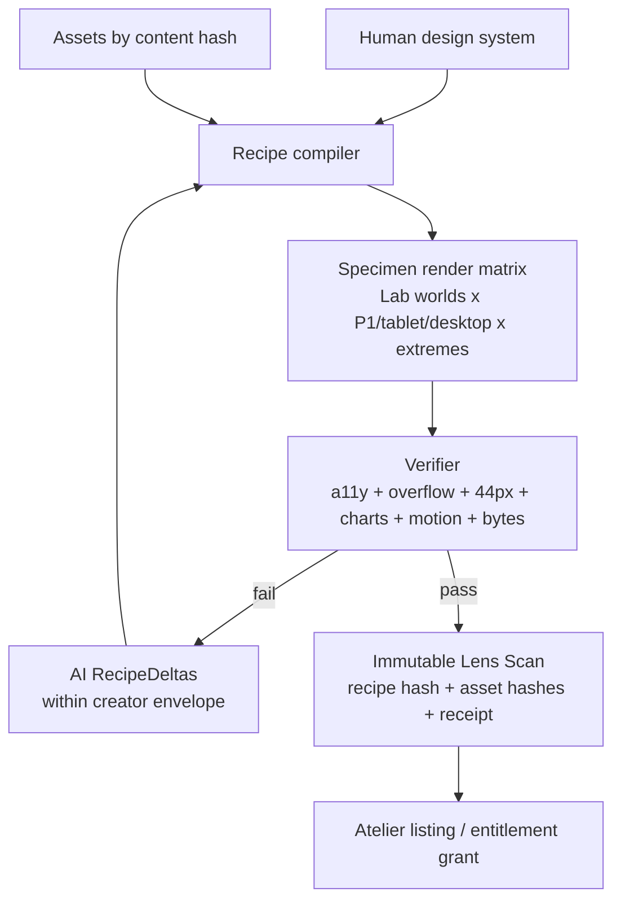
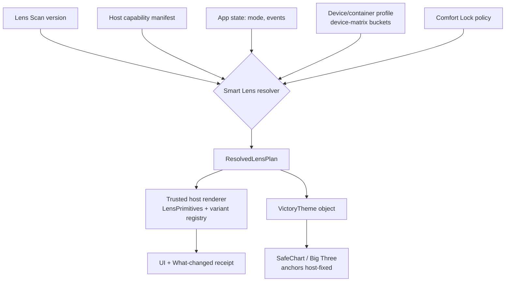
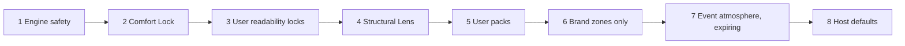
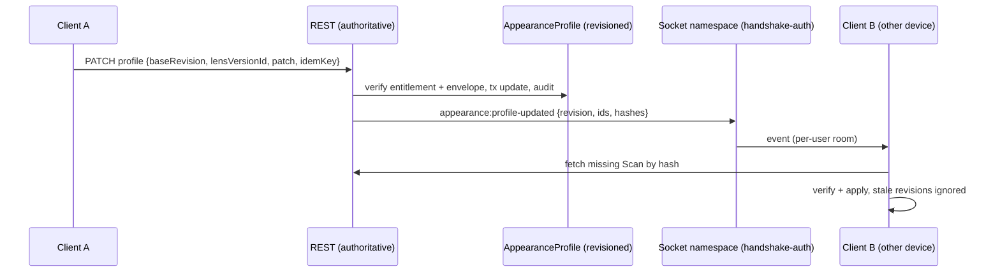

# SMART LENS OS — THE ULTRA MEGA PROMPT
## Master build bible for the Experience Compiler, the Chart Charter, and the Lens Atelier

```
Status:      ACTIVE — canonical build prompt for all Smart Lens work
Owner:       Sean (vision) · Fable 5 (Final Decider synthesis)
Provenance:  Codex hostile REVISE 2026-07-12 → GPT Pro deep-research review
             → Fable corrections + additions → Sean ratified direction
Date:        2026-07-12
Supersedes:  nothing — first canonical Smart Lens doc. The shipped v1
             substrate (main @ a2c39b98c lineage) is the foundation, not
             a draft to discard.
Read with:   CLAUDE.md (rules bind ALWAYS) · SWAN-CINEMATIC-DESIGN-SYSTEM.md
             · this doc wins over the raw GPT Pro review text on conflicts
How to use:  Any agent (Claude/Codex/Gemini) executing ANY Smart Lens
             slice reads §0–§2 + the §of their phase + §15 forbidden list.
             Never execute beyond the phase Sean has actually greenlit.
```

---

## §0. THE CREDO (non-negotiable, verbatim in every phase)

> **The World owns truth.**
> **The host owns behavior.**
> **The Lens owns expression.**
> **The compiler enforces the boundary.**
> **The receipt proves the result.**
> **The creator owns the lineage.**
> **AI personalizes within permission.**
> **The member can always come home.** *(Fable addition: Default Safety is
> always free, always one tap away, from anywhere. Escape hatches are a
> feature, not an apology.)*

### The boundary contract

A Lens may own: layout template selection · semantic slot placement ·
visual hierarchy · typography roles · component variants · spacing/density
· surface geometry and material · chart STYLING (never chart TRUTH — §5)
· safe action placement from allowlisted arrangements · motion cues ·
ambient atmosphere · presence/companion rendering · decorative responses
to allowlisted semantic events.

A Lens may NEVER: execute JavaScript · ship components · inject HTML ·
inject arbitrary CSS strings · load unapproved remote URLs · rename/hide/
move critical actions · introduce network requests · read application data
beyond host-supplied semantic props · move focus or trigger actions
autonomously · alter chart data, scales, units, or annotations · stack a
second celebration on a gamification event (§6.4) · degrade below the
accessibility floor regardless of rarity or price.

The host ALWAYS owns: routes · permissions · API calls · user/client data
· form meaning + validation · action labels + consequences · payment/
booking/deletion/health/consent semantics · focus identity · analytics
meaning · error states · **chart data truth (§5)**.

AI and third-party artists submit **design data to a governed renderer**.
Nothing reaches into the DOM. (OWASP framing: untrusted input is data,
never markup or code; CSP is defense-in-depth, not permission.)

---

## §1. SUBSTRATE TRUTH — what exists and is LIVE as of this doc

All shipped to production main; receipts in repo history and
`docs/ai-workflow/qa/lens-vision-20260711/`.

| Capability | Where | State |
|---|---|---|
| 26 lens manifests, immutable registry, one-hop Default-Safety fallback, validation | `frontend/src/core/style-lens-os/` + `adapters/style-lens-swan/` | LIVE |
| Preview≠commit state machine, persistence w/ 8KB envelope + rollback + cross-tab sync | `StyleLensProvider` / `appearancePersistence` | LIVE |
| **ScopedLensFrame** — bounded 3-layer attribute frame; the preview/compare/Forge-candidate primitive | `core/style-lens-os/ScopedLensFrame.tsx` | LIVE |
| Live lens-on-stage preview, TWO-live-stage Compare, per-lens identity glyphs, nebula Lab | `workout-design-lab/` | LIVE |
| Scoped-frame bleed guards (`cc8c1449c`), tone rules `:where()` non-destructive | `SwanStyleLensGlobalStyles.ts` | LIVE |
| GlowButton emits `data-swan-button-tone` (primary→blue, accent→purple) | `ui/buttons/GlowButton.tsx:693` | LIVE |
| **Device-matrix package** — top-20 phones / P1–P12 buckets / media builders / container-query SwanGrid reading `--lens-*` | `frontend/src/styles/device-matrix/` | LIVE |
| Schedule Day Strip (lens-aware surfaces, device-matrix consumer) | `UniversalMasterSchedule/components/ScheduleDayStrip*` | LIVE |
| Cross-engine e2e harness w/ synthetic auth + API mocks + a11y/overflow/44px/CLS gates 320px→4K | `frontend/e2e/` + 2 playwright configs | LIVE |
| Real semantic events: PR detection (`personal_records` + idempotent ledger awards), recovery completions, streaks, challenges, gamification ledger | backend (charter 4a/4B, ledger) | LIVE |

**Known honest gap (Codex finding 1, all three brains agree):** lenses
restyle the FRAME (chrome, canvas, radius, edges, widths) but Worlds and
dashboards hard-code their interiors. Recipe v2 exists to invert this.

**Environment note:** the Workout Design Lab + its e2e harness IS the
"specimen host" — do not build a new one (Fable correction F3).

---

## §2. NORTH STAR + DUAL-TRACK STRATEGY (Fable correction F1 — binding)

**Smart Lens = a portable, capability-bound Experience Compiler**: signed,
declarative experience programs that reinterpret an application's visual
and interaction grammar without changing its business logic and without
accepting third-party code. Human-authored, AI-personalizable,
proof-carrying.

**But SwanStudios is a production training business, not a platform
company.** Every slice must justify itself against Rule 62 (coaching,
adherence, progress proof, community, revenue, trust) — so the roadmap is
two explicitly separated tracks:

### Track 1 — SWAN VALUE NOW (default work queue)
Phase 1 Golden Pair → Phase 2 shared preview runtime → Phase 3 Chart
Charter + host adapter (§5) → Phase 4 coaching-loop integration (§6) →
Phase 5 Comfort Lock (§11) → Phase 6 server profile + socket distribution.
Each phase improves the live product for real members/trainers.

### Track 2 — PLATFORM BET (Sean-gated, chromie-gated)
Package extraction → Forge Explore/Remix → Atelier marketplace →
entitlements/royalties → signing/provenance → cross-app portability.
**No Track 2 slice starts without (a) Sean's explicit go, (b) a `chromie`
pressure-test of the marketplace bet, (c) Track 1 Phases 1–3 shipped.**
Agents found gold-plating toward Track 2 while Track 1 is unproven are in
violation of this prompt.

**Why this ordering wins:** Track 1's primitives (LensPrimitive library,
recipes, receipts) ARE Track 2's product. Nothing is thrown away; only
risk is sequenced. And the Trojan horse (Fable idea A5): every dashboard
slice rebuilt on LensPrimitives becomes automatically lens-able — the app
converges on the compiler without a big-bang rewrite.

---

## §3. THE LENS STACK — composable layers, one resolved experience

| Layer | Controls | Typical creator | Track |
|---|---|---|---|
| **Structural Lens** | composition, hierarchy, navigation grammar, component variants | product/UI designer | 1 |
| **Colorway** | semantic color tokens + contrast-safe alternates + **dataviz palette (§5)** | color/brand designer | 1 |
| **Skin Pack** | textures, illustration, borders, icon treatment | graphic artist | 2 |
| **Presence Pack** | avatar/companion/guide states | character artist | 2 |
| **Moment Pack** | celebration/recovery/streak/seasonal cues | motion designer | 2 |
| **Brand Overlay** | trainer/org logo + accents in declared brand zones ONLY | brand designer | 1 (trainer feature) |
| **Comfort Policy** | motion/contrast/density/stimulation limits | the user; **never sold** | 1 |

### Precedence (highest wins)
1. Engine safety + critical-action invariants
2. User + OS accessibility requirements (**Comfort Lock, §11**)
3. User-locked readability/density preferences
4. User's Structural Lens
5. User's Colorway/Skin/Presence/Moment packs
6. Trainer/org branding — **brand zones only; a trainer can never silently
   replace a member's personal appearance** (override = coaching
   prescription flow, §6.3, always member-visible + member-revertible)
7. Temporary event atmosphere — bounded + auto-expiring
8. Host defaults

**Brand-zone registry is shared with the white-label PDF system** (Fable
correction F6): one config drives UI brand overlays AND plan/report PDF
branding (Move Fitness client sees MF, Sean's client sees SwanStudios) —
two surfaces, zero drift.

---

## §4. RECIPE v2 — the grammar (seven axes, Swan-bound)

Recipes are **data**. DTCG token format for the `tokens` block (it's a
W3C Community Group report, not a Rec — use it as interchange, don't
stretch it to cover composition/presence/moments, which are Smart Lens
domains). Style-dictionary transforms tokens → runtime outputs (CSS vars,
**VictoryTheme objects** §5, PDF brand kit values).

1. **Foundations** — semantic color tokens; display/body/data/label/code
   typography (Swan faces only: Plus Jakarta Sans, Cormorant Garamond
   Italic, Fira Code, Sora); type scale + line height; spacing rhythm from
   the modular scale; icon family; border/elevation/translucency/focus
   treatment; **dataviz tokens (§5)**.
2. **Composition** — allowlisted layout template per container profile;
   semantic slot placement; emphasis/span; optional vs required regions;
   collapse rules; max line length; reading/focus order constraints.
   **Container profiles are defined against device-matrix buckets**
   (mobile-minimal ≈ P12–P6 floor…P1, tablet, desktop-enhanced) and
   rendered via container queries — ScopedLensFrame already declares
   `container-type` (Fable correction F3b).
3. **Component grammar** — card/panel variants; list/table/timeline/
   magazine/terminal/board representations; button + input variants; empty
   and loading states; nav variants; modal/overlay material; **chart
   grammar (§5)**; progress visual grammar.
4. **Action choreography** — allowlisted arrangements (action dock,
   command rail, inline footer, sticky mobile zone) preserving semantic
   action + accessible name. Critical financial/safety/consent/booking/
   destructive actions: host-fixed, lens-immutable.
5. **Atmosphere & motion** — typed cues, not animation strings; entry/
   emphasis/transition/celebration budgets; opacity-only alternates;
   reduced-motion + motion-off REQUIRED; max simultaneous animations;
   ambient stops during input.
6. **Presence** — asset IDs into host anchor slots; finite allowlisted
   states; pointer-transparent; static fallback; Track 2.
7. **Semantic moments** — reactions to the REAL event allowlist (§6.4).

### Schema anchor (adapted from GPT Pro, Swan-corrected)
```jsonc
{
  "$schema": "https://schemas.swanstudios.com/smart-lens/v2.json",
  "id": "atelier.crystalline-cathedral",
  "version": "2.1.0",
  "authorship": {
    "mode": "human-directed-ai-assisted",
    "creatorId": "creator_42",
    "aiDisclosure": "AI used for colorway exploration only",
    "remixPolicy": "parameter-envelope-only"
    // contributor shareBps: TRACK 2 ONLY — phase 1 carries attribution
    // metadata, no royalty math (Fable sharpening S3)
  },
  "compatibility": {
    "engine": "^2.0.0",
    "requires": ["text.display", "surface.card", "collection.exercise",
                 "action.primary", "chart.progress"],
    "optional": ["presence.guide", "moment.personal-record"]
  },
  "tokens": { /* DTCG blocks: color, typography, geometry, dataviz */ },
  "composition": {
    "mobile-minimal": { "template": "processional-stack-v1" },
    "tablet":         { "template": "paired-nave-v1" },
    "desktop-enhanced": { "template": "cathedral-nave-v1" }
  },
  "components": {
    "text.display":        { "variant": "vaulted-editorial" },
    "surface.card":        { "variant": "faceted-glass" },
    "collection.exercise": { "variant": "processional-plates" },
    "action.primary":      { "variant": "altar-beacon" },
    "chart.progress":      { "variant": "rose-window", "familiarity": "conservative" }
  },
  "constraints": {
    "criticalActionPolicy": "host-fixed",
    "minimumTouchTargetPx": 44,
    "reducedMotionFallback": "required",
    "maximumAmbientLayers": 2,
    "maximumAssetBytes": 3500000
  }
}
```

**Slot discipline (Fable sharpening S1):** Recipe v2 Phase 1 proves SIX
slots — `text.display`, `text.body`, `surface.card`,
`collection.exercise`, `action.primary`, `chart.progress` — not all
eleven. Slot inflation before the Golden Pair proves the model is scope
creep and will be rejected in review.

---

## §5. ⭐ THE CHART CHARTER — "fresh and spicy, never confusing" (Sean's directive, elevated to a named system)

Charts are progress PROOF — the emotional core of the product. They are
also the easiest place to destroy trust. So charts get their own charter
with a two-sided guarantee: **lenses can dramatically re-dress them; they
can never re-write them.**

### 5.1 The Big Three — identity-anchored, lens-dressed
The three charts members live by (the canonical progress-proof set):
1. **Strength Trend** (est-1RM / top-lift progression)
2. **Body Trend** (weight / body-comp trajectory)
3. **Consistency** (workout frequency / heatmap / streak)

Each of the Big Three carries a host-fixed **Identity Anchor**: stable
title text, stable signature glyph, stable position of the headline value,
stable series meaning. A member switching from Candy Glass Arcade to
Prism Terminal must recognize "my strength chart" in under one second.
Anchors are lens-STYLED but never lens-MOVED or lens-RENAMED.

### 5.2 Data-truth invariants (lens-immutable, compiler-enforced)
- scale type, axis ranges/direction, units, data transforms, sort order
- series visibility defaults, legend semantics, annotation truth
- the numbers, the deltas, the PR markers — the TRUTH LAYER
- empty/error/loading states remain honest (styled, never faked)

### 5.3 What a lens MAY restyle (the spice)
- full dataviz palette (from Colorway dataviz tokens)
- stroke/fill/gradient treatment, point markers, grid/frame material
- label/axis typography (from lens type roles)
- the C11 chart ENVIRONMENT (narrative framing, headline treatment,
  annotation styling, empty-state art)
- draw-in/emphasis motion within the motion budget
- **representation variant within the familiarity budget** (5.4)

### 5.4 The Familiarity Budget (the "not crazy" control)
Every chart component declares its allowed representation distance:
- **`conservative`** (DEFAULT for all client-facing charts): same chart
  family only — a bar chart may become rounded-bar / crystal-column /
  segmented-bar; a line may become area/gradient-line. Never bar→radial.
- **`expressive`** (opt-in per user, or admin/trainer surfaces): lens may
  swap representation within a declared equivalence class (e.g. readiness
  dial → telemetry column) — receipts must prove value-readability parity.
- Familiarity is a USER setting and a HOST cap, never a lens decision:
  `min(user_preference, host_cap, lens_request)`.

### 5.5 The Victory bridge (mechanism)
- Compiler emits a **`VictoryTheme` object per resolved lens** from the
  dataviz tokens (style-dictionary transform), delivered through the
  existing `chartTheme` seam and SafeChart wrapper.
- Charts re-theme on lens change through the same View-Transition
  coordinator beat as the shell (one morph, not two).
- **Rule 10 stays absolute** (Victory only). **Arctic Cyan remains
  data-only** — enforced at the schema level: UI accent tokens and
  data-ink tokens are separate namespaces; the validator rejects a recipe
  that leaks either direction (Fable idea B1).

### 5.6 Chart receipts (new, nobody else has this)
Per published lens, the render receipt includes:
- **data-distinctness verified** — categorical dataviz palette passes
  pairwise deltaE + color-vision-deficiency simulation thresholds
- **value-readability parity** — labeled values/axis text meet contrast
  on every chart surface the lens produces
- **anchor integrity** — Big Three identity anchors present and unmoved
- golden-pair chart screenshots at P1 (414) and 1440

### 5.7 Seasonal chart freshness without chaos (Sean's "keep it fresh")
Moment/seasonal packs may re-dress chart ATMOSPHERE (environment, palette
accents, celebration overlays on PR markers) on a schedule — auto-expiring
per precedence rule 7 — while `conservative` familiarity keeps the
representation stable. Fresh quarterly, familiar always.

---

## §6. COACHING-LOOP INTEGRATION (Fable correction F2 — what makes this a Swan feature, not a skin store)

### 6.1 Lens modes bound to REAL training state
Modes: `focus` · `planning` · `active-session` · `recovery` ·
`celebration` · `seasonal-event` · `low-stimulation` · `presentation`.
Mode transitions come from host state (logger open ⇒ active-session;
recovery board surfaced ⇒ recovery), never from timers alone; a mode may
re-tune atmosphere/emphasis/density but NEVER moves controls mid-task,
reflows a form during input, or changes action meaning.

**NASM OPT phase atmospheres (Fable idea B2):** an optional trainer-enabled
mapping where the client's current OPT phase (stabilization / strength /
power) shifts the ambient atmosphere subtly — training methodology made
visible. Requires trainer enable + member consent; conservative defaults.

### 6.2 Progress-proof share cards (Fable idea B3 — Core Loop closer)
Milestone share images (PR, streak, program completion) render THROUGH the
member's lens → personalized, brand-beautiful share graphics → organic
marketing from the community loop. Share rendering uses the same scoped
compiler path; receipts cover the share template.

### 6.3 Trainer-prescribed experiences (the adherence tool)
A trainer may PRESCRIBE (not force) a lens/mode profile to a client —
e.g. `low-stimulation` + calmer lens for an overwhelmed client, or
`celebration`-rich for a client who needs wins. Flow: trainer prescribes →
member sees a card ("Coach Rivera suggests Quiet Meridian for this
program") → one-tap accept/decline → always revertible. Prescriptions log
to the coaching record (it IS coaching). Admin dashboards surface
prescription adoption as an adherence signal (aggregate, §6.5).

### 6.4 The REAL event allowlist (wire to signals that exist)
| Semantic event | Backend source | Exists today? |
|---|---|---|
| `personal_record.achieved` | PR engine (charter 4a), `personal_records` + ledger award | ✅ LIVE |
| `workout.completed` | canonical logger save / unified adapter post-commit | ✅ LIVE |
| `streak.extended` | gamification ledger streak rungs | ✅ LIVE |
| `achievement.unlocked` | badge/achievement awards | ✅ LIVE |
| `recovery.recommended` | Recovery Board composeRecoveryBoard | ✅ LIVE |
| `challenge.completed` | challenge progress (System A real path) | ✅ LIVE (System B cosmetic path excluded until wired) |
| `coach.feedback.received` | messaging/notification orchestrator | ✅ LIVE |
| `plan.phase_changed` | plan queue / OPT phase metadata | ◐ needs an emit hook |
| `community_event.completed` | events | ◐ needs an emit hook |

**One-celebration-owner invariant (Fable idea B4):** the gamification
system already celebrates (SaveSuccessPanel gold PR beat). A Moment cue
REPLACES/SKINS the host celebration for that event — it never stacks a
second one. The host celebration registry exposes exactly one owner per
event; compiler rejects recipes that claim an owned moment without the
skin flag. This kills the double-confetti bug class before it exists.

### 6.5 Lens telemetry → coaching insight (privacy-bounded)
Aggregate, opt-in, zero-PII: mode/lens usage vs adherence correlation
feeds trainer next-best-action ("clients on low-stimulation log 22% more
consistently"). ONLY aggregate cohorts, never individual surveillance;
Rule 8 applies; ships with the telemetry receipt documenting exactly what
is collected.

### 6.6 View-As renders the CLIENT's lens (Fable idea B5)
Trainer/admin View-As shows the member's actual resolved appearance
(empathy + support truth) with a one-tap "neutral view" toggle. Support
scripts reference the member's `appearance history` (6.7).

### 6.7 Appearance history + kill-switch hierarchy (Fable ideas B6/B7)
- Server appearance profile keeps a bounded revision history; "restore
  yesterday's look" is one tap; support can see WHAT changed WHEN.
- Kill hierarchy: global env kill-switch → per-lens-version revocation →
  per-user reset-to-default. All three tested in staging before Track 2.

---

## §7. PROOF-CARRYING UI — receipts graduate, infra doesn't front-load (Fable correction F4)

| Receipt tier | What | When |
|---|---|---|
| **v0 (NOW — Phase 1)** | Existing Playwright evidence pipeline: computed-style signatures, axe, overflow/44px/CLS gates, golden-pair screenshots, chart receipts (§5.6) — output hashed + committed to repo | Golden Pair PR |
| **v1 (Track 1 late)** | Receipt bound to recipe hash + asset hashes + engine versions + content-extreme fixtures; runtime checks receipt-vs-capability compatibility; stale ⇒ revalidate (first-party) or degrade | Phase 6 |
| **v2 (Track 2)** | Signed Scans (Sigstore-model artifact signing), C2PA for media assets, marketplace trust badges: Accessibility Verified · Reduced Motion Verified · Mobile Verified · Data-Distinct Verified · Human Authorship Disclosed | Atelier |

Receipts are "signed, reproducible evidence packets" — never marketed as
mathematical proof. **The marketing gift (Fable idea B8):** Swan's receipt
culture becomes a customer-facing trust feature — "every look is
contrast-verified, motion-safe, 44px-true." Sell the safety.

**Lens Recipe vs Lens Scan:** Recipe = editable source project. Scan =
immutable, content-addressed release (Sean's word, now a product concept).
Entitlements reference Scan versions; creators publish 2.2 without
mutating 2.1 under anyone; revocation disables a version without erasing
ownership. Assets by content hash / trusted storage ID only.

---

## §8. PHASE 1 — RECIPE v2 GOLDEN PAIR (the next PR; full spec)

**PR: `feat/smart-lens-recipe-v2-golden-pair`** — the whole invention in
one narrow proof: *can a safe recipe repaint the painting, not just the
frame?*

### Build
Recipe v2 schema (six slots, §4) · HostCapabilityManifest schema ·
deterministic compiler → `ResolvedLensPlan` · trusted component-variant
registry · trusted composition-template registry · semantic
**LensPrimitives** (`WorldScene, WorldHero, DisplayText, SupportingText,
ReadinessVisualization, ExerciseCollection, PrimaryAction,
SecondaryAction`) · LegacyV1Adapter (26 existing lenses become
`v1-compat` — stable IDs, honestly labeled, NOT silently promoted to v2)
· generated "What changed" diff · computed-style signatures · receipt v0.

### Refactor
`CrystallineSwanWorld` consumes LensPrimitives: it supplies content,
semantic state, actions, invariants — it no longer chooses fonts, card
material, exercise representation, or action position.

### Implement exactly TWO complete v2 lenses
**Candy Glass Arcade** vs **Prism Terminal** — deliberately opposite.
Same World data/state through both. **≥5 of these must differ measurably:**
display typography/scale · body/data typography · composition topology ·
card material/geometry · exercise-collection representation · readiness
visualization (within `expressive` familiarity, §5.4) · primary-action
locus · density · motion signature · atmosphere.

### Invariants that must be IDENTICAL (test-enforced)
route · application state · action callbacks · accessible action names ·
form semantics · content truth · required information · DOM reading order
· focus order · permissions · network behavior · **chart data truth +
Big Three anchors (§5)**.

### Proof gates (all must pass; attribute-only assertions are FAILURE)
- semantic probes: browser-computed display font family/size, surface
  radius, background/material signature, collection display-mode, grid
  template, primary-action bounding-region class, density/row height,
  motion duration/easing class — MUST differ between the pair
- golden-pair screenshots @ 414 (P1/XR) + 1440, committed
- generated "What changed" output (5-axis list) committed
- focus-order verification, content extremes (longest names, empty, 9+),
  reduced-motion render
- ALL existing gates retained (axe, overflow, 44px, write-safety, CLS)
- chart receipt v0 for `chart.progress` in both lenses (§5.6)

### Explicitly EXCLUDED from this PR
Socket sync · DB models · marketplace · AI API calls · creator uploads ·
payments · remote assets · avatars/presence · converting the other 23
lenses · new slots beyond the six.

---

## §9. ROADMAP (dual-track, per-phase DoD)

```
TRACK 1 (Swan value now)
P1  Golden Pair ............... §8 gates green; "What changed" real
P2  Shared preview runtime .... Appearance Studio preview renders via the
                                SAME compiler/specimen path (kills the
                                hand-written 5-lens preview drift)
P3  Chart Charter ............. Victory bridge + Big Three anchors +
                                familiarity budget + chart receipts on the
                                canonical 15-card deck (§5)
P4  Coaching integration ...... modes, real-event moments (one-owner),
                                trainer prescriptions v1, share cards
P5  Comfort Lock .............. §11 shipped as a first-class product
P6  Server profile + sockets .. authoritative AppearanceProfile (revision,
                                entitlement-ready), handshake-auth'd
                                appearance namespace, IDs/hashes only on
                                the wire, localStorage demoted to cache
TRACK 2 (platform bet — Sean + chromie gate)
P7  Package boundary .......... only AFTER a boundary contract test + a
                                SECOND HOST inside this repo (public
                                homepage or schedule surface publishing
                                its own capability manifest — Fable
                                correction F5: no fake second app)
P8  Forge (Craft→Explore→Remix) §12
P9  Atelier + entitlements ..... normalized models (LensVersion immutable,
                                LensEntitlement, PurchaseTransaction,
                                RoyaltyLedgerEntry…), idempotency keys,
                                refund-as-ledger-entry; replaces the
                                avatar JSON-array pattern BEFORE any sale
P10 Provenance + signing ....... receipts v2, C2PA media, Scan signatures
P11 Presence/Moment packs ...... static → sprite states first; 3D deferred
P12 Cross-app proof ............ same Scan on two capability manifests
```

Per-phase: Definition of Done, forbidden list (§15 + phase exclusions),
receipts, triangle review before merge, Rule 48 audit record at close.

---

## §10. TRACK 2 SPECIFICS (kept, corrected)

- **Generative Envelopes** — creators license the parameter space AI may
  personalize; derivatives keep attribution, lineage, terms, AI
  disclosure, and a delta-patch only. AI is a tailoring instrument for
  human work, not a replacement market.
- **Authorship labels** — Human Crafted / Human Directed·AI Assisted /
  Human–AI Collaboration / AI Generated·Human Reviewed / Official Swan
  System. Attestation + provenance-backed, no forensic overclaim.
- No training on marketplace uploads by default; explicit opt-ins;
  no living-artist imitation prompts.
- **Acquisition paths** map to the EXISTING economy: level unlocks, skill
  tree, achievements, community events, virtual currency, real currency,
  commissions, trainer grants, membership tiers, limited editions.
  Rarity = acquisition path/scarcity/narrative — NEVER quality or a11y.
  **No paid randomized loot boxes. Ever.**
- **Curated supply first (Fable idea B9):** commission 3–5 real artists
  for launch collections before opening submissions — the Atelier opens
  stocked, human, and premium.
- **Fingerprints/Lens DNA** — advisory originality + review tooling and
  golden-pair gates; never automated copyright verdicts; pin engine
  versions (computed styles drift across browser releases — Fable
  sharpening S2).
- **IP:** the combination (structural recomposition + no third-party code
  + invariant preservation + signed render evidence + envelopes + lineage
  royalties + capability adaptation) appears unclaimed as a bundle —
  professional prior-art search is a Sean-gated business action before
  any claims.

---

## §11. COMFORT LOCK — accessibility policy as a flagship product (Fable elevation)

Not a settings afterthought: a named, marketed feature. Motion / contrast
/ density / stimulation / presence sliders that **override every lens,
pack, season, and prescription** (precedence rank 2). One tap from any
appearance surface. Presence disable never forfeits a purchased
Structural Lens. Positioned for vestibular, ADHD, autistic, migraine, and
low-vision members — and for anyone who just wants calm. This is Rule 62
"trust" made tangible, and no fitness competitor has it as a first-class
product.

---

## §12. SWAN LENS FORGE (authoring product; Craft ships first)

- **Craft** (human designers): direct token controls, live semantic
  specimen (the Lab), component/variant galleries, composition templates,
  responsive editor at P1/tablet/desktop, motion timeline, a11y
  inspection, contribution + licensing controls.
- **Explore** (AI-assisted): natural-language brief + moodboard +
  protected-features locks + intensity controls → server generates
  **RecipeDeltas, never code** → schema + envelope validation → specimen
  render matrix in trusted workers → verifier rejects failures →
  3 surviving candidates stream as IDs → ScopedLensFrame comparison →
  explicit human select/edit/approve → immutable Scan.
- **Remix** (customers/creators): edit only envelope-permitted parameters;
  lineage + royalty implications previewed.
- **Commission** (trainers/orgs/members): brief → invited creators →
  milestone approval → brand overlays + member personalization.
- Forge works on SYNTHETIC specimen data only (the Lab pattern) — no
  client data in generation loops (Rule 8). Generation via the existing
  OpenRouter lane; per-run cost visible; Rule 16 applies to any new spend.

---

## §13. FLOWCHARTS (mermaid)

### 13.1 Authoring pipeline


### 13.2 Runtime resolution


### 13.3 Precedence stack


### 13.4 Appearance distribution (Phase 6)


---

## §14. WIREFRAME BLUEPRINT (build-target sketches)

### 14.1 Lab v6 — Style mode with What-Changed + familiarity
```
┌────────────────────────────────────────────────────────────────────┐
│ 25 Worlds × 25 Styles. One session.        [Prototype-only card]   │
│ [World] [Style●] [Compare]                                         │
│ ┌───────────────┐ ┌────────────────────────────────────────────┐   │
│ │ search        │ │ ◉ CANDY GLASS ARCADE          (lens glyph) │   │
│ │ ●01 Quiet Mer.│ │ signature · layout · motion · a11y         │   │
│ │ ●02 Blueprint │ │ WHAT CHANGES vs current:                   │   │
│ │ ●05 Candy Gl.◄│ │  • Type: vaulted serif → rounded athletic  │   │
│ │  …25 rows     │ │  • Cards: faceted glass → floating candy   │   │
│ │               │ │  • Exercises: plates → arcade cards        │   │
│ │               │ │  • Action: altar beacon → glass dock       │   │
│ │               │ │  • Charts: rose-window → arcade meter      │   │
│ │               │ │ Charts: [Conservative ▾]  [Apply] [Cancel] │   │
│ └───────────────┘ └────────────────────────────────────────────┘   │
│ ══ LIVE STAGE (ScopedLensFrame: world interior REPAINTED) ═══════  │
└────────────────────────────────────────────────────────────────────┘
```

### 14.2 Compare — fingerprint diff footer
```
┌ A · Quiet Meridian ─────────┐┌ B · Prism Terminal ────────────┐
│ [live stage, v2-resolved]   ││ [live stage, v2-resolved]      │
└─────────────────────────────┘└────────────────────────────────┘
│ Δ Type: editorial serif → technical mono   Δ Density: airy→compact │
│ Δ Action locus: dock → right rail          Δ Chart: radial→telemetry│
```

### 14.3 Forge (Craft | Explore | Remix | Commission tabs)
```
[Brief: "calmer, denser, glacier light, almost no motion"]
[Locks: ✓ typography ✓ signature glyph  Intensity: ▁▃▅]
┌ Candidate 1 ┐ ┌ Candidate 2 ┐ ┌ Candidate 3 ┐   ← ScopedLensFrames
│ live frame  │ │ live frame  │ │ live frame  │
│ Δ-list      │ │ Δ-list      │ │ Δ-list      │
└─[Select]────┘ └─[Select]────┘ └─[Select]────┘
[Edit tokens] [Re-brief] [Approve → publish Scan]     receipts: ✓a11y ✓charts
```

### 14.4 Atelier card (Track 2)
```
┌──────────────────────────────┐
│ [live mini specimen frame]   │
│ CRYSTALLINE CATHEDRAL  ◆Epic │
│ by Creator42 · Human Crafted │
│ ✓A11y ✓Motion ✓Mobile ✓Charts│
│ 2,400 ✦ | $6.99 | Lvl 25 gift│
└──────────────────────────────┘
```

### 14.5 Comfort Lock sheet (any appearance surface → one tap)
```
COMFORT LOCK  (overrides every lens & season)
Motion      [Full | Reduced | Off ]
Stimulation [Rich | Calm    | Min ]
Density     [Comfort | Compact    ]
Contrast    [Standard | High      ]
Presence    [On | Off]     [Reset to Default Safety]
```

---

## §15. WHAT NOT TO BUILD (merged: GPT Pro §21 + Codex + Fable)

AI-generated CSS/JS/HTML/React · 625 selector-exception combinations ·
a separate handcrafted preview renderer (Phase 2 kills the one we have) ·
Socket.IO as the appearance database · ownership in localStorage or JSON
arrays · creator sales before immutable versions + entitlements ·
arbitrary avatar overlays · remote asset URLs in recipes · "Human Made"
badges without disclosure policy · living-artist imitation · rarity that
degrades usability/a11y · paid randomized drops · permanent event
overlays replacing personal appearance · a public SDK before the boundary
+ second host are proven · **chart representation swaps outside the
familiarity budget · double celebrations · trainer force-override of
member appearance · new slots before the six are proven · Track 2 work
without Sean's explicit go**.

---

## §16. OPEN TASTE QUESTIONS (grill-me items — Sean decides, doc updates)

1. Forge access tiers: Sean-only → trainers → which member tier?
2. Pricing/rarity mapping for lens acquisition (and what's free-forever).
3. Trainer-prescription policy defaults (opt-out vs opt-in per client).
4. Big Three confirmation: strength / body / consistency — right trio?
5. Familiarity default for admin/trainer surfaces (`expressive` ok?).
6. Naming ratification: Smart Lens OS · Lens Scan · Forge · Atelier ·
   Comfort Lock.

---

## §17. REVIEW CHAIN FOR THIS DOC + PHASE 1

1. Free **triangle** (Claude+Codex+Gemini) on this doc before Phase 1
   coding — architecture + scope check.
2. **chromie** pressure-test required before ANY Track 2 slice.
3. Phase 1 PR runs the standard chain: build → Gemini design review →
   Codex hostile review → Fable gate; Rule 48 audit record at close.
4. This doc is versioned by git; material changes append a CHANGELOG
   section, never silent edits.

*— End of Ultra Mega Prompt v1.0 —*
