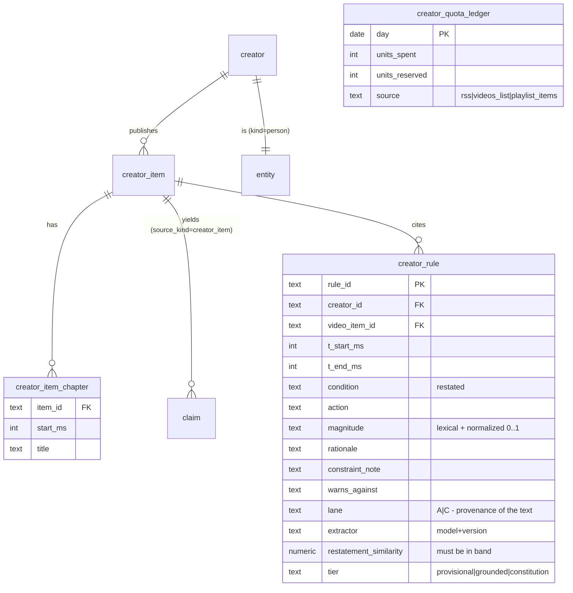

# CONSULT PACKET — SwanGuard Creator Brain (daily transcript → per-creator brain)

You are consulting as a **senior distributed-systems architect** and a **hostile
reviewer of long-running ingestion pipelines**. Be adversarial. The plan below is
already signed by the owner — do not relitigate the legal decision (§1.5); attack
the ENGINEERING and find what is missing.

---

## Context you need

**Who:** Sean — solo owner, runs SwanStudios (production personal-training SaaS) and
SwanGuard (his private news + creator intelligence hub, separate repo). One person,
one instance, no team.

**Hardware:** Windows desktop, RTX 5090 (32GB). Local ComfyUI already runs on it for
image/video generation and is used regularly. A local Qwen3 model also runs there.
Postgres in Docker for SwanGuard dev; Render for SwanStudios production.

**What he wants, verbatim:** *"SwanGuard needs to be able to go in and get transcripts
to different creators that I already have. It needs to be able to do it every day to
check to see if there's a new video, get that transcript created, and then after that,
save that information into the database for the brain based on that creator."*

He wants **one brain per creator**, built from everything that creator has said on
YouTube, kept current as they publish. Then those brains feed a private "Karpathy
Wiki" style vault (`~/hermes2/brain-vault` in WSL, ~4,400 docs, searched by a CLI and
by his Telegram agent "Hermes"). He wants to build many such brains — the immediate
driver is a **professional-photographer brain** distilled from top retouching and
color-grading channels, to power an auto-editing app.

**Current live state of SwanGuard (verified):** 51 creators in the catalog, ALL
disabled. `creator_item` = 0 rows. No connector has ever been owner-enabled. The wiki
generator (`intelligenceWiki.ts`) exists and emits Obsidian-shaped pages with
frontmatter + citations + wikilinks, and has never been fed. The repo's documented
pattern for its own failures: *"machinery shipped, feeding never wired."*

**Existing law in that repo that matters:** every creator is born disabled; `enabled`
flips through exactly one route (`enable_creator(id,'owner',reason)`) enforced by a DB
trigger requiring an owner-attributed audit event in the same transaction. Upsert rule:
for owner-owned data, never write a column the owner could have changed since the
source file was authored. Ingest law: "fetched nothing" and "could not fetch" must
never look the same — refusal throws, it does not return a clean zero.

---

## The plan under review

Two documents follow. The first is the blueprint; the second is the signed decision
record that amends it. Read both as one plan.

---
decision: "Creator Brain — per-creator cited rule/claim ledgers feeding the WikiBrain and Sean's brain-vault, updated on a quota-safe cadence; a creator brain is derived claims with timestamped citations, never a transcript archive; the Data API cannot fetch third-party transcripts, so acquisition splits into three signed lanes"
status: open
supersedes: none
---

# Swan Guard — Creator Brain Blueprint (Fable 5.1, 2026-09-02)

> **Who this is for.** The next agent building in this repo after the Feed Build Blueprint's
> S0–S7 land. Every decision below is made. A slice that would need a question is a defect
> against this document — file it, do not guess.
>
> **Position in the program.** Slots **after** `SWANGUARD-FEED-BUILD-BLUEPRINT-2026-09-02.md`
> S7 and **after** doc 267's N2 → W0 → W1 → W2. It reuses that machinery; it does not fork it.
> Numbered **CB0–CB6** so it never collides with S-numbers or W-numbers. Nothing here touches
> the F3 files another agent has uncommitted in this tree today (`feedAssembler*`,
> `feedRoutes*`).
>
> **Origin.** Sean, 2026-09-02, while building a photographer-brain in SS-PT: *"build a brain
> of each individual creator from all their transcripts using my YouTube API, feed each into my
> private Karpathy WikiBrain, keep them updated as new videos come out, within YouTube's
> limits — SwanGuard should do this."* Full hostile review of the surrounding work lives in
> SS-PT: `docs/ai-workflow/AI-HANDOFF/PHOTOGRAPHER-BRAIN-FABLE-HOSTILE-REVIEW-2026-09-02.md` §2.

---

## 0. The three facts that shape everything

1. **The YouTube Data API does not return transcripts of videos you do not own.** `[VERIFIED]`
   `captions.download` needs OAuth with authority to *edit the video*. An API key returns
   uploads, `snippet` metadata, statistics, comments — never third-party caption text. Phase
   131 already says this (§"Transcript Acquisition Boundary"). The plan "use my API to get all
   the transcripts" cannot be built as stated.
2. **What does return transcripts is yt-dlp — which this repo forbids.** `[VERIFIED]`
   `creatorFetch.ts:8`: *no bodies, no transcripts, no captions — law 4*. SS-PT's
   `swan-scout` uses yt-dlp today and holds 17 cached transcripts. Two repos, one owner, two
   acquisition laws. This document does not merge them; it names them as lanes (§2).
3. **The WikiBrain already has a creator lane and it has never been fed.** `[VERIFIED]`
   Doc 267 §5: `claim.source_kind IN ('news_item','creator_item','inbound')`.
   `intelligenceWiki.ts` emits Obsidian-shaped pages. `creator` = 51 rows, `creator_item` = 0.
   Same pattern doc 267 §0 named — *machinery shipped, feeding never wired.* Every slice below
   is judged on **rows produced**.

---

## 1. The ruling

> **A creator brain is a ledger of restated rules and claims, per creator, each with a
> timestamped citation to the original video. The transcript — when one is lawfully in hand —
> is a transient input to the extractor, not a durable record.**

Why this is the product and not a concession:

- **Legal.** Full transcripts of thousands of videos is a reproduction archive of copyrighted
  spoken work. Doc 267 §4's restatement band transfers verbatim: similarity to source
  **≥ ~0.85 → reproduction, reject; ≤ ~0.25 → ungrounded, reject; in band → accept.**
- **Useful.** *"Creator X says never blur the tear-trough crease — 14:22, watch it"* with a
  link that sends the viewer to the creator's own video beats 55 minutes of text, and it is
  Phase 131's creator-support principle made real (attribution · **Watch on YouTube** ·
  traffic *to* the creator · no manufactured watch time).
- **Already built.** Entity page (doc 267 §7.3) = the per-creator brain. Claims timeline =
  what they said, when. Clusters across creators = where experts disagree — and for a taste
  domain, **disagreement is the signal**: it maps the style axes (SS-PT synthesis §6).

---

## 2. Acquisition lanes — Sean signs one row, the code enforces it

| Lane | Runs where | Gets text from | Durable store | Law |
|---|---|---|---|---|
| **A — Product** | SwanGuard, continuous | YouTube RSS (S4, keyless) for discovery · Data API `videos.list` for **new ids only** · `snippet.description`, chapters parsed from it, `snippet.tags` · creator-**authorized** transcripts (131B/131D) | metadata + restated claims + citations | official only; **default and only lane this repo runs** |
| **B — Personal research** | SS-PT, Sean's machine | yt-dlp via `swan-scout`, budgeted | gitignored local cache only | unofficial; Sean's personal exposure; **never a product path, never served, never in git** |
| **C — Bridge** | B → A | none | **derived rules only** — `{condition, action, magnitude, rationale, constraint, warns_against, video_id, t_start_ms, t_end_ms}` — restatement band enforced on import | what a person could have written in a notebook while watching |

**CB0 is Sean signing this table.** Until signed, Lane A is the whole system and it is already
enough to produce rows (§4, CB1).

**Descriptions and chapters are the underrated Lane-A text.** Creators put their own summaries,
chapter timestamps, and key claims in `snippet.description`. It is API metadata, it is theirs
to publish, and it is exactly the shape the extractor wants. CB1 harvests it before any
transcript question is even asked.

---

## 3. Cadence — reasonable by construction, not by promise

51 creators × ~2 units per Data API pass ≈ 100 units. A 15-minute pass cadence = 9,600
units/day — **at the 10,000 ceiling before enrichment.** That is the pattern Sean rejected.

```
every 15 min   RSS poll (S4, keyless, 0 quota)      → new video ids
on new ids     videos.list (1 unit / ≤50 ids)       → snippet, duration, live state
on new items   extractor over title+description+chapters (Lane A)
if Lane B      SS-PT budget ≤ N/hour, backoff on 429, kill switch — never from SwanGuard
```

Quota is a **ledger** (`creator_quota_ledger`: date, units_spent, units_reserved, source),
enforced at the runner (the `createSingleFlightIngestRunner` layer — "a guard at layer N
protects N+1"), with a hard daily cap the owner sets **below** 10,000. `[VERIFIED]` the
existing runner already refuses concurrent runs and already fixes `itemsPerCreator` at
construction; CB5 adds the spend ledger it explicitly says it lacks (*"a limit on packets, not
on spend"*).

---

## 4. Slices — each judged on rows

| Slice | Produces | Depends on | Size | Done when |
|---|---|---|---|---|
| **CB0** Lane decision | a signed `docs/` record; no code | — | XS | Sean's signature on §2's table, or "Lane A only" |
| **CB1** Description / chapter / tag harvest | `creator_item.description`, `creator_item_chapter` rows, `tags[]` | S4 or Data API key | S | `POST /api/creators/ingest` on 1 enabled creator → ≥1 item with non-empty description; chapters parsed from `MM:SS` lines; allowlisted fields only (extend `allowlistYouTubeItem`, doc 243) |
| **CB2** Creator claim extraction | `claim` rows, `source_kind='creator_item'` | W1 extractor, CB1 | M | ≥ 50 claims from ≥ 10 real items; **manual read of 20** for restatement band + accuracy; every claim carries `extractor` + `source_item_id` |
| **CB3** Creator entity + brain page | `entity` rows (`kind='person'`, one per creator) · entity page renders | W0, W2, CB2 | M | `GET /api/intelligence-wiki/packet` returns a page per fed creator with citations resolving to `youtube.com/watch?v=…&t=` |
| **CB4** Authorized text + Lane-C rule import | `creator_transcript_documents` (131B) · `creator_rule` rows from a rules JSON | CB0 signed, CB2 | M | paste/upload path stores hash + segments under recorded authority; rules JSON import **rejects** any entry whose text fails the restatement band; raw transcript text never appears in a `claim` or page |
| **CB5** Quota ledger + per-creator cadence | `creator_quota_ledger` rows · per-creator `cadence` honoured | S5 poller | S | a simulated day at 15-min RSS + new-id-only enrichment spends < 500 units in the ledger; hard cap trips → run refuses with reason, not a clean zero |
| **CB6** Export to brain-vault | `creator-brains` collection in `~/hermes2/brain-vault` | CB3, W6 | S | `node scripts/swan-brain.mjs -c creator-brains "<topic>"` (SS-PT) returns a hit citing a SwanGuard entity page; the write is done by the vault's owning tooling, not by SwanGuard |

**Order:** CB0 → CB1 → CB2 → CB3 → CB5, then CB4 and CB6. CB1 alone turns `creator_item` from
0 rows to rows on a law-clean path; that is the same move N1/F0 made and the reason it is first.

---

## 5. Schema — additions only (extends doc 267 §5)



- `creator_rule.lane` is the provenance that keeps Lane C honest: a rule born from Lane B text
  is marked `C` forever; a report may show it, a page may cite it, nothing may ever surface the
  text behind it.
- `creator_rule.tier` mirrors the SS-PT extraction schema: rules enter `provisional`, become
  `grounded` only after an eval against real inputs, and `constitution` only with ≥ 3
  independent creators agreeing — never averaged (doc 267 §3 logic, applied to taste).
- Idempotency: `unique (video_item_id, t_start_ms, action)` on `creator_rule`;
  `unique (item_id, start_ms)` on `creator_item_chapter`. Re-runs converge.

---

## 6. Controls carried from Phase 131 — unchanged, restated so nobody re-litigates

- per-creator enable/disable and cadence; every creator born disabled (the trigger law)
- model-call kill switch; quota hard cap **below** provider ceiling
- Made-for-Kids handling before any embedded player
- no background / hidden / looping / autoplay playback; app-local watch receipts ≠ YouTube views
- the AI never claims it *watched* a video — states are `transcript analyzed` / `description
  analyzed` / `video opened by user`
- deletion cascades: transcript document → segments → rules → page citations
- taint boundary (doc 267 §4.5.2): creator text is attacker-influenced input; rules are served
  read-only and labelled untrusted-source; never an instruction to a tool-calling agent

---

## 7. Hostile review questions for the slice that closes this

- Can a nominated channel be mistaken for permission to store its full captions? *(131)*
- Can any path in this repo invoke yt-dlp or a timed-text endpoint? **grep, do not assume.**
- Can a Lane-C rule import smuggle transcript text past the restatement band (e.g. by
  chunking)? Test with a 60-word verbatim chunk.
- Does the quota ledger survive a process restart mid-day, or does it reset to zero and
  double-spend?
- Can a page render a `creator_rule` whose `video_item_id` was deleted, leaving a citation to
  nothing?
- Does a corrected/retracted video (creator re-uploads) supersede or duplicate its rules?
  *(doc 267 correction model applies.)*

---

## 8. Handoff state (verified 2026-09-02 at write time)

- SwanGuard-Newsroom `merge/newsroom-mainline-v3` @ `f4f3f93`; F3 work (`feedAssembler*`,
  `feedRoutes*`) **uncommitted by another agent — do not touch.**
- `creator` 51 · `creator_item` 0 · no connector ever owner-enabled.
- SS-PT `.ai-workflow/scout-cache`: 17 yt-dlp transcripts, 2.1 MB, gitignored — Lane B
  material, pending CB0.
- This document is **not** in the slice registry yet. The agent that lands CB1 adds the
  registry row; CB0 is Sean's, not an agent's.

## Sources

- [YouTube API Services — Developer Policies](https://developers.google.com/youtube/terms/developer-policies)
- [Captions: download — YouTube Data API](https://developers.google.com/youtube/v3/docs/captions/download)

---

---
decision: "CB0 SIGNED — Sean authorizes SwanGuard to fetch creator transcripts daily (timed-text via yt-dlp, local Whisper fallback), store them per creator, and build the brain from them; supersedes Phase 131's official-only acquisition order for this single owner; OAuth subscriptions.list becomes the creator catalog"
status: shipped
supersedes: none
---

# SwanGuard Creator Brain — CB0 Decision Record (signed 2026-09-02)

> **Where this belongs.** This is §1.5 of
> `SwanGuard-Newsroom/docs/SWANGUARD-CREATOR-BRAIN-BLUEPRINT-2026-09-02.md`. It is filed here in
> SS-PT because the session that wrote it was denied write access to the SwanGuard tree after
> the blueprint landed. **The next agent in SwanGuard pastes this section into the blueprint
> verbatim and deletes this note.** Until then this file is canonical for CB0.

## The signature

Sean, 2026-09-02, verbatim intent:

> *"SwanGuard needs to be able to go in and get transcripts to different creators that I
> already have. It needs to be able to do it every day to check to see if there's a new video,
> get that transcript created, and then after that, save that information into the database for
> the brain based on that creator. I just want you to confirm and make sure that we're planning
> that."*

Confirmed. Planned. Recorded as a decision, not an exception.

## The ruling

**Transcript acquisition is authorized inside SwanGuard** for single-owner private use, on the
mechanism every consumer transcript app uses:

1. **YouTube timed-text track** via `yt-dlp --write-auto-sub --sub-format json3 --skip-download`
   — no media download, one request per video. SS-PT's `scripts/swan-scout/yt-scout-transcript.mjs`
   already parses this format (json3 → cues, rolling-duplicate suppression); **port it, do not
   rewrite it.**
2. **Local Whisper fallback** (faster-whisper on the owner's 5090) when a video carries no
   track: `yt-dlp -x` audio only → transcribe → same segment shape. Audio is deleted after
   transcription; only text and timings persist.
3. Creator-authorized or owner-pasted transcripts (Phase 131B) remain valid inputs with a
   higher `authority_type`.

**Superseded:** Phase 131 §"Transcript Acquisition Boundary" ordering (authorized feed →
creator file → manual paste → browser review → none) and its implied "no transcript unless
licensed." **Not superseded:** every Phase 131 *control* — per-creator enable/cadence, kill
switch, quota/retention limits, deletion cascade, no artificial playback, the AI never claims
it *watched*.

**Code that must change in the same commit as CB4:** the `creatorFetch.ts:8` header
(*"no transcripts, no captions — law 4"*) and doc 00's *"Official APIs only; no scraping"*
row for Creator Board. A comment or table that contradicts a signed decision is a defect.

## What the owner accepts by signing

This is unofficial access under YouTube's **platform** terms (automated-access clause), not
the **API** terms. The exposure sits with the owner's account. It is bounded by scope —
private, single-owner, rate-limited with backoff, never redistributed, never a public surface,
never served to anyone but the owner — which is the same posture as the copyrighted books in
`brain-vault`. It is not a licence to expose transcript text through any shared surface. The
derived-rules bridge (Lane C, restatement band) is still what crosses into anything shared or
into the vault's `creator-brains` collection.

## What the OAuth client is for — and is not

The Desktop OAuth credential on the owner's GCP project (the one the ChatGPT/Codex session was
configuring for the subscription migrator; scope `youtube.readonly` suffices) unlocks
**`subscriptions.list` (mine=true)** — 1 unit per 50 channels. **The owner's real subscription
list becomes the creator catalog**, synced daily (new slice **CB1b**). This replaces
hand-seeding 51 rows and answers "creators I already have" literally.

It does **not** unlock third-party captions. `captions.download` requires authority to edit the
video, regardless of scope — verified against the API reference. No OAuth configuration changes
this; the transcript path above is the only one that returns text.

Secrets: `client_secret.json` and the refresh token live in `%LOCALAPPDATA%\SwanGuard\` beside
the owner hash. Never in the repo, never in `.env`, never on a child process command line (the
H9 lesson from the owner-door review applies verbatim).

## Revised slices (replaces §4 rows CB1/CB4/CB5; others unchanged)

| Slice | Produces | Depends on | Done when |
|---|---|---|---|
| **CB1** Description / chapter / tag harvest | `creator_item.description`, `creator_item_chapter`, `tags[]` | S4 or Data API key | ≥1 item with non-empty description on 1 enabled creator; chapters parsed; allowlist extended |
| **CB1b** OAuth subscription sync | `creator` rows from `subscriptions.list`; existing rows matched by `platform_channel_id`, **never re-enabled** (the upsert rule from F0) | OAuth desktop client in `%LOCALAPPDATA%` | daily run inserts new subscriptions **disabled**; a channel the owner unsubscribed is marked `lifecycle='unsubscribed'`, not deleted; enabled set untouched |
| **CB4** Daily transcript fetch → vault | `creator_transcript_documents` + `creator_transcript_segments` (Phase 131 schema, `authority_type='owner_private'`), `content_hash` dedupe | CB0 (this), S5 poller, ported json3 parser | for 1 enabled creator with a new video since yesterday: RSS detects it → timed-text fetched → segments stored with `start_ms/end_ms` → re-run inserts nothing (hash); a video with no track routes to Whisper and stores `transcript_format='whisper-local'`; a 429 backs off and the run reports `deferred`, not `clean` |
| **CB4b** Extractor over transcript | `creator_rule` / `claim` rows with `lane='B'`, timestamp citations | CB4, W1 | ≥50 rules from ≥10 transcripts; 20-rule manual read for restatement band; **no `claim.assertion` or page ever contains a transcript sentence verbatim** (similarity ≥0.85 rejected) |
| **CB5** Quota + fetch ledger, per-creator cadence | `creator_quota_ledger` (API units) **and** `creator_fetch_ledger` (timed-text requests/hour, Whisper minutes/day) | S5 | a simulated day: RSS discovery + `videos.list` on new ids + ≤ N transcripts/hour spends < 500 API units and never exceeds the fetch budget; a tripped cap **refuses with reason**, never a clean zero |

**Order:** CB1 → CB1b → CB5 → CB4 → CB4b → CB3 → CB6. The ledger lands *before* the fetcher
so the first daily run is bounded from its first minute.

## Cadence — "every day," bounded by construction

```
daily 06:30   subscriptions.list  (OAuth, ~2 units)          → catalog delta
every 15 min  RSS per enabled creator (keyless, 0 units)     → new video ids
on new ids    videos.list (1 unit / ≤50 ids)                 → metadata, duration, kids flag
on new ids    timed-text fetch, ≤ N/hour, jittered, backoff  → segments
no track      Whisper local, ≤ M minutes/day                 → segments
on segments   extractor → rules/claims → entity page          → the brain
```

The owner sets N and M. Defaults: N = 20/hour, M = 120 min/day. Both are ledger columns with
kill switches, not constants in code.

## Hostile-review questions added by this decision

- Can the timed-text fetcher be pointed at a video outside the enabled creator set (a URL from
  a request body)? It must only ever take ids the RSS/API discovery produced.
- Does a 429 or a shape change in json3 fail *closed* (deferred, reported) or fail *silent*
  (empty segments stored as a clean run)?
- Can transcript text reach `intelligenceWiki.ts` output, a Hermes packet, or the
  `creator-brains` vault collection by any path other than the restatement-banded rule?
  **grep the render paths, do not assume.**
- Is the Whisper audio file deleted on every exit path, including a crash mid-transcription?
- Does CB1b's upsert exclude `enabled`, `lifecycle`, and per-creator tuning from `DO UPDATE SET`?
  (The F0 rule: *could the owner have changed this since the source was authored?*)

---

# YOUR REVIEW

Answer every section. Be specific — name tables, columns, commands, failure traces,
numbers. Mark anything you are unsure of `[UNSURE]` rather than inventing it.

## Q1 — What breaks first in production?
This runs unattended, daily, for years, on one machine owned by one person who is not
watching it. Name the failure that arrives first and the one that arrives worst.
Consider at minimum: yt-dlp breaking when YouTube changes format (historically every
few months), a creator deleting or re-uploading a video, non-English creators,
members-only / age-gated / private / live videos, Shorts, a 6-hour podcast, and what
happens on the day Sean's IP gets rate-limited or soft-blocked.

## Q2 — The economics nobody costed
- **Extraction cost.** A 1-hour video ≈ 10k tokens of transcript. 51 creators, daily.
  What does the extractor actually cost per day — in cloud tokens, or in 5090-hours
  if run locally on Qwen? Show the arithmetic. Is it viable?
- **GPU contention.** The 5090 already runs ComfyUI. Whisper fallback and a local
  extractor both want it. What is the scheduling model? What happens when Sean is
  generating images and the daily ingest fires?
- **Storage growth.** Transcripts + segments for 51 creators × daily × N years. Give
  a real number and a retention policy.
- **Backfill.** Going-forward-only is cheap. But a photographer brain is worthless
  without the creator's back catalog — 700+ videos for some channels. What is the
  one-time backfill cost and how should it be sequenced?

## Q3 — Is the schema right for the actual question?
The retrieval use case is: *"what does this creator say about tear troughs / white
balance / shadow lift?"* — asked by an editing app, and by an agent through the vault.
Does the proposed schema (`creator_transcript_documents` → `segments` →
`creator_rule` → `entity` page → vault export) answer that well? What is missing?
Attack specifically:
- Is `creator_rule` the right grain, or is it over-structured for what transcripts
  actually contain?
- The restatement similarity band (≥0.85 = reproduction, ≤0.25 = ungrounded) was
  designed for NEWS claims. Does it survive contact with **taste/technique** rules?
- How does a rule that a creator later contradicts (they changed their mind in 2026)
  get superseded rather than duplicated?
- Deterministic search vs embeddings: the repo has a standing anti-RAG rule with a
  re-open gate. Does THIS use case (semantic questions over technique) force
  embeddings, and if so, say so plainly.

## Q4 — Missing slices
The plan is CB1 → CB1b → CB5 → CB4 → CB4b → CB3 → CB6. What slice is missing
entirely? What is in the wrong order? What is over-built for a v1 and should be cut?

## Q5 — Upgrades and enhancements
This is the section Sean asked for. What would make this materially better that is
NOT in the plan? Rank by value-per-effort. Consider: what the transcript enables
beyond rule extraction; how "one brain per creator" could become more than a search
index; cross-creator synthesis; what a daily digest should look like; how the
photographer-brain use case specifically should shape the design; anything the
consumer transcript apps (Recall, Eightify, NoteGPT class) do well that this misses.

## Q6 — The three ways this ends up abandoned
Be brutal. For each: the month-1 warning sign.

## Output format
```
## VERDICT (3-5 sentences)
## Q1 WHAT BREAKS FIRST
## Q2 ECONOMICS  (with arithmetic)
## Q3 SCHEMA FITNESS
## Q4 MISSING / MISORDERED / OVER-BUILT SLICES
## Q5 UPGRADES AND ENHANCEMENTS (ranked)
## Q6 THREE WAYS THIS DIES
## THE ONE THING I WOULD CHANGE
```
Prefer tables and numbers over prose. Do not pad.
