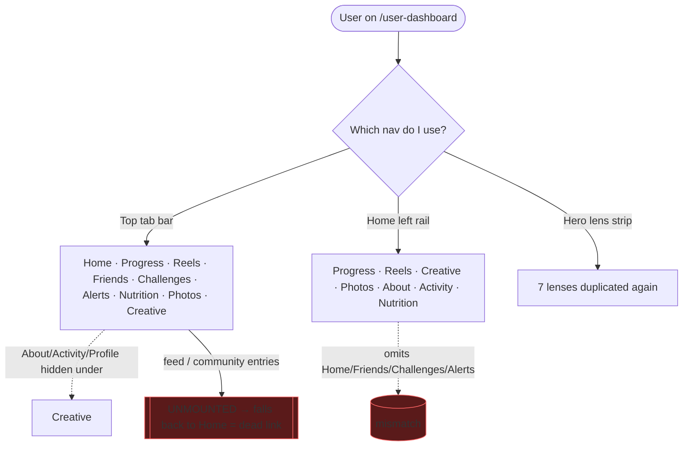

# User Dashboard / Social Dashboard — Redesign Blueprint

**Status:** BLUEPRINT COMPLETE — GPT Pro + free brain (Claude+Gemini Pro) + 15-brain Village all in; interactive mockup published; awaiting Sean's go on Phase 0 build.
**Interactive mockup (Apex Home v1):** published Artifact — Crystalline Swan, live Aurora Bloom on "Simulate workout save." (Mockup uses system-font fallback + emoji UI glyphs; production uses real Swan faces + icon set + transform/opacity ring animation per §4b.)
**Owner / Final Decider:** Sean (final orchestrator on every gate)
**Date opened:** 2026-07-08
> ⚠️ **STALE-BASE CAVEAT (2026-07-08):** All repo grounding, file:line refs, and the Canonical Surface Receipt (§9.5) in this doc were captured against local branch `wip/comms-notifications-2026-07-05` (base `d7e501559`), which was later found to be **287 commits BEHIND production `origin/main` (`8f4ebe6cf`)**. The strategic findings (GPT Pro corrections, free-brain + Village verdicts, target IA, wireframes, build order) are base-independent and hold. The **specific file:line receipts must be RE-VERIFIED against current `main`** before Phase 0 code, and the Apex build must be based off current `main`, not this stale branch.

**Trigger:** Sean commissioned a hostile repo-backed review (GPT Team Pro) of the User/social dashboard, then directed: free brain (triangle) first -> paid 15-brain Village (with permission) -> full deliverables (wireframes, IA, blueprint, Mermaid diagrams, build order). UX must be award-winning; any Fable/GLM/Gemini-flagged upgrade may proceed if it stays beautiful + consistent with the rest of the site, else flag "rest of site must follow."

---

## 0. Process & Gates (Sean rules on each)

| Gate | Tool | Status |
|---|---|---|
| Ground in real code | Explore mapper (file:line) | ✅ done |
| Free brain | Tier-2 triangle (Claude+Codex+Gemini), `scripts/fusion-triangle.mjs`, run-id `userdash-redesign-2026-07-08` | 🟡 running |
| Paid brain | 15-brain AI Village (`scripts/validation-orchestrator.mjs`) | ⛔ AWAITING SEAN'S EXPLICIT YES (Rule 16, spend-gated) |
| Deliverables | wireframes + IA + Mermaid + phased build order | ⬜ after brains |
| Build | swan-design-router -> build -> closeout-evidence-lock | ⬜ |

---

## 1. Canonical Surface Map (repo-verified — Rule 26)

- **Shell:** `frontend/src/components/UserDashboard/UserDashboard.V3.tsx` (canonical; `index.ts:5` re-exports). Mounted `main-routes.tsx:712` (`/user-dashboard`) + `:722` (`/user-dashboard/:tab`), URL-driven tabs, unknown->home.
- **Hero:** `ObservatoryCoverHero` — full-width on EVERY tab incl. Home (`V3.tsx:101`). Default **320px** (`profileBannerComposition.ts:59`), not sticky.
- **Two-branch render:** Home = bare tab bar + `UserDashboardTabsV3` (`V3.tsx:116-143`); every OTHER tab = wrapped in `ObservatoryShell` + `UserDashboardSidebarV3` in a `ContentGrid` (`:144-187`). Home is structurally different from the rest of the dashboard.

### Three disagreeing navs (root of the "nav maze")
1. **Top tab bar** (`UserDashboardTabBarV3.tsx:34-44`) — Home, Progress, Reels, Friends, Challenges, Alerts(`notifications`), Nutrition, Photos, Creative. About/Activity/Profile fold under "Creative" (`STUDIO_TAB_IDS`).
2. **Home left rail** (`HomeTabVision.data.ts:33-41`) — Progress, Reels, Creative, Photos, About, Activity, Nutrition. Omits Home/Friends/Challenges/Alerts; surfaces About+Activity as first-class.
3. **HERO_LENSES strip** (`HomeTabVision.data.ts:43-51`) — duplicates the same 7 lenses a third time in the center column.
- Union also has `feed` + `community` — both UNMOUNTED (fall back to home).

### Home composition
- **Center** (`HomeTabVisionCenter.tsx`): utility topbar+XP pill, lens strip, Latest Drop spotlight, Quick Post composer (moods Auto tag/Training/Progress photo/Win + smart-hashtag preview), quick stats ticker, support panels (`HomeTabTrainingProof`, `DailyHealthLoop`, `SwanCoachDock`+`ActionLauncher`), community feed, media input, search panel.
- **Right rail** (`HomeTabVisionRightRail.tsx`): Next Best Action, Live Activity, Active Challenge, Badges+Leaderboard, Faction panel, Trending Tags, Weekly Momentum ring, Transformation before/after — 8 stacked widgets.

### Feed + enrichment
- `useSocialFeed.ts:116` → `/api/social/posts/feed?limit=10&offset=N`. **No hashtag/category param on Home.** `getPostsByHashtag` helper exists (`:482`) but is not wired into Home.
- Enrichment (`useFeedEnrichment.ts`) → `/api/social/feed-enrichment`. Sources = **NASA-APOD / iNaturalist / Quotable / swan-curated** (NOT Smithsonian/NPS/Wikimedia). Inserted after **every 3rd** post (`HomeCommunityFeed.tsx:170-171`).

### Hashtag system (strong backend / weak product)
- Backend: `Hashtag` / `PostHashtag` / `UserHashtagFollow` models; routes trending/search/following/suggestions/`/:slug`/follow/unfollow; posts.mjs supports `?hashtag` + `?category`; hashtags linked **after** post commit (a tag failure can't kill the post).
- Product gaps: hashtags **NOT clickable** in `PostCard` (`PostContent.tsx:172` plain text); `FeedFilterBar` mounted in `ClientCommunityPage`, not Home; `DEFAULT_HASHTAGS=['#SwanStudios','#SwanProgress']` auto-appended (trending-poison risk).
- Trust wound: 2026-06 prod incident — missing hashtag tables silently rolled back hashtagged posts (repair migration `20260611000002`). Fixed.

### Photos/Creative/Profile split
- Photos + Creative = first-class top-bar tabs. About/Activity/Profile = first-class routes but folded under "Creative" in the top bar (and About/Activity ALSO appear standalone in the Home left rail → the nav disagreement).

---

## 2. GPT Team Pro thesis (condensed) + repo corrections

**Thesis:** "Beautiful spaceship control panel that forgot the user came to have fun. Over-designed, under-looped." Target loop: open → see what SwanFam did → react/challenge → post proof → earn XP/streak/badge → return tomorrow.

**Repo corrections to GPT Pro's specifics:**
- Enrichment sources: NASA-APOD/iNaturalist/Quotable/swan-curated, not Smithsonian/NPS/Wikimedia.
- Cadence: every 3rd post, no dedicated top card.
- Top tab bar does NOT duplicate Home/Feed; the real problem is **3 parallel navs** (top bar vs left rail vs hero-lenses).

**GPT Pro's 10 fixes (verdicts pending free brain + Sean):** hero→action header; single primary nav; 3-lane Home; template Quick Post; remove enrichment from main feed; hashtags as real product (clickable + tag pages + followed shelf + wire filters); merge Photos/Creative/About/Activity into Profile/Studio; friend-first lane; unify gamification into one mission board with consequences; Reels duet/remix/challenge-response.

---

## 3. Free-brain synthesis

> **Honesty note:** the automated triangle only returned 1 brain — Gemini's headless CLI (flash) timed out at 180s and Codex didn't join the board (`synthesized=false`). Recovered by running a real **Gemini 3.1 Pro** pass via `consult-gemini.mjs` (below) so this is a genuine ≥2-brain free brain (Claude + Gemini Pro; Codex optional).

### 3a. Claude (repo-grounded, independent)
**Core stance: take GPT Pro's SUBTRACTION, reject its RE-CENTERING.** GPT Pro's fixes are ~80% right as clutter-reduction, ~20% dangerous as a reframe of what the product is for.

**Verdicts on GPT Pro's 10 fixes:** KEEP #4 (template Quick Post), #5 (remove enrichment), #6 (hashtags as product), #7 (merge Photos/Creative/About/Activity→Profile), #9 (unify gamification→mission board). MODIFY #1 (hero→**progress-first** action header, not generic social bar), #2 (one nav yes, but Progress must be #2 not 5th), #3 (top lane = Progress/next-action, not For-You social), #8 (friends = *a* lane not *the* frame), #10 (keep challenge/form-check response, **defer** duet/remix as pre-launch scope creep).

**ONE core loop:** Open Home → see live streak + the single next workout the plan/coach wants → log it (or react to a SwanFam proof) → progress ring ticks up + fires a shareable milestone → return tomorrow to keep the streak alive. *Progress = payoff surface, social = amplifier.*

**Target nav — delete the 2 shadow navs (Home left rail + HERO_LENSES) + unmounted feed/community; ONE top bar of 6:**
`Home | Progress | Community | Challenges | Coach | Profile`
- Home = action header + streak + light unified feed · Progress (#2, the wedge) = logs+Victory charts+measurements+**Nutrition sub** · Community = feed + **Reels sub** + **Friends/SwanFam sub** · Challenges = unified mission board (XP/streak/badges/faction/party) · **Coach = PROMOTED to first-class** (the trainer-led differentiator GPT Pro missed) · Profile = Studio (About+Activity+Photos+Creative) · Alerts → header bell, not a tab.
- Sharp disagreement with GPT Pro: **Reels top-level + Coach absent is backwards** for a trainer-led product. Coach earns a tab; Reels earns a sub-tab.

**Phase-1 kill-clutter (value order):** 1) collapse to one nav; 2) gut right rail 8→2 (mission/next-action card + "SwanFam active now"); 3) compact hero→progress-first action header; 4) remove enrichment interleaving; 5) wire hashtags (clickable in `PostContent.tsx:172` + FeedFilterBar on Home + `?hashtag`/`?category` to `useSocialFeed` + kill `DEFAULT_HASHTAGS` auto-append); 6) template Quick Post. *Moves 1-3 are pure subtraction, ~80% of the cure, near-zero data risk.*

**Biggest risk of following GPT Pro blindly:** reordering Home into a friend-first "For-You" feed with Progress at 5th structurally converts a coaching product into a generic dopamine feed — buries the first-party progress record that IS the wedge, and picks a fight with IG/TikTok it cannot win (Rule 62 violation).

**Signature moment "Progress Aurora":** on workout save, compact hero blooms ~1.2s — Crystalline Swan silhouette exhales an aurora (Ice Wing #60C0F0 → Wing Purple #8B5CF6) along a progress ring filling to the new streak/PR, a Gilded Fern #C6A84B gleam pings at the milestone, then exhales back to calm dark. GPU-safe (transform/opacity), reduced-motion → ring fill + gleam only. The payoff frame of the core loop made physical.

**Caveat (Rule 26):** Claude treated the file:line facts as verified and did NOT re-open the repo — every Phase-1 deletion (left rail, HERO_LENSES) needs a Canonical Surface Receipt before code.

### 3b. Gemini 3.1 Pro (Lead Design Authority)
**Concurs with Claude's strategy** ("subtract, don't re-center"; protect coaching-first; one nav) — then adds design soul:
- **Thematic IA labels (V4):** Home→**Apex**, Progress→**Ascension**, Community→**The Flock**, Challenges→**The Arena**, Coach→**The Guide**, Profile→**My Studio**. Calls it "non-negotiable." *(Flagged as Sean's decision D6 — branded vs functional labels; usability/clarity/SEO tradeoff.)*
- **Apex Header** replaces `ObservatoryCoverHero`: 160px, `position:sticky` + backdrop-blur, mesh-gradient (Royal Depth→Obsidian). Left 60% = "Today's Focus" (`Phase 2: Hypertrophy` + dynamic dual-glow CTA "Begin Leg Day"). Right 40% = **Ascension Rings** (3 concentric Apple-Fitness-style rings: Ice Wing=weekly workouts, Swan Lavender=volume, Gilded Fern=streak; streak number in Cormorant Garamond Italic center).
- **Single-column feed, `max-width:768px`, NO right rail** (goes further than Claude's 8→2 trim). Quick Post composer on Carbon; PostCard shows attached workout mini-chart (Arctic Cyan); hashtags clickable in Ice Wing.
- **"Aurora Bloom"** (refines Progress Aurora): 1.5s — dim UI 800ms, elastic ring fill `cubic-bezier(0.34,1.56,0.64,1)`, shimmer particles from ring endpoint, radial-gradient aurora pulse on `::after`, Gilded Fern gleam on milestone. Reduced-motion → ring fill + gold text only. *(⚠ suggests three.js/particles — I'm flagging that against the GPU-safe/no-heavy-lib discipline; do it in CSS/canvas, not three.js.)*
- **What both AIs missed:** (1) **Coach's Intent** — a "Guide's Note" (text/audio/15s video from the assigned trainer) pinned as the first Home item daily; injects the *why*, reinforces coaching-first. (2) **Intelligent hashtag surfacing** — suggested tags in the composer keyed to the user's current training block (`#HypertrophyPhase2`). (3) **Sonic branding** — crystalline chime on ring-complete (scope-flag, but on-brand).
- **Mobile:** bottom tab bar (Graphite + blur, active=Ice Wing), stacked Apex Header, full-width 44px CTA. Inherently mobile-first single column.

### 3c. Fused free-brain synthesis (Claude + Gemini Pro)
**CONSENSUS (high confidence, act on it):**
1. GPT Pro is right about the disease (widget landfill, 3 navs, dead hashtags, fake-community enrichment) and wrong about the cure's re-centering. **Take the subtraction, protect coaching-first.**
2. **ONE nav.** Delete Home left rail + HERO_LENSES + unmounted feed/community. Six top-level surfaces.
3. Home = a **progress-first action header** (streak + next workout + one glowing CTA) replacing the 320px decorative hero.
4. **Coach is a first-class surface** (both promote it; GPT Pro missed it entirely).
5. Kill external enrichment from the main feed; make hashtags clickable + wired + stop auto-appending branded tags.
6. Signature moment = the workout-save **Aurora/ring-fill** payoff. The loop made physical.

**DIVERGENCES (Sean decides):**
| # | Claude | Gemini | Note |
|---|--------|--------|------|
| Right rail | Gut 8→2 (keep a mission card + SwanFam-active strip) | **Delete entirely** — single column | Gemini is more radical; Claude keeps a next-action rail |
| Tab labels | Functional (Home/Progress/Community/Challenges/Coach/Profile) | **Thematic** (Apex/Ascension/Flock/Arena/Guide/Studio) | Usability/SEO vs brand narrative → **D6** |
| Signature FX | CSS aurora + ring (GPU-safe) | Adds particles, hints three.js | **Perf risk** — enforce CSS/canvas only |

**UNIQUE INSIGHTS worth banking:** Gemini's **Guide's Note** (coach intent as the #1 Home item) is the strongest single addition from either brain — it's the most coaching-first, moat-widening idea in the whole review. Gemini's **Ascension Rings** (Apple-Fitness 3-ring) is a cleaner "one mission board" than Claude's abstract card.

**BLIND SPOTS still open (neither brain fully closed):** empty/loading/error states for the new feed; how trainer content is authored/scheduled (Guide's Note needs a trainer-side surface); notification model when Alerts leaves the tab bar; accessibility of the rings (color-only encoding fails WCAG — needs labels); and the rest-of-site consistency cost of the branded labels + Apex Header (does the whole app adopt this header language?).

## 4. AI Village verdict (15-brain)
**Sean approved the spend 2026-07-08** (with cost estimate). **Label ruling: HYBRID** — thematic wordmark shown in UI (Apex/Ascension/The Flock/The Arena/The Guide/My Studio) with functional URL slug + `aria-label` + code identity underneath (routes stay `/progress`, screen-reader says "Progress"). Resolves D6.
Plan under review: `docs/ai-workflow/brainstorms/user-dashboard-redesign-PLAN-for-village-2026-07-08.md`.
**Run:** 19 brains, 10/19 validators passed, 3 debates → CONSENSUS (UX/UI GLM 5.2 ↔ Gemini 3.1 Pro, 4 rounds), 57 web sources, **cost $0.44** (under the $6 cap). Full reports: `AI-Village-Documentation/validation-prompts/latest/` (`synthesis.md` = read-first).

### 4a. Divergences RESOLVED (Opus judge + design consensus)
- **D-A Right rail → DELETE entirely.** Do NOT trim, do NOT revive. Solve the valid trainer-context need *without* the rail: Next-Action → the Apex Header CTA; SwanFam-active → a horizontal scroll atop The Flock; add a trainer-specific feed filter. (Beats Claude's "trim 8→2".)
- **D-B FX → CSS-only.** `conic-gradient` rings + `radial-gradient` bloom, animate `transform`/`opacity` only, `will-change: transform`, NEVER animate `filter: blur()` or `box-shadow`. Gradient math computed once per save, not per frame; high-freq state via CSS custom props updated through a `useRef`, not React re-renders. (three.js killed, as flagged.)
- **D-C Social lean → the "PROOF RULE".** *Feed interactions require a `WorkoutID`.* Concrete, enforceable line that keeps the feed coaching-focused instead of a generic social timeline — the single best guardrail against Rule-62 drift. **Adopt as a hard rule.**
- **D-D Scope → Phase-1 Home-only** first, gated by success metrics before expanding to the other surfaces.

### 4b. NEW CRITICAL prerequisites the Village added (gating work — build these or the redesign janks/leaks)
1. **BFF aggregate endpoint `GET /api/v1/dashboard/apex`** — one call returns rings/streak + latest Guide's Note + first 5 feed items; kills 4+ sequential round-trips. Wrap in TanStack Query/SWR stale-while-revalidate (Guide's Note cache ~1h; rings invalidate on workout-save). *CRITICAL.*
2. **Feed/media performance** — virtualize the feed (`react-window`/`react-virtuoso`); memoize `PostCard` (custom comparator so a hashtag click doesn't re-render the list); debounce FeedFilterBar 300ms; **single-player-instance video** via `IntersectionObserver` nulling off-screen `src` (prevents mobile memory crashes); WebP/WebM + `srcset` @400px. *CRITICAL/HIGH.*
3. **Accessibility (CRITICAL, not optional)** — rings = `role="progressbar"` + `aria-valuenow/max/valuetext` + visible text label/value + high-contrast border (never color-only); WCAG 2.2 **SC 2.4.13** `:focus-visible` 2px Ice-Wing outline; `scroll-padding-top` so the 160px sticky header never hides keyboard focus; `prefers-reduced-motion` on EVERY animation.
4. **Security (HIGH)** — route-level RBAC + resource-level IDOR checks on `/coach /community /challenges /progress /profile` + sub-tabs, non-trainers read-only by default; Quick Post/hashtag content sanitized server-side (DOMPurify) + CSP no-inline-scripts + hashtag char whitelist + render hashtags as plain text (not raw HTML); **Guide's Note media AES-256 at rest** + configurable retention + access limited to owning client + assigned trainer; opaque signed tokens for notification deep links.
5. **Architecture** — code-split by surface (Apex/Home + Guide's Note in main bundle for LCP; `React.lazy()` Progress/Community-Reels/Challenges); Data Provider + specialized hooks (`useWorkoutRings`, `useFeedFilter`); styles colocated `Component.styles.ts` under 300 lines; every gesture has a redundant button; 44px via hit-box padding.

### 4c. Blind spots the Village says close BEFORE shipping
Testing strategy (unit + integration + automated **axe** a11y + visual regression across themes); **18-theme contrast-validation matrix** that also lints out retired Galaxy-Swan tokens (#0a0a1a/#00FFFF/#7851A9); **feature flags + rollback** for the Phase-1 cutover; **exact success metrics** that gate expansion beyond Home; **data/preference migration** for existing users (feed history, deprecated right-rail widget data); trainer authoring flow for Guide's Note; feed empty/loading/error states.

### 4d. Longer-horizon bets (POST-Phase-1 roadmap, not now)
Voice logging (`useVoiceLogger` + 44px mic in Apex Header, offline/PWA aware); **B2B corporate wellness leaderboards** (`CorporateFaction` + employer SSO + department Victory boards — flagged as the market's top revenue driver "The Arena" currently misses); FHIR export `/api/export/fhir` in My Studio (data portability); mandatory **"AI-Assisted" badge** if an LLM ever personalizes the Guide's Note (FTC); wearable pipeline migration to Health Connect + HealthKit (Google Fit sunset 2026) if telemetry feeds the volume ring; `rewardTier` variable-reward variants on Aurora Bloom.

## 5. Wireframes (consensus-locked; right-rail zone pending Village)

### 5a. Desktop Home "Apex" (≥1280px)
```
┌───────────────────────────────────────────────────────────────────────────┐
│ [◈ Swan]  Apex · Ascension · The Flock · The Arena · The Guide · My Studio  🔔│  ← ONE nav (top), hybrid labels
├───────────────────────────────────────────────────────────────────────────┤
│ ╔═══ APEX HEADER (sticky ~160px, backdrop-blur, mesh Royal Depth→Obsidian) ═╗│
│ ║  TODAY'S FOCUS                                    ◜ Ascension Rings ◝     ║│
│ ║  Phase 2 · Hypertrophy                          ( ◉ workouts 4/5 )       ║│
│ ║  Focus: Tempo & Control                         ( ◉ volume 15,000kg )    ║│
│ ║  ▛▀▀▀▀▀▀▀▀▀▀▀▀▀▀▀▀▀▀▜                            ( ◉ streak  21🔥 )       ║│
│ ║  ▌ ▶ Begin Leg Day  ▐  ← dual-glow CTA          center: 21 (Cormorant)   ║│
│ ║  ▙▄▄▄▄▄▄▄▄▄▄▄▄▄▄▄▄▄▄▟   (Sapphire bg→Purple glow)                        ║│
│ ╚══════════════════════════════════════════════════════════════════════════╝│
│                                                                             │
│   ┌── THE GUIDE'S NOTE (pinned #1) ──────────────────────────────────┐      │
│   │ 🎧 Coach [Name]: "Today we chase tempo, not weight. 3s eccentric" │      │
│   │ [▶ 0:15 voice/video]                              — your trainer  │      │
│   └───────────────────────────────────────────────────────────────────┘      │
│                                                                             │
│   ┌── QUICK POST (template-driven) ──────────────────────────────────┐      │
│   │ [ Win ] [ Proof ] [ Progress photo ] [ Ask SwanFam ] [ Poll ]     │      │
│   │ ▢ Share today's proof…                                    [Post]  │      │
│   │ suggested: #HypertrophyPhase2  #TempoTraining  #CrystallinePR      │      │
│   └───────────────────────────────────────────────────────────────────┘      │
│                                                                             │
│   ┌── UNIFIED FEED (single column, max-width 768, centered) ─────────┐      │
│   │ ◉ Ava logged Leg Day  · [mini Victory chart · Arctic Cyan]        │      │
│   │   #LegDay #CrystallinePR ← clickable (Ice Wing)   ♥ 12   💬 3      │      │
│   │ ────────────────────────────────────────────────────────────      │      │
│   │ ◉ Coach posted a form cue …                                       │      │
│   └───────────────────────────────────────────────────────────────────┘      │
│                                                                             │
│   ⟦ NO RIGHT RAIL — Village RESOLVED (D-A: delete) ⟧                          │
│   Next-Action → lives in the Apex Header CTA.                                │
│   "3 in your Flock trained today" → horizontal scroll atop The Flock tab.    │
│   Trainer context need → a trainer-specific feed filter, NOT a revived rail. │
└───────────────────────────────────────────────────────────────────────────┘
```

### 5b. Mobile Home (320–414px)
```
┌──────────────────────────┐
│ ◈  Today's Focus     🔔  │  ← compact, sticky
│ Phase 2 · Hypertrophy    │
│   ◉◉◉  21🔥  (rings ctr)  │  ← rings stacked, ~100px
│ ▛▀▀▀▀▀▀▀▀▀▀▀▀▀▀▀▀▀▜      │
│ ▌ ▶ Begin Leg Day  ▐     │  ← full-width, 44px+
│ ▙▄▄▄▄▄▄▄▄▄▄▄▄▄▄▄▄▄▟      │
├──────────────────────────┤
│ 🎧 Guide's Note (0:15)   │
├──────────────────────────┤
│ [Win][Proof][Photo][Ask] │  ← horizontal scroll
│ ▢ Share today's proof…   │
├──────────────────────────┤
│ ◉ Ava · Leg Day          │
│   [mini chart]  ♥12 💬3   │
│ ◉ Coach · form cue       │
│         ⋮ (feed scroll)   │
├──────────────────────────┤
│ Apex Ascend Flock Arena  │  ← BOTTOM tab bar (Graphite+blur)
│  ◉    ○     ○    ○  …     │     active = Ice Wing
└──────────────────────────┘
```
_Locked: Apex Header + rings, Guide's Note #1, template Quick Post, single-column clickable-hashtag feed, bottom nav on mobile. Open: right-rail treatment (5a divergence zone) + FX richness — Village input pending._

## 6. Mermaid diagrams

### 6a. CURRENT STATE — the 3 disagreeing navs (the disease)


### 6b. TARGET IA — one nav, 6 surfaces (hybrid labels: wordmark / slug)

```mermaid
flowchart TD
    NAV[[ONE nav — top on desktop, bottom bar on mobile]]
    NAV --> A["Apex<br/>(/user-dashboard)"]
    NAV --> B["Ascension<br/>(/progress) — #2, the wedge"]
    NAV --> E["The Flock<br/>(/community)"]
    NAV --> F["The Arena<br/>(/challenges)"]
    NAV --> G["The Guide<br/>(/coach)"]
    NAV --> P["My Studio<br/>(/profile)"]

    A --> A1[Apex Header: streak + today's workout + dual-glow CTA]
    A --> A2[Guide's Note — daily trainer message, pinned #1]
    A --> A3[Single-column unified feed + template Quick Post]
    B --> B1[Workout logs · Victory charts · Measurements]
    B --> B2[Nutrition — sub-tab]
    E --> E1[Feed] --> E2[Reels — sub] --> E3[Friends/SwanFam — sub]
    F --> F1[Unified mission board: XP · streak · badges · faction · party]
    G --> G1[Swan Coach — first-class]
    P --> P1[About · Activity · Photos · Creative merged]

    BELL([🔔 Alerts → header bell, not a tab])
    DEL[/DELETED: Home left rail · HERO_LENSES · unmounted feed+community/]
    style DEL fill:#2a2a3a,stroke:#8B5CF6
```


### 6c. HOME core loop (the addictive daily flow)

```mermaid
flowchart LR
    O([Open Apex]) --> R[See live streak + the ONE next workout the plan/coach wants]
    R --> N[Read Guide's Note]
    R --> Log[Log the workout]
    R --> React[or react to a SwanFam proof]
    Log --> Bloom{{Aurora Bloom: rings fill, milestone gleam}}
    Bloom --> Share[Fire a shareable milestone → witnessed by SwanFam]
    React --> Share
    Share --> Tomorrow([Pulled back tomorrow to keep the streak alive])
    Tomorrow -.-> O
    style Bloom fill:#1a2f5a,stroke:#60C0F0
    style Share fill:#2a1a4a,stroke:#8B5CF6
```

_Nav model (6a/6b) and core loop (6c) are locked by consensus + Sean's hybrid ruling — Village may refine the right-rail treatment and build scope, not these._

## 7. Phased build order (v1 — Village may refine sequencing/effort)

> Discipline on every phase: Canonical Surface Receipt (Rule 26) before deleting/moving any live surface · route UI through `swan-design-router` (Rule 40) · 300-line cap (Rule 4) · dark-first tokens w/ fallback (Rule 6) · TDD regression where feasible · responsive matrix 320/414/768/1280/1440/2560/3840 · `closeout-evidence-lock` at each phase close. Data-truth: rings/charts from REAL logged workouts, never mock.

> **Village-resolved divergences now baked in:** D-A right rail = **DELETE** (no rail; trainer context via Apex CTA + Flock scroll + trainer filter) · D-B = **CSS-only** conic/radial FX · D-C = **PROOF RULE** (feed interaction requires a `WorkoutID`) · D-D = **Phase-1 Home-only**, metric-gated. Full detail §4a-4c.

**PHASE 0 — Receipts, guardrails & the data spine (no visible UI change).**
- Canonical Surface Receipts for the three deletions (Home left rail, HERO_LENSES, unmounted feed/community). Snapshot current tab analytics; plan data/preference migration for existing users.
- Feature-flag the redesign (`SWAN_APEX_HOME`) dark→on + a documented rollback.
- **Build the BFF aggregate `GET /api/v1/dashboard/apex`** (rings/streak + latest Guide's Note + first 5 feed items) behind RBAC + IDOR checks; TanStack Query/SWR wrapper (Village CRITICAL #1).
- Define the **success metrics** that gate expansion beyond Home, and stand up the **testing spine** (axe a11y automation + visual-regression harness + the 18-theme contrast/Galaxy-Swan-token lint).
- Adopt the **Proof Rule** at the API layer (feed interaction requires `WorkoutID`) + server-side sanitization (DOMPurify/CSP/hashtag whitelist).

**PHASE 1 — Kill the clutter (pure subtraction, ~80% of the cure, near-zero data risk).**
1. Collapse to ONE nav — delete left rail + HERO_LENSES + unmounted tab entries; nav renders only from the top bar (desktop) / bottom bar (mobile).
2. Reduce right rail per Village verdict on divergence D-A.
3. Remove external enrichment interleaving (`HomeCommunityFeed.tsx:170-171`) → coaching empty-state.
4. Kill `DEFAULT_HASHTAGS` auto-append (`postIntentInference.ts`).
_Exit: Home is calm, one nav, no dead links, no fake-community filler. Ship behind flag; QA the matrix._

**PHASE 2 — The Apex Header + Ascension Rings.** Replace the 320px `ObservatoryCoverHero` on Home with the sticky Apex Header (Today's Focus + dual-glow CTA + 3 rings). Rings sourced from real workout/streak/volume data. Accessibility: each ring has text label + value + `aria` (not color-only). Hybrid labels wired (wordmark + slug + aria).

**PHASE 3 — The Guide's Note.** Frontend pinned #1 Home slot + backend authoring surface for trainers (who writes it, scheduling, empty-state fallback when none). This is the moat move — coordinate with trainer-dashboard lane.

**PHASE 4 — Hashtags become a product.** Clickable tags in `PostContent.tsx:172`; mount `FeedFilterBar` on Home; pass `?hashtag`/`?category` to `useSocialFeed`; `/user-dashboard/tags/:slug` tag pages (reuse existing detail API); followed-tags shelf; suggested-tags in composer keyed to training block. Add regression tests so a missing hashtag table can never fake-succeed a post again.

**PHASE 5 — Template Quick Post.** Win / Proof (auto-attach latest session) / Progress photo / Ask SwanFam / Challenge / Poll.

**PHASE 6 — Consolidate surfaces.** Reels + Friends → The Flock sub-tabs; Nutrition → Ascension sub-tab; Photos/Creative/About/Activity → My Studio; Alerts → header bell + notification model (counts, deep links).

**PHASE 7 — The Arena mission board.** Unify XP/streak/badges/faction/party into one board with consequences tied to logged workouts ("one workout saves your streak").

**PHASE 8 — Coach (The Guide) first-class tab.** Promote Swan Coach dock to its own surface.

**PHASE 9 — "Aurora Bloom" signature moment.** CSS/canvas only (NO three.js). Elastic ring fill + radial-gradient aurora + Gilded Fern milestone gleam; `css` helper for any interpolated keyframes (Rule 43); reduced-motion degrade.

**PHASE 10 — Rest-of-site propagation** (see §8).

## 8. Rest-of-site consistency notes
The Apex Header language + hybrid labels + ring/mission vocabulary raise a site-wide question (blind spot flagged by both brains): **if only the User Dashboard adopts this, the app looks half-migrated.** Candidates that must follow to match the new look (or be explicitly deferred with a note):
- **Client / Trainer / Admin dashboards** — same header geometry, ring/metric language, single-nav discipline, bottom-bar mobile pattern (per Swan Card/Button Standard; client/data cards stay low-motion).
- **Global site nav** — must not visually fight the new dashboard nav (the current top site nav + dashboard nav overlap is part of the confusion).
- **PostCard everywhere** (Community, Client community page) — clickable hashtags + workout mini-chart should be universal, not Home-only.
- **Design tokens** — if the Apex mesh-gradient + ring palette become house patterns, promote them into the design system (`swan-design-router` source docs) so they're reusable, not one-off.
- **Decision for Sean:** big-bang site-wide vs dashboard-first-then-propagate. Recommend **dashboard-first behind a flag**, then a fast-follow propagation sprint — flagged here so the rest of the site is a known, scheduled follow, not a surprise mismatch.

## 9.5 PHASE 0 — Canonical Surface Receipt: the 3-nav collapse (Rule 26-31)
**Verified by direct file reads 2026-07-08 (not subagent — Rule 30).**

### Artifact 1 — Render-path proof (mount chain for each surface targeted for deletion)
```
TARGET: /user-dashboard (Home tab) — delete the two shadow navs + unmounted tab entries.

MOUNT CHAIN (proven JSX usage, not lazy-import declarations):
  UserDashboard.V3.tsx:131 (home) / :174 (other) → <UserDashboardTabsV3/>
  UserDashboardTabsV3.tsx:135 → <HomeTab/>            (lazy import :32 — JSX at :135 = proof)
  HomeTab.tsx:206 → <HomeTabVisionLeftRail/>          ← SHADOW NAV #1 (Home left rail)
  HomeTab.tsx:217 → <HomeTabVisionCenter/>
  HomeTabVisionCenter.tsx:147 → HERO_LENSES.map(...)  ← SHADOW NAV #2 (hero lens strip)

DATA SOURCES:
  LEFT_NAV_ITEMS  — HomeTabVision.data.ts:33
  HERO_LENSES     — HomeTabVision.data.ts:43

UNMOUNTED TAB ENTRIES (proven dead links):
  UserDashboardTypes.ts:113-126 USER_DASHBOARD_TAB_IDS OMITS 'feed' and 'community'
  (union has them at :83/:94; comments :107-111 confirm both fall back to home)
  V3.tsx:45-47 — unknown url tab → 'home'
```

### Artifact 2 — Surface Classification Table
| Surface | Path / File | Label | Evidence |
|---|---|---|---|
| Top tab bar (canonical nav) | `UserDashboardTabBarV3.tsx:34-44` | **canonical** | mounted V3.tsx:121/157 |
| Observatory sidebar (non-home tabs) | `UserDashboardSidebarV3` via `ObservatoryShell` | **canonical** (separate surface — NOT in delete scope) | V3.tsx:169 |
| Home left rail | `HomeTabVisionLeftRail.tsx` → `HomeTab.tsx:206` | **competing/redundant → DELETE** | live JSX HomeTab.tsx:206 |
| Hero lens strip | `HERO_LENSES` → `HomeTabVisionCenter.tsx:147` | **competing/redundant → DELETE** | live map HomeTabVisionCenter.tsx:147 |
| `feed` tab | `UserDashboardTypes.ts:83` | **dormant/dead-link → REMOVE union entry** | not in TAB_IDS :113-126 |
| `community` tab | `UserDashboardTypes.ts:94` | **dormant/dead-link → REMOVE union entry** | not in TAB_IDS :113-126 |
| `assets/.../dashboard-export/*` copies | `frontend/src/assets/user-dashboard/dashboard-export/…` | **archive (reference pack, NOT live)** | design-export path, not imported by shell |

### Artifact 3 — Schema Cross-Check: **N/A** (frontend nav deletion touches no Sequelize model/column).
### Artifact 4 — Backend Route Shadow Audit: **N/A** (no API path touched by removing frontend nav surfaces).

### 🛑 PHASE 1a STATUS — HELD (2026-07-08)
Phase 1a (remove HERO_LENSES strip) was built + verified (35/35 contract + 21/21 Home sweep + tsc 0). On commit it surfaced a **second blocker**: the Home files carry a large **uncommitted, unreviewed "Feed Focus" feature WIP** (6 new files: `HomeFeedFocus.ts/.test.ts`, `HomeFeedFocusBanner.tsx/.styles.ts`, `useHomeFeedFocusController.ts`, `useHomeFeedFocusPosts.ts` + wiring in HomeTab/HomeTabVisionCenter/contract test). A whole-file commit of my change entangled that WIP and was build-broken. Per Sean: **reset the commit** (done; recoverable at reflog `1e9ae121e`), **revert my edits** (done; tree back to Feed-Focus-WIP-only), and **HOLD Phase 1a** until the Feed Focus WIP is committed or cleared by its owner. Then re-apply the (small, fully documented) HERO_LENSES removal cleanly. **Lesson:** these Home files are an active shared work-zone — coordinate/stage explicit hunks, never whole-file, until the WIP settles.

### ⚠ BLOCKER-CLASS FINDING (must handle in the same slice)
`HomeTabVisionLeftRail` is **not pure navigation** — `HomeTab.tsx:208-212` passes it `level, points, pointsToNext, progressPercent, streakDays`, so it also renders the **Level/XP panel + Creator streak week-grid**. Deleting the left rail without re-homing that data **loses the XP/streak UI**. Mitigation: the redesign's **Ascension Rings + Apex Header already own streak/level/XP** — so Phase 2 (Apex Header) must land the rings BEFORE or WITH the left-rail deletion, or the deletion strands that data. Sequence lock: **do not delete the left rail in isolation ahead of the Apex Header rings.** (HERO_LENSES is pure nav — safe to delete alone; `HomeTabVisionCenter`'s composer/feed/support panels stay.)

## 9. Decisions — status
- ✅ D1 Nav: **6 surfaces** Apex/Ascension/The Flock/The Arena/The Guide/My Studio; Nutrition under Ascension. (consensus + Village)
- ✅ D2 Enrichment: **cut** from main feed. (unanimous)
- ✅ D3 Social lean: **Proof Rule** — feed interaction requires a `WorkoutID`. (Village)
- ✅ D4 Hero: **compact sticky Apex Header** (collapse-on-scroll at 320px). (Village)
- ✅ D5 Scope: **Phase-1 Home-only**, metric-gated before expanding. (Village)
- ✅ D6 Labels: **Hybrid** (wordmark + slug/aria). (Sean)
- ⬜ **D7 (Sean):** approve Phase 0 build start (receipts + BFF endpoint + testing spine + feature flag)?
- ⬜ **D8 (Sean):** rest-of-site propagation — dashboard-first-then-fast-follow (recommended) vs big-bang?
- ⬜ **D9 (Sean, optional):** run `copy-tournament` on the Apex CTA + Guide's-Note voice, and/or `attack-the-site` on the new social surfaces, before build?
