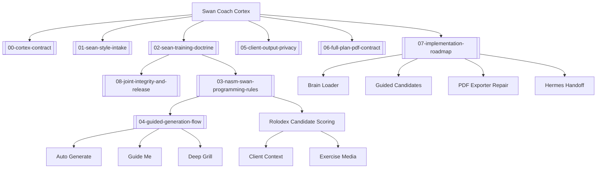

# Brain Map Diagram

Open `docs/ai-workflow/coach-brain/` as an Obsidian vault to see backlinks, the local graph, and this Mermaid diagram preview.

## Core Links

- [[00-cortex-contract]]
- [[01-sean-style-intake]]
- [[02-sean-training-doctrine]]
- [[03-nasm-swan-programming-rules]]
- [[04-guided-generation-flow]]
- [[05-client-output-privacy]]
- [[06-full-plan-pdf-contract]]
- [[07-implementation-roadmap]]
- [[08-joint-integrity-and-release]]

## System Map

## Reading Order

Start with [[00-cortex-contract]], then use [[01-sean-style-intake]] when Sean is ready to grow the doctrine. The highest-impact style note right now is [[08-joint-integrity-and-release]] because it captures Sean's emphasis on weak links, form, feet, self-myofascial release, readiness checks, and tissue quality while preserving the client's visible goal.
