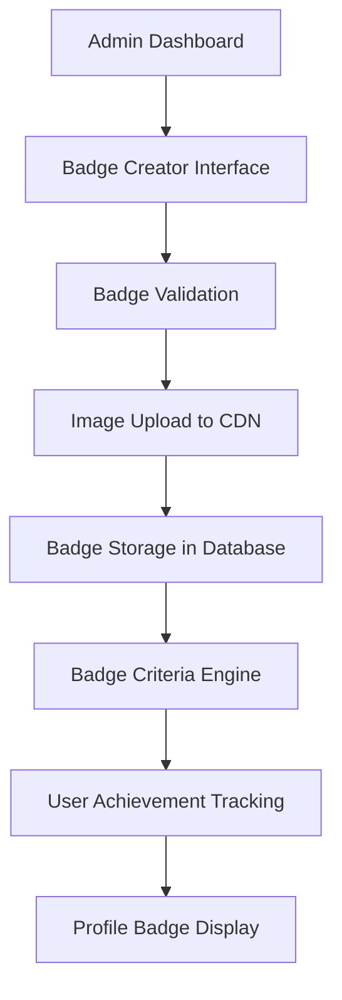

# Badge Management System

## Overview
The Badge Management System enables administrators to create, upload, and manage custom achievement badges that users can earn through various fitness milestones. This system supports scalable badge creation with custom images, criteria, and rewards.

## Purpose
- Allow admins to create unlimited custom badges
- Support badge image uploads (CDN integration)
- Define complex earning criteria (exercise types, counts, streaks)
- Track badge ownership and display on user profiles
- Enable badge trading/gifting between users

## Architecture

## Key Features
- **Custom Badge Creation**: Rich text descriptions, custom images, tiered rewards
- **Flexible Criteria**: Exercise-based, streak-based, social-based achievements
- **CDN Integration**: Fast image loading, global distribution
- **Badge Collections**: Group related badges into collections/series
- **Dynamic Rewards**: Points, titles, profile customizations unlocked
- **Analytics**: Badge earning trends, popular achievements

## Database Schema
- `badges` table: Core badge definitions
- `badge_criteria` table: Complex earning rules
- `user_badges` table: Ownership tracking
- `badge_collections` table: Grouping system

## Security Considerations
- Image upload validation (file type, size, malware scanning)
- Rate limiting on badge creation
- Audit trail for badge modifications
- CDN access controls

## Performance Requirements
- Badge images load in <500ms globally
- Badge earning checks complete in <100ms
- Support 10,000+ active badges
- Handle 1M+ badge ownership records

## Related Components
- User Achievement Profile (displays earned badges)
- Points & Rewards System (badge-associated rewards)
- Admin Gamification Dashboard (badge management interface)