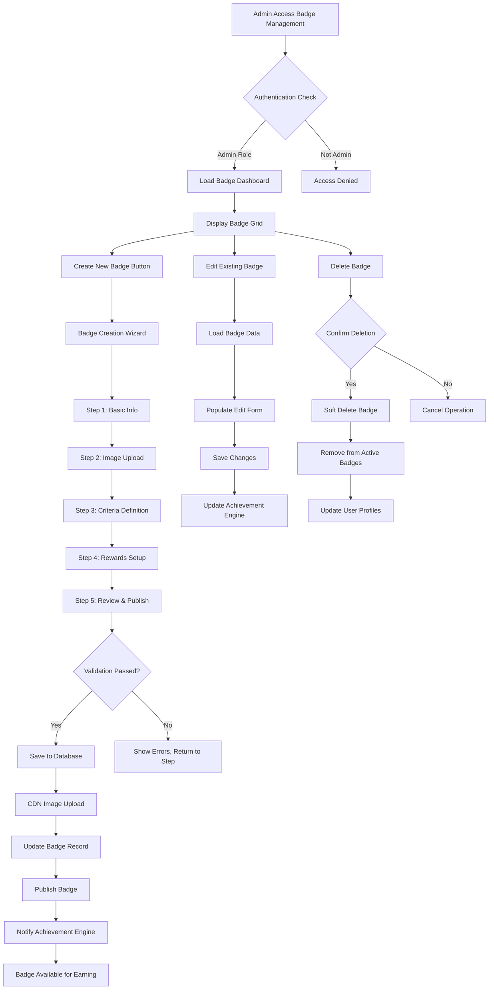
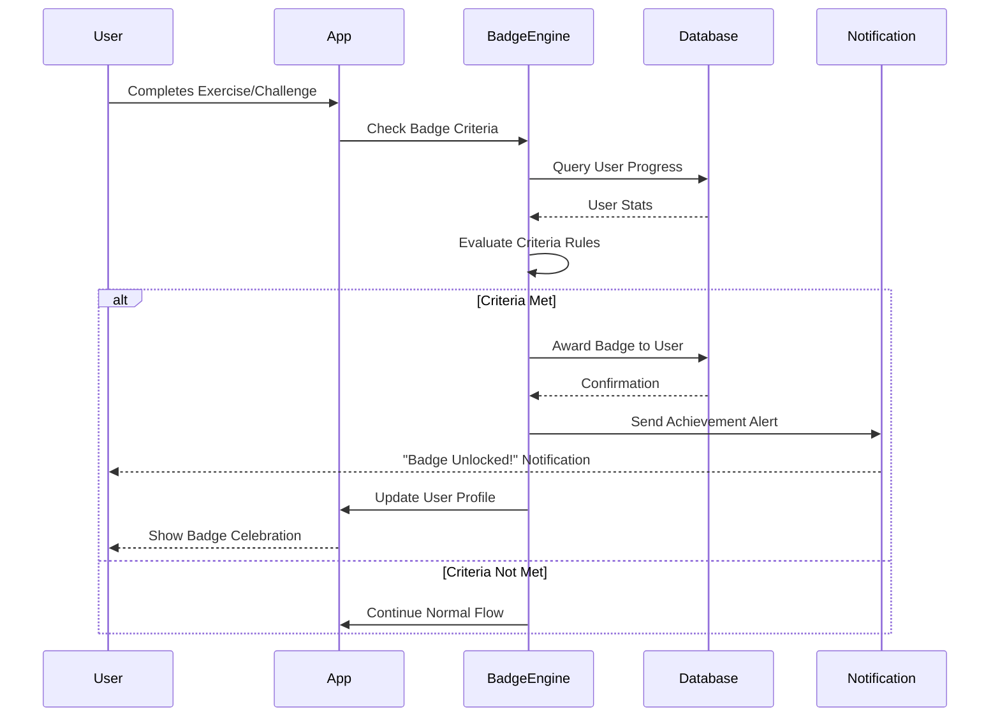
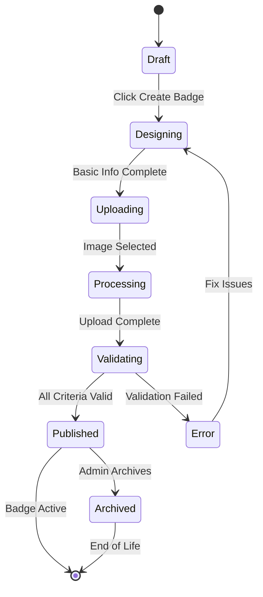
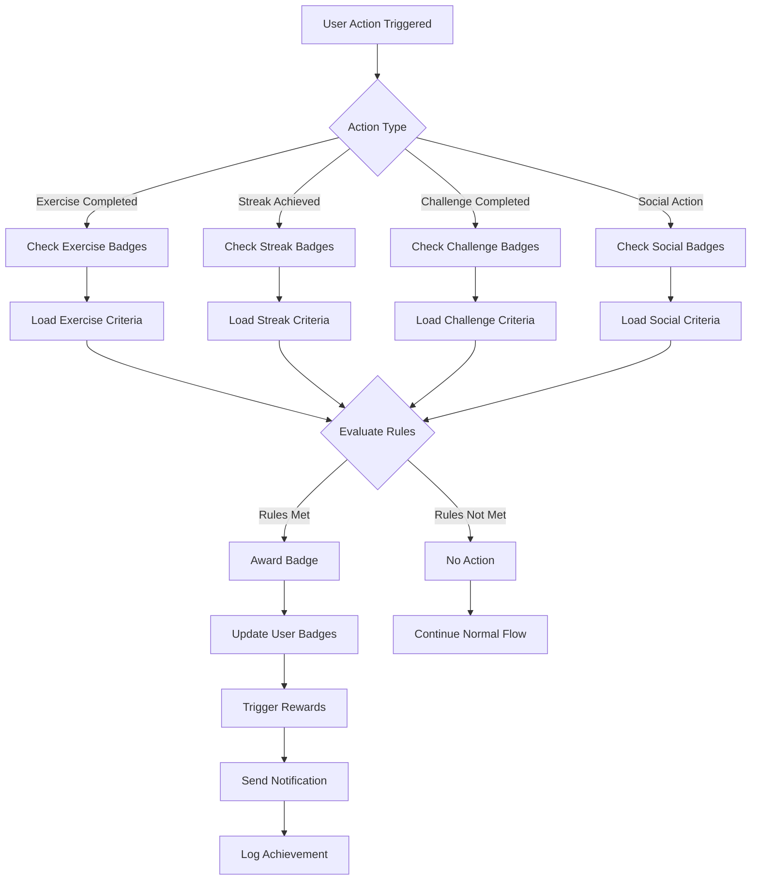
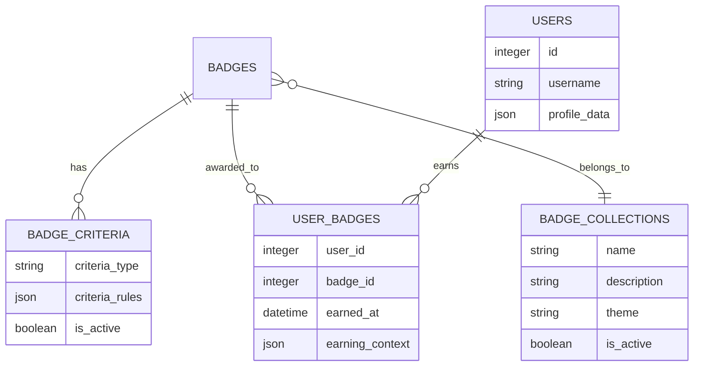
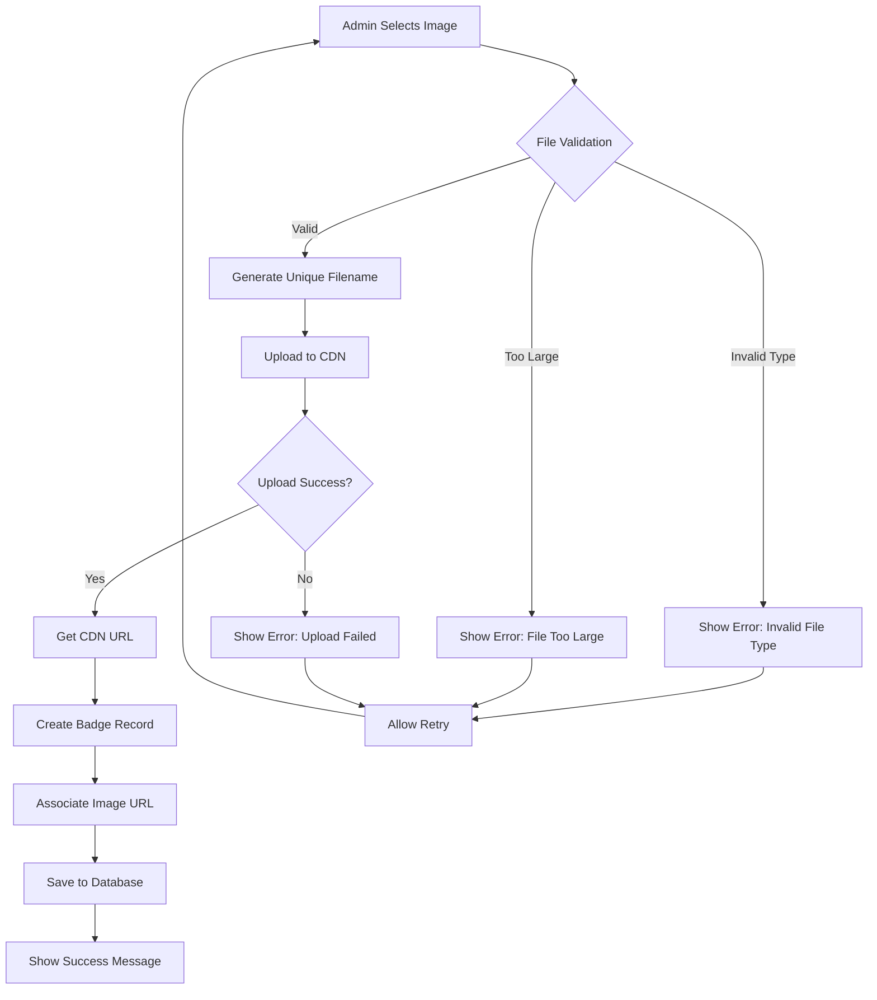

# Badge Management System - Mermaid Diagrams

## System Architecture Flowchart


## Badge Earning Sequence Diagram


## Badge Creation State Diagram


## Badge Criteria Evaluation Flowchart


## Database Relationship Diagram


## Badge Upload Process Flowchart


## Badge Display Component State Diagram
```mermaid
stateDiagram-v2
    [*] --> Loading
    Loading --> Empty : No Badges Earned
    Loading --> Populated : Badges Found
    Loading --> Error : Load Failed

    Populated --> Viewing : User Interacts
    Viewing --> Expanded : Click Badge
    Expanded --> Viewing : Close Modal

    Error --> Retrying : User Retries
    Retrying --> Loading : Retry Load
    Retrying --> Error : Still Failed

    Empty --> Encouraging : Show Call-to-Action
    Encouraging --> [*] : User Dismisses