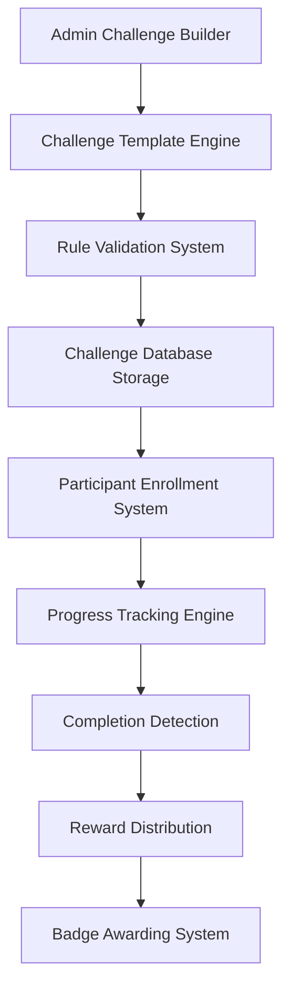

# Challenge Creation System

## Overview
The Challenge Creation System enables administrators to design and deploy custom fitness challenges that users can participate in to earn badges and rewards. This system supports flexible challenge types, participant management, and progress tracking.

## Purpose
- Allow admins to create diverse challenge types (individual, team, time-based)
- Define challenge rules, rewards, and participation criteria
- Track participant progress and completion
- Award badges automatically upon challenge completion
- Support recurring and one-time challenges

## Architecture

## Key Features
- **Challenge Types**: Individual, team-based, time-limited, streak-based
- **Flexible Rules**: Custom scoring systems, participation requirements
- **Progress Tracking**: Real-time updates, leaderboard integration
- **Reward Tiers**: Bronze/silver/gold completion levels
- **Recurring Challenges**: Weekly, monthly, seasonal challenges
- **Social Features**: Team challenges, friend invites, public leaderboards

## Database Schema
- `challenges` table: Challenge definitions and rules
- `challenge_participants` table: Enrollment and progress tracking
- `challenge_rules` table: Complex rule definitions
- `challenge_rewards` table: Tiered reward structures

## Security Considerations
- Challenge rule validation to prevent exploits
- Rate limiting on challenge creation and enrollment
- Audit trail for reward distributions
- Anti-cheating measures for competitive challenges

## Performance Requirements
- Challenge enrollment: <200ms response time
- Progress updates: <100ms for real-time tracking
- Leaderboard queries: <500ms for large challenges
- Support 10,000+ active participants per challenge

## Related Components
- Badge Management System (awards completion badges)
- Points & Rewards System (challenge-associated rewards)
- User Achievement Profile (displays challenge participation)
- Admin Gamification Dashboard (challenge management interface)