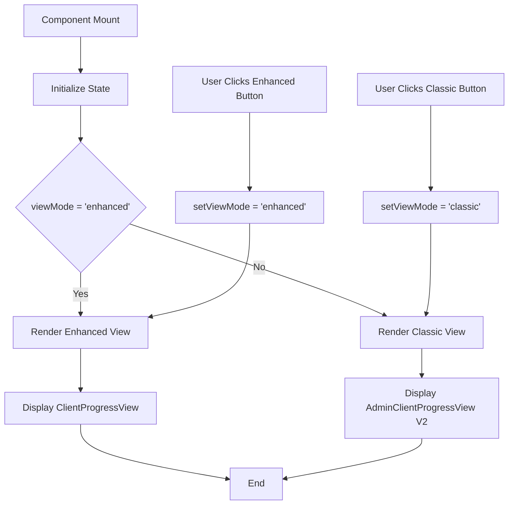
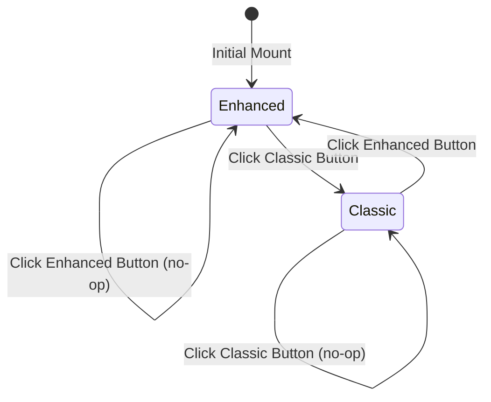

# ClientProgressDashboard - Business Logic Flowchart

**Component:** ClientProgressDashboard
**Created:** 2025-10-29
**Assigned To:** Claude Code

---

## 🎯 COMPONENT FLOW



---

## 🔄 STATE MANAGEMENT

### **Initial State:**
```typescript
viewMode: 'enhanced'  // Default to enhanced view
```

### **State Transitions:**
```
'enhanced' → 'classic'  (User clicks Classic View button)
'classic' → 'enhanced'  (User clicks Enhanced View button)
```

### **State Diagram:**


---

## 🎨 RENDER LOGIC

### **Header Section:**
```
Always Rendered:
├── Page Title: "Client Progress Dashboard"
├── Description: "Monitor and manage client progression..."
└── Note: "Synchronized with trainer dashboard through MCP"
```

### **View Switcher:**
```
Always Rendered:
├── Label: "Choose your preferred view mode..."
├── Classic Button:
│   ├── Variant: contained (if viewMode === 'classic')
│   └── Variant: outlined (if viewMode === 'enhanced')
└── Enhanced Button:
    ├── Variant: contained (if viewMode === 'enhanced')
    └── Variant: outlined (if viewMode === 'classic')
```

### **Content Area:**
```
Conditional Render:
├── If viewMode === 'classic':
│   └── <AdminClientProgressView /> (V2 - MUI-free)
└── If viewMode === 'enhanced':
    └── <ClientProgressView /> (TrainerDashboard component)
```

---

## ⚡ USER INTERACTIONS

### **Interaction 1: Click Classic View Button**
```
User Action: onClick Classic Button
↓
State Update: setViewMode('classic')
↓
Re-render: Conditional switches to Classic view
↓
Display: AdminClientProgressView (V2)
```

### **Interaction 2: Click Enhanced View Button**
```
User Action: onClick Enhanced Button
↓
State Update: setViewMode('enhanced')
↓
Re-render: Conditional switches to Enhanced view
↓
Display: ClientProgressView
```

---

## 🔒 SECURITY CHECKS

### **Access Control:**
```
Component Level: Admin-only (enforced by router)
Child Components:
├── AdminClientProgressView: Enforces admin auth
└── ClientProgressView: Enforces trainer/admin auth
```

**Note:** No additional security checks needed at this component level - handled by routing and child components.

---

## 🚨 ERROR HANDLING

### **Current Error Handling:**
```
None at component level (delegated to child views)
```

### **Potential Errors:**
```
1. Child component render error
   → Caught by React Error Boundary (parent level)

2. Invalid viewMode state
   → TypeScript prevents this (type: 'classic' | 'enhanced')

3. Missing child component
   → Build-time error (import validation)
```

---

## 📊 ANALYTICS EVENTS

### **Recommended Tracking:**
```javascript
// When user switches view mode
trackEvent('client_progress_dashboard_view_switched', {
  from_view: previousViewMode,
  to_view: newViewMode,
  user_role: 'admin'
});

// On component mount
trackEvent('client_progress_dashboard_viewed', {
  initial_view: viewMode,
  user_role: 'admin'
});
```

**Note:** Analytics not currently implemented - recommend adding in future iteration.

---

## 🧪 EDGE CASES

### **Edge Case 1: Rapid View Switching**
**Scenario:** User rapidly clicks between Classic/Enhanced buttons
**Current Behavior:** State updates immediately, component re-renders
**Risk:** LOW (no API calls, no side effects)
**Mitigation:** None needed (React handles this gracefully)

### **Edge Case 2: Child Component Error**
**Scenario:** AdminClientProgressView or ClientProgressView throws error
**Current Behavior:** Error propagates to parent Error Boundary
**Risk:** MEDIUM (could break entire dashboard)
**Mitigation:** Existing Error Boundary in parent layout

### **Edge Case 3: Missing Permissions**
**Scenario:** Non-admin user accesses this route
**Current Behavior:** Router blocks access (handled upstream)
**Risk:** NONE (prevented by routing layer)
**Mitigation:** Existing auth middleware

---

## 🔄 MUI → UI KIT CONVERSION IMPACT

### **Functional Changes:**
```
NONE - Pure UI component swap, zero logic changes
```

### **Visual Changes:**
```
Minor theme adjustments:
├── MUI default theme → Galaxy-Swan theme
├── MUI Paper elevation → Glass effect with backdrop-filter
└── MUI button ripple → Styled-components hover effects
```

### **Behavioral Changes:**
```
NONE - All interactions remain identical
```

---

## ✅ TESTING CHECKLIST

### **Unit Tests:**
- [ ] Component renders with default 'enhanced' view
- [ ] Clicking Classic button switches to Classic view
- [ ] Clicking Enhanced button switches to Enhanced view
- [ ] Button states (contained/outlined) update correctly
- [ ] Child components render based on viewMode

### **Integration Tests:**
- [ ] AdminClientProgressView renders in Classic mode
- [ ] ClientProgressView renders in Enhanced mode
- [ ] View switching works without errors

### **Visual Tests:**
- [ ] Galaxy-Swan theme applied correctly
- [ ] Buttons display contained/outlined variants
- [ ] Responsive layout works (mobile/tablet/desktop)
- [ ] Glass effect on card looks correct

---

## 📝 IMPLEMENTATION NOTES

**Before Conversion:**
```typescript
// MUI imports
import { Box, Typography, Paper, Button } from '@mui/material';

// MUI styling
<Box sx={{ p: 3 }}>
  <Paper sx={{ mb: 3, p: 2 }}>
    <Button variant="contained">
```

**After Conversion:**
```typescript
// UI Kit imports
import styled from 'styled-components';
import { Container, H4, Text, Card, Button } from 'ui-kit';

// Styled-components styling
<Container padding="1.5rem">
  <Card marginBottom="1.5rem" padding="1rem">
    <Button variant="contained">
```

**No Logic Changes** - Only imports and styling syntax

---

**Status:** ✅ READY FOR CONVERSION
**Estimated Time:** 15 minutes
**Risk Level:** LOW
