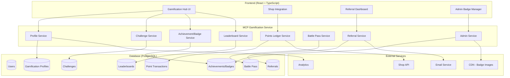
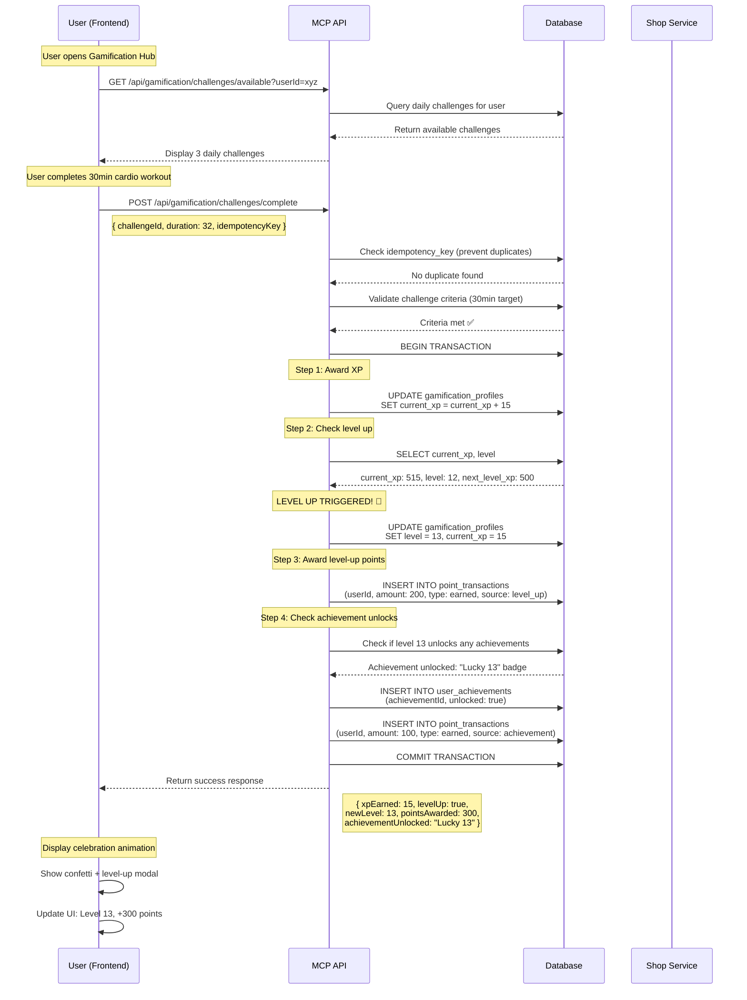
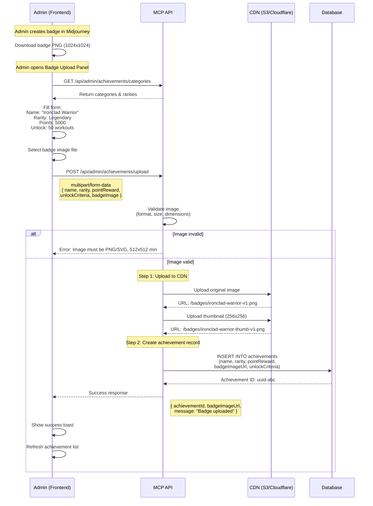
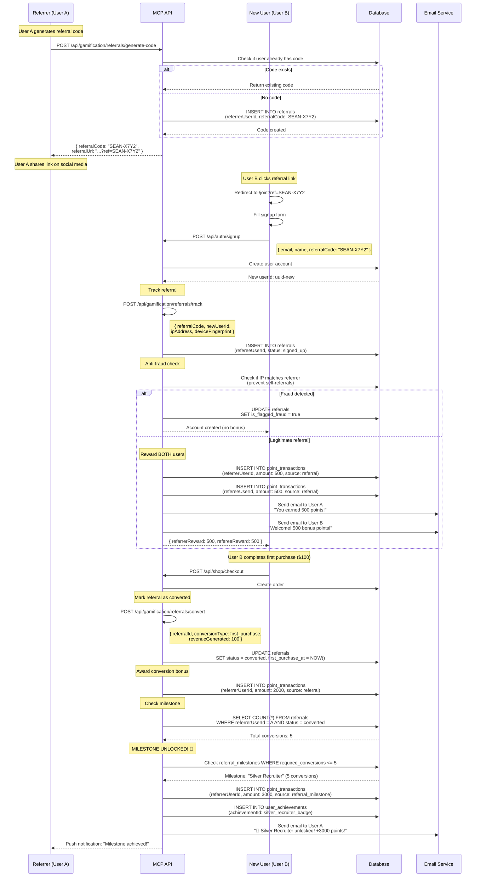
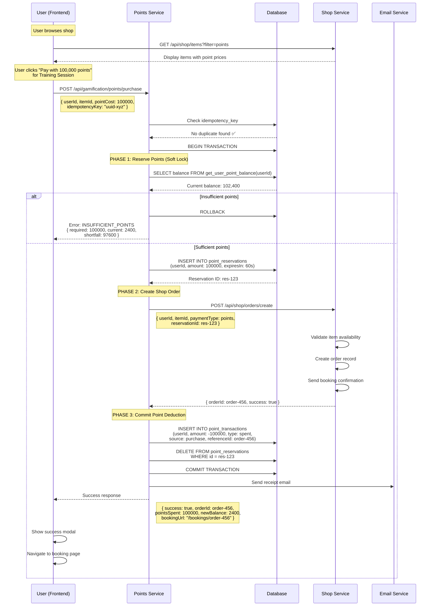

# 🎮 ROO CODE: GAMIFICATION SYSTEM IMPLEMENTATION BLUEPRINT

## 📋 Document Purpose

This is the **comprehensive backend implementation blueprint** for Roo Code to build SwanStudios' gamification system with:
- **Zero ambiguity** - Every endpoint, schema, and flow documented
- **Future-proof architecture** - Easy to add challenges, badges, events
- **Strong referral system** - Viral growth mechanics with best practices
- **Custom badge uploads** - Midjourney/AI-generated badge integration
- **Option A currency model** - 1 point = $0.001 (sustainable economics)
- **Complete wireframes** - Every click, every API call, every state change

---

## 🎯 Core Requirements (Parsed from User)

### 1. **Blueprint-First Development** (NOT Vibe Coding)
> "we cant be vibe coding this has to be built off a solid blueprint"

**Translation**: Every feature must have:
- ✅ Database schema (tables, indexes, constraints)
- ✅ API endpoints (request/response contracts)
- ✅ Mermaid flow diagrams (user interactions → API calls → state changes)
- ✅ Click-by-click wireframes (no guessing UX flows)
- ✅ Edge cases documented (errors, race conditions, rollbacks)

### 2. **Future-Proof Extensibility**
> "built in a way where we will add features in the future or challenges or badges etc"

**Translation**: Architecture must support:
- ✅ Adding new challenge types without code changes (data-driven config)
- ✅ Adding new badge rarities/categories via admin panel
- ✅ Extending reward types (points, XP, items, power-ups, titles)
- ✅ Seasonal events/campaigns without backend redeployment

### 3. **Custom Badge Upload System**
> "I want to be able to upload badges i create via midjourney... simple badges and rare badges"

**Translation**:
- ✅ Admin panel to upload badge images (PNG/SVG support)
- ✅ Badge metadata (name, description, rarity, unlock criteria)
- ✅ Rarity tiers: Common, Rare, Epic, Legendary, Mythic
- ✅ CDN integration for badge images
- ✅ Versioning (update badge art without breaking existing unlocks)

### 4. **Strong Referral System**
> "push referrals... referral system must be strong... referring new people to the site and new clients"

**Translation**:
- ✅ Referral codes (unique per user, trackable)
- ✅ Multi-tier rewards (referrer + referee both earn)
- ✅ Referral leaderboards (top referrers get bonuses)
- ✅ Milestone rewards (5 referrals = bonus, 10 = mega bonus)
- ✅ Attribution tracking (which referral converted to paying client)
- ✅ Anti-fraud (prevent self-referrals, fake accounts)

### 5. **Option A Currency Model**
> [Selected from previous decision]

**Translation**:
- ✅ 1 point = $0.001 (1,000 pts = $1)
- ✅ Daily max earnings: ~70 pts ($0.07)
- ✅ Monthly target: ~2,100 pts ($2.10)
- ✅ Training session: 100,000 pts ($100 value)
- ✅ Sustainable economics (prevents revenue cannibalization)

---

## 🏗️ System Architecture Overview



---

## 📊 Database Schema (Complete)

### 1. **gamification_profiles** (User Stats)

```sql
CREATE TABLE gamification_profiles (
  id UUID PRIMARY KEY DEFAULT uuid_generate_v4(),
  user_id UUID NOT NULL UNIQUE REFERENCES users(id) ON DELETE CASCADE,

  -- XP System (Leveling - NOT spendable)
  level INTEGER NOT NULL DEFAULT 1 CHECK (level >= 1 AND level <= 100),
  current_xp INTEGER NOT NULL DEFAULT 0 CHECK (current_xp >= 0),
  total_lifetime_xp BIGINT NOT NULL DEFAULT 0 CHECK (total_lifetime_xp >= 0),

  -- Streak System
  current_streak INTEGER NOT NULL DEFAULT 0 CHECK (current_streak >= 0),
  longest_streak INTEGER NOT NULL DEFAULT 0 CHECK (longest_streak >= 0),
  last_activity_date DATE,
  streak_freezes_available INTEGER NOT NULL DEFAULT 0 CHECK (streak_freezes_available >= 0),

  -- Rest Days (Burnout Prevention)
  rest_days_this_week INTEGER NOT NULL DEFAULT 0 CHECK (rest_days_this_week BETWEEN 0 AND 2),
  scheduled_rest_days JSONB DEFAULT '[]', -- ['2025-11-03', '2025-11-05']

  -- Privacy Settings
  leaderboard_visibility VARCHAR(20) NOT NULL DEFAULT 'friends_only'
    CHECK (leaderboard_visibility IN ('public', 'friends_only', 'private')),
  display_name_type VARCHAR(20) NOT NULL DEFAULT 'username'
    CHECK (display_name_type IN ('real_name', 'username', 'anonymous')),
  show_on_global_leaderboard BOOLEAN NOT NULL DEFAULT FALSE,
  show_on_friends_leaderboard BOOLEAN NOT NULL DEFAULT TRUE,
  show_on_gym_leaderboard BOOLEAN NOT NULL DEFAULT TRUE,

  -- Metadata
  timezone VARCHAR(50) DEFAULT 'America/Los_Angeles',
  onboarding_completed BOOLEAN NOT NULL DEFAULT FALSE,
  ftue_stage INTEGER NOT NULL DEFAULT 1 CHECK (ftue_stage BETWEEN 1 AND 4),
  created_at TIMESTAMP NOT NULL DEFAULT NOW(),
  updated_at TIMESTAMP NOT NULL DEFAULT NOW(),

  -- Indexes
  CONSTRAINT fk_user FOREIGN KEY (user_id) REFERENCES users(id)
);

-- Indexes for performance
CREATE INDEX idx_gamification_level ON gamification_profiles(level DESC);
CREATE INDEX idx_gamification_lifetime_xp ON gamification_profiles(total_lifetime_xp DESC);
CREATE INDEX idx_gamification_streak ON gamification_profiles(current_streak DESC);
CREATE INDEX idx_gamification_last_activity ON gamification_profiles(last_activity_date DESC);
```

---

### 2. **point_transactions** (Double-Entry Ledger)

```sql
CREATE TABLE point_transactions (
  id UUID PRIMARY KEY DEFAULT uuid_generate_v4(),
  user_id UUID NOT NULL REFERENCES users(id) ON DELETE CASCADE,

  -- Transaction Details
  amount INTEGER NOT NULL, -- Positive for earn, negative for spend
  balance_before INTEGER NOT NULL CHECK (balance_before >= 0),
  balance_after INTEGER NOT NULL CHECK (balance_after >= 0),

  -- Classification
  transaction_type VARCHAR(20) NOT NULL
    CHECK (transaction_type IN ('earned', 'spent', 'bonus', 'refund', 'admin_adjustment', 'referral_reward')),
  source VARCHAR(50) NOT NULL
    CHECK (source IN ('level_up', 'achievement', 'battle_pass', 'referral', 'challenge', 'purchase', 'admin', 'weekly_milestone', 'event')),

  -- References
  reference_id UUID, -- ID of challenge, achievement, order, etc.
  reference_type VARCHAR(50), -- 'challenge', 'achievement', 'order', 'referral'

  -- Metadata
  metadata JSONB, -- Flexible storage for challenge_id, achievement_id, etc.
  description TEXT, -- Human-readable description

  -- Idempotency & Audit
  idempotency_key VARCHAR(100) UNIQUE NOT NULL,
  ip_address INET,
  user_agent TEXT,

  -- Timestamps
  created_at TIMESTAMP NOT NULL DEFAULT NOW(),

  -- Constraints
  CONSTRAINT valid_balance_change CHECK (balance_after = balance_before + amount)
);

-- Indexes
CREATE INDEX idx_point_transactions_user ON point_transactions(user_id, created_at DESC);
CREATE INDEX idx_point_transactions_type ON point_transactions(transaction_type, created_at DESC);
CREATE INDEX idx_point_transactions_idempotency ON point_transactions(idempotency_key);

-- Function to get current balance (derived from ledger)
CREATE OR REPLACE FUNCTION get_user_point_balance(p_user_id UUID)
RETURNS INTEGER AS $$
  SELECT COALESCE(SUM(amount), 0)::INTEGER
  FROM point_transactions
  WHERE user_id = p_user_id;
$$ LANGUAGE SQL STABLE;
```

---

### 3. **challenges** (Extensible Challenge System)

```sql
CREATE TABLE challenges (
  id UUID PRIMARY KEY DEFAULT uuid_generate_v4(),

  -- Challenge Definition
  name VARCHAR(200) NOT NULL,
  description TEXT NOT NULL,
  category VARCHAR(50) NOT NULL
    CHECK (category IN ('workout', 'nutrition', 'social', 'streak', 'referral', 'special_event')),

  -- Difficulty & Rewards
  difficulty VARCHAR(20) NOT NULL CHECK (difficulty IN ('easy', 'medium', 'hard', 'legendary')),
  xp_reward INTEGER NOT NULL CHECK (xp_reward >= 0), -- XP for leveling
  point_reward INTEGER NOT NULL DEFAULT 0 CHECK (point_reward >= 0), -- Points for shop (rare)

  -- Recurrence
  recurrence_type VARCHAR(20) NOT NULL
    CHECK (recurrence_type IN ('daily', 'weekly', 'monthly', 'one_time', 'event')),
  reset_time TIME DEFAULT '00:00:00', -- Daily reset at midnight user's timezone

  -- Unlock Criteria
  min_level INTEGER DEFAULT 1,
  required_achievement_id UUID REFERENCES achievements(id),

  -- Completion Criteria (Flexible JSON)
  completion_criteria JSONB NOT NULL,
  /* Examples:
    { "type": "workout_duration", "target": 30, "unit": "minutes" }
    { "type": "log_meals", "target": 3 }
    { "type": "refer_users", "target": 1 }
    { "type": "maintain_streak", "target": 7 }
  */

  -- Validation
  server_validation_required BOOLEAN NOT NULL DEFAULT TRUE, -- If true, client can't self-complete
  verification_source VARCHAR(50), -- 'healthkit', 'google_fit', 'trainer_approval', 'api'

  -- Availability
  is_active BOOLEAN NOT NULL DEFAULT TRUE,
  start_date TIMESTAMP,
  end_date TIMESTAMP,

  -- Metadata
  icon_url VARCHAR(500), -- CDN URL for challenge icon
  created_at TIMESTAMP NOT NULL DEFAULT NOW(),
  updated_at TIMESTAMP NOT NULL DEFAULT NOW()
);

-- Indexes
CREATE INDEX idx_challenges_active ON challenges(is_active, recurrence_type);
CREATE INDEX idx_challenges_category ON challenges(category);
CREATE INDEX idx_challenges_difficulty ON challenges(difficulty);
```

---

### 4. **user_challenge_progress** (Track Completions)

```sql
CREATE TABLE user_challenge_progress (
  id UUID PRIMARY KEY DEFAULT uuid_generate_v4(),
  user_id UUID NOT NULL REFERENCES users(id) ON DELETE CASCADE,
  challenge_id UUID NOT NULL REFERENCES challenges(id) ON DELETE CASCADE,

  -- Progress Tracking
  current_progress INTEGER NOT NULL DEFAULT 0, -- e.g., 25/30 minutes
  target_progress INTEGER NOT NULL, -- e.g., 30 minutes (from challenge definition)
  is_completed BOOLEAN NOT NULL DEFAULT FALSE,

  -- Completion Details
  completed_at TIMESTAMP,
  xp_earned INTEGER DEFAULT 0,
  points_earned INTEGER DEFAULT 0,

  -- Idempotency
  idempotency_key VARCHAR(100) UNIQUE,

  -- Metadata
  verification_data JSONB, -- HealthKit data, trainer notes, etc.

  -- Timestamps
  period_start TIMESTAMP NOT NULL, -- For daily/weekly tracking
  period_end TIMESTAMP NOT NULL,
  created_at TIMESTAMP NOT NULL DEFAULT NOW(),
  updated_at TIMESTAMP NOT NULL DEFAULT NOW(),

  -- Constraints
  CONSTRAINT unique_user_challenge_period UNIQUE (user_id, challenge_id, period_start)
);

-- Indexes
CREATE INDEX idx_user_challenge_progress_user ON user_challenge_progress(user_id, is_completed);
CREATE INDEX idx_user_challenge_progress_challenge ON user_challenge_progress(challenge_id, is_completed);
```

---

### 5. **achievements** (Badge System with Upload Support)

```sql
CREATE TABLE achievements (
  id UUID PRIMARY KEY DEFAULT uuid_generate_v4(),

  -- Achievement Definition
  name VARCHAR(200) NOT NULL UNIQUE,
  description TEXT NOT NULL,
  category VARCHAR(50) NOT NULL
    CHECK (category IN ('workout_milestone', 'nutrition', 'streak', 'social', 'referral', 'special', 'seasonal')),

  -- Rarity System
  rarity VARCHAR(20) NOT NULL DEFAULT 'common'
    CHECK (rarity IN ('common', 'rare', 'epic', 'legendary', 'mythic')),

  -- Rewards
  point_reward INTEGER NOT NULL DEFAULT 0 CHECK (point_reward >= 0),
  title_unlock VARCHAR(100), -- e.g., "Legendary Warrior"
  cosmetic_unlock VARCHAR(100), -- e.g., "golden_border"

  -- Badge Image (Custom Upload)
  badge_image_url VARCHAR(500) NOT NULL, -- CDN URL (uploaded via admin panel)
  badge_thumbnail_url VARCHAR(500), -- 256x256 thumbnail
  badge_version INTEGER NOT NULL DEFAULT 1, -- Increment when updating image

  -- Unlock Criteria (Flexible JSON)
  unlock_criteria JSONB NOT NULL,
  /* Examples:
    { "type": "workout_count", "target": 100 }
    { "type": "streak_days", "target": 365 }
    { "type": "referrals", "target": 10 }
    { "type": "level", "target": 50 }
  */

  -- Display Order & Availability
  sort_order INTEGER NOT NULL DEFAULT 0,
  is_visible BOOLEAN NOT NULL DEFAULT TRUE,
  is_secret BOOLEAN NOT NULL DEFAULT FALSE, -- Hidden until unlocked

  -- Physical Rewards (for Legendary+)
  physical_reward_enabled BOOLEAN NOT NULL DEFAULT FALSE,
  physical_reward_description TEXT,

  -- Metadata
  created_at TIMESTAMP NOT NULL DEFAULT NOW(),
  updated_at TIMESTAMP NOT NULL DEFAULT NOW(),
  created_by UUID REFERENCES users(id) -- Admin who created/uploaded
);

-- Indexes
CREATE INDEX idx_achievements_rarity ON achievements(rarity);
CREATE INDEX idx_achievements_category ON achievements(category);
CREATE INDEX idx_achievements_visible ON achievements(is_visible, sort_order);
```

---

### 6. **user_achievements** (Unlock Tracking)

```sql
CREATE TABLE user_achievements (
  id UUID PRIMARY KEY DEFAULT uuid_generate_v4(),
  user_id UUID NOT NULL REFERENCES users(id) ON DELETE CASCADE,
  achievement_id UUID NOT NULL REFERENCES achievements(id) ON DELETE CASCADE,

  -- Unlock Details
  is_unlocked BOOLEAN NOT NULL DEFAULT FALSE,
  unlocked_at TIMESTAMP,

  -- Progress Tracking (for multi-step achievements)
  current_progress INTEGER NOT NULL DEFAULT 0,
  target_progress INTEGER NOT NULL, -- From achievement.unlock_criteria

  -- Notification
  notification_sent BOOLEAN NOT NULL DEFAULT FALSE,

  -- Timestamps
  created_at TIMESTAMP NOT NULL DEFAULT NOW(),
  updated_at TIMESTAMP NOT NULL DEFAULT NOW(),

  -- Constraints
  CONSTRAINT unique_user_achievement UNIQUE (user_id, achievement_id)
);

-- Indexes
CREATE INDEX idx_user_achievements_user ON user_achievements(user_id, is_unlocked);
CREATE INDEX idx_user_achievements_unlocked_at ON user_achievements(unlocked_at DESC);
```

---

### 7. **referrals** (Viral Growth System)

```sql
CREATE TABLE referrals (
  id UUID PRIMARY KEY DEFAULT uuid_generate_v4(),

  -- Referrer (Person who sent referral)
  referrer_user_id UUID NOT NULL REFERENCES users(id) ON DELETE CASCADE,
  referral_code VARCHAR(20) NOT NULL UNIQUE, -- e.g., "SEAN-SWAN-XYZ"

  -- Referee (Person who was referred)
  referee_user_id UUID REFERENCES users(id) ON DELETE SET NULL,
  referee_email VARCHAR(255), -- Captured even before signup
  referee_name VARCHAR(255),

  -- Status Tracking
  status VARCHAR(20) NOT NULL DEFAULT 'pending'
    CHECK (status IN ('pending', 'signed_up', 'converted', 'paid_client', 'churned')),

  -- Conversion Milestones
  signed_up_at TIMESTAMP,
  first_purchase_at TIMESTAMP,
  first_training_session_at TIMESTAMP,
  total_revenue_generated DECIMAL(10, 2) DEFAULT 0.00,

  -- Rewards Given
  referrer_points_awarded INTEGER DEFAULT 0,
  referee_points_awarded INTEGER DEFAULT 0,
  referrer_milestone_achieved VARCHAR(50), -- 'bronze', 'silver', 'gold', 'platinum'

  -- Attribution
  utm_source VARCHAR(100),
  utm_medium VARCHAR(100),
  utm_campaign VARCHAR(100),
  landing_page VARCHAR(500),

  -- Anti-Fraud
  referee_ip_address INET,
  referee_device_fingerprint VARCHAR(255),
  is_flagged_fraud BOOLEAN NOT NULL DEFAULT FALSE,
  fraud_reason TEXT,

  -- Timestamps
  created_at TIMESTAMP NOT NULL DEFAULT NOW(),
  updated_at TIMESTAMP NOT NULL DEFAULT NOW()
);

-- Indexes
CREATE INDEX idx_referrals_referrer ON referrals(referrer_user_id, status);
CREATE INDEX idx_referrals_code ON referrals(referral_code);
CREATE INDEX idx_referrals_status ON referrals(status, created_at DESC);
CREATE INDEX idx_referrals_fraud ON referrals(is_flagged_fraud) WHERE is_flagged_fraud = TRUE;
```

---

### 8. **referral_milestones** (Tiered Reward System)

```sql
CREATE TABLE referral_milestones (
  id UUID PRIMARY KEY DEFAULT uuid_generate_v4(),

  -- Milestone Definition
  name VARCHAR(100) NOT NULL UNIQUE, -- 'Bronze Recruiter', 'Silver Recruiter', etc.
  tier VARCHAR(20) NOT NULL CHECK (tier IN ('bronze', 'silver', 'gold', 'platinum', 'diamond')),

  -- Requirements
  required_referrals INTEGER NOT NULL, -- e.g., 5 for bronze, 10 for silver
  required_conversions INTEGER, -- Optional: Must have X paying clients

  -- Rewards
  point_reward INTEGER NOT NULL DEFAULT 0,
  badge_achievement_id UUID REFERENCES achievements(id),
  exclusive_perk TEXT, -- e.g., "Free month of premium"

  -- Display
  icon_url VARCHAR(500),
  sort_order INTEGER NOT NULL DEFAULT 0,
  is_active BOOLEAN NOT NULL DEFAULT TRUE,

  created_at TIMESTAMP NOT NULL DEFAULT NOW()
);

-- Seed data
INSERT INTO referral_milestones (name, tier, required_referrals, point_reward, sort_order) VALUES
('Bronze Recruiter', 'bronze', 1, 500, 1),
('Silver Recruiter', 'silver', 5, 3000, 2),
('Gold Recruiter', 'gold', 10, 8000, 3),
('Platinum Recruiter', 'platinum', 25, 25000, 4),
('Diamond Recruiter', 'diamond', 50, 75000, 5);
```

---

### 9. **leaderboards** (Cached Rankings)

```sql
CREATE TABLE leaderboards (
  id UUID PRIMARY KEY DEFAULT uuid_generate_v4(),

  -- Scope
  scope VARCHAR(50) NOT NULL
    CHECK (scope IN ('global', 'gym', 'age_bracket', 'gender')),
  scope_identifier VARCHAR(100), -- gym_id, age bracket '25-34', etc.

  -- Period
  period_type VARCHAR(20) NOT NULL CHECK (period_type IN ('all_time', 'weekly', 'monthly')),
  period_start DATE,
  period_end DATE,

  -- Rankings (Pre-computed for performance)
  rankings JSONB NOT NULL,
  /* Structure:
    [
      { "rank": 1, "userId": "uuid", "displayName": "SwanWarrior", "xp": 45000, "level": 25 },
      { "rank": 2, "userId": "uuid", "displayName": "FitnessBeast", "xp": 42000, "level": 24 },
      ...
    ]
  */

  -- Cache Control
  last_computed_at TIMESTAMP NOT NULL DEFAULT NOW(),
  next_refresh_at TIMESTAMP NOT NULL,

  -- Constraints
  CONSTRAINT unique_leaderboard_scope_period UNIQUE (scope, scope_identifier, period_type, period_start)
);

-- Indexes
CREATE INDEX idx_leaderboards_scope ON leaderboards(scope, period_type);
CREATE INDEX idx_leaderboards_refresh ON leaderboards(next_refresh_at);
```

---

### 10. **battle_pass_seasons** (Seasonal Content)

```sql
CREATE TABLE battle_pass_seasons (
  id UUID PRIMARY KEY DEFAULT uuid_generate_v4(),

  -- Season Info
  name VARCHAR(100) NOT NULL UNIQUE, -- 'Summer Shred 2025'
  season_number INTEGER NOT NULL UNIQUE,

  -- Duration
  start_date TIMESTAMP NOT NULL,
  end_date TIMESTAMP NOT NULL,
  is_active BOOLEAN NOT NULL DEFAULT FALSE,

  -- Structure
  total_tiers INTEGER NOT NULL DEFAULT 50 CHECK (total_tiers > 0),
  xp_per_tier INTEGER NOT NULL DEFAULT 500, -- XP needed per tier

  -- Pricing
  premium_price_usd DECIMAL(10, 2) NOT NULL DEFAULT 29.99,
  premium_price_points INTEGER NOT NULL DEFAULT 30000, -- 30,000 pts = $30

  -- Rewards Config (JSON for flexibility)
  free_track_rewards JSONB NOT NULL,
  premium_track_rewards JSONB NOT NULL,
  /* Structure:
    {
      "tier_1": { "points": 100, "badge": "season_participant" },
      "tier_5": { "points": 200, "item": "protein_sample" },
      "tier_10": { "points": 500, "title": "Summer Warrior" },
      ...
    }
  */

  -- Metadata
  theme_color VARCHAR(7) DEFAULT '#ff9900',
  banner_image_url VARCHAR(500),
  created_at TIMESTAMP NOT NULL DEFAULT NOW(),

  -- Constraints
  CONSTRAINT valid_season_dates CHECK (end_date > start_date)
);

-- Only one active season at a time
CREATE UNIQUE INDEX idx_battle_pass_active ON battle_pass_seasons(is_active) WHERE is_active = TRUE;
```

---

### 11. **user_battle_pass** (User Progress Tracking)

```sql
CREATE TABLE user_battle_pass (
  id UUID PRIMARY KEY DEFAULT uuid_generate_v4(),
  user_id UUID NOT NULL REFERENCES users(id) ON DELETE CASCADE,
  season_id UUID NOT NULL REFERENCES battle_pass_seasons(id) ON DELETE CASCADE,

  -- Track Type
  has_premium BOOLEAN NOT NULL DEFAULT FALSE,
  purchased_at TIMESTAMP,
  purchase_type VARCHAR(20) CHECK (purchase_type IN ('cash', 'points')),

  -- Progress
  current_tier INTEGER NOT NULL DEFAULT 0 CHECK (current_tier >= 0),
  current_tier_xp INTEGER NOT NULL DEFAULT 0,

  -- Claimed Rewards
  claimed_free_rewards JSONB NOT NULL DEFAULT '[]', -- [1, 2, 5, 10]
  claimed_premium_rewards JSONB NOT NULL DEFAULT '[]', -- [1, 2, 5, 10]

  -- Tier Boost Purchases
  tier_boosts_purchased INTEGER NOT NULL DEFAULT 0,

  -- Timestamps
  created_at TIMESTAMP NOT NULL DEFAULT NOW(),
  updated_at TIMESTAMP NOT NULL DEFAULT NOW(),

  -- Constraints
  CONSTRAINT unique_user_season UNIQUE (user_id, season_id)
);

-- Indexes
CREATE INDEX idx_user_battle_pass_user ON user_battle_pass(user_id, season_id);
CREATE INDEX idx_user_battle_pass_premium ON user_battle_pass(has_premium);
```

---

## 🔌 API Endpoints (Complete Contracts)

### **Profile Service**

#### `GET /api/gamification/profile/:userId`

**Description**: Get complete user gamification profile

**Response**:
```typescript
{
  success: true,
  data: {
    // XP & Leveling
    level: 12,
    currentXP: 350,
    nextLevelXP: 500,
    totalLifetimeXP: 5850,
    xpProgress: 70, // Percentage (350/500)

    // Points (Currency)
    points: 2400,
    lifetimePointsEarned: 8900,
    lifetimePointsSpent: 6500,

    // Streak
    currentStreak: 15,
    longestStreak: 28,
    streakFreezesAvailable: 2,

    // Rest Days
    restDaysThisWeek: 1,
    scheduledRestDays: ['2025-11-05'],

    // Privacy
    privacySettings: {
      leaderboardVisibility: 'friends_only',
      displayNameType: 'username',
      showOnGlobalLeaderboard: false
    },

    // FTUE
    onboardingCompleted: true,
    ftueStage: 4
  }
}
```

---

#### `POST /api/gamification/profile/earn-xp`

**Description**: Award XP for workout/activity (server-validated)

**Request**:
```typescript
{
  userId: string,
  xpAmount: number, // Server computes this, client suggests
  source: 'workout' | 'challenge' | 'daily_login',
  metadata: {
    workoutId?: string,
    duration?: number,
    caloriesBurned?: number,
    healthKitData?: object
  },
  idempotencyKey: string
}
```

**Response**:
```typescript
{
  success: true,
  data: {
    xpEarned: 150,
    newTotalXP: 6000,
    levelUp: true, // Did they level up?
    newLevel: 13,
    pointsAwarded: 200, // Level-up bonus
    newPointBalance: 2600
  }
}
```

---

### **Challenge Service**

#### `GET /api/gamification/challenges/available`

**Description**: Get challenges available to user (respects level, recurrence, etc.)

**Query Params**:
- `userId`: string
- `category?`: 'workout' | 'nutrition' | 'social' | 'referral'
- `difficulty?`: 'easy' | 'medium' | 'hard'

**Response**:
```typescript
{
  success: true,
  data: {
    daily: [
      {
        id: 'challenge-uuid',
        name: 'Morning Cardio',
        description: 'Complete 30 minutes of cardio',
        category: 'workout',
        difficulty: 'medium',
        xpReward: 15,
        pointReward: 0,
        completionCriteria: { type: 'workout_duration', target: 30, unit: 'minutes' },
        userProgress: { current: 0, target: 30, isCompleted: false },
        expiresAt: '2025-11-03T23:59:59Z'
      }
    ],
    weekly: [...],
    special: [...]
  }
}
```

---

#### `POST /api/gamification/challenges/complete`

**Description**: Mark challenge as complete (server-validates criteria)

**Request**:
```typescript
{
  userId: string,
  challengeId: string,
  progressData: {
    // For workout duration challenge:
    duration: 32, // minutes
    workoutType: 'cardio',

    // For meal logging:
    mealsLogged: 3,

    // For referrals:
    referralCode: 'SEAN-XYZ'
  },
  verificationData?: {
    healthKitWorkoutId?: string,
    trainerApprovalId?: string
  },
  idempotencyKey: string
}
```

**Response**:
```typescript
{
  success: true,
  data: {
    challengeCompleted: true,
    xpEarned: 15,
    pointsEarned: 0,
    newTotalXP: 6015,
    newPointBalance: 2600,

    // Check for achievement unlocks triggered by this challenge
    achievementsUnlocked: [
      {
        id: 'achievement-uuid',
        name: 'Week Warrior',
        rarity: 'rare',
        pointReward: 100,
        badgeImageUrl: 'https://cdn.swanstudios.com/badges/week-warrior.png'
      }
    ]
  }
}
```

---

### **Achievement/Badge Service**

#### `GET /api/gamification/achievements`

**Description**: Get all achievements (locked + unlocked)

**Query Params**:
- `userId`: string
- `category?`: filter by category
- `rarity?`: filter by rarity
- `includeSecret?`: boolean (default false)

**Response**:
```typescript
{
  success: true,
  data: {
    total: 50,
    unlocked: 12,
    achievements: [
      {
        id: 'achievement-uuid',
        name: 'First Steps',
        description: 'Complete your first workout',
        category: 'workout_milestone',
        rarity: 'common',
        badgeImageUrl: 'https://cdn.swanstudios.com/badges/first-steps-v1.png',
        badgeThumbnailUrl: 'https://cdn.swanstudios.com/badges/first-steps-thumb-v1.png',
        pointReward: 50,

        // User-specific
        isUnlocked: true,
        unlockedAt: '2025-10-15T14:30:00Z',
        progress: { current: 1, target: 1 }
      },
      {
        id: 'achievement-uuid-2',
        name: '100 Workout Legend',
        description: 'Complete 100 workouts',
        category: 'workout_milestone',
        rarity: 'legendary',
        badgeImageUrl: 'https://cdn.swanstudios.com/badges/100-workouts-v2.png',
        pointReward: 5000,
        physicalReward: 'Custom trophy shipped to your door',

        // Locked
        isUnlocked: false,
        progress: { current: 24, target: 100 } // 24% complete
      }
    ]
  }
}
```

---

#### `POST /api/admin/achievements/upload` (Admin Only)

**Description**: Upload custom badge image (Midjourney/AI-generated)

**Request** (multipart/form-data):
```typescript
{
  name: string,
  description: string,
  category: string,
  rarity: 'common' | 'rare' | 'epic' | 'legendary' | 'mythic',
  pointReward: number,
  unlockCriteria: {
    type: 'workout_count' | 'streak_days' | 'referrals' | 'level',
    target: number
  },
  badgeImage: File, // PNG/SVG, max 5MB
  physicalRewardEnabled?: boolean,
  physicalRewardDescription?: string
}
```

**Response**:
```typescript
{
  success: true,
  data: {
    achievementId: 'uuid',
    badgeImageUrl: 'https://cdn.swanstudios.com/badges/custom-badge-v1.png',
    badgeThumbnailUrl: 'https://cdn.swanstudios.com/badges/custom-badge-thumb-v1.png',
    message: 'Badge uploaded and achievement created successfully'
  }
}
```

**Backend Process**:
1. Validate image (PNG/SVG, max 5MB, min 512x512px)
2. Upload to CDN (Cloudflare/AWS S3)
3. Generate thumbnail (256x256)
4. Insert achievement record
5. Return URLs

---

### **Referral Service**

#### `POST /api/gamification/referrals/generate-code`

**Description**: Generate unique referral code for user

**Request**:
```typescript
{
  userId: string
}
```

**Response**:
```typescript
{
  success: true,
  data: {
    referralCode: 'SEAN-SWAN-X7Y2',
    referralUrl: 'https://swanstudios.com/join?ref=SEAN-SWAN-X7Y2',
    sharingMessage: 'Join me at SwanStudios and get 500 bonus points! Use code SEAN-SWAN-X7Y2'
  }
}
```

---

#### `POST /api/gamification/referrals/track`

**Description**: Track referral signup (called when new user signs up with code)

**Request**:
```typescript
{
  referralCode: string,
  newUserId: string,
  newUserEmail: string,
  newUserName: string,
  utmSource?: string,
  utmMedium?: string,
  utmCampaign?: string,
  ipAddress: string,
  deviceFingerprint: string
}
```

**Response**:
```typescript
{
  success: true,
  data: {
    referralId: 'uuid',

    // Rewards for BOTH users
    referrerReward: {
      points: 500, // Immediate reward for successful signup
      message: 'You earned 500 points for referring a friend!'
    },

    refereeReward: {
      points: 500, // New user also gets welcome bonus
      message: 'Welcome! You received 500 bonus points from your referral!'
    }
  }
}
```

---

#### `POST /api/gamification/referrals/convert`

**Description**: Mark referral as converted (when referee makes first purchase)

**Request**:
```typescript
{
  referralId: string,
  conversionType: 'first_purchase' | 'first_training_session',
  revenueGenerated: number
}
```

**Response**:
```typescript
{
  success: true,
  data: {
    // Additional reward for conversion
    referrerReward: {
      points: 2000, // Bigger reward for conversion
      message: 'Your referral made their first purchase! +2000 points!'
    },

    // Check milestone achievements
    milestoneAchieved: {
      name: 'Silver Recruiter',
      tier: 'silver',
      totalReferrals: 5,
      pointReward: 3000,
      badgeUnlocked: 'Silver Recruiter Badge'
    }
  }
}
```

---

#### `GET /api/gamification/referrals/stats/:userId`

**Description**: Get user's referral stats and leaderboard position

**Response**:
```typescript
{
  success: true,
  data: {
    totalReferrals: 8,
    signedUp: 6,
    converted: 4,
    totalPointsEarned: 12500,
    totalRevenueGenerated: 1200.00,

    currentMilestone: {
      name: 'Silver Recruiter',
      tier: 'silver',
      progress: { current: 8, next: 10 }
    },

    nextMilestone: {
      name: 'Gold Recruiter',
      tier: 'gold',
      required: 10,
      reward: 8000
    },

    leaderboardPosition: {
      rank: 12,
      percentile: 85, // Top 15%
      topReferrer: {
        name: 'Alex Chen',
        referrals: 32
      }
    }
  }
}
```

---

### **Leaderboard Service**

#### `GET /api/gamification/leaderboards/:scope`

**Description**: Get leaderboard rankings (cached, fast)

**Path Params**:
- `scope`: 'global' | 'friends' | 'gym'

**Query Params**:
- `userId`: string (required for 'friends' scope)
- `period`: 'all_time' | 'weekly' | 'monthly'
- `limit`: number (default 100, max 500)
- `cursor?`: string (pagination)

**Response**:
```typescript
{
  success: true,
  data: {
    scope: 'global',
    period: 'weekly',
    generatedAt: '2025-11-02T10:00:00Z',
    nextRefresh: '2025-11-02T10:05:00Z',

    userPosition: {
      rank: 42,
      displayName: 'SwanWarrior',
      level: 12,
      xp: 5850,
      percentile: 75
    },

    rankings: [
      {
        rank: 1,
        userId: 'uuid-1',
        displayName: 'FitnessBeast',
        level: 25,
        xp: 45000,
        avatar: 'https://cdn.swanstudios.com/avatars/...'
      },
      {
        rank: 2,
        userId: 'uuid-2',
        displayName: 'IronWarrior',
        level: 24,
        xp: 42000
      },
      // ... top 100
    ],

    // Pagination
    nextCursor: 'eyJsYXN0X3JhbmsiOjEwMH0='
  }
}
```

---

### **Points Ledger Service**

#### `POST /api/gamification/points/purchase`

**Description**: Purchase shop item with points (two-phase commit)

**Request**:
```typescript
{
  userId: string,
  itemId: string,
  itemType: 'training_session' | 'supplement' | 'gear' | 'battle_pass_premium',
  pointCost: number, // Server validates this matches item price
  idempotencyKey: string
}
```

**Response Success**:
```typescript
{
  success: true,
  data: {
    transactionId: 'uuid',
    orderId: 'uuid', // Created in shop system

    // Points deducted
    pointsSpent: 100000,
    newBalance: 2400,

    // Order details
    item: {
      id: 'item-uuid',
      name: '1-on-1 Training Session',
      type: 'training_session'
    },

    // Next steps
    message: 'Purchase successful! Check your email for booking instructions.',
    bookingUrl: '/bookings/uuid'
  }
}
```

**Response Error (Insufficient Points)**:
```typescript
{
  success: false,
  error: {
    code: 'INSUFFICIENT_POINTS',
    message: 'You need 97,600 more points to purchase this item',
    details: {
      required: 100000,
      current: 2400,
      shortfall: 97600,

      // Helpful suggestions
      suggestions: [
        'Complete 3 daily challenges to earn 45 points',
        'Level up to earn 200 bonus points',
        'Refer a friend to earn 500 points'
      ]
    }
  }
}
```

---

#### `GET /api/gamification/points/history/:userId`

**Description**: Get point transaction history (audit trail)

**Query Params**:
- `limit`: number (default 50, max 500)
- `offset`: number
- `type?`: filter by transaction_type
- `startDate?`: ISO date
- `endDate?`: ISO date

**Response**:
```typescript
{
  success: true,
  data: {
    total: 245,
    transactions: [
      {
        id: 'uuid',
        amount: 200,
        balanceBefore: 2200,
        balanceAfter: 2400,
        type: 'earned',
        source: 'level_up',
        description: 'Level 12 → 13 bonus',
        createdAt: '2025-11-02T09:30:00Z'
      },
      {
        id: 'uuid',
        amount: -5000,
        balanceBefore: 7200,
        balanceAfter: 2200,
        type: 'spent',
        source: 'purchase',
        description: 'Purchased: Premium Supplement Bundle',
        metadata: { orderId: 'order-uuid' },
        createdAt: '2025-11-01T14:20:00Z'
      }
    ],

    // Summary
    summary: {
      totalEarned: 8900,
      totalSpent: 6500,
      netBalance: 2400
    }
  }
}
```

---

## 🎨 Complete User Flow Diagrams

### Flow 1: Daily Challenge Completion → XP Gain → Level Up → Point Reward



---

### Flow 2: User Uploads Custom Badge (Admin Panel)



---

### Flow 3: Referral Flow → Signup → Conversion → Milestone Unlock



---

### Flow 4: Point Purchase with Two-Phase Commit



---

## 🛡️ Security & Anti-Fraud Implementation

### 1. **Idempotency Keys** (Prevent Duplicate Claims)

```typescript
// Frontend generates UUID for every write operation
const idempotencyKey = crypto.randomUUID();

// Backend checks before processing
async function completeChallenge(req) {
  const { idempotencyKey } = req.body;

  const existing = await db.query(
    'SELECT * FROM user_challenge_progress WHERE idempotency_key = $1',
    [idempotencyKey]
  );

  if (existing.rows.length > 0) {
    // Return cached result (don't duplicate)
    return existing.rows[0];
  }

  // Proceed with challenge completion...
}
```

---

### 2. **Server-Side Reward Validation** (Never Trust Client)

```typescript
// ❌ BAD: Client sends reward amount
POST /api/challenges/complete
{ challengeId, xpReward: 9999999 } // Client could manipulate this!

// ✅ GOOD: Server determines reward from trusted source
async function completeChallenge(challengeId) {
  // Fetch challenge definition from database (trusted)
  const challenge = await db.query(
    'SELECT xp_reward, point_reward FROM challenges WHERE id = $1',
    [challengeId]
  );

  const xpReward = challenge.rows[0].xp_reward; // Server-controlled value

  // Award XP based on server data only
  await awardXP(userId, xpReward);
}
```

---

### 3. **Rate Limiting** (Prevent Spam/Abuse)

```typescript
// Rate limits per endpoint
const rateLimits = {
  'POST /api/gamification/challenges/complete': {
    maxRequests: 10,
    windowMs: 86400000 // 10 challenges per 24h
  },
  'POST /api/gamification/points/purchase': {
    maxRequests: 5,
    windowMs: 3600000 // 5 purchases per hour
  },
  'POST /api/gamification/referrals/track': {
    maxRequests: 3,
    windowMs: 86400000 // 3 referrals per day
  }
};

// Middleware
app.use(rateLimit(rateLimits));
```

---

### 4. **Anti-Referral Fraud**

```typescript
async function trackReferral(referralCode, newUserId, ipAddress, deviceFingerprint) {
  const referral = await db.query(
    'SELECT referrer_user_id FROM referrals WHERE referral_code = $1',
    [referralCode]
  );

  const referrerId = referral.rows[0].referrer_user_id;

  // Check 1: Self-referral (same user)
  if (referrerId === newUserId) {
    await flagFraud(referralCode, 'Self-referral detected');
    return { success: false, error: 'Invalid referral code' };
  }

  // Check 2: IP address match (same device)
  const referrerIP = await db.query(
    'SELECT last_login_ip FROM users WHERE id = $1',
    [referrerId]
  );

  if (referrerIP.rows[0].last_login_ip === ipAddress) {
    await flagFraud(referralCode, 'Same IP as referrer');
    return { success: false, error: 'Invalid referral' };
  }

  // Check 3: Device fingerprint match
  const referrerDevice = await db.query(
    'SELECT device_fingerprint FROM users WHERE id = $1',
    [referrerId]
  );

  if (referrerDevice.rows[0].device_fingerprint === deviceFingerprint) {
    await flagFraud(referralCode, 'Same device as referrer');
    return { success: false, error: 'Invalid referral' };
  }

  // Check 4: Too many referrals from same IP (bot farm)
  const ipReferralCount = await db.query(
    'SELECT COUNT(*) FROM referrals WHERE referee_ip_address = $1 AND created_at > NOW() - INTERVAL \'7 days\'',
    [ipAddress]
  );

  if (ipReferralCount.rows[0].count > 3) {
    await flagFraud(referralCode, 'Too many referrals from same IP');
    return { success: false, error: 'Suspicious activity detected' };
  }

  // All checks passed - legitimate referral
  return { success: true };
}
```

---

## 🎨 Admin Panel Wireframes

### Badge Upload Interface

```
┌─────────────────────────────────────────────────────────────┐
│  SwanStudios Admin - Create Achievement Badge               │
├─────────────────────────────────────────────────────────────┤
│                                                              │
│  Step 1: Upload Badge Image                                 │
│  ┌──────────────────────────────────────────────────────┐   │
│  │                                                        │   │
│  │         [Drag & Drop or Click to Upload]              │   │
│  │                                                        │   │
│  │         Supported: PNG, SVG                           │   │
│  │         Min size: 512x512px                           │   │
│  │         Max size: 5MB                                 │   │
│  │                                                        │   │
│  └──────────────────────────────────────────────────────┘   │
│                                                              │
│  Preview:                                                    │
│  ┌──────────┐  ┌──────────┐                                │
│  │  [BADGE] │  │  [THUMB] │                                │
│  │ 1024x1024│  │  256x256 │                                │
│  └──────────┘  └──────────┘                                │
│                                                              │
│  Step 2: Badge Details                                      │
│  ┌──────────────────────────────────────────────────────┐   │
│  │ Name: [Ironclad Warrior________________]             │   │
│  │                                                        │   │
│  │ Description:                                          │   │
│  │ [Unlock this legendary badge by completing 50______] │   │
│  │ [strength training workouts_________________________] │   │
│  │                                                        │   │
│  │ Category: [Workout Milestone ▼]                      │   │
│  │                                                        │   │
│  │ Rarity: ○ Common  ○ Rare  ● Legendary  ○ Mythic     │   │
│  │                                                        │   │
│  │ Point Reward: [5000_____] points                     │   │
│  │                                                        │   │
│  │ Unlock Criteria:                                      │   │
│  │   Type: [Workout Count ▼]                            │   │
│  │   Target: [50_____] workouts                         │   │
│  │                                                        │   │
│  │ ☑ Physical Reward (for Legendary/Mythic only)       │   │
│  │   Description: [Custom trophy shipped to door_____]  │   │
│  └──────────────────────────────────────────────────────┘   │
│                                                              │
│  [Cancel]                              [Create Badge →]     │
│                                                              │
└─────────────────────────────────────────────────────────────┘
```

---

## 🚀 Deployment Checklist

### Phase 0: Database Setup
- [ ] Run all schema migrations (11 tables)
- [ ] Create indexes (performance)
- [ ] Seed initial data:
  - [ ] 20 default challenges (daily, weekly, special)
  - [ ] 30 default achievements (common → legendary)
  - [ ] 5 referral milestones (bronze → diamond)
  - [ ] 1 battle pass season (Summer Shred 2025)
- [ ] Test point balance function (get_user_point_balance)

### Phase 1: Core API Endpoints
- [ ] Profile Service (GET profile, POST earn-xp)
- [ ] Challenge Service (GET available, POST complete)
- [ ] Achievement Service (GET achievements)
- [ ] Points Ledger (POST purchase, GET history)
- [ ] Add idempotency checks to all write endpoints
- [ ] Add rate limiting middleware
- [ ] Test two-phase commit rollback

### Phase 2: Referral System
- [ ] Referral Service (POST generate-code, POST track, POST convert)
- [ ] GET referral stats endpoint
- [ ] Anti-fraud checks (IP, device, self-referral)
- [ ] Email integration (referral notifications)
- [ ] Test milestone unlocking

### Phase 3: Admin Panel
- [ ] Badge upload endpoint (POST /admin/achievements/upload)
- [ ] CDN integration (S3/Cloudflare)
- [ ] Image validation (size, format, dimensions)
- [ ] Thumbnail generation (ImageMagick/Sharp)
- [ ] Admin authentication (role check)

### Phase 4: Leaderboards & Battle Pass
- [ ] Leaderboard caching (Redis)
- [ ] GET leaderboards endpoint (global, friends, gym)
- [ ] Battle pass endpoints (GET, POST claim, POST purchase)
- [ ] Weekly leaderboard refresh job (cron)

---

## 📈 Success Metrics

### Technical Metrics
- API response time p95: < 200ms
- Point transaction accuracy: 100% (no duplicate/missing points)
- Fraud detection rate: > 95%
- CDN badge load time: < 500ms

### Business Metrics
- Referral signups: 30% of new users (target)
- Referral conversions: 15% of referrals become paying clients
- Point redemptions: 25% of users redeem monthly
- Badge unlocks: 60% of users unlock 1+ achievement per week

---

**END OF ROO CODE IMPLEMENTATION BLUEPRINT**

This blueprint provides zero-ambiguity specifications for building a production-ready gamification system with extensibility, security, and viral growth mechanics.
