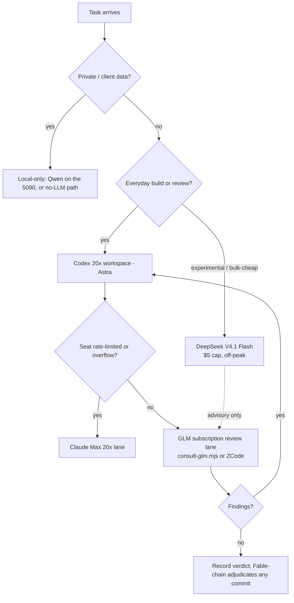

# Provider & Subscription Routing — Sean's stack

**Established 2026-09-11 by Sean.** Canonical answer to "which model, on which
harness, at what cost, for which job." `PANEL-AND-MODEL-ROUTING.md` stays the
truth for the 6-seat hostile-review panel; this doc owns the everyday working
stack that panel sits on top of.

Evidence tags: prices marked **[VERIFIED 2026-09-11]** were read from the
vendor's live page this session. Everything else is Sean-stated or carried from
the 2026-09-10 evaluation session and must be re-checked at renewal — pricing is
live data, not a constant (see the consult-sol.mjs 2× drift lesson in
PANEL-AND-MODEL-ROUTING.md).

## Sean's non-negotiables (why the stack looks like this)

1. **Subscriptions first; APIs are the capped exception.** Unplanned OpenAI API
   spend hit ~$100 in one month, ~$30 of it burned by blue-screen retry loops on
   an unfinished site. Every everyday lane below is flat-rate.
2. **A coding seat must touch the filesystem.** The GLM website chat could not
   read repo files and asked for copy/paste (2026-09-10) — that surface is
   banned for coding work. Every seat below rides a harness with real file +
   terminal tools: Codex IDE/CLI, Claude Code, ZCode, Kilo Code/OpenCode, or the
   repo `consult-*.mjs` scripts.
3. **Disclose worst-case spend first, cap it, never auto-retry a failed paid
   call** (standing Rule 16 discipline; the blue-screen incident is why).
4. **Crashed sessions resume; they do not restart.** The continuity bridge +
   coordination lanes + orient ledger carry state across agent crashes, so a
   blue screen costs minutes, not credits.
5. **GLM routes direct to Z.ai, never OpenRouter** — enforced in code
   (`scripts/lib/redact-egress.mjs`; see Co-Orchestrator Hierarchy in CLAUDE.md).

## The stack (2026-09-11)

| Seat | Harness (local fs + terminal) | Plan / cost | Role | Cap |
|---|---|---|---|---|
| **Astra `gpt-6-astra`** | Codex IDE/CLI/desktop | Codex **$200/mo, 20x** usage [Sean-stated tier math: $100 tier = 5x] | Primary builder, architecture authority, adjudication + repair (Mega Blueprints v3.1 roles) | plan limits only |
| **Claude (Fable/Opus class)** | Claude Code | Claude Max 20x @ **$100/mo** via Sean's teacher discount (list $200) | Final-Decider fallback chain, builder, design | plan limits only |
| **GLM 5.3 / 5.3-Flash** | **Z-App / ZCode** (Z.ai's desktop harness — free app, plan-metered) + `scripts/consult-glm.mjs` for scripted seats | GLM Coding Plan **Pro: $80/mo, 6x Lite usage** [VERIFIED 2026-09-11: Lite $18 · Pro $80 = 6x · Max $168; annual ≈ −30%] | Primary-class builder + hostile-review seat — GLM's intelligence at subscription rates; the same plan also drives Claude Code/Codex/Kilo/OpenCode when a lane needs it | plan meter; scripted seats stay credit-metered 2,000/5h, 10,000/wk [VERIFIED in-repo] |
| **SuperGrok (Grok 4.6/4.7-class)** | Kilo Code / OpenCode (OAuth, local repo) | **$30/mo — confirmed by Sean 2026-09-11** | Independent reviewer seat in the model-diverse review net (differently-trained AIs widen the combined knowledge); advisory only, not a gate | plan limits |
| **DeepSeek V4.1 Flash** | Capped API profile (DeepSeek Harness is dev-preview and mutates shared Codex config — do not route it through the Codex seat) | API **[VERIFIED 2026-09-11]**: cache-miss in $0.15 off-peak / $0.30 peak, out $0.60 / $1.20 per 1M; cache-hit in $0.003 / $0.006 | Cheap experimental builder + benchmark rival. **Never authoritative** | **$5/month hard cap**, off-peak scheduling, no auto-retry |
| **Qwen 3.8 local (5090)** | Ollama, loopback-only | $0, fully private | Advisory seat; standing panel member; never the lead | $0 |
| OpenRouter panel seats (Sol Pro, Kimi, Grok 4.6) | `scripts/consult-panel.mjs` | per-token, per-run | Episodic hostile-review escalation only | Rule 16 `--confirm-spend` per run |

**Monthly base ≈ $410** (Codex 200 + Claude 100 + GLM Pro 80 + SuperGrok 30) +
**≤ $5** DeepSeek + gated OpenRouter panel runs (~$0.08–$0.17 per panel when
approved). Annual billing drops GLM Pro to ≈ $56/mo if Sean wants −30%.
SuperGrok earns its seat by widening the review net; if a quarter of blind
reviews shows no unique catches, it is the first seat to cut.

**Upgrade triggers, not fears:** no second $200 tier gets bought on speculation.
GLM is bought at the Pro $80/6x tier (Sean's call 2026-09-11 — 6x usage beats
Codex $100's 5x at a lower price); further moves only after ~2 weeks of measured
rate-limit pressure on the seat they would relieve.

## DeepSeek operating discipline

- Peak windows are **01:00–04:00 and 06:00–10:00 UTC Mon–Fri**; all other hours
  bill at half price. Queued/batch DeepSeek work runs off-peak.
- Repeated system prompts hit the **cache-hit rate — 50× cheaper** than
  cache-miss. Keep the experimental seat's system prompt stable within a task.
- V4 Pro retires **2026-09-14**: requests route to V4.1 Flash **at Flash prices**
  until V4.1 Pro ships. Do not budget against V4 Pro pricing after that date.

## Task routing

## Relationship to the two review chains

- **Hostile-review panel** (`PANEL-AND-MODEL-ROUTING.md`): fires for formal
  review packets. Its `grok` seat stays **OpenRouter API + `--confirm-spend`**;
  a SuperGrok subscription never routes through OpenRouter and never sets
  `SWAN_GROK_MODEL` — it rides Kilo Code/OpenCode with its own OAuth.
- **SS-PT Mega Blueprints v3.1 build packets** (CLAUDE.md footer): the fixed
  GLM 5.3 → GLM 5.3-Flash → Astra chain with its **zero-paid-API** cap outranks
  this table on those packets. DeepSeek never joins a Rule 46 review chain and
  is **not** a fusion-tier seat (fusion Tiers 0–2 remain the $0 flat-rate
  subscriptions; Tier 3 stays Rule-16 gated).

## Recovery rules (the blue-screen lesson)

- Consult calls stay ≤8,000 output tokens, ≤600 s, one in flight — the v3.1
  footer caps already in CLAUDE.md.
- A crashed or limit-hit session re-enters via the continuity bridge
  (`.ai-workflow/continuity/`) + coordination lanes — never by re-running the
  whole task from zero.
- Suspected runaway = stop first, read the cost/log evidence, then resume with a
  narrower scope. Retrying a failed paid call without a changed request is banned.

## Harness interconnect via MCP — PLANNED (assessed 2026-09-11; build gated on Sean's slice authorization)

**Canonical build packet: `docs/ai-workflow/blueprints/swan-coordination-mcp-2026-09-11/` — PLAN READY (requirements, architecture, contracts, diagrams, wireframes, test plan, slices, hostile review, gate-passed readiness receipt). This section is the summary; the packet governs the build.**

Sean's goal: the GLM (Z-App/ZCode), Claude, Codex, DeepSeek, and Grok harnesses
see and talk to each other in real time, behind the scenes, like API calls.
**Verdict: feasible — as hub-and-spoke MCP, not a peer-to-peer mesh.** MCP is
client→server ("USB-C for AI applications", modelcontextprotocol.io): every
harness is an MCP *client*; the shared brain is an MCP *server* they all connect
to. Prior art exists (Agent-MCP on GitHub — multi-agent coordination over MCP);
A2A is the complementary agents-to-agents protocol, aimed at peers in different
trust domains — not needed for a single-machine fleet.

This repo already proves the pattern two ways: the Rule 67 coordination ledger
(file-based shared state + read-before-edit) and `scripts/fusion-triangle.mjs`
(shared-folder polling board). MCP standardizes the transport so every harness
speaks it natively.

- **Phase 1 — Swan Coordination MCP server** (local Node, loopback): tools
  `claim_files / release_claim / who_is_editing / post_activity /
  get_activity / request_review`; state under `.ai-workflow/`; server-side lock
  enforcement turns Rule 67 from convention into a hard gate.
- **Phase 2 — cross-consult tools**: wrap `consult-*.mjs` as MCP tools
  (`ask_glm`, `ask_grok`, `ask_deepseek`) with the Rule 16 confirm gate enforced
  at the tool layer; the redact-egress z-ai guard stays untouched.
- **Phase 3 — near-always-on awareness**: agents are turn-based — nothing pushes
  into a running turn. Approximate always-on with hook-injected peer digests
  (the prompt-watcher pattern) plus `get_activity` at every decision point.

Guardrails: tiny messages only (awareness cost multiplies across six seats);
T3/T4 approval gates and Fable-chain Final-Decider authority survive; the
file-based lane files stay as the fallback when the server is down; the server
holds state only, never keys (each seat keeps its own auth).

## Watchlist (re-evaluate monthly; nothing here is a gate)

- **GPT-6 Soul** — spotted below Astra in OpenAI's tier stack. If it reaches Codex
  subscriptions as a cheaper coding tier, re-price the Codex seat.
- **Grok 4.7** — [UNVERIFIED 2026-09-11: last confirmed xAI documentation was
  Grok 4.6]. If it ships under SuperGrok, re-run the blind-value test.
- **Muse Glimmer** — ~30B open-weight local agent (RTX-5090-class). Candidate
  for the $0 fully-private lane; not a review authority. Repo already has
  `scripts/consult-muse.mjs` for the cloud seat.
- **Muse Spark 1.3** — runs in Meta's cloud VM, not the local filesystem → fails
  Sean's non-negotiable 2; not a coding seat.
- **Hy4 (770B)** — official free trial only; too large for the 5090; never
  self-hosted, never paid.
- **DeepSeek V4.1 Pro** — expected after the 2026-09-14 Flash routing; re-price
  the experimental cap when it lands.

**Promotion rule:** any new model enters as advisory/experimental first.
Changing the review chain (Rule 46 / Mega Blueprints v3.1 roles) is Sean's
explicit decision, never a drift default.
